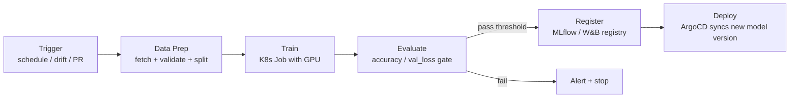
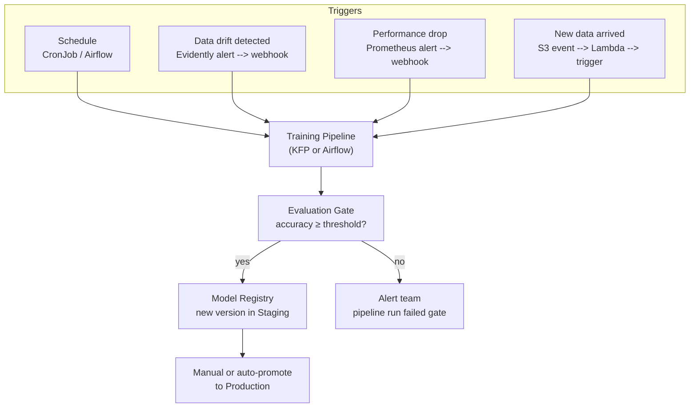

# Training Pipelines

A training pipeline is a CI/CD pipeline for ML: instead of build → test → deploy, it's data-prep → train → evaluate → register → deploy. Each step is a container running on K8s.

Most sections below end with a quick knowledge check — track how many you've cleared as you go:

<div class="quiz-progress" data-quiz-progress>
  <span class="quiz-progress-label">0/0 checks</span>
  <span class="quiz-progress-bar"><span class="quiz-progress-fill"></span></span>
</div>

---

## Pipeline Anatomy



This is identical to your CI/CD pipelines — replace "build Docker image" with "train model", replace "run tests" with "evaluate on holdout set".

<div class="quiz-card">
  <p class="quiz-q">In the pipeline anatomy diagram, what happens if the Evaluate step doesn't meet the accuracy/val_loss threshold?</p>
  <button class="quiz-reveal">Reveal answer</button>
  <div class="quiz-a" hidden>The pipeline follows the "fail" branch to Alert + stop — it never reaches Register or Deploy. Passing the threshold is a hard gate, not a suggestion: a model that doesn't clear it is never registered, let alone deployed.</div>
</div>

---

## Kubeflow Pipelines

Kubeflow Pipelines (KFP) is the K8s-native ML pipeline orchestrator. Pipelines are Python functions decorated with `@component` and connected into a DAG.

### Install

```bash
export PIPELINE_VERSION=2.0.5
kubectl apply -k "github.com/kubeflow/pipelines/manifests/kustomize/cluster-scoped-resources?ref=$PIPELINE_VERSION"
kubectl apply -k "github.com/kubeflow/pipelines/manifests/kustomize/env/dev?ref=$PIPELINE_VERSION"
kubectl port-forward -n kubeflow svc/ml-pipeline-ui 8080:80
```

### Defining pipeline components

Each component runs in its own container. Components communicate by passing file paths (not in-memory objects):

```python
from kfp import dsl, compiler
from kfp.dsl import component, Output, Input, Dataset, Model, Metrics

# Component = one container step
@component(
    base_image="python:3.11-slim",
    packages_to_install=["pandas==2.1.0", "scikit-learn==1.3.0"],
)
def prepare_data(
    data_source: str,
    output_dataset: Output[Dataset],   # file path KFP manages
):
    import pandas as pd
    df = pd.read_parquet(data_source)
    # validate, clean, split
    df.to_parquet(output_dataset.path)


@component(
    base_image="pytorch/pytorch:2.1.0-cuda12.1-cudnn8-runtime",
    packages_to_install=["mlflow==2.9.0"],
)
def train_model(
    dataset: Input[Dataset],
    learning_rate: float,
    epochs: int,
    output_model: Output[Model],
    metrics: Output[Metrics],
):
    import torch, mlflow
    df = pd.read_parquet(dataset.path)
    model = MyModel()
    val_loss = run_training(model, df, learning_rate, epochs)

    # Log to MLflow
    with mlflow.start_run():
        mlflow.log_params({"lr": learning_rate, "epochs": epochs})
        mlflow.log_metric("val_loss", val_loss)
        mlflow.pytorch.save_model(model, output_model.path)

    metrics.log_metric("val_loss", val_loss)
    metrics.log_metric("accuracy", compute_accuracy(model, df))


@component(base_image="python:3.11-slim")
def evaluate_and_gate(
    metrics: Input[Metrics],
    accuracy_threshold: float,
) -> bool:
    accuracy = metrics.metadata["accuracy"]
    return accuracy >= accuracy_threshold   # pipeline stops here if False


@component(base_image="python:3.11-slim", packages_to_install=["mlflow==2.9.0"])
def register_model(
    model: Input[Model],
    model_name: str,
    val_loss: float,
):
    import mlflow
    mlflow.register_model(
        f"file://{model.path}",
        name=model_name,
    )


# Pipeline = DAG connecting components
@dsl.pipeline(name="llm-training-pipeline", description="Weekly retraining pipeline")
def training_pipeline(
    data_source: str = "s3://my-data/latest/",
    learning_rate: float = 0.001,
    epochs: int = 10,
    accuracy_threshold: float = 0.85,
):
    # Step 1: prepare data
    data_step = prepare_data(data_source=data_source)

    # Step 2: train (GPU node)
    train_step = train_model(
        dataset=data_step.outputs["output_dataset"],
        learning_rate=learning_rate,
        epochs=epochs,
    )
    train_step.set_accelerator_type("nvidia.com/gpu")
    train_step.set_accelerator_limit(1)

    # Step 3: quality gate — pipeline stops if accuracy below threshold
    gate_step = evaluate_and_gate(
        metrics=train_step.outputs["metrics"],
        accuracy_threshold=accuracy_threshold,
    )

    # Step 4: register only if gate passed
    with dsl.Condition(gate_step.output == True):
        register_model(
            model=train_step.outputs["output_model"],
            model_name="customer-support-model",
            val_loss=train_step.outputs["metrics"],
        )


# Compile to YAML and submit
compiler.Compiler().compile(training_pipeline, "pipeline.yaml")
```

```bash
# Submit via CLI
kfp run create --experiment-name "weekly-retraining" \
  --pipeline-package-path pipeline.yaml \
  --parameter learning_rate=0.001

# Or via Python SDK
from kfp import Client
client = Client(host="http://localhost:8080")
client.create_run_from_pipeline_func(
    training_pipeline,
    arguments={"learning_rate": 0.001, "epochs": 10}
)
```

Once submitted, KFP walks the DAG one component at a time, each in its own container — step through what actually runs:

<div class="stepper">
  <div class="stepper-panels">
    <div class="stepper-panel active">
      <strong>1. Data prep runs.</strong> <code>prepare_data</code> starts in its own container, fetches from <code>data_source</code>, validates/splits, and writes the result to <code>output_dataset.path</code> — a file, not an in-memory object.
    </div>
    <div class="stepper-panel">
      <strong>2. Train runs on a GPU node.</strong> <code>train_model</code> reads the dataset file KFP just handed it, trains, and writes both a model file and metrics (val_loss, accuracy) as outputs.
    </div>
    <div class="stepper-panel">
      <strong>3. Evaluate-and-gate runs.</strong> <code>evaluate_and_gate</code> reads the metrics artifact and compares accuracy against <code>accuracy_threshold</code>. Returning <code>False</code> here stops the pipeline — nothing downstream runs.
    </div>
    <div class="stepper-panel">
      <strong>4. Conditional register.</strong> Only inside <code>dsl.Condition(gate_step.output == True)</code> does <code>register_model</code> run, pushing the trained model into the MLflow registry.
    </div>
  </div>
  <div class="stepper-controls">
    <button class="stepper-prev">← Prev</button>
    <span class="stepper-dots"></span>
    <span class="stepper-label"></span>
    <button class="stepper-next">Next →</button>
  </div>
</div>

<div class="quiz-card">
  <p class="quiz-q">Why do KFP components pass data to each other as file paths instead of in-memory Python objects?</p>
  <button class="quiz-reveal">Reveal answer</button>
  <div class="quiz-a" hidden>Each component runs in its own separate container — there's no shared process memory to pass an object through. KFP manages the artifact as a file (<code>Output[Dataset]</code>/<code>Input[Dataset]</code> etc.), writing it in one container and reading it back in the next.</div>
</div>

---

## Apache Airflow — Alternative Orchestrator

Airflow DAGs are Python files. More general than KFP (not ML-specific), good when you already have Airflow for data engineering.

```python
from airflow.decorators import dag, task
from airflow.providers.cncf.kubernetes.operators.pod import KubernetesPodOperator
from datetime import datetime, timedelta

@dag(
    schedule_interval="0 2 * * 0",    # every Sunday at 2am
    start_date=datetime(2024, 1, 1),
    catchup=False,
    default_args={"retries": 2, "retry_delay": timedelta(minutes=5)},
)
def weekly_retraining():

    # Step 1: Data prep (no GPU needed)
    data_prep = KubernetesPodOperator(
        task_id="data_prep",
        image="myrepo/data-prep:v1.2",
        cmds=["python", "prepare_data.py"],
        env_vars={"DATA_SOURCE": "s3://my-data/latest/"},
        namespace="ml-pipelines",
        in_cluster=True,
    )

    # Step 2: Training job (GPU node)
    train = KubernetesPodOperator(
        task_id="train",
        image="myrepo/trainer:v1.2",
        cmds=["python", "train.py", "--lr", "0.001"],
        namespace="ml-pipelines",
        in_cluster=True,
        resources={
            "limit_gpu": "1",
            "limit_memory": "32Gi",
            "request_memory": "16Gi",
        },
        node_selector={"accelerator": "nvidia-a100"},
        tolerations=[{
            "key": "nvidia.com/gpu",
            "operator": "Exists",
            "effect": "NoSchedule",
        }],
    )

    # Step 3: Evaluate + register (via MLflow)
    register = KubernetesPodOperator(
        task_id="register",
        image="myrepo/evaluator:v1.2",
        cmds=["python", "evaluate_and_register.py", "--threshold", "0.85"],
        namespace="ml-pipelines",
        in_cluster=True,
    )

    # DAG dependency order
    data_prep >> train >> register

weekly_retraining()
```

<div class="quiz-card">
  <p class="quiz-q">Why does only the <code>train</code> task specify a <code>node_selector</code> and GPU toleration, while <code>data_prep</code> and <code>register</code> don't?</p>
  <button class="quiz-reveal">Reveal answer</button>
  <div class="quiz-a" hidden>Only training needs GPU compute. Pinning every task to the GPU node pool would waste expensive, scarce GPU capacity on work that runs fine on regular CPU nodes — so the node selector and toleration are scoped to just the one task that needs them.</div>
</div>

---

## Kubeflow vs Airflow

| | Kubeflow Pipelines | Apache Airflow |
|--|-------------------|----------------|
| Purpose | ML-native | General workflow |
| DAG definition | Python decorated functions | Python DAG objects |
| Component isolation | Each step = separate container | Operators (can share env) |
| ML artifacts | Built-in tracking (datasets, models) | Manual |
| UI | KFP Dashboard (lineage, metrics) | Airflow UI (task status) |
| K8s integration | Native (runs on K8s only) | Via KubernetesPodOperator |
| Best for | Pure ML teams on K8s | Mixed data/ML teams, existing Airflow |

<div class="quiz-card">
  <p class="quiz-q">Kubeflow Pipelines only runs natively on Kubernetes. How does Airflow reach Kubernetes for the equivalent job?</p>
  <button class="quiz-reveal">Reveal answer</button>
  <div class="quiz-a" hidden>Via <code>KubernetesPodOperator</code> — Airflow itself isn't K8s-native and can run anywhere, but this operator lets a DAG task launch and manage a pod on a cluster, which is exactly how the <code>data_prep</code>/<code>train</code>/<code>register</code> tasks above reach K8s.</div>
</div>

---

## Retraining Triggers



Whichever trigger fires, the run down the middle of that diagram happens in the same order every time — step through it:

<div class="stepper">
  <div class="stepper-panels">
    <div class="stepper-panel active">
      <strong>1. A trigger fires.</strong> One of: a schedule (CronJob/Airflow), Evidently detecting data drift, a Prometheus alert on performance drop, or new data landing in S3.
    </div>
    <div class="stepper-panel">
      <strong>2. Training pipeline runs.</strong> Whichever trigger fired, it kicks off the same training pipeline (KFP or Airflow) from earlier — data prep, train, evaluate.
    </div>
    <div class="stepper-panel">
      <strong>3. Evaluation gate.</strong> Accuracy is checked against the threshold, exactly like in Pipeline Anatomy.
    </div>
    <div class="stepper-panel">
      <strong>4. Gate passes → registry.</strong> The new model version lands in the registry as Staging. If the gate fails, the team gets alerted instead and nothing is promoted.
    </div>
    <div class="stepper-panel">
      <strong>5. Promotion.</strong> A human — or an automated policy — decides whether the Staging version actually becomes Production. Passing the gate does not mean it's live.
    </div>
  </div>
  <div class="stepper-controls">
    <button class="stepper-prev">← Prev</button>
    <span class="stepper-dots"></span>
    <span class="stepper-label"></span>
    <button class="stepper-next">Next →</button>
  </div>
</div>

### Drift-triggered retraining (webhook pattern)

```python
# Evidently generates a report and fires a webhook if drift is detected
# Your pipeline server receives this and starts a run

# FastAPI webhook receiver
@app.post("/webhooks/drift-detected")
async def drift_webhook(payload: dict):
    feature = payload["feature"]
    drift_score = payload["drift_score"]

    if drift_score > 0.3:   # significant drift threshold
        # Trigger Kubeflow pipeline run
        client = kfp.Client(host="http://ml-pipeline.kubeflow:8888")
        client.create_run_from_pipeline_func(
            training_pipeline,
            run_name=f"drift-triggered-{date.today()}",
            arguments={"data_source": "s3://my-data/latest/"},
        )
        return {"triggered": True, "feature": feature}
    return {"triggered": False}
```

<div class="quiz-card">
  <p class="quiz-q">After a model passes the evaluation gate and lands in the registry, is it automatically serving production traffic?</p>
  <button class="quiz-reveal">Reveal answer</button>
  <div class="quiz-a" hidden>No. Passing the gate only gets the new version into the registry as Staging. Promotion to Production is a separate step — manual or governed by an auto-promote policy — not an automatic consequence of clearing the accuracy threshold.</div>
</div>

---

## Pipeline Best Practices

```
✅ Each step = isolated container with pinned dependencies (no shared state)
✅ Log git commit hash in every run (reproducibility)
✅ Always evaluate against a holdout set before registering
✅ Gate on metrics — never auto-promote without passing a threshold
✅ Cache expensive steps (data prep rarely changes between runs)
✅ Use GPU nodes only for training — data prep and eval can use CPU
✅ Store intermediate artifacts in S3/GCS, not PVCs (pipelines are stateless)
❌ Don't put model weights in git
❌ Don't skip the evaluation gate "just this once"
```

<div class="quiz-card">
  <p class="quiz-q">Why should intermediate pipeline artifacts (datasets, models) live in S3/GCS rather than a PVC?</p>
  <button class="quiz-reveal">Reveal answer</button>
  <div class="quiz-a" hidden>Pipelines are meant to be stateless — each run should be reproducible without depending on a persistent volume being attached to the right node or sticking around between runs. Object storage keeps artifacts durable and reachable from any step, regardless of which node ran it.</div>
</div>
