# Monitoring & Observability

Metrics, logs, traces, and alerting — from Prometheus fundamentals to long-term storage and SLO-driven alerting.

## Files

| File | Topics |
|------|--------|
| [prometheus.md](./prometheus.md) | Architecture, data model (4 types + math), TSDB internals, PromQL, scrape config, recording rules, production alerts |
| [alertmanager.md](./alertmanager.md) | Routing tree, grouping, inhibition, silences, complete config, debugging |
| [grafana.md](./grafana.md) | Panel types, variables, USE/RED/SLO dashboards, provisioning as code |
| [alerting-philosophy.md](./alerting-philosophy.md) | Four Golden Signals, symptoms vs causes, alert fatigue, urgency tiers, runbook structure |
| [opentelemetry.md](./opentelemetry.md) | Three pillars (traces/metrics/logs), OTEL Collector, Go SDK, auto-instrumentation |
| [loki.md](./loki.md) | Architecture, labels vs content, LogQL, Promtail, trace correlation, Fluent Bit zero-loss pipeline |
| [performance-debugging.md](./performance-debugging.md) | USE method, RED method, 60-second checklist, Go pprof, bpftrace one-liners |
| [slo-sli.md](./slo-sli.md) | SLI/SLO/Error Budget math, multi-window multi-burn-rate alerts, recording rules, decision framework |
| [thanos-mimir.md](./thanos-mimir.md) | Thanos components, Mimir distributed TSDB, long-term S3 storage, deduplication, downsampling |
| [monitoring-scenarios.md](./monitoring-scenarios.md) | 12 debugging scenarios with Prevention: target DOWN, missing metrics, Prometheus OOM, alert storms |

> Database-specific monitoring (PostgreSQL, MySQL, Redis, MongoDB) lives in [../sre/db-monitoring.md](../sre/db-monitoring.md).

## Read Order

```mermaid
graph LR
    A["prometheus<br/>data model, TSDB, PromQL foundation"] --> B["alertmanager<br/>routing, grouping, inhibition"]
    B --> C["grafana<br/>dashboards (USE/RED/SLO)"]
    C --> D["alerting-philosophy<br/>what to alert on, symptoms vs causes"]
    D --> E["opentelemetry<br/>traces/metrics/logs, OTEL Collector"]
    E --> F["loki<br/>log aggregation, LogQL"]
    F --> G["performance-debugging<br/>USE/RED methods in practice"]
    G --> H["slo-sli<br/>error budgets, burn-rate alerts"]
    H --> I["thanos-mimir<br/>long-term/global metric storage"]
    I --> J["monitoring-scenarios<br/>applied debugging runbooks"]
```

