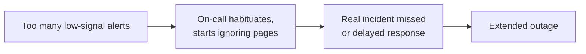
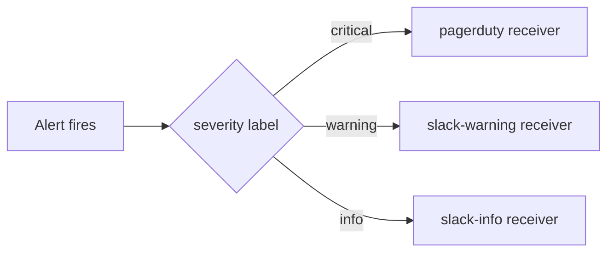

# Alerting Philosophy

<div class="quiz-progress" data-quiz-progress>
  <span class="quiz-progress-label">0/0 checks</span>
  <span class="quiz-progress-bar"><span class="quiz-progress-fill"></span></span>
</div>

---

## The Four Golden Signals

Every service should be monitored across these four dimensions. From the Google SRE Book.

| Signal | What it measures | PromQL example |
|--------|-----------------|----------------|
| **Latency** | Time to serve a request — distinguish successful vs failed latency | `histogram_quantile(0.99, rate(http_request_duration_seconds_bucket[5m]))` |
| **Traffic** | Demand on the system | `rate(http_requests_total[5m])` |
| **Errors** | Rate of requests that fail (explicitly or implicitly) | `rate(http_requests_total{status=~"5.."}[5m]) / rate(http_requests_total[5m])` |
| **Saturation** | How "full" the service is — the resource most constrained | `container_cpu_cfs_throttled_periods_total / container_cpu_cfs_periods_total` |

**Why these four?** They directly map to user experience. A user notices slow responses (latency), errors, and service unavailability (saturation → queue full). Traffic gives context: low error rate during low traffic is different from low error rate during peak.

**Latency trap:** Always separate latency of successful requests from failed ones. Failed requests that return immediately (fast 500s) will artificially improve your p99 latency metric.

```promql
# Correct: latency of successful requests only
histogram_quantile(0.99,
  rate(http_request_duration_seconds_bucket{status!~"5.."}[5m])
)
```

<div class="quiz-card">
  <p class="quiz-q">During an outage, p99 latency suddenly looks great even though users are seeing errors. What's going on?</p>
  <button class="quiz-reveal">Reveal answer</button>
  <div class="quiz-a" hidden>
    The latency metric is mixing successful and failed requests. Failed requests that return immediately (fast 500s) drag the p99 down &mdash; they never do the slow work a successful request does &mdash; artificially improving the metric while users are actually having a worse experience. Always compute latency on successful requests only (<code>status!~"5.."</code>).
  </div>
</div>

---

## Symptoms vs Causes

**Alert on symptoms, not causes.**

A symptom is something the user experiences. A cause is the internal reason it's happening.

<div class="toggle-switch">
  <div class="toggle-buttons">
    <button data-toggle-opt="cause" class="active state-bad">Cause alert</button>
    <button data-toggle-opt="symptom" class="state-ok">Symptom alert</button>
  </div>
  <div class="toggle-panel active" data-toggle-panel="cause">
    <strong>Alerts on the internal reason.</strong> Examples: CPU &gt; 80%, disk usage &gt; 70%, pod restarted, memory growing, DB replica lag &gt; 5s. CPU at 80% usually doesn't hurt users, disk at 70% may be fine for another 30 days &mdash; these fire constantly without real impact, which is exactly what produces alert fatigue.
  </div>
  <div class="toggle-panel" data-toggle-panel="symptom">
    <strong>Alerts on what the user experiences.</strong> Examples: p99 latency &gt; 500ms, error rate &gt; 0.1%, requests failing, SLO burn rate &gt; 6x, checkout success rate &lt; 99%. Directly tied to user impact, self-documenting ("users are experiencing errors" is unambiguous), and one alert covers multiple possible root causes.
  </div>
</div>

| ❌ Cause alert | ✅ Symptom alert |
|---------------|-----------------|
| CPU > 80% | p99 latency > 500ms |
| Disk usage > 70% | Error rate > 0.1% |
| Pod restarted | Requests failing |
| Memory growing | SLO burn rate > 6x |
| DB replica lag > 5s | Checkout success rate < 99% |

**Why cause alerts are bad:**
- CPU at 80% usually doesn't hurt users — the service handles it
- Disk at 70% may be fine for another 30 days
- They fire constantly → alert fatigue → on-call ignores pages → real incidents missed

**Why symptoms are better:**
- Directly tied to user impact
- Self-documenting: "users are experiencing errors" is unambiguous
- Cover multiple root causes with one alert

**Exception:** Use cause alerts as *tickets* (low urgency), not pages. "Disk 70%" creates a ticket for next sprint. "Users can't complete checkout" pages immediately.

<div class="quiz-card">
  <p class="quiz-q">Disk usage on a node just crossed 70%. Should that page on-call at 3am?</p>
  <button class="quiz-reveal">Reveal answer</button>
  <div class="quiz-a" hidden>
    No. Disk at 70% is a cause condition that may be fine for another 30 days &mdash; it's exactly the kind of alert that should become a low-urgency <em>ticket</em> for next sprint, not a page. Reserve pages for symptom alerts like "users can't complete checkout," which page immediately because they're tied directly to user impact.
  </div>
</div>

---

## Alert Fatigue

Alert fatigue: on-call starts ignoring alerts because too many fire without real impact.



**Signs you have alert fatigue:**
- Alerts that fire every week but never cause an incident
- On-call acknowledges alerts without investigating
- "We just silence that one" is normal vocabulary
- Alert history shows > 30% of pages had no action taken

**Fixing alert fatigue:**

1. **Audit every alert:** For each alert, ask "What did I do the last 5 times this fired?" If the answer is "nothing" or "silenced it" → delete it.

2. **Raise thresholds:** An alert that fires at 50% CPU when the system is never impacted until 90% should be at 85%.

3. **Add `for:` duration:** Don't alert on a 1-second spike. Use `for: 5m` to require the condition persists.

4. **Use `inhibit_rules`** in AlertManager: if a high-severity alert is firing, suppress lower-severity alerts for the same service.

5. **Route by urgency:** Not everything needs to wake someone up.

Walk through the same five fixes one at a time:

<div class="stepper">
  <div class="stepper-panels">
    <div class="stepper-panel active">
      <strong>1. Audit every alert.</strong> For each one, ask "What did I do the last 5 times this fired?" If the answer is "nothing" or "silenced it" &mdash; delete it.
    </div>
    <div class="stepper-panel">
      <strong>2. Raise thresholds.</strong> An alert that fires at 50% CPU when the system is never actually impacted until 90% should be set at 85%, not 50%.
    </div>
    <div class="stepper-panel">
      <strong>3. Add a <code>for:</code> duration.</strong> Don't alert on a 1-second spike &mdash; require the condition to persist, e.g. <code>for: 5m</code>.
    </div>
    <div class="stepper-panel">
      <strong>4. Add <code>inhibit_rules</code>.</strong> In AlertManager, if a high-severity alert is already firing for a service, suppress the lower-severity alerts for that same service.
    </div>
    <div class="stepper-panel">
      <strong>5. Route by urgency.</strong> Not everything needs to wake someone up &mdash; spread alerts across severity tiers instead of paging for all of them.
    </div>
  </div>
  <div class="stepper-controls">
    <button class="stepper-prev">← Prev</button>
    <span class="stepper-dots"></span>
    <span class="stepper-label"></span>
    <button class="stepper-next">Next →</button>
  </div>
</div>

<div class="quiz-card">
  <p class="quiz-q">An alert has fired every week for months, and on-call never took action on it. What's the fix?</p>
  <button class="quiz-reveal">Reveal answer</button>
  <div class="quiz-a" hidden>
    Delete it. The audit test is: "What did I do the last 5 times this fired?" If the honest answer is "nothing" or "silenced it," the alert isn't earning its page &mdash; it's just training on-call to ignore pages, which is exactly how real incidents get missed.
  </div>
</div>

---

## Alert Routing by Urgency

```
P1 — Page immediately (wake up at 3am)
  → User-facing service down, SLO burn rate > 14.4x, data loss risk

P2 — Page during on-call hours
  → Significant degradation, SLO burn rate > 6x, partial failure

P3 — Ticket / Slack notification (next business day)
  → SLO burn rate > 3x, resource trending toward exhaustion

P4 — Dashboard annotation / log
  → Informational, no action needed now
```

<div class="toggle-switch">
  <div class="toggle-buttons">
    <button data-toggle-opt="p1" class="active state-bad">P1</button>
    <button data-toggle-opt="p2" class="state-warn">P2</button>
    <button data-toggle-opt="p3" class="state-warn">P3</button>
    <button data-toggle-opt="p4" class="state-ok">P4</button>
  </div>
  <div class="toggle-panel active" data-toggle-panel="p1">
    <strong>Page immediately (wake up at 3am).</strong> User-facing service down, SLO burn rate &gt; 14.4x, data loss risk.
  </div>
  <div class="toggle-panel" data-toggle-panel="p2">
    <strong>Page during on-call hours.</strong> Significant degradation, SLO burn rate &gt; 6x, partial failure.
  </div>
  <div class="toggle-panel" data-toggle-panel="p3">
    <strong>Ticket / Slack notification (next business day).</strong> SLO burn rate &gt; 3x, resource trending toward exhaustion.
  </div>
  <div class="toggle-panel" data-toggle-panel="p4">
    <strong>Dashboard annotation / log.</strong> Informational, no action needed now.
  </div>
</div>

```yaml
# AlertManager routing tree matching this model
route:
  group_by: ['alertname', 'cluster', 'service']
  group_wait: 30s
  group_interval: 5m
  repeat_interval: 4h
  receiver: default-slack

  routes:
  - match:
      severity: critical
    receiver: pagerduty
    continue: false

  - match:
      severity: warning
    receiver: slack-warning
    continue: false

  - match:
      severity: info
    receiver: slack-info
```

Same routing tree, drawn as a decision path:



<div class="quiz-card">
  <p class="quiz-q">An alert's SLO burn rate is sitting at 4x the budget. Does this need to page anyone right now?</p>
  <button class="quiz-reveal">Reveal answer</button>
  <div class="quiz-a" hidden>
    No. 4x clears the P3 threshold (&gt; 3x &mdash; ticket / Slack notification, next business day) but not the P2 threshold (&gt; 6x, which pages during on-call hours). Only burn rates above 14.4x reach P1 and justify waking someone up at 3am.
  </div>
</div>

---

## Alert Design Checklist

For every alert, answer these before merging:

```
□ Does this alert on a symptom (not a cause)?
□ Is there a clear action the on-call must take?
□ Is there a runbook link in the annotation?
□ Does it have a `for:` duration to suppress transient spikes?
□ Has it been tested in staging — does it actually fire when expected?
□ Is the severity correct? (Would you wake someone at 3am for this?)
□ Does it have enough context in annotations to diagnose without extra tools?
□ Is there a corresponding suppression/inhibition rule for related alerts?
```

**Required annotation fields:**
```yaml
annotations:
  summary: "One-line human-readable description"
  description: "Current value: {{ $value }}, threshold: X. What this means."
  runbook: "https://wiki/runbooks/service-name/alert-name"
  dashboard: "https://grafana/d/xxx/service-dashboard"
```

---

## Multi-Window Alerting

Single-threshold alerts have two failure modes:
- **Too sensitive:** fires on 1-minute spikes → false positives, alert fatigue
- **Too slow:** requires long `for:` → misses fast-burning incidents

Solution: alert on the **rate of change** (burn rate) over two time windows simultaneously.

```promql
# Fires only if BOTH short and long windows exceed threshold
# Short window = fast detection, long window = reduces false positives
(
  error_rate_1h > (14.4 * error_budget_ratio)
  AND
  error_rate_5m > (14.4 * error_budget_ratio)
)
```

<div class="quiz-card">
  <p class="quiz-q">Why check the burn rate over two windows (5m and 1h) instead of picking one?</p>
  <button class="quiz-reveal">Reveal answer</button>
  <div class="quiz-a" hidden>
    A single threshold has two failure modes: too sensitive if the window is short (fires on 1-minute spikes, alert fatigue) or too slow if the window is long (misses fast-burning incidents). Requiring both windows to exceed the threshold at once gets the fast detection of the short window plus the false-positive reduction of the long window.
  </div>
</div>

See `slo-sli.md` for the full multi-window burn rate alert tiers.

---

## Runbook Structure

Every P1/P2 alert must link to a runbook. A runbook answers:

```markdown
# Alert: HighErrorBudgetBurn — api service

## What is happening
The API service error rate is > 1.44% (14.4x the SLO budget burn rate).
Users are experiencing errors on ~1 in 70 requests.

## Impact
~1.4% of all API requests are failing. Checkout, user login, and search affected.

## Immediate triage (< 5 min)
1. kubectl get pods -n production -l app=api
2. kubectl logs -n production -l app=api --tail=100 | grep ERROR
3. Check Grafana: [dashboard link]
4. Check recent deployments: kubectl rollout history deployment/api -n production

## Likely causes (most common first)
1. Recent deployment introduced a bug → rollback with kubectl rollout undo
2. Database connection pool exhausted → check RDS connection count
3. Downstream service degraded → check dependency health dashboard

## Escalation
If not resolved in 30 min → escalate to service owner: @team-backend
```

<div class="quiz-card">
  <p class="quiz-q">A P1 alert fires with no runbook link. What's the practical cost of that gap?</p>
  <button class="quiz-reveal">Reveal answer</button>
  <div class="quiz-a" hidden>
    Slow resolution and tribal knowledge &mdash; whoever's on call has to reconstruct triage steps, likely causes, and escalation contacts from memory instead of following a runbook that already answers what's happening, the impact, the immediate triage steps, the likely causes, and who to escalate to.
  </div>
</div>

---

## USE vs RED vs Four Golden Signals

| Framework | Focus | Best for |
|-----------|-------|----------|
| **USE** (Utilization, Saturation, Errors) | Resources (CPU, memory, disk, network) | Infrastructure / node-level monitoring |
| **RED** (Rate, Errors, Duration) | Request-driven services | Microservices, APIs |
| **Four Golden Signals** | User experience | Any user-facing service SLO |

They complement each other:
- USE → tells you *why* (which resource is the bottleneck)
- RED / Golden Signals → tells you *what* the user experiences
- Alert on Golden Signals/RED → investigate with USE

<div class="tab-group">
  <div class="tab-buttons">
    <button data-tab="use" class="active">USE</button>
    <button data-tab="red">RED</button>
    <button data-tab="golden">Four Golden Signals</button>
  </div>
  <div class="tab-panels">
    <div class="tab-panel active" data-tab-panel="use">
      <strong>Utilization, Saturation, Errors.</strong> Focus: resources (CPU, memory, disk, network). Best for infrastructure / node-level monitoring. Tells you <em>why</em> &mdash; which resource is the bottleneck.
    </div>
    <div class="tab-panel" data-tab-panel="red">
      <strong>Rate, Errors, Duration.</strong> Focus: request-driven services. Best for microservices and APIs. Part of what tells you <em>what</em> the user experiences.
    </div>
    <div class="tab-panel" data-tab-panel="golden">
      <strong>Latency, Traffic, Errors, Saturation.</strong> Focus: user experience. Best for any user-facing service SLO. Tells you <em>what</em> the user experiences.
    </div>
  </div>
</div>

<div class="quiz-card">
  <p class="quiz-q">A Golden Signals alert fires for elevated errors. Which framework do you reach for next to find the bottleneck?</p>
  <button class="quiz-reveal">Reveal answer</button>
  <div class="quiz-a" hidden>
    USE. Golden Signals and RED tell you <em>what</em> the user is experiencing; USE tells you <em>why</em> &mdash; which resource (CPU, memory, disk, network) is actually constrained. The pattern is: alert on Golden Signals/RED, investigate with USE.
  </div>
</div>

---

## Common Anti-Patterns

| Anti-pattern | Consequence | Fix |
|---|---|---|
| Alert on every metric | Alert fatigue | Alert on symptoms; use dashboards for exploration |
| No `for:` duration | False positives on transient spikes | Add `for: 5m` minimum |
| Same severity for everything | On-call can't prioritize | 4-tier severity model |
| Alert without runbook | Slow resolution, tribal knowledge | Runbook required for P1/P2 |
| Alert that always resolves itself | Engineers stop caring | Delete it or lower to info |
| Alerting on averages | Hides tail latency problems | Alert on p99, not mean |
| Per-instance alerts (not aggregated) | Noise from single bad replica | Aggregate across replicas first |
