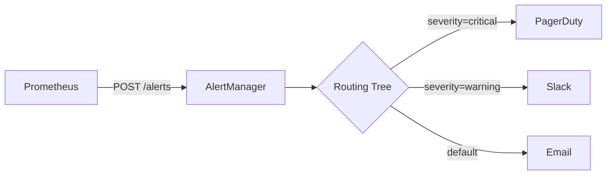
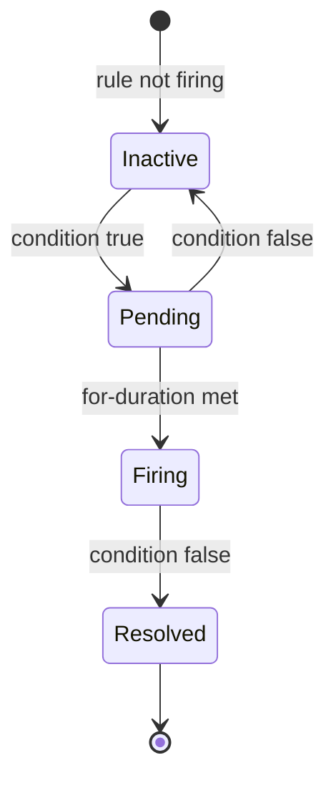
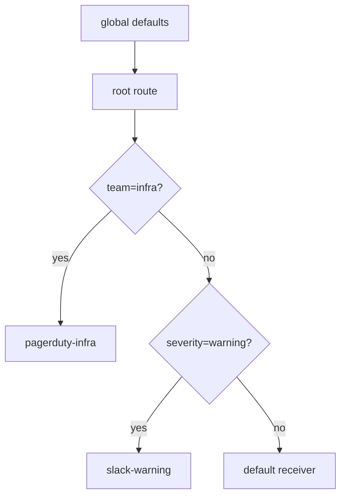
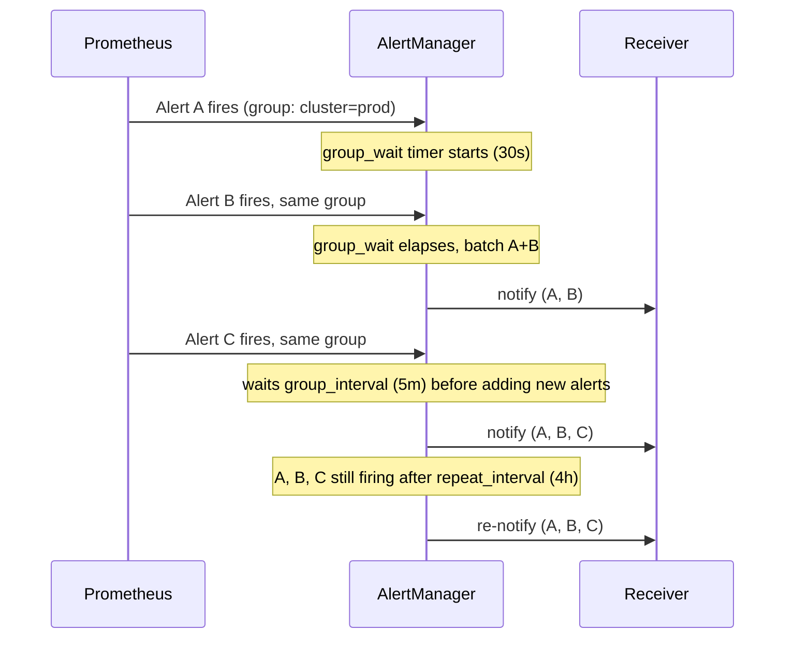

# AlertManager

Prometheus decides *what* is wrong; AlertManager decides *who* hears about it, *how often*, and *whether it's worth waking someone up*. It sits between rule evaluation and a human's phone — deduplicating identical alerts, grouping related ones into a single notification, routing by label match, and suppressing noise via inhibition and silences.

<div class="quiz-progress" data-quiz-progress>
  <span class="quiz-progress-label">0/0 checks</span>
  <span class="quiz-progress-bar"><span class="quiz-progress-fill"></span></span>
</div>

---

## 1. Architecture

Prometheus evaluates rules and pushes firing alerts to AlertManager, which deduplicates, groups, routes, and dispatches notifications.



<div class="quiz-card">
  <p class="quiz-q">Prometheus pushes a firing alert to AlertManager. What four things happen to it before a human sees a notification?</p>
  <button class="quiz-reveal">Reveal answer</button>
  <div class="quiz-a" hidden>AlertManager deduplicates it, groups it with related alerts, routes it through the routing tree to a receiver, and dispatches the notification. Prometheus itself only evaluates rules and fires — none of that downstream handling happens on its side.</div>
</div>

## 2. Alert Lifecycle

An alert transitions through states based on the `for:` duration in the rule and whether it resolves.



| State | Meaning |
|-------|---------|
| Inactive | Rule condition is false |
| Pending | Condition true, waiting `for:` duration |
| Firing | Duration exceeded — alert sent |
| Resolved | Condition cleared, resolve notification sent |

<div class="stepper">
  <div class="stepper-panels">
    <div class="stepper-panel active">
      <strong>1. Inactive.</strong> The rule's condition is false — there's nothing to track yet.
    </div>
    <div class="stepper-panel">
      <strong>2. Pending.</strong> The condition just went true. Prometheus starts counting against the rule's <code>for:</code> duration, but AlertManager hasn't heard anything yet.
    </div>
    <div class="stepper-panel">
      <strong>3. Firing.</strong> The <code>for:</code> duration has been met. Prometheus finally sends the alert to AlertManager — this is the entry point into everything else on this page: grouping, routing, dispatch.
    </div>
    <div class="stepper-panel">
      <strong>4. Resolved.</strong> The condition clears. A resolve notification goes out for the same alert AlertManager already dispatched, closing the loop for whoever got paged.
    </div>
  </div>
  <div class="stepper-controls">
    <button class="stepper-prev">← Prev</button>
    <span class="stepper-dots"></span>
    <span class="stepper-label"></span>
    <button class="stepper-next">Next →</button>
  </div>
</div>

<div class="quiz-card">
  <p class="quiz-q">A rule's condition goes true, then false again 20 seconds later, and the rule has <code>for: 2m</code>. Does AlertManager ever see this alert?</p>
  <button class="quiz-reveal">Reveal answer</button>
  <div class="quiz-a" hidden>No. The condition cleared before the 2-minute <code>for:</code> duration was met, so the alert went Pending → Inactive without ever reaching Firing — and Firing is the only state that gets sent to AlertManager.</div>
</div>

## 3. Routing Tree

Routes are evaluated top-down; first match wins. Each route can override `receiver`, `group_by`, and timing.



<div class="stepper">
  <div class="stepper-panels">
    <div class="stepper-panel active">
      <strong>1. Start at the root route.</strong> Every alert enters here first. The root route's own <code>receiver</code> is the fallback if nothing more specific ever matches.
    </div>
    <div class="stepper-panel">
      <strong>2. Check the first child route.</strong> Is <code>team=infra</code>? Since it's evaluated top-down, this match is tried before anything else — a match here sends the alert to <code>pagerduty-infra</code> and evaluation stops.
    </div>
    <div class="stepper-panel">
      <strong>3. Fall through if it didn't match.</strong> If <code>team=infra</code> didn't match, the tree moves to the next sibling route: <code>severity=warning</code>? A match here sends it to <code>slack-warning</code>.
    </div>
    <div class="stepper-panel">
      <strong>4. Default receiver.</strong> If nothing along the way matched, the alert falls back to the root route's own receiver.
    </div>
  </div>
  <div class="stepper-controls">
    <button class="stepper-prev">← Prev</button>
    <span class="stepper-dots"></span>
    <span class="stepper-label"></span>
    <button class="stepper-next">Next →</button>
  </div>
</div>

<div class="quiz-card">
  <p class="quiz-q">The routing tree checks <code>team=infra?</code> before <code>severity=warning?</code>. An alert arrives with both <code>team=infra</code> and <code>severity=warning</code> set. Which receiver gets it?</p>
  <button class="quiz-reveal">Reveal answer</button>
  <div class="quiz-a" hidden><code>pagerduty-infra</code>. Routes are evaluated top-down and first match wins — since the <code>team=infra</code> check comes first in the tree, it matches and stops evaluation before the <code>severity=warning</code> check is ever reached.</div>
</div>

**Config example:**

```yaml
route:
  receiver: default-receiver
  group_by: [alertname, cluster]
  group_wait: 30s
  group_interval: 5m
  repeat_interval: 4h
  routes:
    - matchers:
        - severity = critical
      receiver: pagerduty-critical
      continue: false
    - matchers:
        - severity = warning
      receiver: slack-warning
```

## 4. Grouping

| Parameter | Purpose | Typical Value |
|-----------|---------|---------------|
| `group_by` | Labels that form a notification group | `[alertname, cluster, namespace]` |
| `group_wait` | Wait before sending first notification | `30s` |
| `group_interval` | Wait before sending added/resolved alerts | `5m` |
| `repeat_interval` | Re-notify if still firing | `4h` |

Grouping prevents alert storms: 100 pods failing → 1 grouped notification.



<div class="stepper">
  <div class="stepper-panels">
    <div class="stepper-panel active">
      <strong>1. First alert in a new group.</strong> AlertManager doesn't notify immediately — it starts the <code>group_wait</code> clock (typically <code>30s</code>), giving related alerts a chance to land in the same batch.
    </div>
    <div class="stepper-panel">
      <strong>2. group_wait elapses.</strong> The first notification goes out, containing every alert that arrived in that window, batched under the labels in <code>group_by</code>.
    </div>
    <div class="stepper-panel">
      <strong>3. A new alert joins the group.</strong> AlertManager doesn't fire off a fresh notification right away — it waits <code>group_interval</code> (typically <code>5m</code>) before sending an updated notification that includes the new alert.
    </div>
    <div class="stepper-panel">
      <strong>4. Still firing, nothing new.</strong> If the group is still active after <code>repeat_interval</code> (typically <code>4h</code>) with no new alerts, AlertManager re-sends the same notification as a reminder.
    </div>
  </div>
  <div class="stepper-controls">
    <button class="stepper-prev">← Prev</button>
    <span class="stepper-dots"></span>
    <span class="stepper-label"></span>
    <button class="stepper-next">Next →</button>
  </div>
</div>

<div class="quiz-card">
  <p class="quiz-q">100 pods fail at once, all sharing the same <code>group_by</code> labels. Roughly how many notifications land in someone's inbox, and why?</p>
  <button class="quiz-reveal">Reveal answer</button>
  <div class="quiz-a" hidden>One grouped notification, not 100. That's the whole point of <code>group_by</code>: alerts sharing the same group labels get batched into a single notification instead of paging once per alert — this is exactly what prevents alert storms.</div>
</div>

## 5. Inhibition

Suppress derived/symptom alerts when the root cause is already firing. Inhibition rules match a **source** alert and silence matching **target** alerts.

```yaml
inhibit_rules:
  - source_matchers:
      - alertname = "NodeDown"
    target_matchers:
      - alertname =~ "Pod.*"
    equal: [cluster, node]
```

If `NodeDown` fires for `node=worker-1`, all `Pod*` alerts on the same node are silenced.

<div class="quiz-card">
  <p class="quiz-q"><code>NodeDown</code> fires for <code>node=worker-2</code>. Fifteen <code>PodCrashLooping</code> alerts fire on <code>worker-2</code>, and one more fires on healthy <code>worker-5</code>. Which of these get silenced by inhibition?</p>
  <button class="quiz-reveal">Reveal answer</button>
  <div class="quiz-a" hidden>Only the 15 alerts on <code>worker-2</code>. Inhibition matches a source alert (<code>NodeDown</code>) against targets (<code>Pod*</code>) using the <code>equal</code> labels — here <code>node</code> — so only targets sharing that label with a firing source get suppressed. The <code>worker-5</code> alert has no matching source firing, so it still pages.</div>
</div>

## 6. Silences

Silences mute alerts matching a set of matchers for a time window. Created via UI or `amtool`.

**Types:**

| Type | Example use |
|------|-------------|
| Time-based | Maintenance window (Sat 02:00–04:00) |
| Matcher-based | Mute specific service during deploy |

```bash
# Create silence for 2 hours on a specific service
amtool silence add alertname="HighErrorRate" service="payments" \
  --duration=2h --comment="Deploying payments v2.3"

# List active silences
amtool silence query

# Expire a silence
amtool silence expire <silence-id>
```

<div class="quiz-card">
  <p class="quiz-q">What two ways can you create a silence in AlertManager?</p>
  <button class="quiz-reveal">Reveal answer</button>
  <div class="quiz-a" hidden>Via the AlertManager UI, or via the <code>amtool</code> CLI (for example <code>amtool silence add ... --duration=2h</code>).</div>
</div>

Grouping, inhibition, and silencing all reduce notification noise, but they solve different problems — worth keeping straight:

<div class="tab-group">
  <div class="tab-buttons">
    <button data-tab="grouping" class="active">Grouping</button>
    <button data-tab="inhibition">Inhibition</button>
    <button data-tab="silence">Silence</button>
  </div>
  <div class="tab-panels">
    <div class="tab-panel active" data-tab-panel="grouping">
      <strong>What:</strong> Batches multiple firing alerts that share <code>group_by</code> labels into one notification.<br/>
      <strong>Trigger:</strong> Automatic, based on labels — no manual rule needed beyond <code>group_by</code>.<br/>
      <strong>Goal:</strong> Fewer notifications for the same incident (100 pods failing → 1 notification), not fewer alerts.
    </div>
    <div class="tab-panel" data-tab-panel="inhibition">
      <strong>What:</strong> Suppresses <em>target</em> alerts entirely while a <em>source</em> alert is firing (e.g. <code>NodeDown</code> silences that node's <code>Pod*</code> alerts).<br/>
      <strong>Trigger:</strong> A matching source alert has to actually be firing right now.<br/>
      <strong>Goal:</strong> Hide symptom alerts that are a known consequence of a root cause that's already paging someone.
    </div>
    <div class="tab-panel" data-tab-panel="silence">
      <strong>What:</strong> Mutes any alert matching a set of matchers for a fixed time window.<br/>
      <strong>Trigger:</strong> Manual — created ahead of time via the UI or <code>amtool</code>.<br/>
      <strong>Goal:</strong> Planned noise suppression (a maintenance window, a deploy) that isn't tied to any other alert's state.
    </div>
  </div>
</div>

## 7. Complete alertmanager.yml

This ties every piece above into one file — global defaults, the routing tree, receivers, and inhibition rules together. The `receivers` block wires up three different notification channels to the same AlertManager instance:

<div class="tab-group">
  <div class="tab-buttons">
    <button data-tab="recv-pd" class="active">PagerDuty</button>
    <button data-tab="recv-slack">Slack</button>
    <button data-tab="recv-email">Email</button>
  </div>
  <div class="tab-panels">
    <div class="tab-panel active" data-tab-panel="recv-pd">
      <code>pagerduty_configs</code> — sends to PagerDuty's Events API v2 via a <code>routing_key</code>, with a templated <code>description</code> and structured <code>details</code> (firing count, cluster). Wired to <code>severity=critical</code> below — the receiver most likely to page someone.
    </div>
    <div class="tab-panel" data-tab-panel="recv-slack">
      <code>slack_configs</code> — posts to an incoming webhook <code>api_url</code>, targeting a <code>channel</code>, with a templated <code>title</code> and <code>text</code> built from <code>.Alerts</code>. Wired to <code>severity=warning</code> below — visible, but not a page.
    </div>
    <div class="tab-panel" data-tab-panel="recv-email">
      <code>email_configs</code> — sends to a fixed <code>to</code> address using the <code>smtp_*</code> settings under <code>global</code>. Used as the <code>default-email</code> fallback receiver for anything that doesn't match a more specific route.
    </div>
  </div>
</div>

```yaml
global:
  resolve_timeout: 5m
  smtp_smarthost: 'smtp.example.com:587'
  smtp_from: 'alertmanager@example.com'
  smtp_auth_username: 'alertmanager'
  smtp_auth_password: 'secret'
  pagerduty_url: 'https://events.pagerduty.com/v2/enqueue'

templates:
  - '/etc/alertmanager/templates/*.tmpl'

route:
  receiver: default-email
  group_by: [alertname, cluster, namespace]
  group_wait: 30s
  group_interval: 5m
  repeat_interval: 4h
  routes:
    - matchers:
        - severity = critical
      receiver: pagerduty-critical
      group_wait: 10s
      repeat_interval: 1h
      continue: false

    - matchers:
        - severity = warning
      receiver: slack-warning
      group_wait: 1m
      repeat_interval: 8h
      continue: false

    - matchers:
        - alertname = Watchdog
      receiver: null-receiver

receivers:
  - name: null-receiver

  - name: pagerduty-critical
    pagerduty_configs:
      - routing_key: '<PAGERDUTY_INTEGRATION_KEY>'
        description: '{{ template "pagerduty.default.description" . }}'
        severity: critical
        details:
          firing: '{{ .Alerts.Firing | len }}'
          cluster: '{{ .CommonLabels.cluster }}'

  - name: slack-warning
    slack_configs:
      - api_url: 'https://hooks.slack.com/services/XXX/YYY/ZZZ'
        channel: '#alerts-warning'
        title: '[{{ .Status | toUpper }}] {{ .CommonLabels.alertname }}'
        text: >-
          {{ range .Alerts }}
          *Alert:* {{ .Annotations.summary }}
          *Severity:* {{ .Labels.severity }}
          *Details:* {{ range .Labels.SortedPairs }} {{ .Name }}={{ .Value }} {{ end }}
          {{ end }}
        send_resolved: true

  - name: default-email
    email_configs:
      - to: 'oncall@example.com'
        send_resolved: true

inhibit_rules:
  - source_matchers:
      - severity = critical
    target_matchers:
      - severity = warning
    equal: [alertname, cluster, namespace]

  - source_matchers:
      - alertname = NodeDown
    target_matchers:
      - alertname =~ "Pod.*"
    equal: [node]
```

## 8. Debugging

**Config validation:**
```bash
amtool check-config /etc/alertmanager/alertmanager.yml
```

**Query active alerts:**
```bash
# All firing alerts
amtool alert query

# Filter by label
amtool alert query severity=critical

# Against a specific AlertManager
amtool alert query --alertmanager.url=http://alertmanager:9093
```

**API endpoints:**
```bash
# List all alerts (v2 API)
curl http://alertmanager:9093/api/v2/alerts | jq .

# List active silences
curl http://alertmanager:9093/api/v2/silences | jq .

# AlertManager status
curl http://alertmanager:9093/api/v2/status | jq .

# Reload config (SIGHUP or POST)
curl -X POST http://alertmanager:9093/-/reload
```

**Common issues:**

| Problem | Check |
|---------|-------|
| Alerts not routing | `amtool config routes test severity=critical` |
| Silence not working | Verify matcher syntax with `amtool silence query` |
| No notifications sent | Check `amtool alert query` — alert must be in AM first |
| Config errors on reload | `amtool check-config` before applying |
