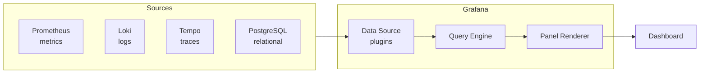
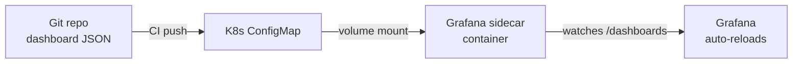
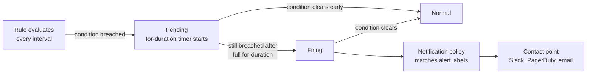

# Grafana

<div class="quiz-progress" data-quiz-progress>
  <span class="quiz-progress-label">0/0 checks</span>
  <span class="quiz-progress-bar"><span class="quiz-progress-fill"></span></span>
</div>

---

## 1. Architecture & Data Sources

Grafana is a visualization layer that queries data sources and renders panels. It does not store metrics — it proxies queries to backends.



| Data Source | Query Language | Best For |
|-------------|---------------|---------|
| Prometheus | PromQL | Metrics, counters, gauges |
| Loki | LogQL | Log streams, structured logs |
| Tempo | TraceQL | Distributed traces, spans |
| PostgreSQL | SQL | Business data, audit logs |

A panel doesn't talk to a backend directly — every query takes the same path from the panel editor to pixels on screen:

<div class="stepper">
  <div class="stepper-panels">
    <div class="stepper-panel active">
      <strong>1. A panel needs data.</strong> Its query editor holds a query in the data source's own language — PromQL, LogQL, TraceQL, or SQL — plus a reference to which data source should run it.
    </div>
    <div class="stepper-panel">
      <strong>2. The right plugin picks it up.</strong> Grafana routes the query to the matching Data Source plugin for that backend — it never talks to Prometheus, Loki, Tempo, or PostgreSQL directly itself.
    </div>
    <div class="stepper-panel">
      <strong>3. The Query Engine executes it.</strong> The plugin hands the translated request to the Query Engine, which sends it over the network to the backend and waits on the response.
    </div>
    <div class="stepper-panel">
      <strong>4. The Panel Renderer draws it.</strong> Returned rows or time series get converted into the panel's visual encoding — lines, bars, table cells, gauge needles — and painted onto the dashboard.
    </div>
  </div>
  <div class="stepper-controls">
    <button class="stepper-prev">← Prev</button>
    <span class="stepper-dots"></span>
    <span class="stepper-label"></span>
    <button class="stepper-next">Next →</button>
  </div>
</div>

<div class="quiz-card">
  <p class="quiz-q">Does Grafana store the metrics, logs, and traces it displays?</p>
  <button class="quiz-reveal">Reveal answer</button>
  <div class="quiz-a" hidden>
    No. Grafana is purely a visualization layer — it does not store data itself, it proxies queries out to whichever backend (Prometheus, Loki, Tempo, PostgreSQL, etc.) actually holds it, through that backend's Data Source plugin.
  </div>
</div>

## 2. Panel Types

| Panel | Use When |
|-------|---------|
| Time series | Metrics over time (latency, RPS, CPU) |
| Stat | Single current value with threshold color |
| Gauge | Value within a min/max range (SLO burn) |
| Table | Multi-dimensional comparison, top-N |
| Heatmap | Latency distribution over time |
| Logs | Log stream output from Loki |

**Picking the right panel:**
- Trending over time → Time series
- "Is it OK right now?" → Stat or Gauge
- "Which pods are slowest?" → Table
- "Where are latency outliers?" → Heatmap
- "What did the app log?" → Logs

<div class="quiz-card">
  <p class="quiz-q">You need to see which of 50 pods has the highest P99 latency right now. Why is a table a better fit here than a time series panel?</p>
  <button class="quiz-reveal">Reveal answer</button>
  <div class="quiz-a" hidden>
    A time series panel would draw 50 overlapping lines — unreadable at a glance. A table is built for multi-dimensional comparison and top-N ranking, so it can sort 50 rows by latency and surface the worst offenders directly.
  </div>
</div>

## 3. Variables

Variables make dashboards reusable across environments, clusters, and services.

```
Dashboard URL: /d/abc?var-cluster=prod&var-namespace=payments
```

**Query variable** — populated from a data source:
```promql
# Variable: cluster
# Query (Prometheus label_values):
label_values(kube_node_info, cluster)
```

**Custom variable** — static list:
```
name: env
values: dev,staging,prod
```

**Interval variable** — for `$__interval` in rate() calls:
```
name: interval
values: 1m,5m,10m,30m
auto: true
```

Use in panels:
```promql
rate(http_requests_total{cluster="$cluster", namespace="$namespace"}[$interval])
```

<div class="tab-group">
  <div class="tab-buttons">
    <button data-tab="queryvar" class="active">Query variable</button>
    <button data-tab="customvar">Custom variable</button>
    <button data-tab="intervalvar">Interval variable</button>
  </div>
  <div class="tab-panels">
    <div class="tab-panel active" data-tab-panel="queryvar">
      <strong>Populated from a data source.</strong> A <code>label_values()</code> query (or equivalent) asks the data source itself for the current list of values — new clusters or namespaces show up automatically as they appear, no dashboard edit required.
    </div>
    <div class="tab-panel" data-tab-panel="customvar">
      <strong>A static, hand-typed list.</strong> Values like <code>dev,staging,prod</code> are fixed in the variable definition. Simple and predictable, but adding a new environment means editing the dashboard.
    </div>
    <div class="tab-panel" data-tab-panel="intervalvar">
      <strong>A list of durations bound to <code>$__interval</code>.</strong> Panels reference it inside <code>rate()</code> calls, so one dashboard can be viewed at a coarse 30m resolution or a fine 1m resolution without editing a single query.
    </div>
  </div>
</div>

<div class="quiz-card">
  <p class="quiz-q">A dashboard hardcodes rate(http_requests_total[5m]) in every panel instead of using the interval variable. What's lost?</p>
  <button class="quiz-reveal">Reveal answer</button>
  <div class="quiz-a" hidden>
    Reusability across time ranges. Variables exist to make a dashboard reusable across environments, clusters, and services — the interval variable does the same job for the query window, letting one dashboard serve a 1m real-time view and a 30m trend view without duplicating panels or editing PromQL by hand.
  </div>
</div>

## 4. USE Method Dashboard

Per resource (CPU, memory, disk, network):

| Row | Metric | PromQL sketch |
|-----|--------|--------------|
| Utilization | % busy | `rate(node_cpu_seconds_total{mode!="idle"}[5m])` |
| Saturation | Run-queue / pressure | `node_pressure_cpu_waiting_seconds_total` |
| Errors | Hardware / kernel errors | `node_disk_io_time_seconds_total` |

**Layout (4 rows × 3 panels):**
```
[CPU Util]  [CPU Saturation]  [CPU Errors]
[Mem Util]  [Mem Saturation]  [OOM Kills ]
[Disk Util] [Disk Saturation] [Disk Errors]
[Net Util]  [Net Saturation]  [Net Errors ]
```

Each panel uses `$node` variable to filter by host.

<div class="quiz-card">
  <p class="quiz-q">In the USE method layout, the Memory row's third column is "OOM Kills" instead of a generic error metric. Why does that still count as the row's Errors column?</p>
  <button class="quiz-reveal">Reveal answer</button>
  <div class="quiz-a" hidden>
    The Errors column is whatever failure signal is most meaningful for that resource — for memory, a process getting OOM-killed <em>is</em> the resource's error condition, the same way hardware or kernel errors are the signal used for CPU, disk, and network.
  </div>
</div>

## 5. RED Method Dashboard

Per service/endpoint:

| Panel | Metric | PromQL sketch |
|-------|--------|--------------|
| Rate | Requests/sec | `sum(rate(http_requests_total[$interval])) by (service)` |
| Errors | Error rate % | `sum(rate(http_requests_total{status=~"5.."}[$interval])) / sum(rate(http_requests_total[$interval]))` |
| Duration | P50/P95/P99 latency | `histogram_quantile(0.99, sum(rate(http_request_duration_seconds_bucket[$interval])) by (le, service))` |

**Layout:**
```
[RPS - all services (time series)]
[Error Rate % (time series)]        [Top errors by service (table)]
[P50 latency] [P95 latency] [P99 latency]
```

<div class="quiz-card">
  <p class="quiz-q">In the RED method, which single panel type is used to show P50, P95, and P99 together, and via which PromQL function?</p>
  <button class="quiz-reveal">Reveal answer</button>
  <div class="quiz-a" hidden>
    <code>histogram_quantile()</code> run against the request-duration histogram buckets — once at 0.50, once at 0.95, once at 0.99 — each as its own Duration panel, laid out side by side.
  </div>
</div>

## 6. SLO Dashboard

```
SLO: 99.9% availability over 30-day rolling window
Error budget: 0.1% = ~43 minutes/month
```

| Panel | Formula |
|-------|---------|
| Availability % | `1 - (errors / total)` over 30d |
| Error budget remaining | `budget_total - errors_consumed` |
| Burn rate (1h) | `error_rate_1h / (1 - SLO_target)` |
| Burn rate (6h) | same, 6h window |
| Budget exhaustion forecast | linear projection |

**Burn rate thresholds (Google SRE):**

| Window | Burn rate | Action |
|--------|-----------|--------|
| 1h | > 14x | Page immediately |
| 6h | > 6x | Page |
| 3d | > 1x | Ticket |

<div class="toggle-switch">
  <div class="toggle-buttons">
    <button data-toggle-opt="1h" class="active state-bad">1h window</button>
    <button data-toggle-opt="6h" class="state-warn">6h window</button>
    <button data-toggle-opt="3d">3d window</button>
  </div>
  <div class="toggle-panel active" data-toggle-panel="1h">
    Burn rate &gt; 14x for a full hour. At that rate the entire 30-day error budget would be gone in about two days — page immediately.
  </div>
  <div class="toggle-panel" data-toggle-panel="6h">
    Burn rate &gt; 6x sustained over 6 hours. Slower-moving than the 1h check, but still fast enough to page.
  </div>
  <div class="toggle-panel" data-toggle-panel="3d">
    Burn rate &gt; 1x over 3 days — burning budget at roughly the SLO's own baseline rate. Worth a ticket to investigate, not an immediate page.
  </div>
</div>

```promql
# 1-hour burn rate
(
  sum(rate(http_requests_total{status=~"5.."}[1h]))
  /
  sum(rate(http_requests_total[1h]))
) / (1 - 0.999)
```

<div class="quiz-card">
  <p class="quiz-q">A 99.9% availability SLO over a 30-day window gives roughly how much error budget, in minutes?</p>
  <button class="quiz-reveal">Reveal answer</button>
  <div class="quiz-a" hidden>
    About 43 minutes a month. That's the 0.1% slice of the 30-day window the service is allowed to be unavailable — burn through it faster than the multi-window burn-rate thresholds allow and it triggers a page or a ticket depending on how fast it's being consumed.
  </div>
</div>

## 7. Provisioning Dashboards as Code



<div class="stepper">
  <div class="stepper-panels">
    <div class="stepper-panel active">
      <strong>1. Dashboard JSON lives in git.</strong> Dashboards are exported as JSON and committed to a repo, not clicked together directly in the Grafana UI.
    </div>
    <div class="stepper-panel">
      <strong>2. CI pushes it into a ConfigMap.</strong> A pipeline step packages each dashboard JSON file as a key inside a Kubernetes ConfigMap carrying the label <code>grafana_dashboard: "1"</code>.
    </div>
    <div class="stepper-panel">
      <strong>3. The sidecar is watching for that label.</strong> Grafana's sidecar container watches every ConfigMap with that label — across the whole cluster if <code>searchNamespace: ALL</code> is set.
    </div>
    <div class="stepper-panel">
      <strong>4. Grafana hot-reloads, no restart.</strong> The sidecar mounts the new file into the pod and Grafana picks up the change automatically.
    </div>
  </div>
  <div class="stepper-controls">
    <button class="stepper-prev">← Prev</button>
    <span class="stepper-dots"></span>
    <span class="stepper-label"></span>
    <button class="stepper-next">Next →</button>
  </div>
</div>

**ConfigMap:**
```yaml
apiVersion: v1
kind: ConfigMap
metadata:
  name: grafana-dashboards
  labels:
    grafana_dashboard: "1"   # sidecar watches this label
data:
  red-dashboard.json: |
    { "title": "RED Dashboard", ... }
```

**Grafana Helm values:**
```yaml
grafana:
  sidecar:
    dashboards:
      enabled: true
      label: grafana_dashboard
      searchNamespace: ALL
  datasources:
    datasources.yaml:
      apiVersion: 1
      datasources:
        - name: Prometheus
          type: prometheus
          url: http://prometheus-server:9090
          isDefault: true
        - name: Loki
          type: loki
          url: http://loki:3100
```

Grafana sidecar watches all ConfigMaps with `grafana_dashboard: "1"` and hot-reloads dashboards without restart.

<div class="quiz-card">
  <p class="quiz-q">What ConfigMap label does the Grafana sidecar watch for to know a ConfigMap contains a dashboard to load?</p>
  <button class="quiz-reveal">Reveal answer</button>
  <div class="quiz-a" hidden>
    <code>grafana_dashboard: "1"</code>. Any ConfigMap carrying that label gets picked up and hot-reloaded by the sidecar — no Grafana restart needed.
  </div>
</div>

## 8. Alerting

Grafana-native alerting (Grafana 9+) replaces the old panel-level alerts.

**Components:**

| Component | Role |
|-----------|------|
| Alert rule | PromQL/LogQL condition with `for:` duration |
| Contact point | Destination (Slack, PagerDuty, email, webhook) |
| Notification policy | Routes alerts to contact points by labels |
| Silence | Mutes matching alerts for a time range |

<div class="tab-group">
  <div class="tab-buttons">
    <button data-tab="alertrule" class="active">Alert rule</button>
    <button data-tab="contactpoint">Contact point</button>
    <button data-tab="notifpolicy">Notification policy</button>
    <button data-tab="silence">Silence</button>
  </div>
  <div class="tab-panels">
    <div class="tab-panel active" data-tab-panel="alertrule">
      A PromQL/LogQL condition plus a <code>for:</code> duration. The condition has to stay breached for the whole <code>for:</code> window before the rule actually fires — a single noisy sample doesn't page anyone.
    </div>
    <div class="tab-panel" data-tab-panel="contactpoint">
      The destination a firing alert gets sent to — Slack, PagerDuty, email, or a generic webhook.
    </div>
    <div class="tab-panel" data-tab-panel="notifpolicy">
      The routing table. It matches a firing alert's labels (like <code>severity = critical</code>) and decides which contact point actually receives it.
    </div>
    <div class="tab-panel" data-tab-panel="silence">
      A temporary mute for alerts matching given labels, for a fixed time range — for planned maintenance, without touching the underlying rule.
    </div>
  </div>
</div>

**Contact point (Slack):**
```yaml
# provisioning/alerting/contact-points.yaml
apiVersion: 1
contactPoints:
  - orgId: 1
    name: slack-oncall
    receivers:
      - uid: slack-oncall-uid
        type: slack
        settings:
          url: 'https://hooks.slack.com/services/XXX/YYY/ZZZ'
          recipient: '#alerts'
          title: '{{ .CommonLabels.alertname }}'
```

**Notification policy:**
```yaml
# provisioning/alerting/notification-policies.yaml
apiVersion: 1
policies:
  - orgId: 1
    receiver: slack-oncall
    group_by: [alertname, cluster]
    routes:
      - receiver: pagerduty-critical
        matchers:
          - severity = critical
```

**Alert rule (provisioning):**
```yaml
apiVersion: 1
groups:
  - orgId: 1
    name: RED Alerts
    folder: SRE
    interval: 1m
    rules:
      - title: High Error Rate
        condition: C
        for: 5m
        labels:
          severity: warning
        annotations:
          summary: "Error rate above 1% for {{ $labels.service }}"
        data:
          - refId: A
            datasourceUid: prometheus
            model:
              expr: sum(rate(http_requests_total{status=~"5.."}[5m])) by (service)
          - refId: C
            datasourceUid: __expr__
            model:
              type: threshold
              conditions:
                - evaluator: { params: [0.01], type: gt }
                  query: { params: [A] }
```

A rule evaluating true once doesn't fire immediately — the `for:` duration exists precisely to filter out single noisy samples:



<div class="stepper">
  <div class="stepper-panels">
    <div class="stepper-panel active">
      <strong>1. Normal.</strong> The rule evaluates its query on every <code>interval</code> tick and the condition isn't breached.
    </div>
    <div class="stepper-panel">
      <strong>2. Pending.</strong> The condition breaches threshold. The <code>for:</code> timer starts — the alert doesn't fire yet, it just starts the clock.
    </div>
    <div class="stepper-panel">
      <strong>3. Firing.</strong> The condition is still breached once the full <code>for:</code> duration has elapsed. Only now does the rule actually fire.
    </div>
    <div class="stepper-panel">
      <strong>4. Routed and delivered.</strong> The firing alert's labels are matched against the notification policy tree, which hands it to the matching contact point.
    </div>
  </div>
  <div class="stepper-controls">
    <button class="stepper-prev">← Prev</button>
    <span class="stepper-dots"></span>
    <span class="stepper-label"></span>
    <button class="stepper-next">Next →</button>
  </div>
</div>

<div class="quiz-card">
  <p class="quiz-q">An alert rule has for: 5m. The condition breaches, then clears again after 3 minutes. Does the alert fire?</p>
  <button class="quiz-reveal">Reveal answer</button>
  <div class="quiz-a" hidden>
    No. The condition has to stay breached for the entire for: duration before the rule fires — clearing at 3 minutes, before the 5-minute window elapses, resets it back to Normal without ever reaching Firing.
  </div>
</div>
