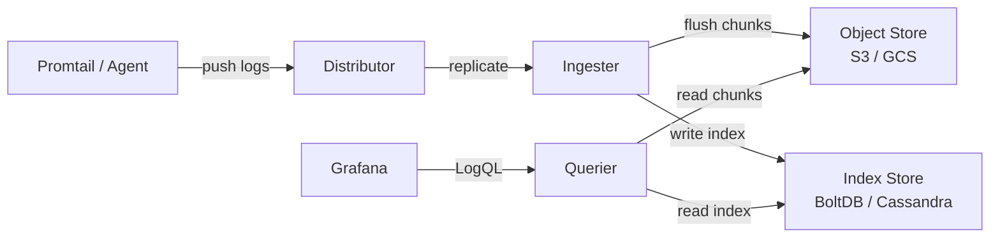
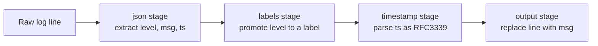
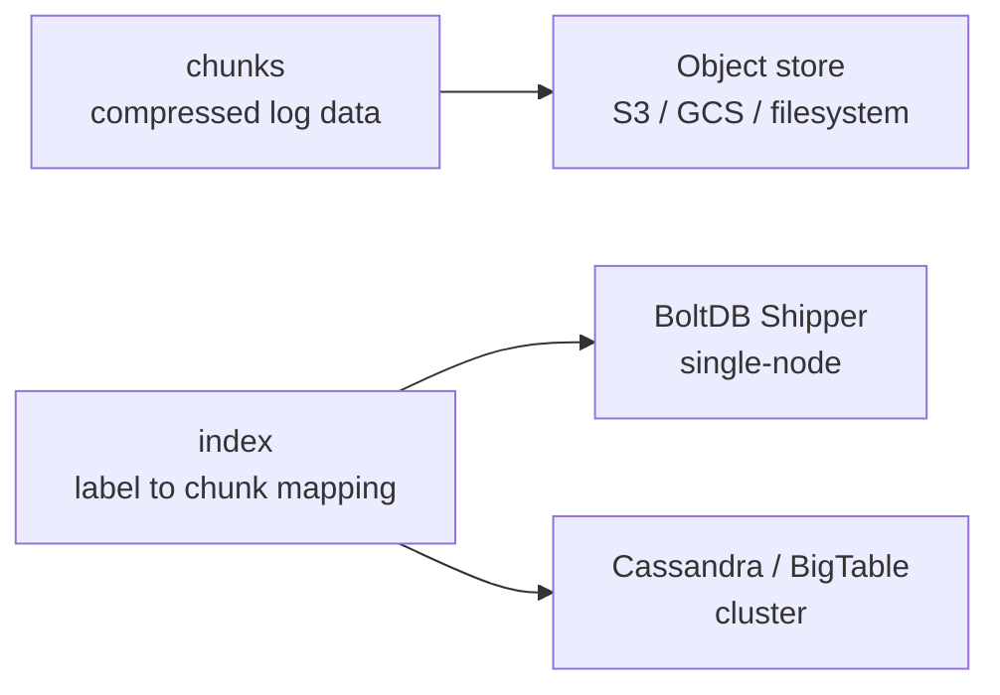
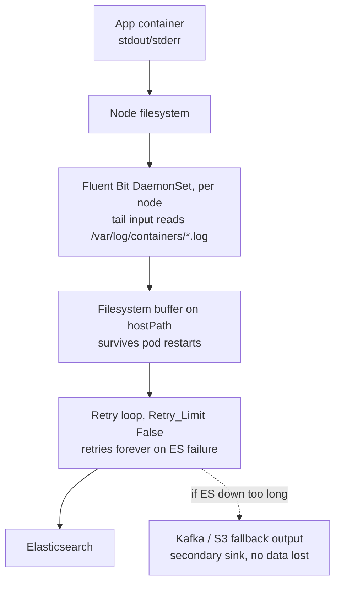

# Loki Log Aggregation

Track how many of the checks below you clear as you go:

<div class="quiz-progress" data-quiz-progress>
  <span class="quiz-progress-label">0/0 checks</span>
  <span class="quiz-progress-bar"><span class="quiz-progress-fill"></span></span>
</div>

## 1. Architecture



**vs Elasticsearch:** Loki stores raw log lines as compressed chunks — no full-text index. Queries filter by labels first, then grep log content. Much cheaper storage; slower ad-hoc text search.

| | Loki | Elasticsearch |
|---|---|---|
| Index | Labels only | Full-text (inverted index) |
| Storage cost | Low (S3/GCS) | High |
| Query speed | Fast on label filters | Fast on any field |
| Schema | Schema-free | Mapping required |

Walk through how a single log line actually moves through this pipeline, end to end:

<div class="stepper">
  <div class="stepper-panels">
    <div class="stepper-panel active">
      <strong>1. Push.</strong> Promtail (or another agent) pushes a batch of log lines to the Distributor.
    </div>
    <div class="stepper-panel">
      <strong>2. Replicate.</strong> The Distributor replicates the write to an Ingester.
    </div>
    <div class="stepper-panel">
      <strong>3. Flush chunks.</strong> The Ingester flushes compressed chunks of log data out to the Object Store (S3 / GCS).
    </div>
    <div class="stepper-panel">
      <strong>4. Write index.</strong> The Ingester also writes the label-to-chunk mapping to the Index Store (BoltDB / Cassandra).
    </div>
    <div class="stepper-panel">
      <strong>5. Query.</strong> The Querier reads chunks from the Object Store and the index from the Index Store to answer a LogQL query sent from Grafana.
    </div>
  </div>
  <div class="stepper-controls">
    <button class="stepper-prev">← Prev</button>
    <span class="stepper-dots"></span>
    <span class="stepper-label"></span>
    <button class="stepper-next">Next →</button>
  </div>
</div>

<div class="quiz-card">
  <p class="quiz-q">Why is Loki's storage so much cheaper than Elasticsearch's, and what do you give up for it?</p>
  <button class="quiz-reveal">Reveal answer</button>
  <div class="quiz-a" hidden>Loki stores raw log lines as compressed chunks with no full-text index &mdash; it indexes only labels, not log content. That keeps storage cheap (S3/GCS) but makes ad-hoc text search slower than Elasticsearch's full-text inverted index, since queries have to narrow by label first, then grep the actual log content.</div>
</div>

---

## 2. Labels vs Log Content

```mermaid
flowchart TD
    Q[LogQL Query] --> L{Label selector}
    L -->|narrows stream| S[Log stream<br/>job=api, ns=prod]
    S --> F[Filter log content<br/>|= error]
    F --> R[Results]

    style L fill:#2d6a4f,color:#fff
    style F fill:#1d3557,color:#fff
```

**Good labels** (low cardinality):
- `job`, `namespace`, `pod`, `env`, `level`

**Bad labels** (high cardinality — avoid!):
- `request_id`, `user_id`, `trace_id`, `ip`

High-cardinality labels = millions of streams = Loki OOM / slow queries. Put these values in log content, not labels.

<div class="toggle-switch">
  <div class="toggle-buttons">
    <button data-toggle-opt="good" class="active state-ok">Good labels</button>
    <button data-toggle-opt="bad" class="state-bad">Bad labels</button>
  </div>
  <div class="toggle-panel active" data-toggle-panel="good">
    Low cardinality: <code>job</code>, <code>namespace</code>, <code>pod</code>, <code>env</code>, <code>level</code>. A small, bounded set of values keeps the number of log streams manageable.
  </div>
  <div class="toggle-panel" data-toggle-panel="bad">
    High cardinality: <code>request_id</code>, <code>user_id</code>, <code>trace_id</code>, <code>ip</code>. Each unique value creates its own stream &mdash; millions of streams means Loki OOM or slow queries. Put these values in log content instead, not labels.
  </div>
</div>

<div class="quiz-card">
  <p class="quiz-q">Someone adds request_id as a Loki label to make requests easy to filter. Why is this a bad idea?</p>
  <button class="quiz-reveal">Reveal answer</button>
  <div class="quiz-a" hidden>request_id is high-cardinality &mdash; every request gets a unique value, so every unique value becomes its own log stream. Millions of streams means Loki OOM or slow queries. The fix is to keep request_id in the log content and filter on it there, not promote it to a label.</div>
</div>

---

## 3. LogQL

### Log queries (filter streams)
```logql
# All error logs from api jobs
{job=~"api.*"} |= "error"

# Exclude health checks, parse JSON, filter status
{namespace="prod"} != "healthz" | json | status >= 500

# Pattern parser
{job="nginx"} | pattern `<ip> - - [<ts>] "<method> <path> <_>" <status> <_>`

# Logfmt parser
{job="app"} | logfmt | level="error" | duration > 1s
```

### Metric queries (aggregate over time)
```logql
# Request rate per job
rate({job="api"}[5m])

# Error rate percentage
sum(rate({job="api"} |= "error" [5m])) / sum(rate({job="api"}[5m])) * 100

# 99th percentile latency (from parsed field)
quantile_over_time(0.99, {job="api"} | json | unwrap latency_ms [5m])
```

### Parsers summary
| Parser | Use case |
|---|---|
| `json` | Structured JSON logs |
| `logfmt` | `key=value` format |
| `pattern` | Fixed positional format |
| `regexp` | Custom regex with named groups |

---

## 4. Promtail Config

```yaml
server:
  http_listen_port: 9080

positions:
  filename: /tmp/positions.yaml

clients:
  - url: http://loki:3100/loki/api/v1/push

scrape_configs:
  - job_name: app-logs
    static_configs:
      - targets: [localhost]
        labels:
          job: app
          env: prod
          __path__: /var/log/app/*.log

    pipeline_stages:
      # 1. Parse JSON from log line
      - json:
          expressions:
            level: level
            msg: message
            ts: timestamp

      # 2. Promote parsed fields to labels
      - labels:
          level:

      # 3. Parse timestamp
      - timestamp:
          source: ts
          format: RFC3339

      # 4. Replace log output with just the message
      - output:
          source: msg
```

**Pipeline stage order:** `json/regex` → `labels` → `timestamp` → `output`

Walk through what each stage in the config above actually does to a raw log line:



<div class="stepper">
  <div class="stepper-panels">
    <div class="stepper-panel active">
      <strong>1. Parse JSON.</strong> The <code>json</code> stage extracts <code>level</code>, <code>message</code>, and <code>timestamp</code> from the raw JSON log line.
    </div>
    <div class="stepper-panel">
      <strong>2. Promote to label.</strong> The <code>labels</code> stage promotes the parsed <code>level</code> field to an actual Loki label.
    </div>
    <div class="stepper-panel">
      <strong>3. Parse timestamp.</strong> The <code>timestamp</code> stage reads the parsed <code>ts</code> field and parses it as RFC3339 to set the log line's real timestamp.
    </div>
    <div class="stepper-panel">
      <strong>4. Replace output.</strong> The <code>output</code> stage replaces the log output with just the parsed <code>msg</code> field.
    </div>
  </div>
  <div class="stepper-controls">
    <button class="stepper-prev">← Prev</button>
    <span class="stepper-dots"></span>
    <span class="stepper-label"></span>
    <button class="stepper-next">Next →</button>
  </div>
</div>

<div class="quiz-card">
  <p class="quiz-q">After the pipeline above runs, what does Loki actually store as the log line's content?</p>
  <button class="quiz-reveal">Reveal answer</button>
  <div class="quiz-a" hidden>Just the parsed message field. The output stage replaces the log output with the msg value extracted earlier by the json stage &mdash; the original raw JSON line isn't what ends up stored.</div>
</div>

---

## 5. Retention and Storage



**Retention config (loki.yaml):**
```yaml
limits_config:
  retention_period: 30d   # global default

compactor:
  retention_enabled: true
  working_directory: /loki/compactor
  shared_store: s3
```

Per-tenant retention via `overrides` if multi-tenant.

<div class="toggle-switch">
  <div class="toggle-buttons">
    <button data-toggle-opt="single" class="active">Single-node</button>
    <button data-toggle-opt="cluster">Cluster</button>
  </div>
  <div class="toggle-panel active" data-toggle-panel="single">
    Index store is <strong>BoltDB Shipper</strong>. Chunks still go to the object store (S3 / GCS / filesystem) either way &mdash; only the index backend changes.
  </div>
  <div class="toggle-panel" data-toggle-panel="cluster">
    Index store is <strong>Cassandra or BigTable</strong> instead, to handle the write volume of a multi-node deployment. Chunks are unaffected &mdash; still the same object store.
  </div>
</div>

<div class="quiz-card">
  <p class="quiz-q">In a multi-tenant Loki deployment, how do you give one tenant a longer retention period than the global default?</p>
  <button class="quiz-reveal">Reveal answer</button>
  <div class="quiz-a" hidden>Via overrides &mdash; per-tenant retention is configured through the overrides section, layered on top of the global retention_period default in limits_config.</div>
</div>

---

## 6. Correlating Logs with Traces

In Grafana, add a **derived field** to the Loki datasource:

1. Datasource → Loki → Derived Fields
2. **Regex:** `trace_id=(\w+)`
3. **Name:** `TraceID`
4. **URL:** `http://tempo:3200/trace/${__value.raw}`

Now every log line with `trace_id=abc123` gets a clickable link to Tempo. Works with any tracing backend (Tempo, Jaeger, Zipkin).

```logql
# Find the trace_id in logs first
{job="api"} | json | trace_id != ""
```

<div class="quiz-card">
  <p class="quiz-q">What does adding a derived field with regex trace_id=(\w+) to the Loki datasource actually change in Grafana?</p>
  <button class="quiz-reveal">Reveal answer</button>
  <div class="quiz-a" hidden>Every log line matching the regex (e.g. one containing trace_id=abc123) gets a clickable link built from the configured URL template, pointing straight to that trace in the tracing backend &mdash; Tempo, Jaeger, Zipkin, or any other. It's configured once, with three fields: Regex, Name, and URL.</div>
</div>

---

## Fluent Bit — Zero Log Loss for ELK (Elasticsearch)

When Elasticsearch goes down, the question becomes: where do logs live while ES is unavailable? This section covers every layer of protection.

### Architecture: no-loss log pipeline



Walk through what happens to one log line as it moves through every layer of protection:

<div class="stepper">
  <div class="stepper-panels">
    <div class="stepper-panel active">
      <strong>1. Written to disk.</strong> The app container's stdout/stderr is written to the node's filesystem &mdash; this happens regardless of Fluent Bit.
    </div>
    <div class="stepper-panel">
      <strong>2. Tailed.</strong> The Fluent Bit DaemonSet on that node tails <code>/var/log/containers/*.log</code>, tracking read position in a <code>.db</code> file.
    </div>
    <div class="stepper-panel">
      <strong>3. Buffered to disk.</strong> The line lands in the filesystem buffer on hostPath &mdash; this survives Fluent Bit pod restarts.
    </div>
    <div class="stepper-panel">
      <strong>4. Retried forever.</strong> Fluent Bit attempts to send the buffered chunk to Elasticsearch. With Retry_Limit False, a failed send is retried instead of being dropped.
    </div>
    <div class="stepper-panel">
      <strong>5. Fallback if ES stays down.</strong> If Elasticsearch is unavailable for too long, the Kafka / S3 fallback output acts as a secondary sink &mdash; no data lost even in extended outages.
    </div>
  </div>
  <div class="stepper-controls">
    <button class="stepper-prev">← Prev</button>
    <span class="stepper-dots"></span>
    <span class="stepper-label"></span>
    <button class="stepper-next">Next →</button>
  </div>
</div>

### Core configuration for durability

```ini
[SERVICE]
    Flush           5
    Log_Level       info
    Daemon          off

    # USE FILESYSTEM BUFFER — not in-memory (default)
    storage.type              filesystem
    storage.path              /var/log/flb-storage/
    storage.sync              normal       # fdatasync on each write
    storage.checksum          off
    storage.max_chunks_up     128          # max chunks uploadable to output simultaneously
    storage.backlog_mem_limit 50M          # if backlog exceeds this, pause ingestion

[INPUT]
    Name              tail
    Tag               kube.*
    Path              /var/log/containers/*.log
    Parser            cri
    DB                /var/log/flb-tail.db  # tracks file positions (survives restarts)
    Mem_Buf_Limit     50MB                  # per-input in-memory limit
    # When Mem_Buf_Limit is hit, Fluent Bit pauses ingestion (backpressure)
    # rather than dropping. Paired with filesystem buffer above.
    storage.type      filesystem            # enable per-input FS buffering

[FILTER]
    Name              kubernetes
    Match             kube.*
    Kube_URL          https://kubernetes.default.svc:443
    Merge_Log         On
    Keep_Log          Off

[OUTPUT]
    Name              es
    Match             *
    Host              elasticsearch.logging.svc.cluster.local
    Port              9200
    Index             k8s-logs
    Type              _doc
    tls               Off
    HTTP_User         ${ES_USER}
    HTTP_Passwd       ${ES_PASSWORD}
    Logstash_Format   On

    # CRITICAL: retry forever — do not drop logs on ES failure
    Retry_Limit       False

    # Cap disk usage for the output buffer
    storage.total_limit_size  2G
```

<div class="quiz-card">
  <p class="quiz-q">The config sets storage.type filesystem at both the SERVICE level and the INPUT level. What does each one actually control?</p>
  <button class="quiz-reveal">Reveal answer</button>
  <div class="quiz-a" hidden>The SERVICE-level setting switches Fluent Bit's overall buffering engine to filesystem-backed instead of in-memory (the default). The INPUT-level setting enables per-input filesystem buffering for that specific tail input &mdash; it's what actually turns on FS buffering for the logs that input reads.</div>
</div>

### Retry_Limit False — what happens on ES downtime

```
t=0:   ES goes down
       Fluent Bit attempts to send chunk → fails → marks chunk for retry
t=5s:  retry #1 (backoff: 1s delay)
t=11s: retry #2 (backoff: 2s delay)
t=23s: retry #3 (4s delay)
...    exponential backoff up to ~2h between retries
       ALL logs accumulate in filesystem buffer during this time
       New logs from containers: continue being read → buffered to disk

t=2h:  ES comes back up
       Fluent Bit resumes sending, drains the backlog
       No log loss — order preserved within each log stream
```

<div class="stepper">
  <div class="stepper-panels">
    <div class="stepper-panel active">
      <strong>t=0: ES goes down.</strong> Fluent Bit attempts to send a chunk, it fails, and the chunk is marked for retry.
    </div>
    <div class="stepper-panel">
      <strong>t=5s → t=23s: backoff retries.</strong> Retry #1 at a 1s delay, retry #2 at 2s, retry #3 at 4s &mdash; exponential backoff, climbing toward roughly 2h between retries.
    </div>
    <div class="stepper-panel">
      <strong>Meanwhile: buffer keeps filling.</strong> All logs accumulate in the filesystem buffer during this time. New logs from containers keep being read and buffered to disk.
    </div>
    <div class="stepper-panel">
      <strong>t=2h: ES recovers.</strong> Fluent Bit resumes sending and drains the backlog. No log loss, and order is preserved within each log stream.
    </div>
  </div>
  <div class="stepper-controls">
    <button class="stepper-prev">← Prev</button>
    <span class="stepper-dots"></span>
    <span class="stepper-label"></span>
    <button class="stepper-next">Next →</button>
  </div>
</div>

With the default `Retry_Limit 1`, Fluent Bit gives up after 1 retry and **drops the chunk**. In a 2-hour ES downtime with `Retry_Limit 1`, you lose all logs after the 2nd retry. With `Retry_Limit False` you lose nothing until the disk fills.

<div class="quiz-card">
  <p class="quiz-q">With the default Retry_Limit 1, what happens to logs during a 2-hour Elasticsearch outage?</p>
  <button class="quiz-reveal">Reveal answer</button>
  <div class="quiz-a" hidden>Fluent Bit gives up after just 1 retry and drops the chunk &mdash; so you lose all logs generated after the 2nd retry attempt for the rest of the outage. Retry_Limit False avoids this: it retries forever, so nothing is lost until the disk itself fills up.</div>
</div>

### hostPath vs emptyDir for the buffer

```yaml
# DaemonSet volume — use hostPath, NOT emptyDir
volumes:
  - name: flb-buffer
    hostPath:
      path: /var/log/flb-storage
      type: DirectoryOrCreate
  - name: flb-db
    hostPath:
      path: /var/log/flb-tail.db
      type: FileOrCreate

# emptyDir is ephemeral — it is DESTROYED when the pod is deleted or restarted
# hostPath persists across pod restarts on the same node
# Key: the tail DB tracks file read positions — if lost, Fluent Bit re-reads
# all log files from the beginning → duplicate logs on restart
```

<div class="tab-group">
  <div class="tab-buttons">
    <button data-tab="hostpath" class="active">hostPath</button>
    <button data-tab="emptydir">emptyDir</button>
  </div>
  <div class="tab-panels">
    <div class="tab-panel active" data-tab-panel="hostpath">
      <strong>Persists across pod restarts</strong> on the same node. This is what the buffer volume and the tail <code>.db</code> file both need &mdash; if the DB file survives, Fluent Bit knows exactly where it left off reading each log file.
    </div>
    <div class="tab-panel" data-tab-panel="emptydir">
      <strong>Ephemeral</strong> &mdash; destroyed when the pod is deleted or restarted. Using it for the buffer or the tail DB means losing the read-position tracking on every restart, which makes Fluent Bit re-read all log files from the beginning and produce duplicate logs.
    </div>
  </div>
</div>

<div class="quiz-card">
  <p class="quiz-q">If the Fluent Bit tail DB file is lost on pod restart, what happens on the next startup?</p>
  <button class="quiz-reveal">Reveal answer</button>
  <div class="quiz-a" hidden>Fluent Bit has no record of where it left off, so it re-reads all log files from the beginning &mdash; producing duplicate logs on restart. This is exactly why the tail DB file needs a hostPath volume, not an ephemeral emptyDir.</div>
</div>

### Kafka as durable intermediary

For the highest durability guarantee: use Kafka between Fluent Bit and Elasticsearch. Kafka is the buffer. ES downtime has zero impact on log ingestion.

```
Fluent Bit → Kafka (retention=7d, replication=3) → Logstash → Elasticsearch
```

```ini
# Fluent Bit → Kafka output
[OUTPUT]
    Name        kafka
    Match       *
    Brokers     kafka-broker-1:9092,kafka-broker-2:9092,kafka-broker-3:9092
    Topics      k8s-logs
    rdkafka.acks -1                  # wait for all in-sync replicas (strongest guarantee)
    rdkafka.message.timeout.ms 30000
    rdkafka.queue.buffering.max.messages 100000
    Retry_Limit False
```

Kafka producer with `acks=-1` (all ISRs) means the message is only acknowledged after being written to all in-sync replicas. Combined with Kafka's `min.insync.replicas=2`, this guarantees no message loss even if a broker crashes.

<div class="quiz-card">
  <p class="quiz-q">Fluent Bit's Kafka output uses rdkafka.acks -1, combined with Kafka's min.insync.replicas=2. What guarantee does that combination provide?</p>
  <button class="quiz-reveal">Reveal answer</button>
  <div class="quiz-a" hidden>acks=-1 (all ISRs) means the message is only acknowledged after being written to every in-sync replica. Combined with min.insync.replicas=2, this guarantees no message loss even if a broker crashes.</div>
</div>

### DLQ / S3 fallback output

Configure a secondary output that captures records that fail the primary output (after retries exhausted, or as a parallel copy):

```ini
# Primary: Elasticsearch
[OUTPUT]
    Name          es
    Match         *
    Host          elasticsearch.logging.svc.cluster.local
    Retry_Limit   5             # after 5 retries, route to fallback

# Fallback: S3 (stores everything, infinitely cheap, queryable via Athena)
[OUTPUT]
    Name          s3
    Match         *
    bucket        my-log-archive-bucket
    region        us-east-1
    total_file_size  100M
    upload_timeout   10m
    use_put_object   On
    # Both outputs receive all logs simultaneously — S3 is always-on archive
    # Even if ES is completely down, logs flow to S3
```

With parallel outputs (both ES and S3 match `*`), every log line goes to both sinks simultaneously. S3 is your permanent immutable archive; ES is your searchable hot tier.

<div class="quiz-card">
  <p class="quiz-q">In the config above, both the ES and S3 outputs match *. Does S3 only receive logs after Elasticsearch fails?</p>
  <button class="quiz-reveal">Reveal answer</button>
  <div class="quiz-a" hidden>No. Because both outputs match *, every log line goes to both sinks simultaneously, regardless of ES's health. S3 is an always-on permanent archive, not a fallback that only activates on ES failure.</div>
</div>

### mem_buf_limit and backpressure

```ini
[INPUT]
    Name          tail
    Mem_Buf_Limit 50MB    # per-input in-memory cap

# What happens at 50MB:
# Fluent Bit PAUSES reading new log lines from the files
# It does NOT drop. It waits for the output to catch up.
# This is backpressure — the pipeline slows down rather than dropping.
# File tail position is tracked in the .db file so nothing is lost.
# When output drains and memory drops, reading resumes.
```

**Without `storage.type filesystem`:** once mem_buf_limit is hit, Fluent Bit starts dropping. With filesystem storage, it overflows to disk instead of dropping.

<div class="quiz-card">
  <p class="quiz-q">Mem_Buf_Limit is hit on an input, but storage.type filesystem is NOT set for that input. What happens to new log lines?</p>
  <button class="quiz-reveal">Reveal answer</button>
  <div class="quiz-a" hidden>Fluent Bit starts dropping them. Without filesystem storage, hitting the in-memory limit means there's nowhere else for new data to go. With storage.type filesystem enabled, it overflows to disk instead of dropping.</div>
</div>

### Prometheus alerts for Elasticsearch and Fluent Bit

```yaml
# Alert: ES cluster not green
- alert: ElasticsearchClusterRed
  expr: elasticsearch_cluster_health_status{color="red"} == 1
  for: 5m
  labels:
    severity: critical
  annotations:
    summary: "Elasticsearch cluster is RED — log ingestion failing"

# Alert: ES rejecting indexing (429 Too Many Requests)
- alert: ElasticsearchIndexingErrors
  expr: rate(elasticsearch_indices_indexing_index_failed_total[5m]) > 0
  for: 2m
  labels:
    severity: warning
  annotations:
    summary: "ES indexing failures — check disk, heap, circuit breakers"

# Alert: Fluent Bit output retry rate high (ES degraded)
- alert: FluentBitRetrying
  expr: |
    rate(fluentbit_output_retries_total[5m]) > 0.1
  for: 5m
  labels:
    severity: warning
  annotations:
    summary: "Fluent Bit is retrying output — ES may be slow or down"

# Alert: Fluent Bit buffer disk usage high
- alert: FluentBitBufferFull
  expr: |
    fluentbit_storage_chunks_fs_up / fluentbit_storage_chunks_fs_total > 0.8
  for: 10m
  labels:
    severity: critical
  annotations:
    summary: "Fluent Bit filesystem buffer >80% full — risk of log loss"

# Alert: Fluent Bit dropping records (Retry_Limit exceeded)
- alert: FluentBitDropping
  expr: rate(fluentbit_output_retries_failed_total[5m]) > 0
  for: 1m
  labels:
    severity: critical
  annotations:
    summary: "Fluent Bit is DROPPING logs — Retry_Limit exceeded"
```

<div class="quiz-card">
  <p class="quiz-q">FluentBitRetrying fires with severity warning, and FluentBitDropping fires with severity critical. What's the actual difference in outcome between the two?</p>
  <button class="quiz-reveal">Reveal answer</button>
  <div class="quiz-a" hidden>FluentBitRetrying means Fluent Bit is retrying output because ES may be slow or down &mdash; no logs are lost yet, it's just degraded. FluentBitDropping means Retry_Limit has actually been exceeded and Fluent Bit is DROPPING logs for real &mdash; that's actual, permanent data loss, which is why it's critical instead of warning.</div>
</div>

### Summary: settings that must be in every production Fluent Bit config

| Setting | Value | Why |
|---|---|---|
| `storage.type` (SERVICE) | `filesystem` | Overflow to disk instead of memory |
| `storage.type` (INPUT) | `filesystem` | Per-input disk buffering |
| `Retry_Limit` (OUTPUT) | `False` | Never drop; retry forever |
| `storage.total_limit_size` (OUTPUT) | `≥2G` | Controls max disk per output queue |
| `Mem_Buf_Limit` (INPUT) | `50MB` | Backpressure, not drop |
| Buffer volume | `hostPath` | Survives pod restarts |
| `.db` file | `hostPath` | Tracks tail positions across restarts |
| Secondary output | S3 or Kafka | Archive when ES is down |
