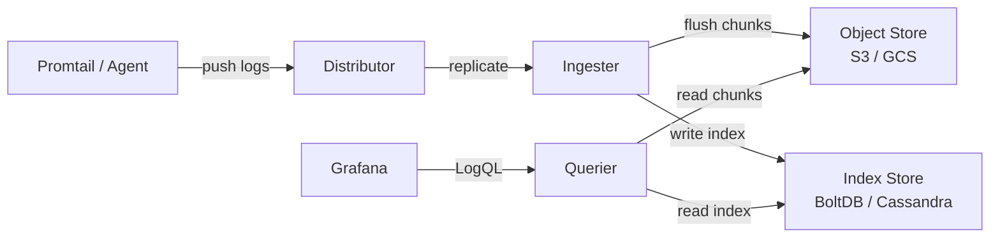

# Loki Log Aggregation

## 1. Architecture



**vs Elasticsearch:** Loki stores raw log lines as compressed chunks — no full-text index. Queries filter by labels first, then grep log content. Much cheaper storage; slower ad-hoc text search.

| | Loki | Elasticsearch |
|---|---|---|
| Index | Labels only | Full-text (inverted index) |
| Storage cost | Low (S3/GCS) | High |
| Query speed | Fast on label filters | Fast on any field |
| Schema | Schema-free | Mapping required |

---

## 2. Labels vs Log Content

```mermaid
flowchart TD
    Q[LogQL Query] --> L{Label selector}
    L -->|narrows stream| S[Log stream<br/>job=api, ns=prod]
    S --> F[Filter log content<br/>|= error]
    F --> R[Results]

    style L fill:#2d6a4f,color:#fff
    style F fill:#1d3557,color:#fff
```

**Good labels** (low cardinality):
- `job`, `namespace`, `pod`, `env`, `level`

**Bad labels** (high cardinality — avoid!):
- `request_id`, `user_id`, `trace_id`, `ip`

High-cardinality labels = millions of streams = Loki OOM / slow queries. Put these values in log content, not labels.

---

## 3. LogQL

### Log queries (filter streams)
```logql
# All error logs from api jobs
{job=~"api.*"} |= "error"

# Exclude health checks, parse JSON, filter status
{namespace="prod"} != "healthz" | json | status >= 500

# Pattern parser
{job="nginx"} | pattern `<ip> - - [<ts>] "<method> <path> <_>" <status> <_>`

# Logfmt parser
{job="app"} | logfmt | level="error" | duration > 1s
```

### Metric queries (aggregate over time)
```logql
# Request rate per job
rate({job="api"}[5m])

# Error rate percentage
sum(rate({job="api"} |= "error" [5m])) / sum(rate({job="api"}[5m])) * 100

# 99th percentile latency (from parsed field)
quantile_over_time(0.99, {job="api"} | json | unwrap latency_ms [5m])
```

### Parsers summary
| Parser | Use case |
|---|---|
| `json` | Structured JSON logs |
| `logfmt` | `key=value` format |
| `pattern` | Fixed positional format |
| `regexp` | Custom regex with named groups |

---

## 4. Promtail Config

```yaml
server:
  http_listen_port: 9080

positions:
  filename: /tmp/positions.yaml

clients:
  - url: http://loki:3100/loki/api/v1/push

scrape_configs:
  - job_name: app-logs
    static_configs:
      - targets: [localhost]
        labels:
          job: app
          env: prod
          __path__: /var/log/app/*.log

    pipeline_stages:
      # 1. Parse JSON from log line
      - json:
          expressions:
            level: level
            msg: message
            ts: timestamp

      # 2. Promote parsed fields to labels
      - labels:
          level:

      # 3. Parse timestamp
      - timestamp:
          source: ts
          format: RFC3339

      # 4. Replace log output with just the message
      - output:
          source: msg
```

**Pipeline stage order:** `json/regex` → `labels` → `timestamp` → `output`

---

## 5. Retention and Storage

```
chunks (compressed log data)  →  S3 / GCS / filesystem
index (label → chunk mapping) →  BoltDB Shipper (single-node)
                                  Cassandra / BigTable (cluster)
```

**Retention config (loki.yaml):**
```yaml
limits_config:
  retention_period: 30d   # global default

compactor:
  retention_enabled: true
  working_directory: /loki/compactor
  shared_store: s3
```

Per-tenant retention via `overrides` if multi-tenant.

---

## 6. Correlating Logs with Traces

In Grafana, add a **derived field** to the Loki datasource:

1. Datasource → Loki → Derived Fields
2. **Regex:** `trace_id=(\w+)`
3. **Name:** `TraceID`
4. **URL:** `http://tempo:3200/trace/${__value.raw}`

Now every log line with `trace_id=abc123` gets a clickable link to Tempo. Works with any tracing backend (Tempo, Jaeger, Zipkin).

```logql
# Find the trace_id in logs first
{job="api"} | json | trace_id != ""
```

---

## Fluent Bit — Zero Log Loss for ELK (Elasticsearch)

When Elasticsearch goes down, the question becomes: where do logs live while ES is unavailable? This section covers every layer of protection.

### Architecture: no-loss log pipeline

```
App container
    ↓ stdout/stderr written to node filesystem
Fluent Bit DaemonSet (per node)
    ↓ tail input reads /var/log/containers/*.log
    ↓ [filesystem buffer on hostPath]        ← survives pod restarts
    ↓ retry loop (Retry_Limit False)         ← retries forever on ES failure
Elasticsearch
    ↓ (if ES down for too long)
Kafka / S3 fallback output                  ← secondary sink, no data lost
```

### Core configuration for durability

```ini
[SERVICE]
    Flush           5
    Log_Level       info
    Daemon          off

    # USE FILESYSTEM BUFFER — not in-memory (default)
    storage.type              filesystem
    storage.path              /var/log/flb-storage/
    storage.sync              normal       # fdatasync on each write
    storage.checksum          off
    storage.max_chunks_up     128          # max chunks uploadable to output simultaneously
    storage.backlog_mem_limit 50M          # if backlog exceeds this, pause ingestion

[INPUT]
    Name              tail
    Tag               kube.*
    Path              /var/log/containers/*.log
    Parser            cri
    DB                /var/log/flb-tail.db  # tracks file positions (survives restarts)
    Mem_Buf_Limit     50MB                  # per-input in-memory limit
    # When Mem_Buf_Limit is hit, Fluent Bit pauses ingestion (backpressure)
    # rather than dropping. Paired with filesystem buffer above.
    storage.type      filesystem            # enable per-input FS buffering

[FILTER]
    Name              kubernetes
    Match             kube.*
    Kube_URL          https://kubernetes.default.svc:443
    Merge_Log         On
    Keep_Log          Off

[OUTPUT]
    Name              es
    Match             *
    Host              elasticsearch.logging.svc.cluster.local
    Port              9200
    Index             k8s-logs
    Type              _doc
    tls               Off
    HTTP_User         ${ES_USER}
    HTTP_Passwd       ${ES_PASSWORD}
    Logstash_Format   On

    # CRITICAL: retry forever — do not drop logs on ES failure
    Retry_Limit       False

    # Cap disk usage for the output buffer
    storage.total_limit_size  2G
```

### Retry_Limit False — what happens on ES downtime

```
t=0:   ES goes down
       Fluent Bit attempts to send chunk → fails → marks chunk for retry
t=5s:  retry #1 (backoff: 1s delay)
t=11s: retry #2 (backoff: 2s delay)
t=23s: retry #3 (4s delay)
...    exponential backoff up to ~2h between retries
       ALL logs accumulate in filesystem buffer during this time
       New logs from containers: continue being read → buffered to disk

t=2h:  ES comes back up
       Fluent Bit resumes sending, drains the backlog
       No log loss — order preserved within each log stream
```

With the default `Retry_Limit 1`, Fluent Bit gives up after 1 retry and **drops the chunk**. In a 2-hour ES downtime with `Retry_Limit 1`, you lose all logs after the 2nd retry. With `Retry_Limit False` you lose nothing until the disk fills.

### hostPath vs emptyDir for the buffer

```yaml
# DaemonSet volume — use hostPath, NOT emptyDir
volumes:
  - name: flb-buffer
    hostPath:
      path: /var/log/flb-storage
      type: DirectoryOrCreate
  - name: flb-db
    hostPath:
      path: /var/log/flb-tail.db
      type: FileOrCreate

# emptyDir is ephemeral — it is DESTROYED when the pod is deleted or restarted
# hostPath persists across pod restarts on the same node
# Key: the tail DB tracks file read positions — if lost, Fluent Bit re-reads
# all log files from the beginning → duplicate logs on restart
```

### Kafka as durable intermediary

For the highest durability guarantee: use Kafka between Fluent Bit and Elasticsearch. Kafka is the buffer. ES downtime has zero impact on log ingestion.

```
Fluent Bit → Kafka (retention=7d, replication=3) → Logstash → Elasticsearch
```

```ini
# Fluent Bit → Kafka output
[OUTPUT]
    Name        kafka
    Match       *
    Brokers     kafka-broker-1:9092,kafka-broker-2:9092,kafka-broker-3:9092
    Topics      k8s-logs
    rdkafka.acks -1                  # wait for all in-sync replicas (strongest guarantee)
    rdkafka.message.timeout.ms 30000
    rdkafka.queue.buffering.max.messages 100000
    Retry_Limit False
```

Kafka producer with `acks=-1` (all ISRs) means the message is only acknowledged after being written to all in-sync replicas. Combined with Kafka's `min.insync.replicas=2`, this guarantees no message loss even if a broker crashes.

### DLQ / S3 fallback output

Configure a secondary output that captures records that fail the primary output (after retries exhausted, or as a parallel copy):

```ini
# Primary: Elasticsearch
[OUTPUT]
    Name          es
    Match         *
    Host          elasticsearch.logging.svc.cluster.local
    Retry_Limit   5             # after 5 retries, route to fallback

# Fallback: S3 (stores everything, infinitely cheap, queryable via Athena)
[OUTPUT]
    Name          s3
    Match         *
    bucket        my-log-archive-bucket
    region        us-east-1
    total_file_size  100M
    upload_timeout   10m
    use_put_object   On
    # Both outputs receive all logs simultaneously — S3 is always-on archive
    # Even if ES is completely down, logs flow to S3
```

With parallel outputs (both ES and S3 match `*`), every log line goes to both sinks simultaneously. S3 is your permanent immutable archive; ES is your searchable hot tier.

### mem_buf_limit and backpressure

```ini
[INPUT]
    Name          tail
    Mem_Buf_Limit 50MB    # per-input in-memory cap

# What happens at 50MB:
# Fluent Bit PAUSES reading new log lines from the files
# It does NOT drop. It waits for the output to catch up.
# This is backpressure — the pipeline slows down rather than dropping.
# File tail position is tracked in the .db file so nothing is lost.
# When output drains and memory drops, reading resumes.
```

**Without `storage.type filesystem`:** once mem_buf_limit is hit, Fluent Bit starts dropping. With filesystem storage, it overflows to disk instead of dropping.

### Prometheus alerts for Elasticsearch and Fluent Bit

```yaml
# Alert: ES cluster not green
- alert: ElasticsearchClusterRed
  expr: elasticsearch_cluster_health_status{color="red"} == 1
  for: 5m
  labels:
    severity: critical
  annotations:
    summary: "Elasticsearch cluster is RED — log ingestion failing"

# Alert: ES rejecting indexing (429 Too Many Requests)
- alert: ElasticsearchIndexingErrors
  expr: rate(elasticsearch_indices_indexing_index_failed_total[5m]) > 0
  for: 2m
  labels:
    severity: warning
  annotations:
    summary: "ES indexing failures — check disk, heap, circuit breakers"

# Alert: Fluent Bit output retry rate high (ES degraded)
- alert: FluentBitRetrying
  expr: |
    rate(fluentbit_output_retries_total[5m]) > 0.1
  for: 5m
  labels:
    severity: warning
  annotations:
    summary: "Fluent Bit is retrying output — ES may be slow or down"

# Alert: Fluent Bit buffer disk usage high
- alert: FluentBitBufferFull
  expr: |
    fluentbit_storage_chunks_fs_up / fluentbit_storage_chunks_fs_total > 0.8
  for: 10m
  labels:
    severity: critical
  annotations:
    summary: "Fluent Bit filesystem buffer >80% full — risk of log loss"

# Alert: Fluent Bit dropping records (Retry_Limit exceeded)
- alert: FluentBitDropping
  expr: rate(fluentbit_output_retries_failed_total[5m]) > 0
  for: 1m
  labels:
    severity: critical
  annotations:
    summary: "Fluent Bit is DROPPING logs — Retry_Limit exceeded"
```

### Summary: settings that must be in every production Fluent Bit config

| Setting | Value | Why |
|---|---|---|
| `storage.type` (SERVICE) | `filesystem` | Overflow to disk instead of memory |
| `storage.type` (INPUT) | `filesystem` | Per-input disk buffering |
| `Retry_Limit` (OUTPUT) | `False` | Never drop; retry forever |
| `storage.total_limit_size` (OUTPUT) | `≥2G` | Controls max disk per output queue |
| `Mem_Buf_Limit` (INPUT) | `50MB` | Backpressure, not drop |
| Buffer volume | `hostPath` | Survives pod restarts |
| `.db` file | `hostPath` | Tracks tail positions across restarts |
| Secondary output | S3 or Kafka | Archive when ES is down |
