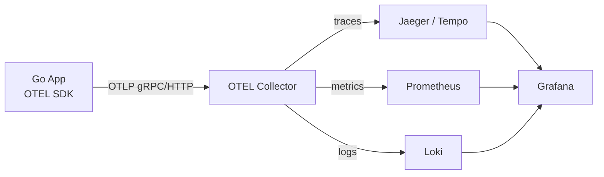
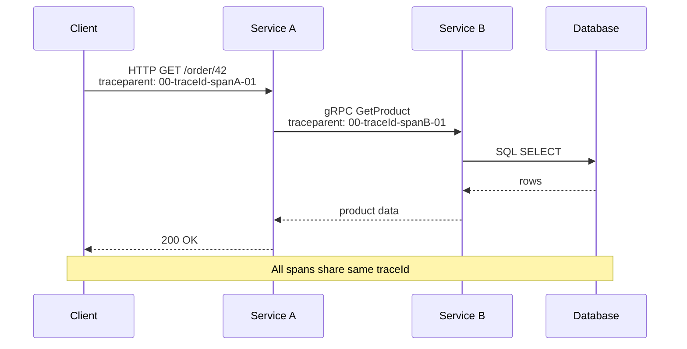
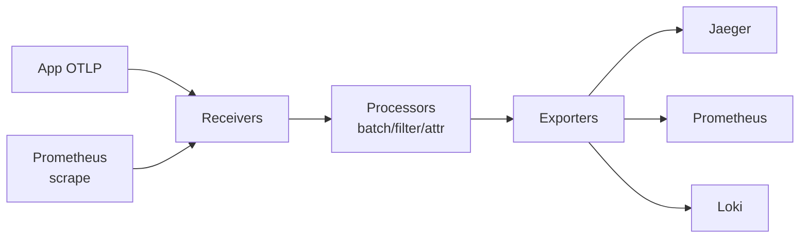

# OpenTelemetry

OpenTelemetry (OTEL) is the vendor-neutral standard for generating telemetry — one set of SDKs and one wire protocol (OTLP) work across languages and backends, so instrumenting a service once doesn't lock it into a single traces/metrics/logs vendor. This guide covers the three signal types, how a trace's context propagates across a service boundary, the Collector's receive → process → export pipeline, and where to draw the line between auto- and manual instrumentation.

<div class="quiz-progress" data-quiz-progress>
  <span class="quiz-progress-label">0/0 checks</span>
  <span class="quiz-progress-bar"><span class="quiz-progress-fill"></span></span>
</div>

## Three Pillars

| Signal | What it is | Backend |
|--------|-----------|---------|
| **Traces** | End-to-end request flow across services | Jaeger, Tempo, Zipkin |
| **Metrics** | Numeric measurements over time | Prometheus, Mimir |
| **Logs** | Structured event records | Loki, Elasticsearch |

**Correlation** — inject `trace_id` and `span_id` into structured logs so a log line links back to the exact trace:
```json
{"level":"error","trace_id":"4bf92f3577b34da6","span_id":"00f067aa0ba902b7","msg":"db timeout"}
```

<div class="quiz-card">
  <p class="quiz-q">Why do you inject trace_id and span_id into structured logs?</p>
  <button class="quiz-reveal">Reveal answer</button>
  <div class="quiz-a" hidden>So a log line can link back to the exact trace it belongs to — that's the correlation that ties the Logs pillar to the Traces pillar, instead of leaving them as two disconnected signals.</div>
</div>

---

## Architecture



---

## Trace Propagation



Same call, one step at a time:

<div class="stepper">
  <div class="stepper-panels">
    <div class="stepper-panel active">
      <strong>1. Client → Service A.</strong> The client issues <code>HTTP GET /order/42</code>. Service A's span for this request carries <code>traceparent: 00-traceId-spanA-01</code> — a traceId for the whole request, plus this hop's own span, spanA.
    </div>
    <div class="stepper-panel">
      <strong>2. Service A → Service B.</strong> Service A calls Service B over gRPC (<code>GetProduct</code>), forwarding <code>traceparent: 00-traceId-spanB-01</code> — same traceId carried across the boundary, a new span (spanB) for this hop.
    </div>
    <div class="stepper-panel">
      <strong>3. Service B → Database.</strong> Service B issues a SQL <code>SELECT</code>; the database returns rows back to B.
    </div>
    <div class="stepper-panel">
      <strong>4. Unwind.</strong> B returns product data to A, A returns <code>200 OK</code> to the client. Per the diagram's note, every span in this call — client, A, B, DB — shares the same traceId, which is what lets a backend group them into a single trace.
    </div>
  </div>
  <div class="stepper-controls">
    <button class="stepper-prev">← Prev</button>
    <span class="stepper-dots"></span>
    <span class="stepper-label"></span>
    <button class="stepper-next">Next →</button>
  </div>
</div>

### Span Anatomy
```
TraceID: 4bf92f3577b34da6a3ce929d0e0e4736
SpanID:  00f067aa0ba902b7
Parent:  a3ce929d0e0e4736   (nil for root span)
Name:    "HTTP GET /order/{id}"
Start:   2024-01-01T10:00:00.000Z
End:     2024-01-01T10:00:00.043Z
Status:  OK
Attributes:
  http.method = GET
  http.url    = /order/42
  http.status_code = 200
Events:
  - name: "cache miss", timestamp: T+2ms
Baggage: user.tier=premium  (propagated to all downstream spans)
```

<div class="quiz-card">
  <p class="quiz-q">What's the difference between an Attribute and Baggage on a span, per the anatomy above?</p>
  <button class="quiz-reveal">Reveal answer</button>
  <div class="quiz-a" hidden>An Attribute (like http.method, http.url) describes that one span only. Baggage (e.g. user.tier=premium) is explicitly propagated to all downstream spans — it travels with the trace context across service boundaries instead of staying attached to a single span.</div>
</div>

### Sampling Strategies

| Strategy | How | Use |
|----------|-----|-----|
| **Head (probabilistic)** | Decision at root span; 1-10% sampled | Low overhead, misses rare errors |
| **Head (rate-limiting)** | Max N traces/sec | Predictable cost |
| **Tail** | Buffer all spans; decide after root completes | Can sample 100% of errors |
| **Parent-based** | Inherit parent's sampling decision | Consistent across services |

<div class="tab-group">
  <div class="tab-buttons">
    <button data-tab="head-prob" class="active">Head (probabilistic)</button>
    <button data-tab="head-rate">Head (rate-limiting)</button>
    <button data-tab="tail">Tail</button>
    <button data-tab="parent">Parent-based</button>
  </div>
  <div class="tab-panels">
    <div class="tab-panel active" data-tab-panel="head-prob">
      Decision made at the root span, before the outcome is known — typically 1-10% sampled. Low overhead, but it misses rare errors since a failing request has the same small chance of being sampled as any other.
    </div>
    <div class="tab-panel" data-tab-panel="head-rate">
      Cap of max N traces/sec, decided at the root span. Predictable cost regardless of traffic spikes.
    </div>
    <div class="tab-panel" data-tab-panel="tail">
      Buffers all spans and decides only after the root span completes — so it can specifically keep every error trace. Can sample 100% of errors, at the cost of buffering overhead.
    </div>
    <div class="tab-panel" data-tab-panel="parent">
      Each span inherits whatever sampling decision its parent already made. Keeps sampling consistent across services — a span never gets sampled on its own while its parent was dropped, or vice versa.
    </div>
  </div>
</div>

<div class="quiz-card">
  <p class="quiz-q">Which sampling strategy can guarantee capturing 100% of error traces, and why can't head-based sampling promise that?</p>
  <button class="quiz-reveal">Reveal answer</button>
  <div class="quiz-a" hidden>Tail sampling — it buffers all spans and decides after the root span completes, so it can specifically catch and keep every error. Head-based sampling decides at the root span before the outcome is known (e.g. 1-10% probabilistic), so a rare error trace has the same small chance of being sampled as any other request — it can easily be missed.</div>
</div>

---

## Metrics: OTEL vs Prometheus

| Aspect | OTEL | Prometheus |
|--------|------|-----------|
| Data model | OTLP (protobuf) | Text exposition |
| Push vs pull | Push (to collector) | Pull (scrape) |
| Histogram | Explicit bounds or exponential | Fixed buckets |
| Exemplars | Built-in (link metrics → trace) | Supported |
| Aggregation | In SDK or collector | In PromQL |
| Temporality | Delta or cumulative | Cumulative only |

OTEL metrics exported via Prometheus exporter endpoint look identical to native Prometheus metrics.

<div class="quiz-card">
  <p class="quiz-q">OTEL metrics support both delta and cumulative temporality. What does Prometheus support, and does that difference disappear once OTEL metrics reach a Prometheus exporter endpoint?</p>
  <button class="quiz-reveal">Reveal answer</button>
  <div class="quiz-a" hidden>Prometheus supports cumulative only. That's a real model difference — but per this file, OTEL metrics exported via the Prometheus exporter endpoint look identical to native Prometheus metrics, so the distinction is invisible once they've reached that endpoint.</div>
</div>

---

## Auto vs Manual Instrumentation

**Auto-instrumentation** — zero-code, wraps stdlib/frameworks:
```go
// HTTP auto-instrumentation via otelhttp
mux := http.NewServeMux()
handler := otelhttp.NewHandler(mux, "my-service")
http.ListenAndServe(":8080", handler)

// Database via otelsql
db, _ = otelsql.Open("postgres", dsn,
    otelsql.WithAttributes(semconv.DBSystemPostgreSQL))
```

**Manual instrumentation** — full control over span names, attributes, events:
```go
ctx, span := tracer.Start(ctx, "processOrder",
    trace.WithAttributes(
        attribute.String("order.id", orderID),
        attribute.Int("order.items", len(items)),
    ),
)
defer span.End()

if err != nil {
    span.RecordError(err)
    span.SetStatus(codes.Error, err.Error())
}
span.AddEvent("payment.processed", trace.WithAttributes(
    attribute.String("payment.method", "card"),
))
```

<div class="tab-group">
  <div class="tab-buttons">
    <button data-tab="auto-instr" class="active">Auto-instrumentation</button>
    <button data-tab="manual-instr">Manual instrumentation</button>
  </div>
  <div class="tab-panels">
    <div class="tab-panel active" data-tab-panel="auto-instr">
      Zero-code, wraps stdlib/frameworks — <code>otelhttp.NewHandler</code> for HTTP, <code>otelsql.Open</code> for database calls. Fast to add, but you only get whatever spans and attributes the wrapper already knows to record.
    </div>
    <div class="tab-panel" data-tab-panel="manual-instr">
      Full control over span names, attributes, and events — call <code>tracer.Start</code> directly, attach custom attributes like <code>order.id</code>, record errors with <code>span.RecordError</code>/<code>SetStatus</code>, and add business-specific events like <code>payment.processed</code>.
    </div>
  </div>
</div>

<div class="quiz-card">
  <p class="quiz-q">What can manual instrumentation give you that auto-instrumentation via otelhttp/otelsql doesn't?</p>
  <button class="quiz-reveal">Reveal answer</button>
  <div class="quiz-a" hidden>Full control over span names, attributes, and events — e.g. recording a custom error via span.RecordError/SetStatus, or adding a business-specific event like payment.processed. A generic HTTP/DB wrapper only knows to record what it was built to record, not application-specific detail like that.</div>
</div>

---

## Go OTEL SDK Example

```go
package main

import (
    "context"
    "log"
    "net/http"
    "time"

    "go.opentelemetry.io/otel"
    "go.opentelemetry.io/otel/attribute"
    "go.opentelemetry.io/otel/exporters/otlp/otlptrace/otlptracegrpc"
    "go.opentelemetry.io/otel/metric"
    "go.opentelemetry.io/otel/sdk/resource"
    sdktrace "go.opentelemetry.io/otel/sdk/trace"
    semconv "go.opentelemetry.io/otel/semconv/v1.21.0"
    "go.opentelemetry.io/contrib/instrumentation/net/http/otelhttp"
    "go.opentelemetry.io/otel/exporters/prometheus"
    sdkmetric "go.opentelemetry.io/otel/sdk/metric"
)

func initTracer(ctx context.Context) (*sdktrace.TracerProvider, error) {
    exp, err := otlptracegrpc.New(ctx,
        otlptracegrpc.WithEndpoint("otel-collector:4317"),
        otlptracegrpc.WithInsecure(),
    )
    if err != nil {
        return nil, err
    }
    res := resource.NewWithAttributes(
        semconv.SchemaURL,
        semconv.ServiceName("order-service"),
        semconv.ServiceVersion("1.0.0"),
    )
    tp := sdktrace.NewTracerProvider(
        sdktrace.WithBatcher(exp),
        sdktrace.WithResource(res),
        sdktrace.WithSampler(sdktrace.ParentBased(
            sdktrace.TraceIDRatioBased(0.1))), // 10% sampling
    )
    otel.SetTracerProvider(tp)
    return tp, nil
}

func initMeter() (*sdkmetric.MeterProvider, error) {
    exp, err := prometheus.New()
    if err != nil {
        return nil, err
    }
    mp := sdkmetric.NewMeterProvider(sdkmetric.WithReader(exp))
    otel.SetMeterProvider(mp)
    return mp, nil
}

func main() {
    ctx := context.Background()

    tp, _ := initTracer(ctx)
    defer tp.Shutdown(ctx)

    mp, _ := initMeter()
    defer mp.Shutdown(ctx)

    tracer := otel.Tracer("order-service")
    meter  := otel.Meter("order-service")

    reqCounter, _ := meter.Int64Counter("http.requests.total",
        metric.WithDescription("Total HTTP requests"))

    latency, _ := meter.Float64Histogram("http.request.duration",
        metric.WithUnit("s"))

    mux := http.NewServeMux()
    mux.HandleFunc("/order", func(w http.ResponseWriter, r *http.Request) {
        start := time.Now()
        ctx, span := tracer.Start(r.Context(), "handle.order",
            trace.WithAttributes(attribute.String("http.method", r.Method)),
        )
        defer span.End()

        // business logic ...
        processOrder(ctx, tracer)

        reqCounter.Add(ctx, 1, metric.WithAttributes(
            attribute.String("method", r.Method),
            attribute.Int("status", 200),
        ))
        latency.Record(ctx, time.Since(start).Seconds())
        w.WriteHeader(http.StatusOK)
    })

    // Wrap with OTEL HTTP middleware (adds server span automatically)
    http.ListenAndServe(":8080", otelhttp.NewHandler(mux, "order-service"))
}

func processOrder(ctx context.Context, tracer trace.Tracer) {
    _, span := tracer.Start(ctx, "processOrder")
    defer span.End()
    time.Sleep(10 * time.Millisecond)
}
```

---

## OTEL Collector Config



The pipeline is three stages, one step at a time:

<div class="stepper">
  <div class="stepper-panels">
    <div class="stepper-panel active">
      <strong>1. Receive.</strong> Data arrives two ways: OTLP push from instrumented apps, or a Prometheus-style scrape — both land in Receivers.
    </div>
    <div class="stepper-panel">
      <strong>2. Process.</strong> Receivers hand off to Processors: <code>memory_limiter</code> caps the collector's own memory (<code>limit_mib</code>), <code>filter/drop_debug</code> drops noisy spans (e.g. the <code>/healthz</code> health-check target), <code>resource</code> adds attributes like <code>env=production</code>, and <code>batch</code> groups records before export.
    </div>
    <div class="stepper-panel">
      <strong>3. Export.</strong> Processed data reaches Exporters, which fan out per signal type — traces to Jaeger, metrics to Prometheus, logs to Loki.
    </div>
  </div>
  <div class="stepper-controls">
    <button class="stepper-prev">← Prev</button>
    <span class="stepper-dots"></span>
    <span class="stepper-label"></span>
    <button class="stepper-next">Next →</button>
  </div>
</div>

```yaml
# otel-collector-config.yaml
receivers:
  otlp:
    protocols:
      grpc:
        endpoint: 0.0.0.0:4317
      http:
        endpoint: 0.0.0.0:4318
  prometheus:
    config:
      scrape_configs:
        - job_name: "self"
          static_configs:
            - targets: ["localhost:8888"]

processors:
  batch:
    timeout: 5s
    send_batch_size: 1024
  memory_limiter:
    limit_mib: 512
  resource:
    attributes:
      - key: env
        value: production
        action: insert
  filter/drop_debug:
    traces:
      span:
        - 'attributes["http.target"] == "/healthz"'

exporters:
  jaeger:
    endpoint: jaeger:14250
    tls:
      insecure: true
  prometheus:
    endpoint: "0.0.0.0:8889"
  loki:
    endpoint: http://loki:3100/loki/api/v1/push
  otlp/tempo:
    endpoint: tempo:4317
    tls:
      insecure: true

service:
  pipelines:
    traces:
      receivers:  [otlp]
      processors: [memory_limiter, filter/drop_debug, batch]
      exporters:  [jaeger, otlp/tempo]
    metrics:
      receivers:  [otlp, prometheus]
      processors: [memory_limiter, batch]
      exporters:  [prometheus]
    logs:
      receivers:  [otlp]
      processors: [batch]
      exporters:  [loki]
```

<div class="quiz-card">
  <p class="quiz-q">Which processor in the collector config drops health-check spans, and which one caps the collector's own memory usage?</p>
  <button class="quiz-reveal">Reveal answer</button>
  <div class="quiz-a" hidden>filter/drop_debug drops spans where attributes["http.target"] == "/healthz". memory_limiter enforces a limit_mib (512 here) to cap the collector's own memory usage — separate concerns, both listed in the traces pipeline's processors.</div>
</div>
