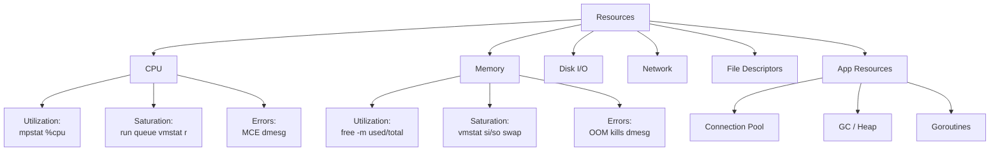
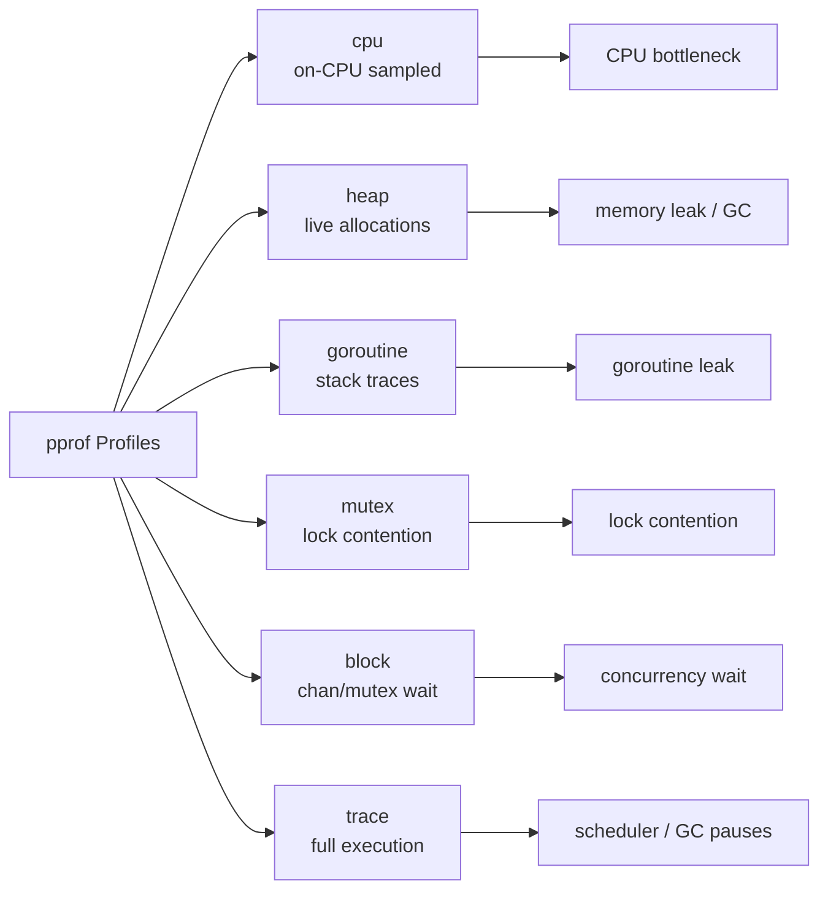

# Performance Debugging Guide

Each section below closes with a quick knowledge check — track how many you've cleared as you go:

<div class="quiz-progress" data-quiz-progress>
  <span class="quiz-progress-label">0/0 checks</span>
  <span class="quiz-progress-bar"><span class="quiz-progress-fill"></span></span>
</div>

## 1. The USE Method

For every resource: **Utilization**, **Saturation**, **Errors**.

| Resource | Utilization | Saturation | Errors |
|---|---|---|---|
| CPU | `mpstat`, `top` %cpu | run-queue (`vmstat r`) | machine-check errors |
| Memory | `free -m` used/total | swap-in rate (`vmstat si/so`) | OOM kills (`dmesg`) |
| Disk I/O | `iostat %util` | await / queue depth | `iostat` err fields |
| Network | `sar -n DEV` %ifutil | drops (`netstat -s`) | `ip -s link` errors |
| File Descriptors | open/limit ratio | blocked on fd alloc | `EMFILE` errors |
| Goroutines (Go) | active / total | blocked goroutines | panics / timeouts |
| Thread Pool | active threads | pending work queue | rejected tasks |
| DB Conn Pool | active / pool size | waiting-for-conn time | conn refused errors |

```
Utilization  = busy_time / total_time  (aim < 70% sustained)
Saturation   = queue length or wait time (any > 0 is a signal)
Errors       = error events per second
```



Walk the method one dimension at a time, for a single resource (CPU here):

<div class="stepper">
  <div class="stepper-panels">
    <div class="stepper-panel active">
      <strong>1. Check Utilization.</strong> <code>mpstat</code> / <code>top</code> %cpu. Per the
      formula above (<code>busy_time / total_time</code>), aim for &lt; 70% sustained &mdash; but
      utilization alone never proves a bottleneck.
    </div>
    <div class="stepper-panel">
      <strong>2. Check Saturation.</strong> <code>vmstat r</code> (run queue). The formula's
      threshold is stricter than utilization's: <em>any</em> queue length or wait time &gt; 0 is
      already a signal, not just a high one.
    </div>
    <div class="stepper-panel">
      <strong>3. Check Errors.</strong> Machine-check errors via <code>dmesg</code>. A resource can
      be fully utilized and still not be erroring &mdash; this dimension catches degradation the
      other two can't see.
    </div>
    <div class="stepper-panel">
      <strong>4. Conclude.</strong> Only call CPU the bottleneck once all three line up. 90%
      utilization with a run queue of 0 and no machine-check errors is a busy CPU, not
      necessarily a saturated one.
    </div>
  </div>
  <div class="stepper-controls">
    <button class="stepper-prev">← Prev</button>
    <span class="stepper-dots"></span>
    <span class="stepper-label"></span>
    <button class="stepper-next">Next →</button>
  </div>
</div>

The table above lists U/S/E signals per resource type — flip between them here:

<div class="toggle-switch">
  <div class="toggle-buttons">
    <button data-toggle-opt="cpu-bound" class="active">CPU-bound</button>
    <button data-toggle-opt="mem-bound">Memory-bound</button>
    <button data-toggle-opt="disk-bound">Disk-bound</button>
    <button data-toggle-opt="net-bound">Network-bound</button>
  </div>
  <div class="toggle-panel active" data-toggle-panel="cpu-bound">
    <strong>Utilization:</strong> <code>mpstat</code>/<code>top</code> %cpu.
    <strong>Saturation:</strong> run-queue (<code>vmstat r</code>).
    <strong>Errors:</strong> machine-check errors.
  </div>
  <div class="toggle-panel" data-toggle-panel="mem-bound">
    <strong>Utilization:</strong> <code>free -m</code> used/total.
    <strong>Saturation:</strong> swap-in rate (<code>vmstat si/so</code>).
    <strong>Errors:</strong> OOM kills (<code>dmesg</code>).
  </div>
  <div class="toggle-panel" data-toggle-panel="disk-bound">
    <strong>Utilization:</strong> <code>iostat %util</code>.
    <strong>Saturation:</strong> await / queue depth.
    <strong>Errors:</strong> <code>iostat</code> err fields.
  </div>
  <div class="toggle-panel" data-toggle-panel="net-bound">
    <strong>Utilization:</strong> <code>sar -n DEV</code> %ifutil.
    <strong>Saturation:</strong> drops (<code>netstat -s</code>).
    <strong>Errors:</strong> <code>ip -s link</code> errors.
  </div>
</div>

<div class="quiz-card">
  <p class="quiz-q">A CPU sits at 95% utilization but <code>vmstat</code>'s run-queue column (<code>r</code>) stays at 0. Per the USE method, is the CPU saturated?</p>
  <button class="quiz-reveal">Reveal answer</button>
  <div class="quiz-a" hidden>
    No. Utilization and saturation are measured independently &mdash; saturation is queue length
    or wait time, and the formula treats <em>any</em> value &gt; 0 as the signal. A CPU can be
    fully busy (95% utilization) with nothing queued behind it, which means it's busy but not yet
    saturated. Only a nonzero run queue would establish saturation.
  </div>
</div>

---

## 2. The RED Method

For every **service endpoint**: **Rate**, **Errors**, **Duration**.

| Signal | Meaning | Prometheus Metric |
|---|---|---|
| Rate | requests per second | `rate(http_requests_total[5m])` |
| Errors | error rate (4xx/5xx) | `rate(http_requests_total{code=~"5.."}[5m])` |
| Duration | latency percentiles | `histogram_quantile(0.99, rate(http_request_duration_seconds_bucket[5m]))` |

### Implementing RED in Prometheus (Go)

```go
import (
    "github.com/prometheus/client_golang/prometheus"
    "github.com/prometheus/client_golang/prometheus/promauto"
)

var (
    reqTotal = promauto.NewCounterVec(prometheus.CounterOpts{
        Name: "http_requests_total",
        Help: "Total HTTP requests",
    }, []string{"method", "path", "status"})

    reqDuration = promauto.NewHistogramVec(prometheus.HistogramOpts{
        Name:    "http_request_duration_seconds",
        Buckets: prometheus.DefBuckets,
    }, []string{"method", "path"})
)

func Middleware(next http.Handler) http.Handler {
    return http.HandlerFunc(func(w http.ResponseWriter, r *http.Request) {
        start := time.Now()
        rw := &statusRecorder{ResponseWriter: w, status: 200}
        next.ServeHTTP(rw, r)
        dur := time.Since(start).Seconds()
        reqTotal.WithLabelValues(r.Method, r.URL.Path, strconv.Itoa(rw.status)).Inc()
        reqDuration.WithLabelValues(r.Method, r.URL.Path).Observe(dur)
    })
}
```

Prometheus alert rules:
```yaml
- alert: HighErrorRate
  expr: rate(http_requests_total{status=~"5.."}[5m]) / rate(http_requests_total[5m]) > 0.05
  for: 2m

- alert: HighLatencyP99
  expr: histogram_quantile(0.99, rate(http_request_duration_seconds_bucket[5m])) > 1.0
  for: 5m
```

<div class="quiz-card">
  <p class="quiz-q">Per the table, what do RED's three signals measure, and which Prometheus function is needed to compute the "Duration" one at the 99th percentile?</p>
  <button class="quiz-reveal">Reveal answer</button>
  <div class="quiz-a" hidden>
    Rate = requests per second, Errors = error rate (4xx/5xx), Duration = latency percentiles.
    Duration is the one that needs <code>histogram_quantile</code> &mdash;
    <code>histogram_quantile(0.99, rate(http_request_duration_seconds_bucket[5m]))</code> &mdash;
    because a percentile can't be read directly off a counter or gauge; it has to be derived from
    a histogram's buckets.
  </div>
</div>

---

## 3. Brendan Gregg 60-Second Linux Checklist

Run these in order. Each takes ~1 second. Total: ~60s.

### `uptime`
```
load average: 1.68, 0.75, 0.39
```
- **Look for**: load average trend. Rising = saturation. Values > CPU count = run-queue saturation.

### `dmesg | tail -20`
- **Look for**: OOM kills (`Out of memory: Kill process`), disk errors (`I/O error`), NIC resets, kernel panics.

### `vmstat 1`
```
r  b   swpd   free   buff  cache   si   so    bi    bo   in   cs us sy id wa st
2  0      0 182932  13340 504936    0    0     0   208 1265 2059 24  5 71  0  0
```
- `r` = run queue (> CPU count = CPU saturation)
- `si/so` = swap in/out (any > 0 = memory pressure)
- `us/sy` = user/kernel CPU time
- `wa` = I/O wait (> 5% = disk bottleneck)

### `mpstat -P ALL 1`
- **Look for**: single CPU at 100% (single-threaded bottleneck), imbalanced CPU usage.

### `pidstat 1`
- **Look for**: which processes consume CPU. `%wait` = off-CPU blocked time.

### `iostat -xz 1`
```
Device  r/s  w/s  rkB/s  wkB/s  await  %util
sda     0.0  8.0    0.0   64.0    2.5   1.2
```
- `%util` > 60% = disk saturation
- `await` = avg I/O latency (ms). > 10ms is notable.
- `r_await` vs `w_await` = separate read/write latency.

### `free -m`
```
             total  used  free  shared  buff/cache  available
Mem:          7982  4516   182     312        3283       2892
```
- **Look for**: `available` near 0 = memory pressure. `swap used` > 0 = swapping.

### `sar -n DEV 1`
- **Look for**: `%ifutil` on network interfaces. Packets/s near NIC limit.

### `sar -n TCP,ETCP 1`
```
active/s  passive/s  iseg/s  oseg/s  | atmptf/s  estres/s  retrans/s
```
- `retrans/s` > 0 = network congestion or packet loss.
- `atmptf/s` = failed TCP connection attempts.

### `top`
- **Look for**: Overall CPU summary, top processes by CPU and MEM. `wa%` for I/O wait. Press `1` for per-CPU view.

The order matters — each command narrows down where to look next:

```mermaid
flowchart LR
    A["uptime<br/>load average"] --> B["dmesg | tail -20<br/>OOM / disk / kernel errors"]
    B --> C["vmstat 1<br/>run queue, swap, CPU split"]
    C --> D["mpstat -P ALL 1<br/>per-CPU balance"]
    D --> E["pidstat 1<br/>per-process CPU / wait"]
    E --> F["iostat -xz 1<br/>disk util, await"]
    F --> G["free -m<br/>memory pressure"]
    G --> H["sar -n DEV 1<br/>network utilization"]
    H --> I["sar -n TCP,ETCP 1<br/>retransmits"]
    I --> J["top<br/>overall summary"]
```



Step through the same sequence, one command at a time:

<div class="stepper">
  <div class="stepper-panels">
    <div class="stepper-panel active">
      <strong>1. uptime.</strong> Read the load-average trend. Rising = saturation building.
      Values above the CPU count mean run-queue saturation.
    </div>
    <div class="stepper-panel">
      <strong>2. dmesg | tail -20.</strong> Scan for OOM kills, disk I/O errors, NIC resets, or
      kernel panics &mdash; anything the kernel already flagged before you started looking.
    </div>
    <div class="stepper-panel">
      <strong>3. vmstat 1.</strong> <code>r</code> above the CPU count means CPU saturation.
      <code>si/so</code> above 0 means memory pressure. <code>wa</code> above 5% means a disk
      bottleneck.
    </div>
    <div class="stepper-panel">
      <strong>4. mpstat -P ALL 1.</strong> Look for a single CPU pinned at 100% (a
      single-threaded bottleneck) versus imbalanced usage across cores.
    </div>
    <div class="stepper-panel">
      <strong>5. pidstat 1.</strong> Identify which process is actually consuming the CPU;
      <code>%wait</code> shows off-CPU blocked time.
    </div>
    <div class="stepper-panel">
      <strong>6. iostat -xz 1.</strong> <code>%util</code> above 60% means disk saturation.
      <code>await</code> above 10ms is notable; compare <code>r_await</code> vs
      <code>w_await</code> to separate read from write latency.
    </div>
    <div class="stepper-panel">
      <strong>7. free -m.</strong> <code>available</code> near 0 means memory pressure;
      <code>swap used</code> &gt; 0 means the system is already swapping.
    </div>
    <div class="stepper-panel">
      <strong>8. sar -n DEV 1.</strong> Watch <code>%ifutil</code> on network interfaces for
      packets/s approaching the NIC limit.
    </div>
    <div class="stepper-panel">
      <strong>9. sar -n TCP,ETCP 1.</strong> <code>retrans/s</code> &gt; 0 means congestion or
      packet loss; <code>atmptf/s</code> counts failed TCP connection attempts.
    </div>
    <div class="stepper-panel">
      <strong>10. top.</strong> Close with the overall CPU summary and top processes by CPU/MEM;
      confirm what the previous nine commands pointed to.
    </div>
  </div>
  <div class="stepper-controls">
    <button class="stepper-prev">← Prev</button>
    <span class="stepper-dots"></span>
    <span class="stepper-label"></span>
    <button class="stepper-next">Next →</button>
  </div>
</div>

<div class="quiz-card">
  <p class="quiz-q">In <code>vmstat 1</code>'s output, both the <code>r</code> column and the <code>wa</code> column can be nonzero at the same time. What does each one actually indicate?</p>
  <button class="quiz-reveal">Reveal answer</button>
  <div class="quiz-a" hidden>
    <code>r</code> (run queue) above the CPU count signals CPU saturation &mdash; processes
    waiting for a CPU to run on. <code>wa</code> (I/O wait) above 5% signals a disk bottleneck
    &mdash; CPUs sitting idle waiting on I/O to complete. They can both be elevated at once, but
    they point at two different resources.
  </div>
</div>

---

## 4. Go pprof Profiles

### Profile Types

| Profile | What it measures | When to use |
|---|---|---|
| `cpu` | on-CPU time (sampled at 100Hz) | CPU bottleneck |
| `heap` | live heap allocations | memory leak, GC pressure |
| `goroutine` | goroutine stack traces | goroutine leak |
| `mutex` | mutex contention time | lock bottleneck |
| `block` | blocking on chan/mutex/syscall | concurrency bottleneck |
| `trace` | full execution trace | scheduler, GC pauses |



### Capturing Profiles

**Enable HTTP endpoint** (add to main):
```go
import _ "net/http/pprof"

go func() {
    log.Println(http.ListenAndServe("localhost:6060", nil))
}()
```

**CPU profile (30 seconds)**:
```bash
go tool pprof http://localhost:6060/debug/pprof/profile?seconds=30
# or save to file:
curl -o cpu.prof http://localhost:6060/debug/pprof/profile?seconds=30
go tool pprof cpu.prof
```

**Heap profile**:
```bash
go tool pprof http://localhost:6060/debug/pprof/heap
# inuse_space (default): currently live objects
# alloc_space: all allocations (use -alloc_space flag)
go tool pprof -alloc_space http://localhost:6060/debug/pprof/heap
```

**Goroutine profile**:
```bash
go tool pprof http://localhost:6060/debug/pprof/goroutine
# raw stack dump (human readable):
curl http://localhost:6060/debug/pprof/goroutine?debug=2
```

**Mutex / Block profiles** (must enable first):
```go
runtime.SetMutexProfileFraction(1)  // sample every mutex event
runtime.SetBlockProfileRate(1)       // sample every block event (expensive!)
```
```bash
go tool pprof http://localhost:6060/debug/pprof/mutex
go tool pprof http://localhost:6060/debug/pprof/block
```

**Execution trace**:
```bash
curl -o trace.out http://localhost:6060/debug/pprof/trace?seconds=5
go tool trace trace.out
```

**In-process (benchmark / test)**:
```go
// In a test:
f, _ := os.Create("cpu.prof")
pprof.StartCPUProfile(f)
defer pprof.StopCPUProfile()

// Heap snapshot:
f, _ := os.Create("heap.prof")
pprof.WriteHeapProfile(f)
```

### Reading a Flame Graph

```bash
go tool pprof -http=:8080 cpu.prof
# Opens browser with flame graph at /ui/flamegraph
```

- **X-axis**: alphabetical order (NOT time). Width = % of total samples.
- **Y-axis**: call stack depth. Top frame = leaf (where CPU is spent).
- **Wide boxes at top**: hot functions — investigate these first.
- **`runtime.mallocgc`** wide = allocation pressure.
- **`runtime.gcBgMarkWorker`** wide = GC overhead.
- Use `top10` in pprof CLI to see cumulative vs flat time.
- `flat` = time in function itself. `cum` = time including callees.

<div class="quiz-card">
  <p class="quiz-q">In a Go pprof flame graph, function A is drawn left of function B at the same stack depth. Does that mean A ran before B?</p>
  <button class="quiz-reveal">Reveal answer</button>
  <div class="quiz-a" hidden>
    No. The x-axis is alphabetical order, not time &mdash; width is what's meaningful (% of total
    samples). The y-axis is call-stack depth, with the leaf frame (where the CPU was actually
    spending time) at the top.
  </div>
</div>

---

## 5. bpftrace One-Liners

```bash
# Syscall latency by syscall name (microseconds)
bpftrace -e 'tracepoint:raw_syscalls:sys_enter { @start[tid] = nsecs; }
tracepoint:raw_syscalls:sys_exit /@start[tid]/ {
  @latency_us[probe] = hist((nsecs - @start[tid]) / 1000); delete(@start[tid]); }'

# Disk I/O latency histogram (microseconds)
bpftrace -e 'tracepoint:block:block_rq_issue { @start[args->sector] = nsecs; }
tracepoint:block:block_rq_complete /@start[args->sector]/ {
  @disk_lat_us = hist((nsecs - @start[args->sector]) / 1000);
  delete(@start[args->sector]); }'

# TCP retransmits with source/dest
bpftrace -e 'tracepoint:tcp:tcp_retransmit_skb {
  printf("%s -> %s<br>", ntop(args->saddr), ntop(args->daddr)); }'

# Off-CPU time (blocked time) by stack
bpftrace -e 'tracepoint:sched:sched_switch /prev->state/ {
  @start[prev->pid] = nsecs; }
tracepoint:sched:sched_switch /@start[next->pid]/ {
  @offcpu_us[kstack] = hist((nsecs - @start[next->pid]) / 1000);
  delete(@start[next->pid]); }'
```

Sections 3-5 all answer overlapping questions with different tools. Same question, three ways:

<div class="tab-group">
  <div class="tab-buttons">
    <button data-tab="os-tools" class="active">OS tools (Sec. 3)</button>
    <button data-tab="pprof-tool">Go pprof (Sec. 4)</button>
    <button data-tab="bpftrace-tool">bpftrace (Sec. 5)</button>
  </div>
  <div class="tab-panels">
    <div class="tab-panel active" data-tab-panel="os-tools">
      <strong>"Why is CPU high?"</strong> <code>mpstat -P ALL 1</code> shows whether one core is
      pinned or usage is spread out; <code>vmstat 1</code>'s <code>r</code> column shows run-queue
      saturation; <code>pidstat 1</code> narrows it to a process. Fast, zero code changes, works
      on any box with <code>sysstat</code> installed &mdash; but it can't tell you which function.
    </div>
    <div class="tab-panel" data-tab-panel="pprof-tool">
      <strong>"Which function?"</strong> A CPU profile
      (<code>go tool pprof http://localhost:6060/debug/pprof/profile?seconds=30</code>) plus a
      flame graph shows the exact hot function inside the process &mdash; not just "the box is
      busy," but where in the code the time goes.
    </div>
    <div class="tab-panel" data-tab-panel="bpftrace-tool">
      <strong>"Where is it blocked?"</strong> The off-CPU one-liner above hashes blocked time by
      kernel stack via <code>sched_switch</code> tracepoints &mdash; it answers "where is the
      process waiting," which an on-CPU pprof profile can't, since a blocked goroutine isn't
      on-CPU at all.
    </div>
  </div>
</div>

---

## 6. Application-Level Debugging

### Connection Pool Saturation

```go
// Expose pool stats as Prometheus gauges
db.SetMaxOpenConns(25)
db.SetMaxIdleConns(5)
db.SetConnMaxLifetime(5 * time.Minute)

// Monitor with:
stats := db.Stats()
// stats.WaitCount     → total waits for connection
// stats.WaitDuration  → total time waited
// stats.MaxIdleClosed → connections closed due to idle limit
// stats.InUse         → currently in use

poolWaiting.Set(float64(stats.WaitCount))
```

Signs of saturation: `WaitDuration` growing, timeouts acquiring connections, `InUse` == `MaxOpenConnections`.

### GC Pressure

```bash
# Enable GC trace
GODEBUG=gctrace=1 ./myapp
# Output: gc 14 @2.345s 3%: 0.5+12+0.3 ms clock, 4+8/12/0+2 ms cpu, 45->48->24 MB, 50 MB goal

# Fields: gc_num  @elapsed  cpu%  stop-the-world+concurrent+stw ms  heap_before->heap_after->live  goal
```

```go
// Read GC stats programmatically
var stats runtime.MemStats
runtime.ReadMemStats(&stats)
// stats.NumGC         → total GC cycles
// stats.PauseNs       → circular buffer of pause times
// stats.HeapInuse     → bytes in in-use spans
// stats.HeapReleased  → bytes returned to OS
```

High GC pressure signals: pause time > 1ms, `NumGC` > 10/sec, heap oscillates wildly.

Fix: reduce allocations (sync.Pool, pre-allocate slices), increase `GOGC` (default 100 = GC when heap doubles).

### Goroutine Leak Detection

```bash
# Check goroutine count over time
curl -s http://localhost:6060/debug/pprof/goroutine?debug=1 | head -5
# goroutine profile: total 4231  ← watch this number grow
```

```go
// In tests, use goleak
import "go.uber.org/goleak"

func TestMyFunc(t *testing.T) {
    defer goleak.VerifyNone(t)
    // test code
}
```

Common leak patterns:
- Channel send/receive with no goroutine on the other end
- `http.Client` request without timeout (blocks on read forever)
- Ticker/Timer never stopped
- goroutine waiting on context that's never cancelled

The three application-level failure modes above, side by side:

<div class="toggle-switch">
  <div class="toggle-buttons">
    <button data-toggle-opt="pool-stress" class="active">Conn pool</button>
    <button data-toggle-opt="gc-stress">GC pressure</button>
    <button data-toggle-opt="goroutine-stress">Goroutine leak</button>
  </div>
  <div class="toggle-panel active" data-toggle-panel="pool-stress">
    <strong>Signs:</strong> <code>WaitDuration</code> growing, timeouts acquiring a connection,
    <code>InUse</code> == <code>MaxOpenConnections</code>.
  </div>
  <div class="toggle-panel" data-toggle-panel="gc-stress">
    <strong>Signs:</strong> pause time &gt; 1ms, <code>NumGC</code> &gt; 10/sec, heap oscillates
    wildly. Fix: reduce allocations (<code>sync.Pool</code>, pre-allocate slices), or raise
    <code>GOGC</code> (default 100 = GC when heap doubles).
  </div>
  <div class="toggle-panel" data-toggle-panel="goroutine-stress">
    <strong>Signs:</strong> the total in <code>/debug/pprof/goroutine?debug=1</code> keeps
    growing across samples. Usual causes: an unpaired channel send/receive, an
    <code>http.Client</code> without a timeout, an unstopped ticker/timer, or a context that's
    never cancelled.
  </div>
</div>

<div class="quiz-card">
  <p class="quiz-q">What three conditions, together, indicate connection-pool saturation per this guide?</p>
  <button class="quiz-reveal">Reveal answer</button>
  <div class="quiz-a" hidden>
    <code>WaitDuration</code> growing, timeouts acquiring connections, and
    <code>InUse</code> equal to <code>MaxOpenConnections</code> &mdash; every connection is
    checked out and new callers are queuing for one.
  </div>
</div>

---

## Debugging Decision Flow

```mermaid
flowchart TD
    START([Symptom reported]) --> Q1{High latency<br/>or low throughput?}
    Q1 -->|Latency| Q2{CPU high?}
    Q1 -->|Throughput| Q3{Error rate high?}

    Q2 -->|Yes| CPU_PROF[CPU pprof<br/>flame graph]
    Q2 -->|No| Q4{I/O wait high?}
    Q4 -->|Yes| DISK[iostat + bpftrace<br/>disk latency]
    Q4 -->|No| Q5{Goroutines growing?}
    Q5 -->|Yes| GR_PROF[goroutine pprof<br/>leak detection]
    Q5 -->|No| BLOCK[block/mutex pprof<br/>contention]

    Q3 -->|Yes| LOGS[Check logs<br/>error details]
    Q3 -->|No| Q6{Memory growing?}
    Q6 -->|Yes| HEAP[heap pprof<br/>alloc_space]
    Q6 -->|No| Q7{Network issues?}
    Q7 -->|Yes| NET[sar + bpftrace<br/>TCP retransmits]
    Q7 -->|No| POOL[Check conn pool<br/>db.Stats()]
```

Walk the same tree one fork at a time, latency branch first, then throughput:

<div class="stepper">
  <div class="stepper-panels">
    <div class="stepper-panel active">
      <strong>1. Symptom reported.</strong> First fork: is it high latency or low throughput? The
      two branches below reuse the tools from Sections 3-6.
    </div>
    <div class="stepper-panel">
      <strong>2. Latency &mdash; is CPU high?</strong> Yes: capture a CPU pprof profile and read
      the flame graph (Section 4) to find the hot function.
    </div>
    <div class="stepper-panel">
      <strong>3. Latency &mdash; CPU not high, is I/O wait high?</strong> Yes: reach for
      <code>iostat</code> plus the bpftrace disk-latency histogram (Sections 3 and 5).
    </div>
    <div class="stepper-panel">
      <strong>4. Latency &mdash; I/O not high, are goroutines growing?</strong> Yes: run a
      goroutine pprof for leak detection (Section 6). No: fall back to a block/mutex pprof for
      contention (Section 4).
    </div>
    <div class="stepper-panel">
      <strong>5. Throughput &mdash; is the error rate high?</strong> Yes: check logs for error
      details, using the RED method's error signal (Section 2) to confirm it first.
    </div>
    <div class="stepper-panel">
      <strong>6. Throughput &mdash; errors not high, is memory growing?</strong> Yes: take a heap
      pprof with <code>alloc_space</code> (Section 4).
    </div>
    <div class="stepper-panel">
      <strong>7. Throughput &mdash; memory not growing, any network issues?</strong> Yes:
      <code>sar</code> plus the bpftrace TCP-retransmit one-liner (Sections 3 and 5). No: check
      the connection pool via <code>db.Stats()</code> (Section 6).
    </div>
  </div>
  <div class="stepper-controls">
    <button class="stepper-prev">← Prev</button>
    <span class="stepper-dots"></span>
    <span class="stepper-label"></span>
    <button class="stepper-next">Next →</button>
  </div>
</div>

<div class="quiz-card">
  <p class="quiz-q">Throughput is low, the error rate is <em>not</em> high, and memory is <em>not</em> growing either. Per the flow, what do you check next, and then what if that's also clean?</p>
  <button class="quiz-reveal">Reveal answer</button>
  <div class="quiz-a" hidden>
    Check for network issues (<code>sar</code> + bpftrace TCP retransmits). If that's clean too,
    the flow's last fallback is the connection pool &mdash; check <code>db.Stats()</code> for
    saturation.
  </div>
</div>
