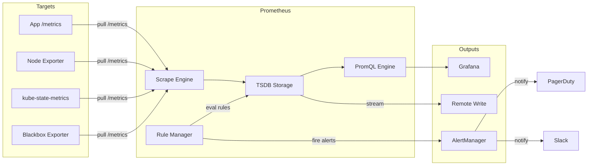
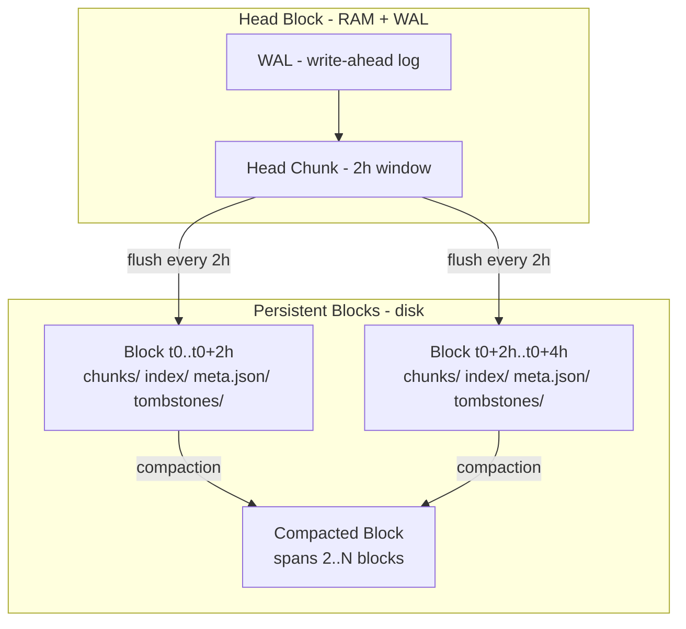
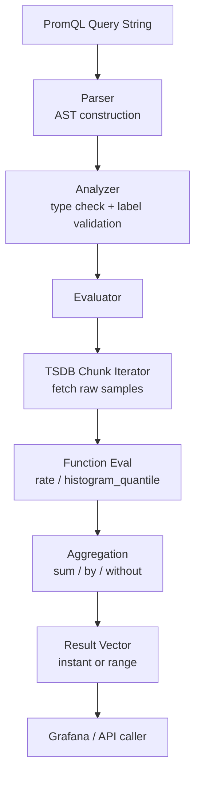
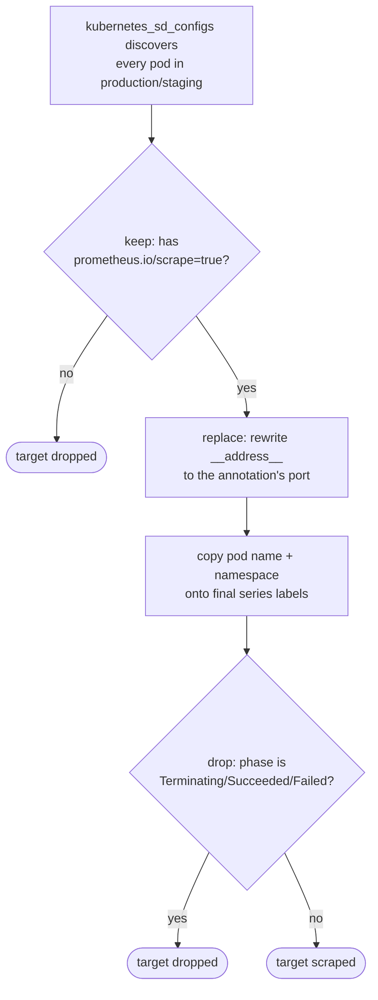
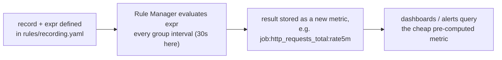
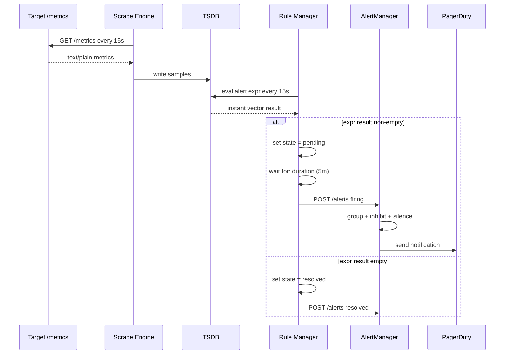
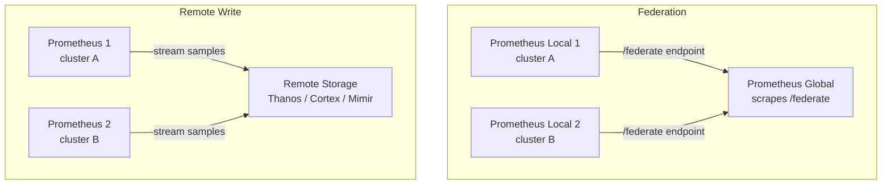

# Prometheus — Production Reference Guide

<div class="quiz-progress" data-quiz-progress>
  <span class="quiz-progress-label">0/0 checks</span>
  <span class="quiz-progress-bar"><span class="quiz-progress-fill"></span></span>
</div>

---

## 1. Architecture



**Key insight:** Prometheus is a **pull-based** system. It scrapes HTTP `/metrics` endpoints on a configured interval (default 15s). This inverts the model — targets don't push; Prometheus fetches.

<div class="quiz-card">
  <p class="quiz-q">Why does Prometheus scrape targets instead of having them push metrics?</p>
  <button class="quiz-reveal">Reveal answer</button>
  <div class="quiz-a" hidden>Prometheus is pull-based by design — it fetches HTTP <code>/metrics</code> endpoints on a configured interval (default 15s) rather than waiting for targets to push. This inverts the usual push model: Prometheus decides when and whether to scrape, which is what makes service discovery, scrape health (the <code>up</code> metric), and centralized interval control possible.</div>
</div>

---

## 2. Data Model

Every time-series is identified by:

```
metric_name{label1="value1", label2="value2"} <timestamp> <float64>
```

Example:
```
http_requests_total{method="GET", status="200", handler="/api/users"} 1627890123456 4821
```

The **label set** uniquely identifies a series. Two series differing by even one label value are entirely separate streams stored independently in TSDB.

### 2.1 Metric Types

#### Counter — monotonically increasing

```
http_requests_total{status="200"} 4821
http_requests_total{status="500"} 12
```

- Never decreases (except on process restart → reset)
- Always use `rate()` or `increase()` to get useful numbers
- Math: `rate(http_requests_total[5m])` = per-second average over 5 min window

```
rate = (last_value - first_value) / range_seconds
     = (4821 - 4650) / 300
     = 0.57 req/s
```

#### Gauge — current snapshot value

```
process_resident_memory_bytes 52428800
go_goroutines 42
node_load1 0.73
```

- Can go up or down
- Use directly: no `rate()` needed
- Math: just read the value, or use `delta()` for change over time

```
delta(node_load1[10m])  →  load change over last 10 minutes
```

#### Histogram — distribution of observations

```
http_request_duration_seconds_bucket{le="0.1"}  240
http_request_duration_seconds_bucket{le="0.5"}  890
http_request_duration_seconds_bucket{le="1.0"}  950
http_request_duration_seconds_bucket{le="+Inf"} 960
http_request_duration_seconds_count             960
http_request_duration_seconds_sum               143.7
```

- Buckets are **cumulative** (each `le` includes all smaller values)
- `_count` = total observations, `_sum` = total sum of all values
- Math for p99:

```
histogram_quantile(0.99,
  rate(http_request_duration_seconds_bucket[5m])
)
```

The function interpolates linearly within the bucket that contains the φ-th quantile.

Average latency:
```
rate(http_request_duration_seconds_sum[5m])
  /
rate(http_request_duration_seconds_count[5m])
```

#### Summary — client-side pre-computed quantiles

```
rpc_duration_seconds{quantile="0.5"}  0.012
rpc_duration_seconds{quantile="0.9"}  0.034
rpc_duration_seconds{quantile="0.99"} 0.089
rpc_duration_seconds_count            1234
rpc_duration_seconds_sum              18.6
```

- Quantiles computed **inside the client library** — cannot be aggregated across instances
- Use histogram when you need to aggregate; use summary when you need accurate single-instance quantiles cheaply
- Cannot do `histogram_quantile()` on summaries

Side by side, the four types at a glance:

<div class="tab-group">
  <div class="tab-buttons">
    <button data-tab="pm-counter" class="active">Counter</button>
    <button data-tab="pm-gauge">Gauge</button>
    <button data-tab="pm-histogram">Histogram</button>
    <button data-tab="pm-summary">Summary</button>
  </div>
  <div class="tab-panels">
    <div class="tab-panel active" data-tab-panel="pm-counter">
      <strong>Monotonically increasing.</strong> Never decreases except on a process restart, which resets it to 0. Never read directly &mdash; always wrap it in <code>rate()</code> or <code>increase()</code> to get a useful per-second or total-over-window number.
    </div>
    <div class="tab-panel" data-tab-panel="pm-gauge">
      <strong>Current snapshot value.</strong> Can go up or down freely (memory, goroutines, load average). Read it directly &mdash; no <code>rate()</code> needed &mdash; or use <code>delta()</code> to see how much it changed over a window.
    </div>
    <div class="tab-panel" data-tab-panel="pm-histogram">
      <strong>Distribution via cumulative buckets.</strong> Each <code>le</code> bucket includes all smaller values; <code>_count</code> and <code>_sum</code> ride alongside. Buckets are stored server-side, so <code>histogram_quantile()</code> can aggregate across every instance of a service &mdash; at the cost of only an interpolated, approximate quantile.
    </div>
    <div class="tab-panel" data-tab-panel="pm-summary">
      <strong>Client-side pre-computed quantiles.</strong> The quantile math happens inside the client library before the scrape ever happens, so it's cheap and exact for that one instance &mdash; but it cannot be aggregated across instances, and <code>histogram_quantile()</code> does not work on it at all.
    </div>
  </div>
</div>

<div class="quiz-card">
  <p class="quiz-q">You need a fleet-wide p99 latency across every pod of a service. Would a Summary metric work for this?</p>
  <button class="quiz-reveal">Reveal answer</button>
  <div class="quiz-a" hidden>No. Summary quantiles are computed inside the client library, per instance, and cannot be aggregated across instances — you can't average or combine already-computed quantiles from different pods into one fleet-wide number. You'd need a Histogram instead: its cumulative buckets can be summed with <code>sum by (le, ...)</code> across every instance first, then passed to <code>histogram_quantile()</code>.</div>
</div>

---

## 3. TSDB Internals

### Block Structure



### How it works

**Head block** lives in memory. All incoming scrapes write to the WAL first (durability), then to in-memory chunks. After 2 hours, the head is flushed to a persistent block on disk.

**Block layout on disk:**
```
data/
  01BKGV7JC0RY8A5WMZN4P/     ← ULID-named block directory
    chunks/
      000001                  ← raw chunk data (128MB segments)
    index                     ← series → chunk offset mapping
    meta.json                 ← minTime, maxTime, stats
    tombstones                ← soft deletes
```

**Compaction** merges small adjacent blocks into larger ones, applies tombstones, and removes redundant chunks. Prometheus runs compaction automatically. Default retention is 15 days; TSDB deletes blocks outside the retention window entirely.

**WAL replay:** On crash, Prometheus replays the WAL to reconstruct the head block. WAL segments are 128MB by default; old segments are checkpointed and removed once the head is flushed.

A sample's life, step by step:

<div class="stepper">
  <div class="stepper-panels">
    <div class="stepper-panel active">
      <strong>1. Write.</strong> An incoming scrape sample is written to the WAL first for durability, then to an in-memory chunk in the head block.
    </div>
    <div class="stepper-panel">
      <strong>2. Flush.</strong> After a 2-hour window, the head chunk is flushed to a new persistent block on disk (<code>chunks/</code>, <code>index</code>, <code>meta.json</code>, <code>tombstones</code>).
    </div>
    <div class="stepper-panel">
      <strong>3. Compaction.</strong> Prometheus automatically merges small adjacent blocks into larger ones, applying any pending tombstones and removing redundant chunks along the way.
    </div>
    <div class="stepper-panel">
      <strong>4. Retention delete.</strong> Once a block falls entirely outside the retention window (default 15 days), TSDB deletes it outright.
    </div>
    <div class="stepper-panel">
      <strong>5. Crash recovery (if it happens).</strong> On restart after a crash, Prometheus replays the WAL to reconstruct whatever the head block held before the process died — nothing durably written is lost.
    </div>
  </div>
  <div class="stepper-controls">
    <button class="stepper-prev">← Prev</button>
    <span class="stepper-dots"></span>
    <span class="stepper-label"></span>
    <button class="stepper-next">Next →</button>
  </div>
</div>

<div class="quiz-card">
  <p class="quiz-q">Prometheus crashes 90 minutes after the head block last flushed. What happens to the samples written in those 90 minutes?</p>
  <button class="quiz-reveal">Reveal answer</button>
  <div class="quiz-a" hidden>Nothing is lost, as long as they made it to the WAL. Every incoming sample is written to the WAL before it's written to the in-memory head chunk, so on restart Prometheus replays the WAL to reconstruct the head block exactly as it was — independent of the 2-hour flush-to-disk cadence.</div>
</div>

---

## 4. PromQL — 12+ Real Queries

### 4.1 Basic Rate

```promql
rate(http_requests_total[5m])
```
Per-second request rate averaged over 5 minutes. The `[5m]` range must contain at least 2 samples; use a range ≥ 2× scrape interval.

---

### 4.2 P99 Latency via Histogram

```promql
histogram_quantile(
  0.99,
  sum by (le, service) (
    rate(http_request_duration_seconds_bucket[5m])
  )
)
```
Aggregates buckets across all pods of a service, then computes p99. Always aggregate the `_bucket` series with `sum by (le, ...)` before passing to `histogram_quantile`.

---

### 4.3 increase() vs rate()

```promql
-- increase: total count over the window (extrapolated)
increase(http_requests_total[1h])

-- rate: per-second rate (increase / window_seconds)
rate(http_requests_total[1h])
```

`increase(v[d])` = `rate(v[d]) * duration_seconds(d)`

Use `increase()` for "how many in the last hour"; use `rate()` for "per-second throughput".

---

### 4.3b Follow-up: `rate()` vs `irate()`

| | `rate()` | `irate()` |
|--|---------|-----------|
| Samples used | All in window | Last 2 only |
| Smoothing | Yes — averages over window | No — instantaneous spike |
| Best for | Dashboards, alert rules | Detecting short bursts |
| Minimum window | 2× scrape_interval | Needs 2 recent samples |

Use `rate()` for almost everything. `irate()` only when you explicitly want to see momentary spikes that `rate()` would smooth away.

### 4.3c Follow-up: Why does `histogram_quantile` return approximate values?

`histogram_quantile` interpolates **linearly within the bucket** that contains the quantile. It cannot know where within that bucket the actual observations fall.

```
Buckets: le=0.5 → 890 observations, le=1.0 → 950 observations
p99 falls in the (0.5, 1.0] bucket.
The function assumes uniform distribution within that range → interpolates.
Actual p99 could be anywhere from 0.51 to 1.0 — impossible to know without raw data.
```

Accuracy = bucket granularity. Define buckets at your SLO boundaries:

```go
// Tight around a 300ms SLO
prometheus.LinearBuckets(0.05, 0.05, 10)   // 50ms steps up to 500ms
prometheus.ExponentialBuckets(0.01, 2, 12) // 10ms, 20ms, 40ms, 80ms...
```

For exact quantiles: use `Summary` (computed in client) — but summaries **cannot be aggregated across instances**. Use histogram when you need fleet-wide percentiles.

### 4.3d Follow-up: Staleness window (5 minutes)

If a target stops scraping, Prometheus marks its last sample **stale** after `5 × scrape_interval` (default 5 min). Stale series are excluded from `rate()` and aggregations — they return no data rather than a stale value.

Why this matters for counter resets: when a process restarts (counter resets to 0), Prometheus detects the stale marker before the new samples arrive and handles the reset correctly — `rate()` does not return a negative value.

---

### 4.4 topk / bottomk

```promql
-- Top 5 endpoints by request rate
topk(5, rate(http_requests_total[5m]))

-- Bottom 3 pods by available memory
bottomk(3, container_memory_available_bytes)
```

`topk(k, expr)` returns the k highest time-series from the instant vector. Does not aggregate — returns individual series.

---

### 4.5 Aggregation: by / without

```promql
-- Total RPS per service (drop all labels except service)
sum by (service) (rate(http_requests_total[5m]))

-- Total RPS dropping only instance label
sum without (instance, pod) (rate(http_requests_total[5m]))

-- Error ratio per service
sum by (service) (rate(http_requests_total{status=~"5.."}[5m]))
  /
sum by (service) (rate(http_requests_total[5m]))
```

`by` keeps only listed labels. `without` drops listed labels and keeps the rest. Prefer `by` for clarity.

---

### 4.6 absent() — Alert on Missing Metrics

```promql
-- Fire if a job stops scraping entirely
absent(up{job="payment-service"})

-- Fire if no 200 responses seen in 5m
absent(rate(http_requests_total{status="200"}[5m]))
```

`absent()` returns a single element with value 1 if the selector matches nothing. Returns empty if the metric exists. Essential for "target down" and "metric disappeared" alerts.

---

### 4.7 predict_linear() — Disk Full Forecast

```promql
predict_linear(
  node_filesystem_avail_bytes{mountpoint="/"}[1h],
  4 * 3600
) < 0
```

Uses linear regression over the last 1h of data to predict the value 4 hours from now. Returns predicted bytes; `< 0` means disk will be full. Pair with `and` to avoid false alerts on stable disks:

```promql
predict_linear(node_filesystem_avail_bytes[1h], 4*3600) < 0
  and
(node_filesystem_avail_bytes / node_filesystem_size_bytes) < 0.2
```

---

### 4.8 changes() — Config Reload / Flapping Detection

```promql
-- How many times did a value change in 1h
changes(process_start_time_seconds[1h]) > 2

-- Detect pod restart storms
changes(kube_pod_status_ready[30m]) > 5
```

`changes(v[d])` counts the number of times the value changed within the range. Useful to detect flapping or frequent restarts.

---

### 4.9 Average Request Duration

```promql
sum by (service) (rate(http_request_duration_seconds_sum[5m]))
  /
sum by (service) (rate(http_request_duration_seconds_count[5m]))
```

Computes mean latency per service. Use only as a rough guide — mean hides tail latency. Always pair with p99.

---

### 4.10 CPU Saturation

```promql
-- CPU usage per pod (last 5m)
sum by (pod, namespace) (
  rate(container_cpu_usage_seconds_total{container!=""}[5m])
)

-- Throttling ratio
sum by (pod) (rate(container_cpu_throttled_seconds_total[5m]))
  /
sum by (pod) (rate(container_cpu_usage_seconds_total[5m]))
```

---

### 4.11 Memory Saturation

```promql
-- Working set memory as fraction of limit
container_memory_working_set_bytes
  /
container_spec_memory_limit_bytes > 0.9
```

---

### 4.12 Recording Rule Query — Pre-computed

```promql
-- This becomes a new metric: job:http_requests:rate5m
sum by (job) (rate(http_requests_total[5m]))
```

When stored as a recording rule, Prometheus pre-evaluates this on every rule interval and stores the result as a new metric. Dashboards then query `job:http_requests:rate5m` directly — much faster for high-cardinality sources.

---

### PromQL Evaluation Flow



Walking through what happens to a query string before it becomes a number on a dashboard:

<div class="stepper">
  <div class="stepper-panels">
    <div class="stepper-panel active">
      <strong>1. Parse.</strong> The raw PromQL string is parsed into an AST — the query's structure, independent of any data.
    </div>
    <div class="stepper-panel">
      <strong>2. Analyze.</strong> The analyzer type-checks the AST and validates label matchers before touching storage.
    </div>
    <div class="stepper-panel">
      <strong>3. Evaluate + fetch.</strong> The evaluator drives a TSDB chunk iterator to pull the raw samples the query actually needs.
    </div>
    <div class="stepper-panel">
      <strong>4. Apply functions.</strong> Functions like <code>rate()</code> or <code>histogram_quantile()</code> run over the fetched samples.
    </div>
    <div class="stepper-panel">
      <strong>5. Aggregate.</strong> <code>sum</code>, <code>by</code>, <code>without</code> and friends collapse series down to the requested grouping.
    </div>
    <div class="stepper-panel">
      <strong>6. Result vector.</strong> The final instant or range vector is handed back to Grafana or whatever called the API.
    </div>
  </div>
  <div class="stepper-controls">
    <button class="stepper-prev">← Prev</button>
    <span class="stepper-dots"></span>
    <span class="stepper-label"></span>
    <button class="stepper-next">Next →</button>
  </div>
</div>

<div class="quiz-card">
  <p class="quiz-q">A target stops responding to scrapes. Five minutes later, why doesn't <code>rate()</code> return a misleading negative number once the process comes back with a reset counter?</p>
  <button class="quiz-reveal">Reveal answer</button>
  <div class="quiz-a" hidden>Prometheus marks a target's last sample stale after 5 &times; scrape_interval (default 5 min) of no new scrapes, and stale series are excluded from rate() and aggregations entirely rather than treated as a real value. That staleness marker lets Prometheus detect the counter reset before the new post-restart samples arrive, so rate() handles the reset correctly instead of computing a huge negative delta between the old high value and the new near-zero one.</div>
</div>

---

## 5. Scrape Configuration

```yaml
global:
  scrape_interval: 15s       # default pull frequency
  evaluation_interval: 15s   # rule evaluation frequency
  scrape_timeout: 10s

scrape_configs:

  # --- Static targets ---
  - job_name: payment-service
    static_configs:
      - targets:
          - payment-svc:8080
          - payment-svc-2:8080
        labels:
          env: production
          region: us-east-1

  # --- Kubernetes pod discovery ---
  - job_name: k8s-pods
    kubernetes_sd_configs:
      - role: pod
        namespaces:
          names: [production, staging]

    relabel_configs:
      # Only scrape pods with annotation prometheus.io/scrape=true
      - source_labels: [__meta_kubernetes_pod_annotation_prometheus_io_scrape]
        action: keep
        regex: "true"

      # Use custom port from annotation
      - source_labels: [__meta_kubernetes_pod_annotation_prometheus_io_port]
        action: replace
        target_label: __address__
        regex: (.+)
        replacement: "${1}"

      # Copy pod name to label
      - source_labels: [__meta_kubernetes_pod_name]
        target_label: pod

      # Copy namespace to label
      - source_labels: [__meta_kubernetes_namespace]
        target_label: namespace

      # Drop pods in Terminating state
      - source_labels: [__meta_kubernetes_pod_phase]
        action: drop
        regex: (Terminating|Succeeded|Failed)

  # --- Kubernetes node discovery ---
  - job_name: k8s-nodes
    scheme: https
    tls_config:
      ca_file: /var/run/secrets/kubernetes.io/serviceaccount/ca.crt
    bearer_token_file: /var/run/secrets/kubernetes.io/serviceaccount/token
    kubernetes_sd_configs:
      - role: node
    relabel_configs:
      - action: labelmap
        regex: __meta_kubernetes_node_label_(.+)

  # --- Blackbox HTTP probing ---
  - job_name: blackbox-http
    metrics_path: /probe
    params:
      module: [http_2xx]
    static_configs:
      - targets:
          - https://api.example.com/health
          - https://api.example.com/ready
    relabel_configs:
      - source_labels: [__address__]
        target_label: __param_target
      - source_labels: [__param_target]
        target_label: instance
      - target_label: __address__
        replacement: blackbox-exporter:9115
```

### Relabeling Actions

| Action | Effect |
|--------|--------|
| `keep` | Drop series where regex does NOT match |
| `drop` | Drop series where regex matches |
| `replace` | Rewrite target_label using regex + replacement |
| `labelmap` | Copy labels matching regex to new names |
| `labeldrop` | Remove labels matching regex from final set |
| `labelkeep` | Remove all labels NOT matching regex |

Relabel rules run **in order**, and an early `drop`/`keep` can remove a target before any later rule ever sees it. Here's the `k8s-pods` job's pipeline from the config above:



<div class="stepper">
  <div class="stepper-panels">
    <div class="stepper-panel active">
      <strong>1. Discover.</strong> <code>kubernetes_sd_configs</code> finds every pod in the <code>production</code> and <code>staging</code> namespaces, whether or not it should actually be scraped.
    </div>
    <div class="stepper-panel">
      <strong>2. keep on the scrape annotation.</strong> Only pods with <code>prometheus.io/scrape=true</code> survive; everything else is dropped from the target list right here, before any later rule matters.
    </div>
    <div class="stepper-panel">
      <strong>3. replace __address__.</strong> The custom port from the <code>prometheus.io/port</code> annotation overwrites the scrape address, so Prometheus hits the right port instead of a default one.
    </div>
    <div class="stepper-panel">
      <strong>4. Copy metadata labels.</strong> Pod name and namespace are copied from <code>__meta_kubernetes_*</code> labels onto the final <code>pod</code> and <code>namespace</code> labels the series will carry.
    </div>
    <div class="stepper-panel">
      <strong>5. drop on pod phase.</strong> Pods currently <code>Terminating</code>, <code>Succeeded</code>, or <code>Failed</code> are dropped last, so Prometheus never wastes a scrape attempt on a pod that's already gone.
    </div>
  </div>
  <div class="stepper-controls">
    <button class="stepper-prev">← Prev</button>
    <span class="stepper-dots"></span>
    <span class="stepper-label"></span>
    <button class="stepper-next">Next →</button>
  </div>
</div>

<div class="quiz-card">
  <p class="quiz-q">What's the difference between the <code>keep</code> and <code>drop</code> relabel actions?</p>
  <button class="quiz-reveal">Reveal answer</button>
  <div class="quiz-a" hidden><code>keep</code> drops every series where the regex does <em>not</em> match — it's an allowlist. <code>drop</code> drops every series where the regex <em>does</em> match — it's a denylist. In the k8s-pods job, <code>keep</code> is used to allowlist annotated pods, and <code>drop</code> is used to denylist pods in a terminal phase.</div>
</div>

---

## 6. Recording Rules

```yaml
# rules/recording.yaml
groups:
  - name: http_aggregations
    interval: 30s   # override global evaluation_interval
    rules:

      # Pre-aggregate per-job request rate
      - record: job:http_requests_total:rate5m
        expr: |
          sum by (job, status) (
            rate(http_requests_total[5m])
          )

      # Pre-aggregate error ratio
      - record: job:http_error_ratio:rate5m
        expr: |
          sum by (job) (rate(http_requests_total{status=~"5.."}[5m]))
            /
          sum by (job) (rate(http_requests_total[5m]))

      # Pre-aggregate p99 latency per service
      - record: job:http_request_duration_p99:rate5m
        expr: |
          histogram_quantile(0.99,
            sum by (job, le) (
              rate(http_request_duration_seconds_bucket[5m])
            )
          )

      # CPU usage per namespace
      - record: namespace:container_cpu_usage:rate5m
        expr: |
          sum by (namespace) (
            rate(container_cpu_usage_seconds_total{container!=""}[5m])
          )

      # Memory working set per namespace
      - record: namespace:container_memory_working_set:sum
        expr: |
          sum by (namespace) (
            container_memory_working_set_bytes{container!=""}
          )
```

**Naming convention:** `level:metric:operation` — e.g., `job:http_requests_total:rate5m`. This is the Prometheus community standard.



<div class="stepper">
  <div class="stepper-panels">
    <div class="stepper-panel active">
      <strong>1. Define.</strong> A <code>record:</code> name and a PromQL <code>expr:</code> are declared inside a rule group.
    </div>
    <div class="stepper-panel">
      <strong>2. Evaluate on interval.</strong> The Rule Manager re-runs that <code>expr</code> on every group <code>interval</code> (30s in this file's example, or the global <code>evaluation_interval</code> if unset).
    </div>
    <div class="stepper-panel">
      <strong>3. Store as a new series.</strong> Each evaluation's result is written into TSDB under the new metric name — indistinguishable from a regularly scraped metric once it's stored.
    </div>
    <div class="stepper-panel">
      <strong>4. Query the cheap version.</strong> Dashboards and alert rules query <code>job:http_requests_total:rate5m</code> directly instead of re-running the expensive raw aggregation on every request.
    </div>
  </div>
  <div class="stepper-controls">
    <button class="stepper-prev">← Prev</button>
    <span class="stepper-dots"></span>
    <span class="stepper-label"></span>
    <button class="stepper-next">Next →</button>
  </div>
</div>

<div class="quiz-card">
  <p class="quiz-q">Why does <code>job:http_requests_total:rate5m</code> follow that exact naming shape instead of a free-form name?</p>
  <button class="quiz-reveal">Reveal answer</button>
  <div class="quiz-a" hidden>It follows the Prometheus community's <code>level:metric:operation</code> convention — <code>job</code> is the aggregation level, <code>http_requests_total</code> is the base metric, and <code>rate5m</code> is the operation applied. Naming it this way makes it obvious at a glance what a recording rule's output actually represents without having to go read its expr.</div>
</div>

---

## 7. Alerting Rules — 5 Production Alerts

```yaml
# rules/alerts.yaml
groups:
  - name: production-alerts
    rules:

      # 1. High error rate (> 1% of traffic for 5 minutes)
      - alert: HighErrorRate
        expr: |
          (
            sum by (job) (rate(http_requests_total{status=~"5.."}[5m]))
              /
            sum by (job) (rate(http_requests_total[5m]))
          ) > 0.01
        for: 5m
        labels:
          severity: critical
          team: platform
        annotations:
          summary: "High HTTP error rate on {{ $labels.job }}"
          description: >
            {{ $labels.job }} error rate is {{ $value | humanizePercentage }}
            (threshold 1%) for 5 minutes.
          runbook: https://wiki.example.com/runbooks/high-error-rate

      # 2. High p99 latency (> 1s for 10 minutes)
      - alert: HighP99Latency
        expr: |
          histogram_quantile(0.99,
            sum by (job, le) (
              rate(http_request_duration_seconds_bucket[5m])
            )
          ) > 1.0
        for: 10m
        labels:
          severity: warning
          team: platform
        annotations:
          summary: "High p99 latency on {{ $labels.job }}"
          description: >
            p99 latency for {{ $labels.job }} is {{ $value | humanizeDuration }}
            (threshold 1s).
          runbook: https://wiki.example.com/runbooks/high-latency

      # 3. Pod crash-looping (> 3 restarts in 15 minutes)
      - alert: PodCrashLooping
        expr: |
          increase(kube_pod_container_status_restarts_total[15m]) > 3
        for: 5m
        labels:
          severity: critical
          team: platform
        annotations:
          summary: "Pod {{ $labels.pod }} is crash-looping"
          description: >
            Pod {{ $labels.namespace }}/{{ $labels.pod }} container
            {{ $labels.container }} restarted {{ $value }} times in 15m.
          runbook: https://wiki.example.com/runbooks/pod-crash-loop

      # 4. Disk filling up (< 20% free, will fill in < 4h)
      - alert: DiskFillingUp
        expr: |
          (
            node_filesystem_avail_bytes{fstype!~"tmpfs|overlay"}
              /
            node_filesystem_size_bytes
          ) < 0.2
          and
          predict_linear(
            node_filesystem_avail_bytes{fstype!~"tmpfs|overlay"}[1h],
            4 * 3600
          ) < 0
        for: 15m
        labels:
          severity: warning
          team: infra
        annotations:
          summary: "Disk {{ $labels.mountpoint }} filling on {{ $labels.instance }}"
          description: >
            Filesystem {{ $labels.mountpoint }} on {{ $labels.instance }}
            is {{ $value | humanizePercentage }} free and will fill in < 4h.
          runbook: https://wiki.example.com/runbooks/disk-filling

      # 5. Prometheus target down
      - alert: TargetDown
        expr: up == 0
        for: 2m
        labels:
          severity: critical
          team: platform
        annotations:
          summary: "Target {{ $labels.instance }} is down"
          description: >
            Prometheus cannot scrape {{ $labels.job }}/{{ $labels.instance }}
            for 2 minutes.
          runbook: https://wiki.example.com/runbooks/target-down
```

### Scrape → Alert Pipeline



An alert's own state, flipped through:

<div class="toggle-switch">
  <div class="toggle-buttons">
    <button data-toggle-opt="pending" class="active state-warn">Pending</button>
    <button data-toggle-opt="firing" class="state-bad">Firing</button>
    <button data-toggle-opt="resolved" class="state-ok">Resolved</button>
  </div>
  <div class="toggle-panel active" data-toggle-panel="pending">
    The alert <code>expr</code> just evaluated non-empty for the first time. State flips to <code>pending</code>, but nothing is sent to AlertManager yet &mdash; Prometheus is waiting out the rule's <code>for:</code> duration to confirm this isn't a one-off blip.
  </div>
  <div class="toggle-panel" data-toggle-panel="firing">
    The <code>expr</code> stayed non-empty for the entire <code>for:</code> duration. Prometheus now <code>POST</code>s the alert to AlertManager as firing, which groups, inhibits, and applies silences before deciding whether to actually notify PagerDuty or Slack.
  </div>
  <div class="toggle-panel" data-toggle-panel="resolved">
    The <code>expr</code> evaluated empty again. Prometheus posts a resolved notification so AlertManager can clear the alert instead of leaving it stuck firing.
  </div>
</div>

<div class="quiz-card">
  <p class="quiz-q">An alert's expr goes non-empty, then empty again 2 minutes later, on a rule with <code>for: 5m</code>. Does PagerDuty ever get paged?</p>
  <button class="quiz-reveal">Reveal answer</button>
  <div class="quiz-a" hidden>No. The alert only reaches <code>pending</code> state — it never accumulates a full 5 minutes of continuously non-empty expr results, so it never crosses into <code>firing</code> and nothing is ever POSTed to AlertManager. This is exactly what <code>for:</code> is for: filtering out short-lived blips before they become a page.</div>
</div>

---

## 8. Production Scenarios

### 8.1 High Cardinality Problem

**What causes it:**

High cardinality happens when a label has too many unique values — each unique combination creates a new time-series. TSDB stores each series independently; memory and CPU grow linearly with series count.

Common mistakes:
```
# BAD — user_id can have millions of unique values
http_requests_total{user_id="usr_abc123", path="/api/..."} 

# BAD — request_id is unique per request
rpc_calls_total{request_id="req_8f7a3b2c"}

# BAD — full URL with query strings
http_requests_total{url="/search?q=golang&page=3&sort=date"}

# GOOD — normalize to a path template
http_requests_total{handler="/search"}
```

**How to detect:**

```promql
-- Top metrics by series count
topk(10, count by (__name__) ({__name__=~".+"}))

-- Total active series
prometheus_tsdb_head_series

-- Series created per minute (cardinality growth rate)
rate(prometheus_tsdb_head_series_created_total[5m])

-- Memory used by head block
prometheus_tsdb_head_chunks_storage_size_bytes
```

Check the Prometheus UI at `http://prometheus:9090/tsdb-status` for top metrics by series count and top label value pairs.

**Fix:**

1. Drop high-cardinality labels at scrape time with `relabel_configs`:
```yaml
relabel_configs:
  - source_labels: [__name__]
    target_label: __tmp_metric_name
  - regex: http_requests_total
    source_labels: [__tmp_metric_name]
    action: keep
metric_relabel_configs:
  # Drop user_id label from all metrics
  - action: labeldrop
    regex: user_id
  # Drop request_id label
  - action: labeldrop
    regex: request_id
```

2. Use `metric_relabel_configs` (post-scrape) to drop series before storage:
```yaml
metric_relabel_configs:
  - source_labels: [url]
    regex: '/api/v\d+/users/[a-f0-9-]+'
    target_label: url
    replacement: '/api/v1/users/{id}'
```

---

### 8.2 Scrape Failure Debugging

Step 1 — Check `up` metric:
```promql
up{job="my-service"} == 0
```

Step 2 — Check Prometheus targets page: `http://prometheus:9090/targets` — shows last scrape error message.

Common errors and fixes:

| Error | Cause | Fix |
|-------|-------|-----|
| `connection refused` | Port wrong or service down | Fix port in scrape config or restart service |
| `context deadline exceeded` | Scrape timeout too short | Increase `scrape_timeout` |
| `x509: certificate signed by unknown authority` | TLS cert not trusted | Add `tls_config.ca_file` or `insecure_skip_verify: true` |
| `401 Unauthorized` | Missing auth | Add `bearer_token_file` or `basic_auth` |
| `text format parsing errors` | Malformed metrics output | Fix instrumentation in the target |

Step 3 — Manual probe:
```bash
# Direct HTTP check
curl -v http://service:8080/metrics | head -50

# Check Prometheus can reach it (from Prometheus pod)
kubectl exec -n monitoring prometheus-0 -- \
  curl -s http://payment-service:8080/metrics | head -20
```

---

### 8.3 Slow PromQL Queries

Symptoms: Grafana dashboards time out, `query_log` shows high latency.

**Diagnosis:**
```promql
-- Queries taking > 5s
prometheus_engine_query_duration_seconds{quantile="0.99"} > 5

-- Enable query log in prometheus.yml
-- global:
--   query_log_file: /var/log/prometheus/query.log
```

**Common causes and fixes:**

| Cause | Symptom | Fix |
|-------|---------|-----|
| High cardinality aggregation | `sum({__name__=~".+"})` scans all series | Use specific selectors |
| Long range on high-churn metric | `rate(v[1h])` on 100k series | Reduce range or use recording rule |
| No label filtering | `rate(http_requests_total[5m])` returns 50k series | Add `{job="x"}` filter |
| Nested subqueries | `max_over_time(rate(v[5m])[1h:1m])` | Pre-compute with recording rule |

**Fix pattern — recording rules:**
```yaml
# Replace slow dashboard query with pre-computed metric
- record: job:http_requests_total:rate5m
  expr: sum by (job) (rate(http_requests_total[5m]))

# Dashboard now queries the tiny pre-computed series
# job:http_requests_total:rate5m  instead of  sum by (job) (rate(http_requests_total[5m]))
```

---

### 8.4 Federation vs Remote Write



| | Federation | Remote Write |
|---|---|---|
| **How** | Global Prometheus scrapes `/federate` on local instances | Each Prometheus streams samples to remote endpoint |
| **Latency** | One scrape interval behind | Near real-time (configurable queue) |
| **Scalability** | Limited — global becomes bottleneck | Scales horizontally (Thanos/Cortex/Mimir) |
| **Data loss on restart** | Possible — depends on scrape timing | WAL-backed queue survives restarts |
| **Use case** | Small multi-DC setups, aggregate pre-recorded metrics | Production multi-cluster, long-term storage |
| **Query scope** | Single global Prometheus | Unified query across all clusters |

**Remote write config:**
```yaml
remote_write:
  - url: https://thanos-receive.example.com/api/v1/receive
    queue_config:
      max_samples_per_send: 10000
      capacity: 100000
      max_shards: 30
    write_relabel_configs:
      # Only send metrics needed for long-term storage
      - source_labels: [__name__]
        regex: 'job:.*'
        action: keep
```

**Federation config (global Prometheus):**
```yaml
scrape_configs:
  - job_name: federate
    honor_labels: true
    metrics_path: /federate
    params:
      match[]:
        - '{job="payment-service"}'
        - 'job:http_requests_total:rate5m'
    static_configs:
      - targets:
          - prometheus-cluster-a:9090
          - prometheus-cluster-b:9090
```

---

## Quick Reference

```
Metric types:  counter(rate) · gauge(direct) · histogram(quantile) · summary(client)
TSDB:          2h head → block flush → compaction → retention delete
PromQL:        instant vector | range vector | scalar | string
Cardinality:   series = unique label combinations — keep labels low-cardinality
Alerting:      expr fires → pending → (for: duration) → firing → AlertManager
Recording:     level:metric:operation naming, pre-compute expensive queries
Remote write:  prefer over federation for production multi-cluster
```
