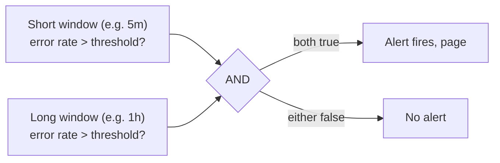
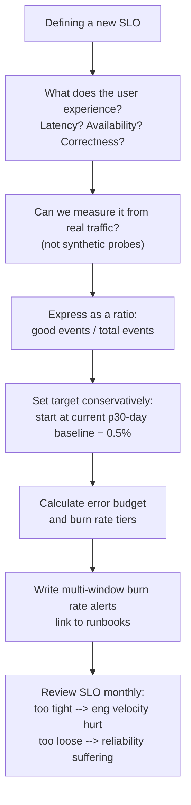

# SLI / SLO / Error Budgets

The Google SRE framework for measuring and managing reliability.

<div class="quiz-progress" data-quiz-progress>
  <span class="quiz-progress-label">0/0 checks</span>
  <span class="quiz-progress-bar"><span class="quiz-progress-fill"></span></span>
</div>

---

## Definitions

| Term | Definition | Example |
|------|-----------|---------|
| **SLI** (Service Level Indicator) | The actual measurement — a ratio of good events to total events | `good_requests / total_requests` |
| **SLO** (Service Level Objective) | The target you commit to — SLI must be ≥ this over a window | 99.9% of requests succeed over 30 days |
| **SLA** (Service Level Agreement) | A contractual SLO with financial penalty if breached | External customer contract |
| **Error Budget** | `(1 - SLO) × window` — how much failure you're allowed | 0.1% × 30 days = 43.2 minutes |

<div class="quiz-card">
  <p class="quiz-q">What actually turns an SLO into an SLA?</p>
  <button class="quiz-reveal">Reveal answer</button>
  <div class="quiz-a" hidden>Not the number itself — an SLA uses the same kind of threshold as an SLO. What makes it an SLA is that it's contractual, typically with an external customer, and carries a financial penalty if breached. An SLO with no contract behind it is just an internal target.</div>
</div>

---

## SLI Design

A good SLI is a **ratio**: `valid_good_events / valid_total_events`.

<div class="tab-group">
  <div class="tab-buttons">
    <button data-tab="avail" class="active">Availability</button>
    <button data-tab="latency">Latency</button>
    <button data-tab="saturation">Saturation</button>
  </div>
  <div class="tab-panels">
    <div class="tab-panel active" data-tab-panel="avail">
      <strong>Fraction of requests that succeed</strong> (non-5xx over total requests). The most common SLI because it maps directly onto "is the service working at all."
    </div>
    <div class="tab-panel" data-tab-panel="latency">
      <strong>Fraction of requests faster than a threshold</strong> (e.g. under 300ms, over total requests). Catches the case a plain availability SLI misses entirely: a service can return 200 OK on every request and still fail every latency-sensitive user.
    </div>
    <div class="tab-panel" data-tab-panel="saturation">
      <strong>Fraction of time a queue stays under a depth threshold.</strong> For async/queue-based systems where "available" barely means anything on its own — a backing-up queue is the failure mode that actually matters there.
    </div>
  </div>
</div>

### Availability SLI (most common)

```promql
# SLI: fraction of requests that succeed (non-5xx)
sum(rate(http_requests_total{status!~"5.."}[5m]))
/
sum(rate(http_requests_total[5m]))
```

### Latency SLI

```promql
# SLI: fraction of requests faster than 300ms
sum(rate(http_request_duration_seconds_bucket{le="0.3"}[5m]))
/
sum(rate(http_request_duration_seconds_count[5m]))
```

### Saturation SLI (queue-based)

```promql
# SLI: fraction of time queue depth is below threshold
1 - (
  sum(rate(job_queue_depth_seconds_total{depth!="0"}[5m]))
  / sum(rate(job_queue_depth_seconds_total[5m]))
)
```

### What makes a bad SLI

| Bad SLI | Why bad | Better |
|---------|---------|--------|
| CPU utilization | Doesn't measure user experience | Request latency |
| Internal error count (absolute) | Not normalized, can't set a stable target | Error rate (ratio) |
| "Service is up" (binary) | Not granular, all-or-nothing | % requests succeeding |
| Probe from one region | Misses regional failures | Multi-region probe OR real user traffic |

<div class="quiz-card">
  <p class="quiz-q">Why is a raw internal error count a bad SLI, even though the numbers are real and easy to collect?</p>
  <button class="quiz-reveal">Reveal answer</button>
  <div class="quiz-a" hidden>It isn't normalized — 50 errors means something completely different at 500 requests/min than at 50,000. Without dividing by total events you can't set a stable target: the same absolute count swings from "fine" to "an outage" purely with traffic volume. A ratio (error rate) stays meaningful regardless of load, which is exactly why a good SLI is defined as good_events / total_events.</div>
</div>

---

## Error Budget Math

```
Error Budget = (1 - SLO_target) × window_seconds

Example: SLO = 99.9%, window = 30 days
  Error Budget = 0.001 × (30 × 24 × 3600)
               = 0.001 × 2,592,000
               = 2,592 seconds
               = 43.2 minutes
```

**Remaining error budget:**

```promql
# Error budget consumed (last 30 days)
1 - (
  sum(rate(http_requests_total{status!~"5.."}[30d]))
  /
  sum(rate(http_requests_total[30d]))
)

# Budget remaining % (if SLO = 0.999)
(
  (1 - 0.999) - (1 - avg_over_time(sli_availability[30d]))
)
/ (1 - 0.999)
```

<div class="quiz-card">
  <p class="quiz-q">SLO = 99.9% over a 30-day window. The service has already been down for 50 minutes this month. Is the error budget blown?</p>
  <button class="quiz-reveal">Reveal answer</button>
  <div class="quiz-a" hidden>Yes. Error Budget = (1 - SLO) × window = 0.001 × 2,592,000 seconds = 2,592 seconds = 43.2 minutes for the whole 30-day window. 50 minutes of downtime already exceeds that 43.2-minute allowance, so the SLO is breached before the window has even finished.</div>
</div>

---

## Multi-Window Multi-Burn-Rate Alerts

Simple threshold alerts on SLI are noisy. The Google SRE Workbook recommends alerting on **burn rate** — how fast you're consuming the error budget — across two time windows to reduce false positives.

### Burn Rate

```
Burn rate = current_error_rate / (1 - SLO)

SLO = 99.9%  →  (1 - SLO) = 0.001
If current error rate = 0.01 (1%)  →  burn rate = 0.01 / 0.001 = 10x
```

Burn rate **1x** = consuming budget at exactly the SLO pace (budget exhausted at end of window).
Burn rate **14.4x** = entire 30-day budget consumed in **2 hours**.

<div class="toggle-switch">
  <div class="toggle-buttons">
    <button data-toggle-opt="ok" class="active state-ok">≤ 1x</button>
    <button data-toggle-opt="warn" class="state-warn">1x – 6x</button>
    <button data-toggle-opt="bad" class="state-bad">&gt; 6x</button>
  </div>
  <div class="toggle-panel active" data-toggle-panel="ok">
    On pace or better. At this rate the budget lasts the full window — none of the four alert tiers even trigger.
  </div>
  <div class="toggle-panel" data-toggle-panel="warn">
    P3/P4 territory (ticket or log). Draining faster than the target pace, but only the paging tiers (P1/P2) demand action right now.
  </div>
  <div class="toggle-panel" data-toggle-panel="bad">
    P1/P2 territory (page). At 14.4x specifically, the entire 30-day budget is gone in about 2 hours — this is exactly the rate the two-window check exists to confirm before waking anyone up.
  </div>
</div>

### The Four Alert Tiers

| Tier | Window | Burn Rate | Budget consumed if burns whole window | Urgency | Action |
|------|--------|-----------|--------------------------------------|---------|--------|
| P1 critical | 1h + 5m | > 14.4x | ~2% (2h alert) | Page immediately | Incident |
| P2 critical | 6h + 30m | > 6x | ~5% (6h alert) | Page | Investigate now |
| P3 warning | 1d + 2h | > 3x | ~10% (1d alert) | Ticket | Next business day |
| P4 info | 3d + 6h | > 1x | >10% | Log | Sprint backlog |

**Why two windows per tier?** Short window = fast detection, high false positive rate. Long window = slow detection, low false positive rate. Both must fire to page.



<div class="stepper">
  <div class="stepper-panels">
    <div class="stepper-panel active">
      <strong>1. Recording rules pre-compute every window.</strong> Error rate at 5m, 30m, 1h, 6h, 1d, and 3d is calculated on a fixed interval, not recomputed from raw counters every time an alert rule evaluates.
    </div>
    <div class="stepper-panel">
      <strong>2. The short window crosses the threshold first.</strong> It reacts fast — but a short spike alone is exactly the kind of noise a single-window alert would page on.
    </div>
    <div class="stepper-panel">
      <strong>3. The long window is checked against the same threshold.</strong> If it hasn't crossed too, the short-window blip was noise and nothing fires.
    </div>
    <div class="stepper-panel">
      <strong>4. Both must be true — the "and" in the alert expr.</strong> Only when short and long windows agree does the alert page. That's what turns a noisy single-metric threshold into a low-false-positive signal.
    </div>
  </div>
  <div class="stepper-controls">
    <button class="stepper-prev">← Prev</button>
    <span class="stepper-dots"></span>
    <span class="stepper-label"></span>
    <button class="stepper-next">Next →</button>
  </div>
</div>

<div class="quiz-card">
  <p class="quiz-q">Why does a P1 alert require both the 1h AND the 5m error rate to exceed 14.4x, instead of just the 5m window alone?</p>
  <button class="quiz-reveal">Reveal answer</button>
  <div class="quiz-a" hidden>The 5m window alone reacts fast but is noisy — a short blip trips it constantly. The 1h window confirms the elevated rate is sustained, not a fluke. Requiring both to fire before paging is exactly the tradeoff described above: short window = fast detection/high false positives, long window = slow detection/low false positives. Combining them keeps detection fast while cutting the false-positive rate.</div>
</div>

```yaml
# Example: P1 critical alert (Prometheus alerting rule)
groups:
- name: slo_alerts
  rules:
  - alert: HighErrorBudgetBurn
    expr: |
      (
        job:http_errors:rate1h{job="api"} > (14.4 * 0.001)
        and
        job:http_errors:rate5m{job="api"} > (14.4 * 0.001)
      )
    for: 2m
    labels:
      severity: critical
    annotations:
      summary: "High error budget burn rate (14.4x)"
      description: "Error rate {{ $value | humanizePercentage }} burning budget at 14.4x"
      runbook: "https://wiki/runbooks/api-high-error-rate"

  - alert: MediumErrorBudgetBurn
    expr: |
      (
        job:http_errors:rate6h{job="api"} > (6 * 0.001)
        and
        job:http_errors:rate30m{job="api"} > (6 * 0.001)
      )
    for: 15m
    labels:
      severity: critical
    annotations:
      summary: "Medium error budget burn rate (6x)"
```

### Recording Rules for Burn Rate

Pre-compute error rates at required windows (Prometheus evaluates these on interval, not at query time):

```yaml
groups:
- name: slo_recording_rules
  interval: 30s
  rules:
  # Error rate over each window
  - record: job:http_errors:rate5m
    expr: |
      sum(rate(http_requests_total{status=~"5.."}[5m])) by (job)
      /
      sum(rate(http_requests_total[5m])) by (job)

  - record: job:http_errors:rate30m
    expr: |
      sum(rate(http_requests_total{status=~"5.."}[30m])) by (job)
      /
      sum(rate(http_requests_total[30m])) by (job)

  - record: job:http_errors:rate1h
    expr: |
      sum(rate(http_requests_total{status=~"5.."}[1h])) by (job)
      /
      sum(rate(http_requests_total[1h])) by (job)

  - record: job:http_errors:rate6h
    expr: |
      sum(rate(http_requests_total{status=~"5.."}[6h])) by (job)
      /
      sum(rate(http_requests_total[6h])) by (job)
```

---

## SLO Dashboard (Grafana)

Key panels for an SLO dashboard:

```
Row 1: Current SLI value | Budget remaining % | Budget burn rate
Row 2: Error rate over time (with SLO line)
Row 3: Latency p50/p95/p99 (with SLO threshold line)
Row 4: Request rate (traffic signal — is low SLI low traffic or real errors?)
Row 5: Error budget burn rate over time (alert threshold lines at 1x, 6x, 14.4x)
```

```promql
# Budget remaining (0-1 range, panel threshold: red < 0.1)
(
  (1 - 0.999) - (
    1 - (
      sum(rate(http_requests_total{status!~"5.."}[30d]))
      / sum(rate(http_requests_total[30d]))
    )
  )
) / (1 - 0.999)

# Current burn rate (panel threshold: red > 14.4, orange > 6)
(
  1 - sum(rate(http_requests_total{status!~"5.."}[1h]))
    / sum(rate(http_requests_total[1h]))
) / 0.001
```

---

## SLO Decision Framework



<div class="stepper">
  <div class="stepper-panels">
    <div class="stepper-panel active">
      <strong>1. What does the user experience?</strong> Latency? Availability? Correctness? Anchor the SLO in something a user actually feels, not something convenient to query.
    </div>
    <div class="stepper-panel">
      <strong>2. Can you measure it from real traffic?</strong> Not a synthetic probe — if it can't be measured from real requests, it isn't an SLI yet.
    </div>
    <div class="stepper-panel">
      <strong>3. Express it as a ratio.</strong> good events / total events, same shape as every SLI in this guide.
    </div>
    <div class="stepper-panel">
      <strong>4. Set the target conservatively.</strong> Start at the current 30-day baseline minus about 0.5% — not an aspirational number picked before you've measured anything.
    </div>
    <div class="stepper-panel">
      <strong>5. Calculate the error budget and burn-rate tiers.</strong> Derived straight from the target set in the previous step.
    </div>
    <div class="stepper-panel">
      <strong>6. Write multi-window burn-rate alerts, then review monthly.</strong> Link alerts to runbooks. Review cadence matters: too tight hurts eng velocity, too loose lets reliability quietly slide.
    </div>
  </div>
  <div class="stepper-controls">
    <button class="stepper-prev">← Prev</button>
    <span class="stepper-dots"></span>
    <span class="stepper-label"></span>
    <button class="stepper-next">Next →</button>
  </div>
</div>

**Common mistake:** Setting SLO at 99.99% before measuring baseline. If your actual baseline is 99.5%, a 99.99% SLO means your error budget is always exhausted and every deploy is blocked.

<div class="quiz-card">
  <p class="quiz-q">A team sets a new SLO at 99.99% without first measuring their actual baseline, which turns out to be 99.5%. What breaks?</p>
  <button class="quiz-reveal">Reveal answer</button>
  <div class="quiz-a" hidden>The error budget is permanently exhausted. Real reliability (99.5%) is already far worse than the target (99.99%), so the tiny budget that target implies is used up at all times. In practice this blocks every deploy gated on remaining error budget, because there's never any budget left to spend.</div>
</div>

---

## SLO per Service Type

| Service type | Primary SLI | SLO starting point |
|---|---|---|
| User-facing API | Availability + p99 latency | 99.9% / < 500ms |
| Background job | Completion rate + job duration | 99.5% complete within 1h |
| Data pipeline | Freshness (data age) + completeness | Data < 15min old, 99.9% records |
| Storage | Durability + availability | 99.99% durability, 99.9% availability |
| Internal service | Availability | 99.5% (lower than user-facing) |
