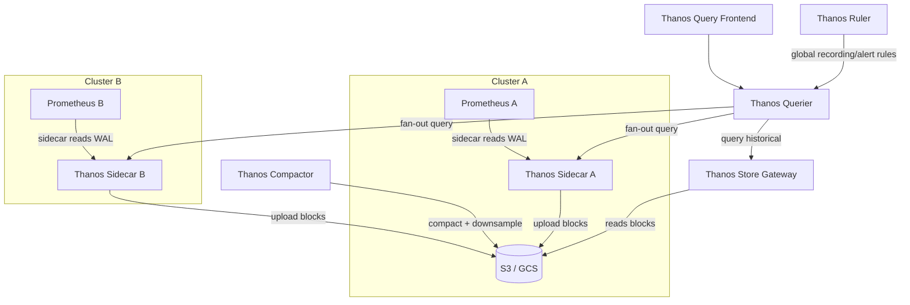
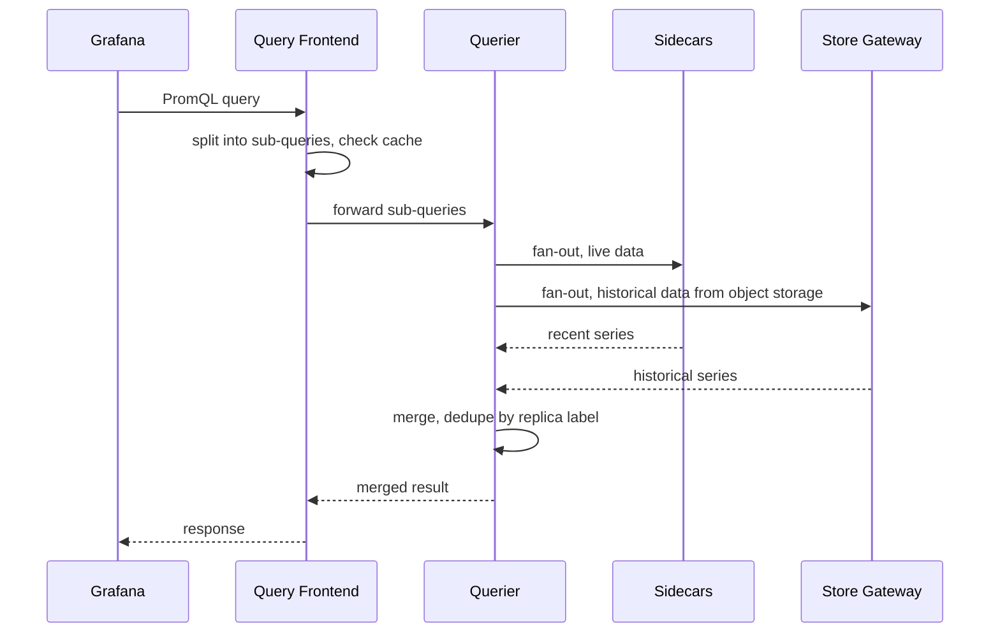
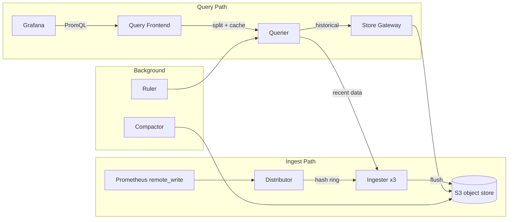
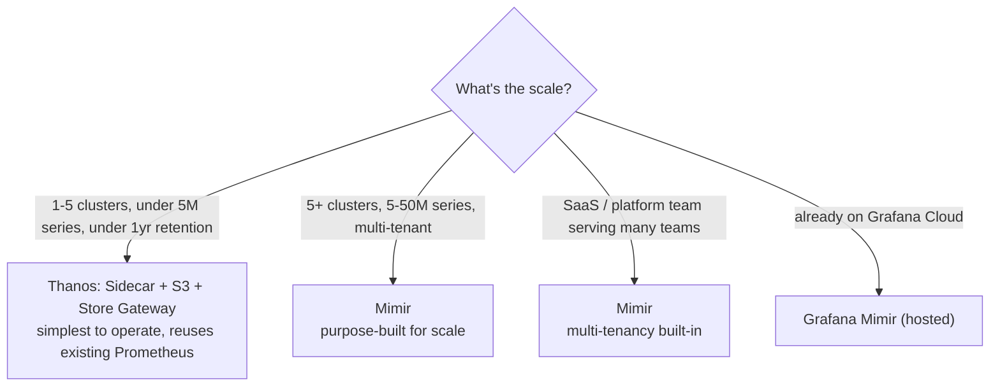

# Thanos and Mimir — Long-Term Metrics Storage

Prometheus stores data locally for 15 days by default. For long-term retention, global query across clusters, and high availability, you need Thanos or Mimir.

<div class="quiz-progress" data-quiz-progress>
  <span class="quiz-progress-label">0/0 checks</span>
  <span class="quiz-progress-bar"><span class="quiz-progress-fill"></span></span>
</div>

---

## The Problem Prometheus Alone Can't Solve

| Problem | Why Prometheus alone fails |
|---------|--------------------------|
| Data older than retention period | TSDB purges it |
| Query across multiple clusters | Each Prometheus is isolated |
| Prometheus HA (2 replicas scraping same targets) | Duplicate series, can't merge |
| Downsampling for long-range queries | Raw data is slow at 1-year range |
| Object storage cost efficiency | Local disk is expensive at scale |

<div class="quiz-card">
  <p class="quiz-q">Two Prometheus instances each run in their own isolated cluster. Can one PromQL query see data from both, with no Thanos or Mimir in front of them?</p>
  <button class="quiz-reveal">Reveal answer</button>
  <div class="quiz-a" hidden>No — each Prometheus is isolated, so a query across multiple clusters is exactly one of the problems Prometheus alone can't solve. That's what Thanos's Querier fan-out and Mimir's distributed query path exist to fix.</div>
</div>

---

Two different answers to that problem — flip between them before going deeper into either:

<div class="tab-group">
  <div class="tab-buttons">
    <button data-tab="thanos" class="active">Thanos</button>
    <button data-tab="mimir">Mimir</button>
  </div>
  <div class="tab-panels">
    <div class="tab-panel active" data-tab-panel="thanos">
      Bolts onto existing Prometheus instances via a Sidecar (or Receive) — Prometheus itself is unmodified. Lower operational complexity. Best for &lt; 5 clusters, &lt; 10M series.
    </div>
    <div class="tab-panel" data-tab-panel="mimir">
      A fully distributed, horizontally scalable TSDB speaking the Prometheus remote_write and query API. Higher operational complexity, but every component scales independently and multi-tenancy is built in. Best for &gt; 5 clusters, SaaS, millions of series.
    </div>
  </div>
</div>

---

## Thanos

Thanos extends Prometheus by adding components that bolt onto existing Prometheus instances.



### Components

| Component | Role |
|-----------|------|
| **Sidecar** | Runs next to each Prometheus. Exposes StoreAPI, uploads TSDB blocks to object storage |
| **Store Gateway** | Reads blocks from object storage, answers queries for historical data |
| **Querier** | Fan-out query engine — merges results from Sidecars + Store Gateway, deduplicates HA replicas |
| **Query Frontend** | Caching + query splitting layer in front of Querier. Splits long-range queries into parallelizable sub-queries |
| **Compactor** | Merges small TSDB blocks, applies downsampling (5m and 1h resolution for old data) |
| **Ruler** | Evaluates recording rules and alert rules globally (across all clusters) |
| **Receive** (alternative) | Push-based ingestion via remote_write — no sidecar needed |

<div class="toggle-switch">
  <div class="toggle-buttons">
    <button data-toggle-opt="sidecar" class="active">Sidecar</button>
    <button data-toggle-opt="receive">Receive</button>
  </div>
  <div class="toggle-panel active" data-toggle-panel="sidecar">
    Runs next to each Prometheus, exposes StoreAPI, and uploads TSDB blocks to object storage. This is the path in the architecture diagram above — Prometheus itself stays completely unmodified.
  </div>
  <div class="toggle-panel" data-toggle-panel="receive">
    Push-based ingestion via <code>remote_write</code> — no sidecar needed. Prometheus (or anything speaking remote_write) pushes samples straight into Receive instead of Receive pulling from a Sidecar.
  </div>
</div>

<div class="quiz-card">
  <p class="quiz-q">You can't run a Sidecar next to a given Prometheus. What's the alternative ingestion path, and what does Ruler add on top of either one?</p>
  <button class="quiz-reveal">Reveal answer</button>
  <div class="quiz-a" hidden><strong>Receive</strong> — push-based ingestion via remote_write, no sidecar needed. <strong>Ruler</strong> is a separate component from both: it evaluates recording rules and alert rules globally, across all clusters, rather than replacing Sidecar or Receive.</div>
</div>

A single query touches every one of these pieces at once — here's one PromQL query's path through the fan-out:



<div class="stepper">
  <div class="stepper-panels">
    <div class="stepper-panel active">
      <strong>1. Grafana sends PromQL to Query Frontend.</strong> The Frontend sits in front of the Querier.
    </div>
    <div class="stepper-panel">
      <strong>2. Frontend splits and caches.</strong> Long-range queries get split into parallelizable sub-queries before being forwarded to the Querier.
    </div>
    <div class="stepper-panel">
      <strong>3. Querier fans out.</strong> It queries every Sidecar for live data and the Store Gateway for historical data from object storage, in parallel.
    </div>
    <div class="stepper-panel">
      <strong>4. Merge and dedupe.</strong> The Querier merges the results and deduplicates HA replicas by matching the <code>replica</code> label.
    </div>
    <div class="stepper-panel">
      <strong>5. Response returns.</strong> The merged result flows back through the Frontend to Grafana as one PromQL response — the caller never sees which Sidecar or Store Gateway a given series came from.
    </div>
  </div>
  <div class="stepper-controls">
    <button class="stepper-prev">← Prev</button>
    <span class="stepper-dots"></span>
    <span class="stepper-label"></span>
    <button class="stepper-next">Next →</button>
  </div>
</div>

### Deduplication

When two Prometheus replicas scrape the same targets (HA setup), both upload identical data. Thanos Querier deduplicates by matching `replica` label:

```yaml
# Prometheus HA: two replicas, identical config except replica label
global:
  external_labels:
    cluster: production
    replica: "0"   # replica "1" on the other instance
```

```bash
# Query with deduplication
thanos query --query.replica-label=replica
# Querier merges series with identical labels except the replica label
```

<div class="quiz-card">
  <p class="quiz-q">Two Prometheus replicas in an HA pair scrape the same targets and both upload blocks with identical series, differing only in their <code>replica</code> external label. How does Thanos Querier avoid double-counting them?</p>
  <button class="quiz-reveal">Reveal answer</button>
  <div class="quiz-a" hidden>By deduplicating on <code>--query.replica-label=replica</code> — it merges series that are identical on every label except <code>replica</code>, so the two copies collapse into one logical series instead of being double-counted.</div>
</div>

### Object Storage Config

```yaml
# thanos-storage-config.yaml (mounted as secret)
type: S3
config:
  bucket: my-thanos-metrics
  endpoint: s3.us-east-1.amazonaws.com
  region: us-east-1
  # Uses IRSA on EKS — no access key needed
```

### Downsampling

Thanos Compactor creates downsampled versions of old data:

| Data age | Resolution | Raw scrape interval |
|----------|-----------|---------------------|
| 0 – 40 hours | Raw (15s) | Kept as-is |
| 40h – 10 days | 5-minute | Aggregated to min/max/sum/count |
| 10 days+ | 1-hour | Further aggregated |

```bash
# Grafana/Thanos auto-selects resolution based on query range
# You can also explicitly request:
# step=5m → Thanos picks 5m downsampled if range > 40h
```

Here's what happens to a single data point as it ages past each threshold:

<div class="stepper">
  <div class="stepper-panels">
    <div class="stepper-panel active">
      <strong>1. 0–40 hours: raw.</strong> Kept at the original 15s scrape resolution — no aggregation yet.
    </div>
    <div class="stepper-panel">
      <strong>2. 40h–10 days: 5-minute resolution.</strong> The Compactor aggregates it into 5-minute buckets (min/max/sum/count).
    </div>
    <div class="stepper-panel">
      <strong>3. 10 days+: 1-hour resolution.</strong> The Compactor aggregates it further into 1-hour buckets — this is what keeps a 1-year range query fast instead of scanning raw 15s data end to end.
    </div>
  </div>
  <div class="stepper-controls">
    <button class="stepper-prev">← Prev</button>
    <span class="stepper-dots"></span>
    <span class="stepper-label"></span>
    <button class="stepper-next">Next →</button>
  </div>
</div>

<div class="quiz-card">
  <p class="quiz-q">A Grafana dashboard queries a full year of data. Why doesn't Thanos have to scan a year of raw 15s-resolution samples to answer it?</p>
  <button class="quiz-reveal">Reveal answer</button>
  <div class="quiz-a" hidden>The Compactor already downsampled anything older than 10 days to 1-hour resolution (and 40h–10d to 5-minute resolution) — Grafana/Thanos auto-selects the coarser resolution for a range that long, so the query touches far fewer aggregated points instead of every raw sample.</div>
</div>

---

## Mimir (Grafana's Prometheus-compatible, horizontally scalable backend)

Mimir is a fully distributed, horizontally scalable TSDB. It implements the Prometheus remote_write and query API — drop-in replacement at scale.



### Key differences vs Thanos

| | Thanos | Mimir |
|-|--------|-------|
| Architecture | Bolt-on to Prometheus | Standalone distributed system |
| Ingest | Sidecar (pull) or Receive (push) | remote_write only (push) |
| Multi-tenancy | No (single tenant) | Yes — tenant per `X-Scope-OrgID` header |
| Horizontal scale | Limited (Querier/Store Gateway) | Full — every component scales independently |
| Consistency | Eventually consistent (block uploads) | Strong — ingester replication factor |
| Operational complexity | Lower (reuses Prometheus) | Higher (many components) |
| Best for | < 5 clusters, < 10M series | > 5 clusters, SaaS, millions of series |

### Mimir Multi-Tenancy

```yaml
# Prometheus remote_write with tenant header
remote_write:
  - url: http://mimir-distributor:8080/api/v1/push
    headers:
      X-Scope-OrgID: "team-platform"
```

```bash
# Query with tenant
curl -H "X-Scope-OrgID: team-platform" \
  "http://mimir-query-frontend:8080/prometheus/api/v1/query?query=up"
```

<div class="quiz-card">
  <p class="quiz-q">Two teams both push metrics to the same Mimir cluster via remote_write. What keeps their data (and queries) from mixing?</p>
  <button class="quiz-reveal">Reveal answer</button>
  <div class="quiz-a" hidden>The <code>X-Scope-OrgID</code> header on both the remote_write push and the query — Mimir is multi-tenant by design, unlike Thanos which is single-tenant, so every request carries a tenant ID that keeps series fully separated.</div>
</div>

---

## Choosing Between Them

```
Small-medium (1-5 clusters, < 5M series, < 1 year retention)
  → Thanos with Sidecar + S3 + Store Gateway
  → Simplest to operate, reuses existing Prometheus

Large (5+ clusters, 5-50M series, multi-tenant)
  → Mimir
  → Purpose-built for scale

SaaS / platform team serving many teams
  → Mimir (multi-tenancy built-in)

Already on Grafana Cloud
  → Grafana Mimir (hosted)
```

The same decision, as a flowchart:



<div class="quiz-card">
  <p class="quiz-q">A platform team is standing up metrics for many separate internal teams on one shared backend. Which system fits, and why?</p>
  <button class="quiz-reveal">Reveal answer</button>
  <div class="quiz-a" hidden>Mimir — multi-tenancy is built in (a tenant per <code>X-Scope-OrgID</code>), which is exactly the SaaS/platform-team-serving-many-teams case. Thanos is single-tenant, so isolating teams on it would need separate clusters instead of one shared backend.</div>
</div>

---

## Hands-on: Thanos on EKS

```bash
# 1. Add external_labels to existing Prometheus ConfigMap
kubectl edit configmap prometheus-config -n monitoring
# Add:
# global:
#   external_labels:
#     cluster: production-us-east-1
#     replica: "0"

# 2. Deploy Thanos Sidecar alongside Prometheus
# (add as second container in Prometheus Deployment)
# - shares /data volume with Prometheus
# - uploads blocks every 2h

# 3. Create S3 bucket for blocks
aws s3 mb s3://my-thanos-blocks --region us-east-1

# 4. Deploy Store Gateway (reads historical from S3)
# 5. Deploy Querier (fan-out to Sidecar + Store Gateway)
# 6. Point Grafana at Thanos Querier instead of Prometheus directly

# Verify blocks are uploading
kubectl logs -n monitoring deployment/thanos-sidecar | grep "uploaded"

# Check Thanos Querier sees all stores
thanos tools bucket inspect \
  --objstore.config-file=storage.yaml \
  --output=table

# Query via Thanos (same PromQL as Prometheus)
curl "http://thanos-querier:9090/api/v1/query?query=up"
```

---

## Retention and Cost

```
Raw Prometheus (15 days, local disk):  $0.10/GB/month (EBS gp3)
Thanos on S3 (1 year):                $0.023/GB/month (S3 Standard)
  + downsampling reduces query cost for old data
  + lifecycle rules: move to S3-IA after 30 days → $0.0125/GB/month

Typical savings: 80-90% vs keeping data on Prometheus local disk
```

```yaml
# S3 lifecycle rule for cost optimization
aws s3api put-bucket-lifecycle-configuration \
  --bucket my-thanos-blocks \
  --lifecycle-configuration '{
    "Rules": [{
      "ID": "move-to-ia",
      "Status": "Enabled",
      "Filter": {"Prefix": ""},
      "Transitions": [{"Days": 30, "StorageClass": "STANDARD_IA"}]
    }]
  }'
```
