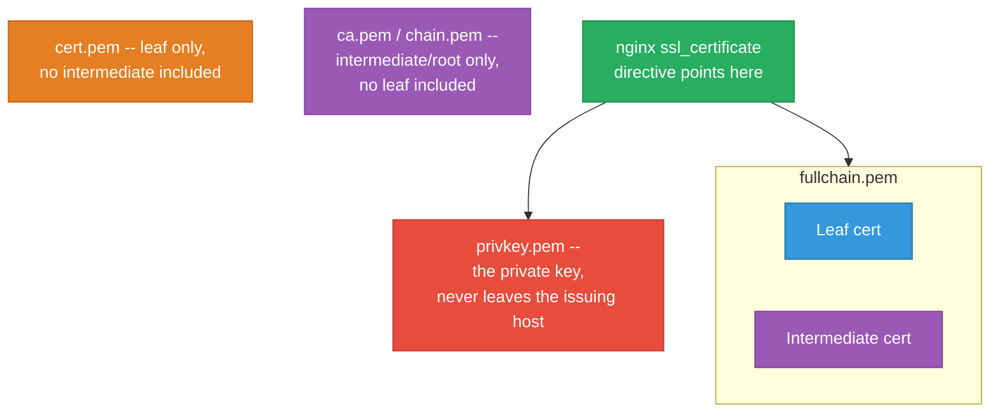
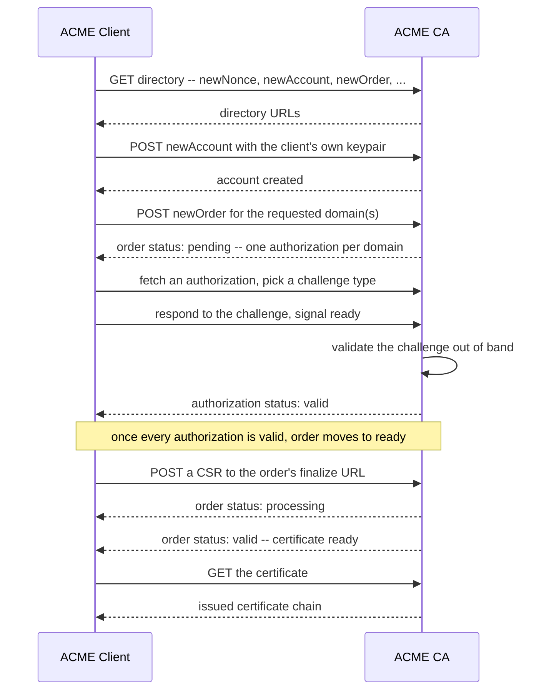
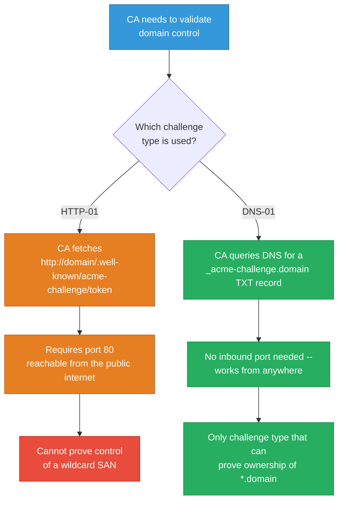
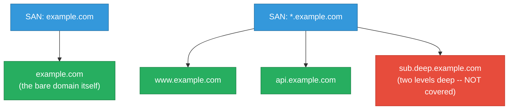
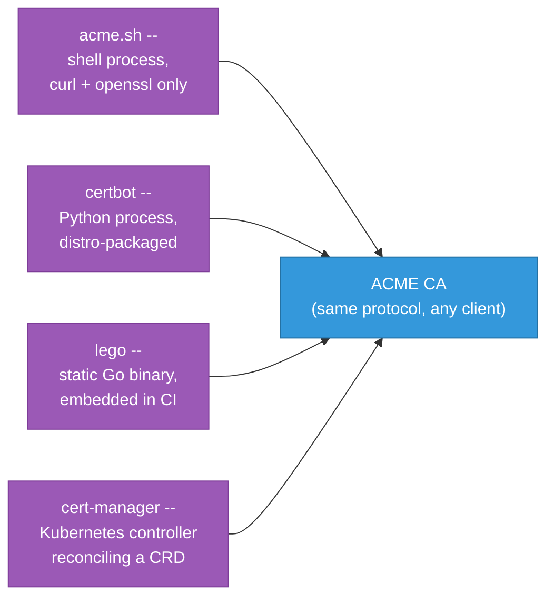
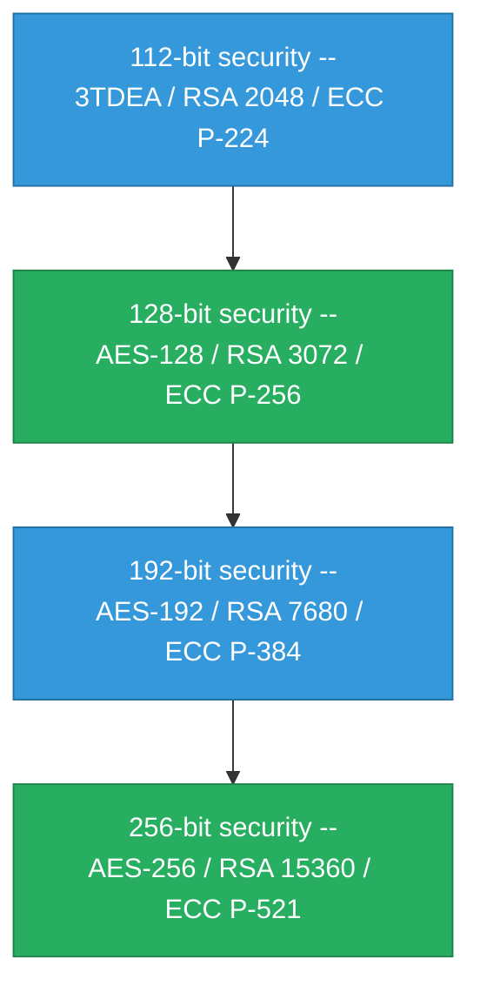
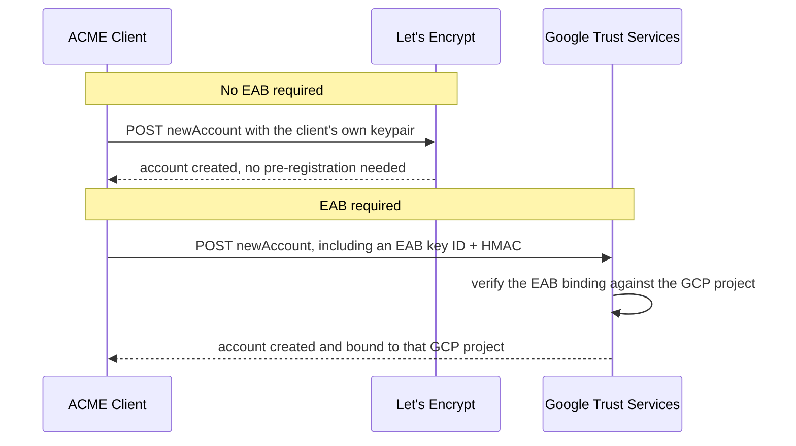
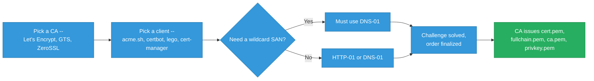

# ACME Certificate Automation

`networking/tls-encryption.md` covers how TLS itself works — handshakes, cipher suites, the
certificate chain, mTLS. This file covers a narrower but easy-to-get-wrong layer on top of that:
how a certificate actually gets *issued and renewed* in an automated way, without a human
manually generating a CSR and uploading it to a CA's web portal every few months. That
automation layer is one specific protocol — ACME — plus a handful of CLI tools that all speak
it, and a couple of file-format and key-choice details that trip people up the first time they
read a real issuance script.

<div class="quiz-progress" data-quiz-progress>
  <span class="quiz-progress-label">0/0 checks</span>
  <span class="quiz-progress-bar"><span class="quiz-progress-fill"></span></span>
</div>

---

## PEM Format and the Standard Certificate File Set

Every ACME client (acme.sh, certbot, lego) hands you back the same small set of PEM files after
a successful issuance, and mixing them up is the single most common way to break a webserver's
TLS config right after "successfully" getting a certificate.

PEM itself is nothing exotic — a certificate or key, DER-encoded, base64'd, and wrapped in a
`-----BEGIN CERTIFICATE-----` / `-----END CERTIFICATE-----` armor so it's safe to store as plain
text and concatenate multiple certs into one file.



The four files acme.sh and certbot both produce, and what each is actually for:

- **`cert.pem` / `.cer`** — the leaf certificate only, nothing else
- **`privkey.pem` / `.key`** — the private key. This is the one file that should never leave the
  issuing host, get logged, or get committed anywhere
- **`fullchain.pem`** — the leaf certificate followed by every intermediate CA certificate,
  concatenated into one file. This is what a webserver's TLS config should point at
- **`chain.pem` / `ca.pem`** — the intermediate (and sometimes root) certificates only, with no
  leaf — used by validators or clients that want the chain separately from the identity cert

<div class="quiz-card">
  <p class="quiz-q">Why does nginx's <code>ssl_certificate</code> directive want <code>fullchain.pem</code>, not <code>cert.pem</code> alone?</p>
  <button class="quiz-reveal">Reveal answer</button>
  <div class="quiz-a" hidden>Browsers only trust root CAs that are already baked into their own trust store — they don't automatically know about the intermediate CA that actually signed your leaf certificate. The server has to supply that intermediate itself as part of the TLS handshake, or any client that doesn't already have the intermediate cached will fail chain validation even though the leaf cert is perfectly valid. <code>fullchain.pem</code> is the leaf plus that intermediate concatenated together; <code>cert.pem</code> alone is missing the half of the chain the client actually needs.</div>
</div>

---

## The ACME Protocol (RFC 8555)

ACME — Automatic Certificate Management Environment — is an HTTPS API defined in
[RFC 8555](https://datatracker.ietf.org/doc/html/rfc8555) for automating exactly two things:
proving you control a domain, and getting a certificate issued for it once you've proven that.
It's deliberately CA-agnostic. Let's Encrypt is the most famous *operator* of an ACME server,
but the protocol itself is just as happily spoken by Google Trust Services, ZeroSSL, or any
other CA that stands up an ACME-compliant endpoint — which is exactly why an acme.sh script can
switch CAs with nothing more than a `--server` flag.



<div class="stepper">
  <div class="stepper-panels">
    <div class="stepper-panel active">
      <strong>1. Discover and register.</strong> The client fetches the CA's ACME directory (its <code>newNonce</code>/<code>newAccount</code>/<code>newOrder</code> endpoint URLs) and registers an account via <code>newAccount</code>, keyed to a client-generated keypair. There's no username or password — the keypair itself is the account's identity.
    </div>
    <div class="stepper-panel">
      <strong>2. Order and authorize.</strong> <code>newOrder</code> creates an order in <strong>pending</strong> state listing every requested domain. The CA hands back one authorization per domain, and each authorization carries one or more challenge options (HTTP-01, DNS-01, ...).
    </div>
    <div class="stepper-panel">
      <strong>3. Solve the challenge.</strong> The client satisfies one challenge per authorization — publish a file, publish a DNS record — and tells the CA it's ready. The CA validates out of band, and once every authorization on the order is <strong>valid</strong>, the order itself moves to <strong>ready</strong>.
    </div>
    <div class="stepper-panel">
      <strong>4. Finalize and download.</strong> The client POSTs a CSR to the order's <code>finalize</code> URL. The order moves to <strong>processing</strong> while the CA actually issues, then reaches <strong>valid</strong> once the certificate is downloadable — or <strong>invalid</strong> if anything along the way failed.
    </div>
  </div>
  <div class="stepper-controls">
    <button class="stepper-prev">← Prev</button>
    <span class="stepper-dots"></span>
    <span class="stepper-label"></span>
    <button class="stepper-next">Next →</button>
  </div>
</div>

<div class="quiz-card">
  <p class="quiz-q">A script issues a cert with <code>--server letsencrypt</code>, and a different script issues one with <code>--server google</code>. What's actually different between the two runs at the protocol level?</p>
  <button class="quiz-reveal">Reveal answer</button>
  <div class="quiz-a" hidden>Nothing about the protocol changes at all — both runs speak the exact same ACME (RFC 8555) request/response flow: newAccount, newOrder, authorization, challenge, finalize. The only thing that differs is which CA's directory URL the client is pointed at, since ACME is deliberately CA-agnostic. Swapping <code>--server</code> is closer to changing an API's base URL than changing how the client talks to it.</div>
</div>

---

## HTTP-01 vs DNS-01 Challenges

An authorization's challenge is how the client actually proves control of the domain to the CA.
The two that matter in practice work completely differently, and which one you're forced into
depends entirely on whether a wildcard SAN is involved.



<div class="toggle-switch">
  <div class="toggle-buttons">
    <button data-toggle-opt="http01" class="active state-ok">HTTP-01</button>
    <button data-toggle-opt="dns01" class="state-warn">DNS-01</button>
  </div>
  <div class="toggle-panel active" data-toggle-panel="http01">
    Simplest to automate when the server already answers on port 80 — the ACME client just serves a file at a well-known path and the CA fetches it directly. Fails outright behind a firewall with no port 80 exposed, and can never prove ownership of a wildcard SAN, since there's no single reachable URL that could stand in for "the entire subdomain space."
  </div>
  <div class="toggle-panel" data-toggle-panel="dns01">
    Works with no inbound ports open at all, and is the only challenge type a wildcard cert can use. The cost: either a DNS provider API the ACME client can drive automatically, or — in manual mode — a human copying a TXT record value into the zone and waiting for propagation before the order can be finalized.
  </div>
</div>

```bash
# Confirm the TXT record has actually propagated before completing a
# DNS-01 issuance — this is the step a manual-mode script waits on
dig TXT _acme-challenge.example.com +short
```

<div class="quiz-card">
  <p class="quiz-q">Why does requesting a wildcard cert force DNS-01, even if HTTP-01 would otherwise work fine for the base domain?</p>
  <button class="quiz-reveal">Reveal answer</button>
  <div class="quiz-a" hidden>A wildcard SAN represents an entire subdomain space, not one specific, already-known hostname. HTTP-01 can only prove control over a single reachable URL's webroot — there's no well-known path that could stand in for "every possible subdomain." DNS-01 proves control at the zone level instead (the ability to publish a TXT record under the parent domain), which is the only mechanism that covers a wildcard's whole range in one proof.</div>
</div>

---

## Wildcard Certificates

A wildcard SAN like `*.example.com` covers exactly one subdomain level — and, easy to miss the
first time, it does **not** cover the bare `example.com` itself. That's why an issuance script
requests both together: `-d example.com -d *.example.com`.



Neither SAN implies the other, and the wildcard only reaches one level down — a second-level
subdomain like `sub.deep.example.com` needs its own SAN (`*.deep.example.com`, or the literal
name) entirely separately.

---

## ACME Client Tooling: acme.sh vs certbot vs lego vs cert-manager

The ACME protocol itself doesn't care what's driving it — these four tools are the same
handshake wearing very different runtime shapes.



<div class="tab-group">
  <div class="tab-buttons">
    <button data-tab="acmesh" class="active">acme.sh</button>
    <button data-tab="certbot">certbot</button>
    <button data-tab="lego">lego</button>
    <button data-tab="certmanager">cert-manager</button>
  </div>
  <div class="tab-panels">
    <div class="tab-panel active" data-tab-panel="acmesh">
      Pure POSIX shell, no runtime dependency beyond <code>curl</code> and <code>openssl</code>. Ships a huge catalog of DNS-provider API integrations for automated DNS-01, and defaults to ECC keys. The interactive issue/complete/copy script this file's examples are drawn from is a real acme.sh wrapper.
    </div>
    <div class="tab-panel" data-tab-panel="certbot">
      The EFF's reference client, written in Python, and the default ACME client on most Linux distro package managers. Has the broadest plugin ecosystem — both DNS-01 provider plugins and plugins that edit an nginx/apache config directly rather than just handing you files.
    </div>
    <div class="tab-panel" data-tab-panel="lego">
      Written in Go, ships as a single static binary with no interpreter or shell dependency. Commonly embedded inside other tools and CI pipelines (it's what several higher-level products vendor internally) rather than run interactively by a human.
    </div>
    <div class="tab-panel" data-tab-panel="certmanager">
      Not a CLI client at all — a Kubernetes controller that speaks ACME on the cluster's behalf via <code>Issuer</code>/<code>ClusterIssuer</code> CRDs, reconciling certificates the same way any other Kubernetes controller reconciles state. Already covered in depth in <code>networking/tls-encryption.md</code>'s "Let's Encrypt with cert-manager" section and <code>kubernetes/custom-resources-operators.md</code>'s reconcile-loop walkthrough — read those for the Kubernetes-specific detail instead of duplicating it here.
    </div>
  </div>
</div>

A concrete acme.sh detail worth knowing if you're reading a real script: `--issue` starts a new
order, but `--renew` is also what *completes* a pending manual-mode DNS-01 order once the TXT
record has propagated — it's not only what a cron job runs months later. And any directory named
`${DOMAIN}_ecc` (rather than just `${DOMAIN}`) is acme.sh's own convention for "this is the
ECC keypair," which leads directly into the next section.

---

## ECC vs RSA Certificates

Easy to conflate with something else this repo already covers: `tls-encryption.md`'s
ECDH/ECDHE/X25519 sections are about the **TLS handshake's key-exchange curve** — a completely
separate choice from the algorithm used for the **certificate's own key pair**, which is what
this section is about.

ECC and RSA aren't "more secure" and "less secure" at the same key size — they're different
algorithms with different security-per-bit, formalized in **NIST SP 800-57 Part 1 Revision 5**'s
security-strength equivalence table:

| Security strength | Symmetric (AES) | RSA / DH | ECC |
|---|---|---|---|
| 112-bit | 3TDEA | 2048-bit | P-224 |
| 128-bit | AES-128 | 3072-bit | P-256 |
| 192-bit | AES-192 | 7680-bit | P-384 |
| 256-bit | AES-256 | 15360-bit | P-521 |



A 256-bit ECC key (P-256) needs roughly a 3072-bit RSA key to match its security strength — RSA
keys have to grow much faster than ECC keys to hold the same strength as you move up the table.

<div class="toggle-switch">
  <div class="toggle-buttons">
    <button data-toggle-opt="ecc" class="active">ECC (P-256)</button>
    <button data-toggle-opt="rsa">RSA</button>
  </div>
  <div class="toggle-panel active" data-toggle-panel="ecc">
    Smaller keys and faster signing at equivalent security — a 256-bit ECC key matches roughly a 3072-bit RSA key. acme.sh's own defaults (<code>DEFAULT_ACCOUNT_KEY_LENGTH</code> and <code>DEFAULT_DOMAIN_KEY_LENGTH</code>) are both <code>ec-256</code> — this is exactly why an acme.sh issuance produces a <code>${DOMAIN}_ecc</code> directory with no <code>--ecc</code> flag ever passed; ECC has been the default, not an opt-in, for years.
  </div>
  <div class="toggle-panel" data-toggle-panel="rsa">
    The widest possible legacy-client compatibility — some very old TLS clients don't support ECC certs at all. acme.sh switches an issuance to RSA with <code>--keylength 2048</code> (or <code>3072</code>/<code>4096</code>/<code>8192</code>); the tradeoff is a much larger key for the same security tier once you compare against the table above.
  </div>
</div>

---

## Alternate ACME CAs and External Account Binding (EAB)

Any ACME-compliant CA works with any ACME client — but not every CA lets just anyone register
an account the way Let's Encrypt does.

| CA | EAB required? | Certificate validity |
|---|---|---|
| Let's Encrypt | No | 90 days by default; also now offers a 45-day (`tlsserver` profile) and a 6-day (`shortlived` profile) option |
| Google Trust Services (Public CA) | **Yes** — bound to a GCP project via the Public CA API | 90 days |
| ZeroSSL | **Yes** — single-use EAB credential generated per account from their dashboard | 90 days |
| Buypass Go SSL | No | 180 days — **discontinued Oct 16, 2025** (no new orders/renewals since); listed here only as a historical example of what a no-EAB, longer-validity CA looked like |

**External Account Binding (EAB)** is how a CA that requires pre-registration links an otherwise
anonymous ACME account (just a client-generated keypair) to something it already knows about —
a GCP project, a ZeroSSL dashboard account. The CA hands out a key ID + HMAC key pair out of
band (through its own console, not through ACME), and the client includes that pair in its
`newAccount` request so the CA can verify the binding before creating the account.



Worth keeping in mind as a bigger-picture reason ACME automation matters at all: Let's Encrypt
is moving toward a **45-day default validity by 2028** as an industry-wide CA/Browser Forum
requirement. Manually renewing certificates every 90 days is already a chore most teams have
automated away — at 45 days, and eventually the 6-day `shortlived` profile some teams are
already adopting, doing it by hand stops being realistic at all.

<div class="quiz-card">
  <p class="quiz-q">Why does Google Trust Services require EAB for every ACME account, while Let's Encrypt requires none at all?</p>
  <button class="quiz-reveal">Reveal answer</button>
  <div class="quiz-a" hidden>Google Trust Services ties every ACME account to a pre-existing GCP project via the Public CA API, so issuance is scoped to something Google already knows about and can rate-limit or bill against — EAB is the mechanism that proves the account genuinely belongs to that project before the CA will create it. Let's Encrypt's model is deliberately the opposite: zero pre-registration, where any anonymous keypair can request a certificate for any domain it can prove control of through a normal ACME challenge.</div>
</div>

---

## Putting It All Together



<div class="quiz-card">
  <p class="quiz-q">The ACME protocol layer completed cleanly end to end — account registered, authorization valid, order finalized — but the certificate still isn't trusted in a browser. Given everything above, what's the most likely explanation?</p>
  <button class="quiz-reveal">Reveal answer</button>
  <div class="quiz-a" hidden>The ACME issuance almost certainly wasn't the problem — it's very likely an application-layer file-selection mistake: the server is probably pointed at <code>cert.pem</code> (leaf only) instead of <code>fullchain.pem</code> (leaf + intermediates). The browser has no way to build a trust path from an unfamiliar leaf cert up to a root it already trusts without the intermediate the server was supposed to supply. Same root-cause shape as the AWS Aurora DNS-caching and GCP AlloyDB failover scenarios elsewhere in this repo: the protocol/infrastructure layer worked correctly, and the actual bug is one layer up, in how the client or server consumed the result.</div>
</div>

---

## Quick Reference: ACME/Certificate Commands

| Task | Command |
|---|---|
| Confirm a DNS-01 TXT record has propagated | `dig TXT _acme-challenge.example.com +short` |
| Check a cert's validity window | `openssl x509 -in cert.pem -noout -dates` |
| Check what SANs a cert actually covers | `openssl x509 -in cert.pem -noout -text \| grep -A1 "Subject Alternative Name"` |
| Issue via acme.sh (manual DNS-01, wildcard) | `acme.sh --issue -d example.com -d *.example.com --dns` |
| Complete a pending acme.sh manual-mode order | `acme.sh --renew -d example.com --yes-I-know-dns-manual-mode-enough-go-ahead-please` |
| Issue via certbot (manual DNS-01) | `certbot certonly --manual --preferred-challenges dns -d example.com` |
| Issue via lego (manual DNS-01) | `lego --domains example.com --email you@example.com --http.disable --dns.disable-cp run` |
