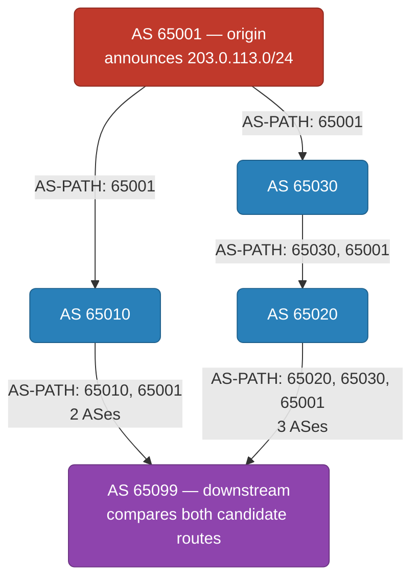

# BGP — How the Internet Actually Routes Between Networks

`osi-model.md` and `tcp-udp.md` both assume something this file doesn't: that once a packet knows its destination IP, the network already knows how to get it there. It doesn't, not automatically. The internet is not one network with a master routing table — it's tens of thousands of independently operated networks that have to tell each other, continuously, "here's what I can reach." BGP (Border Gateway Protocol) is the protocol running between every one of them that makes that reachability exist at all.

  0/0 checks
  

---

## 1. Autonomous Systems — The Actual Unit of the Internet

An **Autonomous System (AS)** is a network under one administrative control — an ISP, a cloud provider, a large company running its own backbone — identified by a globally unique **ASN** (e.g. `AS15169` for Google). The internet isn't a single network at all; it's a mesh of 70,000+ ASes, each one announcing to its neighboring ASes which IP prefixes it owns or can reach. Nobody outside an AS's own operators decides what that AS announces, and nobody inside it needs to understand the topology of any other AS to make routing work.

That last point is the actual reason this unit exists: no single entity could — or should — own global routing. An AS only ever needs two things to route correctly: knowledge of what it itself can reach, and the advertisements its immediate neighbors hand it. Global reachability emerges from tens of thousands of these local, bilateral exchanges, not from any one party holding the whole map.

  
Why does the internet need the AS as a unit at all — why not just have every router everywhere exchange routes directly?

  <button class="quiz-reveal">Reveal answer</button>
  
Because no single entity could or should own global routing knowledge. The AS boundary means each network only has to know its own internal reachability plus whatever its neighboring ASes advertise to it — not the topology of the entire internet. Global reachability is an emergent property of tens of thousands of these local, bilateral relationships, which is exactly what lets the internet keep growing without any one party needing a complete picture of it.

---

## 2. Path-Vector Routing — How BGP Decides a Route

BGP is a **path-vector** protocol, not a distance-vector or link-state one. The distinction matters: a link-state protocol (OSPF, IS-IS) floods full topology and computes shortest paths by cost; a distance-vector protocol just exchanges a hop count. BGP instead has every router advertise the **entire AS-path** a route traversed — the ordered list of every AS it passed through to reach the origin. That single design choice is also what makes BGP's loop prevention trivial: if a router receives an advertisement whose AS-path already contains its own ASN, it just discards it. No loop-detection algorithm, no sequence numbers, no separate mechanism — the evidence of the loop is sitting right there in the path itself.

When multiple routes exist to the same prefix, BGP picks one route using an ordered list of tiebreakers — the full list is longer than this, but three come up constantly in practice:

1. **Highest LOCAL_PREF** — an operator's own policy preference for a route. It's set locally and never leaves the AS it was set in; it exists purely to let an operator say "prefer this path" regardless of what the path itself looks like.
2. **Shortest AS-PATH** — fewer AS hops wins, but this is a **policy tiebreaker, not a true cost metric** the way OSPF/IS-IS link cost is. A 2-hop path through two congested, oversubscribed networks can still lose to a longer path if LOCAL_PREF says so — AS-PATH length only gets consulted once LOCAL_PREF didn't decide the outcome.
3. **Lowest MED** (Multi-Exit Discriminator) — a hint one neighboring AS gives about which of *its own* multiple entry points it'd prefer you use. MED is only ever compared between routes learned from the *same* neighboring AS — it says nothing across unrelated neighbors.

After that: eBGP-learned routes beat iBGP-learned ones, then lowest IGP metric to the next hop, then several more deterministic tiebreakers (oldest route, lowest router ID, etc.) that exist purely to guarantee every router converges on the same single winner even when everything above is tied.

  

    

      <strong>1. Origin announces.</strong> AS 65001 owns <code>203.0.113.0/24</code> and announces it to both of its upstream neighbors, AS 65010 and AS 65030. Each advertisement's AS-path is just <code>65001</code> so far.
    

    

      <strong>2. Neighbors propagate, path grows by one hop each time.</strong> AS 65010 re-advertises toward AS 65099 with AS-path <code>65010, 65001</code>. AS 65030 re-advertises toward AS 65020 with AS-path <code>65030, 65001</code>, and AS 65020 in turn re-advertises toward AS 65099 with AS-path <code>65020, 65030, 65001</code> — every hop prepends itself before passing the route on.
    

    

      <strong>3. Downstream AS receives both paths.</strong> AS 65099 now has two candidate routes to <code>203.0.113.0/24</code>: a 2-AS path via AS 65010, and a 3-AS path via AS 65020 → AS 65030.
    

    

      <strong>4. LOCAL_PREF checked first.</strong> AS 65099 has no LOCAL_PREF configured for either route, so both are equal on this criterion and the decision falls through to the next tiebreaker.
    

    

      <strong>5. AS-PATH length compared.</strong> The path via AS 65010 has 2 ASes; the path via AS 65020 → AS 65030 has 3. AS 65099 picks the shorter one — the route via AS 65010.
    

    

      <strong>6. Installed and re-advertised further downstream.</strong> AS 65099 installs the AS 65010 route and, if it re-announces it to its own downstream neighbors, prepends itself: the AS-path they'll see is <code>65099, 65010, 65001</code>.
    

  

  

    <button class="stepper-prev">← Prev</button>
    
    
    <button class="stepper-next">Next →</button>
  

  
A router receives a BGP advertisement whose AS-path already contains its own ASN. What does it do, and why doesn't it need a separate loop-detection algorithm to know to do it?

  <button class="quiz-reveal">Reveal answer</button>
  
It discards the advertisement immediately. Because BGP is path-vector — every advertisement carries the full ordered list of ASes it already traversed, not just a hop count — the evidence that accepting this route would create a loop is sitting directly in the path itself. Seeing its own ASN there is proof positive a loop exists, so a simple membership check replaces what a distance-vector or link-state protocol would need a dedicated loop-detection mechanism for.

The stepper above only ever shows one scenario: two routes tied on LOCAL_PREF, decided by AS-PATH length. The tiebreaker cascade goes further than that, and two of its rules are easy to get wrong — MED is only ever compared between routes learned from the *same* neighboring AS, never across unrelated neighbors, and eBGP-learned routes beat iBGP-learned ones after MED. Add your own candidate routes below and recompute to see the full cascade run in order: highest LOCAL_PREF → shortest AS-PATH → lowest MED (same neighbor AS only) → eBGP over iBGP → lowest router ID as the tiebreak of last resort.

  <svg class="viz-canvas" viewBox="0 0 660 130"></svg>
  

    <input class="viz-input" data-field="label" type="text" placeholder="label (optional)" style="width:9rem" />
    <input class="viz-input" data-field="localpref" type="number" placeholder="LOCAL_PREF (100)" style="width:8.5rem" />
    <input class="viz-input" data-field="aspath" type="text" placeholder="AS-PATH e.g. 65010,65001" style="width:11rem" />
    <input class="viz-input" data-field="med" type="number" placeholder="MED (0)" style="width:6rem" />
    <select class="viz-input" data-field="session" style="width:6rem">
      <option value="eBGP">eBGP</option>
      <option value="iBGP">iBGP</option>
    </select>
    <button class="viz-btn" data-viz-action="add">Add route</button>
    <button class="viz-btn" data-viz-action="recompute">Recompute best path</button>
    <button class="viz-btn viz-btn-danger" data-viz-action="reset">Reset</button>
  

  

  

     candidate route
     current best path
    Click the small &times; on a card to remove that route.
  

Two cases worth trying that the stepper above never shows: add a third route with the *same* AS-PATH as Route A (`65010,65001`) but a higher MED — since it shares Route A's neighboring AS (65010), MED now legitimately decides between them. Then try adding a route with a *different* first AS hop (a different neighboring AS) and a much lower MED than everything else — watch it *not* win on MED, because MED is never compared across routes from different neighbors; the cascade falls through to eBGP-vs-iBGP or router ID instead.

---

## 3. Why Anycast Actually Works

`cdn.md` and `load-balancers.md` both mention anycast — CDN PoPs announcing the same IP prefix so BGP routes users to whichever is topologically nearest, and GCP's global load balancer announcing a single IP from every Google PoP worldwide. Neither file explains the mechanism, because there isn't a separate one to explain: anycast is not a distinct protocol layered on top of BGP, it's the exact same path-vector routing from section 2 above, with one twist — multiple physically distant locations announce the **identical** IP prefix as if each were the true origin.

BGP has no idea these announcements come from different data centers rather than one. It just runs its ordinary best-path selection — the same LOCAL_PREF → AS-PATH → MED sequence from section 2 — independently for every network's view of the internet. A client in Singapore and a client in Frankfurt each end up, via their own ISP's best-path decision, routed to whichever advertisement reaches them via the shortest AS-path, which in practice usually correlates with genuine geographic and network proximity. There's no anycast-aware component anywhere in this path; ordinary BGP path selection does 100% of the work.

  
Does a client need any special DNS or geo-IP logic to benefit from anycast, the way GeoDNS requires the resolver to look at the client's location?

  <button class="quiz-reveal">Reveal answer</button>
  
No. The client just connects to "the IP" — one single address, same for every client everywhere — and the network's ordinary BGP path selection figures out which physical location that address routes to for each requester. This is the opposite of GeoDNS, which <em>is</em> a DNS-layer trick: it hands back a different IP address depending on the resolver's location, meaning the decision happens before any packet is even sent. Anycast makes no decision at the DNS layer at all — it's purely a routing-layer mechanism, resolved after the client already has the address.

---

## 4. Route Leaks and Hijacks — When BGP's Trust Model Fails

Classic BGP has essentially no built-in authentication of "does this AS actually have the right to announce this prefix." Any AS can announce any prefix, and by default its neighbors will often propagate that announcement onward without question — BGP operates on implicit trust between neighboring networks, nothing more.

Two failure modes come from this gap. A **route leak** is accidental: a customer AS, misconfigured, re-announces routes it learned from one upstream provider out to another, effectively volunteering itself as unintended transit for traffic that should never have passed through it. A **hijack** is the deliberate version — an AS announces a prefix it doesn't own, and if that announcement looks attractive enough (a shorter AS-path, say), other networks start sending it traffic meant for the real owner, which can black-hole or intercept it. These aren't hypothetical — misconfigured route leaks and outright hijacks have both, at various points, disrupted or intercepted traffic for major internet services, which is precisely why the industry built a cryptographic fix rather than continuing to rely on trust alone.

That fix is **RPKI** (Resource Public Key Infrastructure): cryptographically signed statements, issued by the legitimate holder of a prefix, of exactly which ASN is authorized to originate it. A router doing Route Origin Validation against RPKI data can reject an announcement that doesn't match — turning "we trust whatever our neighbor tells us" into "we can actually verify this."

  
Why can't a BGP router just automatically reject an obviously-wrong announcement — someone else originating your prefix — without RPKI?

  <button class="quiz-reveal">Reveal answer</button>
  
Because classic BGP has no cryptographic concept of prefix ownership baked in at all — it operates purely on implicit trust between neighboring networks, where any AS is free to announce any prefix and neighbors will often propagate it. There's nothing in the protocol itself for a router to check the announcement against. RPKI is exactly what closes that gap: it gives routers a cryptographically signed record of which ASN is actually authorized to originate a given prefix, so an unauthorized announcement can be identified and rejected instead of implicitly trusted.

---

## Interview Follow-Ups

**"BGP prefers a shorter AS-path — isn't that just picking the fastest route, the way OSPF cost does?"** No — AS-PATH length is a policy tiebreaker, not a true cost metric. It's only even consulted after LOCAL_PREF, an operator's own preference that never leaves their AS, is checked first and doesn't decide the outcome. A 2-hop path through two congested networks can lose to a 3-hop path if an operator's LOCAL_PREF says so; AS-PATH length says nothing about actual latency or congestion, only about how many administrative boundaries a route crosses.

**"How does anycast relate to what cdn.md and load-balancers.md already describe?"** It's not a separate mechanism at all — it's the same BGP best-path selection from section 2, just with multiple physically distant locations announcing the identical prefix instead of one. `cdn.md`'s CDN PoPs and `load-balancers.md`'s GCP global LB both rely on exactly this: ordinary BGP path selection (usually shortest AS-path) naturally routes each client to whichever advertisement is topologically nearest to them, with zero anycast-specific logic anywhere in the routing path.

**"What does RPKI actually authenticate, and what does it leave unprotected?"** RPKI authenticates prefix origin — cryptographically proving which ASN is authorized to originate a given prefix, and letting routers reject announcements that don't match. It does not validate the full AS-path a route traversed; an attacker who's legitimately authorized to originate a prefix (or who compromises a valid originator) but forges or manipulates the path itself sits outside what origin validation alone catches — that's a separate, harder problem (path validation, e.g. BGPsec) still far less deployed than RPKI is.

**"If BGP has no real authentication, why hasn't the whole internet been hijacked into uselessness?"** Mostly operational discipline rather than protocol guarantees: most networks only accept announcements from neighbors they have an actual business relationship with, filter what prefixes a given neighbor is allowed to announce, and increasingly reject anything that fails RPKI validation. The protocol itself trusts everyone; the internet stays usable because operators layer policy and, increasingly, cryptography on top of that trust rather than relying on BGP to enforce it natively.
