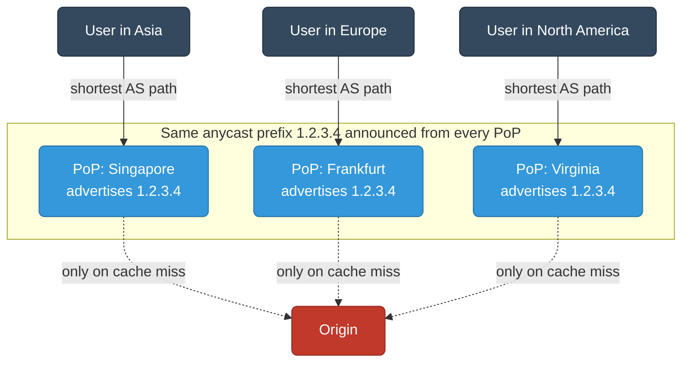
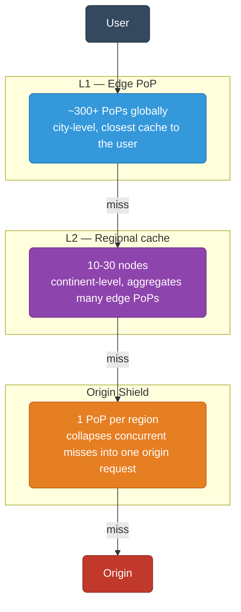
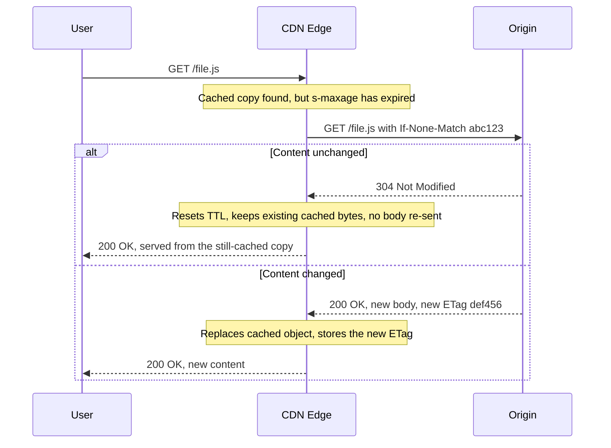
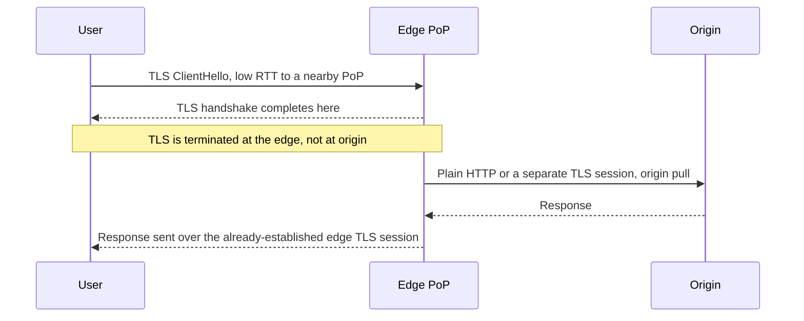
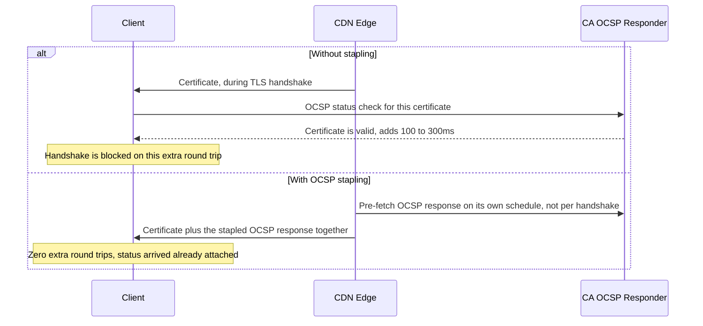
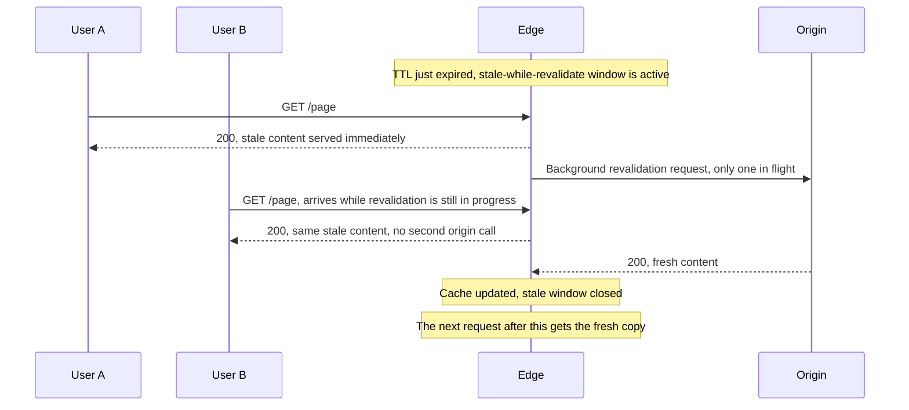
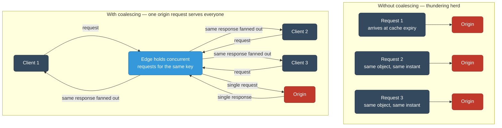

# CDN — Content Delivery Network

Edge caching, routing, security, and deep dives into CloudFront, Cloudflare, and GCP CDN.

<div class="quiz-progress" data-quiz-progress>
  <span class="quiz-progress-label">0/0 checks</span>
  <span class="quiz-progress-bar"><span class="quiz-progress-fill"></span></span>
</div>

---

## 1. What is a CDN

A CDN is a geographically distributed network of **Points of Presence (PoPs)** that cache content close to users, reducing latency and origin load.

| Component | Role |
|---|---|
| **Edge PoP** | First cache layer, closest to the user (city-level) |
| **Regional / Shield cache** | L2 cache aggregating traffic from multiple edge PoPs |
| **Origin shield** | Optional single PoP as a gate in front of origin |
| **Origin** | Your actual server / S3 / load balancer |

Cache hit rate directly determines how much traffic the origin absorbs. A 95% hit rate means origin sees only 5% of requests.

<div class="quiz-card">
  <p class="quiz-q">A CDN reports a 98% cache hit rate. Roughly what percentage of total requests does the origin actually have to handle?</p>
  <button class="quiz-reveal">Reveal answer</button>
  <div class="quiz-a" hidden>About 2%. Hit rate and origin load are complements — whatever fraction of requests is <em>not</em> satisfied from a cache tier is exactly the fraction that reaches the origin. A 98% hit rate means only ~2% of requests ever hit the origin server directly, which is why raising hit rate even a little has an outsized effect on origin capacity planning.</div>
</div>

---

## 2. Request Flow Diagram

```mermaid
flowchart LR
    classDef user fill:#34495e,stroke:#212f3c,color:#fff,rx:6
    classDef edge fill:#3498db,stroke:#2471a3,color:#fff,rx:6
    classDef regional fill:#8e44ad,stroke:#6c3483,color:#fff,rx:6
    classDef shield fill:#e67e22,stroke:#ba6018,color:#fff,rx:6
    classDef origin fill:#c0392b,stroke:#922b21,color:#fff,rx:6

    U["User<br/>browser / mobile client"]:::user

    subgraph TIER1["L1 — Edge PoP (city-level, 100s of locations)"]
        E["Edge cache<br/>key = scheme + host + path (+ query)"]:::edge
    end
    subgraph TIER2["L2 — Regional cache (continent-level, 10-30 nodes)"]
        R["Regional cache<br/>aggregates many edge PoPs"]:::regional
    end
    subgraph TIER3["Origin Shield (single PoP per region)"]
        OS["Origin shield<br/>coalesces concurrent misses into one request"]:::shield
    end
    subgraph TIER4["Origin"]
        O["Origin server<br/>S3 / ALB / custom HTTP"]:::origin
    end

    U -->|"GET request"| E
    E -->|"HIT, served in sub-ms"| U
    E -.->|"MISS"| R
    R -->|"HIT, populate edge then serve"| E
    R -.->|"MISS"| OS
    OS -->|"HIT, populate regional then serve"| R
    OS -.->|"MISS, first request for object"| O
    O -->|"200 OK plus Cache-Control"| OS
    OS -->|"populate shield, regional, and edge caches"| R
    R --> E --> U
```



**HIT path:** User → Edge PoP → response (sub-ms from nearby PoP)
**MISS path:** User → Edge → Regional → Origin Shield → Origin → full round trip

The walkthrough below breaks the miss path into discrete steps — useful for seeing exactly where population happens on the way back down, versus where the lookup happens on the way up.

<div class="stepper">
  <div class="stepper-panels">
    <div class="stepper-panel active">
      <strong>1. Request hits the edge.</strong> The user's request lands at the nearest edge PoP via GeoDNS or anycast routing. The edge computes the cache key (scheme + host + path, plus any headers named in <code>Vary</code>) and checks its local store.
    </div>
    <div class="stepper-panel">
      <strong>2. Cache miss, walk up the hierarchy.</strong> The key isn't in the edge PoP. Instead of the edge PoP hitting the origin directly, the request climbs one tier at a time: edge → regional cache → origin shield, each tier checking its own copy before going further.
    </div>
    <div class="stepper-panel">
      <strong>3. Origin fetch, coalesced.</strong> Only the origin shield actually talks to the origin — and only once per object, even if hundreds of edge PoPs missed on it at the same instant. Concurrent identical requests queue behind the first; nobody duplicates the origin call.
    </div>
    <div class="stepper-panel">
      <strong>4. Origin responds with cache directives.</strong> The origin returns the object plus <code>Cache-Control</code> (or equivalent) headers that tell every tier how long it's allowed to keep this object before checking again.
    </div>
    <div class="stepper-panel">
      <strong>5. Populate on the way back down.</strong> The response is stored at the origin shield, then the regional cache, then the edge PoP — each tier keeping its own copy so the next request for the same object is satisfied without climbing all the way back up.
    </div>
    <div class="stepper-panel">
      <strong>6. Serve, then go quiet.</strong> The edge returns the response to the original user. Every subsequent request for that object from that PoP is now a cache hit — until the TTL expires or someone purges it.
    </div>
  </div>
  <div class="stepper-controls">
    <button class="stepper-prev">← Prev</button>
    <span class="stepper-dots"></span>
    <span class="stepper-label"></span>
    <button class="stepper-next">Next →</button>
  </div>
</div>

<div class="quiz-card">
  <p class="quiz-q">On a cache HIT at the edge PoP, does the request ever reach the regional cache or the origin?</p>
  <button class="quiz-reveal">Reveal answer</button>
  <div class="quiz-a" hidden>No. A HIT at any tier stops right there and returns to the user immediately — the request only continues upward (edge → regional → origin shield → origin) when each tier in turn reports a MISS. The higher tiers exist purely to absorb the misses that lower tiers can't satisfy on their own.</div>
</div>

---

## 3. How CDN Routing Works

### DNS-based (GeoDNS)
The CDN's authoritative DNS returns the IP of the **nearest PoP** based on the resolver's IP.

```
dig example.com @8.8.8.8
; Resolver in Mumbai → CDN returns Mumbai PoP IP
; Resolver in Frankfurt → CDN returns Frankfurt PoP IP
```

### BGP Anycast
Multiple PoPs advertise the **same IP prefix** into BGP. The internet routes packets to the topologically nearest PoP automatically. Used by Cloudflare, Fastly, and for UDP-based services (DNS, QUIC).



Same IP `1.2.3.4` announced from all PoPs — BGP picks the shortest AS path.

<div class="quiz-card">
  <p class="quiz-q">GeoDNS and BGP Anycast both route users to the nearest PoP — what's the actual mechanism difference between them?</p>
  <button class="quiz-reveal">Reveal answer</button>
  <div class="quiz-a" hidden>GeoDNS decides at the DNS resolution step: the authoritative DNS server looks at the resolver's IP and hands back a <em>different</em> PoP IP address depending on location, so the routing decision happens once, before any packet is even sent to the CDN. BGP Anycast instead gives every PoP the <em>same</em> IP address — each one advertises the identical prefix into BGP, and ordinary internet routing (shortest AS path) delivers the packet to whichever PoP is topologically closest, with no DNS-level decision involved at all.</div>
</div>

---

## 4. Cache Hierarchy



**Origin shield** is critical for reducing origin load. Without it, a cache miss at 100 edge PoPs = 100 origin requests for the same object. With shield: 100 edge misses → 1 regional miss → 1 origin request (request coalescing).

<div class="quiz-card">
  <p class="quiz-q">Is there one single origin shield PoP for the entire CDN, or one per region?</p>
  <button class="quiz-reveal">Reveal answer</button>
  <div class="quiz-a" hidden>One per region. "A single PoP as a gate in front of origin" means each region's traffic funnels through that region's own shield PoP, not that the whole global CDN shares one shield. That's still enough to collapse, say, 100 edge misses in a region down to a single origin request for that region — it just isn't a single global chokepoint.</div>
</div>

---

## 5. Cache Key

The cache key determines what constitutes a "unique" cached object.

### Default key components
- Scheme (`https`)
- Host (`example.com`)
- Path (`/api/data`)
- Query string (optional, can be stripped/normalized)

### Query string normalization
```
/image.jpg?size=large&format=webp&v=1
/image.jpg?format=webp&size=large&v=1
```
Without normalization these are two cache entries. Sort/strip query params to maximize hit rate.

### Vary header
Tells the CDN to include a request header in the cache key:
```
Vary: Accept-Encoding        # separate cache for gzip vs br
Vary: Accept-Language        # separate cache per language — dangerous, fragments cache
Vary: Cookie                 # almost always defeats caching — avoid
```

### Cookie stripping
Strip cookies from cache key (and ideally from upstream request) for public content:
```nginx
# Nginx proxy_cache_bypass / cache key ignoring cookies
proxy_cache_key "$scheme$host$request_uri";
proxy_ignore_headers Set-Cookie;
proxy_hide_header Set-Cookie;
```

<div class="quiz-card">
  <p class="quiz-q">Why does adding <code>Vary: Cookie</code> to a public, cacheable response usually kill your hit rate instead of improving anything?</p>
  <button class="quiz-reveal">Reveal answer</button>
  <div class="quiz-a" hidden><code>Vary: Cookie</code> tells the CDN to treat every distinct Cookie header value as a separate cache key. Since almost every visitor carries a different session or tracking cookie, each one effectively gets its own private cache entry instead of sharing one — the object is stored once per user rather than once for everyone, so the hit rate collapses toward zero.</div>
</div>

---

## 6. Cache-Control Headers

| Directive | Scope | Meaning |
|---|---|---|
| `max-age=N` | Browser + CDN | Cache for N seconds |
| `s-maxage=N` | CDN only | Overrides `max-age` for shared caches |
| `no-cache` | Both | Must revalidate with origin before serving (ETag/If-None-Match) |
| `no-store` | Both | Do not cache at all |
| `private` | CDN skip | Only browser may cache |
| `public` | CDN cache | Explicitly cacheable by shared caches |
| `stale-while-revalidate=N` | CDN | Serve stale for N seconds while fetching fresh in background |
| `stale-if-error=N` | CDN | Serve stale for N seconds if origin errors (5xx) |
| `must-revalidate` | Both | Do not serve stale, even if origin is down |

### Example response headers
```http
Cache-Control: public, s-maxage=86400, stale-while-revalidate=3600, stale-if-error=86400
```
- CDN caches for 24h
- After expiry, serve stale for up to 1h while fetching fresh
- If origin errors, serve stale for up to 24h

### Revalidation flow


<div class="quiz-card">
  <p class="quiz-q"><code>stale-while-revalidate</code> and <code>stale-if-error</code> both let the CDN serve a stale copy — what's the difference in when each one kicks in?</p>
  <button class="quiz-reveal">Reveal answer</button>
  <div class="quiz-a" hidden><code>stale-while-revalidate</code> fires on an ordinary TTL expiry: the CDN serves the stale copy immediately while it fetches a fresh one in the background, purely to hide revalidation latency from the user. <code>stale-if-error</code> only fires when the origin actually errors (5xx) during that revalidation attempt — it's a resilience fallback for origin failure, not a way to make routine revalidation feel instant.</div>
</div>

---

## 7. TLS at the Edge

### TLS termination
TLS is terminated at the edge PoP, not at origin. This means:
- Handshake happens close to the user (low RTT)
- Origin connection can be HTTP or TLS (origin pull)



### Certificate management
- CDN manages edge certificates (auto-renewed via ACME/Let's Encrypt or DigiCert)
- **Multi-SAN certs** or **wildcard certs** shared across customers on the same PoP IP
- Custom certificates uploadable for compliance requirements

### OCSP Stapling
Instead of the browser querying the CA's OCSP responder (extra RTT), the CDN periodically fetches the OCSP response and **staples** it to the TLS handshake.



### TLS 1.3 advantages
- **1-RTT** handshake (vs 2-RTT for TLS 1.2)
- **0-RTT resumption** for returning connections (replay attack risk — avoid for non-idempotent requests)
- Forward secrecy by default (ephemeral key exchange only)

<div class="quiz-card">
  <p class="quiz-q">TLS 1.3's 0-RTT resumption is risky for a non-idempotent request like a POST that transfers money. Why?</p>
  <button class="quiz-reveal">Reveal answer</button>
  <div class="quiz-a" hidden>0-RTT data is sent before the handshake actually completes, and can be captured and replayed by an attacker — the server has no cryptographic proof yet that this particular copy is a fresh request from the real client. Replaying a GET just re-fetches the same page, which is harmless. Replaying a non-idempotent request like a money transfer could mean the action happens twice, which is why 0-RTT should be avoided for anything that isn't safely repeatable.</div>
</div>

---

## 8. Cache Invalidation

### TTL expiry
Simplest: set `s-maxage` and wait. No active purge needed.

### Purge by URL
```bash
# CloudFront
aws cloudfront create-invalidation \
  --distribution-id E1234 \
  --paths "/api/users" "/images/*"

# Cloudflare (API)
curl -X DELETE "https://api.cloudflare.com/client/v4/zones/{zone_id}/purge_cache" \
  -H "Authorization: Bearer $CF_TOKEN" \
  -d '{"files":["https://example.com/file.js"]}'
```

### Surrogate keys / Cache tags
Tag objects at origin, purge entire groups atomically:
```http
# Origin response header
Surrogate-Key: product-123 category-shoes homepage
Cache-Tag: product-123 category-shoes  # Cloudflare syntax
```
```bash
# Purge all objects tagged product-123
curl -X POST ".../purge_cache" -d '{"tags":["product-123"]}'
```

### Soft purge (stale-while-revalidate)
Mark as stale but keep serving while revalidating in the background. Zero-downtime invalidation. Requires `stale-while-revalidate` in Cache-Control or CDN config.



<div class="quiz-card">
  <p class="quiz-q">A product appears on 40 different pages (its own page, category pages, the homepage). What's wrong with purging it by URL, and what's the fix?</p>
  <button class="quiz-reveal">Reveal answer</button>
  <div class="quiz-a" hidden>Purging by URL means enumerating and purging all 40 individual URLs — brittle, and easy to miss one on the next update. The fix is to tag the object with a surrogate key / cache tag (e.g. <code>product-123</code>) whenever it's cached, then purge by that single tag: every cached object anywhere that carries the tag is invalidated in one call, regardless of how many URLs it happens to be embedded in.</div>
</div>

---

## 9. CDN Providers: CloudFront vs Cloudflare vs GCP Cloud CDN

The three biggest managed CDNs solve the same problem — cache close to the user, protect the origin — with noticeably different integration models. Before the per-provider deep dives, here's how each one actually attaches to your infrastructure.

<div class="tab-group">
  <div class="tab-buttons">
    <button data-tab="model-cf" class="active">CloudFront</button>
    <button data-tab="model-cloudflare">Cloudflare</button>
    <button data-tab="model-gcp">GCP Cloud CDN</button>
  </div>
  <div class="tab-panels">
    <div class="tab-panel active" data-tab-panel="model-cf">
      <strong>Distribution + Behaviors.</strong> A CloudFront <em>distribution</em> is an explicit object you create, mapping path patterns (<code>/api/*</code>, <code>/static/*</code>) to origins via <em>behaviors</em>, each carrying its own cache policy. Nothing is proxied implicitly — every route is configured up front.
    </div>
    <div class="tab-panel" data-tab-panel="model-cloudflare">
      <strong>Zone + orange-cloud proxying.</strong> A <em>zone</em> is just your domain, with DNS managed by Cloudflare. Flip any A/CNAME record to <em>Proxied</em> (orange cloud) and that record's traffic transparently routes through Cloudflare's network — there's no separate distribution object to create at all.
    </div>
    <div class="tab-panel" data-tab-panel="model-gcp">
      <strong>Bolt-on to Cloud Load Balancing.</strong> Cloud CDN isn't a standalone product — it's a flag (<code>--enable-cdn</code>) on a Cloud Load Balancing backend service that's already pointed at your origin. There's no CDN-specific object; the cache lives inside the load balancer's config.
    </div>
  </div>
</div>

### CloudFront Deep Dive

#### Core concepts

| Concept | Description |
|---|---|
| **Distribution** | A CloudFront endpoint (`*.cloudfront.net` or custom domain) |
| **Origin** | S3, ALB, API Gateway, custom HTTP server |
| **Behavior** | Path-pattern → origin mapping with cache policy |
| **Cache Policy** | What to include in cache key (headers, cookies, query strings) |
| **Origin Request Policy** | What to forward to origin (can differ from cache key) |

#### Behaviors (path-based routing)
```
/api/*      → ALB origin, TTL=0, forward all headers
/static/*   → S3 origin, TTL=86400, strip cookies
/*          → ALB origin, default TTL
```

#### Signed URLs vs Signed Cookies

| | Signed URL | Signed Cookie |
|---|---|---|
| Use case | Single object access | Multiple objects / streaming |
| Mechanism | Query params: `X-Amz-Signature`, `X-Amz-Expires` | `CloudFront-Key-Pair-Id`, `CloudFront-Signature` |
| Revocation | Rotate key pair | Expire cookie |

```bash
# Generate signed URL (CLI)
aws cloudfront sign \
  --url "https://d1234.cloudfront.net/video.mp4" \
  --key-pair-id KEYPAIRID \
  --private-key file://private_key.pem \
  --date-less-than 2026-07-01
```

#### Lambda@Edge vs CloudFront Functions

| | CloudFront Functions | Lambda@Edge |
|---|---|---|
| Runtime | JS (ES5) | Node.js, Python |
| Max exec time | 1ms | 5s (viewer), 30s (origin) |
| Triggers | Viewer req/res only | All 4 triggers |
| Memory | 2MB | 128MB–10GB |
| Cost | ~1/6th of Lambda@Edge | Per GB-sec |
| Use cases | Header manipulation, redirects, A/B | Auth, body rewrite, dynamic routing |

#### Origin Access Control (OAC) for S3
Replaces legacy OAI. Allows CloudFront to sign requests to S3 with SigV4.

```json
// S3 bucket policy — allow only CloudFront OAC
{
  "Effect": "Allow",
  "Principal": {"Service": "cloudfront.amazonaws.com"},
  "Action": "s3:GetObject",
  "Resource": "arn:aws:s3:::my-bucket/*",
  "Condition": {
    "StringEquals": {
      "AWS:SourceArn": "arn:aws:cloudfront::123:distribution/E1234"
    }
  }
}
```

#### Price classes
| Class | PoPs included | Cost |
|---|---|---|
| All | All global PoPs | Highest |
| 200 | All except South America, Australia | Medium |
| 100 | US, Canada, Europe only | Lowest |

### Cloudflare Deep Dive

#### Zones
A zone = a domain. DNS is managed by Cloudflare. Traffic proxied through Cloudflare when DNS record is **orange-clouded** (proxied).

```
example.com    A    1.2.3.4    [Proxied ✓]  → traffic goes through CF
api.example    A    1.2.3.4    [DNS only]   → traffic goes direct
```

#### Cache Rules (new) vs Page Rules (legacy)
```
# Cache Rule example — cache all static assets for 30 days
Match: hostname eq "example.com" AND extension in {jpg png css js}
Then:  Edge TTL: 2592000, Browser TTL: 86400

# Bypass cache for authenticated paths
Match: http.request.uri.path starts_with "/dashboard"
Then:  Cache Level: Bypass
```

#### Cloudflare Workers
JavaScript/WASM running at every PoP (~300 locations). Handles request before it reaches origin.

```javascript
// Worker: add cache headers, route based on geo
export default {
  async fetch(request, env) {
    const country = request.cf.country;
    if (country === 'CN') {
      return Response.redirect('https://cn.example.com' + new URL(request.url).pathname);
    }
    const response = await fetch(request);
    const headers = new Headers(response.headers);
    headers.set('Cache-Control', 'public, max-age=3600');
    return new Response(response.body, { headers });
  }
}
```

#### Argo Smart Routing
Cloudflare's private backbone routes requests through optimized paths, bypassing congested public internet segments. Typically 30% latency improvement for cache misses (origin fetches).

#### R2 (Object Storage)
S3-compatible storage with **zero egress fees**. Use as CDN origin instead of S3 to eliminate egress costs.

```bash
# R2 bucket as CloudFlare CDN origin
wrangler r2 bucket create my-assets
# Bind to Worker or use as custom origin in Cache Rules
```

### GCP Cloud CDN

#### Integration model
Cloud CDN sits in front of **Cloud Load Balancing backend services** — not a standalone product.

```
User → Cloud Load Balancer (anycast IP) → [Cloud CDN cache] → Backend Service → NEGs / Instance Groups
```

#### Cache modes

| Mode | Behavior |
|---|---|
| `USE_ORIGIN_HEADERS` | Respects `Cache-Control` from origin. Default. |
| `CACHE_ALL_STATIC` | Caches static content types even without `Cache-Control` |
| `FORCE_CACHE_ALL` | Caches everything, ignores `no-store`/`private` — use carefully |

```bash
# Set cache mode via gcloud
gcloud compute backend-services update my-backend \
  --enable-cdn \
  --cache-mode=CACHE_ALL_STATIC \
  --default-ttl=3600 \
  --global
```

#### Cache invalidation
```bash
gcloud compute url-maps invalidate-cdn-cache my-url-map \
  --path "/images/*" \
  --global
```

#### Signed URLs
```python
import datetime, hashlib, hmac, base64
from urllib.parse import urlencode

def sign_url(url, key_name, key, expiration_seconds=3600):
    expiration = int((datetime.datetime.utcnow() +
                      datetime.timedelta(seconds=expiration_seconds)).timestamp())
    params = urlencode({'Expires': expiration, 'KeyName': key_name})
    to_sign = f"{url}?{params}".encode('utf-8')
    sig = base64.urlsafe_b64encode(hmac.new(key, to_sign, hashlib.sha1).digest())
    return f"{url}?{params}&Signature={sig.decode()}"
```

#### CDN Interconnect
Partner CDNs (Akamai, Fastly, CloudFlare) can peer directly with Google's network for reduced egress pricing. Used when you run a third-party CDN in front of GCP origins.

<div class="quiz-card">
  <p class="quiz-q">You need to rewrite a request body before it reaches the origin on CloudFront. Can a CloudFront Function do this, or do you need Lambda@Edge?</p>
  <button class="quiz-reveal">Reveal answer</button>
  <div class="quiz-a" hidden>Lambda@Edge. CloudFront Functions only run on the viewer request/response path, have no body access, and are budgeted for 1ms of execution — built for lightweight jobs like header manipulation, redirects, and A/B routing. Rewriting a body needs an origin-facing trigger with real compute time, and only Lambda@Edge's origin request/response triggers provide that (up to 30 seconds, full Node.js/Python runtime).</div>
</div>

---

## 10. Comparison Table

| Feature | CloudFront | Cloudflare | GCP Cloud CDN |
|---|---|---|---|
| **PoPs** | 600+ | 300+ | 100+ (via GFE) |
| **Pricing model** | Per GB + per request | Flat rate (Pro/Biz) or usage | Per GB egress |
| **Free tier** | 1TB/month (12 months) | Generous free plan | No |
| **WAF** | AWS WAF (extra cost) | Built-in (free basic, paid advanced) | Cloud Armor (extra cost) |
| **Edge compute** | Lambda@Edge + CF Functions | Workers (free 100k req/day) | Cloud Run functions |
| **DDoS** | Shield Standard free, Advanced paid | Unmetered DDoS mitigation free | Cloud Armor (paid) |
| **Cache invalidation** | 1–5 min, paths/wildcards | Near-instant, tags/URLs | Minutes, paths |
| **Cache rules** | Behaviors + Cache Policies | Cache Rules / Page Rules | Backend service config |
| **Origin types** | S3, ALB, custom | Any HTTP, R2, Workers | GCP backends only |
| **Analytics** | CloudWatch + CF logs | Built-in dashboard | Cloud Monitoring |
| **mTLS / client certs** | Yes (via Lambda@Edge) | Yes (native) | Yes (via LB) |

---

## 11. CDN for APIs (Dynamic Caching)

APIs are trickier — responses are personalized or change frequently.

### Short TTL caching
```http
Cache-Control: public, s-maxage=5, stale-while-revalidate=10
```
Even a 5-second TTL absorbs traffic spikes (e.g., product page hit by 1000 req/s = 1 origin req per 5s).

### Cache warming
Pre-populate edge caches after a deployment before traffic hits:
```bash
# Warm critical paths across all PoPs
for path in /api/products /api/categories /api/homepage; do
  curl -s -o /dev/null "https://example.com$path"
done
```

### Request coalescing (thundering herd protection)
When a cached object expires, multiple simultaneous requests hit origin at the same time — the "thundering herd" or "cache stampede".



CloudFront, Cloudflare, and GCP CDN all coalesce concurrent misses for the same object into a single origin request by default.

### Edge-side includes (ESI)
Assemble page fragments at the edge — cache static header/footer separately from dynamic content section.

<div class="quiz-card">
  <p class="quiz-q">A product page gets 1000 req/s and has <code>Cache-Control: s-maxage=5</code>. When that 5-second TTL expires, do all 1000 req/s in that instant each trigger a separate origin request?</p>
  <button class="quiz-reveal">Reveal answer</button>
  <div class="quiz-a" hidden>No. Request coalescing means the CDN holds the concurrent requests that arrive right after expiry, makes exactly one origin request, and fans that single response back out to every queued request. Without coalescing you'd get a thundering herd of up to 1000 simultaneous origin hits; with it, a 5-second TTL under 1000 req/s still means roughly one origin request every 5 seconds, not 5000.</div>
</div>

---

## 12. Security at the Edge

### WAF (Web Application Firewall)
Runs at edge PoP — blocks OWASP Top 10, custom rules, before traffic reaches origin.

```
# CloudFront + AWS WAF — block SQL injection
aws wafv2 create-web-acl --rules '[{
  "Name": "SQLi", "Priority": 1,
  "Statement": {"ManagedRuleGroupStatement": {
    "VendorName": "AWS", "Name": "AWSManagedRulesSQLiRuleSet"
  }},
  "Action": {"Block": {}}
}]'
```

### DDoS mitigation layers

| Layer | Attack type | CDN response |
|---|---|---|
| L3/L4 | SYN flood, UDP amplification, volumetric | Anycast absorbs traffic across PoPs; rate limiting per IP |
| L7 | HTTP flood, slowloris, credential stuffing | WAF rules, challenge pages (CAPTCHA/JS challenge), rate limiting per path |

Cloudflare's anycast network absorbs **multi-Tbps** attacks by spreading across 300+ PoPs rather than concentrating at one data center.

### Bot management
```
# Cloudflare Bot Fight Mode / Super Bot Fight Mode
- JS fingerprinting challenge for suspected bots
- Browser integrity check
- Managed challenge for unverified bots
```

### IP reputation
CDN vendors maintain threat intelligence feeds — known Tor exit nodes, abusive ASNs, scanner IPs blocked by default or challenged.

<div class="quiz-card">
  <p class="quiz-q">A SYN flood and an HTTP flood are both DDoS attacks — why does the CDN defend against them with completely different tools (anycast + rate limiting vs WAF + challenge pages)?</p>
  <button class="quiz-reveal">Reveal answer</button>
  <div class="quiz-a" hidden>A SYN flood is L3/L4 and volumetric — garbage packets aimed at exhausting connection state or bandwidth, and it doesn't need to look like a real HTTP request, so anycast simply spreads the raw volume across hundreds of PoPs and rate-limits by IP. An HTTP flood is L7 — well-formed requests that consume application resources one legitimate-looking request at a time, so spreading volume doesn't help. You have to inspect the request itself (WAF rules) or make the client prove it's a real browser (CAPTCHA/JS challenge).</div>
</div>

---

## 13. Debugging Cache Behavior

### Key response headers

| Header | Provider | Values |
|---|---|---|
| `CF-Cache-Status` | Cloudflare | `HIT`, `MISS`, `EXPIRED`, `BYPASS`, `REVALIDATED`, `DYNAMIC` |
| `X-Cache` | CloudFront | `Hit from cloudfront`, `Miss from cloudfront` |
| `Age` | All | Seconds since object was cached at edge |
| `X-Cache-Status` | Nginx/Varnish | `HIT`, `MISS`, `BYPASS` |
| `Cache-Control` | All | What origin sent |
| `CDN-Cache-Control` | Cloudflare | Overrides `Cache-Control` for CDN only |

### curl debugging commands
```bash
# Check cache status and age
curl -sI https://example.com/image.jpg | grep -i "cache\|age\|cf-\|x-cache"

# Force cache miss (bypass with Pragma)
curl -sI -H "Pragma: no-cache" -H "Cache-Control: no-cache" https://example.com/image.jpg

# Check which PoP served the request (CloudFront)
curl -sI https://d1234.cloudfront.net/file.js | grep -i "x-amz-cf-pop\|x-cache"

# Check Cloudflare PoP
curl -sI https://example.com/ | grep -i "cf-ray\|cf-cache"
# CF-Ray: 8abc123-BOM  → BOM = Mumbai PoP

# Verify TTL countdown
curl -sI https://example.com/api/data | grep -i "age\|cache-control"
# Age: 143       → cached 143s ago
# Cache-Control: public, s-maxage=300  → will expire in 157s

# Test from specific location (use a proxy or --resolve)
curl -sI --resolve example.com:443:203.0.113.10 https://example.com/
```

### Reading CF-Cache-Status
```
HIT         → served from cache ✓
MISS        → not in cache, fetched from origin
EXPIRED     → was cached, TTL expired, fetched fresh
REVALIDATED → was stale, revalidated with 304
BYPASS      → cache bypassed (Cache-Control: no-cache, or bypass rule)
DYNAMIC     → not eligible for caching (POST, or Cache-Control: private)
```

---

## 14. Common Issues

### Cache poisoning
Attacker causes a malicious response to be cached and served to other users.

**Causes:**
- Unkeyed headers reflected in response (e.g., `X-Forwarded-Host` used in redirect)
- Query parameter normalization inconsistencies

**Prevention:**
```
1. Audit which request headers influence the response
2. Add those headers to the cache key or strip them
3. Use Cloudflare/CloudFront cache key controls to explicitly define the key
4. Validate Host header at origin
```

### Stale content after deployment
Users see old JS/CSS after a deploy.

**Solutions:**
- Content-hash filenames: `/app.a1b2c3.js` — new deploy = new URL = always fresh
- Purge by surrogate key on deploy:
```bash
# In deploy pipeline
curl -X POST ".../purge_cache" -d '{"tags":["deploy-v1.2.3"]}'
```
- Use `no-cache` for HTML (always revalidate), long TTL for hashed assets

### Origin overload on cache miss storm
Happens when a large object expires simultaneously across all edge PoPs, or a new deployment cold-starts the cache.

**Prevention:**
```
1. Origin shield — funnels all edge misses to a single shield PoP → 1 origin request
2. Request coalescing — CDN holds concurrent misses, makes 1 origin request
3. Stagger TTLs — add jitter: s-maxage = base_ttl + rand(0, 300)
4. Cache warming script post-deploy (see section 11)
```

### Geo-restriction debugging
```bash
# Simulate request from a different country (Cloudflare)
curl -sI -H "CF-IPCountry: DE" https://example.com/restricted

# Check if geo-block is active
curl -sI https://example.com/content
# HTTP/1.1 403 Forbidden
# CF-Cache-Status: BYPASS  → geo rule hit before cache

# CloudFront geo-restriction check
aws cloudfront get-distribution-config --id E1234 \
  | jq '.DistributionConfig.Restrictions.GeoRestriction'
```

### Cache-Control conflicts
`Vary: Cookie` + public content = near-zero cache hit rate. Every unique cookie combination = separate cache entry.

```bash
# Diagnose low hit rate
curl -sI https://example.com/ | grep -i "vary\|set-cookie"
# Vary: Cookie  ← kills caching

# Fix: strip session cookies for public content at edge
# CloudFront: create Cache Policy, set Cookies = None
# Cloudflare: Cache Rule → Ignore Query String / Cookie
```

<div class="quiz-card">
  <p class="quiz-q">After deploying new JS/CSS, some users still get the old file even though you purged the cache by URL. What's the more robust fix used above, and why does it work even if you forget to purge?</p>
  <button class="quiz-reveal">Reveal answer</button>
  <div class="quiz-a" hidden>Content-hash filenames — e.g. <code>/app.a1b2c3.js</code>. Because the filename itself changes with every deploy, the new deploy is a brand-new URL that was never cached anywhere, so there's nothing stale to purge in the first place; the old cached file just becomes an unreferenced dead entry that eventually expires. Purging by surrogate key still works, but it depends on remembering to run it — hashed filenames remove that dependency on remembering entirely.</div>
</div>
