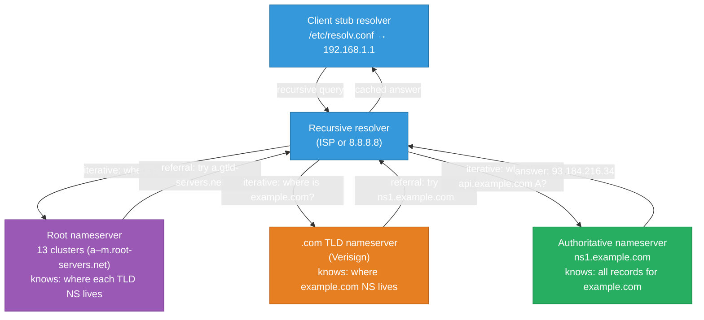
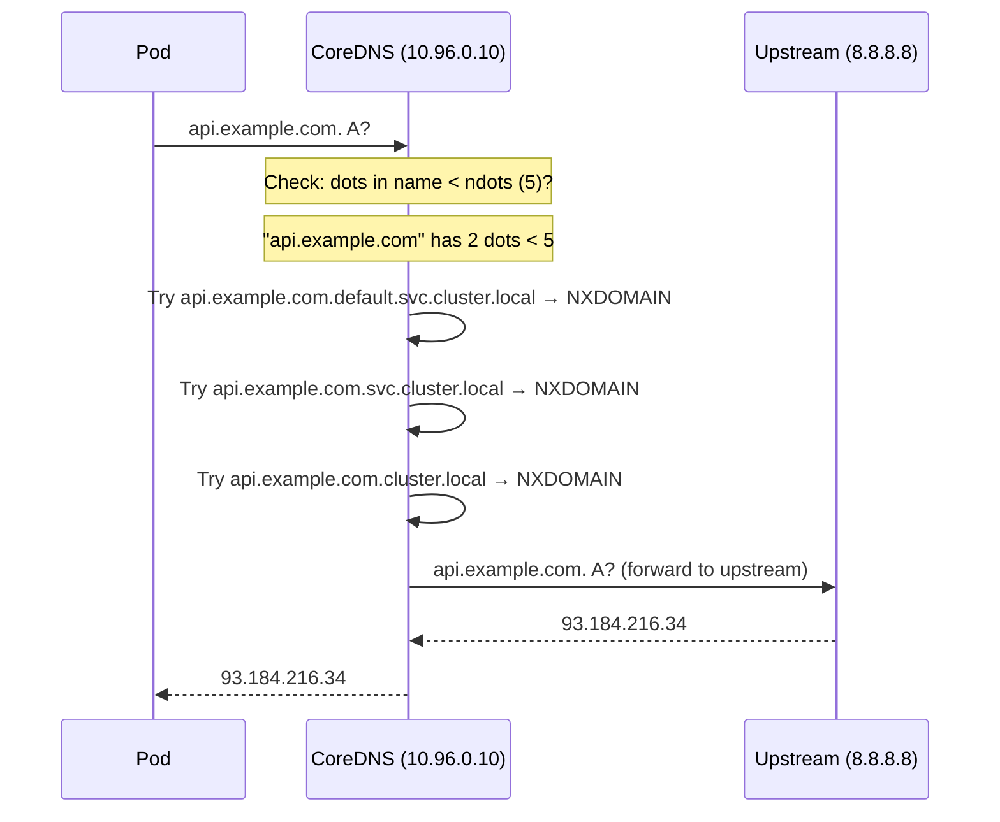

# DNS Internals — Resolution Chain, DNSSEC, and Kubernetes DNS

What actually happens between typing `curl https://api.example.com` and the first TCP packet
leaving your machine: the full recursive resolution chain, every record type and when it's
used, DNSSEC's chain of trust, and the specific ways DNS breaks inside Kubernetes pods. The
operational layer — `dig +trace`, split-horizon, CoreDNS — sits on top of these mechanics.
For the resolver-vs-stub distinction and how `nslookup` and `curl` disagree inside pods, also
see [nslookup-vs-curl.md](./nslookup-vs-curl.md).

<div class="quiz-progress" data-quiz-progress>
  <span class="quiz-progress-label">0/0 checks</span>
  <span class="quiz-progress-bar"><span class="quiz-progress-fill"></span></span>
</div>

---

## 1. DNS Hierarchy — Who Knows What

DNS is a distributed, hierarchical, delegated database. No single server knows all records;
each level knows only its own zone and where to find delegated sub-zones.



**Key distinction — recursive vs iterative queries:**
- **Stub resolver** (on your machine, `libc` or `systemd-resolved`): sends a *recursive* query to the configured resolver and waits for a final answer
- **Recursive resolver** (your ISP, `8.8.8.8`, CoreDNS): does the iterative work — queries root, then TLD, then authoritative, assembles the answer, caches it, returns it to the stub

**Root servers** are 13 *logical* servers (a–m.root-servers.net), each operated by a different
organization, served from hundreds of physical machines worldwide via anycast. The stub
resolver never contacts root servers directly; the recursive resolver does.

---

## 2. Full Recursive Resolution Walk

`dig google.com` with `+trace` shows every hop a recursive resolver takes from scratch
(bypassing the cache):

```bash
dig +trace google.com

# ; <<>> DiG 9.18 <<>> +trace google.com
# ;; global options: +cmd
# .               518400  IN  NS  a.root-servers.net.   ← root servers
# .               518400  IN  NS  b.root-servers.net.
# ...
# ;; Received 811 bytes from 192.168.1.1#53 (local resolver) in 3 ms

# com.            172800  IN  NS  a.gtld-servers.net.   ← .com TLD servers
# com.            172800  IN  NS  b.gtld-servers.net.
# ...
# ;; Received 1171 bytes from 198.41.0.4#53 (a.root-servers.net) in 18 ms

# google.com.     172800  IN  NS  ns1.google.com.       ← Google's auth servers
# google.com.     172800  IN  NS  ns2.google.com.
# ...
# ;; Received 292 bytes from 192.5.6.30#53 (a.gtld-servers.net) in 17 ms

# google.com.     300     IN  A   142.250.80.46         ← final answer
# ...
# ;; Received 55 bytes from 216.239.32.10#53 (ns1.google.com) in 20 ms
```

**What the resolver caches:** The TTL on each record tells the resolver how long to cache it.
`google.com. 300 IN NS ns1.google.com.` caches for 300s — within that window, the resolver
skips the TLD step entirely. `google.com. 300 IN A 142.250.80.46` caches for 300s — within
that window, no DNS query is made at all.

---

## 3. Record Types — When Each Is Used

| Type | Value | When used |
|---|---|---|
| **A** | IPv4 address (32-bit) | Most hostnames |
| **AAAA** | IPv6 address (128-bit) | IPv6 endpoints |
| **CNAME** | Canonical name (alias) | `www → example.com`, CDN aliases |
| **NS** | Nameserver for a zone | Delegation — TLD → authoritative |
| **MX** | Mail exchanger + priority | Email routing (SMTP) |
| **TXT** | Arbitrary text | SPF, DKIM, DMARC, site verification, ACME challenges |
| **SRV** | Host, port, priority, weight | Service discovery (Kubernetes, etcd, SIP, XMPP) |
| **PTR** | Reverse lookup (IP → hostname) | `ip6.arpa.`/`in-addr.arpa.` zones, email spam checks |
| **SOA** | Start of Authority | Zone metadata: primary NS, admin email, serial, TTL defaults |
| **CAA** | Certification Authority Authorization | Which CAs may issue certs for a domain |
| **DS** | Delegation Signer | DNSSEC: links parent zone to child zone's key |
| **DNSKEY** | Zone signing key | DNSSEC: the public key that signs records in this zone |
| **RRSIG** | Record Set Signature | DNSSEC: cryptographic signature over a record set |

**CNAME gotchas:**
- A CNAME cannot coexist with any other record at the same name (including NS and SOA at the zone apex). So you cannot have `CNAME example.com → ...` — use an A record or an ALIAS/ANAME record (vendor-specific extension).
- A CNAME chain (`www → cdn → actual-host`) is resolved by the recursive resolver, not the client. But multiple hops add latency and TTL complexity.

**SRV in Kubernetes:** Service discovery via SRV for pods with named ports:

```bash
# SRV record format: _service._proto.name TTL IN SRV priority weight port target
dig SRV _http._tcp.my-svc.default.svc.cluster.local
# _http._tcp.my-svc.default.svc.cluster.local. 5 IN SRV 0 50 80 my-svc.default.svc.cluster.local.
```

<div class="quiz-card">
  <p class="quiz-q">Why can't you put a CNAME record at `example.com` (the zone apex)?</p>
  <button class="quiz-reveal">Reveal answer</button>
  <div class="quiz-a" hidden>Because RFC 1034 prohibits a CNAME from coexisting with any other record type at the same name, and the zone apex must have NS and SOA records. A CNAME at example.com would conflict with those mandatory records. The workaround is a vendor-specific ALIAS or ANAME record type (Route53's ALIAS, Cloudflare's CNAME flattening), which behaves like a CNAME for resolution but is stored and returned as an A/AAAA record — satisfying the no-CNAME-at-apex constraint.</div>
</div>

---

## 4. TTL, Negative Caching, and Cache Poisoning

**TTL (Time To Live):** The number of seconds a resolver may cache a record. Low TTL (60s)
allows rapid DNS failover at the cost of higher query load on authoritative servers. High TTL
(3600s) reduces load but means a DNS change takes up to an hour to propagate.

**Negative caching (RFC 2308):** When a name doesn't exist (`NXDOMAIN`) or exists but has no
records of the requested type (`NOERROR` with empty answer), the resolver caches that negative
response for the TTL specified in the SOA's `minimum` field. This prevents repeated queries
for non-existent names.

```bash
# What TTL will a negative response be cached for?
dig SOA example.com | grep "SOA"
# example.com. 3600 IN SOA ns1.example.com. admin.example.com. 2024010101 3600 900 604800 300
#                                                                                              ^^^
#                                                              minimum TTL (for negative caching)
```

**Cache poisoning (Kaminsky attack):** An attacker floods a recursive resolver with forged
responses before the real authoritative server replies, poisoning the cache with a malicious
IP. Defenses: source port randomization (RFC 5452), 0x20 case randomization of query names,
and DNSSEC (which makes forged responses invalid because they lack a valid signature).

---

## 5. DNSSEC — Chain of Trust

DNSSEC adds cryptographic signatures to DNS records. A validating resolver can verify that
the answer came from the legitimate zone owner and hasn't been tampered with.

<div class="stepper">
  <div class="stepper-panels">
    <div class="stepper-panel active">
      <strong>Zone signing.</strong> The zone owner generates two key pairs: a Zone Signing Key (ZSK) and a Key Signing Key (KSK). The ZSK signs each record set (creating RRSIG records). The KSK signs the DNSKEY record set. Both public keys are published as DNSKEY records in the zone.
    </div>
    <div class="stepper-panel">
      <strong>Delegation Signer (DS) record.</strong> The zone owner submits a hash of the zone's KSK (the DS record) to the parent zone. The parent (e.g., `.com` TLD) adds this DS record to its own zone and signs it with the TLD's ZSK. This creates the link between parent and child.
    </div>
    <div class="stepper-panel">
      <strong>Chain of trust from root.</strong> The root zone's DNSKEY is hardcoded in validators as a trust anchor. Root signs the `.com` DS → `.com` signs `example.com` DS → `example.com` signs its own records. Each link is verifiable by the public key published one level up.
    </div>
    <div class="stepper-panel">
      <strong>Resolver validation.</strong> A DNSSEC-validating resolver fetches the RRSIG alongside the answer, fetches the DNSKEY for the zone, verifies the signature, walks the DS records up to a trusted anchor. If any signature is missing or invalid, the resolver returns SERVFAIL — not the (possibly forged) answer.
    </div>
  </div>
  <div class="stepper-controls">
    <button class="stepper-prev">← Prev</button>
    <span class="stepper-dots"></span>
    <span class="stepper-label"></span>
    <button class="stepper-next">Next →</button>
  </div>
</div>

```bash
# Query with DNSSEC validation
dig +dnssec google.com A
# google.com.     300  IN  A     142.250.80.46
# google.com.     300  IN  RRSIG A 8 2 300 20240201... (signature)
# ;; flags: qr rd ra ad    ← "ad" (Authenticated Data) means DNSSEC validated

# Validate a specific zone's DNSSEC chain
delv @8.8.8.8 google.com A
# ; fully validated
# google.com. 300 IN A 142.250.80.46

# Check if a domain is DNSSEC-signed
dig DS example.com @a.gtld-servers.net
# Empty answer = not signed; DS records = signed
```

**DNSSEC doesn't encrypt** — it only authenticates. The query and response are still
plaintext. For confidentiality, use DoH or DoT (Section 8).

<div class="quiz-card">
  <p class="quiz-q">A DNSSEC-validating resolver returns SERVFAIL for `api.example.com`. The authoritative server is up and returning the correct IP. What are the most likely causes?</p>
  <button class="quiz-reveal">Reveal answer</button>
  <div class="quiz-a" hidden>DNSSEC signature expiry is the most common cause — RRSIG records have a validity window (typically weeks), and if the zone owner forgot to re-sign before expiry, the signature is invalid and the resolver returns SERVFAIL. Other causes: the DS record in the parent zone doesn't match the current KSK (key rollover gone wrong), or the zone was re-signed with a different algorithm than what the DS record advertises. Debug with `delv @8.8.8.8 api.example.com` — it explains exactly which step in the chain failed.</div>
</div>

---

## 6. Split-Horizon DNS

Split-horizon (or split-brain) DNS returns different answers to the same query depending on
where the query comes from — internal clients get private IPs; external clients get public IPs.

```
api.example.com   →   internal resolver: 10.0.1.50  (private IP, no NAT)
api.example.com   →   external resolver: 93.184.216.34  (public IP)
```

**Implementation approaches:**

| Approach | How | Pitfall |
|---|---|---|
| Two zones on the same server | `view` blocks in BIND/Unbound keyed on source IP | ACL misconfiguration leaks internal records externally |
| Two separate DNS servers | Internal servers for internal clients; public authoritative for external | Internal servers must not be reachable from outside |
| RPZ (Response Policy Zone) | Override specific records for matched clients | Complex to maintain, easy to break |

```bash
# BIND named.conf with views
view "internal" {
    match-clients { 10.0.0.0/8; };
    zone "example.com" { type master; file "example-internal.zone"; };
};
view "external" {
    match-clients { any; };
    zone "example.com" { type master; file "example-external.zone"; };
};
```

**Common production failure:** Developers on VPN query internal DNS and get the private IP
`10.0.1.50`. CI/CD runs outside the VPN, hits external DNS, and gets `93.184.216.34`. A
health check that works locally fails in CI — or vice versa. Fix: ensure CI runs in the same
network context as production, or use a single authoritative answer with proper routing.

---

## 7. DNS in Kubernetes — CoreDNS, ndots, and Pod Failures

Every Kubernetes cluster runs CoreDNS (replacing kube-dns since 1.11) as the in-cluster DNS
resolver. Every pod's `/etc/resolv.conf` points to CoreDNS.

```bash
# Inside any pod
cat /etc/resolv.conf
# nameserver 10.96.0.10        ← CoreDNS ClusterIP
# search default.svc.cluster.local svc.cluster.local cluster.local
# options ndots:5
```

**CoreDNS architecture:**



**`ndots:5`** causes pods to try appending each search domain suffix before attempting the
bare name as an absolute FQDN. A name with fewer than 5 dots generates up to 3 extra queries
before the real query goes out. This is why external DNS lookups from inside pods are slow
and `nslookup google.com` inside a pod takes 3–4 queries.

**Fix for external hostnames:** Use a trailing dot to force absolute resolution:

```bash
# Inside pod — these are equivalent:
curl https://api.example.com/         # tries 3 search domain appends first
curl https://api.example.com./        # trailing dot = FQDN, no search domain appends
```

Or lower `ndots` in the pod spec:

```yaml
spec:
  dnsConfig:
    options:
      - name: ndots
        value: "2"
```

**CoreDNS Corefile** (the configuration):

```
.:53 {
    errors
    health {
        lameduck 5s
    }
    ready
    kubernetes cluster.local in-addr.arpa ip6.arpa {  # serves cluster DNS
        pods insecure
        fallthrough in-addr.arpa ip6.arpa
        ttl 30
    }
    prometheus :9153
    forward . /etc/resolv.conf {                       # forwards non-cluster to upstream
        max_concurrent 1000
    }
    cache 30
    loop
    reload
    loadbalance
}
```

**`dnsPolicy` options in pod specs:**

| Policy | Behavior |
|---|---|
| `ClusterFirst` (default) | CoreDNS for cluster names; forward to upstream for external |
| `ClusterFirstWithHostNet` | Like ClusterFirst but for pods using host network |
| `Default` | Inherit node's `/etc/resolv.conf` — no CoreDNS |
| `None` | Pod defines its own DNS entirely via `dnsConfig` |

<div class="quiz-card">
  <p class="quiz-q">A pod resolves `redis.default.svc.cluster.local` in 1ms but takes 80ms to resolve `api.stripe.com`. Pods on adjacent nodes resolve it in 15ms. What's the most likely cause?</p>
  <button class="quiz-reveal">Reveal answer</button>
  <div class="quiz-a" hidden>The pod is doing 3 failed search-domain lookups before the real query, each taking ~25ms due to ndots:5 — api.stripe.com has 2 dots, so CoreDNS tries api.stripe.com.default.svc.cluster.local, api.stripe.com.svc.cluster.local, and api.stripe.com.cluster.local (all NXDOMAIN), then finally queries api.stripe.com. externally. Each failed lookup adds a round trip. The 15ms on adjacent nodes likely reflects a warm CoreDNS cache (the external lookup already resolved). Fix: add a trailing dot, lower ndots to 2, or pre-cache external names in CoreDNS's forward cache.</div>
</div>

---

## 8. DNS over HTTPS and DNS over TLS

Standard DNS is plaintext UDP/TCP on port 53 — any network path observer can see what names
you resolve. DoH and DoT encrypt the query.

| Protocol | Transport | Port | Notes |
|---|---|---|---|
| DNS-over-TLS (DoT) | TLS-wrapped DNS | 853 | Easy to block by port; separate from HTTPS traffic |
| DNS-over-HTTPS (DoH) | DNS query in HTTP/2 or HTTP/3 body | 443 | Indistinguishable from HTTPS; harder to block or intercept |
| Oblivious DoH (ODoH) | DoH via relay — hides client IP from resolver | 443 | Client sends to relay; relay forwards to resolver |

```bash
# DoT query with kdig (from knot-dnsutils)
kdig -d @1.1.1.1 +tls-ca example.com A

# DoH query with curl
curl -s -H "accept: application/dns-json" \
  "https://cloudflare-dns.com/dns-query?name=example.com&type=A" | jq .

# DoH query using DNS wire format (RFC 8484)
curl -s -H "content-type: application/dns-message" \
  --data-binary @<(echo -n $'\x00\x01\x01\x00\x00\x01\x00\x00...') \
  https://cloudflare-dns.com/dns-query
```

**systemd-resolved DoT** (works on most modern distros):

```ini
# /etc/systemd/resolved.conf
[Resolve]
DNS=1.1.1.1#cloudflare-dns.com 8.8.8.8#dns.google
DNSOverTLS=yes
DNSSEC=yes
```

---

## 9. Debugging Toolkit

```bash
# Trace full resolution from scratch (bypasses local cache)
dig +trace example.com

# Validate DNSSEC chain
delv @8.8.8.8 example.com A

# Query specific record types
dig MX example.com
dig TXT example.com            # SPF, DKIM selectors
dig _dmarc.example.com TXT     # DMARC policy
dig SRV _https._tcp.example.com

# Check NS delegation
dig NS example.com @a.gtld-servers.net   # from the TLD, not your resolver

# Reverse lookup
dig -x 93.184.216.34

# Diagnose SERVFAIL
dig example.com A +all         # shows rcode, flags, full answer

# Check resolver cache on systemd-resolved hosts
resolvectl statistics
resolvectl flush-caches

# Pod DNS debugging
kubectl run dnsutils --image=gcr.io/kubernetes-e2e-test-images/dnsutils:1.3 \
  -it --rm -- nslookup kubernetes.default
kubectl exec -it <pod> -- cat /etc/resolv.conf
kubectl exec -it <pod> -- dig kubernetes.default.svc.cluster.local
```

**Common failure patterns:**

| Symptom | Likely cause | Check |
|---|---|---|
| `SERVFAIL` | DNSSEC validation failure, broken delegation | `delv`, check RRSIG expiry |
| `REFUSED` | Query to wrong server (e.g., authoritative asked to recurse) | Check server role; use correct resolver |
| `NXDOMAIN` when record exists | Cache poisoning, split-horizon misconfiguration | `dig @8.8.8.8` vs `dig @internal-resolver` |
| Truncated response | Response > 512B and TCP fallback blocked | Allow TCP on port 53; upgrade EDNS buffer size |
| Slow external resolution in K8s | ndots + search domain exhaustion | Lower ndots, use FQDN with trailing dot |
| Intermittent failures in K8s | CoreDNS pod overload | `kubectl top pod -n kube-system`; increase CoreDNS replicas |
