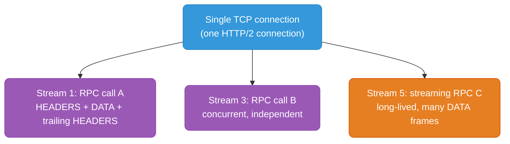
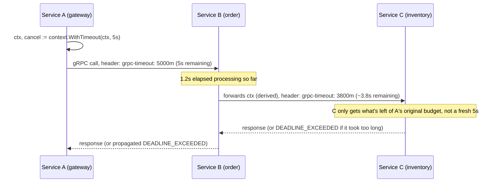
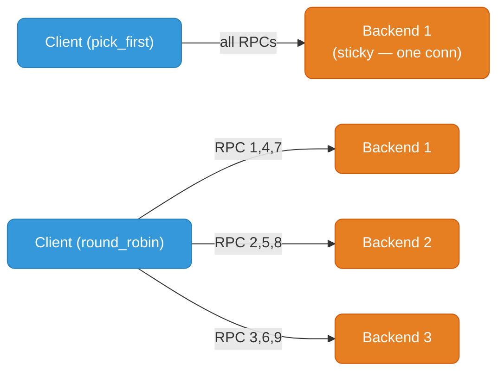

# gRPC Deep Dive

Implementation-level gRPC: wire format, streaming modes with full code, HTTP/2 mechanics, interceptors, deadlines, health checking, load balancing, gRPC-Web, and error handling. Conceptual overview lives in [grpc-graphql.md](./grpc-graphql.md) — this file goes underneath it.

---

## 1. Protobuf Wire Format Internals

Every field on the wire is a **tag-value pair**. The tag encodes both the field number and the wire type in a single varint.

```
tag = (field_number << 3) | wire_type
```

| Wire type | ID | Used for |
|-----------|-----|----------|
| Varint | 0 | int32, int64, uint32, uint64, sint32/64, bool, enum |
| 64-bit | 1 | fixed64, sfixed64, double |
| Length-delimited | 2 | string, bytes, embedded messages, packed repeated fields |
| Start group / End group | 3 / 4 | deprecated, unused in proto3 |
| 32-bit | 5 | fixed32, sfixed32, float |

### Varint encoding

Each byte uses 7 bits for data + 1 continuation bit (MSB). Small numbers cost 1 byte; large numbers cost more.

```
Encoding 300 as a varint:
300 = 0b100101100

Split into 7-bit groups (LSB first): 0101100  0000010
Set continuation bit on all but the last byte:
  byte 0: 1_0101100  -> 0xAC   (continuation bit set, more bytes follow)
  byte 1: 0_0000010  -> 0x02   (final byte)

Wire bytes: AC 02
```

```protobuf
message Order {
  string id = 1;        // tag = (1 << 3) | 2 = 0x0A (length-delimited)
  double amount = 3;     // tag = (3 << 3) | 1 = 0x19 (64-bit)
  int32 quantity = 4;    // tag = (4 << 3) | 0 = 0x20 (varint)
}
```

Encoding `Order{id: "A1", amount: 9.5, quantity: 300}`:

```
0A 02 41 31          # tag=0x0A (field 1, len-delim), length=2, bytes "A1"
19 00 00 00 00 00 00 23 40   # tag=0x19 (field 3, 64-bit), IEEE754 double 9.5
20 AC 02             # tag=0x20 (field 4, varint), varint(300) = AC 02
```

**Why this is smaller than JSON:** no field names on the wire (just numeric tags), no delimiters/whitespace, numbers use variable-length encoding instead of ASCII digits.

### Message size prefixing over HTTP/2

gRPC frames each message with a 5-byte prefix before handing it to HTTP/2 DATA frames — this is the **Length-Prefixed Message** format defined by the gRPC wire protocol, independent of protobuf itself:

```
┌─────────────┬───────────────────────┬─────────────────────┐
│ Compressed  │ Message Length        │ Message (protobuf   │
│ Flag (1B)   │ (4B, big-endian uint) │ bytes, N bytes)      │
└─────────────┴───────────────────────┴─────────────────────┘
```

This lets a receiver read exactly N bytes for one message even when several messages arrive back-to-back inside a single HTTP/2 DATA frame (frames don't align 1:1 with RPC messages — a large message can span multiple DATA frames, or several small messages can pack into one).

```
HTTP/2 DATA frame payload for a streamed response:
[00][00 00 00 0C][... 12 bytes of Order protobuf ...][00][00 00 00 08][... 8 bytes ...]
 ^compressed=no  ^length=12                            ^flag        ^length=8
```

---

## 2. The 4 Streaming Modes — Full Proto + Go Code

```protobuf
syntax = "proto3";
package order.v1;
option go_package = "example.com/order/v1;orderv1";

service OrderService {
  rpc GetOrder(GetOrderRequest) returns (Order);                         // unary
  rpc ListOrders(ListOrdersRequest) returns (stream Order);              // server streaming
  rpc BulkCreate(stream CreateOrderRequest) returns (BulkCreateResponse); // client streaming
  rpc Chat(stream ChatMessage) returns (stream ChatMessage);             // bidi streaming
}

message GetOrderRequest { string order_id = 1; }
message ListOrdersRequest { string customer_id = 1; }
message CreateOrderRequest { string customer_id = 1; double amount = 2; }
message BulkCreateResponse { int32 created_count = 1; repeated string order_ids = 2; }
message ChatMessage { string from = 1; string text = 2; }

message Order {
  string id = 1;
  string customer_id = 2;
  double amount = 3;
}
```

### 2.1 Unary — one request, one response

```go
// Server
func (s *server) GetOrder(ctx context.Context, req *orderv1.GetOrderRequest) (*orderv1.Order, error) {
    order, ok := s.db[req.OrderId]
    if !ok {
        return nil, status.Errorf(codes.NotFound, "order %s not found", req.OrderId)
    }
    return order, nil
}

// Client
resp, err := client.GetOrder(ctx, &orderv1.GetOrderRequest{OrderId: "abc123"})
if err != nil {
    st, _ := status.FromError(err)
    log.Printf("code=%s msg=%s", st.Code(), st.Message())
    return
}
fmt.Println(resp)
```

### 2.2 Server streaming — one request, stream of responses

```go
// Server
func (s *server) ListOrders(req *orderv1.ListOrdersRequest, stream orderv1.OrderService_ListOrdersServer) error {
    for _, order := range s.ordersFor(req.CustomerId) {
        if err := stream.Send(order); err != nil {
            return err // client disconnected or context cancelled
        }
    }
    return nil // returning nil closes the stream with status OK
}

// Client
stream, err := client.ListOrders(ctx, &orderv1.ListOrdersRequest{CustomerId: "cust-1"})
if err != nil {
    log.Fatal(err)
}
for {
    order, err := stream.Recv()
    if err == io.EOF {
        break // server closed the stream normally
    }
    if err != nil {
        log.Fatal(err)
    }
    fmt.Println(order)
}
```

### 2.3 Client streaming — stream of requests, one response

```go
// Server
func (s *server) BulkCreate(stream orderv1.OrderService_BulkCreateServer) error {
    var ids []string
    for {
        req, err := stream.Recv()
        if err == io.EOF {
            // client finished sending; send the single aggregate response
            return stream.SendAndClose(&orderv1.BulkCreateResponse{
                CreatedCount: int32(len(ids)),
                OrderIds:     ids,
            })
        }
        if err != nil {
            return err
        }
        id := s.create(req)
        ids = append(ids, id)
    }
}

// Client
stream, err := client.BulkCreate(ctx)
if err != nil {
    log.Fatal(err)
}
for _, order := range pendingOrders {
    if err := stream.Send(order); err != nil {
        log.Fatal(err)
    }
}
resp, err := stream.CloseAndRecv() // signals EOF to server, waits for the aggregate response
if err != nil {
    log.Fatal(err)
}
fmt.Println("created:", resp.CreatedCount)
```

### 2.4 Bidirectional streaming — full runnable example with context cancellation

```go
// server.go
package main

import (
    "context"
    "io"
    "log"
    "net"

    "google.golang.org/grpc"
    "google.golang.org/grpc/codes"
    "google.golang.org/grpc/status"

    orderv1 "example.com/order/v1"
)

type chatServer struct {
    orderv1.UnimplementedOrderServiceServer
}

func (s *chatServer) Chat(stream orderv1.OrderService_ChatServer) error {
    ctx := stream.Context()

    // Independent goroutine reads incoming messages, feeds a channel
    incoming := make(chan *orderv1.ChatMessage)
    errCh := make(chan error, 1)

    go func() {
        for {
            msg, err := stream.Recv()
            if err == io.EOF {
                close(incoming)
                return
            }
            if err != nil {
                errCh <- err
                return
            }
            incoming <- msg
        }
    }()

    for {
        select {
        case <-ctx.Done():
            // Client disconnected, deadline exceeded, or server shutting down
            log.Printf("chat stream ended: %v", ctx.Err())
            return status.Error(codes.Canceled, "stream cancelled")

        case err := <-errCh:
            return err

        case msg, ok := <-incoming:
            if !ok {
                return nil // client closed send side cleanly, end the RPC
            }
            reply := &orderv1.ChatMessage{From: "server", Text: "echo: " + msg.Text}
            if err := stream.Send(reply); err != nil {
                return err
            }
        }
    }
}

func main() {
    lis, err := net.Listen("tcp", ":50051")
    if err != nil {
        log.Fatal(err)
    }
    srv := grpc.NewServer()
    orderv1.RegisterOrderServiceServer(srv, &chatServer{})
    log.Println("listening on :50051")
    log.Fatal(srv.Serve(lis))
}
```

```go
// client.go
package main

import (
    "context"
    "io"
    "log"
    "time"

    "google.golang.org/grpc"
    "google.golang.org/grpc/credentials/insecure"

    orderv1 "example.com/order/v1"
)

func main() {
    conn, err := grpc.NewClient("localhost:50051", grpc.WithTransportCredentials(insecure.NewCredentials()))
    if err != nil {
        log.Fatal(err)
    }
    defer conn.Close()

    client := orderv1.NewOrderServiceClient(conn)

    // Deadline propagates as the grpc-timeout header, cancels the whole call chain
    ctx, cancel := context.WithTimeout(context.Background(), 10*time.Second)
    defer cancel()

    stream, err := client.Chat(ctx)
    if err != nil {
        log.Fatal(err)
    }

    // Send goroutine
    go func() {
        messages := []string{"hello", "how are you", "goodbye"}
        for _, text := range messages {
            if err := stream.Send(&orderv1.ChatMessage{From: "client", Text: text}); err != nil {
                log.Printf("send error: %v", err)
                return
            }
            time.Sleep(time.Second)
        }
        stream.CloseSend() // half-close: no more sends, server can still reply
    }()

    // Receive loop on the main goroutine
    for {
        msg, err := stream.Recv()
        if err == io.EOF {
            log.Println("stream closed by server")
            return
        }
        if err != nil {
            log.Printf("recv error: %v (ctx err: %v)", err, ctx.Err())
            return
        }
        log.Printf("received: %s", msg.Text)
    }
}
```

**Cancellation propagation:** cancelling `ctx` (timeout, explicit `cancel()`, or client process exit) tears down the underlying HTTP/2 stream — the server's `stream.Context().Done()` fires, and any blocked `stream.Recv()`/`stream.Send()` on both sides unblocks with an error. There is no leaked goroutine as long as both sides `select` on `ctx.Done()` as shown above.

---

## 3. gRPC over HTTP/2 Mechanics



Each RPC call is **one HTTP/2 stream** (odd-numbered, client-initiated). Multiple RPCs multiplex over a single TCP connection with no head-of-line blocking between streams — this is the mechanism, not an add-on.

**Why gRPC requires HTTP/2, not HTTP/1.1:**

| Requirement | HTTP/1.1 | HTTP/2 |
|---|---|---|
| Full-duplex streaming on one connection | Not possible — one request/response per connection at a time (or pipelining, which is broken/unused) | Native — independent streams carry concurrent request/response bodies |
| Trailing metadata (`grpc-status`, `grpc-message` sent *after* the body) | No trailer support in practice | HEADERS frame can appear after DATA frames (trailers) |
| Multiplexing without head-of-line blocking | No — sequential or multiple TCP connections needed | Yes — frames from different streams interleave on one connection |
| Binary framing | Text-based, requires parsing line-by-line | Binary frames, structured length-prefixed |

gRPC's status is sent as **HTTP/2 trailers** — a second HEADERS frame after the DATA frames, containing `grpc-status` and `grpc-message`. This lets the server stream a full response body and only decide/report final status afterward — impossible in HTTP/1.1, which has no trailer mechanism outside of chunked encoding (which is barely supported and never used this way).

**Header compression (HPACK):** gRPC calls carry repetitive headers on every request (`content-type: application/grpc`, `grpc-timeout`, `grpc-encoding`, auth tokens). HTTP/2's HPACK maintains a per-connection dynamic table so repeated header values are sent as small index references after the first occurrence instead of full strings every time — meaningful savings at high RPC rates where header overhead would otherwise dominate small messages.

```
Stream lifecycle for one unary RPC:
HEADERS (:method POST, :path /order.v1.OrderService/GetOrder, grpc-timeout: 5S, ...)
DATA (length-prefixed protobuf request)
DATA END_STREAM=false  -- client's half of the stream ends implicitly after last DATA
  ... server processes ...
HEADERS (:status 200, content-type: application/grpc)
DATA (length-prefixed protobuf response)
HEADERS END_STREAM=true (trailers: grpc-status: 0, grpc-message: "")
```

---

## 4. gRPC Interceptors

Interceptors wrap RPC handling for cross-cutting concerns — the gRPC equivalent of HTTP middleware.

### 4.1 Unary auth interceptor

```go
package interceptors

import (
    "context"

    "google.golang.org/grpc"
    "google.golang.org/grpc/codes"
    "google.golang.org/grpc/metadata"
    "google.golang.org/grpc/status"
)

func AuthUnaryInterceptor(validTokens map[string]bool) grpc.UnaryServerInterceptor {
    return func(
        ctx context.Context,
        req interface{},
        info *grpc.UnaryServerInfo,
        handler grpc.UnaryHandler,
    ) (interface{}, error) {
        md, ok := metadata.FromIncomingContext(ctx)
        if !ok {
            return nil, status.Error(codes.Unauthenticated, "missing metadata")
        }

        tokens := md.Get("authorization")
        if len(tokens) == 0 {
            return nil, status.Error(codes.Unauthenticated, "missing authorization header")
        }

        if !validTokens[tokens[0]] {
            return nil, status.Error(codes.PermissionDenied, "invalid token")
        }

        // Attach validated identity into context for downstream handlers
        ctx = context.WithValue(ctx, "authenticated", true)
        return handler(ctx, req) // proceed to the actual RPC method
    }
}
```

### 4.2 Prometheus metrics interceptor (unary + stream)

```go
package interceptors

import (
    "context"
    "time"

    "github.com/prometheus/client_golang/prometheus"
    "google.golang.org/grpc"
    "google.golang.org/grpc/status"
)

var (
    rpcDuration = prometheus.NewHistogramVec(prometheus.HistogramOpts{
        Name:    "grpc_server_handling_seconds",
        Help:    "Response latency for gRPC calls",
        Buckets: prometheus.DefBuckets,
    }, []string{"grpc_method", "grpc_code"})

    rpcInFlight = prometheus.NewGaugeVec(prometheus.GaugeOpts{
        Name: "grpc_server_in_flight_requests",
        Help: "Number of in-flight gRPC requests",
    }, []string{"grpc_method"})
)

func init() {
    prometheus.MustRegister(rpcDuration, rpcInFlight)
}

func MetricsUnaryInterceptor() grpc.UnaryServerInterceptor {
    return func(
        ctx context.Context,
        req interface{},
        info *grpc.UnaryServerInfo,
        handler grpc.UnaryHandler,
    ) (interface{}, error) {
        rpcInFlight.WithLabelValues(info.FullMethod).Inc()
        defer rpcInFlight.WithLabelValues(info.FullMethod).Dec()

        start := time.Now()
        resp, err := handler(ctx, req)
        code := status.Code(err)

        rpcDuration.WithLabelValues(info.FullMethod, code.String()).Observe(time.Since(start).Seconds())
        return resp, err
    }
}

// Stream interceptor wraps the ServerStream to intercept per-message calls or just measure total call duration
func MetricsStreamInterceptor() grpc.StreamServerInterceptor {
    return func(
        srv interface{},
        ss grpc.ServerStream,
        info *grpc.StreamServerInfo,
        handler grpc.StreamHandler,
    ) error {
        rpcInFlight.WithLabelValues(info.FullMethod).Inc()
        defer rpcInFlight.WithLabelValues(info.FullMethod).Dec()

        start := time.Now()
        err := handler(srv, ss)
        code := status.Code(err)

        rpcDuration.WithLabelValues(info.FullMethod, code.String()).Observe(time.Since(start).Seconds())
        return err
    }
}
```

```go
// Wiring both into the server
srv := grpc.NewServer(
    grpc.ChainUnaryInterceptor(
        interceptors.AuthUnaryInterceptor(validTokens),
        interceptors.MetricsUnaryInterceptor(),
    ),
    grpc.ChainStreamInterceptor(
        interceptors.MetricsStreamInterceptor(),
    ),
)
```

Interceptor execution order with `ChainUnaryInterceptor` is left-to-right on the way in (auth runs before metrics, so unauthenticated calls don't pollute latency histograms) and right-to-left unwinding on the way out.

---

## 5. Deadline Propagation

A Go `context.Context` deadline serializes to the **`grpc-timeout` request header** on the wire. This is what makes deadlines cascade automatically across a call chain without manual bookkeeping.



```go
// Service A — sets the top-level budget
ctx, cancel := context.WithTimeout(context.Background(), 5*time.Second)
defer cancel()
resp, err := serviceBClient.PlaceOrder(ctx, req)

// Service B — MUST forward the same ctx (or a derived one), not create a fresh context
func (s *server) PlaceOrder(ctx context.Context, req *PlaceOrderRequest) (*PlaceOrderResponse, error) {
    // ctx here already carries A's remaining deadline, minus network + processing time so far
    invResp, err := s.inventoryClient.CheckStock(ctx, &CheckStockRequest{Sku: req.Sku})
    if err != nil {
        if status.Code(err) == codes.DeadlineExceeded {
            return nil, status.Error(codes.DeadlineExceeded, "upstream inventory check timed out")
        }
        return nil, err
    }
    // ...
}
```

**Cascading behavior:** if Service B creates a *new* independent `context.WithTimeout(context.Background(), 5*time.Second)` instead of deriving from the incoming `ctx`, it silently breaks the budget — C could get a fresh 5s even though A's original 5s is nearly exhausted, causing A to time out and abandon the call while B and C keep working. Always derive downstream contexts from the incoming one:

```go
// WRONG — resets the deadline, breaks cascading
ctx2, cancel := context.WithTimeout(context.Background(), 5*time.Second)

// CORRECT — inherits and can only shrink the remaining deadline, never extend it
ctx2, cancel := context.WithTimeout(ctx, 2*time.Second) // capped at min(2s, ctx's remaining time)
```

`grpc-timeout` header format is a number + unit suffix: `H` (hours), `M` (minutes), `S` (seconds), `m` (milliseconds), `u` (microseconds), `n` (nanoseconds) — e.g. `5000m` = 5000 milliseconds.

---

## 6. gRPC Health Checking Protocol

Standard proto (`grpc.health.v1.Health`) — not something you invent per-service:

```protobuf
// grpc/health/v1/health.proto (part of grpc-proto, well-known)
service Health {
  rpc Check(HealthCheckRequest) returns (HealthCheckResponse);
  rpc Watch(HealthCheckRequest) returns (stream HealthCheckResponse);
}

message HealthCheckRequest {
  string service = 1; // empty string = overall server health
}

message HealthCheckResponse {
  enum ServingStatus {
    UNKNOWN = 0;
    SERVING = 1;
    NOT_SERVING = 2;
    SERVICE_UNKNOWN = 3;
  }
  ServingStatus status = 1;
}
```

```go
import "google.golang.org/grpc/health"
import healthpb "google.golang.org/grpc/health/grpc_health_v1"

healthServer := health.NewServer()
healthpb.RegisterHealthServer(grpcServer, healthServer)

// Liveness: process is alive at all — set once at startup
healthServer.SetServingStatus("", healthpb.HealthCheckResponse_SERVING)

// Readiness: per-dependency granularity — flip when a specific downstream is unavailable
healthServer.SetServingStatus("order.v1.OrderService", healthpb.HealthCheckResponse_NOT_SERVING)
```

| Semantic | Maps to | Behavior |
|---|---|---|
| Liveness | `Check("")` — overall server status | K8s liveness probe uses this: if `NOT_SERVING`, container gets restarted |
| Readiness | `Check("<specific-service>")` | K8s readiness probe: if `NOT_SERVING`, pod removed from Service endpoints but not restarted |
| `Watch` | Streaming variant | Client-side load balancers subscribe instead of polling `Check` repeatedly |

```yaml
# Kubernetes probe using grpc_health_probe binary (or native grpc probe in K8s 1.24+)
livenessProbe:
  grpc:
    port: 50051
readinessProbe:
  grpc:
    port: 50051
    service: "order.v1.OrderService"
```

```bash
# Manual check with grpcurl
grpcurl -plaintext localhost:50051 grpc.health.v1.Health/Check
grpcurl -plaintext -d '{"service": "order.v1.OrderService"}' localhost:50051 grpc.health.v1.Health/Check
```

---

## 7. gRPC Load Balancing

### Client-side load balancing modes



| Policy | Behavior | Default? |
|---|---|---|
| `pick_first` | Connects to the first resolved address, sends everything there until it fails | Yes, gRPC's default |
| `round_robin` | Opens a connection to every resolved backend, distributes RPCs round-robin across all of them | Opt-in via service config |

```go
conn, err := grpc.NewClient(
    "dns:///order-service.internal:50051",
    grpc.WithDefaultServiceConfig(`{"loadBalancingConfig": [{"round_robin":{}}]}`),
    grpc.WithTransportCredentials(insecure.NewCredentials()),
)
```

### Why gRPC load balancing differs from HTTP/1.1 — and why L4 LBs fail here

An L4 (TCP-level) load balancer distributes **connections**, not requests. HTTP/1.1 typically opens many short-lived connections, so L4 balancing naturally spreads load. gRPC deliberately reuses a **single long-lived HTTP/2 connection** for many multiplexed RPCs — an L4 LB balances that one connection to one backend, and every RPC on it goes to the same backend for the connection's lifetime. Ten gRPC clients each holding one persistent connection to a 3-backend L4-balanced target commonly produces wildly uneven load (e.g., all 10 pinned to 1-2 backends) rather than an even 3-way split.

```
L4 LB (e.g. plain TCP NLB) + gRPC == load concentrates on whichever backend
each client's long-lived connection happened to land on. New backends added
to the pool get ~0 traffic until existing connections cycle.
```

**Solutions, in increasing sophistication:**

| Approach | Mechanism | Tradeoff |
|---|---|---|
| Client-side `round_robin` + DNS resolver | Client opens a connection per resolved backend IP, spreads RPCs itself | Requires client cooperation; DNS TTL/refresh lag on backend set changes |
| gRPC-aware L7 LB (e.g. Envoy, Linkerd) | Proxy terminates HTTP/2 from client, re-multiplexes RPCs across backend connections it manages | Proxy hop adds latency; needs sidecar or dedicated proxy tier |
| xDS (client-side, via Envoy's control plane API) | Client speaks xDS to a control plane, gets live backend endpoint updates, load balances itself without a proxy in the data path | No extra hop, but requires xDS-capable client stack (gRPC's built-in xDS resolver, or Istio/Envoy-integrated clients) |

xDS is the production answer at scale — it gives client-side load balancing (no extra proxy hop, no L4-connection-pinning problem) while still getting centrally-managed, dynamically-updated backend membership the way a proxy-based LB would.

---

## 8. gRPC-Web

Browsers cannot originate raw gRPC calls: no browser JS API can set HTTP/2 trailers, control frame-level flow control, or send arbitrary binary frames outside of `fetch`/`XHR`'s constraints — and browsers don't expose trailer read access at all, which gRPC's status reporting depends on.


The `grpc-web` wire format moves trailers (`grpc-status`, `grpc-message`) into the message body stream itself (as a special trailer frame appended after the last data frame) instead of relying on HTTP/2 trailers — something a browser fetch response body can actually deliver. A translating proxy (Envoy's `grpc_web` filter, or a dedicated `grpcwebproxy`) converts between this browser-safe framing and real gRPC on the backend side.

```yaml
# Envoy grpc-web filter snippet
http_filters:
  - name: envoy.filters.http.grpc_web
  - name: envoy.filters.http.cors
  - name: envoy.filters.http.router
```

```typescript
// Browser client using grpc-web generated stubs
import { OrderServiceClient } from "./order_v1_grpc_web_pb";
const client = new OrderServiceClient("https://api.example.com"); // hits the Envoy proxy, not the backend directly

client.getOrder(request, {}, (err, response) => {
  if (err) { console.error(err.code, err.message); return; }
  console.log(response.toObject());
});
```

Note: gRPC-Web does not support client-streaming or bidirectional streaming in browsers (no way to half-close a request stream over `fetch`) — only unary and server-streaming work end-to-end.

---

## 9. Error Handling

### Status code mapping vs HTTP

| gRPC code | Numeric | Closest HTTP equivalent | Meaning |
|---|---|---|---|
| OK | 0 | 200 | Success |
| CANCELLED | 1 | 499 (nginx convention) | Client cancelled the call |
| UNKNOWN | 2 | 500 | Unhandled server exception |
| INVALID_ARGUMENT | 3 | 400 | Malformed request |
| DEADLINE_EXCEEDED | 4 | 504 | Timed out |
| NOT_FOUND | 5 | 404 | Resource missing |
| ALREADY_EXISTS | 6 | 409 | Conflict |
| PERMISSION_DENIED | 7 | 403 | Authenticated, not authorized |
| RESOURCE_EXHAUSTED | 8 | 429 | Rate limited / quota exceeded |
| FAILED_PRECONDITION | 9 | 400/409 | System not in a state the request requires |
| ABORTED | 10 | 409 | Concurrency conflict (e.g. optimistic lock failure) |
| OUT_OF_RANGE | 11 | 400 | Value outside valid range |
| UNIMPLEMENTED | 12 | 501 | Method not implemented by server |
| INTERNAL | 13 | 500 | Server-side invariant violation |
| UNAVAILABLE | 14 | 503 | Server down — safe to retry |
| DATA_LOSS | 15 | 500 | Unrecoverable data loss/corruption |
| UNAUTHENTICATED | 16 | 401 | No/invalid credentials |

### Rich error details via `google.rpc.Status`

A bare gRPC status code + string message is often not enough — `google.rpc.Status` lets you attach structured, typed detail messages (field violations, retry hints, quota info) that clients can programmatically parse instead of string-matching error messages.

```protobuf
import "google/rpc/error_details.proto";

// Server constructs a status with typed details:
```

```go
import (
    "google.golang.org/genproto/googleapis/rpc/errdetails"
    "google.golang.org/grpc/status"
    "google.golang.org/grpc/codes"
)

func (s *server) CreateOrder(ctx context.Context, req *CreateOrderRequest) (*Order, error) {
    if req.Amount <= 0 {
        st := status.New(codes.InvalidArgument, "invalid order")
        detail := &errdetails.BadRequest{
            FieldViolations: []*errdetails.BadRequest_FieldViolation{
                {Field: "amount", Description: "must be greater than zero"},
            },
        }
        stWithDetails, err := st.WithDetails(detail)
        if err != nil {
            return nil, st.Err() // fall back to plain status if attaching details fails
        }
        return nil, stWithDetails.Err()
    }
    // ...
}
```

```go
// Client extracts structured details instead of parsing message strings
resp, err := client.CreateOrder(ctx, req)
if err != nil {
    st := status.Convert(err)
    for _, detail := range st.Details() {
        if br, ok := detail.(*errdetails.BadRequest); ok {
            for _, v := range br.FieldViolations {
                log.Printf("field=%s issue=%s", v.Field, v.Description)
            }
        }
    }
}
```

Other common `google.rpc` detail types: `RetryInfo` (how long to back off), `QuotaFailure` (which quota was exceeded), `DebugInfo` (stack trace, internal-only), `PreconditionFailure`, `ResourceInfo`. Prefer these over encoding structured data into the plain `message` string — they survive serialization across languages consistently since they're just protobuf messages.
