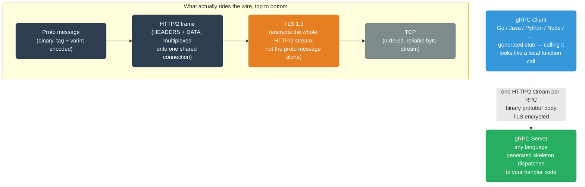
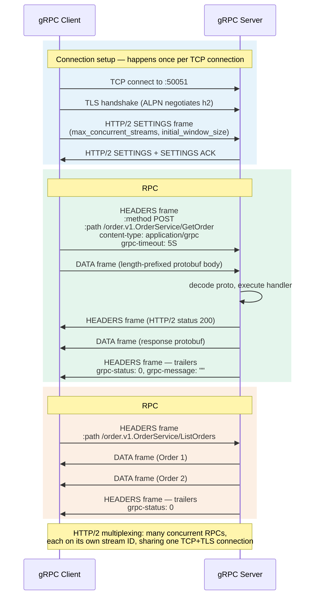
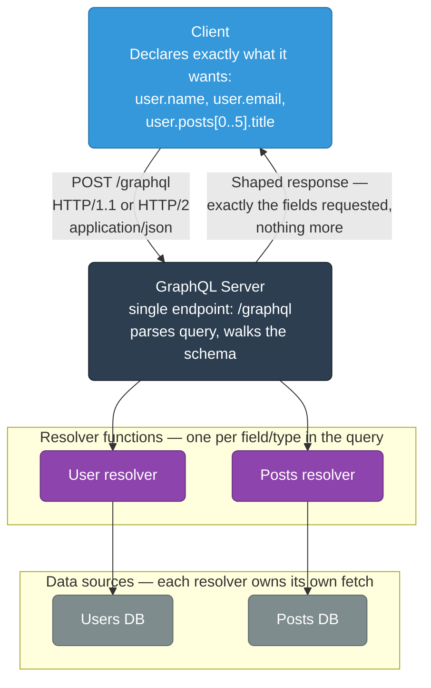
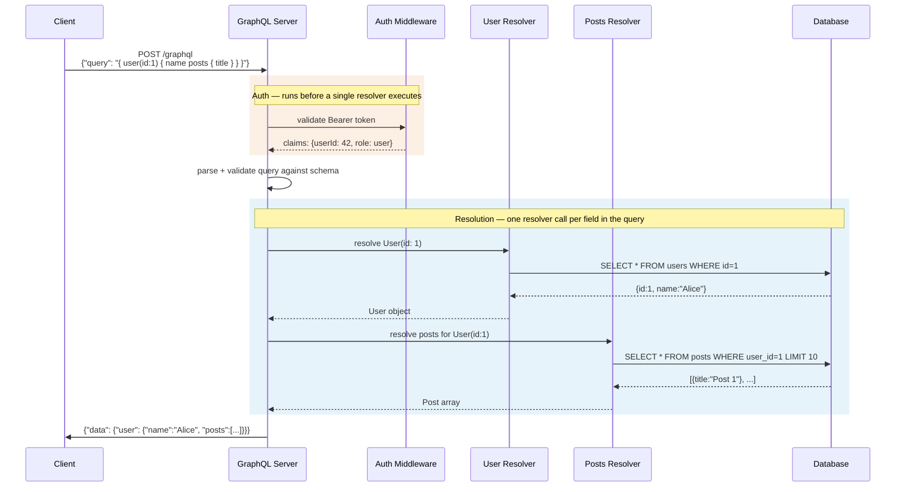
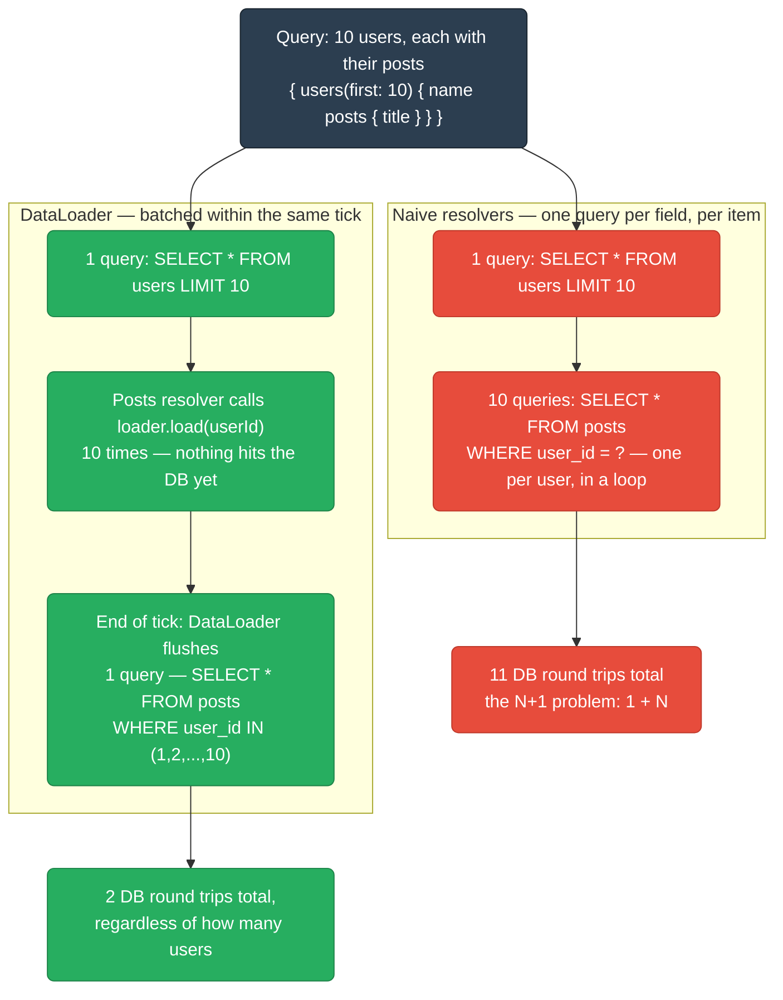

# gRPC and GraphQL

How two API styles beyond plain REST actually move bytes over the wire — gRPC's HTTP/2 + Protobuf transport and its four streaming modes, and GraphQL's single-endpoint query model, schema, and the N+1/DataLoader problem every resolver-based API eventually runs into.

<div class="quiz-progress" data-quiz-progress>
  <span class="quiz-progress-label">0/0 checks</span>
  <span class="quiz-progress-bar"><span class="quiz-progress-fill"></span></span>
</div>

---

## gRPC

gRPC is a high-performance, open-source RPC framework. Built on **HTTP/2 + Protocol Buffers**. Created by Google, used internally at almost every major tech company.

### Architecture



The key detail this diagram calls out: encryption happens at the TLS layer, wrapping the entire HTTP/2 stream — protobuf itself carries no encryption of its own. A packet sniffer that strips TLS sees raw HTTP/2 frames with a binary blob inside; it's TLS, not the message format, doing the encrypting.

<div class="quiz-card">
  <p class="quiz-q">In the transport stack above, is the protobuf message itself encrypted, or is it the surrounding HTTP/2 stream that TLS encrypts?</p>
  <button class="quiz-reveal">Reveal answer</button>
  <div class="quiz-a" hidden>It's the HTTP/2 stream that TLS wraps, not the protobuf message directly. The stack layers as proto message → HTTP/2 frame → TLS 1.3 → TCP, so TLS encrypts the whole HTTP/2 frame (headers and all) on its way over the TCP connection — protobuf has no encryption of its own.</div>
</div>

### Protocol Buffer Encoding

JSON vs Protobuf — same data:

```json
{"userId": "123", "name": "Alice", "age": 30}
JSON: 38 bytes (text)
```

```protobuf
message User {
  string user_id = 1;
  string name = 2;
  int32 age = 3;
}
Protobuf: ~12 bytes (binary, field tags + varints)
```

**Why protobuf is smaller:** Fields encoded as tag-value pairs (`field_number << 3 | wire_type`). No field names in the wire format. Varints use fewer bytes for small numbers.

<div class="quiz-card">
  <p class="quiz-q">The JSON payload is 38 bytes, the protobuf version is ~12 bytes, for the same three fields. Is protobuf smaller mainly because it compresses the data?</p>
  <button class="quiz-reveal">Reveal answer</button>
  <div class="quiz-a" hidden>No compression involved. Protobuf is smaller because the wire format never includes field names at all — just a tag number + wire type per field (<code>field_number &lt;&lt; 3 | wire_type</code>) — and small integers are encoded as varints, which take fewer bytes than a text representation. JSON's overhead is the repeated field-name strings and surrounding quotes/braces/colons.</div>
</div>

### Service Definition (.proto)

```protobuf
syntax = "proto3";
package order.v1;

// 4 RPC modes
service OrderService {
  // Unary: one request, one response
  rpc GetOrder(GetOrderRequest) returns (Order);

  // Server streaming: one request, stream of responses
  rpc ListOrders(ListOrdersRequest) returns (stream Order);

  // Client streaming: stream of requests, one response
  rpc BulkCreate(stream CreateOrderRequest) returns (BulkCreateResponse);

  // Bidirectional streaming: both sides stream
  rpc Chat(stream ChatMessage) returns (stream ChatMessage);
}

message GetOrderRequest {
  string order_id = 1;
}

message Order {
  string id = 1;
  string user_id = 2;
  double amount = 3;
  repeated string item_ids = 4;
  google.protobuf.Timestamp created_at = 5;
}
```

```bash
# Generate Go code from .proto
protoc --go_out=. --go-grpc_out=. order.proto
# Generates: order.pb.go (message types) + order_grpc.pb.go (client+server interfaces)
```

Each of the four modes commented above behaves differently once it's actually on the wire:

<div class="tab-group">
  <div class="tab-buttons">
    <button data-tab="unary" class="active">Unary</button>
    <button data-tab="serverstream">Server streaming</button>
    <button data-tab="clientstream">Client streaming</button>
    <button data-tab="bidi">Bidirectional</button>
  </div>
  <div class="tab-panels">
    <div class="tab-panel active" data-tab-panel="unary">
      <code>rpc GetOrder(GetOrderRequest) returns (Order)</code> — one request, one response, like a regular function call over the network. The client sends a single HEADERS+DATA frame, the server replies with a single HEADERS+DATA(+trailers) frame, and the stream closes. Best for point lookups and simple CRUD.
    </div>
    <div class="tab-panel" data-tab-panel="serverstream">
      <code>rpc ListOrders(ListOrdersRequest) returns (stream Order)</code> — client sends one request, then the server keeps writing DATA frames back on that same HTTP/2 stream until it's done, closing with trailers at the end. Good for large result sets or a live feed the client just consumes.
    </div>
    <div class="tab-panel" data-tab-panel="clientstream">
      <code>rpc BulkCreate(stream CreateOrderRequest) returns (BulkCreateResponse)</code> — client keeps writing DATA frames (one per item) without waiting for a reply, then the server sends back exactly one response once the client half-closes its side. Useful for uploads or batch writes where only the final aggregate result matters.
    </div>
    <div class="tab-panel" data-tab-panel="bidi">
      <code>rpc Chat(stream ChatMessage) returns (stream ChatMessage)</code> — both sides write DATA frames independently and concurrently over the same HTTP/2 stream; neither has to wait its turn. Used for chat, live collaboration, or any long-lived duplex channel.
    </div>
  </div>
</div>

<div class="quiz-card">
  <p class="quiz-q">In bidirectional streaming (the Chat RPC), does the client have to wait for a server message before sending its next one, the way a unary call waits for its one response?</p>
  <button class="quiz-reveal">Reveal answer</button>
  <div class="quiz-a" hidden>No. Bidi streaming keeps both sides writing independently and concurrently on the same HTTP/2 stream — messages don't have to alternate turn by turn. Unary is the one where the client sends exactly one request and must wait for exactly one response before the call is done.</div>
</div>

### gRPC Connection Flow



Step through the same flow phase by phase:

<div class="stepper">
  <div class="stepper-panels">
    <div class="stepper-panel active">
      <strong>1. Connection setup.</strong> TCP connects to <code>:50051</code>, then a TLS handshake negotiates <code>h2</code> over ALPN. This happens exactly once for the life of the connection, not once per RPC.
    </div>
    <div class="stepper-panel">
      <strong>2. HTTP/2 SETTINGS exchange.</strong> Client and server trade <code>SETTINGS</code> frames to agree on <code>max_concurrent_streams</code> and <code>initial_window_size</code> — this is what makes multiplexing safe rather than overwhelming either side.
    </div>
    <div class="stepper-panel">
      <strong>3. RPC #1 opens a stream.</strong> <code>GetOrder</code> gets its own HTTP/2 stream (ID 1): client sends <code>HEADERS</code> + <code>DATA</code>, server decodes the proto, executes the handler, and replies with <code>HEADERS</code> + <code>DATA</code> + trailing <code>grpc-status</code>.
    </div>
    <div class="stepper-panel">
      <strong>4. RPC #2 reuses the connection.</strong> <code>ListOrders</code> opens a second stream (ID 3) on the exact same TCP+TLS connection — no new handshake. This is HTTP/2 multiplexing: many concurrent RPCs, one shared connection.
    </div>
  </div>
  <div class="stepper-controls">
    <button class="stepper-prev">← Prev</button>
    <span class="stepper-dots"></span>
    <span class="stepper-label"></span>
    <button class="stepper-next">Next →</button>
  </div>
</div>

<div class="quiz-card">
  <p class="quiz-q">Does every new RPC call on an existing client (GetOrder, then ListOrders, then another GetOrder…) re-run the TCP connect and TLS handshake steps?</p>
  <button class="quiz-reveal">Reveal answer</button>
  <div class="quiz-a" hidden>No — the connection is reused for the next RPC. TCP connect and the TLS handshake happen once per connection; each subsequent RPC just opens a new HTTP/2 stream (a new stream ID) on that same already-established, already-encrypted connection. That's HTTP/2 multiplexing.</div>
</div>

### gRPC Status Codes

gRPC signals success or failure with its own status code, carried in the trailing `HEADERS` frame (`grpc-status`) — not the HTTP/2 `:status` code, which is almost always 200 regardless of the RPC outcome.

| Status Code | Meaning |
|---|---|
| `OK` (0) | Success |
| `CANCELLED` (1) | Client cancelled the request |
| `UNKNOWN` (2) | Server error (unhandled exception) |
| `INVALID_ARGUMENT` (3) | Bad input (wrong type, missing field) |
| `DEADLINE_EXCEEDED` (4) | Timeout |
| `NOT_FOUND` (5) | Resource missing |
| `ALREADY_EXISTS` (6) | Conflict |
| `PERMISSION_DENIED` (7) | Authenticated but no permission |
| `RESOURCE_EXHAUSTED` (8) | Rate limited |
| `INTERNAL` (13) | Server bug |
| `UNAVAILABLE` (14) | Server down — safe to retry |
| `UNAUTHENTICATED` (16) | No auth token |

<div class="quiz-card">
  <p class="quiz-q">Because UNAVAILABLE is called out as "safe to retry," is it safe to assume any non-OK gRPC status code can be blindly retried the same way?</p>
  <button class="quiz-reveal">Reveal answer</button>
  <div class="quiz-a" hidden>No. Only UNAVAILABLE (the server is down) is marked safe to retry — that's the one case where retrying makes sense, since the failure is transient. INTERNAL means the server hit a bug, ALREADY_EXISTS means a conflict, INVALID_ARGUMENT means the request itself is malformed — retrying any of those with the same input just fails the same way again, and blindly retrying ALREADY_EXISTS on a write can create duplicates.</div>
</div>

### gRPC vs REST Comparison

| Feature | REST/JSON | gRPC/Protobuf |
|---------|-----------|---------------|
| Protocol | HTTP/1.1 or HTTP/2 | HTTP/2 only |
| Serialization | Text JSON | Binary Protobuf |
| Schema | Optional (OpenAPI) | Mandatory (.proto) |
| Code generation | Manual / Swagger | `protoc` (both sides) |
| Streaming | SSE or WebSocket workarounds | Native (4 modes) |
| Browser support | Native | Needs grpc-web proxy |
| Payload size | 5-10× larger | Compact |
| Debugging | curl, browser devtools | grpcurl, grpc-ui |
| Best for | Public APIs, browser clients | Internal microservices |

<div class="quiz-card">
  <p class="quiz-q">Per the table above, can a browser call a gRPC service directly, the same way it calls a REST endpoint with fetch()?</p>
  <button class="quiz-reveal">Reveal answer</button>
  <div class="quiz-a" hidden>No. REST has native browser support, but gRPC needs a grpc-web proxy in front of it — browsers can't originate the raw HTTP/2-trailers-based calls gRPC relies on, so the proxy translates between what the browser can send and true gRPC on the backend.</div>
</div>

```bash
# Test gRPC endpoints with grpcurl
grpcurl -plaintext localhost:50051 list
grpcurl -plaintext -d '{"order_id":"123"}' \
  localhost:50051 order.v1.OrderService/GetOrder
```

---

## GraphQL

GraphQL is a **query language for APIs** — clients specify exactly what data they need, nothing more.

### Architecture



<div class="quiz-card">
  <p class="quiz-q">How many different endpoint URLs does a GraphQL API typically expose to serve both the User resolver and the Posts resolver shown above?</p>
  <button class="quiz-reveal">Reveal answer</button>
  <div class="quiz-a" hidden>One — POST /graphql. Both resolvers live behind that single endpoint; which data comes back is determined by the query body the client sends, not by which URL it hits, unlike REST where different resources typically get different endpoints.</div>
</div>

### Query vs REST Comparison

**REST — over-fetching and under-fetching:**
```http
# Need user name + their 5 latest post titles
GET /users/123          → returns ALL user fields (over-fetch)
GET /users/123/posts    → returns ALL post fields (over-fetch)
                        → 2 round trips (under-fetch of related data)
```

**GraphQL — exactly what you need:**
```graphql
query {
  user(id: "123") {
    name
    email
    posts(limit: 5) {
      title
      publishedAt
    }
  }
}
```

Response:
```json
{
  "data": {
    "user": {
      "name": "Alice",
      "email": "alice@example.com",
      "posts": [
        {"title": "Post 1", "publishedAt": "2024-01-15"},
        {"title": "Post 2", "publishedAt": "2024-01-10"}
      ]
    }
  }
}
```

<div class="quiz-card">
  <p class="quiz-q">GET /users/123 is called out above as over-fetching. What makes the follow-up GET /users/123/posts call an example of under-fetching in that same scenario, rather than more over-fetching?</p>
  <button class="quiz-reveal">Reveal answer</button>
  <div class="quiz-a" hidden>Over-fetching and under-fetching are two separate problems showing up in the same request pattern. GET /users/123 over-fetches because it returns every user field even though only name+email were needed. But getting the user's posts at all requires a second, separate round trip — the first response under-fetches the related data by not including it, forcing that extra call.</div>
</div>

### Schema Definition Language (SDL)

```graphql
type User {
  id: ID!
  name: String!
  email: String!
  posts(limit: Int = 10, offset: Int = 0): [Post!]!
  createdAt: DateTime!
}

type Post {
  id: ID!
  title: String!
  body: String!
  author: User!
  publishedAt: DateTime
}

type Query {
  user(id: ID!): User
  users(filter: UserFilter): [User!]!
  post(id: ID!): Post
}

type Mutation {
  createUser(input: CreateUserInput!): User!
  updateUser(id: ID!, input: UpdateUserInput!): User!
  deleteUser(id: ID!): Boolean!
}

type Subscription {
  userCreated: User!           # real-time via WebSocket
  orderStatusChanged(orderId: ID!): Order!
}
```

The `!` marks a field as non-nullable — `name: String!` can never resolve to `null`, while `publishedAt: DateTime` (no `!`) can. `Query` and `Mutation` both resolve as a single request/response; `Subscription` is different in kind, not just in name — it's delivered over a long-lived WebSocket connection instead.

<div class="quiz-card">
  <p class="quiz-q">Query and Mutation both resolve as a single HTTP request/response. Does Subscription work the same way?</p>
  <button class="quiz-reveal">Reveal answer</button>
  <div class="quiz-a" hidden>No. The schema comment calls it out directly — <code>userCreated</code> and <code>orderStatusChanged</code> are delivered in real time over a WebSocket, not returned as a one-shot HTTP response the way Query and Mutation fields are.</div>
</div>

### GraphQL Request Flow



<div class="quiz-card">
  <p class="quiz-q">In the sequence diagram above, does the GraphQL server start invoking resolvers before or after the Auth Middleware validates the Bearer token?</p>
  <button class="quiz-reveal">Reveal answer</button>
  <div class="quiz-a" hidden>After. The server calls into the Auth Middleware to validate the token and get back claims first; only once that succeeds does it parse/validate the query against the schema and start calling the User and Posts resolvers.</div>
</div>

### N+1 Problem and DataLoader

A single user's request above only touches the database twice. The problem shows up once a query fans out over a list — say, 10 users and each of their posts — and every resolver naively queries on its own:



DataLoader's trick is batching in time, not just in SQL: every `loader.load(userId)` call issued during the same event-loop tick gets queued instead of firing immediately, and only the *batch function* actually touches the database — once, with every queued key at once.

<div class="stepper">
  <div class="stepper-panels">
    <div class="stepper-panel active">
      <strong>1. Resolver calls load(), one per user.</strong> The Posts resolver runs once for each of the 10 users returned by the outer query, calling <code>loader.load(userId)</code> each time. Each call returns a Promise immediately — none of them hit the database yet.
    </div>
    <div class="stepper-panel">
      <strong>2. Keys accumulate in the same tick.</strong> Because GraphQL resolves sibling fields within the same synchronous pass, all 10 <code>.load()</code> calls happen before the event loop yields — DataLoader has collected all 10 keys before doing anything.
    </div>
    <div class="stepper-panel">
      <strong>3. One batch function call.</strong> On the next tick, DataLoader fires its batch function exactly once with the full list of queued keys: <code>SELECT * FROM posts WHERE user_id IN (1,2,...,10)</code>. That's the second and last query.
    </div>
    <div class="stepper-panel">
      <strong>4. Results map back and cache.</strong> The single result set is split back apart and matched positionally to each of the original 10 <code>.load()</code> calls, resolving their promises. Each key's result is also cached for the rest of the request, so a repeated <code>.load(sameId)</code> later doesn't refetch.
    </div>
  </div>
  <div class="stepper-controls">
    <button class="stepper-prev">← Prev</button>
    <span class="stepper-dots"></span>
    <span class="stepper-label"></span>
    <button class="stepper-next">Next →</button>
  </div>
</div>

<div class="quiz-card">
  <p class="quiz-q">For a query fetching 10 users and their posts, why is the naive approach 11 queries specifically, not 10?</p>
  <button class="quiz-reveal">Reveal answer</button>
  <div class="quiz-a" hidden>It's the 1 query that fetches the 10 users themselves, plus 1 query per user to fetch that user's posts (10 more) — 1 + N where N=10, hence "N+1." DataLoader collapses the N side down to a single batched query (<code>WHERE user_id IN (...)</code>), bringing the total to 2 queries no matter how large N gets.</div>
</div>

### GraphQL vs REST vs gRPC

| | REST | GraphQL | gRPC |
|--|------|---------|------|
| Query flexibility | Fixed endpoints | Client-defined queries | Fixed methods |
| Over-fetching | Common | Impossible | Impossible |
| Schema | Optional | Mandatory | Mandatory (.proto) |
| Real-time | SSE / WebSocket | Subscriptions over WS | Bidirectional streaming |
| Caching | HTTP cache headers | Complex (POST, persisted queries) | Per-method, application-level |
| Browser support | Native | Native | Needs grpc-web |
| Best for | Simple CRUD, public APIs | Complex data graphs, mobile | Internal high-performance services |
