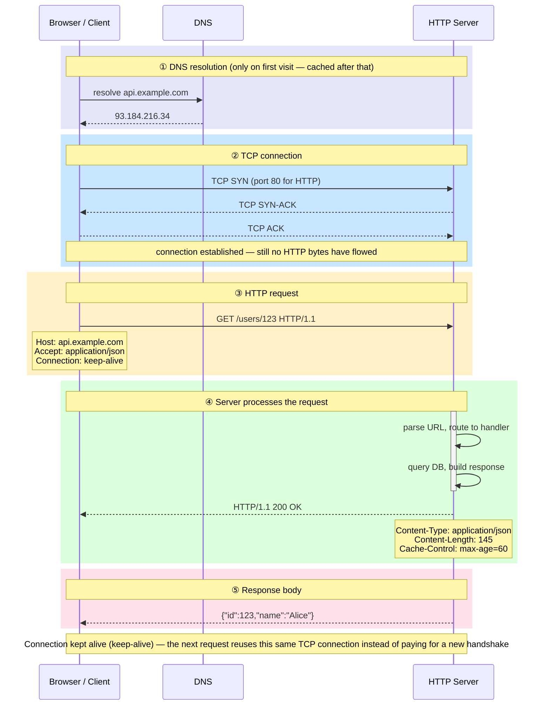
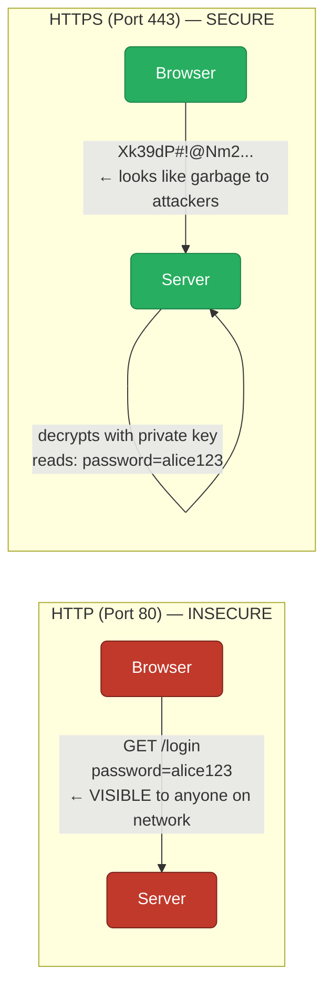
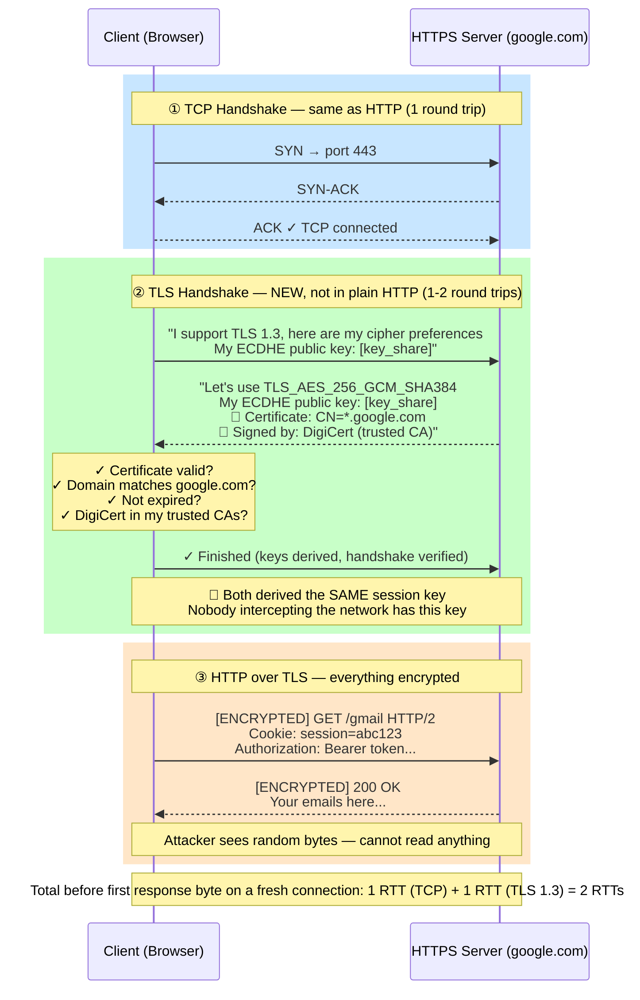
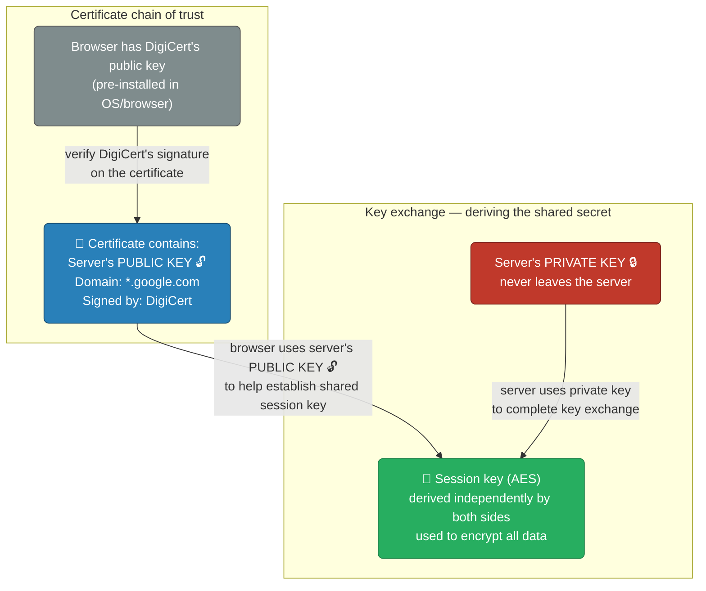
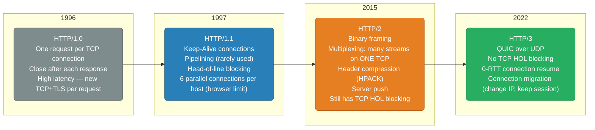
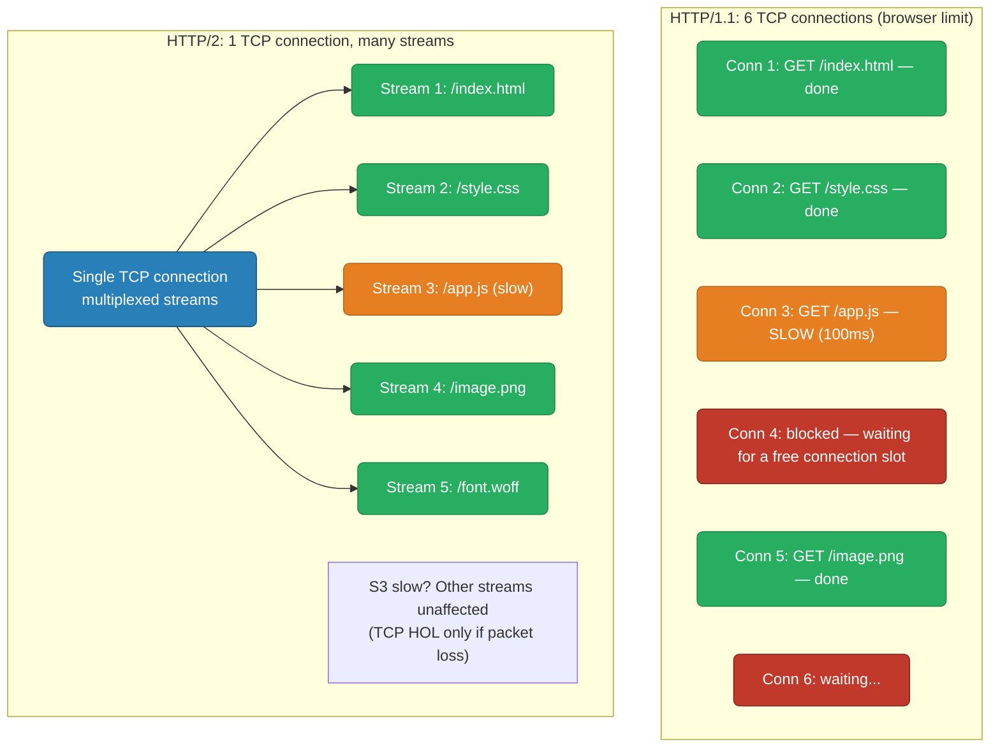
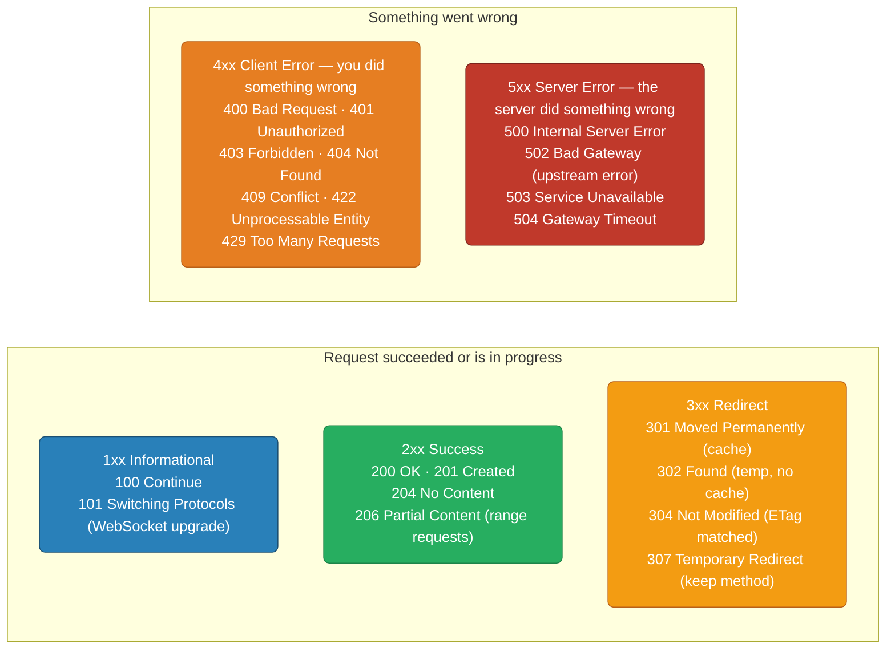
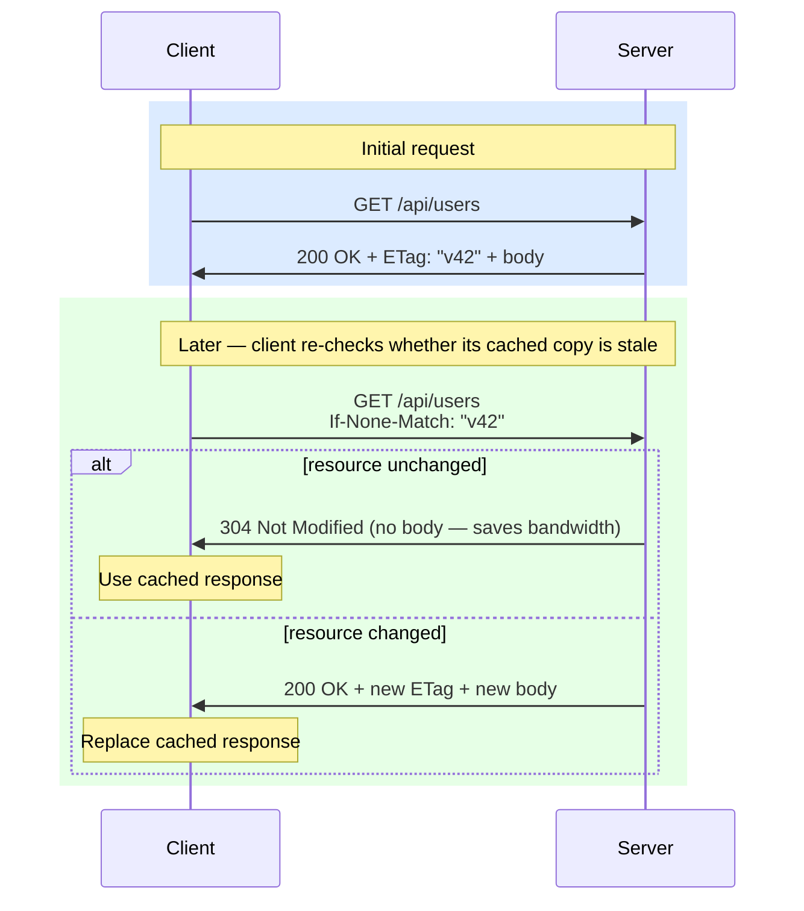
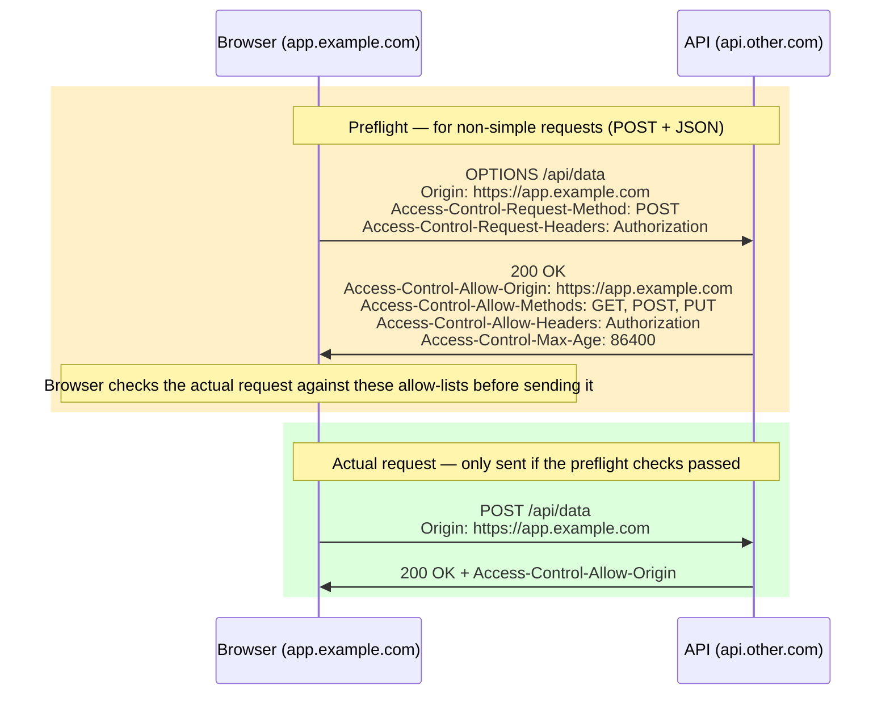

# HTTP — Client-Server Communication, Versions, Methods, Headers

<div class="quiz-progress" data-quiz-progress>
  <span class="quiz-progress-label">0/0 checks</span>
  <span class="quiz-progress-bar"><span class="quiz-progress-fill"></span></span>
</div>

---

## HTTP Client-Server: What Actually Happens



<div class="quiz-card">
  <p class="quiz-q">The diagram shows the connection staying open after the response ("Connection kept alive for next request"). Why does that matter?</p>
  <button class="quiz-reveal">Reveal answer</button>
  <div class="quiz-a" hidden>
    Because the TCP handshake — and, over HTTPS, the TLS handshake stacked on top of it — is a fixed cost paid once per connection, not once per request. Reusing the same connection for the next request skips both handshakes entirely: only a fresh connection has to pay for DNS resolution and the SYN/SYN-ACK/ACK round trip shown above.
  </div>
</div>

---

## HTTPS: Adding TLS Between TCP and HTTP

Plain HTTP sends everything as readable text — anyone on the network can read your passwords, cookies, and data. HTTPS wraps HTTP inside a TLS tunnel so all data is encrypted.



**What HTTPS adds on top of HTTP:**



**The role of public and private keys:**



<div class="quiz-card">
  <p class="quiz-q">The certificate contains the server's public key. Where does the server's private key ever get sent over the network?</p>
  <button class="quiz-reveal">Reveal answer</button>
  <div class="quiz-a" hidden>
    Nowhere — it never leaves the server. The browser uses the server's <em>public</em> key (from the certificate) as its side of the key exchange, while the server uses its <em>private</em> key to complete that same exchange on its end. Both sides independently arrive at the identical AES session key without the private key ever crossing the network.
  </div>
</div>

Here's that same negotiation walked through step by step, contrasting TLS 1.2's two round trips with TLS 1.3's one:

<div class="stepper">
  <div class="stepper-panels">
    <div class="stepper-panel active">
      <strong>1. TLS 1.2 — ClientHello.</strong> Client sends its supported cipher suites and a random value. No key material yet.
    </div>
    <div class="stepper-panel">
      <strong>2. TLS 1.2 — ServerHello + Certificate + ServerKeyExchange + Done.</strong> The server picks a cipher suite and sends its certificate <em>in the clear</em> — visible to anyone sniffing the connection.
    </div>
    <div class="stepper-panel">
      <strong>3. TLS 1.2 — Client verifies, then replies.</strong> The client checks the certificate, generates a pre-master secret, and sends <code>ClientKeyExchange</code> + <code>ChangeCipherSpec</code> + <code>Finished</code>. That's round trip 1 spent.
    </div>
    <div class="stepper-panel">
      <strong>4. TLS 1.2 — Server confirms.</strong> The server replies with its own <code>ChangeCipherSpec</code> + <code>Finished</code>. Only now, after 2 full round trips, can the first HTTP byte go out.
    </div>
    <div class="stepper-panel">
      <strong>5. TLS 1.3 — ClientHello + key_share.</strong> The client sends its ECDHE public key <em>in the same first message</em> as its ClientHello — it doesn't wait to be asked.
    </div>
    <div class="stepper-panel">
      <strong>6. TLS 1.3 — Server derives keys immediately.</strong> With the client's key_share already in hand, the server computes the shared secret right away and replies with ServerHello + its own key_share + Certificate (now <em>encrypted</em>, unlike TLS 1.2) + Finished — all in one flight.
    </div>
    <div class="stepper-panel">
      <strong>7. TLS 1.3 — Client finishes and sends HTTP in the same flight.</strong> The client derives the same keys, verifies the certificate, and sends <code>Finished</code> together with the actual <code>GET /page</code> request — encrypted, in a single round trip.
    </div>
    <div class="stepper-panel">
      <strong>8. Net result.</strong> TLS 1.2 needs 2 round trips before any HTTP data moves; TLS 1.3 needs 1. At 50ms RTT that's the difference between 100ms and 50ms before the first byte of every fresh HTTPS connection.
    </div>
  </div>
  <div class="stepper-controls">
    <button class="stepper-prev">← Prev</button>
    <span class="stepper-dots"></span>
    <span class="stepper-label"></span>
    <button class="stepper-next">Next →</button>
  </div>
</div>

**Why TLS 1.3 is faster:**
- TLS 1.2: client must wait for server cert before deriving keys → 2 RTTs
- TLS 1.3: client sends its ECDHE key_share upfront → server derives keys in first message → **1 RTT**
- TLS 1.3 also encrypts the certificate (TLS 1.2 cert is plaintext on the wire)

---

## HTTP/1.1 vs HTTP/2 vs HTTP/3

Three generations of HTTP attacked the same two problems — connection overhead and head-of-line blocking — with three different transport-layer strategies. Here's the timeline, then each version's tradeoffs side by side.



<div class="tab-group">
  <div class="tab-buttons">
    <button data-tab="http11" class="active">HTTP/1.1</button>
    <button data-tab="http2">HTTP/2</button>
    <button data-tab="http3">HTTP/3</button>
  </div>
  <div class="tab-panels">
    <div class="tab-panel active" data-tab-panel="http11">
      <strong>Text-based, one TCP connection per in-flight request.</strong> <code>Keep-Alive</code> lets a connection serve multiple requests <em>sequentially</em>, and pipelining lets a client queue several without waiting for each response — but pipelining is rarely used in practice because a single slow response still blocks everything queued behind it on that connection. To get real parallelism, browsers open up to <strong>6 TCP connections per host</strong>, which is exactly why HTTP/1.1 suffers head-of-line blocking at the connection level.
    </div>
    <div class="tab-panel" data-tab-panel="http2">
      <strong>Binary framing over a single TCP connection.</strong> Requests and responses are split into <code>HEADERS</code>/<code>DATA</code> frames, each tagged with a stream ID, and multiplexed onto <em>one</em> TCP connection instead of six. HPACK header compression cuts repeated header bytes across requests, and the server can proactively push resources. It still rides on top of TCP, though — so a single lost packet stalls every multiplexed stream until it's retransmitted, because TCP still enforces in-order delivery for the whole connection.
    </div>
    <div class="tab-panel" data-tab-panel="http3">
      <strong>QUIC over UDP instead of TCP.</strong> Each stream gets independent, in-order delivery inside QUIC, so a lost packet only stalls the one stream it belongs to — the TCP-level head-of-line blocking that HTTP/2 still has is gone. QUIC also folds the transport and TLS handshakes together for <strong>0-RTT resumption</strong> on reconnect, and supports <strong>connection migration</strong> — a client can switch networks (Wi-Fi → cellular) mid-connection without dropping it, since the connection is identified by a connection ID rather than an IP/port tuple.
    </div>
  </div>
</div>

<div class="quiz-card">
  <p class="quiz-q">HTTP/2 multiplexes many streams on a single TCP connection. Does that mean HTTP/2 eliminates head-of-line blocking entirely?</p>
  <button class="quiz-reveal">Reveal answer</button>
  <div class="quiz-a" hidden>
    No — only the <em>application-layer</em> HOL blocking from HTTP/1.1's one-request-per-connection-slot model. HTTP/2 still rides on a single TCP connection, and TCP guarantees in-order delivery, so one lost packet stalls <strong>every</strong> multiplexed stream until it's retransmitted — that's TCP-level HOL blocking, and it's exactly what HTTP/3 fixes by moving to QUIC over UDP.
  </div>
</div>

### Head-of-Line Blocking



**HTTP/2 stream priority:** Each stream has a weight (1-256) and optional dependency. The server can prioritize CSS/JS over images. In practice, most servers use equal priority.

<div class="stepper">
  <div class="stepper-panels">
    <div class="stepper-panel active">
      <strong>1. Page load starts.</strong> The browser needs 5 resources from the same host and opens up to 6 TCP connections to fetch them in parallel.
    </div>
    <div class="stepper-panel">
      <strong>2. Fast resources finish quickly.</strong> <code>/index.html</code>, <code>/style.css</code>, and <code>/image.png</code> each get their own connection and complete normally.
    </div>
    <div class="stepper-panel">
      <strong>3. One resource is slow.</strong> <code>/app.js</code> takes 100ms and holds Conn 3 the whole time — nothing else is wrong with the network, that connection is just busy.
    </div>
    <div class="stepper-panel">
      <strong>4. The 6-connection limit bites.</strong> A 6th resource has nowhere to go — every connection is either in use or already used, so it queues behind Conn 3 even though Conn 1, 2, and 5 already finished and now sit idle.
    </div>
    <div class="stepper-panel">
      <strong>5. HTTP/2 avoids this specific problem.</strong> All 5 resources become streams multiplexed on <em>one</em> TCP connection. The slow <code>/app.js</code> stream doesn't consume a whole connection — it's just one stream among several sharing the same wire, so the others keep flowing.
    </div>
    <div class="stepper-panel">
      <strong>6. But HTTP/2's fix has a limit.</strong> If a packet is lost anywhere on that single TCP connection, TCP won't deliver <em>any</em> of the bytes behind it — including bytes for streams that have nothing to do with the lost packet — until the retransmit arrives. That's TCP-level HOL blocking, and it's the reason HTTP/3 exists.
    </div>
  </div>
  <div class="stepper-controls">
    <button class="stepper-prev">← Prev</button>
    <span class="stepper-dots"></span>
    <span class="stepper-label"></span>
    <button class="stepper-next">Next →</button>
  </div>
</div>

### HTTP/2 Binary Framing

<div class="tab-group">
  <div class="tab-buttons">
    <button data-tab="framing11" class="active">HTTP/1.1 (text)</button>
    <button data-tab="framing2">HTTP/2 (binary frames)</button>
  </div>
  <div class="tab-panels">
    <div class="tab-panel active" data-tab-panel="framing11">
      <pre><code>GET /users HTTP/1.1
Host: api.example.com
Accept: application/json</code></pre>
      Plain text, parsed line by line. Human-readable on the wire, but slower to parse and impossible to compress structurally — each request repeats full header names.
    </div>
    <div class="tab-panel" data-tab-panel="framing2">
      <pre><code>HEADERS frame {
  :method: GET
  :path: /users
  :authority: api.example.com
  accept: application/json
}
DATA frame { body bytes }</code></pre>
      Same request, split into typed, length-prefixed binary frames. Faster to parse, and headers get HPACK-compressed across requests on the same connection.
    </div>
  </div>
</div>

Each HTTP/2 frame has:
- **Length** (3 bytes)
- **Type** (1 byte): HEADERS, DATA, SETTINGS, WINDOW_UPDATE, PING, GOAWAY
- **Flags** (1 byte): END_STREAM, END_HEADERS, PADDED, PRIORITY
- **Stream ID** (4 bytes): which request this belongs to (odd=client, even=server)

<div class="quiz-card">
  <p class="quiz-q">An HTTP/2 frame's Stream ID is odd. Who opened that stream?</p>
  <button class="quiz-reveal">Reveal answer</button>
  <div class="quiz-a" hidden>
    The client. Stream IDs are split by parity so both sides can open new streams without coordinating on the next free number: client-initiated streams get odd IDs, server-initiated streams (like a server push) get even ones.
  </div>
</div>

---

## TLS 1.2 vs TLS 1.3 — Visual Comparison

The core improvement in TLS 1.3: client sends its ECDHE key upfront, so the server derives encryption keys in the **first message** — saving one full round trip.

<div class="toggle-switch">
  <div class="toggle-buttons">
    <button data-toggle-opt="tls12" class="active state-warn">TLS 1.2 (2 RTT)</button>
    <button data-toggle-opt="tls13" class="state-ok">TLS 1.3 (1 RTT)</button>
  </div>
  <div class="toggle-panel active" data-toggle-panel="tls12">
    <pre><code class="language-mermaid">sequenceDiagram
    participant C as Browser
    participant S as Server
    C->>S: ClientHello - supported cipher suites
    S-->>C: ServerHello + Certificate + Key params
    Note over C: Wait for cert, verify it, generate secret
    C->>S: Encrypted pre-master secret + ChangeCipherSpec
    S-->>C: ChangeCipherSpec + Finished
    Note over C,S: 2 round trips spent - only now can HTTP start
    C->>S: GET /page - ENCRYPTED</code></pre>
  </div>
  <div class="toggle-panel" data-toggle-panel="tls13">
    <pre><code class="language-mermaid">sequenceDiagram
    participant C as Browser
    participant S as Server
    C->>S: ClientHello plus ECDHE key_share
    Note over S: Server derives session keys immediately
    S-->>C: ServerHello plus key_share plus Certificate plus Finished
    Note over C: Derives same keys, verifies cert
    C->>S: Finished plus GET /page - ENCRYPTED, same flight
    Note over C,S: 1 round trip done - HTTP data sent with Finished</code></pre>
  </div>
</div>

**Real-world impact at 50ms RTT:**
- TLS 1.2: 2 × 50ms = 100ms before first byte of response
- TLS 1.3: 1 × 50ms = 50ms before first byte of response
- TLS 1.3 0-RTT resumption: 0ms if reconnecting to same server within session window

<div class="quiz-card">
  <p class="quiz-q">At 50ms round-trip time, roughly how much faster is a fresh TLS 1.3 handshake than TLS 1.2, before the first byte of the response arrives?</p>
  <button class="quiz-reveal">Reveal answer</button>
  <div class="quiz-a" hidden>
    50ms. TLS 1.2 spends 2 round trips before HTTP data can move (2 × 50ms = 100ms); TLS 1.3 needs only 1 (50ms) because the client sends its key_share in the very first message. Reconnecting with 0-RTT resumption can shave that down to 0ms.
  </div>
</div>

---

## HTTP Request / Response Structure

```
Request:
GET /api/users?page=2 HTTP/2
Host: api.example.com
Authorization: Bearer eyJhbGc...
Accept: application/json
Content-Type: application/json
X-Request-ID: abc-123

{"filter": "active"}


Response:
HTTP/2 200 OK
Content-Type: application/json; charset=utf-8
Cache-Control: max-age=60, public
X-RateLimit-Remaining: 99
X-RateLimit-Reset: 1700000300

{"users": [...], "total": 150}
```

---

## HTTP Status Codes



**401 vs 403:** 401 = you didn't authenticate (no token or invalid token). 403 = you authenticated but don't have permission.

<div class="toggle-switch">
  <div class="toggle-buttons">
    <button data-toggle-opt="502" class="active state-warn">502 Bad Gateway</button>
    <button data-toggle-opt="503" class="state-bad">503 Unavailable</button>
    <button data-toggle-opt="504" class="state-warn">504 Timeout</button>
  </div>
  <div class="toggle-panel active" data-toggle-panel="502">
    ALB/nginx got an <strong>invalid response</strong> from the upstream — the app crashed mid-response or spoke the wrong protocol. The upstream said <em>something</em>, just not something usable.
  </div>
  <div class="toggle-panel" data-toggle-panel="503">
    The service is <strong>down or overloaded</strong> — the upstream refused the connection outright. Nothing answered at all.
  </div>
  <div class="toggle-panel" data-toggle-panel="504">
    The upstream <strong>timed out</strong> — it's alive and accepted the connection, it's just too slow to respond in time.
  </div>
</div>

---

## HTTP Methods

| Method | Idempotent | Safe | Body | Typical use |
|--------|-----------|------|------|-------------|
| GET | Yes | Yes | No | Read resource |
| POST | No | No | Yes | Create / trigger action |
| PUT | Yes | No | Yes | Full replace (create or overwrite) |
| PATCH | No | No | Yes | Partial update |
| DELETE | Yes | No | No | Delete resource |
| HEAD | Yes | Yes | No | Get headers only (check if modified) |
| OPTIONS | Yes | Yes | No | CORS preflight, list allowed methods |

**Idempotent** = calling it N times has same effect as calling it once. DELETE is idempotent (deleting already-deleted resource returns 404, not an error state). POST is not — calling POST twice creates two resources.

<div class="quiz-card">
  <p class="quiz-q">Is DELETE idempotent? What happens if you call DELETE on the same resource twice in a row?</p>
  <button class="quiz-reveal">Reveal answer</button>
  <div class="quiz-a" hidden>
    Yes, DELETE is idempotent — calling it N times has the same effect as calling it once. The first call deletes the resource; the second call finds it already gone and returns 404 instead of erroring, but the end state (resource does not exist) is identical either way. Contrast with POST, which is not idempotent — calling it twice creates two resources.
  </div>
</div>

---

## Important HTTP Headers

### Request headers
```
Host: api.example.com              # required in HTTP/1.1+, which virtual host
Authorization: Bearer <token>      # auth credentials
Content-Type: application/json     # body format
Accept: application/json           # what formats client accepts
Accept-Encoding: gzip, br          # compression algorithms client supports
User-Agent: Mozilla/5.0...         # client identification
X-Request-ID: uuid                 # for distributed tracing
Cookie: session=abc123             # client sends stored cookies
```

### Response headers
```
Content-Type: application/json     # body format
Content-Encoding: gzip             # body is compressed
Cache-Control: max-age=3600, public # cache for 1 hour
ETag: "abc123"                     # content hash for conditional requests
Last-Modified: Wed, 21 Oct 2024    # when resource last changed
Set-Cookie: session=abc; Secure; HttpOnly; SameSite=Strict
X-RateLimit-Limit: 100             # rate limit max
X-RateLimit-Remaining: 87          # requests left
Strict-Transport-Security: max-age=31536000; includeSubDomains  # HSTS
Access-Control-Allow-Origin: *     # CORS
```

### Caching with ETag



<div class="quiz-card">
  <p class="quiz-q">The client sends <code>If-None-Match: "v42"</code> and the server replies <code>304 Not Modified</code> with no body. What did that save, and why does the server still need to compute the ETag to answer?</p>
  <button class="quiz-reveal">Reveal answer</button>
  <div class="quiz-a" hidden>
    It saves the bandwidth of re-sending a response body the client already has — a 304 carries no body at all. The server still has to compute (or look up) the current ETag to compare it against the client's <code>If-None-Match</code> value; if they match, nothing has changed since the client last fetched it and the cached copy is safe to reuse.
  </div>
</div>

---

## CORS — Cross-Origin Resource Sharing



<div class="stepper">
  <div class="stepper-panels">
    <div class="stepper-panel active">
      <strong>1. Browser wants to make a non-simple request.</strong> JS calls <code>fetch()</code> with a POST + JSON body to a different origin (<code>api.other.com</code>) — this isn't a "simple request," so the browser won't send it directly.
    </div>
    <div class="stepper-panel">
      <strong>2. Browser auto-sends a preflight OPTIONS request.</strong> No application code triggers this — the browser itself sends <code>OPTIONS</code> with <code>Origin</code>, <code>Access-Control-Request-Method</code>, and <code>Access-Control-Request-Headers</code>, asking the server "would you allow this?"
    </div>
    <div class="stepper-panel">
      <strong>3. Server answers with its allow-lists.</strong> The response carries <code>Access-Control-Allow-Origin</code>, <code>-Methods</code>, <code>-Headers</code>, and an optional <code>Access-Control-Max-Age</code> that tells the browser how long it can cache this answer.
    </div>
    <div class="stepper-panel">
      <strong>4. Browser checks the answer — locally, before sending anything real.</strong> Is the actual origin, method, and header set covered by what the server just allowed? If not, the real request is never sent and JS sees a CORS error.
    </div>
    <div class="stepper-panel">
      <strong>5. Checks pass — the actual request goes out.</strong> Browser sends the real <code>POST /api/data</code> with the <code>Origin</code> header attached.
    </div>
    <div class="stepper-panel">
      <strong>6. Server responds normally.</strong> As long as <code>Access-Control-Allow-Origin</code> is present and matches, the browser hands the response to JS.
    </div>
    <div class="stepper-panel">
      <strong>7. Max-Age skips the repeat.</strong> With <code>Access-Control-Max-Age: 86400</code> cached, the next matching request within 24 hours skips steps 2–4 entirely and goes straight to step 5.
    </div>
  </div>
  <div class="stepper-controls">
    <button class="stepper-prev">← Prev</button>
    <span class="stepper-dots"></span>
    <span class="stepper-label"></span>
    <button class="stepper-next">Next →</button>
  </div>
</div>

<div class="quiz-card">
  <p class="quiz-q">A page on app.example.com sends a GET request to api.other.com with a custom <code>Authorization</code> header. Does the browser need to send a CORS preflight first?</p>
  <button class="quiz-reveal">Reveal answer</button>
  <div class="quiz-a" hidden>
    Yes. Even though GET is one of the "simple" methods, adding an <code>Authorization</code> header takes the request out of the simple-request category — any request carrying an <code>Authorization</code> header, a <code>Content-Type: application/json</code> body, or a non-simple method (PUT/DELETE/PATCH) triggers a preflight <code>OPTIONS</code> check first.
  </div>
</div>

**Simple requests** (no preflight): GET/HEAD/POST with `Content-Type: text/plain` or `application/x-www-form-urlencoded` or `multipart/form-data`.

**Non-simple** (needs preflight): Any request with `Authorization` header, `Content-Type: application/json`, or methods like PUT/DELETE/PATCH.
