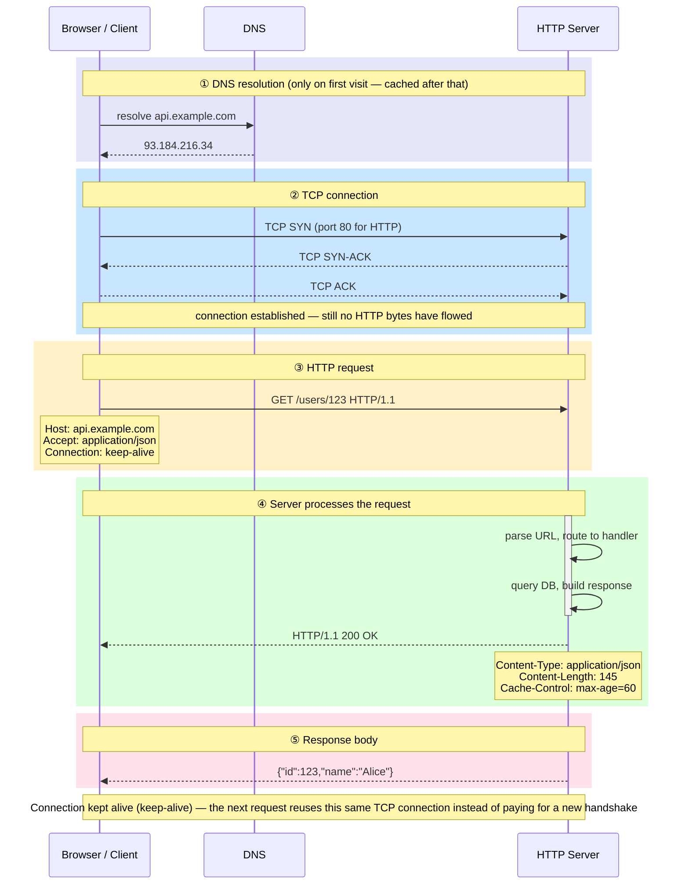
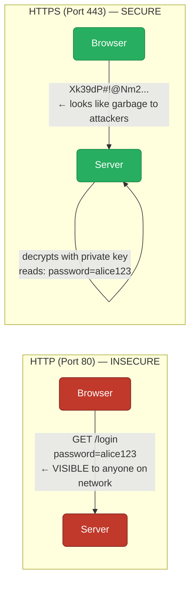
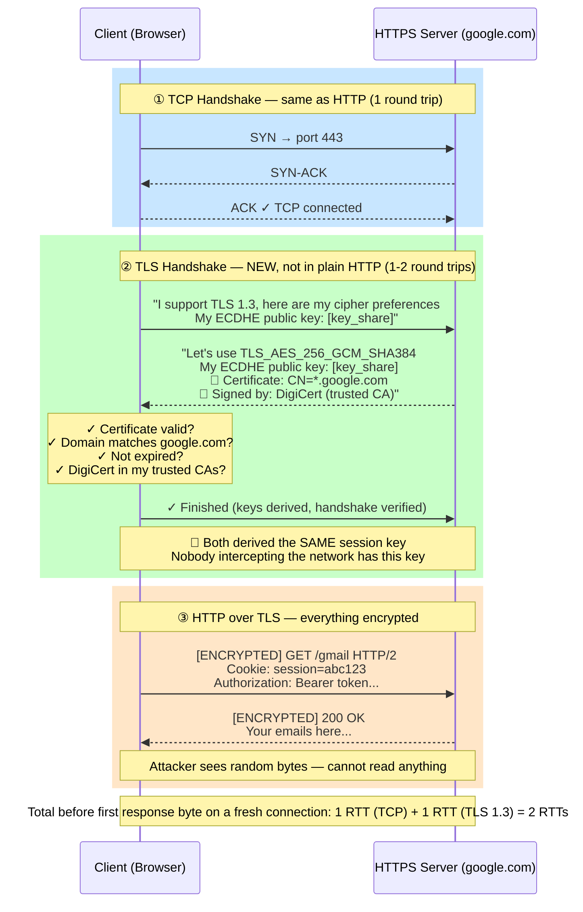
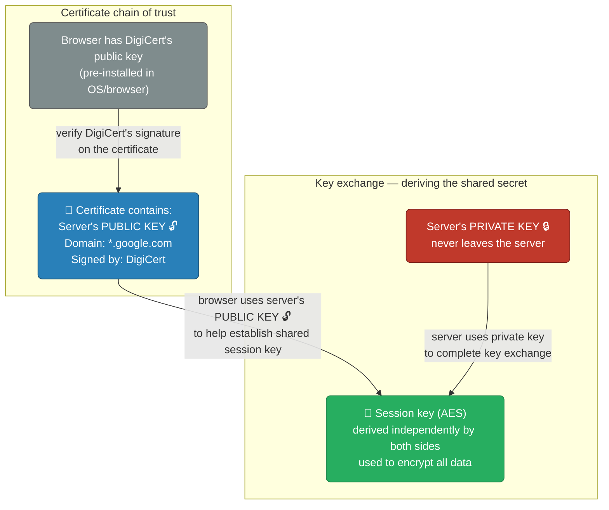
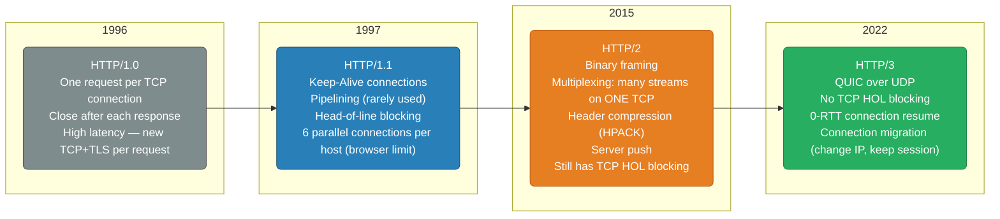
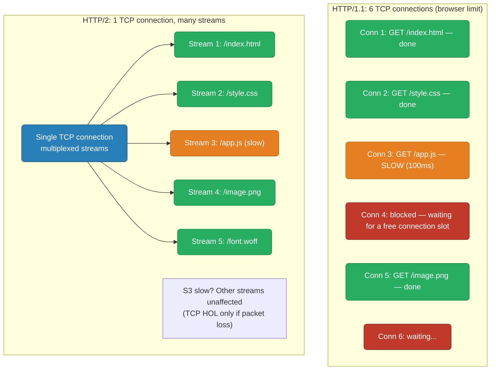
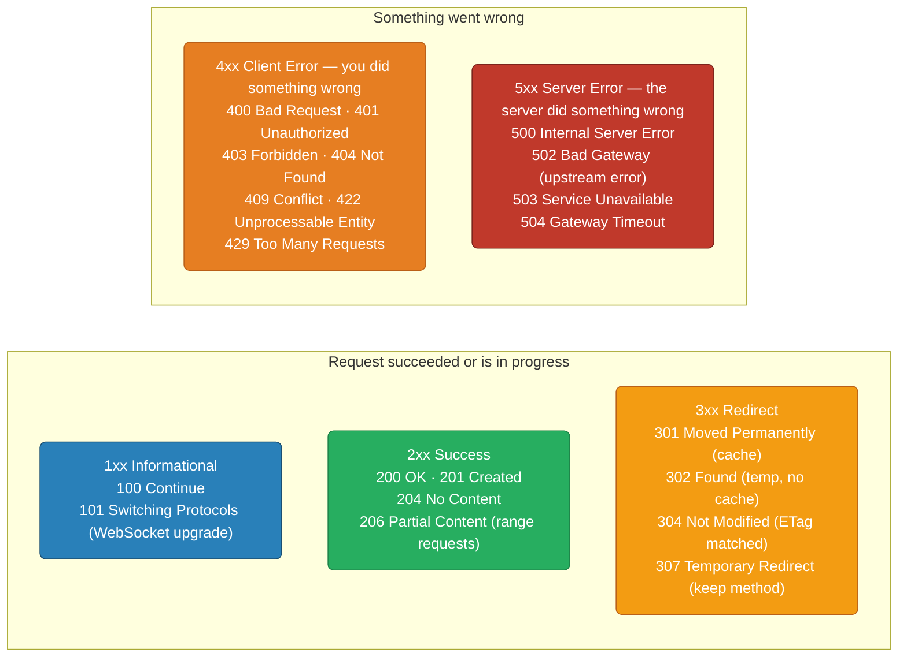
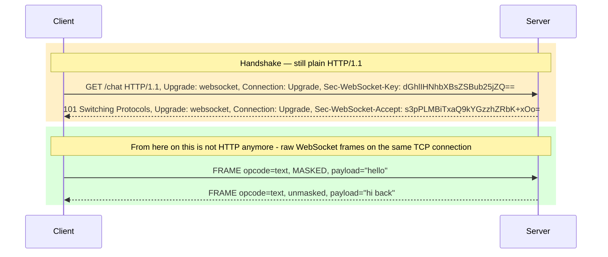
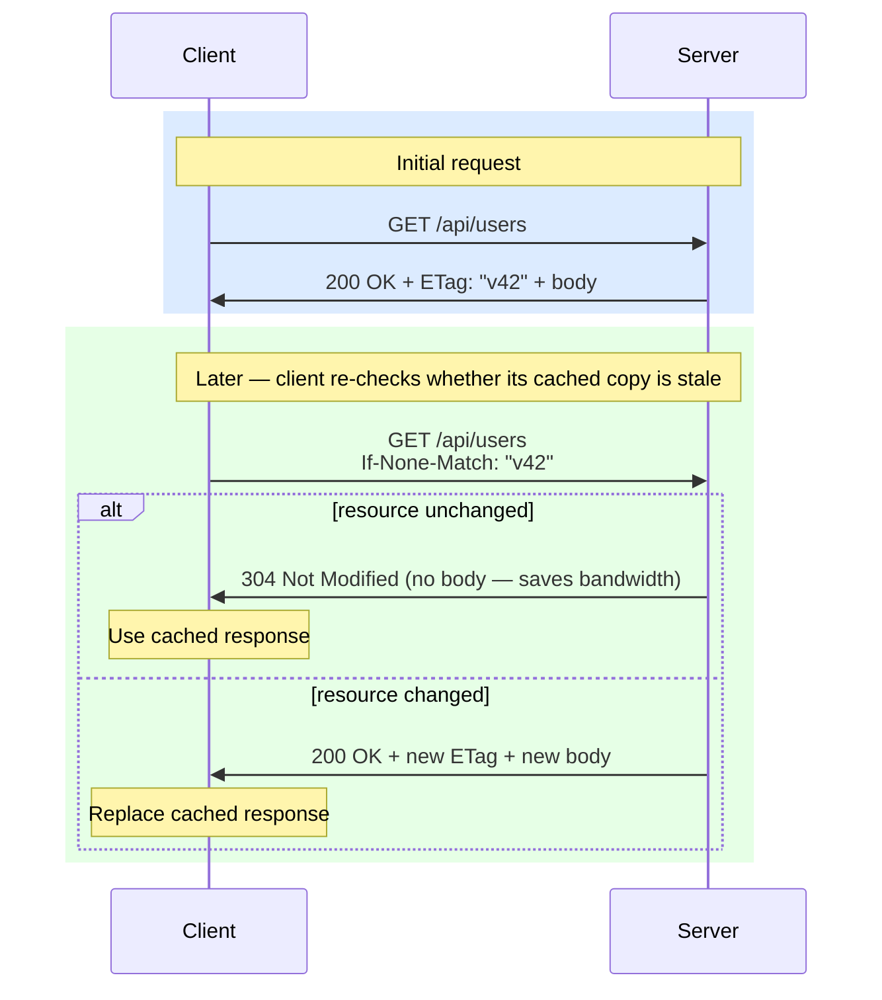
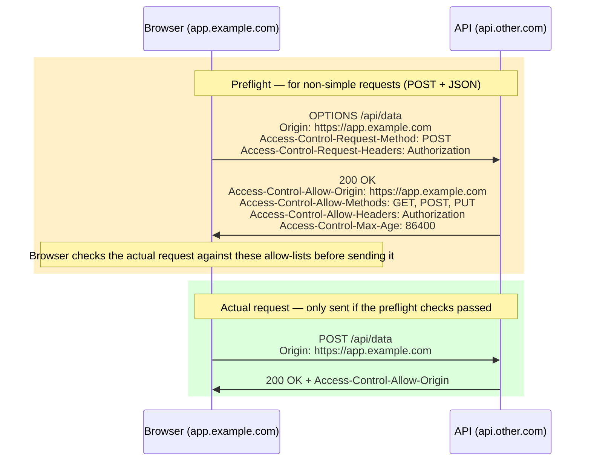

# HTTP — Client-Server Communication, Versions, Methods, Headers

<div class="quiz-progress" data-quiz-progress>
  <span class="quiz-progress-label">0/0 checks</span>
  <span class="quiz-progress-bar"><span class="quiz-progress-fill"></span></span>
</div>

---

## HTTP Client-Server: What Actually Happens



<div class="quiz-card">
  <p class="quiz-q">The diagram shows the connection staying open after the response ("Connection kept alive for next request"). Why does that matter?</p>
  <button class="quiz-reveal">Reveal answer</button>
  <div class="quiz-a" hidden>
    Because the TCP handshake — and, over HTTPS, the TLS handshake stacked on top of it — is a fixed cost paid once per connection, not once per request. Reusing the same connection for the next request skips both handshakes entirely: only a fresh connection has to pay for DNS resolution and the SYN/SYN-ACK/ACK round trip shown above.
  </div>
</div>

---

## HTTPS: Adding TLS Between TCP and HTTP

Plain HTTP sends everything as readable text — anyone on the network can read your passwords, cookies, and data. HTTPS wraps HTTP inside a TLS tunnel so all data is encrypted.



**What HTTPS adds on top of HTTP:**



**The role of public and private keys:**



<div class="quiz-card">
  <p class="quiz-q">The certificate contains the server's public key. Where does the server's private key ever get sent over the network?</p>
  <button class="quiz-reveal">Reveal answer</button>
  <div class="quiz-a" hidden>
    Nowhere — it never leaves the server. The browser uses the server's <em>public</em> key (from the certificate) as its side of the key exchange, while the server uses its <em>private</em> key to complete that same exchange on its end. Both sides independently arrive at the identical AES session key without the private key ever crossing the network.
  </div>
</div>

Here's that same negotiation walked through step by step, contrasting TLS 1.2's two round trips with TLS 1.3's one:

<div class="stepper">
  <div class="stepper-panels">
    <div class="stepper-panel active">
      <strong>1. TLS 1.2 — ClientHello.</strong> Client sends its supported cipher suites and a random value. No key material yet.
    </div>
    <div class="stepper-panel">
      <strong>2. TLS 1.2 — ServerHello + Certificate + ServerKeyExchange + Done.</strong> The server picks a cipher suite and sends its certificate <em>in the clear</em> — visible to anyone sniffing the connection.
    </div>
    <div class="stepper-panel">
      <strong>3. TLS 1.2 — Client verifies, then replies.</strong> The client checks the certificate, generates a pre-master secret, and sends <code>ClientKeyExchange</code> + <code>ChangeCipherSpec</code> + <code>Finished</code>. That's round trip 1 spent.
    </div>
    <div class="stepper-panel">
      <strong>4. TLS 1.2 — Server confirms.</strong> The server replies with its own <code>ChangeCipherSpec</code> + <code>Finished</code>. Only now, after 2 full round trips, can the first HTTP byte go out.
    </div>
    <div class="stepper-panel">
      <strong>5. TLS 1.3 — ClientHello + key_share.</strong> The client sends its ECDHE public key <em>in the same first message</em> as its ClientHello — it doesn't wait to be asked.
    </div>
    <div class="stepper-panel">
      <strong>6. TLS 1.3 — Server derives keys immediately.</strong> With the client's key_share already in hand, the server computes the shared secret right away and replies with ServerHello + its own key_share + Certificate (now <em>encrypted</em>, unlike TLS 1.2) + Finished — all in one flight.
    </div>
    <div class="stepper-panel">
      <strong>7. TLS 1.3 — Client finishes and sends HTTP in the same flight.</strong> The client derives the same keys, verifies the certificate, and sends <code>Finished</code> together with the actual <code>GET /page</code> request — encrypted, in a single round trip.
    </div>
    <div class="stepper-panel">
      <strong>8. Net result.</strong> TLS 1.2 needs 2 round trips before any HTTP data moves; TLS 1.3 needs 1. At 50ms RTT that's the difference between 100ms and 50ms before the first byte of every fresh HTTPS connection.
    </div>
  </div>
  <div class="stepper-controls">
    <button class="stepper-prev">← Prev</button>
    <span class="stepper-dots"></span>
    <span class="stepper-label"></span>
    <button class="stepper-next">Next →</button>
  </div>
</div>

**Why TLS 1.3 is faster:**
- TLS 1.2: client must wait for server cert before deriving keys → 2 RTTs
- TLS 1.3: client sends its ECDHE key_share upfront → server derives keys in first message → **1 RTT**
- TLS 1.3 also encrypts the certificate (TLS 1.2 cert is plaintext on the wire)

---

## HTTP/1.1 vs HTTP/2 vs HTTP/3

Three generations of HTTP attacked the same two problems — connection overhead and head-of-line blocking — with three different transport-layer strategies. Here's the timeline, then each version's tradeoffs side by side.



<div class="tab-group">
  <div class="tab-buttons">
    <button data-tab="http11" class="active">HTTP/1.1</button>
    <button data-tab="http2">HTTP/2</button>
    <button data-tab="http3">HTTP/3</button>
  </div>
  <div class="tab-panels">
    <div class="tab-panel active" data-tab-panel="http11">
      <strong>Text-based, one TCP connection per in-flight request.</strong> <code>Keep-Alive</code> lets a connection serve multiple requests <em>sequentially</em>, and pipelining lets a client queue several without waiting for each response — but pipelining is rarely used in practice because a single slow response still blocks everything queued behind it on that connection. To get real parallelism, browsers open up to <strong>6 TCP connections per host</strong>, which is exactly why HTTP/1.1 suffers head-of-line blocking at the connection level.
    </div>
    <div class="tab-panel" data-tab-panel="http2">
      <strong>Binary framing over a single TCP connection.</strong> Requests and responses are split into <code>HEADERS</code>/<code>DATA</code> frames, each tagged with a stream ID, and multiplexed onto <em>one</em> TCP connection instead of six. HPACK header compression cuts repeated header bytes across requests, and the server can proactively push resources. It still rides on top of TCP, though — so a single lost packet stalls every multiplexed stream until it's retransmitted, because TCP still enforces in-order delivery for the whole connection.
    </div>
    <div class="tab-panel" data-tab-panel="http3">
      <strong>QUIC over UDP instead of TCP.</strong> Each stream gets independent, in-order delivery inside QUIC, so a lost packet only stalls the one stream it belongs to — the TCP-level head-of-line blocking that HTTP/2 still has is gone. QUIC also folds the transport and TLS handshakes together for <strong>0-RTT resumption</strong> on reconnect, and supports <strong>connection migration</strong> — a client can switch networks (Wi-Fi → cellular) mid-connection without dropping it, since the connection is identified by a connection ID rather than an IP/port tuple. Don't read "QUIC over UDP" as "HTTP/2 with a different transport bolted on," though — QUIC is a genuinely separate transport protocol with its own congestion control and loss recovery, standardized independently of HTTP itself. See the wire-level deep dive below for why that distinction matters.
    </div>
  </div>
</div>

<div class="quiz-card">
  <p class="quiz-q">HTTP/2 multiplexes many streams on a single TCP connection. Does that mean HTTP/2 eliminates head-of-line blocking entirely?</p>
  <button class="quiz-reveal">Reveal answer</button>
  <div class="quiz-a" hidden>
    No — only the <em>application-layer</em> HOL blocking from HTTP/1.1's one-request-per-connection-slot model. HTTP/2 still rides on a single TCP connection, and TCP guarantees in-order delivery, so one lost packet stalls <strong>every</strong> multiplexed stream until it's retransmitted — that's TCP-level HOL blocking, and it's exactly what HTTP/3 fixes by moving to QUIC over UDP.
  </div>
</div>

### Head-of-Line Blocking



**HTTP/2 stream priority:** Each stream has a weight (1-256) and optional dependency. The server can prioritize CSS/JS over images. In practice, most servers use equal priority.

<div class="stepper">
  <div class="stepper-panels">
    <div class="stepper-panel active">
      <strong>1. Page load starts.</strong> The browser needs 5 resources from the same host and opens up to 6 TCP connections to fetch them in parallel.
    </div>
    <div class="stepper-panel">
      <strong>2. Fast resources finish quickly.</strong> <code>/index.html</code>, <code>/style.css</code>, and <code>/image.png</code> each get their own connection and complete normally.
    </div>
    <div class="stepper-panel">
      <strong>3. One resource is slow.</strong> <code>/app.js</code> takes 100ms and holds Conn 3 the whole time — nothing else is wrong with the network, that connection is just busy.
    </div>
    <div class="stepper-panel">
      <strong>4. The 6-connection limit bites.</strong> A 6th resource has nowhere to go — every connection is either in use or already used, so it queues behind Conn 3 even though Conn 1, 2, and 5 already finished and now sit idle.
    </div>
    <div class="stepper-panel">
      <strong>5. HTTP/2 avoids this specific problem.</strong> All 5 resources become streams multiplexed on <em>one</em> TCP connection. The slow <code>/app.js</code> stream doesn't consume a whole connection — it's just one stream among several sharing the same wire, so the others keep flowing.
    </div>
    <div class="stepper-panel">
      <strong>6. But HTTP/2's fix has a limit.</strong> If a packet is lost anywhere on that single TCP connection, TCP won't deliver <em>any</em> of the bytes behind it — including bytes for streams that have nothing to do with the lost packet — until the retransmit arrives. That's TCP-level HOL blocking, and it's the reason HTTP/3 exists.
    </div>
  </div>
  <div class="stepper-controls">
    <button class="stepper-prev">← Prev</button>
    <span class="stepper-dots"></span>
    <span class="stepper-label"></span>
    <button class="stepper-next">Next →</button>
  </div>
</div>

### Try It: Live Head-of-Line Blocking Simulator

The stepper above walks through one fixed scenario. Rebuild it with your own
resources below — add as many as you want, mark any subset **slow** or
**lost**, then flip between the three protocols to see how each one schedules
the exact same set of resources.

<div class="structure-viz" id="hol-sim">
  <div class="viz-controls">
    <input class="viz-input" type="text" placeholder="resource name (e.g. app.js)" />
    <button class="viz-btn" data-viz-action="add">Add resource</button>
    <button class="viz-btn" data-viz-action="reset">Reset to default</button>
  </div>
  <div class="viz-controls" data-viz-resource-list></div>
  <div class="viz-controls">
    <button class="viz-btn" data-viz-protocol="http11">HTTP/1.1</button>
    <button class="viz-btn" data-viz-protocol="http2">HTTP/2</button>
    <button class="viz-btn" data-viz-protocol="http3">HTTP/3</button>
    <button class="viz-btn" data-viz-action="run">Run ▶</button>
  </div>
  <svg class="viz-canvas" viewBox="0 0 640 220"></svg>
  <div class="viz-status"></div>
  <div class="viz-legend">
    <span><span class="viz-swatch" style="background:var(--accent)"></span> normal</span>
    <span><span class="viz-swatch" style="background:var(--warn)"></span> slow</span>
    <span><span class="viz-swatch" style="background:var(--bad)"></span> lost / dropped packet</span>
    <span><span class="viz-swatch" style="background:var(--text-faint)"></span> waiting (blocked)</span>
  </div>
</div>

<script>
(function () {
  const svgNS = 'http://www.w3.org/2000/svg';
  const root = document.getElementById('hol-sim');
  const svg = root.querySelector('.viz-canvas');
  const input = root.querySelector('.viz-input');
  const status = root.querySelector('.viz-status');
  const resourceList = root.querySelector('[data-viz-resource-list]');

  // ---- pure scheduling core (no DOM) -------------------------------------
  // Kept standalone on purpose: this same logic, unmodified, is what gets
  // copied into a plain Node.js file for randomized invariant testing.

  const BASE_TIME = 10;
  const SLOW_TIME = 60;
  const LOST_TIME = 150; // effective cost of a dropped packet's retransmit-timeout recovery
  const NUM_CONNECTIONS = 6;

  function timeFor(r) {
    if (r.lost) return LOST_TIME;
    if (r.slow) return SLOW_TIME;
    return BASE_TIME;
  }

  function stateFor(r) {
    if (r.lost) return 'lost';
    if (r.slow) return 'slow';
    return 'ok';
  }

  // HTTP/1.1: resources round-robin across NUM_CONNECTIONS connections; each
  // connection processes its own resources strictly in order (serial queue).
  function scheduleHttp11(resources, numConnections) {
    numConnections = numConnections || NUM_CONNECTIONS;
    const conns = Array.from({ length: numConnections }, () => []);
    resources.forEach((r, i) => conns[i % numConnections].push(r));
    const byId = {};
    conns.forEach((list, connId) => {
      let clock = 0;
      let activeBlockerId = null;
      list.forEach((r) => {
        const start = clock;
        const dur = timeFor(r);
        const finish = start + dur;
        byId[r.id] = {
          id: r.id,
          connId,
          waitStart: 0,
          waitEnd: start,
          transferStart: start,
          finish,
          state: stateFor(r),
          blockedByConnection: activeBlockerId !== null,
          blockedById: activeBlockerId,
        };
        clock = finish;
        if (r.slow || r.lost) activeBlockerId = r.id;
      });
    });
    return resources.map((r) => byId[r.id]);
  }

  // HTTP/2: one connection, all resources multiplexed as streams — UNLESS a
  // resource is "lost" (a dropped packet), which stalls the WHOLE connection
  // (every other stream too) until it's recovered. A merely "slow" resource
  // only delays its own stream.
  function scheduleHttp2(resources) {
    const stallUntil = resources.some((r) => r.lost) ? LOST_TIME : 0;
    return resources.map((r) => {
      const own = timeFor(r);
      const blockedByConnection = !r.lost && stallUntil > own;
      const finish = r.lost ? own : Math.max(own, stallUntil);
      return {
        id: r.id,
        waitStart: 0,
        waitEnd: blockedByConnection ? finish - own : 0,
        transferStart: blockedByConnection ? finish - own : 0,
        finish,
        state: stateFor(r),
        blockedByConnection,
      };
    });
  }

  // HTTP/3: every stream is fully independent — a resource's finish time
  // never depends on any other resource's slow/lost flag.
  function scheduleHttp3(resources) {
    return resources.map((r) => ({
      id: r.id,
      waitStart: 0,
      waitEnd: 0,
      transferStart: 0,
      finish: timeFor(r),
      state: stateFor(r),
      blockedByConnection: false,
    }));
  }

  function runSchedule(resources, protocol) {
    if (protocol === 'http11') return scheduleHttp11(resources, NUM_CONNECTIONS);
    if (protocol === 'http2') return scheduleHttp2(resources);
    return scheduleHttp3(resources);
  }

  // ---- component state ----------------------------------------------------

  let resources = [];
  let nextId = 0;
  let protocol = 'http11';

  function defaultResources() {
    // 9 resources so the 6-connection HTTP/1.1 round-robin actually doubles
    // up on a connection: app.js (slow) lands on the same connection as
    // vendor.js (index 2 and index 8, both mod 6 == 2), reproducing the
    // stepper's "6-connection limit bites" scenario above with a concrete
    // second resource queued behind the slow one.
    return [
      { id: nextId++, label: 'index.html', slow: false, lost: false },
      { id: nextId++, label: 'style.css', slow: false, lost: false },
      { id: nextId++, label: 'app.js', slow: true, lost: false },
      { id: nextId++, label: 'image.png', slow: false, lost: false },
      { id: nextId++, label: 'font.woff', slow: false, lost: false },
      { id: nextId++, label: 'icon.svg', slow: false, lost: false },
      { id: nextId++, label: 'data.json', slow: false, lost: false },
      { id: nextId++, label: 'analytics.js', slow: false, lost: false },
      { id: nextId++, label: 'vendor.js', slow: false, lost: false },
    ];
  }

  function setStatusText(msg, kind) {
    status.textContent = msg;
    status.className = 'viz-status' + (kind === 'ok' ? ' viz-status-ok' : kind === 'error' ? ' viz-status-error' : '');
  }

  function connLetter(n) {
    return String.fromCharCode(65 + n);
  }

  function buildStatus(schedule) {
    const byId = {};
    resources.forEach((r) => { byId[r.id] = r; });

    if (protocol === 'http11') {
      const used = new Set(schedule.map((s) => s.connId));
      const flagged = resources.filter((r) => r.slow || r.lost);
      if (flagged.length === 0) {
        return `HTTP/1.1: ${resources.length} resource(s) spread across ${Math.min(NUM_CONNECTIONS, resources.length)} of ${NUM_CONNECTIONS} parallel connections. Nothing slow or lost — every connection clears quickly.`;
      }
      // Report on EVERY flagged resource, not just the first one found —
      // a resource can be slow/lost yet have nothing queued behind it on
      // its connection (last in that connection's queue), which is still
      // worth surfacing even though nothing else is delayed by it.
      const parts = flagged.map((r) => {
        const s = schedule.find((x) => x.id === r.id);
        const victims = schedule.filter((x) => x.blockedById === r.id);
        const kind = r.lost ? 'lost' : 'slow';
        if (victims.length > 0) {
          const names = victims.map((v) => `"${byId[v.id] ? byId[v.id].label : '?'}"`).join(', ');
          return `"${r.label}" is ${kind} on connection ${connLetter(s.connId)} — ${names} queued behind it on that connection ${victims.length === 1 ? 'is' : 'are'} delayed`;
        }
        return `"${r.label}" is ${kind} on connection ${connLetter(s.connId)}, but nothing else shares that connection so only itself is delayed`;
      });
      return `HTTP/1.1: ${used.size} connections in use. ${parts.join('; ')}. Other connections finish unaffected.`;
    }

    if (protocol === 'http2') {
      const lostOnes = resources.filter((r) => r.lost);
      const slowOnes = resources.filter((r) => r.slow && !r.lost);
      if (lostOnes.length > 0) {
        return `HTTP/2: 1 connection multiplexing ${resources.length} streams. "${lostOnes[0].label}" is a lost packet — TCP-level HOL blocking stalls ALL ${resources.length - 1} other stream(s) on this connection until it's recovered.`;
      }
      if (slowOnes.length > 0) {
        return `HTTP/2: 1 connection multiplexing ${resources.length} streams. "${slowOnes[0].label}" is slow, but multiplexing means the other streams keep flowing — only its own stream is delayed.`;
      }
      return `HTTP/2: 1 connection multiplexing ${resources.length} streams, all clear quickly — no packet loss, no stall.`;
    }

    // http3
    const stalled = resources.filter((r) => r.slow || r.lost);
    if (stalled.length === 0) {
      return `HTTP/3: ${resources.length} independent streams, all finish without blocking each other.`;
    }
    const names = stalled.map((r) => `"${r.label}"`).join(', ');
    return `HTTP/3: ${names} ${stalled.length === 1 ? 'stalls alone on its own stream' : 'each stall alone on their own stream'} — the other ${resources.length - stalled.length} stream(s) finish independently, completely unaffected.`;
  }

  // ---- drawing --------------------------------------------------------------

  const MARGIN_LEFT = 130;
  const MARGIN_TOP = 24;
  const ROW_H = 28;
  const PX_PER_UNIT = 3.4;

  function el(tag, attrs) {
    const e = document.createElementNS(svgNS, tag);
    for (const k in attrs) e.setAttribute(k, attrs[k]);
    return e;
  }

  function stateClass(state) {
    if (state === 'lost') return 'viz-node-removing';
    if (state === 'slow') return 'viz-node-highlight';
    return 'viz-node';
  }

  function lanesFor(schedule) {
    if (protocol === 'http11') {
      const byConn = {};
      schedule.forEach((s) => {
        (byConn[s.connId] = byConn[s.connId] || []).push(s);
      });
      return Object.keys(byConn)
        .sort((a, b) => a - b)
        .map((connId) => ({ label: `Conn ${connLetter(Number(connId))}`, items: byConn[connId] }));
    }
    if (protocol === 'http2') {
      return schedule.map((s, i) => ({ label: `Stream ${i + 1}`, items: [s] }));
    }
    return schedule.map((s, i) => ({ label: `Stream ${i + 1}`, items: [s] }));
  }

  function draw() {
    const schedule = runSchedule(resources, protocol);
    const byId = {};
    resources.forEach((r) => { byId[r.id] = r; });

    const lanes = lanesFor(schedule);
    const vbH = MARGIN_TOP + Math.max(lanes.length, 1) * ROW_H + 16;
    svg.setAttribute('viewBox', `0 0 640 ${vbH}`);
    while (svg.firstChild) svg.removeChild(svg.firstChild);

    if (protocol === 'http2' && resources.length > 0) {
      svg.appendChild(el('rect', {
        x: 8, y: 6, width: 624, height: vbH - 12, rx: 8,
        class: 'viz-edge', 'fill-opacity': '0', 'stroke-dasharray': '4,3',
      }));
      const bracket = el('text', { x: 16, y: 16, class: 'viz-label-dim' });
      bracket.textContent = '1 shared TCP connection';
      svg.appendChild(bracket);
    }

    lanes.forEach((lane, laneIdx) => {
      const y = MARGIN_TOP + laneIdx * ROW_H;
      const laneLabel = el('text', { x: MARGIN_LEFT - 10, y: y + ROW_H / 2, class: 'viz-label-dim' });
      laneLabel.setAttribute('text-anchor', 'end');
      laneLabel.textContent = lane.label;
      svg.appendChild(laneLabel);

      lane.items.forEach((s) => {
        const r = byId[s.id];
        const barH = 18;
        const barY = y + (ROW_H - barH) / 2;

        if (s.waitEnd > s.waitStart) {
          svg.appendChild(el('rect', {
            x: MARGIN_LEFT + s.waitStart * PX_PER_UNIT,
            y: barY,
            width: (s.waitEnd - s.waitStart) * PX_PER_UNIT,
            height: barH,
            rx: 3,
            class: 'viz-edge',
            'fill-opacity': '0.25',
            'stroke-dasharray': '3,2',
          }));
        }

        const transferStart = s.transferStart;
        const transferW = Math.max(s.finish - transferStart, 1) * PX_PER_UNIT;
        svg.appendChild(el('rect', {
          x: MARGIN_LEFT + transferStart * PX_PER_UNIT,
          y: barY,
          width: transferW,
          height: barH,
          rx: 3,
          class: stateClass(s.state),
        }));

        const label = el('text', {
          x: MARGIN_LEFT + transferStart * PX_PER_UNIT + transferW / 2,
          y: barY + barH / 2,
        });
        label.textContent = r ? r.label : '?';
        svg.appendChild(label);
      });
    });

    setStatusText(buildStatus(schedule), resources.some((r) => r.lost) ? 'error' : (resources.some((r) => r.slow) ? '' : 'ok'));
  }

  // ---- resource list UI -------------------------------------------------

  function renderResourceList() {
    while (resourceList.firstChild) resourceList.removeChild(resourceList.firstChild);
    resources.forEach((r) => {
      const wrap = document.createElement('span');
      wrap.style.display = 'inline-flex';
      wrap.style.alignItems = 'center';
      wrap.style.gap = '0.3rem';
      wrap.style.border = '1px solid var(--border)';
      wrap.style.borderRadius = '0.4rem';
      wrap.style.padding = '0.2rem 0.4rem';

      const name = document.createElement('span');
      name.textContent = r.label;
      name.style.fontSize = '0.78rem';
      name.style.color = 'var(--text)';
      wrap.appendChild(name);

      const slowBtn = document.createElement('button');
      slowBtn.className = 'viz-btn';
      slowBtn.textContent = 'Slow';
      slowBtn.dataset.vizResourceId = String(r.id);
      slowBtn.dataset.vizToggle = 'slow';
      if (r.slow) { slowBtn.style.borderColor = 'var(--warn)'; slowBtn.style.color = 'var(--warn)'; }
      wrap.appendChild(slowBtn);

      const lostBtn = document.createElement('button');
      lostBtn.className = 'viz-btn';
      lostBtn.textContent = 'Lost';
      lostBtn.dataset.vizResourceId = String(r.id);
      lostBtn.dataset.vizToggle = 'lost';
      if (r.lost) { lostBtn.style.borderColor = 'var(--bad)'; lostBtn.style.color = 'var(--bad)'; }
      wrap.appendChild(lostBtn);

      const removeBtn = document.createElement('button');
      removeBtn.className = 'viz-btn viz-btn-danger';
      removeBtn.textContent = '✕';
      removeBtn.dataset.vizResourceId = String(r.id);
      removeBtn.dataset.vizToggle = 'remove';
      wrap.appendChild(removeBtn);

      resourceList.appendChild(wrap);
    });
  }

  function highlightProtocolButtons() {
    root.querySelectorAll('[data-viz-protocol]').forEach((btn) => {
      const active = btn.dataset.vizProtocol === protocol;
      btn.style.borderColor = active ? 'var(--accent)' : '';
      btn.style.color = active ? 'var(--accent)' : '';
      btn.style.background = active ? 'var(--accent-soft)' : '';
    });
  }

  function renderAll() {
    renderResourceList();
    highlightProtocolButtons();
    draw();
  }

  // ---- events -------------------------------------------------------------

  root.querySelector('[data-viz-action="add"]').addEventListener('click', () => {
    const v = input.value.trim();
    if (!v) { setStatusText('Enter a resource name first.', 'error'); return; }
    resources.push({ id: nextId++, label: v, slow: false, lost: false });
    input.value = '';
    renderAll();
  });

  input.addEventListener('keydown', (e) => {
    if (e.key === 'Enter') root.querySelector('[data-viz-action="add"]').click();
  });

  root.querySelector('[data-viz-action="reset"]').addEventListener('click', () => {
    resources = defaultResources();
    renderAll();
  });

  root.querySelector('[data-viz-action="run"]').addEventListener('click', () => {
    draw();
  });

  root.querySelectorAll('[data-viz-protocol]').forEach((btn) => {
    btn.addEventListener('click', () => {
      protocol = btn.dataset.vizProtocol;
      renderAll();
    });
  });

  resourceList.addEventListener('click', (e) => {
    const btn = e.target.closest('[data-viz-toggle]');
    if (!btn) return;
    const id = Number(btn.dataset.vizResourceId);
    const action = btn.dataset.vizToggle;
    const r = resources.find((x) => x.id === id);
    if (!r) return;
    if (action === 'remove') {
      resources = resources.filter((x) => x.id !== id);
    } else if (action === 'slow') {
      r.slow = !r.slow;
      if (r.slow) r.lost = false;
    } else if (action === 'lost') {
      r.lost = !r.lost;
      if (r.lost) r.slow = false;
    }
    renderAll();
  });

  resources = defaultResources();
  renderAll();
})();
</script>

### HTTP/2 Binary Framing

<div class="tab-group">
  <div class="tab-buttons">
    <button data-tab="framing11" class="active">HTTP/1.1 (text)</button>
    <button data-tab="framing2">HTTP/2 (binary frames)</button>
  </div>
  <div class="tab-panels">
    <div class="tab-panel active" data-tab-panel="framing11">
      <pre><code>GET /users HTTP/1.1
Host: api.example.com
Accept: application/json</code></pre>
      Plain text, parsed line by line. Human-readable on the wire, but slower to parse and impossible to compress structurally — each request repeats full header names.
    </div>
    <div class="tab-panel" data-tab-panel="framing2">
      <pre><code>HEADERS frame {
  :method: GET
  :path: /users
  :authority: api.example.com
  accept: application/json
}
DATA frame { body bytes }</code></pre>
      Same request, split into typed, length-prefixed binary frames. Faster to parse, and headers get HPACK-compressed across requests on the same connection.
    </div>
  </div>
</div>

Each HTTP/2 frame has:
- **Length** (3 bytes)
- **Type** (1 byte): HEADERS, DATA, SETTINGS, WINDOW_UPDATE, PING, GOAWAY
- **Flags** (1 byte): END_STREAM, END_HEADERS, PADDED, PRIORITY
- **Stream ID** (4 bytes): which request this belongs to (odd=client, even=server)

<div class="quiz-card">
  <p class="quiz-q">An HTTP/2 frame's Stream ID is odd. Who opened that stream?</p>
  <button class="quiz-reveal">Reveal answer</button>
  <div class="quiz-a" hidden>
    The client. Stream IDs are split by parity so both sides can open new streams without coordinating on the next free number: client-initiated streams get odd IDs, server-initiated streams (like a server push) get even ones.
  </div>
</div>

### QUIC / HTTP-3: Wire-Level Depth

The tab above already says QUIC isn't "HTTP/2 semantics moved onto UDP." Here's what that actually means at the wire level.

**QUIC is a separate transport protocol, not an HTTP trick.** UDP itself gives an application nothing beyond "here are some packets, maybe" — no ordering guarantee, no retransmission, no congestion control. TCP built all three of those in. QUIC, running on top of bare UDP, has to reimplement all three itself: it has its own reliability and ordering scheme and its own independent congestion control and loss-recovery algorithm, standardized in its own RFC and unrelated to TCP's (CUBIC/BBR/etc). That's the tradeoff — QUIC pays the cost of rebuilding what TCP gave for free, and in exchange gets to design that reliability layer without inheriting TCP's transport-level head-of-line blocking.

**The TLS handshake and the transport handshake are the same handshake.** The HTTPS section above frames TLS as something layered *on top of* an already-established TCP connection — first the TCP handshake finishes, then a separate TLS handshake runs on that connection. QUIC breaks that mental model on purpose: TLS 1.3 is integrated directly into QUIC's own transport handshake, so the cryptographic handshake and the connection-establishment handshake are literally one exchange, not two sequential ones. That's the entire reason QUIC gets 1-RTT connection establishment (0-RTT for a resumed connection) where TCP+TLS 1.3 needs 2 RTTs — one for TCP's SYN/SYN-ACK/ACK, then a separate one for TLS's ClientHello/ServerHello+Finished on top of it:

<div class="toggle-switch">
  <div class="toggle-buttons">
    <button data-toggle-opt="tcptls" class="active state-warn">TCP + TLS 1.3 (2 RTT)</button>
    <button data-toggle-opt="quic1" class="state-ok">QUIC, fresh (1 RTT)</button>
    <button data-toggle-opt="quic0" class="state-ok">QUIC, resumed (0 RTT)</button>
  </div>
  <div class="toggle-panel active" data-toggle-panel="tcptls">
    Two handshakes run back to back on two different layers. TCP's SYN/SYN-ACK/ACK (1 RTT) carries zero cryptographic material — it just establishes an ordered byte stream. Only once that's done can TLS 1.3's ClientHello/ServerHello+Finished (1 RTT) run <em>on top of</em> it. 2 RTTs total before the first HTTP byte.
  </div>
  <div class="toggle-panel" data-toggle-panel="quic1">
    There's no "connection first, then encrypt" step to pay for twice. The client's very first UDP packet carries both QUIC's transport parameters and a TLS 1.3 ClientHello with key_share together; the server's reply carries both the transport acknowledgment and ServerHello/Finished together. 1 RTT total, because it's one handshake doing both jobs at once, not two stacked ones.
  </div>
  <div class="toggle-panel" data-toggle-panel="quic0">
    Reconnecting to a server the client already holds a valid session ticket for, the client sends transport parameters <em>and</em> actual application data in that first UDP packet — the server doesn't have to reply before real bytes start moving. 0 RTT, at the same replay-risk tradeoff TLS 1.3's 0-RTT resumption already carries elsewhere in this file.
  </div>
</div>

**Streams are independent at the transport layer itself, not just the application layer.** HTTP/2 multiplexes streams too — but it hands those multiplexed frames to TCP, which only understands one ordered byte stream for the whole connection, so a single lost segment stalls every stream behind it (the TCP-level HOL blocking covered above). QUIC moves stream multiplexing *into the transport protocol*: each QUIC stream carries its own delivery and retransmission state, so a packet loss affecting one stream's data only stalls that stream — the others keep delivering in order, unaffected. Same underlying goal as HTTP/2's streams, but fixed one layer further down, which is why it actually closes the gap HTTP/2 couldn't.

**A QUIC connection is identified by a Connection ID, not the traditional 4-tuple.** A TCP connection's identity *is* its (source IP, source port, destination IP, destination port) 4-tuple — change any one of those four values and it is, by definition, a different connection; there's no mechanism for reattaching a live TCP connection to a new 4-tuple. QUIC instead negotiates an explicit Connection ID during the handshake, independent of the underlying IP and port. A phone walking off WiFi onto cellular gets a new source IP the instant it switches — a TCP connection breaks right there and needs a fresh handshake, but a QUIC connection just keeps sending packets tagged with the same Connection ID over the new path, and the server matches them straight back to the same live connection state. That's connection migration.

<div class="quiz-card">
  <p class="quiz-q">Why can a QUIC connection survive a client's IP address changing (WiFi → cellular) the way a TCP connection never can?</p>
  <button class="quiz-reveal">Reveal answer</button>
  <div class="quiz-a" hidden>
    A TCP connection's identity is literally its 4-tuple (source IP, source port, destination IP, destination port) — change the source IP and it's, by definition, a different connection, with no mechanism to reattach. QUIC identifies a connection by a Connection ID that's independent of the underlying IP and port, so packets arriving from a new IP but carrying the same Connection ID are recognized as the same still-live connection.
  </div>
</div>

<div class="quiz-card">
  <p class="quiz-q">TLS 1.3 alone is already a 1-RTT handshake. Why does QUIC (also 1-RTT for a fresh connection) still save a full round trip over TCP + TLS 1.3?</p>
  <button class="quiz-reveal">Reveal answer</button>
  <div class="quiz-a" hidden>
    Because TCP + TLS 1.3 runs two 1-RTT handshakes sequentially — TCP's SYN/SYN-ACK/ACK first, then TLS's ClientHello/ServerHello+Finished on top of the now-established connection — for 2 RTTs total before HTTP data can move. QUIC's transport handshake and its TLS 1.3 handshake are the same handshake: connection-establishment parameters and the TLS ClientHello travel together in the same first packet, and the equivalent server reply comes back together too, so the two 1-RTT costs collapse into one instead of stacking.
  </div>
</div>

---

## TLS 1.2 vs TLS 1.3 — Visual Comparison

The core improvement in TLS 1.3: client sends its ECDHE key upfront, so the server derives encryption keys in the **first message** — saving one full round trip.

<div class="toggle-switch">
  <div class="toggle-buttons">
    <button data-toggle-opt="tls12" class="active state-warn">TLS 1.2 (2 RTT)</button>
    <button data-toggle-opt="tls13" class="state-ok">TLS 1.3 (1 RTT)</button>
  </div>
  <div class="toggle-panel active" data-toggle-panel="tls12">
    <pre><code class="language-mermaid">sequenceDiagram
    participant C as Browser
    participant S as Server
    C->>S: ClientHello - supported cipher suites
    S-->>C: ServerHello + Certificate + Key params
    Note over C: Wait for cert, verify it, generate secret
    C->>S: Encrypted pre-master secret + ChangeCipherSpec
    S-->>C: ChangeCipherSpec + Finished
    Note over C,S: 2 round trips spent - only now can HTTP start
    C->>S: GET /page - ENCRYPTED</code></pre>
  </div>
  <div class="toggle-panel" data-toggle-panel="tls13">
    <pre><code class="language-mermaid">sequenceDiagram
    participant C as Browser
    participant S as Server
    C->>S: ClientHello plus ECDHE key_share
    Note over S: Server derives session keys immediately
    S-->>C: ServerHello plus key_share plus Certificate plus Finished
    Note over C: Derives same keys, verifies cert
    C->>S: Finished plus GET /page - ENCRYPTED, same flight
    Note over C,S: 1 round trip done - HTTP data sent with Finished</code></pre>
  </div>
</div>

**Real-world impact at 50ms RTT:**
- TLS 1.2: 2 × 50ms = 100ms before first byte of response
- TLS 1.3: 1 × 50ms = 50ms before first byte of response
- TLS 1.3 0-RTT resumption: 0ms if reconnecting to same server within session window

<div class="quiz-card">
  <p class="quiz-q">At 50ms round-trip time, roughly how much faster is a fresh TLS 1.3 handshake than TLS 1.2, before the first byte of the response arrives?</p>
  <button class="quiz-reveal">Reveal answer</button>
  <div class="quiz-a" hidden>
    50ms. TLS 1.2 spends 2 round trips before HTTP data can move (2 × 50ms = 100ms); TLS 1.3 needs only 1 (50ms) because the client sends its key_share in the very first message. Reconnecting with 0-RTT resumption can shave that down to 0ms.
  </div>
</div>

---

## HTTP Request / Response Structure

```
Request:
GET /api/users?page=2 HTTP/2
Host: api.example.com
Authorization: Bearer eyJhbGc...
Accept: application/json
Content-Type: application/json
X-Request-ID: abc-123

{"filter": "active"}


Response:
HTTP/2 200 OK
Content-Type: application/json; charset=utf-8
Cache-Control: max-age=60, public
X-RateLimit-Remaining: 99
X-RateLimit-Reset: 1700000300

{"users": [...], "total": 150}
```

---

## HTTP Status Codes



**401 vs 403:** 401 = you didn't authenticate (no token or invalid token). 403 = you authenticated but don't have permission.

<div class="toggle-switch">
  <div class="toggle-buttons">
    <button data-toggle-opt="502" class="active state-warn">502 Bad Gateway</button>
    <button data-toggle-opt="503" class="state-bad">503 Unavailable</button>
    <button data-toggle-opt="504" class="state-warn">504 Timeout</button>
  </div>
  <div class="toggle-panel active" data-toggle-panel="502">
    ALB/nginx got an <strong>invalid response</strong> from the upstream — the app crashed mid-response or spoke the wrong protocol. The upstream said <em>something</em>, just not something usable.
  </div>
  <div class="toggle-panel" data-toggle-panel="503">
    The service is <strong>down or overloaded</strong> — the upstream refused the connection outright. Nothing answered at all.
  </div>
  <div class="toggle-panel" data-toggle-panel="504">
    The upstream <strong>timed out</strong> — it's alive and accepted the connection, it's just too slow to respond in time.
  </div>
</div>

### WebSocket: The Upgrade Handshake and Frame Format

`101 Switching Protocols` above is the trigger for WebSocket — it's how a connection that starts as ordinary HTTP ends up carrying something that isn't HTTP at all.

**The Upgrade handshake.** A WebSocket connection starts as a completely normal HTTP/1.1 `GET` request, carrying three extra headers: `Upgrade: websocket`, `Connection: Upgrade`, and a client-generated `Sec-WebSocket-Key`. If the server supports the upgrade, it replies `101 Switching Protocols` with its own `Upgrade`/`Connection` headers and a `Sec-WebSocket-Accept` value computed from the client's key via a fixed algorithm/GUID (so the server proves it actually understood the request, not just echoed it). From that `101` response onward, the underlying TCP connection stops being HTTP entirely — no more request lines, no more headers-per-message — it's now a raw stream of WebSocket frames in both directions:



**Frame format basics.** Every WebSocket frame carries an **opcode** identifying what kind of frame it is (text, binary, close, ping, pong, or continuation for a fragmented message), a **payload-length** field using a variable-length encoding — 7 bits inline for short payloads, with 16-bit or 64-bit extended-length fields kicking in for larger ones — and a **MASK bit**. That MASK bit is mandatory for every client-to-server frame: the client must generate a random 32-bit masking key and XOR it against the entire payload before sending, and the server reverses the same XOR to read it. Server-to-client frames are never masked. This isn't symmetric by accident — masking exists specifically to stop cache-poisoning attacks against naive proxies that might otherwise misinterpret unmasked client bytes as plain, cacheable HTTP traffic sitting on the wire.

**Ping/pong keepalive.** Either side can send a ping control frame at any point; the receiver is required to answer with a pong. This is the mechanism a WebSocket connection uses both to detect a dead peer (no pong back means the other end is gone) and to keep an otherwise-idle connection alive through any piece of infrastructure — proxy, NAT gateway, load balancer — that would silently time out a connection with no bytes flowing across it.

That last point is exactly the failure mode covered in [load-balancers.md](./load-balancers.md)'s Common Issues section: an LB's idle timeout (ALB defaults to 60s) doesn't know or care that a WebSocket connection is intentionally quiet — no bytes flowing for that long looks identical to a dead connection, so the LB kills it. Neither the client nor the server gets a WebSocket close frame or any application-level error; the TCP connection is simply gone. The fix is one of two things: run an application-level ping interval shorter than the LB's idle timeout so bytes are always flowing before its clock runs out, or configure the LB's own idle timeout higher specifically for WebSocket-upgraded connections.

<div class="quiz-card">
  <p class="quiz-q">Why must client-to-server WebSocket frames be masked, but server-to-client frames never are?</p>
  <button class="quiz-reveal">Reveal answer</button>
  <div class="quiz-a" hidden>
    Masking protects against cache-poisoning attacks against naive proxies that might otherwise misinterpret unmasked client data as plain, cacheable HTTP traffic. The threat model is asymmetric — a malicious client is what's being defended against here, not a malicious server — so only the client's outgoing frames need the random 32-bit masking key XORed against the payload.
  </div>
</div>

<div class="quiz-card">
  <p class="quiz-q">An LB's idle timeout kills a quiet WebSocket connection. What does that actually look like from the client's side?</p>
  <button class="quiz-reveal">Reveal answer</button>
  <div class="quiz-a" hidden>
    A connection reset, with no application-level error at all. The LB severed the underlying TCP connection out from under both ends, so there's no WebSocket close frame and nothing for an app-level handler to catch predictively — the connection just vanishes.
  </div>
</div>

---

## HTTP Methods

| Method | Idempotent | Safe | Body | Typical use |
|--------|-----------|------|------|-------------|
| GET | Yes | Yes | No | Read resource |
| POST | No | No | Yes | Create / trigger action |
| PUT | Yes | No | Yes | Full replace (create or overwrite) |
| PATCH | No | No | Yes | Partial update |
| DELETE | Yes | No | No | Delete resource |
| HEAD | Yes | Yes | No | Get headers only (check if modified) |
| OPTIONS | Yes | Yes | No | CORS preflight, list allowed methods |

**Idempotent** = calling it N times has same effect as calling it once. DELETE is idempotent (deleting already-deleted resource returns 404, not an error state). POST is not — calling POST twice creates two resources.

<div class="quiz-card">
  <p class="quiz-q">Is DELETE idempotent? What happens if you call DELETE on the same resource twice in a row?</p>
  <button class="quiz-reveal">Reveal answer</button>
  <div class="quiz-a" hidden>
    Yes, DELETE is idempotent — calling it N times has the same effect as calling it once. The first call deletes the resource; the second call finds it already gone and returns 404 instead of erroring, but the end state (resource does not exist) is identical either way. Contrast with POST, which is not idempotent — calling it twice creates two resources.
  </div>
</div>

---

## Important HTTP Headers

### Request headers
```
Host: api.example.com              # required in HTTP/1.1+, which virtual host
Authorization: Bearer <token>      # auth credentials
Content-Type: application/json     # body format
Accept: application/json           # what formats client accepts
Accept-Encoding: gzip, br          # compression algorithms client supports
User-Agent: Mozilla/5.0...         # client identification
X-Request-ID: uuid                 # for distributed tracing
Cookie: session=abc123             # client sends stored cookies
```

### Response headers
```
Content-Type: application/json     # body format
Content-Encoding: gzip             # body is compressed
Cache-Control: max-age=3600, public # cache for 1 hour
ETag: "abc123"                     # content hash for conditional requests
Last-Modified: Wed, 21 Oct 2024    # when resource last changed
Set-Cookie: session=abc; Secure; HttpOnly; SameSite=Strict
X-RateLimit-Limit: 100             # rate limit max
X-RateLimit-Remaining: 87          # requests left
Strict-Transport-Security: max-age=31536000; includeSubDomains  # HSTS
Access-Control-Allow-Origin: *     # CORS
```

### Caching with ETag



<div class="quiz-card">
  <p class="quiz-q">The client sends <code>If-None-Match: "v42"</code> and the server replies <code>304 Not Modified</code> with no body. What did that save, and why does the server still need to compute the ETag to answer?</p>
  <button class="quiz-reveal">Reveal answer</button>
  <div class="quiz-a" hidden>
    It saves the bandwidth of re-sending a response body the client already has — a 304 carries no body at all. The server still has to compute (or look up) the current ETag to compare it against the client's <code>If-None-Match</code> value; if they match, nothing has changed since the client last fetched it and the cached copy is safe to reuse.
  </div>
</div>

---

## CORS — Cross-Origin Resource Sharing



<div class="stepper">
  <div class="stepper-panels">
    <div class="stepper-panel active">
      <strong>1. Browser wants to make a non-simple request.</strong> JS calls <code>fetch()</code> with a POST + JSON body to a different origin (<code>api.other.com</code>) — this isn't a "simple request," so the browser won't send it directly.
    </div>
    <div class="stepper-panel">
      <strong>2. Browser auto-sends a preflight OPTIONS request.</strong> No application code triggers this — the browser itself sends <code>OPTIONS</code> with <code>Origin</code>, <code>Access-Control-Request-Method</code>, and <code>Access-Control-Request-Headers</code>, asking the server "would you allow this?"
    </div>
    <div class="stepper-panel">
      <strong>3. Server answers with its allow-lists.</strong> The response carries <code>Access-Control-Allow-Origin</code>, <code>-Methods</code>, <code>-Headers</code>, and an optional <code>Access-Control-Max-Age</code> that tells the browser how long it can cache this answer.
    </div>
    <div class="stepper-panel">
      <strong>4. Browser checks the answer — locally, before sending anything real.</strong> Is the actual origin, method, and header set covered by what the server just allowed? If not, the real request is never sent and JS sees a CORS error.
    </div>
    <div class="stepper-panel">
      <strong>5. Checks pass — the actual request goes out.</strong> Browser sends the real <code>POST /api/data</code> with the <code>Origin</code> header attached.
    </div>
    <div class="stepper-panel">
      <strong>6. Server responds normally.</strong> As long as <code>Access-Control-Allow-Origin</code> is present and matches, the browser hands the response to JS.
    </div>
    <div class="stepper-panel">
      <strong>7. Max-Age skips the repeat.</strong> With <code>Access-Control-Max-Age: 86400</code> cached, the next matching request within 24 hours skips steps 2–4 entirely and goes straight to step 5.
    </div>
  </div>
  <div class="stepper-controls">
    <button class="stepper-prev">← Prev</button>
    <span class="stepper-dots"></span>
    <span class="stepper-label"></span>
    <button class="stepper-next">Next →</button>
  </div>
</div>

<div class="quiz-card">
  <p class="quiz-q">A page on app.example.com sends a GET request to api.other.com with a custom <code>Authorization</code> header. Does the browser need to send a CORS preflight first?</p>
  <button class="quiz-reveal">Reveal answer</button>
  <div class="quiz-a" hidden>
    Yes. Even though GET is one of the "simple" methods, adding an <code>Authorization</code> header takes the request out of the simple-request category — any request carrying an <code>Authorization</code> header, a <code>Content-Type: application/json</code> body, or a non-simple method (PUT/DELETE/PATCH) triggers a preflight <code>OPTIONS</code> check first.
  </div>
</div>

**Simple requests** (no preflight): GET/HEAD/POST with `Content-Type: text/plain` or `application/x-www-form-urlencoded` or `multipart/form-data`.

**Non-simple** (needs preflight): Any request with `Authorization` header, `Content-Type: application/json`, or methods like PUT/DELETE/PATCH.
