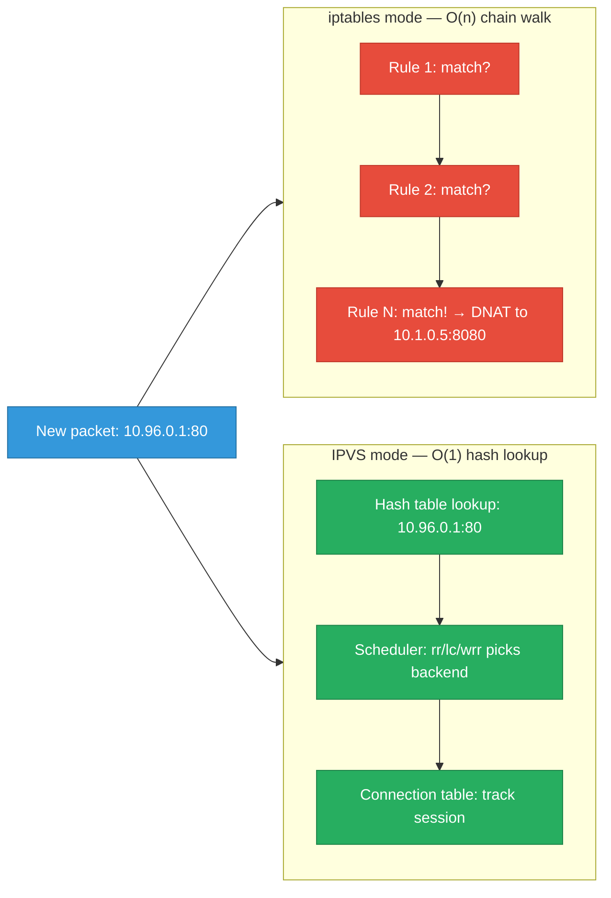
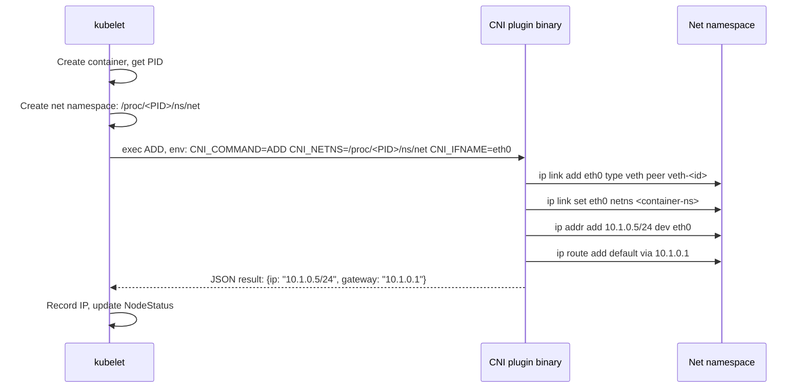
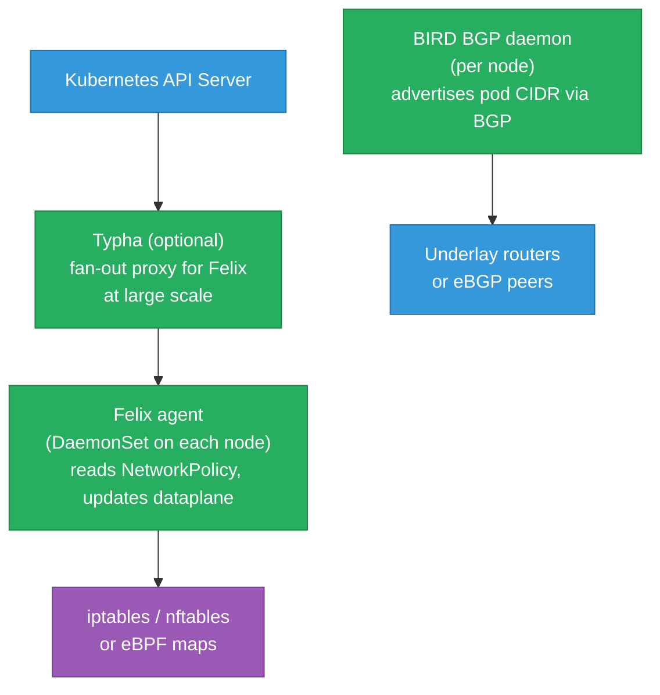

# IPVS, kube-proxy Internals, and CNI Deep Dive

Why kube-proxy switched from iptables to IPVS at scale, how the CNI specification works
at the syscall level, and what Calico and Cilium actually do when they enforce a
NetworkPolicy. The complement to [overlay-networks.md](./overlay-networks.md) (encapsulation)
and [kubernetes/networking.md](../kubernetes/networking.md) (cluster-level topology) — this
file covers the data-plane mechanisms.

<div class="quiz-progress" data-quiz-progress>
  <span class="quiz-progress-label">0/0 checks</span>
  <span class="quiz-progress-bar"><span class="quiz-progress-fill"></span></span>
</div>

---

## 1. IPVS vs iptables — The Scale Problem

kube-proxy translates Kubernetes `Service` objects into in-kernel packet rewriting rules.
Two backends: iptables and IPVS (IP Virtual Server). The difference is fundamental.

**iptables** stores rules in linear chains. Matching a packet against a rule requires traversing
the chain from the top. For a cluster with 5000 services × 3 ports = 15,000 rules, every
packet must traverse up to 15,000 rule checks before finding a match:

```
PREROUTING chain → KUBE-SERVICES chain → KUBE-SVC-XXXXXX chains → KUBE-SEP-XXXXXX rules
```

Adding one new service requires touching every relevant chain. Rule update latency grows
O(n) with the number of services. At 5000+ services, `iptables-save` takes seconds; a rolling
update that adds/removes rules causes transient drops as chains are rebuilt atomically.

**IPVS** uses a hash table for O(1) virtual-service lookup plus a separate connection tracking
table for established sessions. The scheduler (which backend to pick) runs once per new
connection, not per packet.



**IPVS scheduling algorithms** (set per Service via `service.spec.sessionAffinityConfig`
or via kube-proxy config):

| Algorithm | Short name | When to use |
|---|---|---|
| Round-robin | `rr` | Default; equal-weight backends |
| Least connection | `lc` | Long-lived connections; sends to backend with fewest open sessions |
| Weighted round-robin | `wrr` | Heterogeneous backends with explicit weights |
| Source hash | `sh` | Client affinity — same client IP → same backend |
| Destination hash | `dh` | Proxy scenarios where destination matters |

```bash
# Inspect IPVS virtual services and backends
ipvsadm -Ln
# IP Virtual Server version 1.2.1 (size=4096)
# Prot LocalAddress:Port Scheduler Flags
#   -> RemoteAddress:Port           Forward Weight ActiveConn InActConn
# TCP  10.96.0.1:443 rr
#   -> 10.0.0.5:6443               Masq    1      12         0
# TCP  10.100.200.10:80 rr
#   -> 10.1.0.5:8080               Masq    1      0          3
#   -> 10.1.0.6:8080               Masq    1      0          1

# Count virtual services
ipvsadm -Ln | grep -c "^TCP\|^UDP"

# Watch in real time
watch -n1 ipvsadm -Ln --stats
```

**Enabling IPVS mode in kube-proxy:**

```yaml
# ConfigMap kube-proxy in kube-system
apiVersion: v1
kind: ConfigMap
metadata:
  name: kube-proxy
  namespace: kube-system
data:
  config.conf: |
    apiVersion: kubeproxy.config.k8s.io/v1alpha1
    kind: KubeProxyConfiguration
    mode: "ipvs"
    ipvs:
      scheduler: "lc"
```

IPVS mode still uses iptables for SNAT masquerading and packet marking — it doesn't eliminate
iptables entirely, but reduces the rule count from O(services × endpoints) to a small constant
set of masquerade/mark rules.

<div class="quiz-card">
  <p class="quiz-q">A cluster has 10,000 services. In iptables mode, kube-proxy takes 8 seconds to apply a rule update when a service is modified. In IPVS mode, the same update takes 50ms. What accounts for the 160× difference?</p>
  <button class="quiz-reveal">Reveal answer</button>
  <div class="quiz-a" hidden>iptables rule updates are not incremental — kube-proxy must dump all current rules, generate the new full ruleset, and atomically reload it. With 10,000 services generating tens of thousands of rules, this dump-and-reload cycle takes seconds, during which no new connections can be accepted (the chain is locked during update). IPVS updates are O(1) hash table insertions/deletions — adding or removing one virtual service or endpoint is a single hash table operation regardless of total service count, completing in microseconds.</div>
</div>

---

## 2. kube-proxy Modes Compared

| Mode | Backend | Rule complexity | Update latency | Requirement |
|---|---|---|---|---|
| `iptables` | netfilter chains | O(services × endpoints) | O(n) seconds at scale | Default; works everywhere |
| `ipvs` | kernel IPVS + conntrack | O(1) hash table | O(1) ms | `ipvs` kernel modules; `ipset` tool |
| `nftables` | nftables sets | O(1) set lookup | O(1) ms | K8s 1.31+; nftables-capable kernel |
| eBPF (Cilium) | eBPF maps | O(1) map lookup | O(1) ms | Replaces kube-proxy entirely |

**Cilium as kube-proxy replacement:**

```bash
# Install Cilium without kube-proxy
helm install cilium cilium/cilium \
  --set kubeProxyReplacement=true \
  --set k8sServiceHost=<api-server-ip> \
  --set k8sServicePort=6443

# Verify
kubectl -n kube-system exec ds/cilium -- cilium status | grep "KubeProxy"
# KubeProxy replacement:   True
```

When Cilium replaces kube-proxy, Service IP → backend mapping lives in eBPF maps. The eBPF
program at the socket level (TC or XDP hook) rewrites the destination before the packet even
enters the kernel network stack — this achieves the lowest possible latency and eliminates
connection tracking overhead for most traffic.

---

## 3. CNI Specification — What a Plugin Must Do

The CNI (Container Network Interface) spec defines a simple contract: kubelet calls a CNI
plugin as an executable (or via gRPC), passing a JSON config and environment variables, and
the plugin sets up or tears down the container's network.

**Three CNI operations:**

```
ADD   — container is being created; set up its network
DEL   — container is being deleted; tear down its network
CHECK — verify that the container's network is still correctly configured
```

**How kubelet invokes CNI:**



**CNI config** (`/etc/cni/net.d/10-flannel.conflist`):

```json
{
  "name": "cbr0",
  "cniVersion": "0.3.1",
  "plugins": [
    {
      "type": "flannel",
      "delegate": {
        "hairpinMode": true,
        "isDefaultGateway": true
      }
    },
    {
      "type": "portmap",
      "capabilities": {
        "portMappings": true
      }
    }
  ]
}
```

CNI plugins are chained — flannel sets up the main interface, then `portmap` handles
`hostPort` mappings (via iptables DNAT rules on the host).

```bash
# Manually invoke CNI (debugging)
CNI_COMMAND=ADD \
CNI_CONTAINERID=test \
CNI_NETNS=/run/netns/test \
CNI_IFNAME=eth0 \
CNI_PATH=/opt/cni/bin \
/opt/cni/bin/bridge < /etc/cni/net.d/10-bridge.conf
```

---

## 4. Calico Data Plane

Calico's architecture separates policy calculation from data-plane enforcement:



**Felix** is the per-node agent that:
1. Watches the K8s API for NetworkPolicy, Pod, and Endpoint changes
2. Computes which iptables rules (or eBPF programs) implement those policies
3. Programs the local kernel data plane atomically

**How a NetworkPolicy becomes iptables rules:**

```yaml
# Policy: allow ingress to pod with label app=api from pods with label role=frontend on port 8080
apiVersion: networking.k8s.io/v1
kind: NetworkPolicy
metadata:
  name: allow-frontend-to-api
spec:
  podSelector:
    matchLabels:
      app: api
  ingress:
  - from:
    - podSelector:
        matchLabels:
          role: frontend
    ports:
    - protocol: TCP
      port: 8080
```

Felix translates this into iptables chains. For each endpoint (pod), it creates:

```
# cali-tw-<if> chain (traffic going TO the workload)
-A cali-tw-calid3e4a19c6a3 -m comment --comment "Policy allow-frontend-to-api ingress"
  -m set --match-set cali40s:... src          # src in frontend pod IP set
  -p tcp --dport 8080 -j ACCEPT
-A cali-tw-calid3e4a19c6a3 -j DROP            # default deny
```

**Calico eBPF mode** (replaces iptables):

```bash
calicoctl patch felixconfiguration default \
  --patch='{"spec":{"bpfEnabled":true}}'

# In eBPF mode, Felix programs eBPF maps instead of iptables rules
# Policy enforcement happens at TC (traffic control) hook level
# kube-proxy is replaced by Calico's own eBPF-based service implementation
```

---

## 5. Cilium Data Plane

Cilium replaces both kube-proxy and the conventional iptables-based NetworkPolicy enforcement
with eBPF programs. Identity is based on labels, not IP addresses.

**Endpoint identity model:** Each pod gets a numeric identity (e.g., `12345`) derived from its
label set. Policy rules reference identities, not IPs — so when a pod restarts with a new IP,
the identity (and therefore policy enforcement) stays consistent without updating any rules.

```bash
# List all endpoints and their identity
kubectl -n kube-system exec ds/cilium -- cilium endpoint list
# ENDPOINT   POLICY        IDENTITY   LABELS
# 1234       Enabled       12345      k8s:app=api, k8s:namespace=default
# 5678       Enabled       67890      k8s:role=frontend, k8s:namespace=default

# Show policy for endpoint 1234
kubectl -n kube-system exec ds/cilium -- cilium endpoint get 1234 | jq '.status.policy'
```

**How Cilium enforces NetworkPolicy:**

eBPF programs attached at the TC (Traffic Control) hook on each endpoint's veth interface
check policy maps before forwarding. No iptables rules are involved:

```
Pod eth0 → veth (TC hook: check policy map) → host routing → destination pod
```

For inter-node traffic in VXLAN mode:
```
Pod → TC hook (egress) → VXLAN encap → underlay → VXLAN decap → TC hook (ingress) → Pod
```

**Hubble** — Cilium's observability layer:

```bash
# Install Hubble
helm upgrade cilium cilium/cilium \
  --set hubble.relay.enabled=true \
  --set hubble.ui.enabled=true

# Observe traffic flows in real time
kubectl -n kube-system exec ds/cilium -- hubble observe \
  --namespace default \
  --protocol tcp \
  --type l7

# Output:
# Jan 1 12:00:00.000: default/frontend → default/api:8080 (TCP Flags: SYN)
# Jan 1 12:00:00.001: default/api:8080 → default/frontend (TCP Flags: SYN, ACK)
```

---

## 6. NetworkPolicy Enforcement Walkthrough

**Scenario:** Deny all ingress to the `api` pod except from `frontend` pods on port 8080.

```yaml
# Step 1: default-deny all ingress
apiVersion: networking.k8s.io/v1
kind: NetworkPolicy
metadata:
  name: default-deny-ingress
spec:
  podSelector: {}        # matches all pods in namespace
  policyTypes:
  - Ingress
---
# Step 2: allow frontend → api on 8080
apiVersion: networking.k8s.io/v1
kind: NetworkPolicy
metadata:
  name: allow-frontend
spec:
  podSelector:
    matchLabels:
      app: api
  ingress:
  - from:
    - podSelector:
        matchLabels:
          role: frontend
    ports:
    - protocol: TCP
      port: 8080
```

**Verify with Cilium:**

```bash
# Check connectivity (Cilium connectivity test)
kubectl -n kube-system exec ds/cilium -- cilium policy trace \
  --src-k8s-pod default/frontend-xxx \
  --dst-k8s-pod default/api-yyy \
  --dport 8080 --protocol tcp
# verdict: allowed

kubectl -n kube-system exec ds/cilium -- cilium policy trace \
  --src-k8s-pod default/other-pod-xxx \
  --dst-k8s-pod default/api-yyy \
  --dport 8080 --protocol tcp
# verdict: denied
```

---

## 7. Debugging CNI Issues

**Pod stuck in `ContainerCreating`:**

```bash
# Event shows: failed to set up network for pod "...: network: plugin type="flannel" failed
kubectl describe pod <pod>

# Check CNI plugin logs
journalctl -u kubelet | grep -i cni | tail -50

# Verify CNI binaries exist
ls /opt/cni/bin/
ls /etc/cni/net.d/

# Check if the plugin can run (manually invoke ADD)
CNI_COMMAND=VERSION /opt/cni/bin/flannel
```

**Pod IP exhaustion (AWS VPC CNI):**

```bash
# AWS VPC CNI allocates IPs from ENI secondary IPs
# Exhausted: "failed to allocate IP: no available IP"
kubectl -n kube-system logs ds/aws-node | grep -i "ip\|eni"

# Increase IPs: enable prefix delegation (assigns /28 CIDR per ENI slot instead of 1 IP)
kubectl set env ds aws-node -n kube-system ENABLE_PREFIX_DELEGATION=true
```

**Network namespace inspection for a running pod:**

```bash
# Get container runtime PID
crictl inspect <container-id> | jq .info.pid

# Enter the pod's network namespace
nsenter --target <pid> --net -- ip addr
nsenter --target <pid> --net -- ss -tlnp
nsenter --target <pid> --net -- ip route

# Capture traffic in the pod's namespace without tcpdump inside the pod
nsenter --target <pid> --net -- tcpdump -i eth0 -nn
```

**IPVS debugging:**

```bash
# Is IPVS mode actually active?
kubectl -n kube-system get configmap kube-proxy -o yaml | grep mode

# Virtual services and backends
ipvsadm -Ln

# Connection table for a specific VIP
ipvsadm -Ln --stats | grep "10.96.0.1"

# Check if kube-proxy is actually managing IPVS
kubectl -n kube-system logs kube-proxy-<id> | grep -i ipvs
```

---

## Quick Reference

```
IPVS virtual services               ipvsadm -Ln
IPVS stats                          ipvsadm -Ln --stats
kube-proxy mode                     kubectl -n kube-system get cm kube-proxy -o yaml | grep mode
Cilium status                        kubectl -n kube-system exec ds/cilium -- cilium status
Cilium endpoint list                 kubectl -n kube-system exec ds/cilium -- cilium endpoint list
Cilium policy trace                  kubectl -n kube-system exec ds/cilium -- cilium policy trace ...
Hubble flows                         kubectl -n kube-system exec ds/cilium -- hubble observe
CNI binaries                         ls /opt/cni/bin/
CNI config                           ls /etc/cni/net.d/
Pod network namespace (crictl PID)   crictl inspect <id> | jq .info.pid
Enter pod net namespace              nsenter --target <pid> --net -- ip addr
Capture pod traffic (no tcpdump)     nsenter --target <pid> --net -- tcpdump -i eth0 -nn
IPVS mode in kube-proxy config       mode: "ipvs" in kube-proxy ConfigMap
Calico eBPF mode                     calicoctl patch felixconfiguration default --patch='{"spec":{"bpfEnabled":true}}'
Cilium kube-proxy replacement        --set kubeProxyReplacement=true in helm install
```
