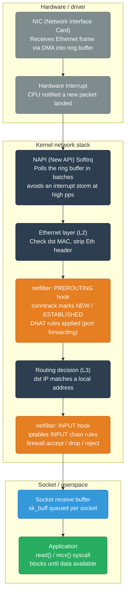
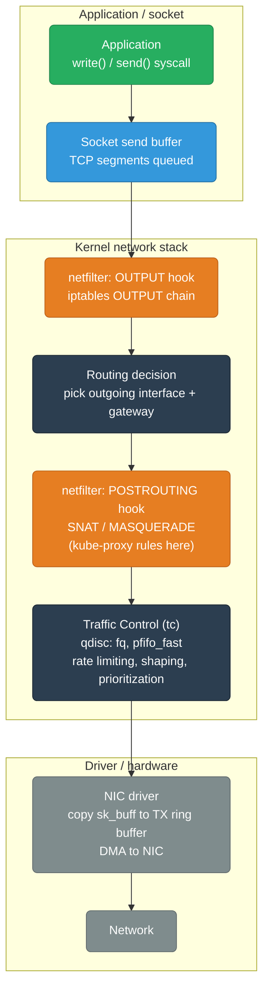
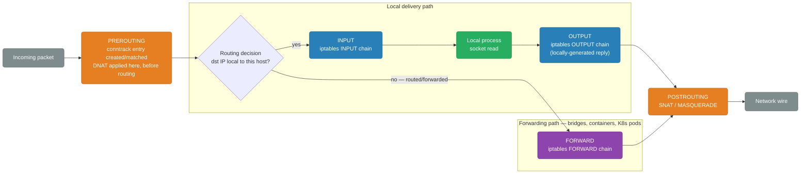
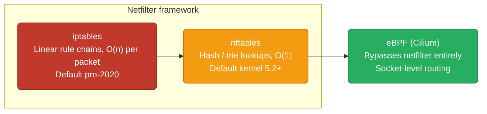
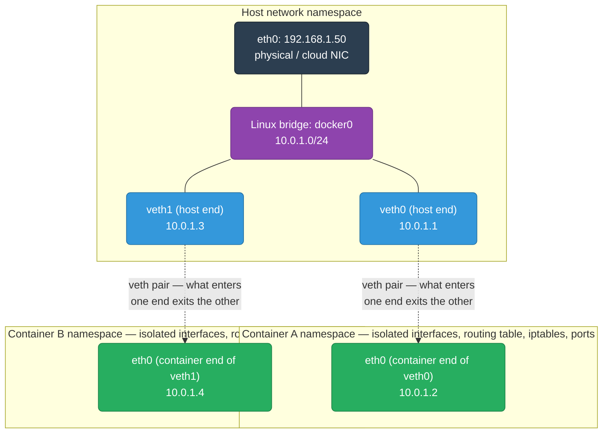
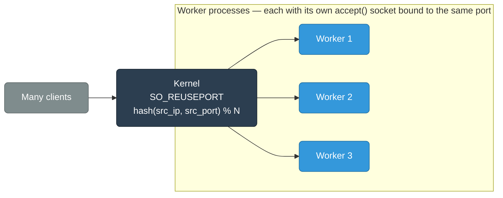

# Linux Networking Internals

How Linux handles network traffic — from NIC to application. Understanding this is essential for diagnosing performance issues, configuring firewalls, and running high-throughput services.

> For kernel TCP stack details (sockets, accept queue, TIME_WAIT, netfilter, TCP tuning), see also [`linux/networking.md`](../linux/networking.md).

<div class="quiz-progress" data-quiz-progress>
  <span class="quiz-progress-label">0/0 checks</span>
  <span class="quiz-progress-bar"><span class="quiz-progress-fill"></span></span>
</div>

---

## Linux Network Stack — Packet RX Path



**DMA (Direct Memory Access):** NIC writes packets directly to kernel memory without CPU involvement. CPU is interrupted only after a batch is written — not per-packet.

**sk_buff:** The kernel's packet representation. A single struct that travels through every layer, adding/removing headers without copying data (pointer manipulation only).

<div class="quiz-card">
  <p class="quiz-q">Under a high packets-per-second flood, does the CPU take one hardware interrupt per incoming packet?</p>
  <button class="quiz-reveal">Reveal answer</button>
  <div class="quiz-a" hidden>No. Only enough interrupts fire to kick NAPI into polling mode — once triggered, NAPI drains the ring buffer in batches instead of interrupting per packet. That batching is exactly what avoids an interrupt storm at high pps.</div>
</div>

---

## Packet TX Path (Sending)



<div class="quiz-card">
  <p class="quiz-q">In the TX path, does traffic control (tc) shaping run before or after POSTROUTING's SNAT/MASQUERADE?</p>
  <button class="quiz-reveal">Reveal answer</button>
  <div class="quiz-a" hidden>After. The order is OUTPUT hook → routing decision → POSTROUTING (SNAT/MASQUERADE) → qdisc (tc) → NIC driver. By the time tc's fq/pfifo_fast queues and shapes a packet, its source address has already been rewritten — tc operates on the packet as it will actually appear on the wire.</div>
</div>

---

## netfilter Hook Points



**Five hooks — what each is used for:**

| Hook | Used for |
|------|---------|
| `PREROUTING` | DNAT (port forwarding, kube-proxy ClusterIP), conntrack entry creation |
| `INPUT` | Firewall rules for traffic destined for this host |
| `FORWARD` | Firewall rules for routed/forwarded traffic (bridges, containers, K8s pods) |
| `OUTPUT` | Rules for locally-generated traffic |
| `POSTROUTING` | SNAT/MASQUERADE (NAT outbound traffic, kube-proxy pod IP → node IP) |

<div class="stepper">
  <div class="stepper-panels">
    <div class="stepper-panel active">
      <strong>1. PREROUTING.</strong> Every packet hits this hook first, before any routing decision is made. conntrack creates or matches a connection-tracking entry here, and DNAT (port forwarding, kube-proxy ClusterIP rewriting) is applied at this stage — so the routing decision that follows sees the <em>already-rewritten</em> destination.
    </div>
    <div class="stepper-panel">
      <strong>2. Routing decision.</strong> The kernel checks whether the (possibly DNAT-rewritten) destination IP belongs to this host. That single check is what splits every packet onto one of two very different paths.
    </div>
    <div class="stepper-panel">
      <strong>3a. Local delivery — INPUT.</strong> If the destination is local, the INPUT chain runs firewall rules for traffic destined for this host, then hands the packet to the local process's socket.
    </div>
    <div class="stepper-panel">
      <strong>3b. Forwarded — FORWARD.</strong> If the destination isn't local, INPUT and the local socket are skipped entirely — the FORWARD chain runs instead. This is the chain that matters for bridges, containers, and Kubernetes pod-to-pod traffic.
    </div>
    <div class="stepper-panel">
      <strong>4. OUTPUT (for replies).</strong> When the local process on the INPUT path writes a reply, that new packet enters the OUTPUT chain — rules for locally-generated traffic — before it can leave.
    </div>
    <div class="stepper-panel">
      <strong>5. POSTROUTING.</strong> Both the FORWARD path and the OUTPUT path converge here. SNAT/MASQUERADE is applied — this is also where kube-proxy rewrites a pod's source IP to the node's IP for traffic leaving the node — right before the packet hits the wire.
    </div>
  </div>
  <div class="stepper-controls">
    <button class="stepper-prev">← Prev</button>
    <span class="stepper-dots"></span>
    <span class="stepper-label"></span>
    <button class="stepper-next">Next →</button>
  </div>
</div>

<div class="quiz-card">
  <p class="quiz-q">A packet arrives at a host destined for a container's IP behind a bridge, not for the host itself. Which chain evaluates firewall rules for it — INPUT or FORWARD?</p>
  <button class="quiz-reveal">Reveal answer</button>
  <div class="quiz-a" hidden>FORWARD. The routing decision sees that the destination isn't local to the host, so the packet is routed rather than delivered — it never reaches INPUT or a local socket at all. This is exactly why firewall rules aimed at container/bridge/K8s pod traffic belong in the FORWARD chain, not INPUT.</div>
</div>

---

## conntrack — Connection Tracking

conntrack maintains a state table for every connection. Stateful firewalls use this — "allow ESTABLISHED,RELATED" means reply packets are auto-allowed.

```bash
# View connection tracking table
cat /proc/net/nf_conntrack
# or
conntrack -L

# Example entry:
# ipv4 2 tcp 6 431999 ESTABLISHED \
#   src=10.0.1.5 dst=142.250.182.46 sport=52413 dport=443 \
#   src=142.250.182.46 dst=10.0.1.5 sport=443 dport=52413 \
#   [ASSURED] mark=0 zone=0

# conntrack table limits
sysctl net.netfilter.nf_conntrack_max          # default 131072
sysctl net.netfilter.nf_conntrack_count        # current entries

# Alert: if count approaches max, new connections get DROPPED silently
# This causes the infamous 5-second DNS timeout (UDP DNS hits full conntrack table)
```

**conntrack states:**
- `NEW` — first packet, no response seen
- `ESTABLISHED` — both directions seen
- `RELATED` — related to existing connection (FTP data connection, ICMP errors)
- `INVALID` — doesn't match any known connection

<div class="toggle-switch">
  <div class="toggle-buttons">
    <button data-toggle-opt="new" class="active">NEW</button>
    <button data-toggle-opt="established" class="state-ok">ESTABLISHED</button>
    <button data-toggle-opt="related">RELATED</button>
    <button data-toggle-opt="invalid" class="state-bad">INVALID</button>
  </div>
  <div class="toggle-panel active" data-toggle-panel="new">
    First packet of a connection — no reply has been seen yet. conntrack allocates a table entry here, which is exactly what can push a busy host toward <code>net.netfilter.nf_conntrack_max</code>.
  </div>
  <div class="toggle-panel" data-toggle-panel="established">
    Both directions have been seen. A stateful firewall rule like "allow ESTABLISHED,RELATED" trusts this state to auto-allow reply traffic without a matching explicit rule.
  </div>
  <div class="toggle-panel" data-toggle-panel="related">
    Not part of the connection itself, but tied to one conntrack already knows about — an FTP data connection spawned from a control connection, or an ICMP error responding to an existing flow.
  </div>
  <div class="toggle-panel" data-toggle-panel="invalid">
    Doesn't match any tracked connection at all. Typically the first thing a stateful firewall drops, since it can't be vouched for by an existing NEW/ESTABLISHED/RELATED entry.
  </div>
</div>

<div class="quiz-card">
  <p class="quiz-q">The conntrack table is at its max (nf_conntrack_count ≈ nf_conntrack_max). A new connection tries to open. Does it get an explicit rejection, or fail silently?</p>
  <button class="quiz-reveal">Reveal answer</button>
  <div class="quiz-a" hidden>Silently. New connections get dropped without any explicit rejection once the table is full — no RST, no ICMP unreachable, just no entry created. That silent failure mode is exactly what produces the infamous 5-second DNS timeout: the UDP query itself gets dropped and the client has nothing to react to except its own retry timer.</div>
</div>

---

## iptables vs nftables vs eBPF



**K8s and iptables scale problem:** kube-proxy writes one iptables rule per Service endpoint. At 10,000 Services × 10 pods = 100,000 rules — every packet evaluated linearly → high CPU.

**Switch to IPVS or Cilium** at scale (see `kubernetes/kube-proxy-modes.md`).

<div class="tab-group">
  <div class="tab-buttons">
    <button data-tab="iptables" class="active">iptables</button>
    <button data-tab="nftables">nftables</button>
    <button data-tab="ebpf">eBPF (Cilium)</button>
  </div>
  <div class="tab-panels">
    <div class="tab-panel active" data-tab-panel="iptables">
      Rules are linear chains evaluated top to bottom — O(n) per packet. Was the default pre-2020. At Kubernetes scale (one rule per Service endpoint), 100,000 rules means every packet pays for a long linear scan, which is exactly what drives CPU up.
    </div>
    <div class="tab-panel" data-tab-panel="nftables">
      Same netfilter framework underneath, but rules are organized into hash/trie-backed sets instead of a flat linear chain — O(1) lookups. Default since kernel 5.2+, and the direct fix for iptables' scaling problem without leaving netfilter altogether.
    </div>
    <div class="tab-panel" data-tab-panel="ebpf">
      Skips netfilter entirely — routing decisions happen at the socket level via eBPF programs (what Cilium uses). No chain of rules to walk per packet at all, which is why it scales past where even nftables starts to strain.
    </div>
  </div>
</div>

<div class="quiz-card">
  <p class="quiz-q">kube-proxy in iptables mode writes one rule per Service endpoint. At 10,000 Services × 10 pods (100,000 rules), what specifically becomes the bottleneck?</p>
  <button class="quiz-reveal">Reveal answer</button>
  <div class="quiz-a" hidden>Per-packet CPU cost, not memory. iptables evaluates rules as a linear chain — O(n) — so every single packet pays for walking toward its matching rule. More Services means more rules means more CPU spent per packet, which is why the fix is switching lookup strategy (nftables' O(1) hash/trie) or bypassing the chain entirely (eBPF/Cilium), not just adding RAM.</div>
</div>

---

## Network Namespaces (Containers)

Every container gets its own network namespace — isolated network stack including interfaces, routing table, iptables rules, and port space.



```bash
# List network namespaces
ip netns list

# Inspect a container's network namespace
PID=$(docker inspect --format '{{.State.Pid}}' my-container)
nsenter --net=/proc/$PID/ns/net ip addr     # see container's interfaces
nsenter --net=/proc/$PID/ns/net ss -tlnp    # see container's listening sockets

# Manually create a network namespace (for learning)
ip netns add test-ns
ip netns exec test-ns ip addr show
```

<div class="quiz-card">
  <p class="quiz-q">Two containers share the same host kernel. Do they also share the host's routing table and iptables rules by default?</p>
  <button class="quiz-reveal">Reveal answer</button>
  <div class="quiz-a" hidden>No. Each container gets its own network namespace, which is a fully isolated network stack — its own interfaces, routing table, iptables rules, and port space — even though the underlying kernel is shared. That's what lets two containers each bind port 8080 without conflicting.</div>
</div>

---

## Virtual Ethernet Pairs (veth)

A `veth` pair is two connected virtual interfaces — what goes in one end comes out the other. Used to connect a container's namespace to the host bridge.

```bash
# Create a veth pair
ip link add veth0 type veth peer name veth1

# Move veth1 into a network namespace
ip link set veth1 netns my-container

# Assign IPs
ip addr add 10.0.0.1/24 dev veth0
ip netns exec my-container ip addr add 10.0.0.2/24 dev veth1

# Bring both up
ip link set veth0 up
ip netns exec my-container ip link set veth1 up

# Now 10.0.0.1 <--> 10.0.0.2 are connected
```

<div class="stepper">
  <div class="stepper-panels">
    <div class="stepper-panel active">
      <strong>1. Create the pair.</strong> <code>ip link add veth0 type veth peer name veth1</code> creates both ends at once, still sitting together in the host's (current) network namespace.
    </div>
    <div class="stepper-panel">
      <strong>2. Move one end into the container.</strong> <code>ip link set veth1 netns my-container</code> moves only <code>veth1</code> into the target namespace — <code>veth0</code> stays behind on the host.
    </div>
    <div class="stepper-panel">
      <strong>3. Assign IPs on both ends.</strong> The host end (<code>veth0</code>) gets an address in the host namespace; the container end (<code>veth1</code>) gets an address inside the container's namespace via <code>ip netns exec</code>.
    </div>
    <div class="stepper-panel">
      <strong>4. Bring both ends up.</strong> A veth end is useless administratively down. Once both sides are up, <code>10.0.0.1 &lt;--&gt; 10.0.0.2</code> are connected — whatever goes in one end comes out the other.
    </div>
  </div>
  <div class="stepper-controls">
    <button class="stepper-prev">← Prev</button>
    <span class="stepper-dots"></span>
    <span class="stepper-label"></span>
    <button class="stepper-next">Next →</button>
  </div>
</div>

<div class="quiz-card">
  <p class="quiz-q">If you send a packet into veth0 of a veth pair, does it get routed through a switch or bridge to reach veth1?</p>
  <button class="quiz-reveal">Reveal answer</button>
  <div class="quiz-a" hidden>No — a veth pair is a direct pipe. Whatever goes in one end comes out the other with nothing in between; no bridge, switch, or routing decision is involved unless you deliberately plug one end into one (like docker0). That point-to-point property is exactly what makes it the primitive used to wire a container's namespace to the host.</div>
</div>

The two topologies you'll see in practice are a direct pair (what the commands above just built) and a pair plugged into a bridge (what the Network Namespaces diagram above shows for multi-container hosts):

<div class="tab-group">
  <div class="tab-buttons">
    <button data-tab="direct" class="active">Direct veth pair</button>
    <button data-tab="bridged">veth pair via bridge (docker0)</button>
  </div>
  <div class="tab-panels">
    <div class="tab-panel active" data-tab-panel="direct">
      Exactly two ends, connected point-to-point — nothing else attached. Good for a single container/VM with one dedicated link to the host, or two namespaces that only need to talk to each other. This is what the <code>ip link add ... type veth peer</code> walkthrough above builds.
    </div>
    <div class="tab-panel" data-tab-panel="bridged">
      Each container gets its own veth pair, but the host-side end of every pair plugs into a shared Linux bridge (<code>docker0</code>) instead of standing alone. The bridge switches frames between every attached veth end and the host's physical interface — like a real Ethernet switch — which is what lets container A reach container B without either side hardcoding a route to the other.
    </div>
  </div>
</div>

---

## SO_REUSEPORT — High-Throughput Accept

By default, one process calls `accept()` on one socket — a single-threaded bottleneck. `SO_REUSEPORT` lets multiple processes/goroutines each bind the same port. The kernel load-balances incoming connections across all of them.



<div class="quiz-card">
  <p class="quiz-q">With SO_REUSEPORT, does the kernel round-robin new connections evenly across workers, or route each one deterministically by connection tuple?</p>
  <button class="quiz-reveal">Reveal answer</button>
  <div class="quiz-a" hidden>By hashing the connection tuple — hash(src_ip, src_port) % N — not round-robin. A given client's connection consistently maps to the same worker, but distribution across workers depends on how varied the client tuples are, not on the kernel actively balancing load.</div>
</div>

```bash
# Verify SO_REUSEPORT is in use (nginx, Go apps with SO_REUSEPORT)
ss -tlnp | grep :8080
# Multiple PIDs on same port = SO_REUSEPORT in use
```

---

## Key Networking Commands (Linux)

```bash
# Interface info
ip addr show                         # all interfaces and IPs
ip link show eth0                    # interface stats (errors, drops)
ethtool eth0                         # NIC speed, duplex, driver

# Routing
ip route show                        # routing table
ip route get 8.8.8.8                 # which interface/gateway for a specific dst
traceroute -n 8.8.8.8               # hop-by-hop path

# Connections
ss -tlnp                             # TCP listening sockets with PID
ss -tan | grep ESTABLISHED | wc -l   # established TCP count
ss -s                                # socket state summary
netstat -i                           # interface packet/error counts

# Packet capture
tcpdump -i eth0 port 443 -w cap.pcap # capture to file
tcpdump -i eth0 'tcp[tcpflags] & tcp-syn != 0'  # SYN packets only
tcpdump -i eth0 host 8.8.8.8        # traffic to/from specific host

# netfilter
iptables -L -n -v                    # all rules with packet counts
iptables -t nat -L PREROUTING -n -v  # NAT PREROUTING rules (kube-proxy)
conntrack -L | wc -l                 # conntrack table size

# Performance
ethtool -S eth0                      # NIC hardware counters (missed, dropped)
cat /proc/net/softnet_stat           # softirq drops (column 2 = drops)
```

---

## Common Linux Networking Issues

| Symptom | Likely cause | Check |
|---------|-------------|-------|
| Connections timing out silently | conntrack table full | `sysctl net.netfilter.nf_conntrack_count` vs max |
| DNS 5-second delay | conntrack full, UDP DNS dropped | same as above |
| High CPU on softirq | Network interrupt storm | `/proc/net/softnet_stat`, enable RSS/RPS |
| Packet drops at NIC | Ring buffer overflow | `ethtool -S eth0 \| grep drop`, increase ring: `ethtool -G eth0 rx 4096` |
| TCP connection refused | Port not listening / firewall | `ss -tlnp`, `iptables -L INPUT -n` |
| Port exhaustion | TIME_WAIT or ephemeral ports | `ss -s`, `sysctl net.ipv4.ip_local_port_range` |
