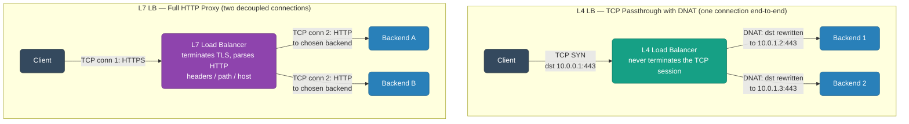
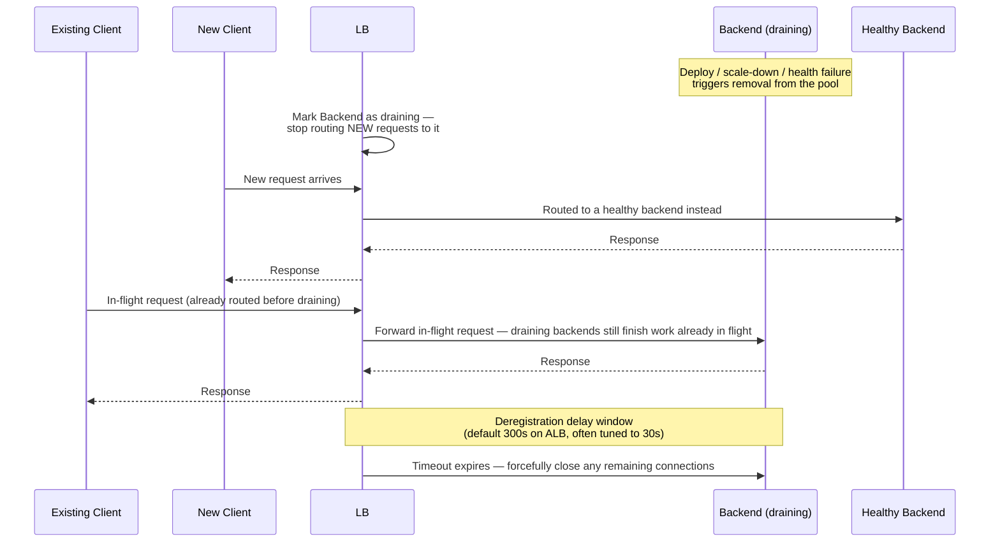
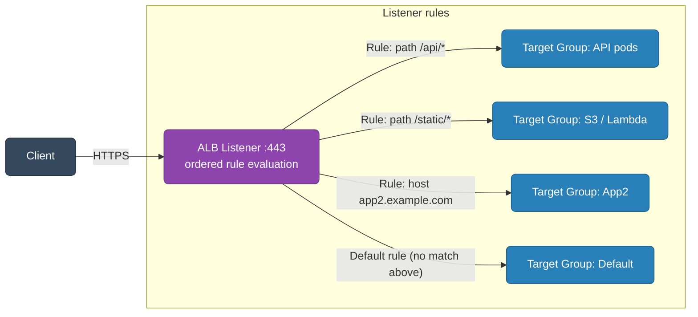
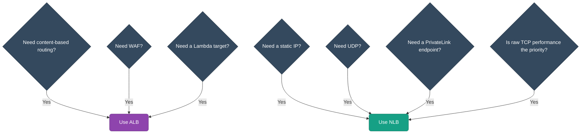
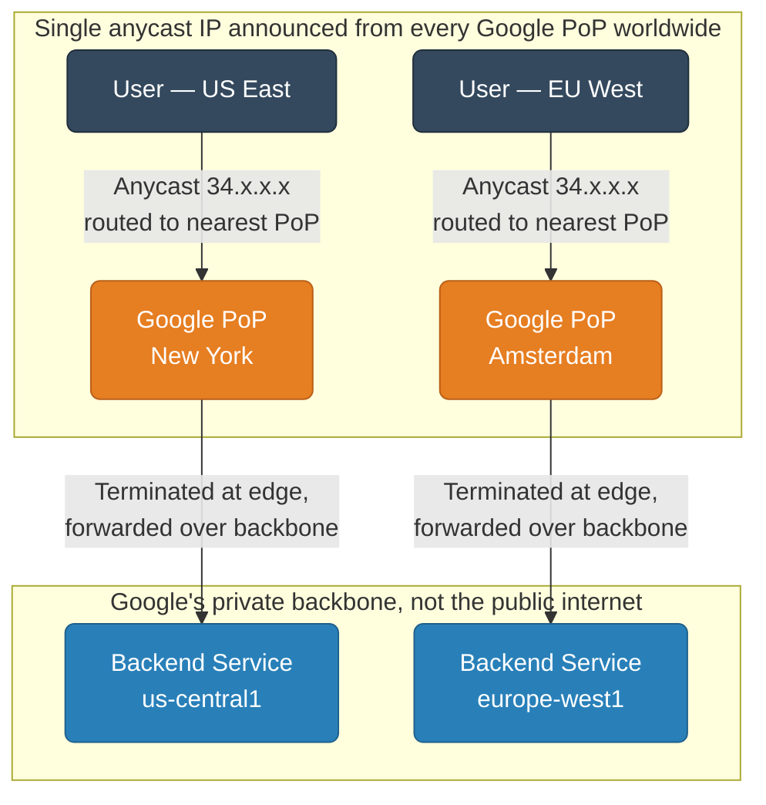

# Load Balancers — Deep Dive

Beginner to advanced reference covering L4/L7, algorithms, health checks, TLS, AWS ALB/NLB, GCP, nginx, HAProxy, and common failure modes.

<div class="quiz-progress" data-quiz-progress>
  <span class="quiz-progress-label">0/0 checks</span>
  <span class="quiz-progress-bar"><span class="quiz-progress-fill"></span></span>
</div>

---

## 1. What a Load Balancer Does

A load balancer sits between clients and backend servers and provides:

- **Traffic distribution** — spread requests across a pool of backends
- **Health checking** — remove unhealthy backends from rotation automatically
- **TLS termination** — decrypt HTTPS at the LB so backends speak plain HTTP
- **Backend topology hiding** — clients see one VIP; backend IPs are never exposed
- **Connection management** — keep persistent upstream pools, draining on deploys

<div class="quiz-card">
  <p class="quiz-q">An autoscaling event replaces half the backend fleet with new IPs. Does anything on the client side need to change?</p>
  <button class="quiz-reveal">Reveal answer</button>
  <div class="quiz-a" hidden>No. That's exactly what "backend topology hiding" buys you — clients only ever see one stable VIP (the load balancer's address); the real backend IPs are never exposed to them and can churn freely underneath. Health checking and connection management are what make that churn safe in practice, but the client-facing address itself never has to move.</div>
</div>

---

## 2. L4 vs L7

| | L4 (Transport Layer) | L7 (Application Layer) |
|---|---|---|
| OSI layer | 4 (TCP/UDP) | 7 (HTTP/gRPC/WebSocket) |
| What it sees | IP, port, TCP flags | HTTP headers, path, host, cookies, body |
| Routing decision | IP:port only | path, host, header, query string |
| Model | NAT / DNAT — rewrites dst IP | Full proxy — two separate TCP connections |
| TLS | Passthrough or offload (opaque) | Terminate and inspect |
| Performance | Ultra-low latency, millions of conns | Higher latency, richer routing |
| State | Stateless (ECMP) or conntrack | Per-request state |
| Use when | Raw TCP, UDP, SMTP, custom protocols | HTTP APIs, WebSocket, gRPC, content routing |

### NAT vs Proxy Model

<div class="tab-group">
  <div class="tab-buttons">
    <button data-tab="natmodel" class="active">L4 NAT/DNAT</button>
    <button data-tab="proxymodel">L7 Proxy</button>
  </div>
  <div class="tab-panels">
    <div class="tab-panel active" data-tab-panel="natmodel">
      <strong>The LB rewrites the destination IP in each packet.</strong> The backend server's reply goes back via the LB (SNAT) or directly to the client (DSR). One TCP connection end-to-end — the LB never terminates it, it just relabels packets in flight.
    </div>
    <div class="tab-panel" data-tab-panel="proxymodel">
      <strong>The LB terminates the client TCP connection, parses HTTP, and opens a <em>new</em> TCP connection to the backend.</strong> Two connections exist simultaneously — client↔LB and LB↔backend — which is what lets the LB inspect and rewrite anything in between.
    </div>
  </div>
</div>

<div class="quiz-card">
  <p class="quiz-q">In the L4 NAT/DNAT model, how many TCP connections exist between the client and the backend? What about L7 proxy?</p>
  <button class="quiz-reveal">Reveal answer</button>
  <div class="quiz-a" hidden>L4 NAT/DNAT: one connection end-to-end — the LB just rewrites the destination (and source, for SNAT) IP in each packet without ever terminating the TCP session. L7 proxy: two separate connections exist simultaneously, client↔LB and LB↔backend, because the LB fully terminates the client's connection, parses HTTP, and opens its own connection to the backend. That's also why L7 can inspect and rewrite headers/paths and L4 can't — it never sees a complete HTTP message, only packets.</div>
</div>

---

## 3. L4 vs L7 — Mermaid Diagram



---

## 4. Load Balancing Algorithms

<div class="tab-group">
  <div class="tab-buttons">
    <button data-tab="rr" class="active">Round Robin</button>
    <button data-tab="wrr">Weighted RR</button>
    <button data-tab="lc">Least Connections</button>
    <button data-tab="lrt">Least Response Time</button>
    <button data-tab="iph">IP Hash</button>
    <button data-tab="rand">Random</button>
    <button data-tab="ch">Consistent Hashing</button>
  </div>
  <div class="tab-panels">
    <div class="tab-panel active" data-tab-panel="rr">
      <strong>Round Robin.</strong> Requests sent to backends in order: 1 → 2 → 3 → 1 → 2 → 3 …
      <br/><strong>Use when:</strong> backends are homogeneous and requests are equal-cost.
    </div>
    <div class="tab-panel" data-tab-panel="wrr">
      <strong>Weighted Round Robin.</strong> Each backend gets a weight. Backend with weight 3 gets 3× the traffic of weight 1.
      <br/><strong>Use when:</strong> backends have different capacity (e.g., mixing instance types).
    </div>
    <div class="tab-panel" data-tab-panel="lc">
      <strong>Least Connections.</strong> New request goes to the backend with the fewest active connections.
      <br/><strong>Use when:</strong> requests have variable duration (e.g., long-running uploads mixed with fast API calls).
    </div>
    <div class="tab-panel" data-tab-panel="lrt">
      <strong>Least Response Time.</strong> Combines least connections + lowest measured latency.
      <br/><strong>Use when:</strong> latency variance across backends matters (heterogeneous hardware, cross-AZ).
    </div>
    <div class="tab-panel" data-tab-panel="iph">
      <strong>IP Hash (Sticky by IP).</strong> Hash of client IP determines the backend. Same client always hits the same backend.
      <br/><strong>Use when:</strong> need session affinity without cookie support. Breaks badly behind NAT (all traffic → one backend).
    </div>
    <div class="tab-panel" data-tab-panel="rand">
      <strong>Random.</strong> Randomly pick a backend per request.
      <br/><strong>Use when:</strong> simple, stateless workloads where you want to avoid round-robin bias from burst patterns. "Power of two choices" (random pick of 2, take least-loaded) is better than pure random.
    </div>
    <div class="tab-panel" data-tab-panel="ch">
      <strong>Consistent Hashing.</strong> Hash the request key (IP, URL, user-id) onto a ring. Backends occupy slots on the ring. Adding/removing a backend only remaps ~1/N of keys.
      <br/><strong>Use when:</strong> caching layers (upstream cache hit rate), gRPC streams that must go to the same pod, Kafka-aware routing.
    </div>
  </div>
</div>

<div class="quiz-card">
  <p class="quiz-q">A service sits behind a corporate NAT gateway, so thousands of employees share one public IP. Why is IP Hash a risky algorithm choice here, and what would "power of two choices" random do instead?</p>
  <button class="quiz-reveal">Reveal answer</button>
  <div class="quiz-a" hidden>IP Hash keys off the client's source IP, and behind NAT every one of those employees looks like the same single IP to the load balancer — so IP Hash sends all of them to one backend instead of spreading load. "Power of two choices" doesn't have this failure mode: it picks two backends at random per request and sends it to whichever is less loaded, so it stays well-balanced regardless of how many distinct client IPs are actually behind the request stream.</div>
</div>

### Try It Yourself: Live Algorithm Routing

The tabs above describe each algorithm in the abstract. This is live: add backends with whatever weights you want, pick an algorithm, and fire requests one at a time (or many, fast). Each backend's corner badge is a running connection count that increments the moment it's routed to. Kill a backend mid-run and watch every algorithm route around it immediately — then revive it and watch it rejoin rotation.

<div class="structure-viz" id="lb-routing-viz">
  <svg class="viz-canvas" viewBox="0 0 502 104"></svg>
  <div class="viz-controls">
    <input class="viz-input" id="lb-weight-input" type="number" min="1" max="10" value="1" placeholder="weight 1-10" />
    <button class="viz-btn" data-viz-action="add">Add backend</button>
    <select class="viz-input" id="lb-algo-select">
      <option value="rr" selected>Round Robin</option>
      <option value="wrr">Weighted Round Robin</option>
      <option value="lc">Least Connections</option>
    </select>
    <button class="viz-btn" data-viz-action="fire">Fire request</button>
    <select class="viz-input" id="lb-target-select"></select>
    <button class="viz-btn viz-btn-danger" data-viz-action="kill">Kill / revive selected</button>
    <button class="viz-btn" data-viz-action="reset">Reset</button>
  </div>
  <div class="viz-status"></div>
  <div class="viz-legend">
    <span><span class="viz-swatch" style="background:#1e3a8a"></span> healthy backend</span>
    <span><span class="viz-swatch" style="background:#78350f"></span> just routed</span>
    <span><span class="viz-swatch" style="background:#7f1d1d"></span> killed / down</span>
    <span><span class="viz-swatch" style="background:#1e293b"></span> connection-count badge</span>
  </div>
</div>

<script>
(function () {
  const svgNS = 'http://www.w3.org/2000/svg';
  const root = document.getElementById('lb-routing-viz');
  const svg = root.querySelector('.viz-canvas');
  const status = root.querySelector('.viz-status');
  const weightInput = root.querySelector('#lb-weight-input');
  const algoSelect = root.querySelector('#lb-algo-select');
  const targetSelect = root.querySelector('#lb-target-select');
  const addBtn = root.querySelector('[data-viz-action="add"]');
  const fireBtn = root.querySelector('[data-viz-action="fire"]');
  const killBtn = root.querySelector('[data-viz-action="kill"]');
  const resetBtn = root.querySelector('[data-viz-action="reset"]');

  // ---- Pure routing-decision logic (no DOM) ----
  // Given the algorithm, the current backend list (weights/health/conn
  // counts), and persistent per-algorithm routing state, returns which
  // backend id receives the next request. A killed backend (healthy:
  // false) is filtered out before any algorithm's own logic runs, so
  // "never route to a dead backend" holds structurally for every branch.
  function pickBackend(backends, algorithm, routingState) {
    const healthy = backends.filter((b) => b.healthy);
    if (healthy.length === 0) {
      return { id: null, routingState: routingState };
    }
    if (algorithm === 'lc') {
      let best = null;
      for (const b of backends) {
        if (!b.healthy) continue;
        if (best === null || b.conns < best.conns) best = b;
      }
      return { id: best.id, routingState: routingState };
    }
    if (algorithm === 'rr') {
      const n = backends.length;
      const pointer = routingState.rrPointer;
      for (let i = 1; i <= n; i++) {
        const idx = (pointer + i) % n;
        if (backends[idx].healthy) {
          return { id: backends[idx].id, routingState: Object.assign({}, routingState, { rrPointer: idx }) };
        }
      }
      return { id: null, routingState: routingState };
    }
    if (algorithm === 'wrr') {
      // Smooth weighted round robin (same scheme nginx uses): every
      // healthy backend's "current weight" accumulates by its configured
      // weight each round; whoever has the highest current weight wins
      // and then gets docked the total healthy weight. This converges to
      // exact weight proportions without ever bursting one backend.
      const cw = Object.assign({}, routingState.wrrCw);
      for (const b of backends) if (!(b.id in cw)) cw[b.id] = 0;
      let total = 0;
      let best = null;
      for (const b of backends) {
        if (!b.healthy) continue;
        total += b.weight;
        cw[b.id] += b.weight;
        if (best === null || cw[b.id] > cw[best.id]) best = b;
      }
      if (best) cw[best.id] -= total;
      return { id: best ? best.id : null, routingState: Object.assign({}, routingState, { wrrCw: cw }) };
    }
    return { id: null, routingState: routingState };
  }

  // ---- Pure layout math (no DOM) ----
  // Fixed-column grid (max 4/row) that WRAPS to new rows as backends are
  // added, instead of growing the canvas wider without bound. Only the
  // viewBox HEIGHT grows as rows are added; width is capped, so adding
  // 10-15+ backends never overflows or overlaps.
  function computeLayout(backends) {
    const n = backends.length;
    const COLS = Math.max(1, Math.min(4, n || 1));
    const nodeW = 130, nodeH = 56, gapX = 34, gapY = 42, marginX = 22, marginTop = 30, marginBottom = 18;
    const rows = Math.max(1, Math.ceil(n / COLS));
    const width = marginX * 2 + COLS * nodeW + (COLS - 1) * gapX;
    const height = marginTop + rows * nodeH + (rows - 1) * gapY + marginBottom;
    const positions = backends.map((b, i) => {
      const col = i % COLS;
      const row = Math.floor(i / COLS);
      return {
        id: b.id,
        x: marginX + col * (nodeW + gapX),
        y: marginTop + row * (nodeH + gapY),
        w: nodeW,
        h: nodeH,
      };
    });
    return { width: width, height: height, positions: positions };
  }

  // Connection counts badge display is capped at "999+" so the badge's
  // own width stays bounded no matter how many requests get fired at one
  // backend (100s, 1000s+) — the real internal count is never capped,
  // only what's drawn.
  function formatCount(n) {
    return n > 999 ? '999+' : String(n);
  }

  function badgeGeometry(pos, conns) {
    const text = formatCount(conns);
    const bw = 14 + text.length * 8;
    const bh = 18;
    const cx = pos.x + pos.w - 12;
    const cy = pos.y; // straddles the node's top edge, like a notification badge
    return { x: cx - bw / 2, y: cy - bh / 2, w: bw, h: bh, cx: cx, cy: cy, text: text };
  }

  function algoLabel(v) {
    return v === 'rr' ? 'Round Robin' : v === 'wrr' ? 'Weighted Round Robin' : 'Least Connections';
  }

  // ---- Mutable state ----
  let backends = [];
  let nextNum = 1;
  let routingState = { rrPointer: -1, wrrCw: {} };
  let lastRoutedId = null;
  let flashTimer = null;

  function seed() {
    backends = [
      { id: 'B1', weight: 1, healthy: true, conns: 0 },
      { id: 'B2', weight: 2, healthy: true, conns: 0 },
      { id: 'B3', weight: 3, healthy: true, conns: 0 },
    ];
    nextNum = 4;
    routingState = { rrPointer: -1, wrrCw: { B1: 0, B2: 0, B3: 0 } };
    lastRoutedId = null;
  }

  function el(tag, attrs) {
    const e = document.createElementNS(svgNS, tag);
    for (const k in attrs) e.setAttribute(k, attrs[k]);
    return e;
  }

  function setStatus(msg, kind) {
    status.textContent = msg;
    status.className = 'viz-status' + (kind === 'ok' ? ' viz-status-ok' : kind === 'error' ? ' viz-status-error' : '');
  }

  function populateTargetSelect() {
    const prev = targetSelect.value;
    while (targetSelect.firstChild) targetSelect.removeChild(targetSelect.firstChild);
    backends.forEach((b) => {
      const opt = document.createElement('option');
      opt.value = b.id;
      opt.textContent = b.id + ' (' + (b.healthy ? 'up' : 'down') + ', w=' + b.weight + ')';
      targetSelect.appendChild(opt);
    });
    if (backends.some((b) => b.id === prev)) targetSelect.value = prev;
  }

  function draw() {
    const layout = computeLayout(backends);
    svg.setAttribute('viewBox', '0 0 ' + layout.width + ' ' + layout.height);
    while (svg.firstChild) svg.removeChild(svg.firstChild);

    layout.positions.forEach((pos) => {
      const b = backends.find((x) => x.id === pos.id);
      let cls = 'viz-node';
      if (!b.healthy) cls = 'viz-node-removing';
      else if (b.id === lastRoutedId) cls = 'viz-node-highlight';

      svg.appendChild(el('rect', { x: pos.x, y: pos.y, width: pos.w, height: pos.h, rx: 8, class: cls }));

      const idText = el('text', { x: pos.x + pos.w / 2, y: pos.y + pos.h / 2 - 10 });
      idText.textContent = b.id;
      svg.appendChild(idText);

      const subText = el('text', { x: pos.x + pos.w / 2, y: pos.y + pos.h / 2 + 10, class: 'viz-label-dim' });
      subText.textContent = b.healthy ? ('weight ' + b.weight) : 'DOWN';
      svg.appendChild(subText);

      const badge = badgeGeometry(pos, b.conns);
      svg.appendChild(el('rect', {
        x: badge.x, y: badge.y, width: badge.w, height: badge.h, rx: badge.h / 2,
        fill: '#1e293b', stroke: '#0f172a', 'stroke-width': 1,
      }));
      const badgeText = el('text', { x: badge.cx, y: badge.cy, fill: '#f8fafc', 'font-size': 10 });
      badgeText.textContent = badge.text;
      svg.appendChild(badgeText);
    });

    populateTargetSelect();
    const disabled = backends.length === 0;
    fireBtn.disabled = disabled;
    killBtn.disabled = disabled;
    targetSelect.disabled = disabled;
  }

  function scheduleFlashClear() {
    clearTimeout(flashTimer);
    flashTimer = setTimeout(function () {
      lastRoutedId = null;
      draw();
    }, 1200);
  }

  addBtn.addEventListener('click', function () {
    const w = parseInt(weightInput.value, 10);
    if (isNaN(w) || w < 1 || w > 10) {
      setStatus('Enter a weight between 1 and 10.', 'error');
      return;
    }
    const id = 'B' + nextNum++;
    backends.push({ id: id, weight: w, healthy: true, conns: 0 });
    routingState.wrrCw[id] = 0;
    setStatus('Added ' + id + ' with weight ' + w + '.', 'ok');
    draw();
  });

  fireBtn.addEventListener('click', function () {
    if (backends.length === 0) {
      setStatus('Add a backend first.', 'error');
      return;
    }
    const algo = algoSelect.value;
    const result = pickBackend(backends, algo, routingState);
    routingState = result.routingState;
    if (result.id === null) {
      lastRoutedId = null;
      setStatus('No healthy backends available — this request would fail (503).', 'error');
      draw();
      return;
    }
    const b = backends.find((x) => x.id === result.id);
    b.conns++;
    lastRoutedId = result.id;
    setStatus('Routed to ' + result.id + ' via ' + algoLabel(algo) + ' — now at ' + b.conns + ' connection' + (b.conns === 1 ? '' : 's') + '.', 'ok');
    draw();
    scheduleFlashClear();
  });

  killBtn.addEventListener('click', function () {
    if (backends.length === 0) return;
    const id = targetSelect.value;
    const b = backends.find((x) => x.id === id);
    if (!b) {
      setStatus('Pick a backend to kill or revive.', 'error');
      return;
    }
    b.healthy = !b.healthy;
    if (!b.healthy) {
      routingState.wrrCw[id] = 0; // clear accrued weight so a revive can't burst-favor it later
      if (lastRoutedId === id) lastRoutedId = null;
      setStatus(id + ' marked DOWN — every algorithm will skip it until revived.', 'error');
    } else {
      setStatus(id + ' revived — back in rotation.', 'ok');
    }
    draw();
  });

  resetBtn.addEventListener('click', function () {
    seed();
    setStatus('Reset to 3 backends (weights 1, 2, 3). Fire a request to begin.', '');
    draw();
  });

  seed();
  setStatus('Loaded with 3 backends (weights 1, 2, 3). Add more, pick an algorithm, and fire away.', '');
  draw();
})();
</script>

---

## 5. Health Checks

### Active Health Checks

The LB probes backends on a schedule, independent of real traffic.

| Type | Mechanism | Use when |
|---|---|---|
| HTTP | GET /healthz, expect 2xx | HTTP services |
| TCP connect | 3-way handshake only | Non-HTTP (DB, custom TCP) |
| gRPC | `grpc.health.v1.Health/Check` | gRPC services |

Key parameters:
- **interval** — how often to probe (e.g., 10s)
- **timeout** — how long to wait for a response (e.g., 5s)
- **unhealthy threshold** — consecutive failures before marking down (e.g., 2)
- **healthy threshold** — consecutive successes before marking up (e.g., 3)
- **grace period** — time after startup before health checks are enforced (avoids killing pods during JVM warm-up)

### Passive Health Checks (Circuit Breaker)

Watch real traffic error rates. If backend returns 5xx above threshold, eject it from the pool for a cooldown window.

**Use when**: active probing misses transient errors (a backend is up but throwing errors for a specific endpoint).

Envoy / Istio call this **outlier detection**: consecutive 5xx count → eject for `base_ejection_time` (doubles each ejection).

<div class="quiz-card">
  <p class="quiz-q">A backend passes its active /healthz probe every 10 seconds, but is throwing 500s on one specific real endpoint. Will active health checks catch this? What will?</p>
  <button class="quiz-reveal">Reveal answer</button>
  <div class="quiz-a" hidden>No — active health checks only probe the /healthz path on a schedule, so a backend that's healthy on that path but broken on a different real endpoint looks perfectly fine to them. Passive health checks (the circuit breaker / outlier detection) are what catches this: they watch real traffic error rates and eject a backend once its 5xx rate crosses a threshold, regardless of what its dedicated health endpoint says.</div>
</div>

---

## 6. Sticky Sessions

### Cookie-Based (Preferred)

**LB-generated cookie**: LB inserts a cookie (e.g., `AWSALB`) on first response, encodes the target backend. On subsequent requests LB reads cookie → routes to same backend.

**App-generated cookie**: App sets a session cookie; LB reads it and hashes it to a backend.

### IP Hash

See §4. Unreliable behind NAT or IPv6 CGNAT.

### Why Sticky Sessions Are Problematic

- **Uneven load**: one sticky client can hammer one backend (e.g., long-running WebSocket or batch job)
- **Failover loses session**: if the sticky backend dies, the session is gone — unless app replicates session to Redis/DB
- **Defeats autoscaling**: new backends receive no traffic from existing sticky clients
- **Recommendation**: prefer stateless services + external session store (Redis/DynamoDB) over sticky sessions

<div class="quiz-card">
  <p class="quiz-q">A sticky client's backend dies mid-session. What happens to that client's session state, and how do you prevent it from being a problem?</p>
  <button class="quiz-reveal">Reveal answer</button>
  <div class="quiz-a" hidden>The session is gone — sticky routing only pins a client to a backend, it doesn't replicate that backend's in-memory state anywhere else, so when the backend dies the session dies with it. The fix isn't a smarter sticky algorithm; it's avoiding the dependency in the first place: keep services stateless and put session state in an external store (Redis/DynamoDB) that survives any one backend dying.</div>
</div>

---

## 7. Connection Draining / Deregistration Delay

### Why It Exists

When a backend is removed from the pool (deploy, scale-down, health failure), in-flight requests are mid-stream. Killing the connection immediately → client gets a 502/reset.

### How It Works



<div class="stepper">
  <div class="stepper-panels">
    <div class="stepper-panel active">
      <strong>1. Marked draining.</strong> LB marks the backend as draining — no new requests are routed to it.
    </div>
    <div class="stepper-panel">
      <strong>2. In-flight requests complete.</strong> Requests already routed to this backend before draining started are allowed to finish normally — the LB doesn't cut them off mid-response.
    </div>
    <div class="stepper-panel">
      <strong>3. Deregistration delay expires.</strong> After the configured window (default 300s on ALB, tune to 30s for fast deploys), the LB forcefully closes whatever connections are still open.
    </div>
  </div>
  <div class="stepper-controls">
    <button class="stepper-prev">← Prev</button>
    <span class="stepper-dots"></span>
    <span class="stepper-label"></span>
    <button class="stepper-next">Next →</button>
  </div>
</div>

**Tune to**: slightly above your p99 request duration. 30s is usually enough for APIs; leave 300s for long-running uploads.

<div class="quiz-card">
  <p class="quiz-q">The moment a backend is marked as draining, what happens to (a) brand-new requests and (b) requests already in flight to it?</p>
  <button class="quiz-reveal">Reveal answer</button>
  <div class="quiz-a" hidden>New requests stop going to it immediately — the LB removes it from routing decisions right away. But requests already in flight are allowed to complete normally; the LB doesn't kill them. Only after the deregistration delay expires (default 300s on ALB) does the LB forcefully close whatever connections are still open, finished or not — that's the mechanism that turns "instant removal" into a client-visible 502/reset if the delay is set too short.</div>
</div>

---

## 8. TLS Termination

<div class="toggle-switch">
  <div class="toggle-buttons">
    <button data-toggle-opt="terminate" class="active">Terminate at LB</button>
    <button data-toggle-opt="passthrough">SSL Passthrough</button>
    <button data-toggle-opt="bridge">SSL Bridge</button>
    <button data-toggle-opt="mtls">mTLS</button>
  </div>
  <div class="toggle-panel active" data-toggle-panel="terminate">
    <pre><code class="language-mermaid">graph LR
    classDef enc fill:#c0392b,stroke:#922b21,color:#fff
    classDef plain fill:#7f8c8d,stroke:#616a6b,color:#fff
    Client["Client"]:::enc -->|"HTTPS - encrypted"| LB["LB - terminates TLS"]:::enc
    LB -->|"HTTP - plaintext"| Backend["Backend"]:::plain</code></pre>
    <strong>Most common.</strong> LB holds the certificate. Backends get plain HTTP → simpler backend config. LB can inspect HTTP headers, do content routing. Traffic on the internal network is unencrypted (acceptable inside VPC/private network with security groups).
  </div>
  <div class="toggle-panel" data-toggle-panel="passthrough">
    <pre><code class="language-mermaid">graph LR
    classDef enc fill:#c0392b,stroke:#922b21,color:#fff
    Client["Client"]:::enc -->|"HTTPS - encrypted"| LB["L4 LB - SNI routing only, never decrypts"]:::enc
    LB -->|"HTTPS - still encrypted"| Backend["Backend - holds the cert"]:::enc</code></pre>
    LB never decrypts — forwards TLS bytes to backend. Backend holds the cert. LB cannot do L7 routing (only SNI hostname). Use when: compliance requires end-to-end encryption, or backend must see client cert.
  </div>
  <div class="toggle-panel" data-toggle-panel="bridge">
    <pre><code class="language-mermaid">graph LR
    classDef enc fill:#c0392b,stroke:#922b21,color:#fff
    Client["Client"]:::enc -->|"HTTPS - encrypted"| LB["LB - terminates, inspects, re-encrypts"]:::enc
    LB -->|"HTTPS - re-encrypted"| Backend["Backend"]:::enc</code></pre>
    LB terminates, inspects, then opens new TLS connection to backend. Use when: internal traffic must also be encrypted (zero-trust), and L7 routing is needed.
  </div>
  <div class="toggle-panel" data-toggle-panel="mtls">
    <pre><code class="language-mermaid">graph LR
    classDef svc fill:#8e44ad,stroke:#6c3483,color:#fff
    A["Service A"]:::svc -->|"mTLS - both sides present certs"| SA["Istio sidecar"]:::svc
    SA -->|"mTLS"| SB["Service B sidecar"]:::svc</code></pre>
    Both client and server present certificates. LB validates the client cert (or forwards it as a header). Used in service meshes (Istio, Linkerd) for pod-to-pod authentication without application code changes.
  </div>
</div>

<div class="quiz-card">
  <p class="quiz-q">Which TLS model still leaves internal network traffic completely unencrypted between the LB and the backend?</p>
  <button class="quiz-reveal">Reveal answer</button>
  <div class="quiz-a" hidden>Terminate at LB — the most common setup. The LB holds the cert and decrypts HTTPS from the client, but talks plain HTTP to the backend. That's fine inside a VPC secured with security groups, but if internal traffic must also be encrypted (zero-trust), you need SSL Bridge (re-encrypt) instead, which costs an extra TLS handshake but keeps every hop encrypted while still letting the LB do L7 routing.</div>
</div>

---

## 9. AWS ALB Deep Dive

### Architecture



### Listeners, Rules, Target Groups

- **Listener**: protocol + port (HTTP:80, HTTPS:443). Each listener has ordered rules.
- **Rule conditions**: path pattern, host header, HTTP header, HTTP method, query string, source IP
- **Rule actions**: forward, redirect, fixed response, authenticate (Cognito/OIDC), weighted forward (canary)
- **Target group**: EC2 instances, IP addresses (pods), Lambda functions, ALB (nested)

### Content-Based Routing Examples

```
Rule 1: host = api.example.com AND path = /v2/* → TG_v2 (canary 10%) + TG_v1 (90%)
Rule 2: path = /health                           → fixed 200
Rule 3: header X-Beta = true                     → TG_beta
Default:                                         → TG_main
```

### Protocol Support

| Feature | Supported |
|---|---|
| HTTP/1.1 | Yes |
| HTTP/2 | Yes (between client and ALB; ALB → backend is HTTP/1.1 by default) |
| WebSocket | Yes (upgrade header preserved) |
| gRPC | Yes (set target group protocol version to gRPC) |
| Lambda | Yes (synchronous invoke, payload size limit 1MB) |
| WAF | Yes (attach AWS WAF web ACL to ALB) |

### Access Logs

Enable per-listener to S3. Fields include: client IP, timestamp, target IP, request processing time, target processing time, response time, status codes, SSL cipher, user-agent, request ID.

<div class="quiz-card">
  <p class="quiz-q">A client connects to an ALB over HTTP/2. What protocol does the ALB use to talk to the backend target by default?</p>
  <button class="quiz-reveal">Reveal answer</button>
  <div class="quiz-a" hidden>HTTP/1.1. ALB supports HTTP/2 only between the client and the ALB itself — the ALB-to-backend leg defaults to HTTP/1.1 regardless of what the client used, unless you explicitly set the target group's protocol version to gRPC (which requires HTTP/2 end-to-end).</div>
</div>

---

## 10. AWS NLB Deep Dive

### Key Properties

- **Layer 4** — TCP, UDP, TLS protocols
- **Static IPs per AZ** — one Elastic IP per AZ. Safe to whitelist in firewalls (ALB IPs change).
- **Preserve client IP** — unlike ALB (which replaces src IP), NLB passes the real client IP to the backend (security group must allow it)
- **Ultra-low latency** — no HTTP parsing overhead; millions of requests/second
- **TLS offload** — NLB can terminate TLS (similar to ALB), with ACM certificates
- **UDP** — useful for DNS, syslog, game servers
- **PrivateLink** — expose a service to another VPC/account via NLB without VPC peering

### NLB vs ALB Decision



<div class="quiz-card">
  <p class="quiz-q">A backend behind an NLB sees the real client IP as the connection's source address. Would it see the same thing behind an ALB?</p>
  <button class="quiz-reveal">Reveal answer</button>
  <div class="quiz-a" hidden>No. NLB preserves the client's real IP by default (the backend's security group has to allow it), because it's a Layer 4 load balancer that never terminates the connection. ALB does terminate the connection and replaces the source IP with its own — that's the tradeoff for getting full HTTP-level content routing.</div>
</div>

---

## 11. LCU and NLCU — Capacity Units and Pricing

AWS bills ALB and NLB on two axes: a flat **hourly charge** plus a **capacity-unit charge** based on actual usage. Understanding the capacity unit is essential for cost forecasting and for diagnosing throttling under load. Elastic Load Balancing does not bill you the sum of all dimensions — it bills you on the **single highest dimension** consumed in each hour.

### 11.1 ALB — Load Balancer Capacity Unit (LCU)

An LCU measures the traffic an ALB processes across **four independent dimensions**. Each hour, AWS computes how many LCUs you consumed on each dimension, takes the **maximum**, and bills that.

| Dimension | 1 LCU provides | What it measures |
|---|---|---|
| **New connections** | 25 new connections/sec | Newly established connections per second (avg over the hour) |
| **Active connections** | 3,000 active connections/min | Concurrent connections sampled per minute |
| **Processed bytes** | 1 GB/hour (EC2/IP/Lambda targets) | Bytes handled by the ALB in both directions |
| **Rule evaluations** | 1,000 rule evaluations/sec | (Rules processed − 10 free) × request rate |

```
Billed LCUs for the hour = MAX(
    new_connections_dim,
    active_connections_dim,
    processed_bytes_dim,
    rule_evaluations_dim
)
```

**Rule evaluations** is the subtle one. The first 10 rule evaluations per request are free. If a request matches after evaluating 15 rules, only 5 count. The dimension value is:

```
rule_eval_LCU = (request_rate/sec × max(0, rules_evaluated − 10)) / 1000
```

So a rule-heavy listener (deep rule chains, many host/path conditions) can make **rule evaluations** — not bytes — the dominant cost driver.

#### Worked ALB Example

An API service over one hour:
- 1,000 new connections/sec
- 60,000 active connections (sampled/min)
- 5 GB/hour processed
- 20 rules evaluated per request, 1,000 requests/sec

```
New connections:    1,000 / 25       = 40.0  LCU
Active connections: 60,000 / 3,000   = 20.0  LCU
Processed bytes:    5 GB / 1 GB      =  5.0  LCU
Rule evaluations:   (1,000 × (20−10)) / 1,000 = 10.0 LCU

Billed = MAX(40, 20, 5, 10) = 40 LCU  → new connections dominates
```

At the us-east-1 rate of **$0.008/LCU-hour**:
```
LCU cost  = 40 LCU × $0.008              = $0.32/hour
Hourly LB = $0.0225/hour (ALB base)      = $0.0225/hour
Total     ≈ $0.34/hour  ≈ $248/month
```

**Takeaway**: new-connection rate dominated here. Enabling **HTTP keep-alive** so clients reuse connections would collapse the new-connection dimension and cut the bill dramatically.

### 11.2 NLB — Network Load Balancer Capacity Unit (NLCU)

NLB uses NLCU, with dimensions that differ by protocol (TCP vs UDP vs TLS). Only **three dimensions**, and again you're billed on the max.

| Dimension | 1 NLCU provides (TCP) | Notes |
|---|---|---|
| **New connections/flows** | 800 new flows/sec | TCP; UDP measured as flows |
| **Active connections/flows** | 100,000 active flows/min | Concurrent flows |
| **Processed bytes** | 1 GB/hour | Bytes in both directions |

Protocol-specific rates matter:

| Protocol | New flows per NLCU | Active flows per NLCU | Bytes per NLCU |
|---|---|---|---|
| **TCP** | 800/sec | 100,000/min | 1 GB/hr |
| **UDP** | 400/sec | 50,000/min | 1 GB/hr |
| **TLS** | 50/sec | 3,000/min | 1 GB/hr |

**TLS on NLB is expensive** — the TLS dimension gives you only 50 new connections/sec per NLCU (vs 800 for raw TCP), because the NLB does the TLS handshake termination. High-churn TLS connections on an NLB burn NLCUs fast.

#### Worked NLB Example (TLS)

A TLS service: 500 new TLS connections/sec, 30,000 active flows, 8 GB/hour.

```
New TLS connections: 500 / 50        = 10.0  NLCU
Active flows:        30,000 / 3,000  = 10.0  NLCU
Processed bytes:     8 GB / 1 GB     =  8.0  NLCU

Billed = MAX(10, 10, 8) = 10 NLCU
```

At **$0.006/NLCU-hour**:
```
NLCU cost = 10 × $0.006             = $0.06/hour
Hourly LB = $0.0225/hour (NLB base) = $0.0225/hour
Total     ≈ $0.083/hour ≈ $60/month
```

### 11.3 ALB LCU vs NLB NLCU — Side by Side

| | ALB (LCU) | NLB (NLCU) |
|---|---|---|
| Dimensions | 4 (adds rule evaluations) | 3 (no rule evaluations) |
| New conn / unit | 25/sec | 800/sec (TCP) |
| Active conn / unit | 3,000/min | 100,000/min (TCP) |
| Bytes / unit | 1 GB/hr | 1 GB/hr |
| Unit price (us-east-1) | ~$0.008/LCU-hr | ~$0.006/NLCU-hr |
| TLS impact | Terminates, counts in conns | Separate low TLS rate (50/sec) |
| Billing | MAX of dimensions | MAX of dimensions |

**Why NLB is cheaper at scale for raw TCP**: 1 NLCU absorbs 800 new connections/sec vs 25 for an LCU — a 32× difference on the connection dimension. For high-throughput TCP with long-lived connections, NLB's capacity-unit math is far more favorable.

### 11.4 Capacity Planning and the Max-Dimension Trap

The single most common costing mistake is optimizing the wrong dimension. Always identify which dimension is your **binding constraint**:

```
Workload profile                    Likely dominant dimension
────────────────────────────────────────────────────────────
Chatty API, no keep-alive          New connections   → enable keep-alive
WebSockets / long-poll             Active connections → size for concurrency
Large file downloads / streaming   Processed bytes    → consider CloudFront offload
Complex routing (many rules)       Rule evaluations   → flatten rule chains, use host-based
Bulk TLS handshakes on NLB         New TLS flows      → move TLS term to ALB or reuse conns
```

Diagnose with CloudWatch — each dimension has a metric:

```bash
# ALB consumed LCUs (and per-dimension breakdown)
aws cloudwatch get-metric-statistics \
  --namespace AWS/ApplicationELB \
  --metric-name ConsumedLCUs \
  --dimensions Name=LoadBalancer,Value=app/my-alb/50dc6c495c0c9188 \
  --start-time 2024-01-15T00:00:00Z \
  --end-time 2024-01-15T01:00:00Z \
  --period 3600 --statistics Maximum

# Per-dimension ALB metrics to find the binding constraint:
#   NewConnectionCount, ActiveConnectionCount,
#   ProcessedBytes, RuleEvaluations

# NLB consumed capacity
aws cloudwatch get-metric-statistics \
  --namespace AWS/NetworkELB \
  --metric-name ConsumedLCUs \
  --dimensions Name=LoadBalancer,Value=net/my-nlb/... \
  --period 3600 --statistics Maximum
```

### 11.5 Pre-Warming and Scaling Behavior

ELB scales its own capacity gradually — it is **not instant**. When traffic jumps faster than the LB can add capacity, you see 503s (ALB) or connection failures (NLB).

- ALB/NLB scale up over **minutes**, targeting your observed traffic trend
- A sudden 10× spike (flash sale, viral event, load test) can outrun the scaling
- AWS no longer offers self-service pre-warming; for known spikes you **open a support case** (Business/Enterprise support) to request pre-warming, or ramp load gradually
- **NLB scales faster than ALB** for connection spikes because it does no L7 parsing — another reason to front extreme TCP bursts with NLB
- Load-test realistically: ramp up, don't slam from 0 to peak, or you'll measure the LB's scaling curve rather than your app

```
Traffic pattern that triggers 503s:
   requests/sec
        │           ╱│  ← instant 10× spike outruns LB scaling
        │          ╱ │     → 503 Service Unavailable
        │       ___╱  │
        │   ___╱      │  ← LB capacity (lags behind)
        └──────────────── time

Safe pattern:
        │        ____╱  ← gradual ramp, LB keeps pace
        │    ___╱
        └──────────────── time
```

### 11.6 Cost Optimization Checklist

- **Enable HTTP keep-alive** — collapses the new-connections dimension (biggest ALB win)
- **Offload large/static responses to CloudFront** — removes bytes from the ALB
- **Flatten rule chains** — keep the hot path within the first 10 free rule evaluations
- **Use NLB for raw TCP** at high connection rates — 32× better connection economics
- **Reuse TLS connections** on NLB — avoid the 50-handshakes/sec TLS ceiling
- **Right-size deregistration/idle timeouts** — fewer half-open connections inflating the active-connection dimension
- **Consolidate low-traffic ALBs** — each ALB carries the ~$0.0225/hour base regardless of traffic

<div class="quiz-card">
  <p class="quiz-q">An ALB's new-connections dimension comes out to 40 LCU, its active-connections dimension to 20 LCU, and its processed-bytes dimension to 5 LCU. How many LCUs get billed for that hour?</p>
  <button class="quiz-reveal">Reveal answer</button>
  <div class="quiz-a" hidden>40 — the maximum, not the sum. ELB bills the single highest-consumption dimension in each hour, so the other two dimensions being lower doesn't add anything to the bill; it just tells you they aren't your binding constraint. Here, new-connection rate is the bottleneck, so the fix is to reduce new connections (e.g. enable HTTP keep-alive), not to shave bytes or active-connection counts.</div>
</div>

---

## 12. GCP Cloud Load Balancing

### Global Anycast LB

GCP's external HTTP(S) LB is **global** — a single IP is announced from all Google PoPs worldwide via Anycast BGP. Traffic is terminated at the nearest Google edge, then forwarded over Google's private backbone to backends.



### Components

| Component | Purpose |
|---|---|
| Forwarding Rule | IP:port → Target Proxy |
| Target HTTP(S) Proxy | Terminates TLS, applies URL map |
| URL Map | Host/path rules → Backend Service |
| Backend Service | Health checks + backends (instance groups / NEGs) |
| Backend Bucket | Route to GCS bucket directly |

### URL Map Example

```yaml
# host: api.example.com path: /v1/* → backend-service-v1
# host: api.example.com path: /v2/* → backend-service-v2
# default → backend-service-main
```

### NEGs — Network Endpoint Groups

NEGs decouple the LB from instance groups. Instead of routing to a VM, the LB routes to an **endpoint** (IP:port).

| NEG Type | Backends |
|---|---|
| GCE_VM_IP_PORT | GCE VM primary/secondary IPs — pod-level routing in GKE |
| Zonal GKE | Kubernetes pods via container-native LB |
| Serverless | Cloud Run, App Engine, Cloud Functions |
| Internet NEG | External hostname:port (third-party SaaS) |
| Private Service Connect | Internal services via PSC |

**Container-native LB** (GKE + zonal NEG): traffic goes directly to pods, bypassing kube-proxy iptables. Lower latency, accurate health checks at pod level.

### Premium vs Standard Tier

| | Premium | Standard |
|---|---|---|
| Routing | Google global backbone (Anycast) | Public internet from regional PoP |
| Scope | Global LB | Regional LB only |
| Latency | Lower (closest PoP → backbone) | Higher (ISP routing) |
| Cost | Higher | Lower |
| Use when | Global user base, latency-sensitive | Single-region, cost-sensitive |

<div class="quiz-card">
  <p class="quiz-q">A user in Amsterdam and a user in New York both hit the same GCP global HTTP(S) LB IP address. Do their requests take the same network path to reach a backend in us-central1?</p>
  <button class="quiz-reveal">Reveal answer</button>
  <div class="quiz-a" hidden>No, and that's the point of anycast. Each user's request is routed via BGP to whichever Google PoP is physically nearest — Amsterdam for the EU user, New York for the US user — and TLS is terminated right there at the edge. From that point on, the request travels over Google's private backbone to the backend, not the public internet, so both users get low latency to the edge even though the backend itself lives in one region.</div>
</div>

---

## 13. nginx as Load Balancer

### Basic Upstream Config

```nginx
upstream backend_pool {
    least_conn;                          # algorithm: least connections
    keepalive 32;                        # idle keepalive connections to upstream

    server 10.0.1.1:8080 weight=3;
    server 10.0.1.2:8080 weight=1;
    server 10.0.1.3:8080 backup;        # only used if others are down
}

server {
    listen 80;
    worker_processes auto;              # one worker per CPU core

    location / {
        proxy_pass         http://backend_pool;
        proxy_http_version 1.1;
        proxy_set_header   Connection "";     # enable keepalive to upstream
        proxy_set_header   Host $host;
        proxy_set_header   X-Real-IP $remote_addr;
        proxy_connect_timeout 5s;
        proxy_read_timeout    60s;
    }
}
```

### Health Checks

nginx OSS has **passive** health checks only (marks backend down after failed proxy attempts):

```nginx
upstream backend_pool {
    server 10.0.1.1:8080 max_fails=3 fail_timeout=30s;
}
```

nginx Plus (commercial) adds active health checks:

```nginx
# nginx Plus only
upstream backend_pool {
    zone backend 64k;
    server 10.0.1.1:8080;
    health_check interval=10s fails=2 passes=3 uri=/healthz;
}
```

**Community workaround**: use `nginx_upstream_check_module` (Tengine patch) or route health check via a separate Lua block.

---

## 14. HAProxy

### Config Structure

```
global
    maxconn     50000
    nbthread    4          # one thread per CPU

defaults
    mode        http
    timeout connect 5s
    timeout client  30s
    timeout server  30s
    option      redispatch        # retry on another server if connection fails
    retries     3

frontend http_in
    bind *:80
    bind *:443 ssl crt /etc/haproxy/certs/example.pem
    acl is_api  path_beg /api/
    acl is_beta hdr(X-Beta) -i true
    use_backend api_pool  if is_api
    use_backend beta_pool if is_beta
    default_backend web_pool

backend api_pool
    balance leastconn
    option  httpchk GET /healthz
    server  api1 10.0.1.1:8080 check inter 10s fall 2 rise 3
    server  api2 10.0.1.2:8080 check inter 10s fall 2 rise 3

backend web_pool
    balance roundrobin
    cookie  SERVERID insert indirect nocache
    server  web1 10.0.2.1:8080 check cookie web1
    server  web2 10.0.2.2:8080 check cookie web2
```

### Stick Tables (Sticky Sessions without Cookies)

```haproxy
backend api_pool
    stick-table type ip size 100k expire 30m
    stick on src                  # route same src IP to same server
```

### Stats Page

```haproxy
frontend stats
    bind *:8404
    stats enable
    stats uri /stats
    stats refresh 10s
    stats auth admin:secret
```

### ACLs

HAProxy ACLs are powerful pattern-matching on any request attribute:

```haproxy
acl is_mobile   hdr_sub(User-Agent) -i mobile
acl large_body  req.body_size gt 1048576
acl safe_method method GET HEAD OPTIONS
```

---

## 15. Comparison Table

| | AWS ALB | AWS NLB | GCP GLB | nginx | HAProxy |
|---|---|---|---|---|---|
| **OSI Layer** | L7 | L4 | L4+L7 | L7 (stream for L4) | L4+L7 |
| **Protocols** | HTTP/1.1, HTTP/2, WebSocket, gRPC | TCP, UDP, TLS | HTTP/1.1, HTTP/2, WebSocket, gRPC, TCP | HTTP, TCP (stream) | HTTP, TCP, UDP |
| **Static IP** | No (DNS only) | Yes (EIP per AZ) | No (Anycast VIP) | Yes (host IP) | Yes (host IP) |
| **WebSocket** | Yes | Yes (TCP passthrough) | Yes | Yes | Yes |
| **Content routing** | Yes (rich rule engine) | No | Yes (URL map) | Yes (location blocks) | Yes (ACLs) |
| **Autoscaling** | Managed, auto | Managed, auto | Managed, global | Manual / K8s HPA | Manual / K8s HPA |
| **Health checks** | HTTP, HTTPS, gRPC, TCP | TCP, HTTP, HTTPS | HTTP, HTTPS, TCP, gRPC | Passive (Plus: active) | Active (HTTP, TCP) |
| **Sticky sessions** | Cookie (AWSALB) | No | Cookie | ip_hash / sticky module | Cookie, stick-table |
| **WAF** | Yes (AWS WAF) | No | Yes (Cloud Armor) | Plus / ModSecurity | No (external) |
| **mTLS** | Yes (mutual auth) | Yes (TLS passthrough) | Yes | Yes | Yes |
| **Price model** | Hourly + LCU | Hourly + NLCU | Hourly + forwarding rules + data | Free (OSS) | Free (OSS) |
| **Best for** | AWS HTTP workloads | AWS TCP/UDP, PrivateLink | GCP global apps | On-prem, K8s ingress | On-prem, high-perf TCP |

---

## 16. Common Issues

### 502 Bad Gateway

LB received an invalid or empty response from backend.

**Causes**:
- Backend process crashed or not listening on the target port
- Backend returned a response the LB couldn't parse (protocol mismatch — e.g., backend sent HTTP/2 but LB expected HTTP/1.1)
- Backend closed the connection before sending a response (idle timeout race)
- Health check passes but app throws 502 for the specific path

**Debug**:
```bash
# Check backend is actually listening
ss -tlnp | grep :8080

# Check ALB access logs for target_status_code
aws s3 cp s3://my-alb-logs/... - | grep ' 502 '

# curl directly to backend IP bypassing LB
curl -v http://10.0.1.1:8080/api/healthz
```

### 504 Gateway Timeout

LB timed out waiting for the backend to respond.

**Causes**:
- Slow database query, external API call, or CPU-bound operation
- LB idle timeout < request processing time (ALB default: 60s)
- Backend threadpool exhausted, requests queued

**Fix**:
```bash
# Increase ALB idle timeout if request legitimately takes longer
aws elbv2 modify-load-balancer-attributes \
  --load-balancer-arn arn:... \
  --attributes Key=idle_timeout.timeout_seconds,Value=120
```

### Thundering Herd on Deploy

When a new deployment starts, all LBs simultaneously shift traffic to new pods. If new pods are slow to warm up (JVM, model loading), they get overwhelmed.

**Fix**:
- Use **readiness probes** — pod not added to LB until `/readyz` returns 200
- Use **minReadySeconds** on Deployment — wait N seconds after pod Ready before counting it as available
- Use **slow start** (nginx: `slow_start=30s` per upstream server; HAProxy: `slowstart`)
- Canary deploy — send 5% traffic to new pods first

### Connection Reset on Draining

Backend removed from pool while client had an established persistent connection → `Connection reset by peer` or `ECONNRESET`.

**Fix**:
- Set `deregistration_delay` long enough for in-flight requests to complete
- Backends should handle `SIGTERM` gracefully: stop accepting new connections, finish in-flight, then exit
- Set `connection: close` header in final responses during shutdown

```go
// Go graceful shutdown
srv.Shutdown(context.WithTimeout(ctx, 30*time.Second))
```

### Asymmetric Routing with NLB

NLB passes the real client IP (src IP preserved). If the backend's response route does not go back through the NLB (e.g., backend has a default route pointing to a different gateway), TCP session breaks because the client sees an unexpected source IP for the return packet.

**Fix**:
- Ensure backend instances route traffic destined to the client *back through* the NLB or same path
- Or enable **source NAT on NLB** (NLB target group: `preserve_client_ip = false`) — but you lose the real client IP
- Use security groups that allow the NLB's IP range, not just client IPs

<div class="quiz-card">
  <p class="quiz-q">A request fails with a 502. A different request fails with a 504. What's the fundamental difference between what the LB experienced in each case?</p>
  <button class="quiz-reveal">Reveal answer</button>
  <div class="quiz-a" hidden>502 means the backend responded (or the connection did something), but with an invalid or empty response the LB couldn't parse — e.g. the backend crashed mid-response or sent a protocol the LB didn't expect. 504 means the backend never responded in time at all — the LB's idle/read timeout expired while waiting, typically because of a slow query, external call, or an exhausted threadpool. One is "got garbage back," the other is "got nothing back before giving up."</div>
</div>

---

## Read Order

For networking context: [osi-model.md](./osi-model.md) → [tcp-udp.md](./tcp-udp.md) → [tls-encryption.md](./tls-encryption.md) → this file

For Kubernetes LB internals: [../kubernetes/kube-proxy-modes.md](../kubernetes/kube-proxy-modes.md) → [../kubernetes/networking.md](../kubernetes/networking.md)

For AWS-specific: [../aws/request-flow-alb-to-pod.md](../aws/request-flow-alb-to-pod.md) → [../aws/README.md](../aws/README.md)
