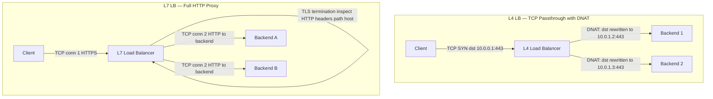
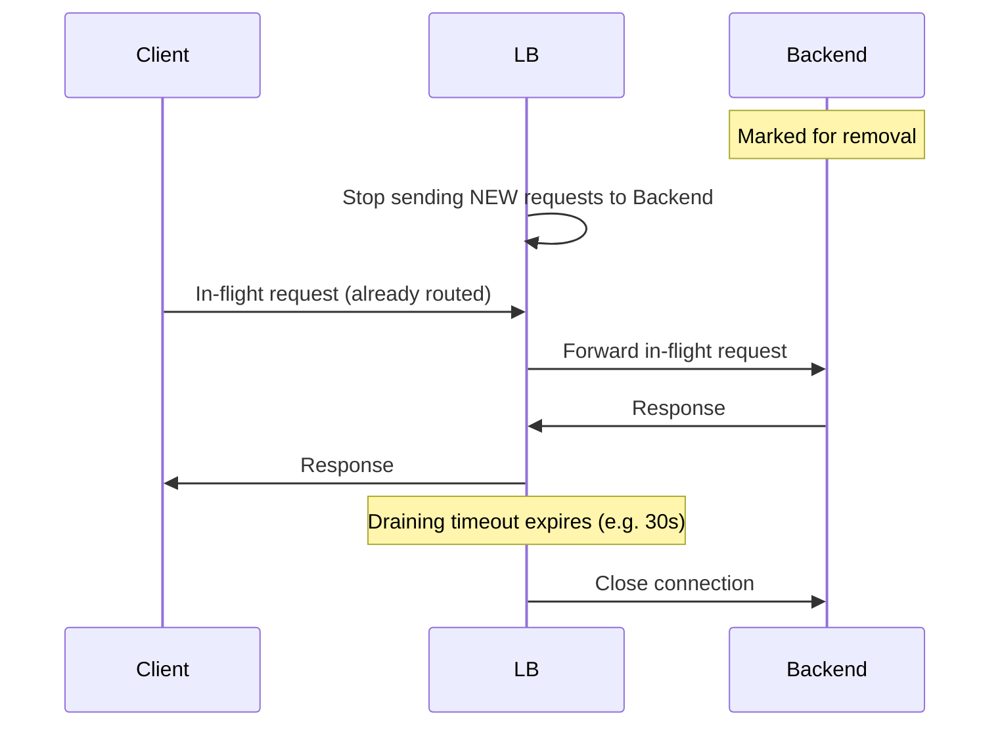
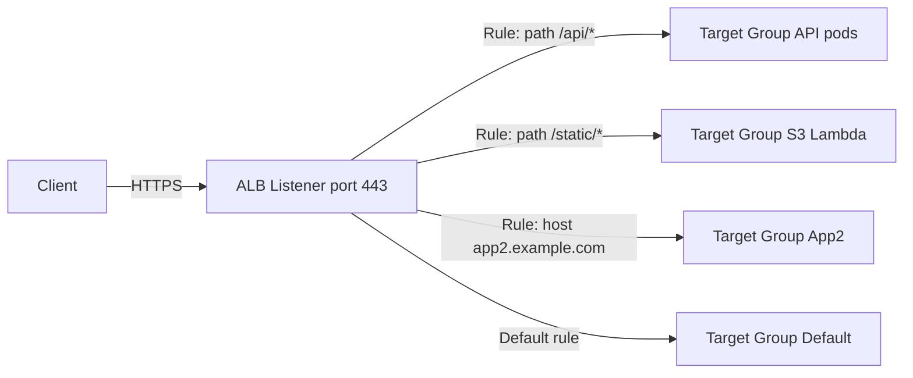
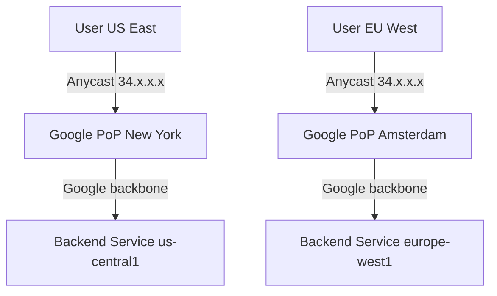

# Load Balancers — Deep Dive

Beginner to advanced reference covering L4/L7, algorithms, health checks, TLS, AWS ALB/NLB, GCP, nginx, HAProxy, and common failure modes.

---

## 1. What a Load Balancer Does

A load balancer sits between clients and backend servers and provides:

- **Traffic distribution** — spread requests across a pool of backends
- **Health checking** — remove unhealthy backends from rotation automatically
- **TLS termination** — decrypt HTTPS at the LB so backends speak plain HTTP
- **Backend topology hiding** — clients see one VIP; backend IPs are never exposed
- **Connection management** — keep persistent upstream pools, draining on deploys

---

## 2. L4 vs L7

| | L4 (Transport Layer) | L7 (Application Layer) |
|---|---|---|
| OSI layer | 4 (TCP/UDP) | 7 (HTTP/gRPC/WebSocket) |
| What it sees | IP, port, TCP flags | HTTP headers, path, host, cookies, body |
| Routing decision | IP:port only | path, host, header, query string |
| Model | NAT / DNAT — rewrites dst IP | Full proxy — two separate TCP connections |
| TLS | Passthrough or offload (opaque) | Terminate and inspect |
| Performance | Ultra-low latency, millions of conns | Higher latency, richer routing |
| State | Stateless (ECMP) or conntrack | Per-request state |
| Use when | Raw TCP, UDP, SMTP, custom protocols | HTTP APIs, WebSocket, gRPC, content routing |

### NAT vs Proxy Model

**L4 NAT/DNAT**: The LB rewrites the destination IP in each packet. The backend server's reply goes back via the LB (SNAT) or directly to the client (DSR). One TCP connection end-to-end.

**L7 Proxy**: The LB terminates the client TCP connection, parses HTTP, and opens a *new* TCP connection to the backend. Two connections exist simultaneously.

---

## 3. L4 vs L7 — Mermaid Diagram



---

## 4. Load Balancing Algorithms

### Round Robin
Requests sent to backends in order: 1 → 2 → 3 → 1 → 2 → 3 …

**Use when**: backends are homogeneous and requests are equal-cost.

### Weighted Round Robin
Each backend gets a weight. Backend with weight 3 gets 3× the traffic of weight 1.

**Use when**: backends have different capacity (e.g., mixing instance types).

### Least Connections
New request goes to the backend with the fewest active connections.

**Use when**: requests have variable duration (e.g., long-running uploads mixed with fast API calls).

### Least Response Time
Combines least connections + lowest measured latency.

**Use when**: latency variance across backends matters (heterogeneous hardware, cross-AZ).

### IP Hash (Sticky by IP)
Hash of client IP determines the backend. Same client always hits the same backend.

**Use when**: need session affinity without cookie support. Breaks badly behind NAT (all traffic → one backend).

### Random
Randomly pick a backend per request.

**Use when**: simple, stateless workloads where you want to avoid round-robin bias from burst patterns. "Power of two choices" (random pick of 2, take least-loaded) is better than pure random.

### Consistent Hashing
Hash the request key (IP, URL, user-id) onto a ring. Backends occupy slots on the ring. Adding/removing a backend only remaps ~1/N of keys.

**Use when**: caching layers (upstream cache hit rate), gRPC streams that must go to the same pod, Kafka-aware routing.

---

## 5. Health Checks

### Active Health Checks

The LB probes backends on a schedule, independent of real traffic.

| Type | Mechanism | Use when |
|---|---|---|
| HTTP | GET /healthz, expect 2xx | HTTP services |
| TCP connect | 3-way handshake only | Non-HTTP (DB, custom TCP) |
| gRPC | `grpc.health.v1.Health/Check` | gRPC services |

Key parameters:
- **interval** — how often to probe (e.g., 10s)
- **timeout** — how long to wait for a response (e.g., 5s)
- **unhealthy threshold** — consecutive failures before marking down (e.g., 2)
- **healthy threshold** — consecutive successes before marking up (e.g., 3)
- **grace period** — time after startup before health checks are enforced (avoids killing pods during JVM warm-up)

### Passive Health Checks (Circuit Breaker)

Watch real traffic error rates. If backend returns 5xx above threshold, eject it from the pool for a cooldown window.

**Use when**: active probing misses transient errors (a backend is up but throwing errors for a specific endpoint).

Envoy / Istio call this **outlier detection**: consecutive 5xx count → eject for `base_ejection_time` (doubles each ejection).

---

## 6. Sticky Sessions

### Cookie-Based (Preferred)

**LB-generated cookie**: LB inserts a cookie (e.g., `AWSALB`) on first response, encodes the target backend. On subsequent requests LB reads cookie → routes to same backend.

**App-generated cookie**: App sets a session cookie; LB reads it and hashes it to a backend.

### IP Hash

See §4. Unreliable behind NAT or IPv6 CGNAT.

### Why Sticky Sessions Are Problematic

- **Uneven load**: one sticky client can hammer one backend (e.g., long-running WebSocket or batch job)
- **Failover loses session**: if the sticky backend dies, the session is gone — unless app replicates session to Redis/DB
- **Defeats autoscaling**: new backends receive no traffic from existing sticky clients
- **Recommendation**: prefer stateless services + external session store (Redis/DynamoDB) over sticky sessions

---

## 7. Connection Draining / Deregistration Delay

### Why It Exists

When a backend is removed from the pool (deploy, scale-down, health failure), in-flight requests are mid-stream. Killing the connection immediately → client gets a 502/reset.

### How It Works



1. LB marks backend as **draining** — no new requests
2. Existing in-flight requests complete normally
3. After **deregistration delay** (default 300s on ALB, tune to 30s for fast deploys), LB forcefully closes remaining connections

**Tune to**: slightly above your p99 request duration. 30s is usually enough for APIs; leave 300s for long-running uploads.

---

## 8. TLS Termination

### Terminate at LB (Most Common)

```
Client ──HTTPS──► LB (terminate) ──HTTP──► Backend
```

- LB holds the certificate
- Backends get plain HTTP → simpler backend config
- LB can inspect HTTP headers, do content routing
- Traffic on the internal network is unencrypted (acceptable inside VPC/private network with security groups)

### SSL Passthrough

```
Client ──HTTPS──► L4 LB (SNI routing only) ──HTTPS──► Backend
```

- LB never decrypts — forwards TLS bytes to backend
- Backend holds the cert
- LB cannot do L7 routing (only SNI hostname)
- Use when: compliance requires end-to-end encryption, or backend must see client cert

### SSL Bridge (Re-encrypt)

```
Client ──HTTPS──► LB (terminate + re-encrypt) ──HTTPS──► Backend
```

- LB terminates, inspects, then opens new TLS connection to backend
- Use when: internal traffic must also be encrypted (zero-trust), and L7 routing is needed

### mTLS (Service-to-Service)

Both client and server present certificates. LB validates the client cert (or forwards it as a header).

```
Service A ──mTLS──► Istio sidecar ──mTLS──► Service B sidecar
```

Used in service meshes (Istio, Linkerd) for pod-to-pod authentication without application code changes.

---

## 9. AWS ALB Deep Dive

### Architecture



### Listeners, Rules, Target Groups

- **Listener**: protocol + port (HTTP:80, HTTPS:443). Each listener has ordered rules.
- **Rule conditions**: path pattern, host header, HTTP header, HTTP method, query string, source IP
- **Rule actions**: forward, redirect, fixed response, authenticate (Cognito/OIDC), weighted forward (canary)
- **Target group**: EC2 instances, IP addresses (pods), Lambda functions, ALB (nested)

### Content-Based Routing Examples

```
Rule 1: host = api.example.com AND path = /v2/* → TG_v2 (canary 10%) + TG_v1 (90%)
Rule 2: path = /health                           → fixed 200
Rule 3: header X-Beta = true                     → TG_beta
Default:                                         → TG_main
```

### Protocol Support

| Feature | Supported |
|---|---|
| HTTP/1.1 | Yes |
| HTTP/2 | Yes (between client and ALB; ALB → backend is HTTP/1.1 by default) |
| WebSocket | Yes (upgrade header preserved) |
| gRPC | Yes (set target group protocol version to gRPC) |
| Lambda | Yes (synchronous invoke, payload size limit 1MB) |
| WAF | Yes (attach AWS WAF web ACL to ALB) |

### Access Logs

Enable per-listener to S3. Fields include: client IP, timestamp, target IP, request processing time, target processing time, response time, status codes, SSL cipher, user-agent, request ID.

---

## 10. AWS NLB Deep Dive

### Key Properties

- **Layer 4** — TCP, UDP, TLS protocols
- **Static IPs per AZ** — one Elastic IP per AZ. Safe to whitelist in firewalls (ALB IPs change).
- **Preserve client IP** — unlike ALB (which replaces src IP), NLB passes the real client IP to the backend (security group must allow it)
- **Ultra-low latency** — no HTTP parsing overhead; millions of requests/second
- **TLS offload** — NLB can terminate TLS (similar to ALB), with ACM certificates
- **UDP** — useful for DNS, syslog, game servers
- **PrivateLink** — expose a service to another VPC/account via NLB without VPC peering

### NLB vs ALB Decision

```
Need content-based routing?      → ALB
Need static IP?                  → NLB
Need UDP?                        → NLB
Need PrivateLink endpoint?       → NLB
Need WAF?                        → ALB
Need Lambda target?              → ALB
Raw TCP performance matters?     → NLB
```

---

## 11. LCU and NLCU — Capacity Units and Pricing

AWS bills ALB and NLB on two axes: a flat **hourly charge** plus a **capacity-unit charge** based on actual usage. Understanding the capacity unit is essential for cost forecasting and for diagnosing throttling under load. Elastic Load Balancing does not bill you the sum of all dimensions — it bills you on the **single highest dimension** consumed in each hour.

### 11.1 ALB — Load Balancer Capacity Unit (LCU)

An LCU measures the traffic an ALB processes across **four independent dimensions**. Each hour, AWS computes how many LCUs you consumed on each dimension, takes the **maximum**, and bills that.

| Dimension | 1 LCU provides | What it measures |
|---|---|---|
| **New connections** | 25 new connections/sec | Newly established connections per second (avg over the hour) |
| **Active connections** | 3,000 active connections/min | Concurrent connections sampled per minute |
| **Processed bytes** | 1 GB/hour (EC2/IP/Lambda targets) | Bytes handled by the ALB in both directions |
| **Rule evaluations** | 1,000 rule evaluations/sec | (Rules processed − 10 free) × request rate |

```
Billed LCUs for the hour = MAX(
    new_connections_dim,
    active_connections_dim,
    processed_bytes_dim,
    rule_evaluations_dim
)
```

**Rule evaluations** is the subtle one. The first 10 rule evaluations per request are free. If a request matches after evaluating 15 rules, only 5 count. The dimension value is:

```
rule_eval_LCU = (request_rate/sec × max(0, rules_evaluated − 10)) / 1000
```

So a rule-heavy listener (deep rule chains, many host/path conditions) can make **rule evaluations** — not bytes — the dominant cost driver.

#### Worked ALB Example

An API service over one hour:
- 1,000 new connections/sec
- 60,000 active connections (sampled/min)
- 5 GB/hour processed
- 20 rules evaluated per request, 1,000 requests/sec

```
New connections:    1,000 / 25       = 40.0  LCU
Active connections: 60,000 / 3,000   = 20.0  LCU
Processed bytes:    5 GB / 1 GB      =  5.0  LCU
Rule evaluations:   (1,000 × (20−10)) / 1,000 = 10.0 LCU

Billed = MAX(40, 20, 5, 10) = 40 LCU  → new connections dominates
```

At the us-east-1 rate of **$0.008/LCU-hour**:
```
LCU cost  = 40 LCU × $0.008              = $0.32/hour
Hourly LB = $0.0225/hour (ALB base)      = $0.0225/hour
Total     ≈ $0.34/hour  ≈ $248/month
```

**Takeaway**: new-connection rate dominated here. Enabling **HTTP keep-alive** so clients reuse connections would collapse the new-connection dimension and cut the bill dramatically.

### 11.2 NLB — Network Load Balancer Capacity Unit (NLCU)

NLB uses NLCU, with dimensions that differ by protocol (TCP vs UDP vs TLS). Only **three dimensions**, and again you're billed on the max.

| Dimension | 1 NLCU provides (TCP) | Notes |
|---|---|---|
| **New connections/flows** | 800 new flows/sec | TCP; UDP measured as flows |
| **Active connections/flows** | 100,000 active flows/min | Concurrent flows |
| **Processed bytes** | 1 GB/hour | Bytes in both directions |

Protocol-specific rates matter:

| Protocol | New flows per NLCU | Active flows per NLCU | Bytes per NLCU |
|---|---|---|---|
| **TCP** | 800/sec | 100,000/min | 1 GB/hr |
| **UDP** | 400/sec | 50,000/min | 1 GB/hr |
| **TLS** | 50/sec | 3,000/min | 1 GB/hr |

**TLS on NLB is expensive** — the TLS dimension gives you only 50 new connections/sec per NLCU (vs 800 for raw TCP), because the NLB does the TLS handshake termination. High-churn TLS connections on an NLB burn NLCUs fast.

#### Worked NLB Example (TLS)

A TLS service: 500 new TLS connections/sec, 30,000 active flows, 8 GB/hour.

```
New TLS connections: 500 / 50        = 10.0  NLCU
Active flows:        30,000 / 3,000  = 10.0  NLCU
Processed bytes:     8 GB / 1 GB     =  8.0  NLCU

Billed = MAX(10, 10, 8) = 10 NLCU
```

At **$0.006/NLCU-hour**:
```
NLCU cost = 10 × $0.006             = $0.06/hour
Hourly LB = $0.0225/hour (NLB base) = $0.0225/hour
Total     ≈ $0.083/hour ≈ $60/month
```

### 11.3 ALB LCU vs NLB NLCU — Side by Side

| | ALB (LCU) | NLB (NLCU) |
|---|---|---|
| Dimensions | 4 (adds rule evaluations) | 3 (no rule evaluations) |
| New conn / unit | 25/sec | 800/sec (TCP) |
| Active conn / unit | 3,000/min | 100,000/min (TCP) |
| Bytes / unit | 1 GB/hr | 1 GB/hr |
| Unit price (us-east-1) | ~$0.008/LCU-hr | ~$0.006/NLCU-hr |
| TLS impact | Terminates, counts in conns | Separate low TLS rate (50/sec) |
| Billing | MAX of dimensions | MAX of dimensions |

**Why NLB is cheaper at scale for raw TCP**: 1 NLCU absorbs 800 new connections/sec vs 25 for an LCU — a 32× difference on the connection dimension. For high-throughput TCP with long-lived connections, NLB's capacity-unit math is far more favorable.

### 11.4 Capacity Planning and the Max-Dimension Trap

The single most common costing mistake is optimizing the wrong dimension. Always identify which dimension is your **binding constraint**:

```
Workload profile                    Likely dominant dimension
────────────────────────────────────────────────────────────
Chatty API, no keep-alive          New connections   → enable keep-alive
WebSockets / long-poll             Active connections → size for concurrency
Large file downloads / streaming   Processed bytes    → consider CloudFront offload
Complex routing (many rules)       Rule evaluations   → flatten rule chains, use host-based
Bulk TLS handshakes on NLB         New TLS flows      → move TLS term to ALB or reuse conns
```

Diagnose with CloudWatch — each dimension has a metric:

```bash
# ALB consumed LCUs (and per-dimension breakdown)
aws cloudwatch get-metric-statistics \
  --namespace AWS/ApplicationELB \
  --metric-name ConsumedLCUs \
  --dimensions Name=LoadBalancer,Value=app/my-alb/50dc6c495c0c9188 \
  --start-time 2024-01-15T00:00:00Z \
  --end-time 2024-01-15T01:00:00Z \
  --period 3600 --statistics Maximum

# Per-dimension ALB metrics to find the binding constraint:
#   NewConnectionCount, ActiveConnectionCount,
#   ProcessedBytes, RuleEvaluations

# NLB consumed capacity
aws cloudwatch get-metric-statistics \
  --namespace AWS/NetworkELB \
  --metric-name ConsumedLCUs \
  --dimensions Name=LoadBalancer,Value=net/my-nlb/... \
  --period 3600 --statistics Maximum
```

### 11.5 Pre-Warming and Scaling Behavior

ELB scales its own capacity gradually — it is **not instant**. When traffic jumps faster than the LB can add capacity, you see 503s (ALB) or connection failures (NLB).

- ALB/NLB scale up over **minutes**, targeting your observed traffic trend
- A sudden 10× spike (flash sale, viral event, load test) can outrun the scaling
- AWS no longer offers self-service pre-warming; for known spikes you **open a support case** (Business/Enterprise support) to request pre-warming, or ramp load gradually
- **NLB scales faster than ALB** for connection spikes because it does no L7 parsing — another reason to front extreme TCP bursts with NLB
- Load-test realistically: ramp up, don't slam from 0 to peak, or you'll measure the LB's scaling curve rather than your app

```
Traffic pattern that triggers 503s:
   requests/sec
        │           ╱│  ← instant 10× spike outruns LB scaling
        │          ╱ │     → 503 Service Unavailable
        │       ___╱  │
        │   ___╱      │  ← LB capacity (lags behind)
        └──────────────── time

Safe pattern:
        │        ____╱  ← gradual ramp, LB keeps pace
        │    ___╱
        └──────────────── time
```

### 11.6 Cost Optimization Checklist

- **Enable HTTP keep-alive** — collapses the new-connections dimension (biggest ALB win)
- **Offload large/static responses to CloudFront** — removes bytes from the ALB
- **Flatten rule chains** — keep the hot path within the first 10 free rule evaluations
- **Use NLB for raw TCP** at high connection rates — 32× better connection economics
- **Reuse TLS connections** on NLB — avoid the 50-handshakes/sec TLS ceiling
- **Right-size deregistration/idle timeouts** — fewer half-open connections inflating the active-connection dimension
- **Consolidate low-traffic ALBs** — each ALB carries the ~$0.0225/hour base regardless of traffic

---

## 12. GCP Cloud Load Balancing

### Global Anycast LB

GCP's external HTTP(S) LB is **global** — a single IP is announced from all Google PoPs worldwide via Anycast BGP. Traffic is terminated at the nearest Google edge, then forwarded over Google's private backbone to backends.



### Components

| Component | Purpose |
|---|---|
| Forwarding Rule | IP:port → Target Proxy |
| Target HTTP(S) Proxy | Terminates TLS, applies URL map |
| URL Map | Host/path rules → Backend Service |
| Backend Service | Health checks + backends (instance groups / NEGs) |
| Backend Bucket | Route to GCS bucket directly |

### URL Map Example

```yaml
# host: api.example.com path: /v1/* → backend-service-v1
# host: api.example.com path: /v2/* → backend-service-v2
# default → backend-service-main
```

### NEGs — Network Endpoint Groups

NEGs decouple the LB from instance groups. Instead of routing to a VM, the LB routes to an **endpoint** (IP:port).

| NEG Type | Backends |
|---|---|
| GCE_VM_IP_PORT | GCE VM primary/secondary IPs — pod-level routing in GKE |
| Zonal GKE | Kubernetes pods via container-native LB |
| Serverless | Cloud Run, App Engine, Cloud Functions |
| Internet NEG | External hostname:port (third-party SaaS) |
| Private Service Connect | Internal services via PSC |

**Container-native LB** (GKE + zonal NEG): traffic goes directly to pods, bypassing kube-proxy iptables. Lower latency, accurate health checks at pod level.

### Premium vs Standard Tier

| | Premium | Standard |
|---|---|---|
| Routing | Google global backbone (Anycast) | Public internet from regional PoP |
| Scope | Global LB | Regional LB only |
| Latency | Lower (closest PoP → backbone) | Higher (ISP routing) |
| Cost | Higher | Lower |
| Use when | Global user base, latency-sensitive | Single-region, cost-sensitive |

---

## 13. nginx as Load Balancer

### Basic Upstream Config

```nginx
upstream backend_pool {
    least_conn;                          # algorithm: least connections
    keepalive 32;                        # idle keepalive connections to upstream

    server 10.0.1.1:8080 weight=3;
    server 10.0.1.2:8080 weight=1;
    server 10.0.1.3:8080 backup;        # only used if others are down
}

server {
    listen 80;
    worker_processes auto;              # one worker per CPU core

    location / {
        proxy_pass         http://backend_pool;
        proxy_http_version 1.1;
        proxy_set_header   Connection "";     # enable keepalive to upstream
        proxy_set_header   Host $host;
        proxy_set_header   X-Real-IP $remote_addr;
        proxy_connect_timeout 5s;
        proxy_read_timeout    60s;
    }
}
```

### Health Checks

nginx OSS has **passive** health checks only (marks backend down after failed proxy attempts):

```nginx
upstream backend_pool {
    server 10.0.1.1:8080 max_fails=3 fail_timeout=30s;
}
```

nginx Plus (commercial) adds active health checks:

```nginx
# nginx Plus only
upstream backend_pool {
    zone backend 64k;
    server 10.0.1.1:8080;
    health_check interval=10s fails=2 passes=3 uri=/healthz;
}
```

**Community workaround**: use `nginx_upstream_check_module` (Tengine patch) or route health check via a separate Lua block.

---

## 14. HAProxy

### Config Structure

```
global
    maxconn     50000
    nbthread    4          # one thread per CPU

defaults
    mode        http
    timeout connect 5s
    timeout client  30s
    timeout server  30s
    option      redispatch        # retry on another server if connection fails
    retries     3

frontend http_in
    bind *:80
    bind *:443 ssl crt /etc/haproxy/certs/example.pem
    acl is_api  path_beg /api/
    acl is_beta hdr(X-Beta) -i true
    use_backend api_pool  if is_api
    use_backend beta_pool if is_beta
    default_backend web_pool

backend api_pool
    balance leastconn
    option  httpchk GET /healthz
    server  api1 10.0.1.1:8080 check inter 10s fall 2 rise 3
    server  api2 10.0.1.2:8080 check inter 10s fall 2 rise 3

backend web_pool
    balance roundrobin
    cookie  SERVERID insert indirect nocache
    server  web1 10.0.2.1:8080 check cookie web1
    server  web2 10.0.2.2:8080 check cookie web2
```

### Stick Tables (Sticky Sessions without Cookies)

```haproxy
backend api_pool
    stick-table type ip size 100k expire 30m
    stick on src                  # route same src IP to same server
```

### Stats Page

```haproxy
frontend stats
    bind *:8404
    stats enable
    stats uri /stats
    stats refresh 10s
    stats auth admin:secret
```

### ACLs

HAProxy ACLs are powerful pattern-matching on any request attribute:

```haproxy
acl is_mobile   hdr_sub(User-Agent) -i mobile
acl large_body  req.body_size gt 1048576
acl safe_method method GET HEAD OPTIONS
```

---

## 15. Comparison Table

| | AWS ALB | AWS NLB | GCP GLB | nginx | HAProxy |
|---|---|---|---|---|---|
| **OSI Layer** | L7 | L4 | L4+L7 | L7 (stream for L4) | L4+L7 |
| **Protocols** | HTTP/1.1, HTTP/2, WebSocket, gRPC | TCP, UDP, TLS | HTTP/1.1, HTTP/2, WebSocket, gRPC, TCP | HTTP, TCP (stream) | HTTP, TCP, UDP |
| **Static IP** | No (DNS only) | Yes (EIP per AZ) | No (Anycast VIP) | Yes (host IP) | Yes (host IP) |
| **WebSocket** | Yes | Yes (TCP passthrough) | Yes | Yes | Yes |
| **Content routing** | Yes (rich rule engine) | No | Yes (URL map) | Yes (location blocks) | Yes (ACLs) |
| **Autoscaling** | Managed, auto | Managed, auto | Managed, global | Manual / K8s HPA | Manual / K8s HPA |
| **Health checks** | HTTP, HTTPS, gRPC, TCP | TCP, HTTP, HTTPS | HTTP, HTTPS, TCP, gRPC | Passive (Plus: active) | Active (HTTP, TCP) |
| **Sticky sessions** | Cookie (AWSALB) | No | Cookie | ip_hash / sticky module | Cookie, stick-table |
| **WAF** | Yes (AWS WAF) | No | Yes (Cloud Armor) | Plus / ModSecurity | No (external) |
| **mTLS** | Yes (mutual auth) | Yes (TLS passthrough) | Yes | Yes | Yes |
| **Price model** | Hourly + LCU | Hourly + NLCU | Hourly + forwarding rules + data | Free (OSS) | Free (OSS) |
| **Best for** | AWS HTTP workloads | AWS TCP/UDP, PrivateLink | GCP global apps | On-prem, K8s ingress | On-prem, high-perf TCP |

---

## 16. Common Issues

### 502 Bad Gateway

LB received an invalid or empty response from backend.

**Causes**:
- Backend process crashed or not listening on the target port
- Backend returned a response the LB couldn't parse (protocol mismatch — e.g., backend sent HTTP/2 but LB expected HTTP/1.1)
- Backend closed the connection before sending a response (idle timeout race)
- Health check passes but app throws 502 for the specific path

**Debug**:
```bash
# Check backend is actually listening
ss -tlnp | grep :8080

# Check ALB access logs for target_status_code
aws s3 cp s3://my-alb-logs/... - | grep ' 502 '

# curl directly to backend IP bypassing LB
curl -v http://10.0.1.1:8080/api/healthz
```

### 504 Gateway Timeout

LB timed out waiting for the backend to respond.

**Causes**:
- Slow database query, external API call, or CPU-bound operation
- LB idle timeout < request processing time (ALB default: 60s)
- Backend threadpool exhausted, requests queued

**Fix**:
```bash
# Increase ALB idle timeout if request legitimately takes longer
aws elbv2 modify-load-balancer-attributes \
  --load-balancer-arn arn:... \
  --attributes Key=idle_timeout.timeout_seconds,Value=120
```

### Thundering Herd on Deploy

When a new deployment starts, all LBs simultaneously shift traffic to new pods. If new pods are slow to warm up (JVM, model loading), they get overwhelmed.

**Fix**:
- Use **readiness probes** — pod not added to LB until `/readyz` returns 200
- Use **minReadySeconds** on Deployment — wait N seconds after pod Ready before counting it as available
- Use **slow start** (nginx: `slow_start=30s` per upstream server; HAProxy: `slowstart`)
- Canary deploy — send 5% traffic to new pods first

### Connection Reset on Draining

Backend removed from pool while client had an established persistent connection → `Connection reset by peer` or `ECONNRESET`.

**Fix**:
- Set `deregistration_delay` long enough for in-flight requests to complete
- Backends should handle `SIGTERM` gracefully: stop accepting new connections, finish in-flight, then exit
- Set `connection: close` header in final responses during shutdown

```go
// Go graceful shutdown
srv.Shutdown(context.WithTimeout(ctx, 30*time.Second))
```

### Asymmetric Routing with NLB

NLB passes the real client IP (src IP preserved). If the backend's response route does not go back through the NLB (e.g., backend has a default route pointing to a different gateway), TCP session breaks because the client sees an unexpected source IP for the return packet.

**Fix**:
- Ensure backend instances route traffic destined to the client *back through* the NLB or same path
- Or enable **source NAT on NLB** (NLB target group: `preserve_client_ip = false`) — but you lose the real client IP
- Use security groups that allow the NLB's IP range, not just client IPs

---

## Read Order

For networking context: [osi-model.md](./osi-model.md) → [tcp-udp.md](./tcp-udp.md) → [tls-encryption.md](./tls-encryption.md) → this file

For Kubernetes LB internals: [../kubernetes/kube-proxy-modes.md](../kubernetes/kube-proxy-modes.md) → [../kubernetes/networking.md](../kubernetes/networking.md)

For AWS-specific: [../aws/request-flow-alb-to-pod.md](../aws/request-flow-alb-to-pod.md) → [../aws/README.md](../aws/README.md)
