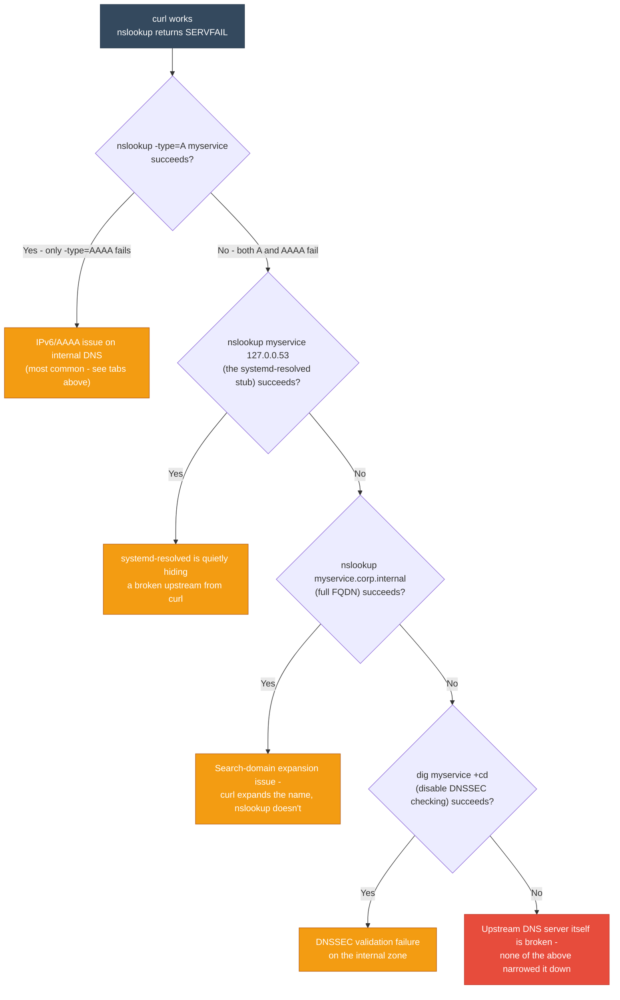
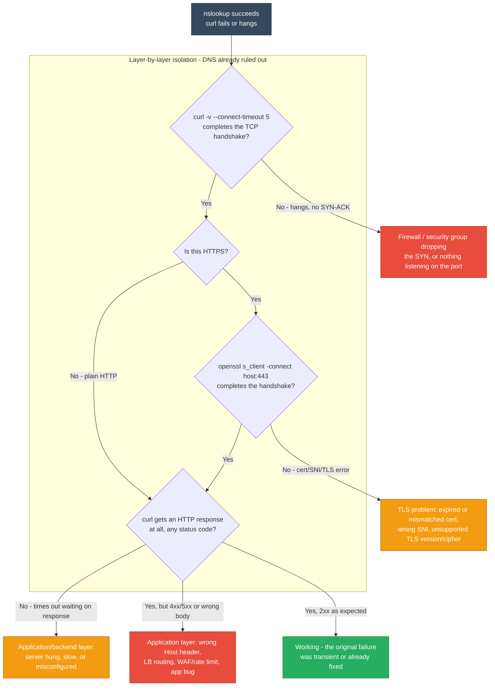

# nslookup vs curl — DNS Resolution & Debugging

<div class="quiz-progress" data-quiz-progress>
  <span class="quiz-progress-label">0/0 checks</span>
  <span class="quiz-progress-bar"><span class="quiz-progress-fill"></span></span>
</div>

## What they do

**nslookup** — DNS resolver only. Sends a query to a DNS server asking "what IP is this hostname?" Never connects to the target host.

**curl** — HTTP/HTTPS client. Makes a full application-layer request — fetches content, sends data, tests APIs. DNS resolution is just the first step.

<div class="quiz-card">
  <p class="quiz-q">Does nslookup ever actually connect to the target host (e.g. api.example.com) the way curl does?</p>
  <button class="quiz-reveal">Reveal answer</button>
  <div class="quiz-a" hidden>No. nslookup only ever talks to a DNS server — it can succeed even if the target host is completely unreachable, has nothing listening on the relevant port, or the service is down entirely. curl is a full HTTP client: DNS resolution is only its first step before it opens a TCP connection, negotiates TLS, and sends an actual request to that host.</div>
</div>

---

## Are both TCP-based?

No.

| Tool | Protocol | Transport |
|------|----------|-----------|
| `nslookup` | DNS | **UDP port 53** (default), falls back to TCP port 53 for large responses |
| `curl` (HTTP) | HTTP/1.1, HTTP/2 | **TCP port 80** |
| `curl` (HTTPS) | HTTP over TLS | **TCP port 443** |
| `curl` (HTTP/3) | HTTP/3 | **UDP (QUIC) port 443** |

<div class="quiz-card">
  <p class="quiz-q">By default, what transport does nslookup use — and what makes it switch?</p>
  <button class="quiz-reveal">Reveal answer</button>
  <div class="quiz-a" hidden>UDP port 53, by default. It only falls back to TCP port 53 for large responses. Worth remembering because it means "DNS" isn't a single fixed transport path — two tools debugging the "same lookup" can be hitting different transports depending on payload size (many records, DNSSEC signatures, etc).</div>
</div>

---

## Full flow comparison

```mermaid
sequenceDiagram
    box rgb(52,73,94) Local machine
    participant You
    end
    box rgb(41,84,127) DNS infrastructure
    participant DNS as DNS Server (8.8.8.8)
    end
    box rgb(120,66,18) Remote service
    participant Server as api.example.com
    end

    rect rgb(30,60,90)
    Note over You,DNS: nslookup api.example.com — DNS only, nothing else happens
    You->>DNS: UDP 53 — Query: A record for api.example.com?
    DNS-->>You: UDP 53 — Answer: 93.184.216.34
    end

    rect rgb(70,45,20)
    Note over You,Server: curl https://api.example.com — same DNS step, then a full HTTP request
    You->>DNS: UDP 53 — Query: A record for api.example.com?
    DNS-->>You: UDP 53 — Answer: 93.184.216.34
    You->>Server: TCP SYN → port 443
    Server-->>You: TCP SYN-ACK
    You->>Server: TLS ClientHello
    Server-->>You: TLS ServerHello + Certificate
    You->>Server: HTTP GET /
    Server-->>You: HTTP 200 OK + body
    end
```



The blue-shaded block is the entirety of what nslookup ever does. The amber-shaded block is everything curl does *in addition* to that same DNS exchange — DNS resolution is a strict subset of curl's total work, not a separate concern from it.

<div class="quiz-card">
  <p class="quiz-q">curl's flow starts with the exact same two messages as nslookup's entire flow. How much of curl's total work do those two messages represent?</p>
  <button class="quiz-reveal">Reveal answer</button>
  <div class="quiz-a" hidden>A small fraction. curl sends the same UDP:53 query and gets the same IP answer nslookup does, but that's only the first 2 of curl's 8 total steps — it still has to complete a TCP handshake, a TLS handshake, and exchange the actual HTTP request/response. nslookup stops the instant it has the IP.</div>
</div>

---

## How each resolves a domain

<div class="toggle-switch">
  <div class="toggle-buttons">
    <button data-toggle-opt="curl" class="active">curl (OS resolver)</button>
    <button data-toggle-opt="nslookup">nslookup (bypasses it)</button>
  </div>
  <div class="toggle-panel active" data-toggle-panel="curl">
    <p><strong>curl uses the OS resolver (<code>getaddrinfo</code>)</strong> — it goes through the full chain the operating system provides to every application on the box.</p>
    <pre><code class="language-mermaid">graph TD
    classDef used fill:#27ae60,stroke:#1e8449,color:#fff
    A["curl api.example.com"] --> B{"/etc/hosts has a match?"}
    subgraph CHAIN["OS resolver chain - getaddrinfo()"]
        B -->|"no match"| D["Read /etc/resolv.conf nameserver"]
        D --> E["systemd-resolved stub resolver - 127.0.0.53"]
        E --> F["Upstream DNS query - UDP port 53"]
    end
    B -->|"match found"| C["Use that IP directly - no DNS query sent"]:::used
    F --> G["IP address returned to curl"]:::used</code></pre>
    <p>Respects <code>/etc/hosts</code>, search domains, <code>ndots</code>, and the local stub resolver cache.</p>
  </div>
  <div class="toggle-panel" data-toggle-panel="nslookup">
    <p><strong>nslookup bypasses the OS resolver entirely</strong> — it never calls <code>getaddrinfo()</code> and always sends a raw DNS wire query itself.</p>
    <pre><code class="language-mermaid">graph TD
    classDef used fill:#27ae60,stroke:#1e8449,color:#fff
    classDef bypassed fill:#7f8c8d,stroke:#616a6b,color:#fff
    N["nslookup api.example.com"] --> H["Reads /etc/resolv.conf nameserver directly"]
    H --> I["Sends a raw DNS query - UDP port 53 - straight to upstream"]
    I --> J["IP address returned"]:::used
    K["/etc/hosts"]:::bypassed -.->|"IGNORED"| N
    L["systemd-resolved cache - 127.0.0.53"]:::bypassed -.->|"BYPASSED"| N</code></pre>
    <p>This is exactly why nslookup and curl can legitimately disagree about whether a hostname resolves — they are not, in general, reading from the same source of truth.</p>
  </div>
</div>

<div class="quiz-card">
  <p class="quiz-q">A hostname has a matching entry in /etc/hosts. Which tool will actually use it — curl or nslookup?</p>
  <button class="quiz-reveal">Reveal answer</button>
  <div class="quiz-a" hidden>Only curl. curl goes through the OS resolver chain (getaddrinfo()), which checks /etc/hosts first and uses a match immediately without ever sending a DNS query. nslookup bypasses the OS resolver entirely — it reads /etc/resolv.conf and sends a raw DNS query straight to the upstream server, ignoring /etc/hosts and any systemd-resolved cache completely.</div>
</div>

---

## The resolver libraries

| Tool | Library | Behavior |
|------|---------|----------|
| `nslookup` / `dig` | Own DNS implementation | Raw DNS queries, no OS resolver chain |
| `curl` (default) | **glibc `getaddrinfo()`** | Full OS resolver chain |
| `curl` (with c-ares) | **c-ares** | Async DNS, similar to nslookup — bypasses getaddrinfo |

Check which curl you have:
```bash
curl --version | grep AsynchDNS
# AsynchDNS without c-ares = threaded getaddrinfo (libc)
# AsynchDNS with c-ares = c-ares (bypasses OS resolver)
```

<div class="quiz-card">
  <p class="quiz-q">curl is built with "AsynchDNS" and c-ares. Does it still go through the same OS resolver chain as a default curl build?</p>
  <button class="quiz-reveal">Reveal answer</button>
  <div class="quiz-a" hidden>No. c-ares does its own async DNS queries and bypasses getaddrinfo() entirely — that build of curl actually behaves like nslookup/dig (raw queries straight to DNS), not like a default curl build. "AsynchDNS without c-ares" still goes through the full OS chain, just via threads; "AsynchDNS with c-ares" skips it.</div>
</div>

---

## Debugging: curl works but nslookup fails

Four causes account for almost all of these, and they share one signature: the OS resolver chain that curl uses and the raw DNS query that nslookup sends are legitimately seeing different answers for the same hostname.

<div class="tab-group">
  <div class="tab-buttons">
    <button data-tab="searchdomain" class="active">Search domain</button>
    <button data-tab="cache">systemd-resolved cache</button>
    <button data-tab="dnssec">DNSSEC</button>
    <button data-tab="ipv6">IPv4/IPv6 (most common)</button>
  </div>
  <div class="tab-panels">
    <div class="tab-panel active" data-tab-panel="searchdomain">
      <p><code>curl myservice</code> expands to <code>myservice.corp.internal</code> via search domains (the <code>search</code> line in <code>/etc/resolv.conf</code>). <code>nslookup myservice</code> queries the bare name exactly as typed — no expansion at all.</p>
      <pre><code># Test with the full name
nslookup myservice.corp.internal</code></pre>
    </div>
    <div class="tab-panel" data-tab-panel="cache">
      <p><code>curl</code> → <code>getaddrinfo()</code> → <code>127.0.0.53</code> (the systemd-resolved stub, which has a cached answer) → works.<br/>
      <code>nslookup</code> → queries upstream DNS directly → upstream is broken → fails.</p>
      <pre><code># Force nslookup to use the stub resolver
nslookup myservice 127.0.0.53
# If this works, systemd-resolved is shielding curl from the broken upstream</code></pre>
    </div>
    <div class="tab-panel" data-tab-panel="dnssec">
      <p>Internal zone is not DNSSEC-signed. Upstream returns <code>SERVFAIL</code> when trying to validate. systemd-resolved has <code>DNSSEC=allow-downgrade</code> set, so curl is fine; nslookup queries upstream directly and gets the raw <code>SERVFAIL</code>.</p>
      <pre><code># Disable DNSSEC validation for the query
dig myservice +cd +short
# If this works, DNSSEC is the issue</code></pre>
    </div>
    <div class="tab-panel" data-tab-panel="ipv6">
      <p><strong>Most common cause.</strong> nslookup queries both A and AAAA records. Internal DNS handles A fine but returns <code>SERVFAIL</code> for AAAA (instead of the correct <code>NOERROR</code> + empty answer). curl's <code>getaddrinfo()</code> ignores the AAAA failure and just uses the working A record.</p>
      <pre><code># Isolate which record type fails
nslookup -type=A myservice     # should work
nslookup -type=AAAA myservice  # will show SERVFAIL</code></pre>
      <p><strong>Fix:</strong> configure the internal DNS zone to return <code>NOERROR</code> (empty answer) for AAAA queries.</p>
      <p><strong>Workaround:</strong></p>
      <pre><code>curl -4 myservice           # force IPv4
nslookup -type=A myservice  # query only A record</code></pre>
    </div>
  </div>
</div>

<div class="quiz-card">
  <p class="quiz-q">Which of the four causes above is flagged as the most common in practice?</p>
  <button class="quiz-reveal">Reveal answer</button>
  <div class="quiz-a" hidden>The IPv4/IPv6 one: an internal DNS zone returning SERVFAIL for AAAA queries instead of a correct empty NOERROR answer. nslookup surfaces that SERVFAIL as an outright failure since it queries A and AAAA separately, while curl's getaddrinfo() just ignores the broken AAAA answer and quietly uses the working A record — so curl works and nslookup looks completely broken, even though the A record was fine the whole time.</div>
</div>

---

## Quick diagnostic flow



<div class="quiz-card">
  <p class="quiz-q">In the flowchart above, nslookup -type=A fails too — not just AAAA. What should you check next, in order?</p>
  <button class="quiz-reveal">Reveal answer</button>
  <div class="quiz-a" hidden>First, whether nslookup host 127.0.0.53 (the systemd-resolved stub) succeeds — if it does, systemd-resolved's cache is hiding a broken upstream from curl. If it doesn't, check search-domain expansion next (nslookup host.corp.internal), then DNSSEC (dig host +cd), and only after ruling out all three conclude the upstream DNS server itself is broken.</div>
</div>

---

## Debugging: nslookup works but curl fails

This direction is less common but just as real: DNS is already proven fine — nslookup got a correct answer — yet curl still can't complete a request. Because DNS is no longer a suspect, the debugging path is layered rather than branching: work outward from the network stack toward the application, one layer at a time, and stop at the first layer that doesn't come back clean.

<div class="stepper">
  <div class="stepper-panels">
    <div class="stepper-panel active">
      <strong>1. DNS is already confirmed.</strong> nslookup returned a correct IP for the hostname, so there is no reason to re-check <code>/etc/hosts</code>, <code>resolv.conf</code>, or the resolver chain here — the layer that debugging usually starts at is already proven fine. Skip straight to the transport layer.
    </div>
    <div class="stepper-panel">
      <strong>2. TCP connectivity.</strong> Test the raw connection with <code>nc -zv host port</code> or <code>curl -v --connect-timeout 5 http://host:port</code> and watch for a completed handshake. If the connection just hangs and times out with zero response, something is silently dropping the SYN — most often a security group or firewall rule doing DROP instead of REJECT, or nothing actually listening on that port.
    </div>
    <div class="stepper-panel">
      <strong>3. TLS handshake (HTTPS only).</strong> If TCP connects fine, test the handshake directly with <code>openssl s_client -connect host:443 -servername host</code>. A failure here — certificate mismatch, expired cert, wrong SNI, unsupported TLS version/cipher — shows up in curl as an "SSL certificate problem" or "SSL routines" error. DNS and TCP were never the issue.
    </div>
    <div class="stepper-panel">
      <strong>4. HTTP / application layer.</strong> If both TCP and TLS complete cleanly, the break is above the network stack entirely: a wrong <code>Host</code> header, a load balancer routing to the wrong backend, a WAF or rate limiter blocking the request, or the application itself erroring or hanging. <code>curl -v</code> shows exactly which of these stages it got stuck at — read the last line it printed before it failed.
    </div>
  </div>
  <div class="stepper-controls">
    <button class="stepper-prev">← Prev</button>
    <span class="stepper-dots"></span>
    <span class="stepper-label"></span>
    <button class="stepper-next">Next →</button>
  </div>
</div>



<div class="quiz-card">
  <p class="quiz-q">nslookup returns the correct IP instantly, but curl hangs and eventually times out with no TLS or HTTP error at all. Which layer is broken?</p>
  <button class="quiz-reveal">Reveal answer</button>
  <div class="quiz-a" hidden>TCP connectivity, not TLS or the application. curl never gets far enough to attempt a TLS handshake or send the HTTP request — a hang with zero response at the connection stage points to something dropping the SYN silently: a security group or firewall rule doing DROP instead of REJECT, or a host that simply isn't listening on that port. Check this layer with nc -zv or curl -v --connect-timeout before ever looking at certificates.</div>
</div>

---

## Key rule

> If `curl host` works but `nslookup host` fails — the problem is in DNS resolution, not connectivity. The two tools traverse different resolver paths. Narrow down which path is broken.

If `nslookup` works but `curl` fails — DNS is fine; the issue is TCP, TLS, firewall, or the application itself. Work through the layered breakdown above rather than re-checking DNS a second time.
