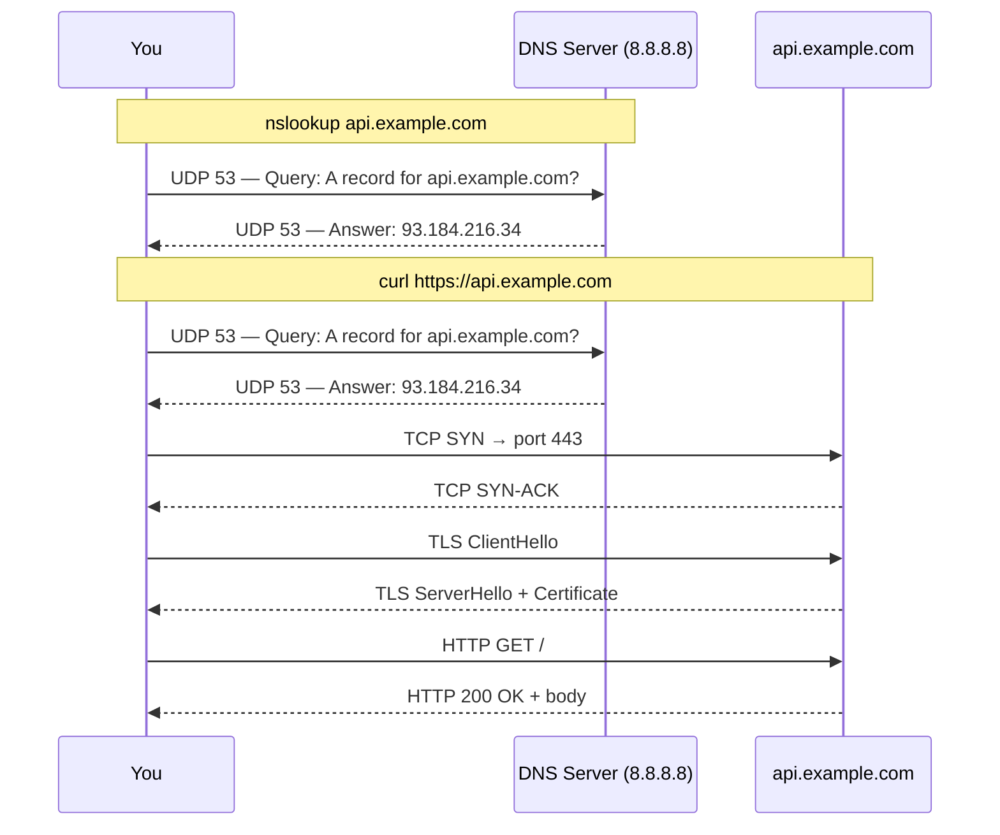
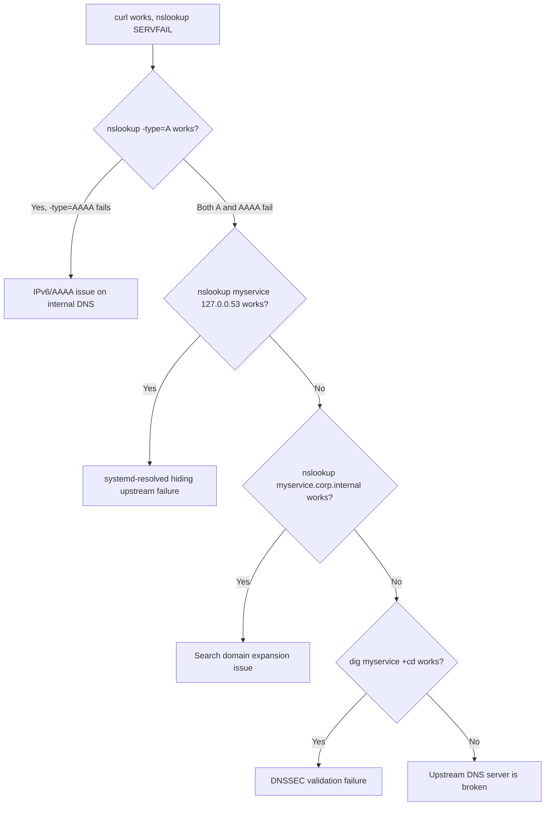

# nslookup vs curl — DNS Resolution & Debugging

## What they do

**nslookup** — DNS resolver only. Sends a query to a DNS server asking "what IP is this hostname?" Never connects to the target host.

**curl** — HTTP/HTTPS client. Makes a full application-layer request — fetches content, sends data, tests APIs. DNS resolution is just the first step.

---

## Are both TCP-based?

No.

| Tool | Protocol | Transport |
|------|----------|-----------|
| `nslookup` | DNS | **UDP port 53** (default), falls back to TCP port 53 for large responses |
| `curl` (HTTP) | HTTP/1.1, HTTP/2 | **TCP port 80** |
| `curl` (HTTPS) | HTTP over TLS | **TCP port 443** |
| `curl` (HTTP/3) | HTTP/3 | **UDP (QUIC) port 443** |

---

## Full flow comparison



---

## How each resolves a domain

### curl — uses the OS resolver (`getaddrinfo`)

```mermaid
graph TD
    A[curl api.example.com] --> B{/etc/hosts?}
    B -->|match found| C[use that IP directly]
    B -->|no match| D[/etc/resolv.conf nameserver]
    D --> E[systemd-resolved stub 127.0.0.53]
    E --> F[upstream DNS query UDP 53]
    F --> G[IP returned to curl]
```

Respects: `/etc/hosts`, search domains, `ndots`, local stub resolver cache.

### nslookup — bypasses OS resolver

```mermaid
graph TD
    G[nslookup api.example.com] --> H[reads /etc/resolv.conf nameserver directly]
    H --> I[DNS query UDP 53 to upstream]
    I --> J[IP returned]
    K[/etc/hosts] -.->|IGNORED| G
    L[systemd-resolved cache] -.->|BYPASSED| G
```

Never uses `getaddrinfo()`. Always sends raw DNS wire queries itself.

---

## The resolver libraries

| Tool | Library | Behavior |
|------|---------|----------|
| `nslookup` / `dig` | Own DNS implementation | Raw DNS queries, no OS resolver chain |
| `curl` (default) | **glibc `getaddrinfo()`** | Full OS resolver chain |
| `curl` (with c-ares) | **c-ares** | Async DNS, similar to nslookup — bypasses getaddrinfo |

Check which curl you have:
```bash
curl --version | grep AsynchDNS
# AsynchDNS without c-ares = threaded getaddrinfo (libc)
# AsynchDNS with c-ares = c-ares (bypasses OS resolver)
```

---

## Debugging: curl works but nslookup fails

### Cause 1 — Search domain expansion

`curl myservice` expands to `myservice.corp.internal` via search domains. `nslookup myservice` queries the bare name.

```bash
# Test with full name
nslookup myservice.corp.internal
```

### Cause 2 — systemd-resolved caching the answer

curl → `getaddrinfo()` → `127.0.0.53` (stub, has cached answer) → works.
nslookup → upstream DNS directly → upstream is broken → fails.

```bash
# Force nslookup to use the stub resolver
nslookup myservice 127.0.0.53
# If this works, systemd-resolved is shielding curl from the broken upstream
```

### Cause 3 — DNSSEC validation failure

Internal zone is not DNSSEC-signed. Upstream returns SERVFAIL when trying to validate. systemd-resolved has `DNSSEC=allow-downgrade` so curl is fine; nslookup queries upstream directly and gets the SERVFAIL.

```bash
# Disable DNSSEC validation for the query
dig myservice +cd +short
# If this works, DNSSEC is the issue
```

### Cause 4 — IPv4/IPv6 (AAAA SERVFAIL) — most common

nslookup queries both A and AAAA records. Internal DNS handles A fine but returns SERVFAIL for AAAA (instead of the correct NOERROR + empty answer). curl's `getaddrinfo()` ignores the AAAA failure and uses the A record.

```bash
# Isolate which record type fails
nslookup -type=A myservice     # should work
nslookup -type=AAAA myservice  # will show SERVFAIL
```

**Fix:** Configure the internal DNS zone to return `NOERROR` (empty answer) for AAAA queries.

**Workaround:**
```bash
curl -4 myservice           # force IPv4
nslookup -type=A myservice  # query only A record
```

---

## Quick diagnostic flow



---

## Key rule

> If `curl host` works but `nslookup host` fails — the problem is in DNS resolution, not connectivity. The two tools traverse different resolver paths. Narrow down which path is broken.

If `nslookup` works but `curl` fails — DNS is fine; the issue is TCP, TLS, firewall, or the application itself.
