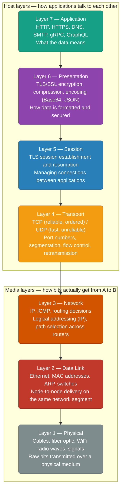
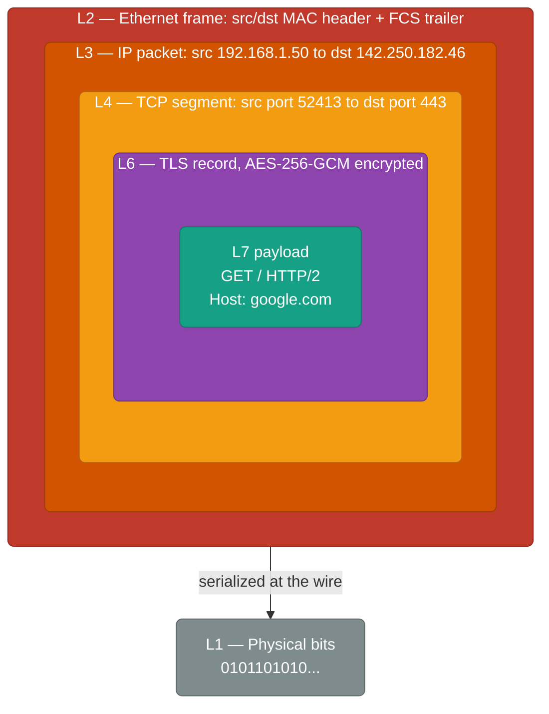

# OSI Model & Request Flow: `https://google.com`

The OSI model splits "send some data to another machine" into 7 layers, each with one narrow job and a clean handoff to the layer above and below it. The fastest way to actually internalize it isn't memorizing the layer names — it's tracing one real request, `curl https://google.com`, down through all 7 layers on the way out and back up through all 7 on the way in.

<div class="quiz-progress" data-quiz-progress>
  <span class="quiz-progress-label">0/0 checks</span>
  <span class="quiz-progress-bar"><span class="quiz-progress-fill"></span></span>
</div>

---

## The 7 OSI Layers



| # | Layer | PDU name | Address type | Devices |
|---|-------|---------|--------------|---------|
| 7 | Application | Message/Data | URL, domain name | API Gateway, App Server |
| 6 | Presentation | Data | — | TLS terminator, CDN |
| 5 | Session | Data | Session ID | — |
| 4 | Transport | Segment (TCP) / Datagram (UDP) | Port number (0–65535) | Firewall, Load Balancer |
| 3 | Network | Packet | IP address | Router |
| 2 | Data Link | Frame | MAC address | Switch |
| 1 | Physical | Bit | — | Cable, NIC, WiFi |

**Practical note:** In real systems, L5 and L6 are absorbed by TLS. Think of it as: **Application → TLS → TCP/UDP → IP → Physical**.

<div class="quiz-card">
  <p class="quiz-q">The practical note says L5 and L6 get "absorbed by TLS" in real systems. Does that mean the Session and Presentation layers do nothing during an HTTPS request — or that TLS does both jobs at once?</p>
  <button class="quiz-reveal">Reveal answer</button>
  <div class="quiz-a" hidden>TLS does both jobs at once — it isn't a no-op. TLS handles Layer 6's work (encryption, formatting/securing the data) and Layer 5's work (establishing and resuming a session, so a later reconnect can skip the full handshake) inside a single library and a single handshake. That's why real-world stacks are usually described as Application → TLS → TCP/UDP → IP → Physical: the layers still exist conceptually, they just aren't separate protocols anymore.</div>
</div>

---

## Full Request: `curl https://google.com`

This walks through every layer with every step.

```mermaid
sequenceDiagram
    participant APP as curl (L7 App)
    participant TLS as TLS Stack (L6/L5)
    participant TCP as TCP (L4)
    participant IP as IP (L3)
    participant ARP as ARP (L2 helper)
    participant ETH as Ethernet NIC (L2/L1)
    participant GW as Default Gateway (Router)
    participant GOOGLE as 142.250.182.46:443

    rect rgb(35, 50, 70)
    Note over APP: Step 1 — DNS Resolution (L7 → UDP L4)
    APP->>APP: need IP for google.com
    APP->>APP: check /etc/hosts — miss
    APP->>APP: check local DNS cache — miss
    APP-->>GW: UDP packet dst=8.8.8.8:53 Query A google.com
    GW-->>APP: UDP reply 142.250.182.46 TTL=300s
    end

    rect rgb(40, 60, 45)
    Note over TCP,IP: Step 2 — TCP 3-Way Handshake (L4 + L3 + L2)
    APP->>TCP: connect(142.250.182.46, 443)
    TCP->>IP: SYN segment seq=x src_port=52413 dst_port=443
    IP->>ARP: dst IP 142.250.182.46 is off-subnet, use gateway
    ARP->>ETH: who has 192.168.1.1? (gateway IP)
    ETH-->>ARP: gateway MAC = aa:bb:cc:dd:ee:ff
    IP->>ETH: IP packet wrapped in Ethernet frame<br/>src_MAC=my_NIC dst_MAC=gateway
    ETH->>GW: frame transmitted as electrical/optical signal (L1)
    GW->>GOOGLE: routed across internet (many hops, each L3 routing decision)
    GOOGLE-->>TCP: SYN-ACK seq=y ack=x+1
    TCP-->>GOOGLE: ACK ack=y+1
    Note over TCP: Connection ESTABLISHED (1 RTT spent)
    end

    rect rgb(65, 50, 30)
    Note over TLS: Step 3 — TLS 1.3 Handshake (L6/L5)
    TLS->>GOOGLE: ClientHello: TLS 1.3, cipher suites, key_share (ECDHE public key)
    GOOGLE-->>TLS: ServerHello + Certificate (*.google.com) + Finished
    TLS->>TLS: verify cert chain (Google CA --> DigiCert --> OS root store)
    TLS->>TLS: derive session keys from ECDHE key exchange
    TLS-->>GOOGLE: Finished
    Note over TLS: Encrypted channel ready (1 RTT spent)
    end

    rect rgb(55, 40, 65)
    Note over APP,GOOGLE: Step 4 — HTTP/2 Request (L7 over L6 over L4)
    APP->>TLS: HTTP/2 GET / headers: Host:google.com Accept:*/*
    TLS->>TCP: AES-256-GCM encrypt + HTTP/2 frame
    TCP->>IP: segment (MSS ~1460 bytes, multiple segments for large request)
    IP->>ETH: IP packet with TTL, protocol=TCP
    ETH->>GOOGLE: Ethernet frame (L1 bits)
    GOOGLE-->>APP: HTTP/2 200 response body (gzip compressed HTML)
    end

    Note over APP,GOOGLE: Total latency budget: DNS (50ms) + TCP (30ms) + TLS (30ms) + HTTP (20ms) = ~130ms
```



<div class="quiz-card">
  <p class="quiz-q">In the sequence diagram, does the TLS handshake (Step 3) start before or after the TCP connection reaches ESTABLISHED?</p>
  <button class="quiz-reveal">Reveal answer</button>
  <div class="quiz-a" hidden>After. TLS can't send a single byte — not even ClientHello — until TCP has finished its own 3-way handshake and the connection is ESTABLISHED. That's why HTTPS normally pays for two sequential round trips before any HTTP data moves: one RTT for TCP, then a second RTT for TLS 1.3 on top of it. (TLS 1.3 0-RTT resumption is the one case that can skip its own round trip on a reconnect — but the TCP handshake still has to happen first, every time.)</div>
</div>

---

## Layer-by-Layer What Actually Happens

Same request, now walked one layer at a time — step through it below, then read the full detail for each layer underneath.

<div class="stepper">
  <div class="stepper-panels">
    <div class="stepper-panel active">
      <strong>1. Layer 7 — Application.</strong> <code>curl</code> constructs the HTTP request (<code>GET / HTTP/2</code>, <code>Host: google.com</code>) and asks the OS to resolve <code>google.com</code> to an IP via the <code>getaddrinfo()</code> syscall.
    </div>
    <div class="stepper-panel">
      <strong>2. Layer 6 — Presentation.</strong> Once TCP is up, TLS negotiates a cipher suite, exchanges ephemeral ECDH keys, verifies Google's certificate, and derives symmetric session keys — everything from here on is AES-256-GCM encrypted.
    </div>
    <div class="stepper-panel">
      <strong>3. Layer 5 — Session.</strong> TLS tracks a session ID/ticket for resumption, so a later reconnect can use <code>TLS 1.3 0-RTT</code> and skip the handshake entirely.
    </div>
    <div class="stepper-panel">
      <strong>4. Layer 4 — Transport.</strong> TCP picks an ephemeral source port (52413), sets a randomized sequence number, and breaks the HTTP request into segments of MSS ≈ 1460 bytes.
    </div>
    <div class="stepper-panel">
      <strong>5. Layer 3 — Network.</strong> IP stamps the packet with source/destination addresses and a TTL of 64. Since <code>142.250.182.46</code> isn't on the local subnet, the routing table sends it to the default gateway instead of directly to Google.
    </div>
    <div class="stepper-panel">
      <strong>6. Layer 2 — Data Link.</strong> The machine doesn't know the gateway's MAC yet, so it ARPs for it, then wraps the IP packet in an Ethernet frame addressed to that MAC. The switch reads its MAC table and forwards the frame only out the correct port.
    </div>
    <div class="stepper-panel">
      <strong>7. Layer 1 — Physical.</strong> The frame is serialized onto the actual medium — voltage levels on copper, light pulses on fiber, or QAM-modulated radio waves on WiFi — and the same seven steps run in reverse on Google's end.
    </div>
  </div>
  <div class="stepper-controls">
    <button class="stepper-prev">← Prev</button>
    <span class="stepper-dots"></span>
    <span class="stepper-label"></span>
    <button class="stepper-next">Next →</button>
  </div>
</div>

### Layer 7 — Application

`curl` constructs:
```
GET / HTTP/2
Host: google.com
User-Agent: curl/8.4.0
Accept: */*
```

Initiates DNS resolution via OS `getaddrinfo()` syscall.

### Layer 6 — Presentation (TLS)

After TCP is up, TLS:
1. Negotiates cipher suite (e.g. `TLS_AES_256_GCM_SHA384`)
2. Exchanges ephemeral ECDH keys (X25519) — forward secrecy
3. Server presents certificate: `*.google.com`, signed by DigiCert
4. Client verifies: is the cert signed by a trusted CA in `/etc/ssl/certs/`? Is it expired? Does CN match `google.com`?
5. Both sides derive symmetric session keys — from this point all data is AES-256-GCM encrypted

### Layer 5 — Session

TLS manages session ID / session ticket for resumption. On reconnect, `TLS 1.3 0-RTT` can skip the handshake entirely using a pre-shared session ticket.

### Layer 4 — Transport (TCP)

```
Source port:      52413 (ephemeral, kernel picks from 32768-60999)
Destination port: 443
Sequence number:  randomised (SYN flooding protection)
Window size:      65535 bytes (receive buffer)
Flags:            SYN (connect), ACK (acknowledge), FIN (close), RST (reset)
```

TCP breaks HTTP request into **segments** of MSS ≈ 1460 bytes (1500 MTU - 20 IP header - 20 TCP header).

<div class="tab-group">
  <div class="tab-buttons">
    <button data-tab="syn" class="active">SYN</button>
    <button data-tab="ack">ACK</button>
    <button data-tab="fin">FIN</button>
    <button data-tab="rst">RST</button>
  </div>
  <div class="tab-panels">
    <div class="tab-panel active" data-tab-panel="syn">
      <strong>Connect.</strong> Sent to open a new TCP connection and propose an initial sequence number. Both sides send one during the 3-way handshake (<code>SYN</code>, then <code>SYN-ACK</code>).
    </div>
    <div class="tab-panel" data-tab-panel="ack">
      <strong>Acknowledge.</strong> Confirms receipt of data up to a given sequence number. Present on almost every segment once a connection is established — it's how TCP knows what to retransmit.
    </div>
    <div class="tab-panel" data-tab-panel="fin">
      <strong>Close.</strong> Signals "I have no more data to send" and starts the graceful connection teardown — each side sends its own <code>FIN</code> independently.
    </div>
    <div class="tab-panel" data-tab-panel="rst">
      <strong>Reset.</strong> Immediately and unilaterally kills the connection, no graceful teardown — what you get back from <code>nc -zv host 443</code> when the port is closed.
    </div>
  </div>
</div>

### Layer 3 — Network (IP)

```
Source IP:      192.168.1.50 (your machine)
Destination IP: 142.250.182.46 (google.com)
TTL:            64 (decremented at each router hop, drop at 0)
Protocol:       6 (TCP)
```

Routing table decision: `142.250.182.46` is not on local subnet → send to default gateway `192.168.1.1`.

### Layer 2 — Data Link (Ethernet)

Your machine doesn't know the MAC of `192.168.1.1` (the gateway). It sends an **ARP broadcast**:
```
"Who has IP 192.168.1.1? Tell 192.168.1.50"
Gateway replies: "192.168.1.1 is at aa:bb:cc:dd:ee:ff"
```

Frame structure:
```
Dst MAC: aa:bb:cc:dd:ee:ff (gateway)
Src MAC: 11:22:33:44:55:66 (your NIC)
EtherType: 0x0800 (IPv4)
Payload: IP packet
FCS: checksum
```

The **switch** uses MAC address table to forward the frame only to the correct port (not broadcast).

<div class="quiz-card">
  <p class="quiz-q">Your machine sends this Ethernet frame. Does the switch broadcast it out every port the way a hub would?</p>
  <button class="quiz-reveal">Reveal answer</button>
  <div class="quiz-a" hidden>No. The switch keeps a MAC address table mapping addresses to ports, and forwards the frame only out the port where the destination MAC (the gateway, in this case) lives — every other port never sees it. That's the whole point of a switch over a hub: it turns a shared broadcast medium into point-to-point delivery, which is also why one host's traffic normally can't be sniffed from another port on the same switch.</div>
</div>

### Layer 1 — Physical

The Ethernet frame is serialized to:
- **Copper (Cat6):** voltage differences (0V = 0, +/-2.5V = 1) at 1 Gbps
- **Fiber:** light pulses (on = 1, off = 0) at 10-400 Gbps
- **WiFi:** radio waves modulated with QAM encoding

<div class="tab-group">
  <div class="tab-buttons">
    <button data-tab="copper" class="active">Copper (Cat6)</button>
    <button data-tab="fiber">Fiber</button>
    <button data-tab="wifi">WiFi</button>
  </div>
  <div class="tab-panels">
    <div class="tab-panel active" data-tab-panel="copper">
      Voltage differences on twisted-pair cable — roughly 0V for a 0 bit, ±2.5V for a 1. Cheap, short-range (100m per segment), typically 1 Gbps on Cat6.
    </div>
    <div class="tab-panel" data-tab-panel="fiber">
      Pulses of light down a glass strand — light on for a 1, off for a 0. Immune to electrical interference, runs for kilometers, and scales from 10 Gbps to 400 Gbps depending on the optics.
    </div>
    <div class="tab-panel" data-tab-panel="wifi">
      Radio waves modulated with QAM encoding — no physical cable at all, so signal quality depends on distance, interference, and how many other devices are sharing the same spectrum.
    </div>
  </div>
</div>

---

## Encapsulation / Decapsulation

Each layer wraps the layer above it in its own header — nesting the whole thing like a set of envelopes, one inside the next:



On the receiving side, each layer strips its own header off the outside and passes the remaining payload up — the exact reverse order of how it was built.

<div class="quiz-card">
  <p class="quiz-q">On the receiving side, which header gets stripped off first — the Layer 1/2 framing, or the Layer 7 HTTP data?</p>
  <button class="quiz-reveal">Reveal answer</button>
  <div class="quiz-a" hidden>The outermost one first: Layer 1/2. Decapsulation runs in the reverse order of encapsulation — the frame was built from the inside out (L7 payload wrapped by L6, then L4, then L3, then L2 last), so on arrival the receiving stack peels it back from the outside in: strip the Ethernet frame (L2) first, then the IP header (L3), then the TCP header (L4), then the TLS record (L6), and only then is the raw L7 HTTP request left for the application to read.</div>
</div>

---

## Why This Matters for Debugging

| Symptom | Which layer | Debug tool |
|---------|-------------|-----------|
| DNS resolution fails | L7 | `dig google.com`, `nslookup` |
| Connection refused (port closed) | L4 | `nc -zv host 443`, `ss -tlnp` |
| Connection timeout (no route) | L3 | `traceroute google.com`, `ping` |
| Packet loss (physical/link issue) | L1/L2 | `ping -c 100` (check loss %), `ethtool eth0` |
| TLS certificate error | L6 | `openssl s_client -connect google.com:443` |
| HTTP 4xx/5xx | L7 | `curl -v`, application logs |
</content>
