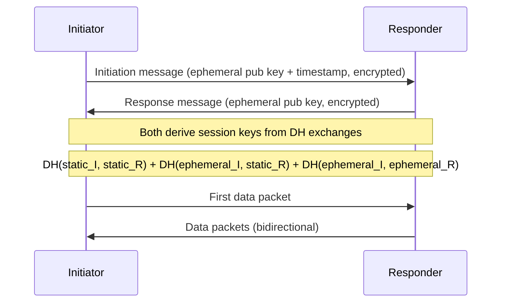

# Overlay Networks — VXLAN, GENEVE, and WireGuard

How containers on different hosts reach each other when they live in separate L3 domains:
the encapsulation formats (VXLAN and GENEVE) that carry L2 frames over L3 networks, how
WireGuard builds cryptographically secure tunnels through the same technique, what the MTU
overhead actually looks like, and which K8s CNI plugins use which approach. Builds on
[linux-networking.md](./linux-networking.md)'s coverage of network namespaces and veth pairs.

<div class="quiz-progress" data-quiz-progress>
  <span class="quiz-progress-label">0/0 checks</span>
  <span class="quiz-progress-bar"><span class="quiz-progress-fill"></span></span>
</div>

---

## 1. Why Overlay Networks Exist

In a multi-host container environment, each node has its own network namespace. Containers on
Node A (subnet `10.1.0.0/24`) need to reach containers on Node B (subnet `10.2.0.0/24`).
The underlay (the physical network between nodes) speaks IP and routes packets between host
IPs — but it knows nothing about `10.1.0.2` or `10.2.0.3`.

**Two solutions:**

1. **Route the pod subnets in the underlay** — tell every router that `10.1.0.0/24` is reachable via Node A's IP. Works in environments you control (on-prem with BGP, Calico's BGP mode, GKE's VPC-native mode). Not always possible in cloud VPCs where you can't program the underlay.

2. **Overlay network** — encapsulate pod-network packets inside host-network packets. The underlay sees only host-to-host traffic; the overlay makes it look like a flat L2 or L3 network across all pods.

```mermaid
flowchart LR
    classDef pod fill:#3498db,stroke:#2471a3,color:#fff
    classDef node fill:#27ae60,stroke:#1e8449,color:#fff
    classDef under fill:#9b59b6,stroke:#7d3c98,color:#fff

    subgraph NODE_A["Node A (192.168.1.10)"]
        PA["Pod A: 10.1.0.2"]:::pod
        VTEP_A["VTEP / tunnel endpoint"]:::node
    end

    subgraph UNDERLAY["Physical network — only sees host IPs"]
        direction LR
        UNDER["192.168.1.0/24"]:::under
    end

    subgraph NODE_B["Node B (192.168.1.20)"]
        VTEP_B["VTEP / tunnel endpoint"]:::node
        PB["Pod B: 10.2.0.3"]:::pod
    end

    PA -->|"original packet: 10.1.0.2 → 10.2.0.3"| VTEP_A
    VTEP_A -->|"encapsulated: 192.168.1.10 → 192.168.1.20<br/>outer UDP + VXLAN header + inner frame"| UNDER
    UNDER --> VTEP_B
    VTEP_B -->|"decapsulated original packet"| PB
```



---

## 2. VXLAN — Virtual Extensible LAN

VXLAN (RFC 7348) encapsulates an Ethernet frame inside a UDP packet. This carries full L2
(including MAC addresses) over an L3 underlay, creating a virtual L2 segment that can span
multiple subnets.

**VXLAN packet format:**

```
Outer Ethernet header     (14 bytes)  — host → host MAC
Outer IP header           (20 bytes)  — host → host IP
Outer UDP header          (8 bytes)   — src port: hash-based, dst port: 4789
VXLAN header              (8 bytes)   — VNI (24-bit), flags
Inner Ethernet header     (14 bytes)  — pod → pod MAC
Inner IP header           (20 bytes)  — pod → pod IP
Inner payload             (variable)
─────────────────────────────────────
Total overlay overhead:   50 bytes (excluding inner Ethernet for most accounting)
```

**VNI (VXLAN Network Identifier):** 24-bit field — up to 16 million virtual networks on the
same underlay. Kubernetes typically uses a single VNI per cluster, but multi-tenant setups
can use one per namespace or tenant.

**VTEP (VXLAN Tunnel Endpoint):** The kernel device that encapsulates and decapsulates.
On Linux it's a `vxlan` type interface:

```bash
# Create a VXLAN VTEP manually
ip link add vxlan0 type vxlan \
  id 100 \                      # VNI
  dstport 4789 \                # standard VXLAN port
  local 192.168.1.10 \          # this host's IP
  dev eth0                      # underlay interface

ip addr add 10.200.0.1/24 dev vxlan0
ip link set vxlan0 up

# Add a static FDB entry (maps remote pod MAC to remote VTEP IP)
bridge fdb append 00:11:22:33:44:55 dev vxlan0 dst 192.168.1.20

# Or use multicast BUM flooding (broadcast/unknown/multicast)
ip link add vxlan0 type vxlan id 100 dstport 4789 \
  local 192.168.1.10 group 239.1.1.1 dev eth0
```

**BUM traffic (Broadcast, Unknown unicast, Multicast):** When the VTEP doesn't know which
host a MAC belongs to, it floods the frame to all VTEPs. Two control plane options:

| Mode | How VTEPs learn MACs | Requires |
|---|---|---|
| Multicast | BUM floods to multicast group | Multicast support in underlay (often unavailable in cloud) |
| BGP EVPN | BGP distributes MAC→VTEP mappings | BGP daemon (Calico uses this with BIRD) |
| Controller | Central SDN controller pushes MAC→VTEP tables | SDN infrastructure (OpenStack Neutron, etc.) |

Flannel uses VXLAN with a simple UDP-based control plane — it watches the Kubernetes API for
node events and programs the FDB (Forwarding Database) directly.

<div class="quiz-card">
  <p class="quiz-q">Why is VXLAN's destination port 4789 instead of a well-known port, and what does the source port hash accomplish?</p>
  <button class="quiz-reveal">Reveal answer</button>
  <div class="quiz-a" hidden>4789 is the IANA-assigned port for VXLAN. The source port is a hash of the inner packet's 5-tuple (src IP, dst IP, src port, dst port, protocol) — this isn't arbitrary: it spreads VXLAN flows across ECMP paths in the underlay. Without source port variation, all VXLAN traffic between two VTEPs would be a single UDP flow (same src IP, dst IP, dst port) and ECMP would send it all down one path, defeating load balancing. The hash ensures different pod-to-pod flows get different source ports and spread across multiple paths.</div>
</div>

---

## 3. GENEVE — Generalized Network Virtualization Encapsulation

GENEVE (RFC 8926) is the evolution of VXLAN: it adds a variable-length options field to the
tunnel header, allowing metadata to be carried alongside the payload. This makes it extensible
for network functions (firewalling, telemetry, service chaining) without changing the core format.

**GENEVE vs VXLAN:**

| Property | VXLAN | GENEVE |
|---|---|---|
| Header size | Fixed 8 bytes | Variable: 8-byte base + 0–252 bytes of options |
| VNI bits | 24-bit | 24-bit |
| Protocol | Encapsulates Ethernet (L2) | Encapsulates Ethernet (L2); options can carry L3 |
| Extensibility | None | TLV options in header |
| Hardware offload | Widely supported | Growing support (requires option-aware NICs) |
| Standard | RFC 7348 | RFC 8926 |

OVN (Open Virtual Network), used by OpenShift and some OpenStack deployments, defaults to
GENEVE because the option fields carry policy metadata (ACL IDs, logical port IDs) that
forwarding hardware can act on without decapsulating.

```bash
# Create a GENEVE tunnel interface
ip link add geneve0 type geneve id 100 remote 192.168.1.20
ip addr add 10.200.1.1/30 dev geneve0
ip link set geneve0 up
```

---

## 4. WireGuard — Cryptographic Tunnels

WireGuard is a modern VPN protocol built into the Linux kernel (since 5.6). Unlike VXLAN/GENEVE
which carry arbitrary L2 frames, WireGuard is a pure L3 tunnel — it moves IP packets, not
Ethernet frames. Every packet is authenticated and encrypted.

**Noise protocol handshake:** WireGuard uses the Noise Protocol Framework (specifically
`Noise_IKpsk2_25519_ChaChaPoly_BLAKE2s`):



**Cryptokey routing table:** Every WireGuard interface has a table mapping peer public keys
to allowed IP ranges. A packet is routed to a peer if its destination IP is in that peer's
allowed-IPs list; received packets are accepted only if the source IP matches the peer's
allowed-IPs.

```bash
# Server side (wg0 interface)
ip link add wg0 type wireguard
ip addr add 10.0.0.1/24 dev wg0
wg set wg0 \
  private-key /etc/wireguard/server-private.key \
  listen-port 51820

# Add a peer
wg set wg0 peer <peer-public-key> \
  allowed-ips 10.0.0.2/32        # this peer may only send from/to 10.0.0.2

ip link set wg0 up

# Full config via wg-quick
cat /etc/wireguard/wg0.conf
# [Interface]
# Address = 10.0.0.1/24
# ListenPort = 51820
# PrivateKey = <base64>
#
# [Peer]
# PublicKey = <base64>
# AllowedIPs = 10.0.0.2/32
# Endpoint = 192.168.1.20:51820
# PersistentKeepalive = 25

wg show wg0       # shows peers, latest handshake time, transfer bytes
```

**WireGuard in Kubernetes:** Calico optionally uses WireGuard to encrypt pod-to-pod traffic
(every node gets a WireGuard interface; pod traffic is routed through it before crossing the
underlay). This eliminates the need for mTLS at the application layer for east-west
encryption.

```bash
# Enable WireGuard encryption in Calico
kubectl patch felixconfiguration default --type='merge' \
  -p '{"spec":{"wireguardEnabled":true}}'

# Verify
kubectl get node <node> -o yaml | grep "projectcalico.org/WireguardPublicKey"
```

---

## 5. How K8s CNI Plugins Use Overlays

| CNI Plugin | Default data plane | Overlay support | Notes |
|---|---|---|---|
| **Flannel** | VXLAN (default) | VXLAN, host-gw | Simple; no NetworkPolicy |
| **Calico** | BGP (underlay routing) | IPIP, VXLAN (when BGP unavailable) | Full NetworkPolicy; eBPF mode replaces kube-proxy |
| **Cilium** | eBPF (native routing) | VXLAN, GENEVE (when native unavailable) | XDP acceleration; Hubble observability; replaces kube-proxy |
| **Weave** | VXLAN + encryption | VXLAN | Slower; less maintained |
| **OVN-Kubernetes** | GENEVE | GENEVE | OpenShift default |

**Calico's BGP mode** (the non-overlay path): Each node runs BIRD (a BGP daemon) that
advertises its pod CIDR to the underlay routers. Packets travel natively without any
encapsulation. Requires the underlay to support BGP (works well on-prem; limited in cloud
without BGP support from the VPC).

**Cilium's eBPF native routing:** When all nodes are in the same L2 domain or the underlay
supports pod-subnet routing, Cilium can route without any overlay. eBPF programs in the kernel
handle forwarding at wire speed, bypassing iptables entirely.

```bash
# Check which mode Cilium is using
kubectl -n kube-system exec ds/cilium -- cilium status | grep "Tunnel"
# Tunnel:   VXLAN (or: Disabled for native routing)
```

---

## 6. MTU — The Overhead That Breaks Everything

Every overlay adds bytes to every packet. If pods send packets up to the node's MTU (typically
1500B for Ethernet), encapsulation pushes the outer packet over 1500B, causing fragmentation
or drops.

**Overhead by encapsulation type:**

| Encapsulation | Overhead |
|---|---|
| VXLAN (over IPv4) | 50 bytes (outer ETH 14 + IP 20 + UDP 8 + VXLAN 8) |
| VXLAN (over IPv6) | 70 bytes |
| GENEVE (over IPv4) | 50+ bytes (base 50, plus options) |
| WireGuard | 60 bytes (IPv4 underlay) |
| IPIP (Calico) | 20 bytes |

**Setting pod MTU correctly:**

```bash
# Standard Ethernet underlay MTU = 1500
# VXLAN overhead = 50 bytes → pod MTU should be 1450

# Cilium: configure MTU explicitly
helm install cilium cilium/cilium \
  --set tunnel=vxlan \
  --set MTU=1450

# Calico: set MTU in the IPPool or FelixConfig
kubectl patch felixconfiguration default \
  --type merge -p '{"spec":{"vxlanMTU":1450}}'

# Flannel: set in the CNI config (net-conf.json in the DaemonSet)
# MTU field under the net-conf section

# Verify actual interface MTU inside a pod
kubectl exec -it <pod> -- ip link show eth0
# eth0: mtu 1450   ← should match configured value
```

**PMTUD (Path MTU Discovery):** TCP normally discovers the maximum MTU by setting the DF
(Don't Fragment) bit. If a router drops an oversized packet and sends an ICMP "fragmentation
needed" message back, TCP reduces its MSS. But cloud firewalls often block ICMP, causing
silent drops and "black hole" connections. The solution: set `net.ipv4.tcp_mtu_probing=1` to
fall back to a safe MSS when black holes are detected.

```bash
sysctl net.ipv4.tcp_mtu_probing=1
# or permanent:
echo "net.ipv4.tcp_mtu_probing=1" >> /etc/sysctl.d/99-mtu.conf
```

<div class="quiz-card">
  <p class="quiz-q">A Kubernetes cluster uses VXLAN overlay. Pods report intermittent connection timeouts for large file transfers but small requests work fine. `ping` between pods succeeds. What is the most likely cause?</p>
  <button class="quiz-reveal">Reveal answer</button>
  <div class="quiz-a" hidden>MTU black hole. Small requests fit in small packets that traverse the VXLAN encapsulation without exceeding 1500B. Large file transfers use large TCP segments — if the pod MTU is set to 1500 (same as the node) instead of 1450, TCP segments of 1500B get encapsulated to 1550B, exceeding the underlay MTU. If ICMP "fragmentation needed" messages are blocked by a firewall (common in cloud), the sender never learns about the size limit, and large packets are silently dropped. ping succeeds because ICMP uses small packets. Fix: set pod MTU to 1450, or enable net.ipv4.tcp_mtu_probing=1 on nodes.</div>
</div>

---

## 7. Performance — When Overlay Overhead Matters

**eBPF native routing vs VXLAN (Cilium benchmark baseline):**

| Metric | VXLAN overlay | eBPF native routing |
|---|---|---|
| Throughput (single flow) | ~9.0 Gbps | ~9.5 Gbps |
| Latency (p99) | +5–15µs vs native | +1–2µs vs native |
| CPU at 10Gbps | +10–15% | +2–5% |

The overhead is proportional to packet rate, not byte rate. At 10M packets/second (small
packets), encap/decap CPU cost dominates. At low PPS with large packets (bulk data transfer),
the overhead is negligible.

**XDP (Express Data Path):** Cilium supports XDP for VXLAN encapsulation — the packet is
processed at the NIC driver level before it enters the kernel's full network stack, cutting
overhead significantly for high-PPS workloads.

```bash
# Enable XDP in Cilium
helm install cilium cilium/cilium \
  --set tunnel=vxlan \
  --set loadBalancer.acceleration=native
```

---

## Quick Reference

```
Create VXLAN interface         ip link add vxlan0 type vxlan id 100 dstport 4789 local <ip> dev eth0
Create GENEVE tunnel           ip link add geneve0 type geneve id 100 remote <remote-ip>
WireGuard show                 wg show wg0
WireGuard status               wg showconf wg0
Cilium tunnel mode             kubectl -n kube-system exec ds/cilium -- cilium status | grep Tunnel
Cilium enable WireGuard (Calico) kubectl patch felixconfiguration default -p '{"spec":{"wireguardEnabled":true}}'
Pod interface MTU              kubectl exec -it <pod> -- ip link show eth0
Check node VXLAN interfaces    ip -d link show type vxlan
FDB entries (VXLAN MAC→VTEP)  bridge fdb show dev vxlan0
VXLAN overhead                 50 bytes (IPv4 underlay)
WireGuard overhead             60 bytes (IPv4 underlay)
MTU for pods (VXLAN)          node MTU − 50 (e.g., 1500 − 50 = 1450)
Enable MTU probing             sysctl net.ipv4.tcp_mtu_probing=1
```
