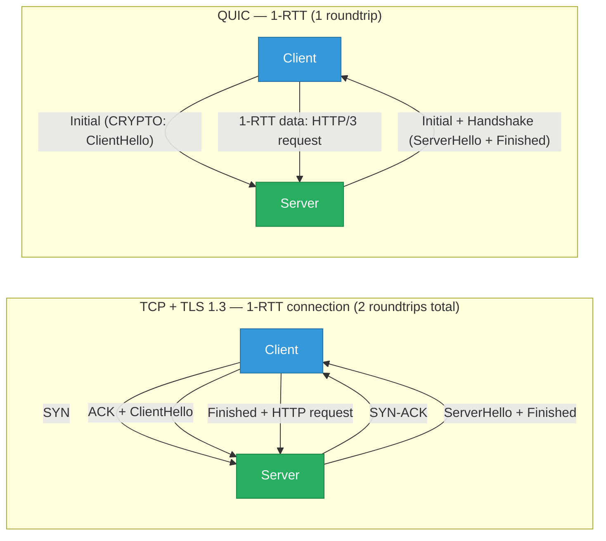

# QUIC and HTTP/3 — Protocol Internals

Why TCP's head-of-line blocking is the fundamental problem HTTP/3 solves, how QUIC's
connection ID model enables mobile roaming, what 0-RTT actually risks, and how to deploy
and debug QUIC in practice. Builds on [http-versions.md](./http-versions.md) (HTTP evolution
overview) and [tls-encryption.md](./tls-encryption.md) (TLS 1.3 handshake mechanics).

<div class="quiz-progress" data-quiz-progress>
  <span class="quiz-progress-label">0/0 checks</span>
  <span class="quiz-progress-bar"><span class="quiz-progress-fill"></span></span>
</div>

---

## 1. The TCP Problems QUIC Solves

**Head-of-line (HoL) blocking at the transport layer:**

HTTP/2 multiplexes multiple request/response streams over a single TCP connection — so a
single lost packet blocks ALL streams, not just the one that needs that data:

```
HTTP/2 over TCP:
Stream 1 (CSS)  ─────────────────────────────────────► delivered
Stream 2 (JS)   ──────██ (lost packet)──██──────────► ALL streams stall here
Stream 3 (image) ─────── waiting ───────────────────► stalled until retransmit
```

QUIC streams are independent at the transport layer — a lost QUIC packet stalls only the
stream(s) that needed that data:

```
HTTP/3 over QUIC:
Stream 1 (CSS)  ─────────────────────────────────────► delivered
Stream 2 (JS)   ──────██ (lost packet)──██──────────► only stream 2 stalls
Stream 3 (image) ─────────────────────────────────────► delivered unaffected
```

**High handshake RTT cost:**

TCP requires a 3-way handshake (1.5 RTT) before data can flow. TLS 1.2 adds another 2 RTT
on top. QUIC combines the transport and crypto handshakes into a single 1-RTT exchange (with
TLS 1.3 embedded), and allows 0-RTT on resumed connections.



---

## 2. QUIC Fundamentals

**UDP-based:** QUIC runs over UDP, giving it control over congestion, reliability, and
ordering per-stream without waiting for OS TCP stack updates. QUIC v1 is defined in
RFC 9000 (2021).

**Connection IDs — not 4-tuple:** TCP connections are identified by (src IP, src port, dst IP,
dst port). If any element changes (client IP changes during roaming, NAT rebinding), the
connection breaks. QUIC identifies connections by opaque Connection IDs chosen by each endpoint:

```
QUIC packet header:
  Destination Connection ID: 0x1a2b3c4d5e6f  ← receiver's CID (chosen by server)
  Source Connection ID: 0x9f8e7d6c5b4a         ← sender's CID (chosen by client)
```

When a mobile client's IP changes, it sends a PATH_CHALLENGE on the new path. The server
validates it and continues the connection — no reconnect, no retransmit, no application
disruption.

**Packet number space:** Each QUIC packet has a monotonically increasing packet number per
encryption level (Initial, Handshake, 1-RTT). Unlike TCP sequence numbers (byte-offset),
QUIC packet numbers are per-packet — retransmissions get new packet numbers, eliminating TCP's
retransmit ambiguity problem (the ambiguity that makes RTT estimation inaccurate under loss).

---

## 3. QUIC Streams

Every QUIC stream is an independent bidirectional or unidirectional byte channel within a
connection. Stream IDs are 62-bit integers:

| Stream ID low bits | Direction | Initiated by |
|---|---|---|
| `00` | Bidirectional | Client |
| `01` | Bidirectional | Server |
| `10` | Unidirectional | Client |
| `11` | Unidirectional | Server |

**Independent delivery:** A retransmitted packet for stream 5 does not block delivery of
data from stream 7. The QUIC stack reassembles each stream independently.

**Flow control operates at two levels:**
- Per-stream: `MAX_STREAM_DATA` frame limits bytes on one stream
- Per-connection: `MAX_DATA` frame limits total bytes across all streams

This prevents a single stream from consuming all connection buffer space.

```bash
# HTTP/3 streams per request: each request uses its own pair of streams
# Request  → stream 0 (client unidirectional: headers + body)
# Response ← stream 1 (server unidirectional: headers + body)
# Plus: QPACK encoder/decoder streams (4 streams per connection, always open)
```

<div class="quiz-card">
  <p class="quiz-q">HTTP/2 multiplexes 100 requests over one TCP connection. A packet carrying stream 50's data is lost. How many requests are blocked, and how does HTTP/3 differ?</p>
  <button class="quiz-reveal">Reveal answer</button>
  <div class="quiz-a" hidden>In HTTP/2 over TCP: all 100 requests are blocked. TCP delivers data in order — even if the application wants stream 1, 2, or 99's data (all of which may have arrived safely), the TCP layer won't deliver any data past the loss point until the lost packet is retransmitted and received. This is head-of-line blocking at the transport layer, which HTTP/2 cannot fix because it operates above TCP. In HTTP/3 over QUIC: only request 50 is blocked (the stream awaiting the lost data). All other 99 requests continue to receive and process their data normally, because QUIC handles each stream's reassembly independently. The QUIC stack delivers data from other streams to the application without waiting for stream 50's retransmit.</div>
</div>

---

## 4. Packet Protection — Header Protection

Unlike TLS over TCP (where TCP headers are plaintext), QUIC encrypts and protects its own
headers:

**Header protection** (RFC 9001): the packet number and some header flags are encrypted
using a derived key. An observer can't read packet numbers → can't track sequence or infer
connection state. This makes QUIC resistant to many middlebox interferences.

**Payload protection**: all QUIC payload is TLS 1.3 AEAD-encrypted. QUIC has no plaintext
application data in transit.

**Ossification problem:** Because QUIC uses no plaintext protocol fields (unlike TCP's port,
flags, sequence numbers), middleboxes (firewalls, QoS) can't inspect or modify it. This is
intentional — it prevents protocol ossification (middleboxes baking in assumptions about
protocol behavior that make future changes impossible). The tradeoff: deep packet inspection
tools, enterprise firewalls that pattern-match protocols, and network QoS that prioritizes
based on TCP flags all become less effective.

**QUIC BLOCKED by firewalls/middleboxes:**

```bash
# Many corporate firewalls block UDP 443 — clients fall back to TCP+TLS
curl -v --http3 https://example.com
# If QUIC is blocked: "QUIC blocked, falling back to HTTP/2"

# Check if a server supports QUIC
curl -sI https://cloudflare.com | grep "alt-svc"
# alt-svc: h3=":443"; ma=86400   ← server advertises HTTP/3 via Alt-Svc header
```

---

## 5. Loss Recovery and Congestion Control

**Per-stream retransmit:** When a packet is lost, only the QUIC frames from that packet (for
specific streams) are retransmitted with a new packet number. The retransmit carries the same
stream data but is a new QUIC packet — no ambiguity about which ACK refers to which send.

**ACK ranges:** QUIC ACKs are ranges (like SACK in TCP, but always present). A single ACK
frame can acknowledge packets 1-100, 105-200, acknowledging the gap. This reduces the ACK
overhead and speeds up loss detection.

**Congestion control:** QUIC doesn't specify a congestion control algorithm — it defines
hooks that implementations fill with Cubic, BBR, or others. Google QUIC defaults to BBR
(Bottleneck Bandwidth and RTT), which achieves higher throughput under mild loss compared to
Cubic's aggressive backoff.

**ECN (Explicit Congestion Notification):** QUIC supports ECN by design — IP-level congestion
marking can be detected per-packet and fed back to the congestion controller without waiting
for packet loss.

---

## 6. 0-RTT Resumption — and Its Limits

On a resumed QUIC connection (client has seen this server before), the client sends 0-RTT
data in the first packet — no handshake wait at all:

```
0-RTT flow:
  Client: Initial (0-RTT data: HTTP/3 request)
  Server: Initial + Handshake + 0-RTT response
  Client: Finished → data continues
```

**The replay attack surface:** 0-RTT data is sent before the server has proven liveness. An
attacker who captures and replays the first QUIC packet replays the 0-RTT HTTP request.

Mitigation:
- Servers track 0-RTT session ticket nonces to detect replays (but this doesn't scale across server clusters without a shared store)
- IETF recommends 0-RTT only for **idempotent requests** (GET, HEAD) — not POST, PUT, DELETE

```yaml
# nginx QUIC: limit 0-RTT to safe methods
ssl_early_data on;
# Application should check: if request came from early data and is non-GET, reject with 425
```

---

## 7. HTTP/3 on QUIC

HTTP/3 (RFC 9114) maps HTTP semantics onto QUIC streams:

- Each request/response pair uses one QUIC stream (client-initiated bidirectional)
- Request headers and body are sent on the stream; response headers and body come back on the same stream
- Control messages (SETTINGS, GOAWAY) use dedicated unidirectional streams

**QPACK** — header compression for HTTP/3 (replaces HPACK from HTTP/2):

HPACK requires strict in-order decoding — this reintroduced HoL blocking for headers in HTTP/2
over QUIC. QPACK separates the header table into a static table (predefined common headers)
and a dynamic table, but decoding can be done out of order using required-insert-count
acknowledgments.

```bash
# HPACK (HTTP/2): decoder must wait for updates to arrive in stream order
# QPACK (HTTP/3): out-of-order decoding is possible; blocking is optional
```

**Server push in HTTP/3:** retained from HTTP/2 but rarely used; push streams are
server-initiated unidirectional streams that send a response before the client requests it.

---

## 8. Deployment

**nginx QUIC (nginx 1.25+):**

```nginx
server {
    listen 443 quic reuseport;   # UDP 443 for QUIC
    listen 443 ssl;               # TCP 443 for HTTP/2 fallback

    ssl_certificate     /etc/nginx/ssl/cert.pem;
    ssl_certificate_key /etc/nginx/ssl/key.pem;

    # Tell clients to try QUIC next time
    add_header Alt-Svc 'h3=":443"; ma=86400';

    # 0-RTT (only for idempotent requests)
    ssl_early_data on;
}
```

**Caddy** (QUIC native — enabled by default):

```
example.com {
    reverse_proxy localhost:8080
}
# QUIC is automatically enabled; Alt-Svc header is added
```

**Load balancer requirements for QUIC:**

- UDP passthrough required (L4 load balancer, not HTTP/2 L7 termination)
- Connection IDs must be routed consistently to the same backend (QUIC connections aren't 4-tuple stable after migration)
- AWS NLB and GCP Network Load Balancer support UDP; AWS ALB terminates HTTP/3 natively (2023+)

---

## 9. Debugging QUIC

```bash
# Test if a server supports HTTP/3
curl --http3 -v https://cloudflare.com 2>&1 | grep -E "HTTP/|QUIC|Alt-Svc"

# Check Alt-Svc header (browser uses this to upgrade on next visit)
curl -sI https://example.com | grep alt-svc
# alt-svc: h3=":443"; ma=86400

# Wireshark QUIC dissector
# Capture: filter 'udp port 443'
# Right-click → Decode As → QUIC
# Requires TLS key log: SSLKEYLOGFILE=/tmp/keys.log curl --http3 https://example.com
# Load /tmp/keys.log in Wireshark: Edit → Preferences → TLS → (Pre)-Master-Secret log

# curl --http3 error: server doesn't support HTTP/3
# curl: (1) Protocol http3 not supported or disabled in libcurl
# → build curl with --with-ngtcp2 and --with-nghttp3, or use a brew/apt version with HTTP/3

# QUIC stats in the kernel (not much — QUIC is userspace)
cat /proc/net/udp     # shows UDP sockets; QUIC connections appear here
ss -u -a              # UDP socket states
```

**qvis** — browser-based QUIC trace visualizer:

```bash
# Capture QUIC qlog (JSON trace format, supported by many QUIC libraries)
QLOGDIR=/tmp/qlogs node app.js   # for node-quic, picoquic, quiche, etc.
# Open https://qvis.quictools.info and upload the .qlog file
# Shows: packet timeline, loss events, congestion window, RTT
```

---

## Quick Reference

```
HoL blocking fix               QUIC streams are independently delivered
Connection identity            Connection ID (not 4-tuple) → survives IP change
1-RTT handshake                TLS 1.3 embedded in QUIC Initial packet
0-RTT (safe methods only)      GET/HEAD only; POST risks replay
QUIC on UDP port               443 (same as HTTPS)
Detect QUIC support            curl -sI https://host | grep alt-svc
Test HTTP/3                    curl --http3 https://host
nginx QUIC config              listen 443 quic reuseport; add_header Alt-Svc 'h3=":443"'
QPACK vs HPACK                 QPACK allows out-of-order header decoding
Wireshark QUIC                 filter udp port 443 + TLS key log
qvis visualization             https://qvis.quictools.info (upload .qlog)
Middlebox block                Corporate firewalls block UDP 443 → fallback to TCP
BBR congestion control         Google QUIC default; better throughput under mild loss
ECN support                    Native; no TCP middlebox interference needed
```
