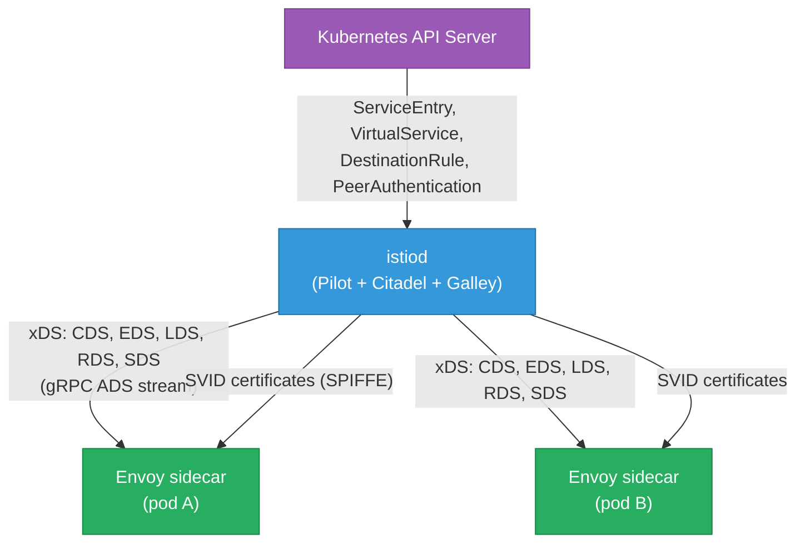

# Service Mesh — Istio, Envoy, and Linkerd

What a service mesh does at the packet level, how Istio's control plane programs Envoy
sidecars, how mTLS is enforced without touching application code, and how traffic management
(canaries, retries, circuit breaking) works through configuration alone. Builds on
[overlay-networks.md](./overlay-networks.md) (how pods reach each other) and
[tls-encryption.md](./tls-encryption.md) (mTLS fundamentals).

<div class="quiz-progress" data-quiz-progress>
  <span class="quiz-progress-label">0/0 checks</span>
  <span class="quiz-progress-bar"><span class="quiz-progress-fill"></span></span>
</div>

---

## 1. Why a Service Mesh

Without a service mesh, implementing cross-cutting concerns (mTLS, retries, circuit breaking,
distributed tracing) requires adding library code to every service in every language. A mesh
moves these into a sidecar proxy that intercepts all traffic transparently.

**What a mesh gives you:**

| Concern | Without mesh | With mesh |
|---|---|---|
| mTLS encryption | Each service implements TLS | Automatic, certificate-managed |
| Retries | App-level retry logic per client | Configured in mesh, applied to all traffic |
| Circuit breaking | Library (Hystrix, resilience4j) | Mesh outlier detection |
| Distributed tracing | App injects trace headers | Envoy propagates headers automatically |
| Traffic splitting | Deploy multiple versions, route in app | VirtualService percentage routing |
| Observability | Custom metrics per service | Uniform Envoy stats for all services |

**Cost of a mesh:** every request passes through 2 extra hops (client sidecar → network →
server sidecar), adding ~0.5–2ms latency per call. Memory per sidecar: Envoy uses ~50–150MB.
Operational complexity: the mesh control plane is itself a distributed system to manage.

---

## 2. Istio Control Plane — istiod and the xDS API

Istio's control plane is `istiod` — a single binary combining what were previously three
separate components (Pilot, Citadel, Galley):



**xDS API streams** — Envoy receives its entire configuration over gRPC:

| xDS type | What it configures |
|---|---|
| CDS (Cluster Discovery) | Upstream clusters (sets of endpoints to load balance to) |
| EDS (Endpoint Discovery) | IPs and ports within each cluster (dynamically updated as pods come/go) |
| LDS (Listener Discovery) | Inbound and outbound listeners (what ports Envoy listens on) |
| RDS (Route Discovery) | Routing rules (which cluster gets a request based on headers, paths) |
| SDS (Secret Discovery) | TLS certificates and keys (rotated without Envoy restart) |

**ADS (Aggregated Discovery Service):** Istio sends all xDS types over a single gRPC stream,
ensuring consistent ordering (cluster → endpoint → listener → route — no dangling references).

---

## 3. Envoy Sidecar Injection

```bash
# Enable automatic injection for a namespace
kubectl label namespace myapp istio-injection=enabled

# Manual injection for a specific deployment
istioctl kube-inject -f deployment.yaml | kubectl apply -f -

# Verify sidecars
kubectl get pods -n myapp -o jsonpath='{.items[*].spec.containers[*].name}'
# myapp-container istio-proxy   ← two containers per pod
```

**How injection works:** A `MutatingWebhookConfiguration` registers `istiod` as a mutating
admission webhook. When a pod is created in a labeled namespace, the K8s API calls the
webhook before persisting the object; istiod injects the `istio-proxy` container and an
`istio-init` init container.

**Traffic interception via iptables:** The `istio-init` container adds iptables rules that
redirect ALL inbound/outbound TCP to Envoy's ports:

```bash
# Rules added by istio-init (simplified)
iptables -t nat -A PREROUTING -p tcp -j REDIRECT --to-port 15006  # inbound → envoy
iptables -t nat -A OUTPUT -p tcp -j REDIRECT --to-port 15001       # outbound → envoy
# Envoy uses SO_ORIGINAL_DST to recover the original destination
```

The application sees its normal ports; Envoy intercepts every packet transparently.

---

## 4. mTLS Between Services — SPIFFE Identity

Istio uses **SPIFFE (Secure Production Identity Framework For Everyone)** for service identity.
Each pod's certificate has a SPIFFE URI as its SAN (Subject Alternative Name):

```
spiffe://cluster.local/ns/default/sa/myapp-serviceaccount
```

This identity is derived from the Kubernetes ServiceAccount, not from DNS or IP — so it
remains valid even if the pod's IP changes.

**Certificate lifecycle:**
1. `istiod` acts as a CA (Citadel component); each Envoy requests a certificate via SDS
2. Certificates are rotated every 24 hours by default (configurable)
3. Rotation is zero-downtime — Envoy holds both old and new certs during transition

**Enforcing STRICT mTLS:**

```yaml
# PeerAuthentication: require mTLS for all pods in the namespace
apiVersion: security.istio.io/v1beta1
kind: PeerAuthentication
metadata:
  name: default
  namespace: myapp
spec:
  mtls:
    mode: STRICT    # PERMISSIVE = accept both plaintext and mTLS (migration mode)
```

```yaml
# DestinationRule: instruct Envoy to use mTLS when calling this service
apiVersion: networking.istio.io/v1beta1
kind: DestinationRule
metadata:
  name: myapp-mtls
spec:
  host: myapp.myapp.svc.cluster.local
  trafficPolicy:
    tls:
      mode: ISTIO_MUTUAL    # use Istio-managed client cert
```

```bash
# Verify mTLS is active
istioctl authn tls-check <pod-name> myapp.myapp.svc.cluster.local
# HOST:PORT           STATUS   SERVER   CLIENT    AUTHN POLICY
# myapp.myapp:8080    OK       mTLS     mTLS      /default

# Check certificate in use
istioctl proxy-config secret <pod-name> -o json | jq '.dynamicActiveSecrets[].name'
```

<div class="quiz-card">
  <p class="quiz-q">PeerAuthentication is set to STRICT but one service still receives plaintext requests from a pod that doesn't have a sidecar. What's happening?</p>
  <button class="quiz-reveal">Reveal answer</button>
  <div class="quiz-a" hidden>The pod without a sidecar is not part of the mesh — it has no Envoy proxy to present a client certificate. In STRICT mode, the server Envoy will reject plaintext connections (no client cert = TLS handshake failure). For that pod to communicate with mesh services, it must either: (1) get a sidecar injected (add the namespace label or pod annotation `sidecar.istio.io/inject: "true"`), or (2) set PeerAuthentication to PERMISSIVE for that specific service to allow non-mesh traffic during migration. If the connection is succeeding despite STRICT mode, check that PeerAuthentication actually applies to the destination service (namespace scope, not just cluster-wide default) and that there's a DestinationRule with ISTIO_MUTUAL mode on the client side.</div>
</div>

---

## 5. Traffic Management — VirtualService and DestinationRule

**VirtualService** defines how requests are routed. **DestinationRule** configures what
happens once a request reaches a subset (load balancing, connection pools, TLS).

**Canary deployment (10% to new version):**

```yaml
apiVersion: networking.istio.io/v1beta1
kind: VirtualService
metadata:
  name: myapp
spec:
  hosts:
    - myapp
  http:
    - route:
        - destination:
            host: myapp
            subset: v1
          weight: 90
        - destination:
            host: myapp
            subset: v2
          weight: 10
---
apiVersion: networking.istio.io/v1beta1
kind: DestinationRule
metadata:
  name: myapp
spec:
  host: myapp
  subsets:
    - name: v1
      labels:
        version: "1"
    - name: v2
      labels:
        version: "2"
```

**Header-based routing (route internal users to canary):**

```yaml
http:
  - match:
    - headers:
        x-canary:
          exact: "true"
    route:
    - destination:
        host: myapp
        subset: v2
  - route:                  # default
    - destination:
        host: myapp
        subset: v1
```

**Connection pool settings (circuit-breaker-adjacent):**

```yaml
spec:
  host: myapp
  trafficPolicy:
    connectionPool:
      tcp:
        maxConnections: 100      # max concurrent TCP connections
      http:
        http2MaxRequests: 1000   # max concurrent HTTP/2 requests
        pendingRequests: 100     # max queued requests before rejection
```

---

## 6. Resilience Patterns

**Retries:**

```yaml
http:
  - route:
    - destination:
        host: myapp
    retries:
      attempts: 3
      perTryTimeout: 2s
      retryOn: "5xx,reset,connect-failure,retriable-4xx"
      # retriable-4xx: retry on 429 (rate limit) and 409 (conflict)
```

**Timeouts:**

```yaml
http:
  - timeout: 5s        # total timeout including retries
    route:
    - destination:
        host: myapp
```

**Outlier detection (circuit breaking):**

```yaml
spec:
  host: myapp
  trafficPolicy:
    outlierDetection:
      consecutiveGatewayErrors: 5    # eject endpoint after 5 consecutive 5xx
      interval: 10s                   # evaluation window
      baseEjectionTime: 30s           # minimum ejection duration
      maxEjectionPercent: 50          # max % of endpoints ejected simultaneously
      # After ejection, endpoint is retried after baseEjectionTime * num_ejections
```

**Fault injection (chaos testing):**

```yaml
http:
  - fault:
      delay:
        percentage:
          value: 10      # inject 500ms delay in 10% of requests
        fixedDelay: 500ms
      abort:
        percentage:
          value: 5       # return 503 for 5% of requests
        httpStatus: 503
    route:
    - destination:
        host: myapp
```

---

## 7. Observability

**Envoy metrics** (exposed at `localhost:15090/stats/prometheus` on each pod):

```bash
# Check Envoy stats for a pod
kubectl exec <pod> -c istio-proxy -- curl localhost:15090/stats/prometheus | \
  grep -E "upstream_rq_total|upstream_rq_time|upstream_cx_active"

# Key metrics:
# istio_requests_total{response_code="200",...}
# istio_request_duration_milliseconds{quantile="0.99",...}
# envoy_cluster_upstream_rq_retry  ← retry rate
# envoy_cluster_upstream_cx_active ← active connections
```

**Distributed tracing:** Envoy automatically propagates trace headers (`x-b3-traceid`,
`x-b3-spanid`, `x-b3-sampled`). Applications must forward these headers between service
calls (Envoy handles the Envoy→Envoy span; the app must pass headers on to downstream calls).

```bash
# Verify Jaeger receives traces
kubectl -n istio-system port-forward svc/tracing 16686
# Open localhost:16686 → find traces for myapp
```

**Kiali** — service graph showing topology, error rates, golden signals per service:

```bash
kubectl -n istio-system port-forward svc/kiali 20001
# Open localhost:20001
```

---

## 8. Linkerd — The Lighter Alternative

Linkerd uses a Rust-based micro-proxy (`linkerd2-proxy`) instead of Envoy. Key differences:

| | Istio + Envoy | Linkerd |
|---|---|---|
| Proxy language | C++ (Envoy) | Rust (linkerd2-proxy) |
| Memory per sidecar | 50–150 MB | 10–30 MB |
| Config model | CRDs (VirtualService, DestinationRule) | Simpler (ServiceProfile, Server) |
| mTLS | Automatic (SPIFFE) | Automatic (SPIFFE) |
| gRPC support | Yes | Yes |
| HTTP/1.1 support | Yes | Yes |
| Wasm extensibility | Yes (Envoy WASM filters) | No |
| Control plane HA | More complex | Simpler |

**When Linkerd beats Istio:**
- Small to medium clusters where Istio's operational overhead isn't justified
- Memory-constrained nodes (Linkerd sidecars use 5–10× less memory)
- Teams that want automatic mTLS + golden signals without the full Istio CRD model

```bash
# Install Linkerd
linkerd check --pre
linkerd install | kubectl apply -f -
linkerd check

# Inject Linkerd proxy
kubectl annotate namespace myapp linkerd.io/inject=enabled
```

---

## 9. When NOT to Use a Service Mesh

- **Monolith or few services** — a mesh is infrastructure for a distributed system. If you have 3 services, the operational cost exceeds the benefit.
- **Low-latency requirements** — each call adds 2 sidecar hops. For µs-latency systems (HFT, game servers), this is unacceptable.
- **Simple mTLS needs** — Cilium Mutual Auth can enforce mTLS between pods using eBPF without sidecars (~0 overhead per packet).
- **Retry/circuit-breaking already in app** — if your framework (gRPC with retries, Resilience4j) already handles resilience, adding a mesh doubles the retry logic with potential interaction effects.
- **Can't afford sidecar resource overhead** — in resource-constrained environments, 150MB × number-of-pods is non-trivial.

---

## Quick Reference

```
Enable sidecar injection           kubectl label namespace myapp istio-injection=enabled
Check sidecar running              kubectl get pod <name> -o jsonpath='{.spec.containers[*].name}'
Verify mTLS status                 istioctl authn tls-check <pod> <host>
Enforce STRICT mTLS                PeerAuthentication mode: STRICT + DestinationRule ISTIO_MUTUAL
Canary: 10% to v2                  VirtualService weight: 90/10 + DestinationRule subsets
Retry on 5xx                       VirtualService retries.retryOn: "5xx"
Circuit breaking                   DestinationRule outlierDetection consecutiveGatewayErrors: 5
Fault injection 10% delay          VirtualService fault.delay percentage: 10
Envoy metrics port                 localhost:15090/stats/prometheus
Kiali service graph                port-forward svc/kiali 20001
Linkerd inject namespace           kubectl annotate namespace app linkerd.io/inject=enabled
Istio xDS debug                    istioctl proxy-config cluster <pod>
                                   istioctl proxy-config listener <pod>
                                   istioctl proxy-config route <pod>
```
