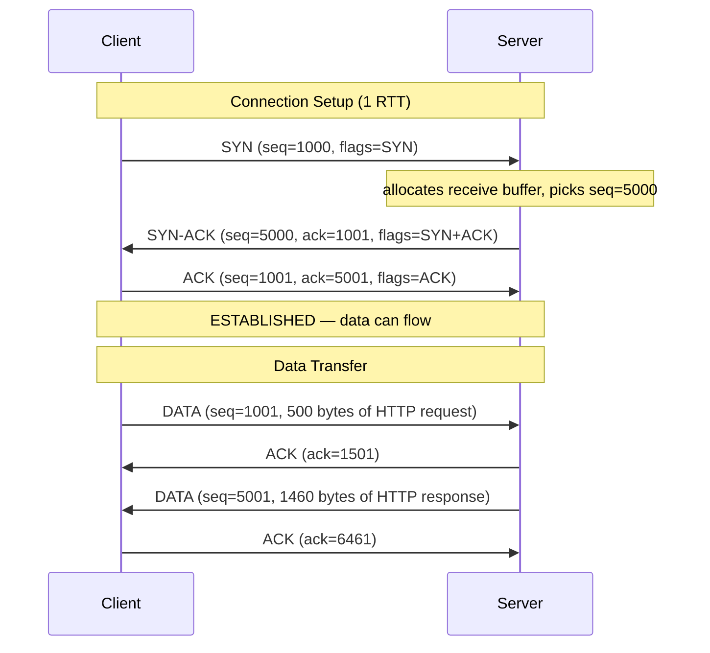
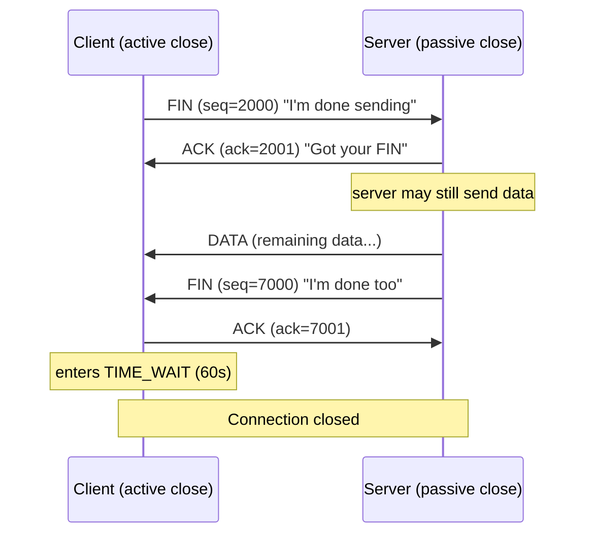
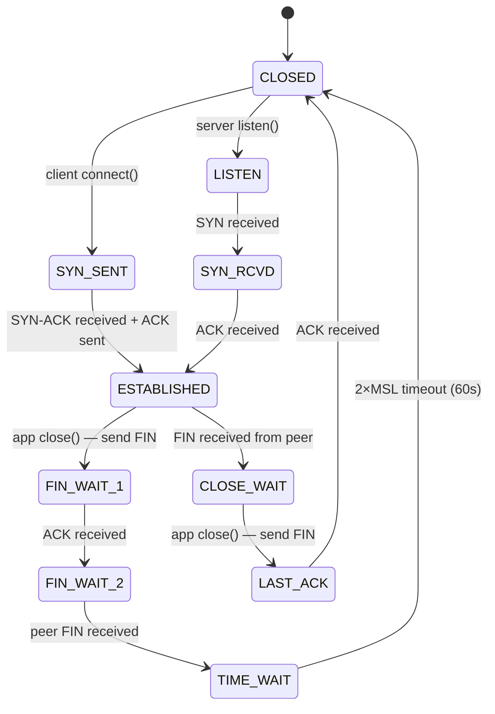
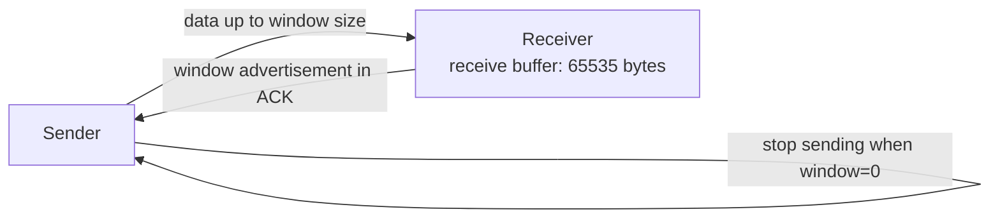
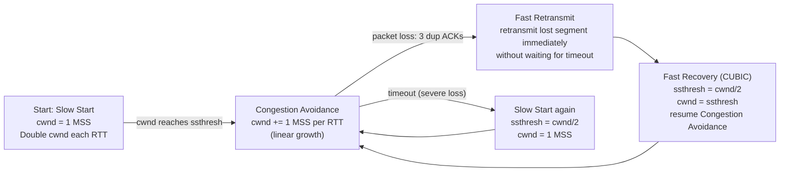
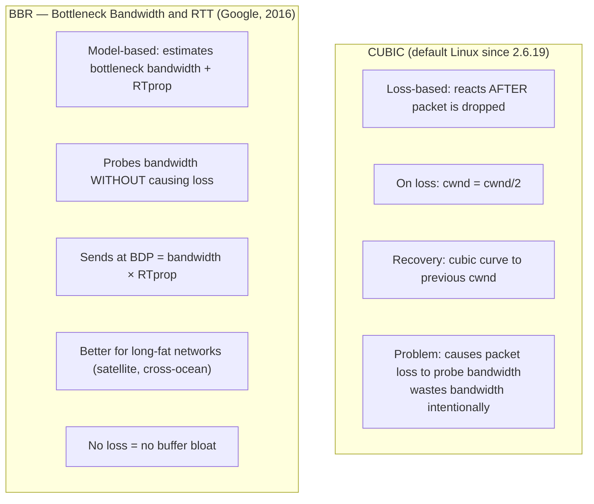
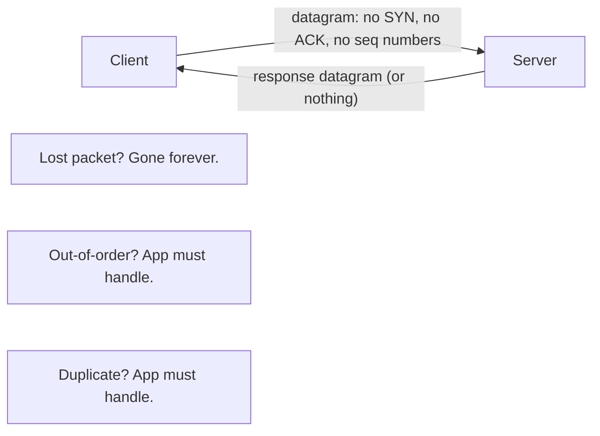
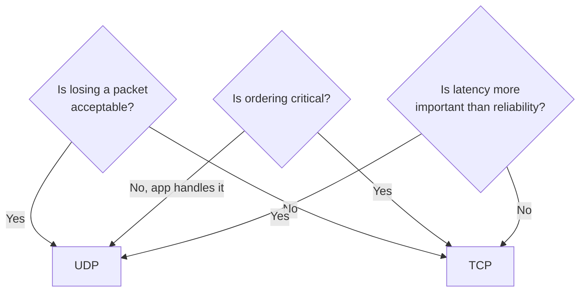

# TCP and UDP

Both protocols move bytes over IP, but they sit at opposite ends of a tradeoff: TCP spends packets and RTTs buying reliability and ordering, UDP spends nothing and leaves those problems to the application. Everything below — handshakes, sequence numbers, congestion control — is a consequence of that one choice. Track how many of the checks below you can answer before revealing:

<div class="quiz-progress" data-quiz-progress>
  <span class="quiz-progress-label">0/0 checks</span>
  <span class="quiz-progress-bar"><span class="quiz-progress-fill"></span></span>
</div>

## TCP — Transmission Control Protocol

TCP provides **reliable, ordered, error-checked** delivery of a byte stream between two endpoints. It guarantees every byte arrives exactly once and in order.

### 3-Way Handshake



Same exchange, one packet at a time:

<div class="stepper">
  <div class="stepper-panels">
    <div class="stepper-panel active">
      <strong>1. SYN.</strong> Client picks an initial sequence number (ISN) &mdash; here <code>seq=1000</code> &mdash; and sends a segment with only the SYN flag set. No payload. This says: "I want to talk, and I'm starting my byte count at 1000."
    </div>
    <div class="stepper-panel">
      <strong>2. SYN-ACK.</strong> Server allocates a receive buffer, picks its own ISN (<code>seq=5000</code>), and replies with two flags at once: SYN (its own request to talk) plus ACK (<code>ack=1001</code>, acknowledging the client's SYN). One packet doing two jobs.
    </div>
    <div class="stepper-panel">
      <strong>3. ACK.</strong> Client acknowledges the server's SYN with <code>ack=5001</code>. Both sides now know each other's starting sequence number. State flips to ESTABLISHED on both ends &mdash; still zero bytes of application data exchanged so far.
    </div>
  </div>
  <div class="stepper-controls">
    <button class="stepper-prev">← Prev</button>
    <span class="stepper-dots"></span>
    <span class="stepper-label"></span>
    <button class="stepper-next">Next →</button>
  </div>
</div>

**Sequence numbers** are byte offsets, not packet numbers. `seq=1001` means "this segment starts at byte 1001". `ack=1501` means "I received up to byte 1500, give me byte 1501 next".

<div class="quiz-card">
  <p class="quiz-q">The server's SYN-ACK carries <code>ack=1001</code> when the client's SYN had <code>seq=1000</code>. Why 1001 and not 1000?</p>
  <button class="quiz-reveal">Reveal answer</button>
  <div class="quiz-a" hidden>Sequence/ack numbers count bytes, not packets, and a bare SYN consumes one sequence number even though it carries no payload. Acknowledging a SYN sent at <code>seq=1000</code> means "next byte I expect is 1001" &mdash; the ack number is always one past the highest byte successfully received, never the byte itself.</div>
</div>

### 4-Way Teardown



**Why 4-way?** FIN closes one direction only. Both sides must FIN independently. Half-close is valid — server can receive your FIN and keep sending data.

**TIME_WAIT (60s):** Client stays in TIME_WAIT after sending the last ACK. Prevents old packets from a dead connection being accepted by a new connection on the same port pair.

Same exchange, one packet at a time:

<div class="stepper">
  <div class="stepper-panels">
    <div class="stepper-panel active">
      <strong>1. FIN from the active closer.</strong> Client sends <code>seq=2000</code> with the FIN flag: "I'm done sending." It moves to FIN_WAIT_1. This only closes the client-to-server direction.
    </div>
    <div class="stepper-panel">
      <strong>2. ACK from the passive closer.</strong> Server acknowledges with <code>ack=2001</code>. Client advances to FIN_WAIT_2. The server is not obligated to close yet — it can keep sending data on its own half of the connection.
    </div>
    <div class="stepper-panel">
      <strong>3. FIN from the passive closer.</strong> Once the server has nothing left to send, it sends its own FIN (<code>seq=7000</code>) and moves to LAST_ACK.
    </div>
    <div class="stepper-panel">
      <strong>4. ACK from the active closer.</strong> Client acknowledges with <code>ack=7001</code>. Server sees this and closes immediately. Client instead enters TIME_WAIT for 60s before it fully closes.
    </div>
  </div>
  <div class="stepper-controls">
    <button class="stepper-prev">← Prev</button>
    <span class="stepper-dots"></span>
    <span class="stepper-label"></span>
    <button class="stepper-next">Next →</button>
  </div>
</div>

<div class="quiz-card">
  <p class="quiz-q">Which side ends up in TIME_WAIT after this exchange — the active closer or the passive closer?</p>
  <button class="quiz-reveal">Reveal answer</button>
  <div class="quiz-a" hidden>The active closer &mdash; whichever side sent the <em>final</em> ACK (the client in this example). TIME_WAIT exists to protect that last ACK: if it gets lost and the peer retransmits its FIN, the active closer needs to still be around to resend the ACK, and the port pair needs to stay reserved so a stray late packet from this connection can't be mistaken for one on a brand-new connection.</div>
</div>

### TCP State Machine



<div class="quiz-card">
  <p class="quiz-q">A socket has been sitting in CLOSE_WAIT for minutes. What does that tell you, and whose bug is it?</p>
  <button class="quiz-reveal">Reveal answer</button>
  <div class="quiz-a" hidden>The peer already sent its FIN &mdash; that's what moved this socket into CLOSE_WAIT in the first place. The only edge leaving CLOSE_WAIT is "app close() &mdash; send FIN," which means the local application simply hasn't called <code>close()</code> on its end yet. A socket parked in CLOSE_WAIT for a long time almost always means a local file-descriptor/socket leak, not a network problem.</div>
</div>

### Flow Control — Receive Window



The receiver advertises how much buffer space it has (window size). Sender never sends more unacknowledged bytes than the window. If the app is slow to read, the buffer fills, window shrinks to 0 → sender stops. **Backpressure all the way to the source.**

<div class="quiz-card">
  <p class="quiz-q">The receiving application stalls (stuck in a long computation, not calling <code>read()</code>). Does the sender find out immediately, and how?</p>
  <button class="quiz-reveal">Reveal answer</button>
  <div class="quiz-a" hidden>Not immediately, but soon. The receive buffer keeps filling with unread data, so the window size advertised in each ACK shrinks. Once it hits 0, the sender must stop &mdash; it can never have more unacknowledged bytes in flight than the last advertised window. That's backpressure propagating from a slow reader all the way back to the sender, with no application-level signaling involved.</div>
</div>

### Congestion Control — CUBIC / BBR

Congestion control prevents a sender from overwhelming the network. The sender maintains a **congestion window (cwnd)** — the maximum number of unacknowledged bytes in flight.



Same four phases, flip through them one at a time:

<div class="tab-group">
  <div class="tab-buttons">
    <button data-tab="slowstart" class="active">Slow Start</button>
    <button data-tab="ca">Congestion Avoidance</button>
    <button data-tab="fr">Fast Retransmit</button>
    <button data-tab="frr">Fast Recovery</button>
  </div>
  <div class="tab-panels">
    <div class="tab-panel active" data-tab-panel="slowstart">
      <strong>Exponential growth.</strong> Starts at <code>cwnd = 1 MSS</code>. Every ACK received bumps <code>cwnd</code> up by 1 MSS, which doubles the window every RTT. Runs until <code>cwnd</code> reaches <code>ssthresh</code> (initially 64KB) &mdash; or until a timeout resets everything back to this phase.
    </div>
    <div class="tab-panel" data-tab-panel="ca">
      <strong>Linear growth.</strong> Once past <code>ssthresh</code>, each ACK only adds <code>(MSS &times; MSS) / cwnd</code>, which works out to roughly +1 MSS per full RTT instead of per ACK. Cautious probing for more bandwidth instead of the aggressive doubling of Slow Start. Continues until loss is detected.
    </div>
    <div class="tab-panel" data-tab-panel="fr">
      <strong>Triggered by 3 duplicate ACKs.</strong> The receiver keeps ACKing the last good segment because a later one arrived out of order &mdash; a sign of moderate, isolated loss. The sender retransmits the missing segment immediately, without waiting for a full retransmission timeout.
    </div>
    <div class="tab-panel" data-tab-panel="frr">
      <strong>Recover without restarting from scratch.</strong> <code>ssthresh</code> is halved to <code>cwnd/2</code>, and <code>cwnd</code> is set to that same halved value &mdash; not reset to 1 MSS. Congestion Avoidance resumes immediately from there. This is what makes Fast Recovery so much gentler than a timeout.
    </div>
  </div>
</div>

**Phase 1 — Slow Start:**
```
cwnd starts at 1 MSS (Maximum Segment Size, ~1460 bytes)
Each ACK received → cwnd += 1 MSS
Effect: cwnd doubles every RTT (exponential)
Stops when cwnd >= ssthresh (slow start threshold, initially 64KB)
```

**Phase 2 — Congestion Avoidance:**
```
Each ACK → cwnd += (MSS × MSS) / cwnd
Effect: cwnd increases by 1 MSS per full RTT (linear)
Continues until packet loss detected
```

**Loss detection:**
- **Timeout:** No ACK for 1 RTO (Retransmission Timeout). Severe — resets cwnd to 1 MSS.
- **3 Duplicate ACKs:** Receiver keeps ACKing last good segment. Moderate loss — Fast Retransmit without full slow start.

**Concrete example (CUBIC):**
```
RTT 0: cwnd=1 (1 MSS = 1460 bytes in flight)
RTT 1: cwnd=2
RTT 2: cwnd=4
RTT 3: cwnd=8  (slow start, ssthresh not hit yet)
RTT 4: cwnd=16
RTT 5: cwnd=32
RTT 6: cwnd=64 = ssthresh → switch to congestion avoidance
RTT 7: cwnd=65
RTT 8: cwnd=66  (linear now)
...
RTT N: packet loss detected (3 dup ACKs)
     ssthresh = cwnd/2 = 33
     cwnd = 33 (fast recovery, not back to 1)
RTT N+1: cwnd=34 (resume linear growth from ssthresh)
```

<div class="quiz-card">
  <p class="quiz-q">3 duplicate ACKs just triggered Fast Retransmit. Does <code>cwnd</code> collapse all the way back to 1 MSS, the way a full timeout would?</p>
  <button class="quiz-reveal">Reveal answer</button>
  <div class="quiz-a" hidden>No. A timeout means severe, unconfirmed loss, so it resets <code>cwnd</code> to 1 MSS and restarts Slow Start from zero. 3 duplicate ACKs mean the network is still delivering packets &mdash; just one segment went missing &mdash; so Fast Recovery only halves <code>ssthresh</code> and <code>cwnd</code> (e.g. 64 &rarr; 33 in the example above) and resumes Congestion Avoidance from there. Same underlying signal (loss), very different severity, very different response.</div>
</div>

### CUBIC vs BBR



| | CUBIC | BBR |
|--|-------|-----|
| Trigger | Packet loss | Bandwidth model |
| On loss | cwnd halved | No direct response to loss |
| Buffer bloat | Yes (fills buffers) | No |
| Cross-ocean links | Underperforms | Excellent |
| LAN / datacenter | Good | Can be aggressive |
| Default Linux | Yes (since 2.6.19) | Opt-in |

<div class="quiz-card">
  <p class="quiz-q">Does BBR need to actually see a packet get dropped before it backs off, the way CUBIC does?</p>
  <button class="quiz-reveal">Reveal answer</button>
  <div class="quiz-a" hidden>No. CUBIC is loss-based &mdash; it deliberately keeps growing <code>cwnd</code> until something drops, then halves it, so causing occasional loss is baked into how it finds available bandwidth. BBR is model-based: it estimates bottleneck bandwidth and round-trip propagation time directly and paces sending at that rate (BDP), so it can find the right sending rate without ever needing to overflow a buffer first.</div>
</div>

```bash
# Check current algorithm
sysctl net.ipv4.tcp_congestion_control
# tcp_congestion_control = cubic

# Enable BBR
modprobe tcp_bbr
sysctl -w net.ipv4.tcp_congestion_control=bbr
sysctl -w net.core.default_qdisc=fq   # required for BBR

# Persist
echo "net.core.default_qdisc=fq" >> /etc/sysctl.conf
echo "net.ipv4.tcp_congestion_control=bbr" >> /etc/sysctl.conf

# Verify BBR is active
ss -i | grep bbr
```

### CWND and BDP (Bandwidth-Delay Product)

```
BDP = bandwidth × RTT

Example: 1 Gbps link, 100ms RTT
BDP = 1,000,000,000 bits/s × 0.1s = 100,000,000 bits = 12.5 MB

The sender must have up to 12.5 MB of unacknowledged data in flight
to fully utilize a 1 Gbps link with 100ms RTT.

If cwnd < BDP → sender is artificially limited → underutilizing the link.
This is why TCP buffer sizes matter:
sysctl -w net.ipv4.tcp_rmem="4096 87380 134217728"  # 128MB max
```

<div class="quiz-card">
  <p class="quiz-q">A server on a 1 Gbps link with 100ms RTT has its TCP buffers capped so <code>cwnd</code> can never exceed 2MB. Can it saturate the link?</p>
  <button class="quiz-reveal">Reveal answer</button>
  <div class="quiz-a" hidden>No. BDP for this link is 1,000,000,000 bits/s &times; 0.1s = 12.5 MB &mdash; that's how much data needs to be in flight, unacknowledged, to keep the pipe full. Capping <code>cwnd</code> at 2MB means the sender is artificially limited to roughly 2/12.5 of the link's capacity, no matter how fast the network actually is. This is exactly why <code>tcp_rmem</code>/<code>tcp_wmem</code> tuning matters more on high-bandwidth, high-RTT ("long fat") links than on a LAN.</div>
</div>

### Key TCP Tuning

```bash
# Accept queue — how many completed handshakes kernel queues before app calls accept()
sysctl -w net.core.somaxconn=65535

# SYN queue — incomplete handshakes
sysctl -w net.ipv4.tcp_max_syn_backlog=65535

# TIME_WAIT reuse — allow outbound connections to reuse TIME_WAIT sockets
sysctl -w net.ipv4.tcp_tw_reuse=1

# Keepalive — detect dead connections (default 7200s = terrible)
sysctl -w net.ipv4.tcp_keepalive_time=60
sysctl -w net.ipv4.tcp_keepalive_intvl=10
sysctl -w net.ipv4.tcp_keepalive_probes=5

# Ephemeral port range (for many outbound connections)
sysctl -w net.ipv4.ip_local_port_range="1024 65535"
```

---

## UDP — User Datagram Protocol

UDP is **connectionless, unreliable, unordered**. No handshake, no ACK, no retransmit. Just send a datagram and hope.



**UDP header:** only 8 bytes (vs TCP's 20 bytes minimum):
```
Source Port (2B) | Dest Port (2B) | Length (2B) | Checksum (2B) | Data
```

<div class="quiz-card">
  <p class="quiz-q">A UDP datagram arrives at the receiver twice (network-level duplication). Who notices and drops the extra copy?</p>
  <button class="quiz-reveal">Reveal answer</button>
  <div class="quiz-a" hidden>Nobody, at the transport layer. UDP has no sequence numbers and keeps no per-connection state, so it has nothing to compare the duplicate against. If duplicates matter, the application has to detect and drop them itself &mdash; the same way it's on the hook for lost and out-of-order datagrams.</div>
</div>

### TCP vs UDP

| Feature | TCP | UDP |
|---------|-----|-----|
| Connection | 3-way handshake | None |
| Reliability | ACK + retransmit | No guarantee |
| Ordering | Sequence numbers | No |
| Overhead | 20+ byte header + handshake RTT | 8 byte header, no setup |
| Congestion control | Yes (CUBIC/BBR) | No (app responsibility) |
| Flow control | Receive window | No |
| Latency | Higher (ACK, retransmit delays) | Lower |
| Use case | HTTP, SSH, DB connections | DNS, QUIC, video, gaming |

Same comparison, one protocol at a time:

<div class="toggle-switch">
  <div class="toggle-buttons">
    <button data-toggle-opt="tcp" class="active">TCP</button>
    <button data-toggle-opt="udp">UDP</button>
  </div>
  <div class="toggle-panel active" data-toggle-panel="tcp">
    Pays a full RTT up front (3-way handshake) before a single byte moves. In exchange it guarantees every byte arrives exactly once, in order, and backs off automatically when the network is congested (CUBIC/BBR) or the receiver is slow (receive window). That safety net is also where its latency and per-connection overhead come from.
  </div>
  <div class="toggle-panel" data-toggle-panel="udp">
    No handshake, no connection state, an 8-byte header. Send a datagram and it either arrives or it doesn't &mdash; no retransmit, no reordering, no dedup. Lower latency and less overhead by construction, but reliability, ordering, and congestion behavior become the application's problem the moment it needs any of them.
  </div>
</div>

<div class="quiz-card">
  <p class="quiz-q">Which column in the table above has no built-in congestion control, and who ends up responsible for it instead?</p>
  <button class="quiz-reveal">Reveal answer</button>
  <div class="quiz-a" hidden>UDP. TCP backs off automatically via CUBIC/BBR when it detects congestion; UDP has no such mechanism at all &mdash; it will keep blasting datagrams at whatever rate the application asks for. Any congestion response has to be built by the application itself, which is exactly what QUIC does by implementing its own congestion control on top of UDP.</div>
</div>

### When to Use UDP



**DNS (UDP port 53):** Single query/response fits in one datagram. No need for a connection — fast, stateless. Falls back to TCP for responses > 512 bytes (EDNS0 increases this to 4096 bytes).

**QUIC / HTTP/3 (UDP):** Implements its own reliable delivery, multiplexing, and TLS on top of UDP. Avoids TCP's head-of-line blocking — one lost packet doesn't stall other streams.

**Video streaming (UDP):** A dropped frame is better than a frozen stream waiting for retransmit. Application uses FEC (Forward Error Correction) instead.

**Gaming:** Position updates are sent many times per second. A stale position is less harmful than waiting for retransmit of an old position.

<div class="quiz-card">
  <p class="quiz-q">DNS runs over UDP by default. What happens when a response would be bigger than a single datagram can carry?</p>
  <button class="quiz-reveal">Reveal answer</button>
  <div class="quiz-a" hidden>It falls back to TCP. Plain UDP DNS responses are capped around 512 bytes; EDNS0 raises that ceiling to 4096 bytes over UDP, but past that the resolver switches to a TCP query instead. DNS isn't "UDP only" &mdash; it's UDP for the common case, with TCP as the fallback for anything too big to fit.</div>
</div>

### Checking Sockets

```bash
# List all UDP sockets
ss -u -a

# List all TCP sockets with process info
ss -t -p

# Show socket state counts
ss -s
# Estab, Time-Wait, Closed, Listen...

# netstat equivalent (older)
netstat -tlnp   # TCP listening with PID
netstat -an | grep TIME_WAIT | wc -l
```
