# TLS, SSL, and Encryption

<div class="quiz-progress" data-quiz-progress>
  <span class="quiz-progress-label">0/0 checks</span>
  <span class="quiz-progress-bar"><span class="quiz-progress-fill"></span></span>
</div>

## Encryption — The Big Picture (Generic)

Before TLS specifics, understand the three types of encryption and why HTTPS needs all three.

### 1. Symmetric Encryption — One Shared Key

Both sides use the **same key** to lock and unlock.

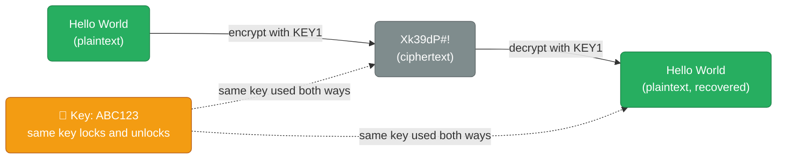

**Problem:** How do you share the key? If an attacker intercepts it, they can decrypt everything.

**Fast:** AES-256-GCM encrypts ~1 GB/s. Used for all bulk data.

### 2. Asymmetric Encryption — Public/Private Key Pair

Two mathematically linked keys. **Public key encrypts, private key decrypts.** The private key never leaves the server.

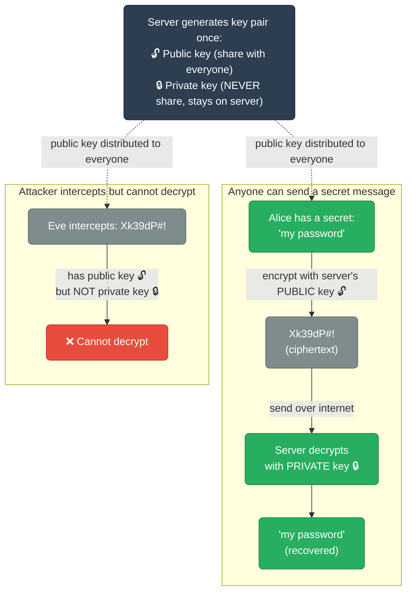

**Problem:** 100× slower than symmetric. Can't use for bulk data.

### 3. How HTTPS Combines Both (Hybrid Encryption)

HTTPS uses asymmetric only to **agree on a shared key**, then uses symmetric for all data:

```mermaid
sequenceDiagram
    participant C as Your Browser
    participant S as Server (e.g. google.com)

    rect rgb(40, 55, 75)
    Note over C,S: Step 1 — Key Exchange (Asymmetric, happens once)
    S->>C: "Here's my PUBLIC KEY 🔓 (inside the certificate)"
    C->>C: Generate a random session key: 🔑 "7f3a9c..."
    C->>S: Encrypt session key with server's PUBLIC KEY 🔓<br/>→ send "Xk8dP#!" (only server can decrypt)
    S->>S: Decrypt with PRIVATE KEY 🔒<br/>→ recovers session key 🔑 "7f3a9c..."
    end

    Note over C,S: Both now have the same session key 🔑 — nobody else does

    rect rgb(40, 60, 45)
    Note over C,S: Step 2 — Actual Data (Symmetric, blazing fast)
    C->>S: "GET /profile" encrypted with 🔑 session key
    S->>C: "200 OK {name: Alice}" encrypted with 🔑 session key
    end

    rect rgb(75, 40, 40)
    Note over C,S: If attacker intercepts step 1 — only sees encrypted session key<br/>Cannot decrypt without private key 🔒
    end
```

**Summary of what each does in HTTPS:**

| Crypto type | Used for | Why |
|-------------|---------|-----|
| Asymmetric (RSA/ECDH) | Key exchange only | Solves the key-sharing problem |
| Symmetric (AES-256-GCM) | All actual data | Fast enough for gigabytes |
| Hashing (SHA-256) | Certificate signatures, MAC | Verify nothing was tampered with |

<div class="quiz-card">
  <p class="quiz-q">In the hybrid HTTPS flow above, once the session key exchange (Step 1) finishes, is the actual "GET /profile" request encrypted with the server's public key, or with the shared session key?</p>
  <button class="quiz-reveal">Reveal answer</button>
  <div class="quiz-a" hidden>
    With the symmetric session key. Asymmetric crypto in HTTPS is used exactly once, to
    securely exchange the session key — it never encrypts bulk request/response data.
    All the actual traffic afterward runs through AES-256-GCM (symmetric), because
    asymmetric crypto is roughly 100x slower and can't keep up with gigabytes of data.
  </div>
</div>

---

## Symmetric vs Asymmetric — Side by Side

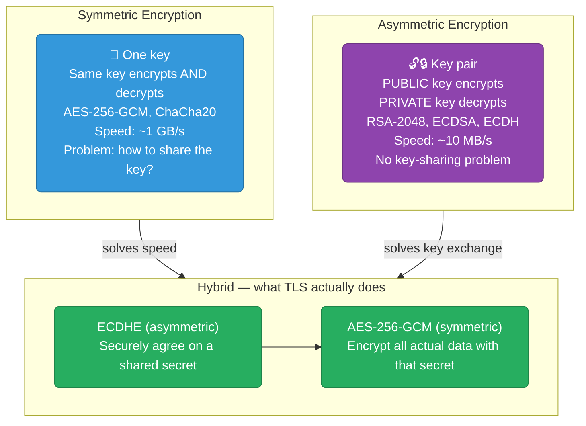

**Why hybrid?** Asymmetric crypto solves the key exchange problem but is 100× slower than AES. TLS uses asymmetric only to agree on a shared session key, then switches to AES for all data.

**Forward Secrecy (ECDHE):** Each session generates a new ephemeral key pair. The server's long-term private key is never used to encrypt data — only to authenticate. If the private key is stolen years later, past sessions cannot be decrypted.

<div class="quiz-card">
  <p class="quiz-q">A server's long-term private key is stolen a year after a TLS session that used ECDHE took place. Can the attacker now decrypt the recorded traffic from that old session?</p>
  <button class="quiz-reveal">Reveal answer</button>
  <div class="quiz-a" hidden>
    No. ECDHE generates a brand-new, temporary key pair for every session and discards
    the private half once the handshake finishes — the long-term private key is only
    ever used to sign/authenticate the exchange, never to encrypt data directly.
    Without that session's now-gone ephemeral private key, the recorded traffic can't
    be decrypted even with the stolen long-term key. This is forward secrecy, and it
    does <strong>not</strong> hold for static RSA key exchange, where the same
    long-term private key decrypts every session ever recorded.
  </div>
</div>

---

## SSL vs TLS History

```mermaid
graph LR
    classDef broken fill:#e74c3c,stroke:#c0392b,color:#fff,rx:6
    classDef deprecated fill:#7f8c8d,stroke:#616a6b,color:#fff,rx:6
    classDef current fill:#3498db,stroke:#2471a3,color:#fff,rx:6
    classDef preferred fill:#27ae60,stroke:#1e8449,color:#fff,rx:6

    SSL2["SSL 2.0 (1995)<br/>BROKEN — DROWN attack<br/>Deprecated 1996"]:::broken --> SSL3
    SSL3["SSL 3.0 (1996)<br/>BROKEN — POODLE attack<br/>Deprecated 2015"]:::broken --> TLS10
    TLS10["TLS 1.0 (1999)<br/>BEAST, POODLE variants<br/>Deprecated 2021"]:::deprecated --> TLS11
    TLS11["TLS 1.1 (2006)<br/>Deprecated 2021"]:::deprecated --> TLS12
    TLS12["TLS 1.2 (2008)<br/>Minimum acceptable today<br/>2 RTT handshake"]:::current --> TLS13
    TLS13["TLS 1.3 (2018)<br/>CURRENT PREFERRED<br/>1 RTT, forward secrecy mandatory"]:::preferred
```

**Minimum acceptable today:** TLS 1.2. Prefer TLS 1.3.

<div class="quiz-card">
  <p class="quiz-q">SSL 3.0 and TLS 1.0/1.1 are all deprecated. Is TLS 1.2 in that same "broken, don't use it" category?</p>
  <button class="quiz-reveal">Reveal answer</button>
  <div class="quiz-a" hidden>
    No. TLS 1.2 is not deprecated — it's the current minimum acceptable version.
    Only SSL 2.0/3.0 and TLS 1.0/1.1 are broken or deprecated (DROWN, POODLE, BEAST).
    TLS 1.2 is still widely deployed and safe when configured with strong cipher
    suites; TLS 1.3 is simply preferred where available for its 1-RTT handshake and
    mandatory forward secrecy.
  </div>
</div>

---

## TLS 1.2 Handshake (2 RTT)

```mermaid
sequenceDiagram
    participant C as Client
    participant S as Server

    rect rgb(40, 55, 75)
    Note over C,S: Round Trip 1 — negotiate + server proves identity
    C->>S: ClientHello<br/>TLS version: 1.2<br/>Random: 32 bytes<br/>Cipher suites: [TLS_ECDHE_RSA_AES256_GCM_SHA384, ...]<br/>Extensions: SNI=google.com, ALPN=h2

    S->>C: ServerHello<br/>Chosen cipher: TLS_ECDHE_RSA_AES256_GCM_SHA384<br/>Random: 32 bytes
    S->>C: Certificate<br/>*.google.com cert + intermediate CA chain
    S->>C: ServerKeyExchange<br/>ECDHE public key (ephemeral)<br/>Signed with server private key
    S->>C: ServerHelloDone
    end

    rect rgb(65, 50, 30)
    Note over C,S: Round Trip 2 — client verifies, both derive keys
    C->>C: Verify cert chain against OS root store
    C->>C: Generate pre-master secret from ECDHE keys
    C->>C: Derive session keys (AES key + MAC key)
    C->>S: ClientKeyExchange (ECDHE public key)
    C->>S: ChangeCipherSpec (switch to encryption)
    C->>S: Finished (HMAC of all handshake messages)

    S->>S: Derive same session keys
    S->>C: ChangeCipherSpec
    S->>C: Finished
    end

    rect rgb(40, 60, 45)
    Note over C,S: Encrypted data flows — 2 RTTs spent before the first byte
    C->>S: HTTP GET / (encrypted with AES-256-GCM)
    end
```

<div class="stepper">
  <div class="stepper-panels">
    <div class="stepper-panel active">
      <strong>1. ClientHello.</strong> The client proposes TLS 1.2, a random nonce, a list of
      cipher suites it supports, and extensions like SNI (which hostname it wants) and
      ALPN (HTTP/2 vs HTTP/1.1).
    </div>
    <div class="stepper-panel">
      <strong>2. Server responds — still Round Trip 1.</strong> <code>ServerHello</code> picks
      the cipher suite, <code>Certificate</code> sends the leaf + intermediate chain,
      <code>ServerKeyExchange</code> sends a signed ephemeral ECDHE public key, and
      <code>ServerHelloDone</code> ends the server's turn.
    </div>
    <div class="stepper-panel">
      <strong>3. Client verifies and replies — Round Trip 2 begins.</strong> The client
      validates the certificate chain against its OS trust store, computes the
      pre-master secret from the ECDHE exchange, derives session keys, sends its own
      <code>ClientKeyExchange</code>, then <code>ChangeCipherSpec</code> to switch on
      encryption, then <code>Finished</code> — an HMAC over every handshake message so far.
    </div>
    <div class="stepper-panel">
      <strong>4. Server confirms, data flows.</strong> The server independently derives the
      same session keys, replies with its own <code>ChangeCipherSpec</code> and
      <code>Finished</code>. Only now — after 2 full round trips — can the first
      encrypted HTTP request go out.
    </div>
  </div>
  <div class="stepper-controls">
    <button class="stepper-prev">← Prev</button>
    <span class="stepper-dots"></span>
    <span class="stepper-label"></span>
    <button class="stepper-next">Next →</button>
  </div>
</div>

<div class="quiz-card">
  <p class="quiz-q">Why does the client have to wait for a full second round trip (ClientKeyExchange → Finished) before sending its first encrypted HTTP request, instead of sending it right after ServerHelloDone?</p>
  <button class="quiz-reveal">Reveal answer</button>
  <div class="quiz-a" hidden>
    Because until Round Trip 2 completes, neither side has derived the actual session
    keys yet, and the server hasn't confirmed it agrees with the client's key material.
    The client only learns the server's ephemeral public key and certificate in RTT1;
    it must then verify the cert, compute the pre-master secret, derive keys, and get
    its own <code>Finished</code> message acknowledged before it's safe to send
    encrypted data. TLS 1.3 removes this wait by having the server derive keys as soon
    as it sees the client's <code>key_share</code> in a single round trip.
  </div>
</div>

---

## TLS 1.3 Handshake (1 RTT)

```mermaid
sequenceDiagram
    participant C as Client
    participant S as Server

    rect rgb(40, 60, 45)
    Note over C,S: Single Round Trip — most of the handshake, encrypted
    C->>S: ClientHello<br/>TLS 1.3<br/>key_share: ECDHE public key (X25519)<br/>supported_groups: X25519, P-256<br/>SNI: google.com<br/>ALPN: h2

    Note over S: Server derives keys NOW from client's key_share
    S->>C: ServerHello + key_share (server ECDHE public key)
    S->>C: EncryptedExtensions (ALPN negotiated)
    S->>C: Certificate (now ENCRYPTED — leaks no metadata)
    S->>C: CertificateVerify (signature over handshake transcript)
    S->>C: Finished (HMAC of transcript)

    Note over C: Client derives same keys, verifies cert, sends Finished
    C->>S: Finished
    C->>S: HTTP GET / (already encrypted — sent with Finished!)
    end

    Note over C,S: 1 RTT total — first encrypted byte leaves on flight #2

    rect rgb(65, 50, 30)
    Note over C,S: 0-RTT Resumption (optional, replay risk)
    C->>S: ClientHello + early_data (HTTP GET immediately)
    Note over S: No handshake needed — use pre-shared session ticket
    S->>C: HTTP Response
    end
```

<div class="stepper">
  <div class="stepper-panels">
    <div class="stepper-panel active">
      <strong>1. ClientHello guesses the key exchange group.</strong> The client sends its
      ECDHE public key (<code>key_share</code>) in the very first flight, betting on a
      group the server supports (X25519 or P-256) — no separate round trip needed just
      to negotiate the group.
    </div>
    <div class="stepper-panel">
      <strong>2. Server derives keys immediately.</strong> As soon as the server sees the
      client's <code>key_share</code>, it computes the shared secret and derives session
      keys before sending anything back. Everything from <code>EncryptedExtensions</code>
      onward, including the <code>Certificate</code>, is already encrypted.
    </div>
    <div class="stepper-panel">
      <strong>3. Client verifies and finishes.</strong> The client derives the same keys,
      verifies the certificate and <code>CertificateVerify</code> signature, then sends
      its own <code>Finished</code> — and can attach the actual HTTP request to that
      same flight.
    </div>
    <div class="stepper-panel">
      <strong>4. Optional 0-RTT resumption.</strong> On a repeat connection with a cached
      session ticket, the client can send its HTTP request in the very first packet,
      with no handshake round trip at all — at the cost of replay risk, since that
      first request isn't yet protected by a fresh key exchange.
    </div>
  </div>
  <div class="stepper-controls">
    <button class="stepper-prev">← Prev</button>
    <span class="stepper-dots"></span>
    <span class="stepper-label"></span>
    <button class="stepper-next">Next →</button>
  </div>
</div>

**TLS 1.3 vs TLS 1.2:**

| Feature | TLS 1.2 | TLS 1.3 |
|---------|---------|---------|
| Handshake RTTs | 2 | 1 (0 with resumption) |
| Forward secrecy | Optional (RSA key exchange exists) | Mandatory (ECDHE only) |
| Certificate visibility | Plaintext to network | Encrypted |
| Weak ciphers | RC4, 3DES, MD5 allowed | All removed |
| Session resumption | Session ID or ticket | PSK (pre-shared key) |
| Key exchange | RSA or ECDHE | ECDHE only (X25519, P-256) |

<div class="toggle-switch">
  <div class="toggle-buttons">
    <button data-toggle-opt="tls12" class="active state-warn">TLS 1.2 (2 RTT)</button>
    <button data-toggle-opt="tls13" class="state-ok">TLS 1.3 (1 RTT)</button>
  </div>
  <div class="toggle-panel active" data-toggle-panel="tls12">
    Two full round trips before the first encrypted application byte: RTT1 negotiates
    the cipher and sends the server's certificate and ephemeral key <em>in the
    clear</em>; RTT2 is spent on the client proving it derived the same keys before
    either side is confident enough to send data. On a link with 100ms latency,
    that's roughly 200ms of pure handshake overhead before any application data moves.
  </div>
  <div class="toggle-panel" data-toggle-panel="tls13">
    One round trip: the client guesses the key-exchange group and sends its key share
    in flight #1; the server derives keys immediately and responds with everything —
    including material for the first response — by flight #2. The same 100ms link
    costs roughly 100ms of handshake overhead, half of TLS 1.2, and the certificate
    itself travels encrypted instead of in plaintext.
  </div>
</div>

<div class="quiz-card">
  <p class="quiz-q">In TLS 1.2, the server's Certificate message is sent in the clear before encryption is turned on. Is that also true in TLS 1.3?</p>
  <button class="quiz-reveal">Reveal answer</button>
  <div class="quiz-a" hidden>
    No. In TLS 1.3 the server derives session keys as soon as it sees the client's
    <code>key_share</code>, so everything from <code>EncryptedExtensions</code>
    onward — including the <code>Certificate</code> and <code>CertificateVerify</code>
    messages — is already encrypted. TLS 1.2 sends the certificate chain in
    plaintext, which is why a network observer can see which certificate (and
    therefore which domain) a TLS 1.2 connection is negotiating, but not a TLS 1.3 one.
  </div>
</div>

---

## TLS Certificate Chain

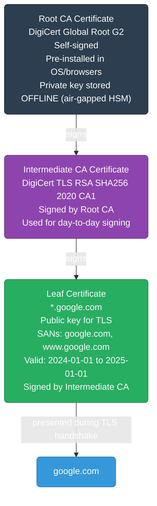

**Certificate fields:**
```
Subject:    CN=*.google.com
Issuer:     CN=DigiCert TLS RSA SHA256 2020 CA1
SANs:       DNS:*.google.com, DNS:google.com
Not Before: 2024-01-15 00:00:00 UTC
Not After:  2025-02-14 23:59:59 UTC
Public Key: EC 256-bit (P-256)
Signature:  SHA256WithRSA
```

**Why 3 levels?** Root CA private keys are air-gapped — never online. Intermediate CA does daily signing. If an intermediate is compromised, revoke it without touching the root. The root change would require every OS/browser to update their trust store.

### Certificate Validation Steps

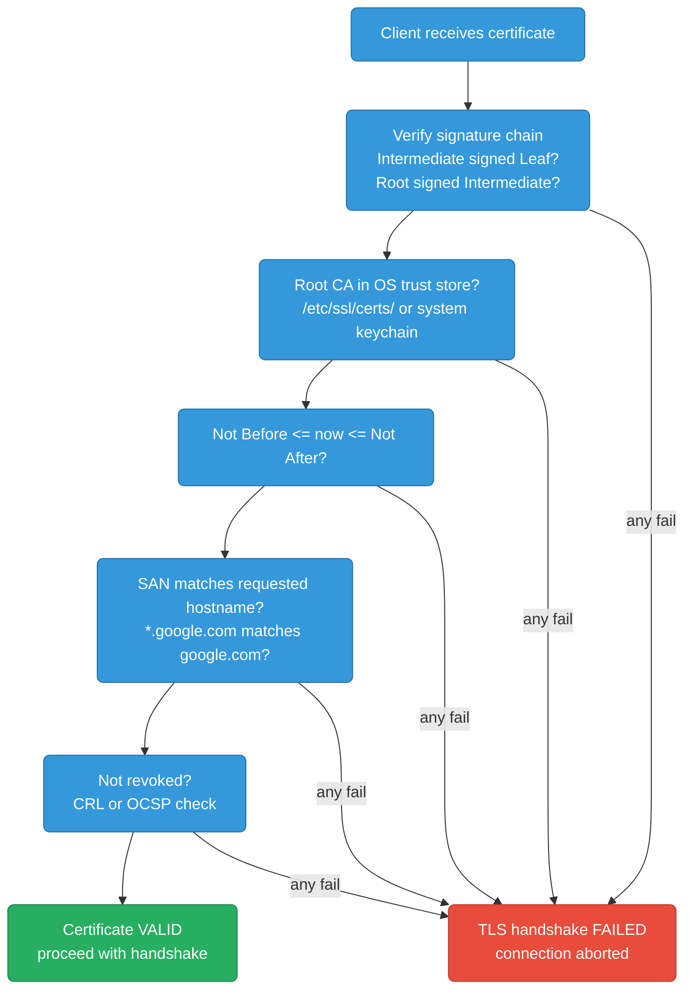

<div class="stepper">
  <div class="stepper-panels">
    <div class="stepper-panel active">
      <strong>1. Verify the signature chain.</strong> Cryptographically confirm the
      intermediate CA's signature on the leaf certificate, and the root CA's
      signature on the intermediate — a broken link anywhere invalidates the whole
      chain.
    </div>
    <div class="stepper-panel">
      <strong>2. Confirm the root is trusted.</strong> Walk up to the root CA
      certificate and check it's one of the roots pre-installed in the OS or
      browser's trust store. A chain that terminates in an unknown root fails here,
      no matter how valid the signatures are.
    </div>
    <div class="stepper-panel">
      <strong>3. Check the validity window.</strong> <code>Not Before &lt;= now &lt;= Not After</code>.
      An expired (or not-yet-valid) certificate fails regardless of who signed it.
    </div>
    <div class="stepper-panel">
      <strong>4. Match the hostname against the SAN.</strong> The Subject Alternative
      Name list — not the legacy CN field — must match the hostname the client
      actually requested (<code>*.google.com</code> matching <code>google.com</code>,
      for example).
    </div>
    <div class="stepper-panel">
      <strong>5. Check revocation status.</strong> A CRL or OCSP lookup confirms the
      CA hasn't revoked this certificate early (private key compromise,
      mis-issuance). Any single failure across all five checks aborts the handshake
      — none of them are optional.
    </div>
  </div>
  <div class="stepper-controls">
    <button class="stepper-prev">← Prev</button>
    <span class="stepper-dots"></span>
    <span class="stepper-label"></span>
    <button class="stepper-next">Next →</button>
  </div>
</div>

<div class="quiz-card">
  <p class="quiz-q">A certificate's signature chain checks out, it's within its validity window, and the SAN matches — but the root CA isn't in the client's trust store. Does the handshake succeed?</p>
  <button class="quiz-reveal">Reveal answer</button>
  <div class="quiz-a" hidden>
    No. Every check — signature chain, trust store membership, validity window, SAN
    match, and revocation status — must pass independently; there's no partial
    credit. An untrusted root fails validation and aborts the TLS handshake even if
    every other check is perfect, which is exactly why self-signed certificates fail
    by default in browsers: the signature is mathematically valid, but the root
    isn't in anyone's trust store.
  </div>
</div>

---

## Debugging TLS

```bash
# Full TLS handshake inspection
openssl s_client -connect google.com:443 -servername google.com
# Shows: cipher, cert chain, handshake details

# Check TLS version and cipher
openssl s_client -connect google.com:443 -tls1_3 2>/dev/null | grep "Protocol\|Cipher"

# Certificate expiry check
openssl s_client -connect google.com:443 2>/dev/null | openssl x509 -noout -dates

# Check all SANs on a certificate
openssl s_client -connect google.com:443 2>/dev/null | openssl x509 -noout -text | grep -A2 "Subject Alternative"

# Test specific TLS version (should fail for 1.0/1.1 on modern servers)
openssl s_client -connect google.com:443 -tls1   # TLS 1.0 — should fail
openssl s_client -connect google.com:443 -tls1_2 # TLS 1.2 — should work
openssl s_client -connect google.com:443 -tls1_3 # TLS 1.3 — should work

# curl with verbose TLS info
curl -v --tlsv1.3 https://google.com 2>&1 | grep -i "TLS\|SSL\|cert\|cipher"
```

---

## Diffie-Hellman Key Exchange — The Mathematics

Diffie-Hellman solves a fundamental problem: **two parties can agree on a shared secret over a public channel without ever transmitting the secret itself**. Anyone eavesdropping sees only public values and cannot derive the secret.

### Classic DH (Finite Field)

**Public parameters (known to everyone, including attackers):**
```
p = a large prime number (e.g., 2048-bit)
g = a generator (primitive root mod p, typically g=2 or g=5)
```

**The exchange:**

```mermaid
sequenceDiagram
    participant A as Alice (Client)
    participant NET as Public Network (attacker can see)
    participant B as Bob (Server)

    Note over A,B: Public params agreed in advance: p=23, g=5

    rect rgb(40, 55, 75)
    Note over A: Private computation — never leaves Alice
    A->>A: Pick secret a=6 (never transmitted)
    A->>A: Compute A = g^a mod p = 5^6 mod 23 = 8
    end
    A->>NET: Send A=8 (public)
    NET->>B: A=8

    rect rgb(40, 55, 75)
    Note over B: Private computation — never leaves Bob
    B->>B: Pick secret b=15 (never transmitted)
    B->>B: Compute B = g^b mod p = 5^15 mod 23 = 19
    end
    B->>NET: Send B=19 (public)
    NET->>A: B=19

    rect rgb(40, 60, 45)
    Note over A,B: Both derive the same secret independently
    A->>A: Shared secret = B^a mod p = 19^6 mod 23 = 2
    B->>B: Shared secret = A^b mod p = 8^15 mod 23 = 2
    Note over A,B: Both computed the same secret = 2
    end

    rect rgb(75, 40, 40)
    Note over NET: Attacker sees p=23, g=5, A=8, B=19<br/>Cannot find secret without solving discrete logarithm
    end
```

**Why it works — the math:**
```
Alice computes: s = B^a mod p = (g^b mod p)^a mod p = g^(ab) mod p
Bob computes:   s = A^b mod p = (g^a mod p)^b mod p = g^(ab) mod p

Both get g^(ab) mod p — the shared secret.
Attacker has A = g^a mod p and B = g^b mod p.
To find a from A = g^a mod p → Discrete Logarithm Problem.
No efficient algorithm known for large p (2048+ bits).
```

**The Discrete Logarithm Problem:** Given `g`, `p`, and `A = g^a mod p`, find `a`. Easy in one direction (exponentiation: fast), computationally infeasible in reverse for large primes.

<div class="quiz-card">
  <p class="quiz-q">The attacker on the public network sees p, g, A, and B — the same public values Alice and Bob exchanged. Why can't they compute the shared secret the same way Alice and Bob do?</p>
  <button class="quiz-reveal">Reveal answer</button>
  <div class="quiz-a" hidden>
    Alice and Bob each compute the shared secret using their own private exponent
    (a or b), which never crosses the network — Alice computes B^a mod p, Bob
    computes A^b mod p. The attacker only has the public values A = g^a mod p and
    B = g^b mod p; recovering a or b from those requires solving the discrete
    logarithm problem, which has no known efficient algorithm for large primes.
    Seeing every publicly exchanged number doesn't help without the private exponent.
  </div>
</div>

---

### ECDH — Elliptic Curve Diffie-Hellman (Used in TLS 1.3)

Classic DH uses modular arithmetic. ECDH uses **points on an elliptic curve** — same mathematical structure, but achieves equivalent security with much smaller keys.

```
Elliptic curve equation: y² = x³ + ax + b  (over a finite field)
```

**Why elliptic curves?**

| Algorithm | Key size for ~128-bit security | Key size for ~256-bit security |
|-----------|-------------------------------|-------------------------------|
| Classic DH (finite field) | 3072 bits | 15360 bits |
| ECDH | 256 bits | 512 bits |
| RSA | 3072 bits | 15360 bits |

Smaller keys → faster computation, smaller TLS handshake messages, less CPU.

**Point multiplication on a curve:**

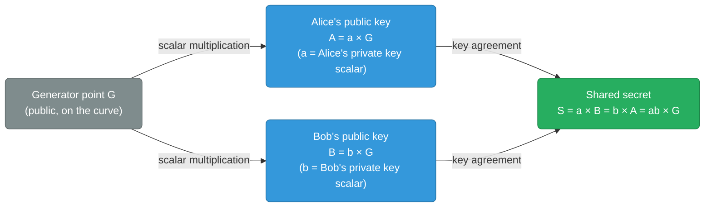

**The math:**
```
Public curve parameters: curve equation + generator point G + field order n

Alice: pick private key a (random integer)
       compute public key A = a × G  (point multiplication on curve)

Bob:   pick private key b (random integer)
       compute public key B = b × G

Alice: shared secret = a × B = a × (b × G) = ab × G
Bob:   shared secret = b × A = b × (a × G) = ab × G

Both get the same point ab × G.
Attacker sees G, A, B. Must find a from A = a × G → Elliptic Curve Discrete Log Problem (ECDLP).
No efficient algorithm known.
```

**Point multiplication** (`a × G`) means: add point G to itself `a` times using the curve's addition law. Repeated doubling makes this O(log a) — fast. Reversing it (finding `a` given `G` and `a × G`) has no known polynomial-time algorithm.

---

### ECDHE — Ephemeral ECDH (what TLS 1.3 actually uses)

ECDHE = ECDH + **Ephemeral**. A new key pair is generated for every TLS session.

```mermaid
sequenceDiagram
    participant C2 as Client
    participant S2 as Server

    Note over C2,S2: TLS 1.3 ECDHE with X25519 curve

    rect rgb(40, 55, 75)
    Note over C2,S2: Generate ephemeral key pairs — fresh every session
    C2->>C2: Generate ephemeral private key c_priv (random, 32 bytes)
    C2->>C2: Compute public key c_pub = c_priv × G
    C2->>S2: ClientHello: key_share = c_pub

    S2->>S2: Generate ephemeral private key s_priv (random, 32 bytes)
    S2->>S2: Compute public key s_pub = s_priv × G
    S2->>S2: Shared secret = s_priv × c_pub = s_priv × c_priv × G
    S2->>C2: ServerHello: key_share = s_pub

    C2->>C2: Shared secret = c_priv × s_pub = c_priv × s_priv × G
    end

    rect rgb(40, 60, 45)
    Note over C2,S2: Both derived same shared secret
    Note over C2,S2: Derive session keys via HKDF:
    Note over C2,S2: client_key = HKDF(shared_secret, "client key")
    Note over C2,S2: server_key = HKDF(shared_secret, "server key")
    end

    rect rgb(75, 40, 40)
    Note over C2: c_priv discarded after handshake
    Note over S2: s_priv discarded after handshake
    Note over C2,S2: Forward secrecy: past sessions unrecoverable
    end
```

**Why "ephemeral" = forward secrecy:**
- Static DH: server uses the same private key for all sessions. Steal the private key → decrypt all past recorded traffic.
- Ephemeral DH: server generates a new private key per session and **discards it after the handshake**. Steal the long-term private key → can only impersonate future connections, cannot decrypt past traffic. Each session's key material is gone forever.

---

### X25519 — The Curve Used in TLS 1.3

TLS 1.3 mandates support for **X25519** (Curve25519). Designed by Daniel J. Bernstein.

```
Curve equation: y² = x³ + 486662x² + x  (over the field of integers mod 2^255 - 19)
Base point G: u = 9
Field size: 2^255 - 19 (a Mersenne-like prime, chosen for fast arithmetic)
Key size: 256 bits
Security level: ~128 bits
```

**Why X25519 over P-256 (NIST)?**

| | X25519 | P-256 (NIST) |
|--|--------|-------------|
| Speed | Faster (~2× on most CPUs) | Slower |
| Side-channel resistance | Designed to resist timing attacks | Vulnerable without careful implementation |
| Standardized by | IETF RFC 7748 | NIST |
| Trust | No NIST involvement (controversial) | NIST-approved |
| TLS 1.3 | Preferred | Supported |

---

### From Shared Secret to Session Keys (HKDF)

The raw ECDHE output (a point on the curve) is not directly used as an AES key. It goes through **HKDF (HMAC-based Key Derivation Function)**:

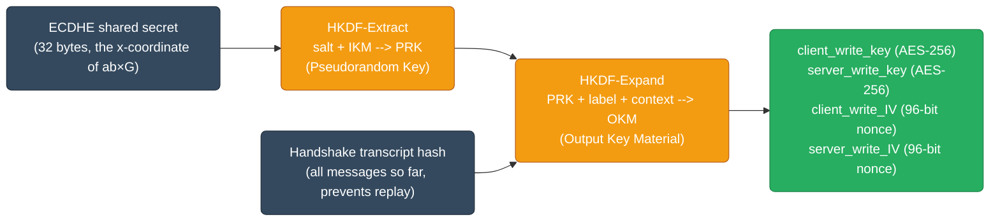

The **transcript hash** binds the keys to this specific handshake — prevents man-in-the-middle attacks where an attacker replays a valid key exchange from a different session.

**Summary of TLS 1.3 key derivation:**
```
ECDHE_secret = s_priv × c_pub  (x-coordinate of the curve point)
early_secret = HKDF-Extract(0, PSK or 0)
handshake_secret = HKDF-Extract(derived(early_secret), ECDHE_secret)
master_secret = HKDF-Extract(derived(handshake_secret), 0)

client_handshake_traffic_secret = HKDF-Expand-Label(handshake_secret, "c hs traffic", transcript_hash)
server_handshake_traffic_secret = HKDF-Expand-Label(handshake_secret, "s hs traffic", transcript_hash)
```

<div class="quiz-card">
  <p class="quiz-q">Why does TLS 1.3 run the raw ECDHE shared secret through HKDF along with a handshake transcript hash, instead of using the shared secret directly as the AES key?</p>
  <button class="quiz-reveal">Reveal answer</button>
  <div class="quiz-a" hidden>
    Two reasons. First, the raw ECDHE output is a curve-point coordinate, not a
    uniformly random 256-bit value suitable as a cipher key — HKDF-Extract turns it
    into a proper pseudorandom key. Second, folding in the transcript hash binds the
    derived keys to this exact handshake's messages, so an attacker can't replay a
    valid key exchange captured from a different session and have it produce usable
    keys elsewhere.
  </div>
</div>

---

## mTLS — Mutual TLS Between Services

Standard TLS: client verifies server's certificate. mTLS: **both sides present and verify certificates**. The server also authenticates the client. This is the foundation of zero-trust service-to-service communication.

### mTLS handshake vs TLS handshake

<div class="toggle-switch">
  <div class="toggle-buttons">
    <button data-toggle-opt="tls" class="active state-warn">TLS (one-way)</button>
    <button data-toggle-opt="mtls" class="state-ok">mTLS (two-way)</button>
  </div>
  <div class="toggle-panel active" data-toggle-panel="tls">
    <pre><code class="language-mermaid">sequenceDiagram
    participant Client
    participant Server

    Client->>Server: ClientHello
    Server->>Client: Certificate (server proves its identity)
    Client->>Client: Verify server certificate chain
    Client->>Server: Key exchange, Finished
    Note over Client,Server: Connection established
    Note over Client,Server: Server identity verified — client remains anonymous</code></pre>
  </div>
  <div class="toggle-panel" data-toggle-panel="mtls">
    <pre><code class="language-mermaid">sequenceDiagram
    participant Client
    participant Server

    Client->>Server: ClientHello
    Server->>Client: Certificate
    Server->>Client: CertificateRequest (server asks for a client cert too)
    Client->>Server: Certificate (client proves its identity)
    Client->>Server: CertificateVerify
    Server->>Server: Verify client certificate against its own CA
    Note over Client,Server: Connection established
    Note over Client,Server: Both sides authenticated</code></pre>
  </div>
</div>

<div class="quiz-card">
  <p class="quiz-q">In standard (one-way) TLS, is the client's identity verified by the server at all?</p>
  <button class="quiz-reveal">Reveal answer</button>
  <div class="quiz-a" hidden>
    No. Standard TLS only has the client verify the server's certificate — the
    server never asks the client to prove who it is, so the client remains
    anonymous at the TLS layer (authentication, if any, happens later at the
    application layer, e.g. a login form or API key). mTLS is what adds the missing
    half: the server sends a <code>CertificateRequest</code> and the client must
    respond with its own certificate and a <code>CertificateVerify</code> before the
    server will consider the connection authenticated on both sides.
  </div>
</div>

### cert-manager — automated certificate lifecycle

cert-manager is a Kubernetes controller that automates issuing, renewing, and rotating TLS certificates from multiple sources (Let's Encrypt, Vault, AWS PCA, self-signed CA).

```bash
# Install cert-manager
kubectl apply -f https://github.com/cert-manager/cert-manager/releases/latest/download/cert-manager.yaml

# Verify
kubectl get pods -n cert-manager
```

**Self-signed CA for internal service mTLS:**
```yaml
# Step 1: Create a self-signed CA certificate
apiVersion: cert-manager.io/v1
kind: ClusterIssuer
metadata:
  name: selfsigned-issuer
spec:
  selfSigned: {}

---
# Step 2: Issue a CA certificate from the self-signed issuer
apiVersion: cert-manager.io/v1
kind: Certificate
metadata:
  name: internal-ca
  namespace: cert-manager
spec:
  isCA: true
  commonName: internal-ca
  secretName: internal-ca-secret
  privateKey:
    algorithm: ECDSA
    size: 256
  issuerRef:
    name: selfsigned-issuer
    kind: ClusterIssuer
    group: cert-manager.io

---
# Step 3: Create a CA issuer that uses this CA to sign service certs
apiVersion: cert-manager.io/v1
kind: ClusterIssuer
metadata:
  name: internal-ca-issuer
spec:
  ca:
    secretName: internal-ca-secret   # references the CA cert Secret above
```

**Issue a service certificate:**
```yaml
apiVersion: cert-manager.io/v1
kind: Certificate
metadata:
  name: payments-tls
  namespace: payments
spec:
  secretName: payments-tls-secret    # cert-manager creates this Secret
  duration: 24h                      # short-lived = more secure
  renewBefore: 8h                    # renew when 8h remain
  dnsNames:
    - payments-svc.payments.svc.cluster.local
    - payments-svc.payments.svc
    - payments-svc
  issuerRef:
    name: internal-ca-issuer
    kind: ClusterIssuer
```

```yaml
# Mount the cert in your pod
spec:
  volumes:
    - name: tls
      secret:
        secretName: payments-tls-secret  # cert-manager keeps this up to date
  containers:
    - name: payments
      volumeMounts:
        - name: tls
          mountPath: /etc/tls
          readOnly: true
      env:
        - name: TLS_CERT_FILE
          value: /etc/tls/tls.crt
        - name: TLS_KEY_FILE
          value: /etc/tls/tls.key
        - name: CA_CERT_FILE
          value: /etc/tls/ca.crt
```

### Implementing mTLS in a Go service

```go
import (
    "crypto/tls"
    "crypto/x509"
    "os"
)

func newMTLSServer(certFile, keyFile, caFile string) (*http.Server, error) {
    // Load our own certificate and key
    cert, err := tls.LoadX509KeyPair(certFile, keyFile)
    if err != nil {
        return nil, err
    }

    // Load the CA that we use to verify client certificates
    caCert, err := os.ReadFile(caFile)
    if err != nil {
        return nil, err
    }
    caPool := x509.NewCertPool()
    caPool.AppendCertsFromPEM(caCert)

    tlsConfig := &tls.Config{
        Certificates: []tls.Certificate{cert},
        ClientAuth:   tls.RequireAndVerifyClientCert,  // enforce mTLS
        ClientCAs:    caPool,
        MinVersion:   tls.VersionTLS13,
    }

    return &http.Server{
        Addr:      ":8443",
        TLSConfig: tlsConfig,
    }, nil
}

func newMTLSClient(certFile, keyFile, caFile string) (*http.Client, error) {
    cert, _ := tls.LoadX509KeyPair(certFile, keyFile)
    caCert, _ := os.ReadFile(caFile)
    caPool := x509.NewCertPool()
    caPool.AppendCertsFromPEM(caCert)

    tlsConfig := &tls.Config{
        Certificates: []tls.Certificate{cert},  // present client cert
        RootCAs:      caPool,                    // verify server cert
        MinVersion:   tls.VersionTLS13,
    }
    return &http.Client{
        Transport: &http.Transport{TLSClientConfig: tlsConfig},
    }, nil
}
```

### Certificate rotation — zero-downtime

cert-manager renews before expiry and updates the Secret. But pods that mounted the Secret at startup have the old cert in memory — they need to reload without restarting.

**Option 1 — watch for file changes:**
```go
// Use inotify/fsnotify to reload certs when Secret is updated
watcher, _ := fsnotify.NewWatcher()
watcher.Add("/etc/tls/tls.crt")
go func() {
    for event := range watcher.Events {
        if event.Op&fsnotify.Write != 0 {
            newCert, _ := tls.LoadX509KeyPair(certFile, keyFile)
            tlsConfig.Certificates = []tls.Certificate{newCert}
            log.Println("TLS certificate rotated")
        }
    }
}()
```

**Option 2 — use `GetCertificate` callback (preferred for servers):**
```go
tlsConfig := &tls.Config{
    GetCertificate: func(*tls.ClientHelloInfo) (*tls.Certificate, error) {
        // Called on every new TLS handshake — always reads the latest cert
        cert, err := tls.LoadX509KeyPair(certFile, keyFile)
        return &cert, err
    },
}
// Existing connections use the old cert; new connections use the new cert.
// No restart required.
```

**Option 3 — Istio/Linkerd handle rotation transparently:**
Service meshes manage cert issuance and rotation for you. Sidecars hold the mTLS identity; your app code makes plain HTTP/gRPC calls; the sidecar wraps them in mTLS. Rotation is invisible to the app.

<div class="quiz-card">
  <p class="quiz-q">A server uses the <code>GetCertificate</code> callback for zero-downtime rotation. The cert file on disk just got renewed by cert-manager. Do connections that were already established before the renewal start using the new certificate?</p>
  <button class="quiz-reveal">Reveal answer</button>
  <div class="quiz-a" hidden>
    No. <code>GetCertificate</code> is only invoked on a new TLS handshake — an
    already-established connection negotiated its certificate once, at connection
    time, and keeps using that same cert for its lifetime. Only new connections made
    after the rotation will trigger <code>GetCertificate</code> again and pick up the
    fresh cert from disk. This is exactly why it's "zero-downtime": nothing has to
    restart or drop existing connections, but the effect of a rotation is only fully
    visible once old connections naturally cycle out.
  </div>
</div>

### Let's Encrypt with cert-manager (public services)

```yaml
apiVersion: cert-manager.io/v1
kind: ClusterIssuer
metadata:
  name: letsencrypt-prod
spec:
  acme:
    email: ops@myorg.com
    server: https://acme-v02.api.letsencrypt.org/directory
    privateKeySecretRef:
      name: letsencrypt-prod-key
    solvers:
      - http01:                        # HTTP-01 challenge (port 80 reachable)
          ingress:
            class: nginx
      # Alternative: DNS-01 challenge (for wildcard certs / internal clusters)
      - dns01:
          route53:
            region: us-east-1
            hostedZoneID: Z123456789
            role: arn:aws:iam::123456789:role/cert-manager-dns

---
# Use the issuer in an Ingress annotation
apiVersion: networking.k8s.io/v1
kind: Ingress
metadata:
  annotations:
    cert-manager.io/cluster-issuer: letsencrypt-prod
spec:
  tls:
    - hosts: [api.example.com]
      secretName: api-tls-cert    # cert-manager auto-creates and renews this
  rules:
    - host: api.example.com
      ...
```

### Debugging TLS/mTLS issues

```bash
# Test TLS connection and inspect certificate chain
openssl s_client -connect payments-svc:8443 \
  -servername payments-svc.payments.svc.cluster.local \
  -showcerts 2>/dev/null | openssl x509 -noout -text

# Test mTLS (present client cert)
openssl s_client -connect payments-svc:8443 \
  -cert /etc/tls/tls.crt \
  -key /etc/tls/tls.key \
  -CAfile /etc/tls/ca.crt

# Check cert expiry
openssl x509 -in /etc/tls/tls.crt -noout -dates
# notBefore=Jun  1 00:00:00 2026 GMT
# notAfter=Jun  2 00:00:00 2026 GMT  ← short-lived, 24h

# Check cert-manager certificate status
kubectl describe certificate payments-tls -n payments
# Conditions:
#   Ready: True   ← cert issued and valid
#   Ready: False  reason: Failed  ← look at Events for CA/DNS errors

# Check cert-manager logs for failures
kubectl logs -n cert-manager \
  -l app.kubernetes.io/component=controller --tail=100

# List all certificates and their expiry
kubectl get certificates -A
# NAME           READY   SECRET               AGE
# payments-tls   True    payments-tls-secret  2d
```
