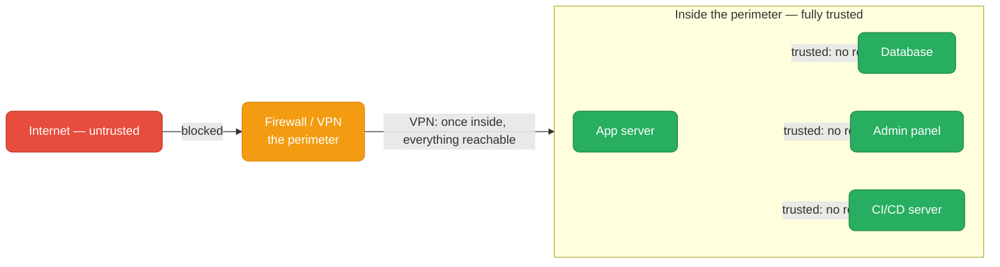
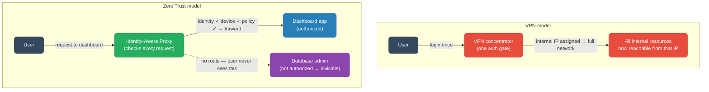
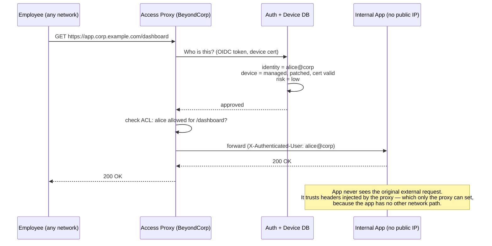
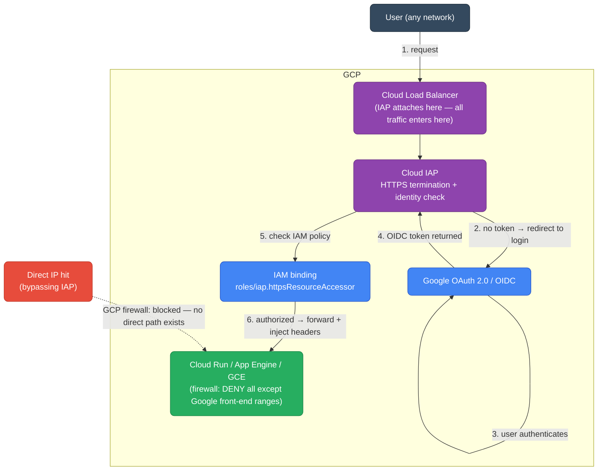
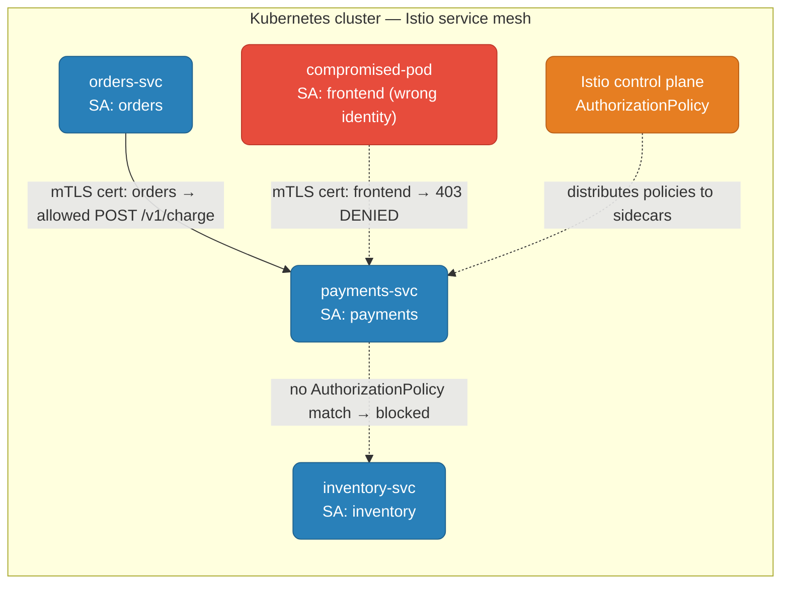
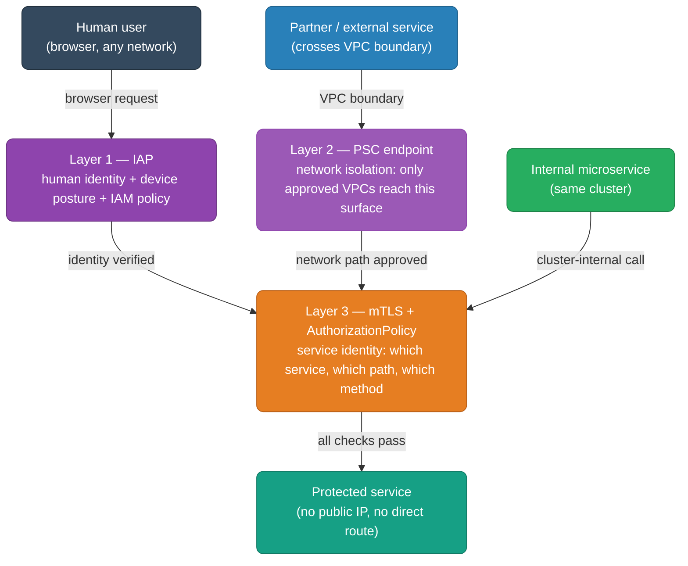

# Zero Trust Network Access (ZTNA)

From perimeter-based VPN security to per-request identity verification — the model that eliminates the concept of a trusted internal network.

<div class="quiz-progress" data-quiz-progress>
  <span class="quiz-progress-label">0/0 checks</span>
  <span class="quiz-progress-bar"><span class="quiz-progress-fill"></span></span>
</div>

---

## 1. The Problem With Perimeter Security

Traditional network security draws a hard boundary — everything inside the firewall is trusted, everything outside is not. Once you're on the VPN, on-prem, or in a peered VPC, you're fully trusted.



**The flaw:** network location is used as a proxy for identity. One phished credential, one rogue contractor, one misconfigured firewall rule — and the attacker is inside and can move laterally to anything.

<div class="quiz-card">
  <p class="quiz-q">An employee's VPN credentials are phished. Under the perimeter model, what can the attacker reach once they're connected?</p>
  <button class="quiz-reveal">Reveal answer</button>
  <div class="quiz-a" hidden>Everything on the internal network the VPN profile isn't explicitly firewalled from — which in practice is usually most of it. The perimeter model grants network-level trust on login; it doesn't re-verify identity per resource, per request, or based on what the user is actually trying to do. The attacker is just another "trusted" internal IP, indistinguishable from a legitimate employee.</div>
</div>

---

## 2. Zero Trust: "Never Trust, Always Verify"

Zero Trust replaces network location as a trust signal with **identity + device health + context**, verified on every single request.

<div class="tab-group">
  <div class="tab-buttons">
    <button data-tab="perimeter" class="active">Perimeter model</button>
    <button data-tab="zerotrust">Zero Trust model</button>
  </div>
  <div class="tab-panels">
    <div class="tab-panel active" data-tab-panel="perimeter">
      <strong>One-time check at the boundary.</strong> The firewall or VPN concentrator checks credentials once at login. After that, the session is trusted — subsequent requests don't re-verify who you are or what you're allowed to do. The implicit assumption: "if you got past the perimeter, you belong here."
    </div>
    <div class="tab-panel" data-tab-panel="zerotrust">
      <strong>Per-request check, every time.</strong> Every request — whether from inside the office LAN or a home WiFi — passes through an identity-aware proxy that verifies: who are you (identity), is your device healthy (device posture), does policy allow this specific action (authorization). No session is implicitly trusted; access to one resource grants nothing else.
    </div>
  </div>
</div>

### Three signals checked on every request

<div class="stepper">
  <div class="stepper-panels">
    <div class="stepper-panel active">
      <strong>1. Identity — who are you?</strong> The user or service must present a verifiable identity token: an OIDC JWT from a trusted IdP (Google, Okta, Azure AD) for humans, or an mTLS certificate with a SPIFFE URI for services. Network location — IP address, VPN subnet — is not identity.
    </div>
    <div class="stepper-panel">
      <strong>2. Device health — is your device trusted?</strong> A managed device database checks whether the machine has a valid device certificate, is running an approved OS version, has disk encryption enabled, and has installed recent security patches. A compromised or unmanaged device fails this check even if the identity is valid.
    </div>
    <div class="stepper-panel">
      <strong>3. Context — does this make sense right now?</strong> Risk signals like time of day, geographic location (impossible travel), or behavioral anomaly scoring feed a policy engine. A valid identity on a healthy device still gets blocked if the access pattern looks wrong — e.g., a finance team member suddenly requesting the production database at 3 AM from a new country.
    </div>
    <div class="stepper-panel">
      <strong>4. Authorization — is this specific action allowed?</strong> Even if all three above pass, the policy engine checks: does this identity have the IAM role (or Istio AuthorizationPolicy, or OPA rule) to perform <em>this operation</em> on <em>this resource</em>? Access is granted per operation, not per session. Accessing the dashboard grants nothing to the admin panel.
    </div>
  </div>
  <div class="stepper-controls">
    <button class="stepper-prev">← Prev</button>
    <span class="stepper-dots"></span>
    <span class="stepper-label"></span>
    <button class="stepper-next">Next →</button>
  </div>
</div>

<div class="quiz-card">
  <p class="quiz-q">Under Zero Trust, does a user connecting from the office network get more access than one connecting from home WiFi?</p>
  <button class="quiz-reveal">Reveal answer</button>
  <div class="quiz-a" hidden>No — that's the whole point. Zero Trust eliminates network location as a trust signal. Both the office LAN user and the home WiFi user hit the same identity-aware proxy, get the same identity + device + context + authorization checks, and get access to exactly what their policy allows — nothing more. Where you're connecting from is one context signal among many, not a gate that unlocks the network.</div>
</div>

---

## 3. VPN vs ZTNA

<div class="toggle-switch">
  <div class="toggle-buttons">
    <button data-toggle-opt="vpn" class="active state-warn">VPN (perimeter)</button>
    <button data-toggle-opt="ztna" class="state-ok">ZTNA</button>
  </div>
  <div class="toggle-panel active" data-toggle-panel="vpn">
    <strong>Authenticate once → get a full network address on the internal subnet.</strong> The VPN concentrator verifies credentials, assigns an internal IP, and the device is now a first-class citizen of the internal network. Every server, database, and admin tool is routable from that IP — individual services don't know or re-verify who you are. Lateral movement after compromise requires only that you're on the VPN.
  </div>
  <div class="toggle-panel" data-toggle-panel="ztna">
    <strong>Authenticate per request → get a forwarded connection to one specific resource.</strong> No VPN tunnel, no joining the internal network. Every request hits an identity-aware proxy that re-verifies your identity and device health before forwarding to the one application you asked for. Other applications are not just blocked — they're invisible and unreachable. Compromising one session grants nothing to adjacent services.
  </div>
</div>



| | VPN | ZTNA |
|---|---|---|
| **Trust scope** | Network-wide once inside | Per-resource, per-request |
| **Auth frequency** | Once at VPN login | Every request |
| **Lateral movement** | Easy — full subnet access | Hard — each resource requires its own authorization |
| **Visibility to attacker** | All internal IPs reachable | Only the authorized resource is reachable |
| **Client experience** | VPN software, tunnel, routing conflicts | Browser or lightweight agent, often transparent |
| **App changes required** | None — apps see VPN IPs as normal | Trust injected headers; verify signed JWT |
| **Best for** | Legacy TCP apps, L3 access requirements | Web apps, APIs, internal tools, cloud-native |

<div class="quiz-card">
  <p class="quiz-q">A session token is stolen from a ZTNA-protected internal tool. What can the attacker do with it compared to a stolen VPN credential?</p>
  <button class="quiz-reveal">Reveal answer</button>
  <div class="quiz-a" hidden>With ZTNA, the stolen session token only gets the attacker access to the one resource it was scoped to — the same tool the real user was authenticated for. Every other internal service is behind its own separate identity check, and the stolen token doesn't help there. With VPN, a stolen credential puts the attacker on the full internal network — every service, database, and admin tool that isn't separately firewalled is now reachable from that IP.</div>
</div>

---

## 4. BeyondCorp — The Origin

Google published BeyondCorp in 2014 after Operation Aurora demonstrated that perimeter security couldn't stop a compromised internal machine. The core insight:

> Move access controls from the network perimeter to individual devices and users.

Three components BeyondCorp identified as necessary:

<div class="stepper">
  <div class="stepper-panels">
    <div class="stepper-panel active">
      <strong>1. Device inventory service.</strong> A continuously updated database of all managed devices — OS version, patch level, disk encryption status, managed certificate presence. Every access request is checked against this database. An unmanaged personal device or an out-of-date laptop fails the device check regardless of who owns it.
    </div>
    <div class="stepper-panel">
      <strong>2. Identity provider.</strong> OIDC/SAML-backed identity (Google Workspace in Google's case) proves <em>who</em> is requesting, not just <em>what network</em> they're on. Users authenticate with their managed identity, receiving a short-lived token that encodes their identity and device posture.
    </div>
    <div class="stepper-panel">
      <strong>3. Access proxy.</strong> The enforcement point — always in the path, never bypassable. Every request to any internal resource goes through this proxy. It checks the identity token + device posture, evaluates the access control policy for the specific resource being requested, and either forwards the request or returns 403. Applications are never directly reachable.
    </div>
  </div>
  <div class="stepper-controls">
    <button class="stepper-prev">← Prev</button>
    <span class="stepper-dots"></span>
    <span class="stepper-label"></span>
    <button class="stepper-next">Next →</button>
  </div>
</div>



<div class="quiz-card">
  <p class="quiz-q">In the BeyondCorp model, a developer's laptop is company-issued but hasn't received a security patch for 30 days. They have valid credentials. Are they granted access?</p>
  <button class="quiz-reveal">Reveal answer</button>
  <div class="quiz-a" hidden>Depends on the policy, but typically no — or they get access to a reduced set of resources. The device inventory check runs independently of identity; a policy can say "must be managed AND patched within 14 days" so that valid credentials on a stale device still fail. This is intentional: an unpatched device with valid credentials is itself a risk vector, and BeyondCorp treats device health as a first-class input to the access decision, not a secondary concern.</div>
</div>

---

## 5. GCP Implementation: Identity-Aware Proxy (IAP)

GCP's IAP is Google's managed BeyondCorp-style proxy. Put your app behind IAP and only authenticated, authorized Google identities can reach it — no VPN required.



**What your app receives** — headers IAP injects that only IAP can set (because the app has no other inbound path):

```
X-Goog-Authenticated-User-Email: accounts.google.com:alice@corp.com
X-Goog-Authenticated-User-Id:    accounts.google.com:123456789
X-Goog-Iap-Jwt-Assertion:        <signed JWT — verify this, not the raw email header>
```

**Setup walkthrough:**

<div class="stepper">
  <div class="stepper-panels">
    <div class="stepper-panel active">
      <strong>1. Lock down direct access.</strong> Configure the app's ingress to only accept traffic from Google's front-end IP ranges (<code>130.211.0.0/22</code>, <code>35.191.0.0/16</code>). This makes IAP the only path — if someone tries to hit the VM's IP directly, the firewall drops it before it gets anywhere near the app.
    </div>
    <div class="stepper-panel">
      <strong>2. Place an HTTPS Load Balancer in front.</strong> IAP attaches to an LB backend service, not directly to a VM or Cloud Run service. Create a global HTTPS LB that forwards to your app, then enable IAP on that backend service via the Cloud Console or gcloud.
    </div>
    <div class="stepper-panel">
      <strong>3. Enable IAP on the backend service.</strong> <code>gcloud compute backend-services update my-backend --iap=enabled,oauth2-client-id=...,oauth2-client-secret=...</code>. IAP creates an OAuth 2.0 client that redirects unauthenticated users to Google login. Authenticated users receive a short-lived OIDC token that IAP validates on every subsequent request.
    </div>
    <div class="stepper-panel">
      <strong>4. Grant access via IAM.</strong> No user can reach the app until they have the <code>roles/iap.httpsResourceAccessor</code> binding on the backend service. Grant it to individuals, groups, or domains. The backend service itself becomes the access boundary — different backends can have different IAM policies.
    </div>
    <div class="stepper-panel">
      <strong>5. Verify the JWT in app code.</strong> The email header is plain text — trivially forgeable if anyone ever bypasses IAP. Verify <code>X-Goog-Iap-Jwt-Assertion</code> instead: it's a signed JWT only Google's private key can produce. Any request with a forged header but no valid JWT should be rejected at the app layer as a defense-in-depth measure.
    </div>
  </div>
  <div class="stepper-controls">
    <button class="stepper-prev">← Prev</button>
    <span class="stepper-dots"></span>
    <span class="stepper-label"></span>
    <button class="stepper-next">Next →</button>
  </div>
</div>

```bash
# Step 1: Restrict ingress to Google front-end IPs only
gcloud compute firewall-rules create allow-google-lb-only \
  --network=my-vpc \
  --action=ALLOW \
  --rules=tcp:8080 \
  --source-ranges=130.211.0.0/22,35.191.0.0/16 \
  --target-tags=app-server

# Step 2: Enable IAP on the backend service (OAuth client already created in Console)
gcloud compute backend-services update my-backend-service \
  --global \
  --iap=enabled,oauth2-client-id=CLIENT_ID.apps.googleusercontent.com,oauth2-client-secret=SECRET

# Step 3: Grant a user access
gcloud iap web add-iam-policy-binding \
  --resource-type=backend-services \
  --service=my-backend-service \
  --member=user:alice@corp.com \
  --role=roles/iap.httpsResourceAccessor

# Step 4: Grant a whole Google Group access
gcloud iap web add-iam-policy-binding \
  --resource-type=backend-services \
  --service=my-backend-service \
  --member=group:engineers@corp.com \
  --role=roles/iap.httpsResourceAccessor

# Verify who currently has access
gcloud iap web get-iam-policy \
  --resource-type=backend-services \
  --service=my-backend-service
```

**Verifying the JWT in Go (defense-in-depth):**

```go
import (
    "context"
    "fmt"
    "net/http"

    "google.golang.org/api/idtoken"
)

// audience format:
//   App Engine:        /projects/<project-number>/apps/<project-id>
//   HTTPS LB backend:  /projects/<project-number>/global/backendServices/<backend-id>
func verifyIAP(r *http.Request, audience string) (email string, err error) {
    jwt := r.Header.Get("X-Goog-Iap-Jwt-Assertion")
    if jwt == "" {
        return "", fmt.Errorf("missing IAP JWT — request did not come through IAP")
    }
    payload, err := idtoken.Validate(context.Background(), jwt, audience)
    if err != nil {
        return "", fmt.Errorf("invalid IAP JWT: %w", err)
    }
    email, _ = payload.Claims["email"].(string)
    return email, nil
}
```

<div class="quiz-card">
  <p class="quiz-q">A developer curl-s your IAP-protected endpoint and manually sets <code>X-Goog-Authenticated-User-Email: admin@corp.com</code>. They skip the IAP auth flow entirely. Does this succeed?</p>
  <button class="quiz-reveal">Reveal answer</button>
  <div class="quiz-a" hidden>Not if you've done both layers correctly. First, the firewall rule should block any direct access to the VM — only Google's front-end IP ranges can reach it, so a curl directly to the VM IP never arrives. Second, even if traffic somehow reached the app (e.g. a misconfigured firewall), the app should verify X-Goog-Iap-Jwt-Assertion — a signed JWT that only Google can produce. A request with a spoofed email header but no valid JWT would be rejected. The email header alone is never sufficient; always verify the signed JWT.</div>
</div>

---

## 6. ZTNA for Service-to-Service (Not Just Humans)

Zero Trust isn't only for human → app traffic. Service-to-service calls inside a cluster also need per-request identity — this is exactly where mTLS fits.

<div class="toggle-switch">
  <div class="toggle-buttons">
    <button data-toggle-opt="without" class="active state-warn">Without mTLS (implicit trust)</button>
    <button data-toggle-opt="with" class="state-ok">With mTLS + AuthorizationPolicy</button>
  </div>
  <div class="toggle-panel active" data-toggle-panel="without">
    Services communicate over plain HTTP inside the cluster. Any pod that can reach the payments service's ClusterIP can call any endpoint on it. A compromised pod — say, a dependency with a supply-chain backdoor — can call <code>POST /v1/charge</code> freely. Network policies help but are coarse; there's no per-service identity, only IP ranges.
  </div>
  <div class="toggle-panel" data-toggle-panel="with">
    Every pod has an Envoy sidecar that automatically wraps all traffic in mTLS, using a SPIFFE certificate tied to the pod's Kubernetes ServiceAccount. The payments service's AuthorizationPolicy says only the <code>orders</code> service account is allowed to call <code>POST /v1/charge</code>. A compromised pod with a different service account gets a 403 at the sidecar — before any app code runs.
  </div>
</div>



**The AuthorizationPolicy that enforces this:**

```yaml
apiVersion: security.istio.io/v1beta1
kind: AuthorizationPolicy
metadata:
  name: payments-allow-orders-only
  namespace: default
spec:
  selector:
    matchLabels:
      app: payments
  action: ALLOW
  rules:
    - from:
        - source:
            # mTLS identity derived from the ServiceAccount cert — not IP, not label
            principals:
              - "cluster.local/ns/default/sa/orders"
      to:
        - operation:
            methods: ["POST"]
            paths: ["/v1/charge", "/v1/refund"]
```

<div class="stepper">
  <div class="stepper-panels">
    <div class="stepper-panel active">
      <strong>1. Istio issues SPIFFE certificates automatically.</strong> The Istio CA issues a short-lived X.509 certificate to every pod's sidecar. The certificate's SAN URI is <code>spiffe://cluster.local/ns/&lt;namespace&gt;/sa/&lt;serviceaccount&gt;</code> — encoding the pod's Kubernetes identity, not its IP.
    </div>
    <div class="stepper-panel">
      <strong>2. Sidecars automatically wrap all traffic in mTLS.</strong> No application code changes — the Envoy sidecar intercepts outbound calls from the pod and incoming requests to the pod, handling the TLS handshake transparently. The <code>orders</code> pod thinks it's making a plain HTTP call; its sidecar is actually presenting an mTLS certificate with its SPIFFE identity.
    </div>
    <div class="stepper-panel">
      <strong>3. The payments sidecar checks the AuthorizationPolicy.</strong> On every inbound request, the payments pod's sidecar extracts the peer certificate's SPIFFE URI and matches it against the AuthorizationPolicy. If the principal isn't <code>orders</code>, or the path/method don't match, the sidecar returns 403 before forwarding to the payments app.
    </div>
    <div class="stepper-panel">
      <strong>4. The compromised pod's identity gives it away.</strong> Even if the compromised pod calls the same ClusterIP and port, its sidecar presents its own certificate (<code>sa/frontend</code> or whatever it runs as). The payments sidecar sees a principal that isn't in the ALLOW list and blocks it — without any change to the payments application itself.
    </div>
  </div>
  <div class="stepper-controls">
    <button class="stepper-prev">← Prev</button>
    <span class="stepper-dots"></span>
    <span class="stepper-label"></span>
    <button class="stepper-next">Next →</button>
  </div>
</div>

<div class="quiz-card">
  <p class="quiz-q">A pod running in the same Kubernetes namespace as the payments service is compromised. It calls the payments ClusterIP directly on port 8080. What stops it?</p>
  <button class="quiz-reveal">Reveal answer</button>
  <div class="quiz-a" hidden>The Istio sidecar on the payments pod. Istio's PeerAuthentication can enforce STRICT mTLS on the namespace — any traffic not wrapped in a valid mTLS certificate from the cluster's CA is dropped. Even with a valid cert, the AuthorizationPolicy checks the SPIFFE principal in that cert. If the compromised pod's service account isn't in the allow-list, the sidecar returns 403 before the payments app sees the request. Network policies (if configured) add a layer, but they work on IP ranges — the mTLS + AuthorizationPolicy is what provides per-identity enforcement.</div>
</div>

---

## 7. How ZTNA, mTLS, and PSC Compose

These three tools aren't alternatives — they're layers of the same architecture, each blocking a different attacker path:



<div class="stepper">
  <div class="stepper-panels">
    <div class="stepper-panel active">
      <strong>Layer 1 — PSC (network isolation).</strong> Only VPCs that have been explicitly approved and created a PSC endpoint can even reach the service's network surface. External VPCs, the public internet, and unapproved networks are blocked at this layer — they don't get to attempt a connection, let alone authenticate.
    </div>
    <div class="stepper-panel">
      <strong>Layer 2 — IAP (human identity).</strong> For human browser traffic, IAP intercepts every request, redirects unauthenticated users to OIDC login, checks device posture (with BeyondCorp Enterprise), evaluates IAM policy for the specific backend, and injects a signed JWT that the app can trust. A stolen session cookie from user A gives access to nothing else.
    </div>
    <div class="stepper-panel">
      <strong>Layer 3 — mTLS + AuthorizationPolicy (service identity).</strong> For service-to-service traffic that made it through the network layer, each service's Istio sidecar verifies the peer's SPIFFE certificate and matches it against an AuthorizationPolicy. Even a compromised pod with a valid cert gets blocked if its service account isn't in the allow-list for the specific path and method.
    </div>
    <div class="stepper-panel">
      <strong>What each layer blocks.</strong> PSC stops: random internet, unapproved VPCs. IAP stops: unauthenticated humans, unauthorized employees, stolen VPN credentials. mTLS stops: compromised pods, over-privileged services, lateral movement after a service breach. No single layer stops all of these — you need all three for a complete posture.
    </div>
  </div>
  <div class="stepper-controls">
    <button class="stepper-prev">← Prev</button>
    <span class="stepper-dots"></span>
    <span class="stepper-label"></span>
    <button class="stepper-next">Next →</button>
  </div>
</div>

| Layer | Tool | What it verifies | Blocks |
|---|---|---|---|
| **Network isolation** | PSC / firewall | Only approved VPCs/IPs can connect | Internet, unapproved VPCs |
| **Human identity** | IAP (BeyondCorp) | Who the human is, device health, IAM role | Stolen VPN creds, unauthorized employees |
| **Service identity** | mTLS + Istio AuthPolicy | Which service calls which path/method | Compromised pods, lateral movement, over-privileged services |

<div class="quiz-card">
  <p class="quiz-q">Your payments service has all three layers. A pod inside the cluster is compromised — same namespace, same cluster. PSC doesn't apply (same cluster). IAP doesn't apply (not human). What stops it?</p>
  <button class="quiz-reveal">Reveal answer</button>
  <div class="quiz-a" hidden>mTLS + the Istio AuthorizationPolicy. The compromised pod's Envoy sidecar presents its own SPIFFE certificate (tied to its ServiceAccount). The payments sidecar checks that certificate's principal against the AuthorizationPolicy — if the compromised pod's service account isn't in the allow-list, the connection is rejected at the sidecar layer before any application code runs. This is the entire reason you need layer 3 even when layers 1 and 2 are in place: they don't help against an already-inside attacker.</div>
</div>

---

## 8. Debugging

```bash
# ── IAP ──────────────────────────────────────────────────────────────────

# Who currently has IAP access to a backend?
gcloud iap web get-iam-policy \
  --resource-type=backend-services \
  --service=my-backend-service

# Test if YOUR token can reach an IAP-protected endpoint
TOKEN=$(gcloud auth print-identity-token)
curl -H "Authorization: Bearer $TOKEN" https://app.corp.example.com/

# Decode the JWT the app receives (useful for seeing exact claims)
# Paste the X-Goog-Iap-Jwt-Assertion value at jwt.io

# ── Istio mTLS ───────────────────────────────────────────────────────────

# Check what mTLS certificates a pod currently holds
istioctl proxy-config secret <pod-name> -n <namespace>

# Check if mTLS is enforced end-to-end between two services
istioctl authn tls-check <pod-name>.<namespace> payments.<namespace>.svc.cluster.local

# See who got 403 DENIED in the payments sidecar access log
kubectl logs <payments-pod> -c istio-proxy | grep '"response_code":"403"'

# Check which AuthorizationPolicies apply to a pod
istioctl x authz check <pod-name> -n <namespace>

# ── PSC ──────────────────────────────────────────────────────────────────

# Check a PSC endpoint's connection status (consumer side)
gcloud compute forwarding-rules describe my-psc-endpoint \
  --region=us-central1 \
  --format="table(name,IPAddress,pscConnectionStatus)"

# Check Service Attachment for pending/active consumer connections (producer side)
gcloud compute service-attachments describe my-service-attachment \
  --region=us-central1 \
  --format="table(connectedEndpoints[].status,connectedEndpoints[].endpoint)"
```

---

## Quick Reference

| Concept | What it does | GCP tool | Alternatives |
|---|---|---|---|
| **Identity-Aware Proxy** | Per-request human auth, no VPN | Cloud IAP | Cloudflare Access, Tailscale, Pomerium |
| **Service identity** | Per-request machine auth (mTLS cert) | Istio / Workload Identity | Linkerd, SPIFFE/SPIRE |
| **Network isolation** | Surgical single-service exposure | PSC | AWS PrivateLink |
| **Device trust** | Managed + healthy endpoint check | BeyondCorp Enterprise | Jamf + Okta Device Trust |
| **Policy engine** | Unified allow/deny decisions | IAM + IAP conditions + AuthorizationPolicy | OPA/Gatekeeper |
