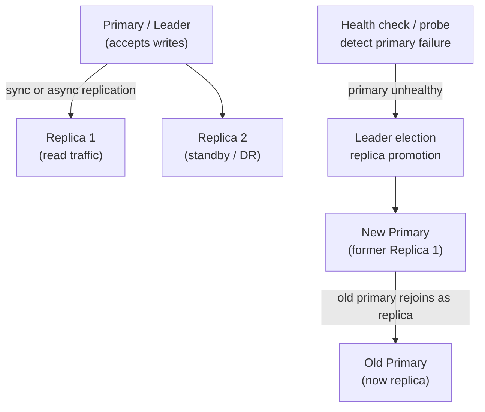
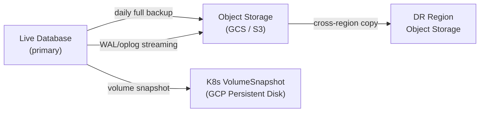

# Databases on Kubernetes (GKE / On-Prem)

Running stateful databases on Kubernetes — system design, replication, failover, snapshots, and operational patterns for each database.

  0/0 checks
  

## Why Run DBs on K8s?

Running databases on Kubernetes is operationally harder than managed services (Cloud SQL, RDS) but gives you:
- **Cost control** — no managed service markup (3-5× cheaper at scale)
- **Portability** — same setup on GKE, EKS, on-prem
- **Customization** — specific versions, plugins, tuning impossible in managed offerings
- **Data residency** — compliance requirements that forbid managed cloud DBs

**When NOT to run DBs on K8s:** Small teams, < 3 engineers who understand K8s storage, or when managed services fit your compliance requirements. Operational burden is real.

  
A 2-engineer team wants Postgres on K8s to avoid the managed-service markup. Good idea?

  <button class="quiz-reveal">Reveal answer</button>
  

    Probably not yet. The cost savings are real, but running stateful DBs on
    K8s (storage, failover, backups) needs engineers who already understand
    K8s storage — a team under 3 such engineers usually pays for that gap in
    outages, not cash saved.
  

## Files

| File | Database | Topics |
|------|----------|--------|
| [postgres.md](./postgres.md) | PostgreSQL | StatefulSet, Patroni HA, sync/async replication, automatic failover, PITR, pgbackup |
| [mysql.md](./mysql.md) | MySQL | Operator, InnoDB Cluster, semi-sync replication, master promotion, XtraBackup |
| [mongodb.md](./mongodb.md) | MongoDB | Replica set on K8s, elections, oplog, readPreference, mongodump/mongorestore |
| [redis-cluster.md](./redis-cluster.md) | Redis Cluster | Sharding, slot distribution, sentinel vs cluster, persistence (RDB/AOF), failover |
| [kafka.md](./kafka.md) | Apache Kafka | Strimzi operator, partition replication, ISR, leader election, consumer groups |
| [clickhouse.md](./clickhouse.md) | ClickHouse | ClickHouse Operator, sharding, replication via ZooKeeper/ClickHouse Keeper, backups |

## Common Patterns Across All DBs

### Sync vs Async Replication

  

    <button data-tab="sync" class="active">Synchronous</button>
    <button data-tab="async">Asynchronous</button>
  

  

    

      
<strong>Write completes when:</strong> the primary AND at least one replica confirm the write.

      
<strong>Data loss on failover:</strong> zero — the replica already has everything the primary had.

      
<strong>Write latency:</strong> higher — every write waits on a round trip to the replica.

      
<strong>Replica lag:</strong> zero, by construction.

      
<strong>Use case:</strong> financial data, and anything else where losing a committed write is not an option.

    

    

      
<strong>Write completes when:</strong> the primary confirms; replicas catch up afterward.

      
<strong>Data loss on failover:</strong> up to the replication lag — seconds to minutes of writes can vanish.

      
<strong>Write latency:</strong> lower — the primary never waits on a replica.

      
<strong>Replica lag:</strong> can fall behind under load or network pressure.

      
<strong>Use case:</strong> read replicas, analytics, DR copies where a little staleness is acceptable.

    

  

  
Your replica is 40 seconds behind the primary under async replication, and the primary just died. What happens to the last 40 seconds of writes?

  <button class="quiz-reveal">Reveal answer</button>
  

    They're gone. Async replication only guarantees the primary accepted the
    write — not that any replica has it yet. Whatever hadn't shipped in that
    40-second lag window is lost the moment the primary becomes unavailable.
  

### Snapshot Strategy (3-2-1 Rule)

  

    

      <strong>1. Full snapshot.</strong> Daily full backup of the primary, retained for 7 days.
    

    

      <strong>2. Continuous incremental.</strong> WAL (Postgres) or oplog (MongoDB) streamed continuously,
      enabling point-in-time recovery (PITR) between full snapshots.
    

    

      <strong>3. Cross-region copy.</strong> At least one copy of every backup lives in a different
      region or zone than the primary — the "1 offsite" in 3-2-1.
    

    

      <strong>4. Test restore.</strong> A weekly automated restore, run end-to-end. An untested
      backup is not a backup.
    

  

  

    <button class="stepper-prev">← Prev</button>
    
    
    <button class="stepper-next">Next →</button>
  

  
You have a daily full snapshot and continuous WAL streaming, but you've never actually restored from either. Are you covered?

  <button class="quiz-reveal">Reveal answer</button>
  

    No. An untested backup is not a backup — corruption, missing permissions,
    or a broken restore script only surface when you actually try to recover,
    which is exactly the worst time to discover it. That's why the 3-2-1
    strategy includes a weekly automated restore test as a required step, not
    an optional one.
  

