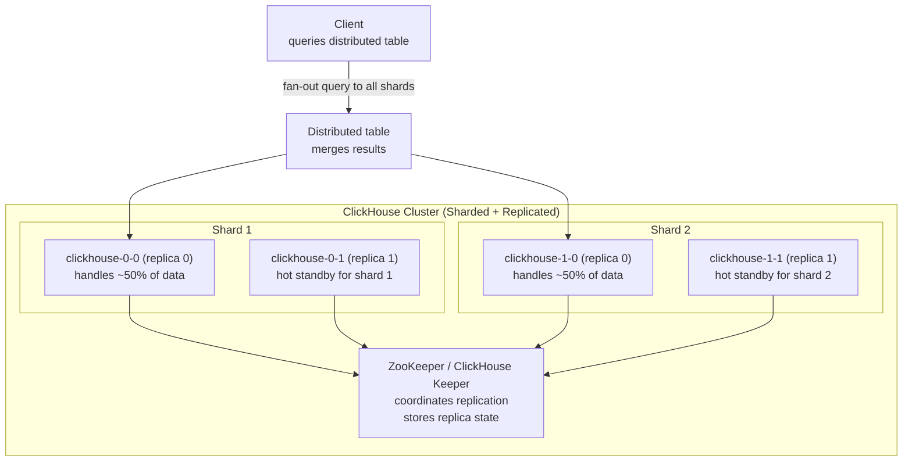
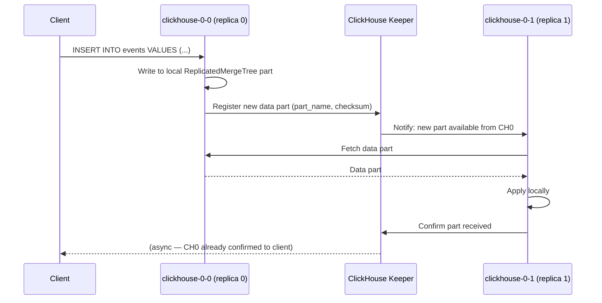
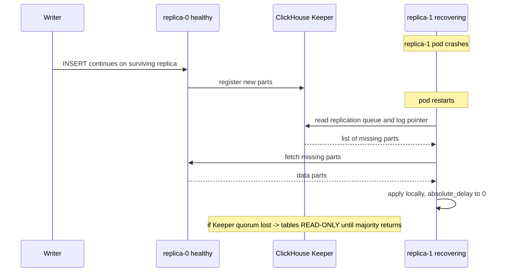

# ClickHouse on Kubernetes

Running ClickHouse as a sharded, replicated cluster on Kubernetes via the Altinity Operator — multi-master replication through ClickHouse Keeper (no leader election, unlike Postgres/Patroni or Redis Sentinel), and the failover and backup/restore sequences that follow from that design.

<div class="quiz-progress" data-quiz-progress>
  <span class="quiz-progress-label">0/0 checks</span>
  <span class="quiz-progress-bar"><span class="quiz-progress-fill"></span></span>
</div>

---

## Architecture



**Distributed table** — a virtual table that fans queries out to all shards and merges results. Actual data lives in `MergeTree` tables on each shard.

<div class="quiz-card">
  <p class="quiz-q">Does the "Distributed table" itself store any of the cluster's data on disk?</p>
  <button class="quiz-reveal">Reveal answer</button>
  <div class="quiz-a" hidden>No. It's a virtual table — a query router. It fans a query out to every shard's actual <code>MergeTree</code> table and merges the results back for the client. The real data lives only on the per-shard <code>MergeTree</code> tables (e.g. <code>clickhouse-0-0</code>, <code>clickhouse-1-0</code>), never on the Distributed table itself.</div>
</div>

---

## Replication with ClickHouse Keeper



**ClickHouse replication is asynchronous by default.** The INSERT returns when the local replica writes it. The keeper coordinates other replicas fetching it. This can lead to stale reads from a replica.

Walk through the same insert step by step:

<div class="stepper">
  <div class="stepper-panels">
    <div class="stepper-panel active">
      <strong>1. Client inserts.</strong> The client sends <code>INSERT INTO events VALUES (...)</code> to whichever replica it's connected to — here, <code>clickhouse-0-0</code>. Any replica of the shard can accept the write.
    </div>
    <div class="stepper-panel">
      <strong>2. Local write.</strong> <code>clickhouse-0-0</code> writes the data to a local <code>ReplicatedMergeTree</code> part on its own disk.
    </div>
    <div class="stepper-panel">
      <strong>3. Confirm to client — before replication.</strong> The INSERT returns success to the client right here, as soon as the local part is written. Replication to <code>clickhouse-0-1</code> hasn't happened yet.
    </div>
    <div class="stepper-panel">
      <strong>4. Register with Keeper.</strong> <code>clickhouse-0-0</code> registers the new part's name and checksum with ClickHouse Keeper, which notifies the other replica that a new part is available.
    </div>
    <div class="stepper-panel">
      <strong>5. Peer fetches and applies.</strong> <code>clickhouse-0-1</code> fetches the part from <code>clickhouse-0-0</code>, applies it locally, and confirms back to Keeper — all asynchronously, after the client already moved on.
    </div>
  </div>
  <div class="stepper-controls">
    <button class="stepper-prev">← Prev</button>
    <span class="stepper-dots"></span>
    <span class="stepper-label"></span>
    <button class="stepper-next">Next →</button>
  </div>
</div>

<div class="quiz-card">
  <p class="quiz-q">A client's INSERT to clickhouse-0-0 returns success. Is it guaranteed that clickhouse-0-1 already has a copy of that data?</p>
  <button class="quiz-reveal">Reveal answer</button>
  <div class="quiz-a" hidden>No. Replication is asynchronous by default — the INSERT confirms as soon as the local replica (clickhouse-0-0) writes the part, before Keeper has even notified the other replica, let alone before clickhouse-0-1 has fetched and applied it. A read against clickhouse-0-1 immediately afterward can return stale (missing) data.</div>
</div>

---

## ClickHouse Operator (Altinity)

```yaml
apiVersion: clickhouse.altinity.com/v1
kind: ClickHouseInstallation
metadata:
  name: clickhouse
spec:
  configuration:
    clusters:
    - name: main
      layout:
        shardsCount: 2
        replicasCount: 2
    zookeeper:
      nodes:
      - host: zookeeper-0.zookeeper-headless
      - host: zookeeper-1.zookeeper-headless
      - host: zookeeper-2.zookeeper-headless
    settings:
      max_connections: 200
      max_concurrent_queries: 100

  templates:
    volumeClaimTemplates:
    - name: data
      spec:
        accessModes: ["ReadWriteOnce"]
        storageClassName: premium-rwo
        resources:
          requests:
            storage: 500Gi
```

---

## Failover

**There is no leader promotion.** Unlike Postgres/Patroni (one primary, promote a standby) or Redis Sentinel/Cluster (replica elected to master), ClickHouse replication is **multi-master per shard** via `ReplicatedMergeTree`. Every replica of a shard is equal: all accept writes, all serve reads. Coordination — which parts exist, which replica has what, the per-replica fetch queue — lives in **ClickHouse Keeper** (or ZooKeeper), the Raft-based consensus layer. So "failover" here is not an election; it is replicas independently catching up through Keeper.

<div class="toggle-switch">
  <div class="toggle-buttons">
    <button data-toggle-opt="replicadown" class="active state-warn">Replica goes down</button>
    <button data-toggle-opt="quorumlost" class="state-bad">Keeper quorum lost</button>
  </div>
  <div class="toggle-panel active" data-toggle-panel="replicadown">
    The surviving replica(s) of that shard keep serving reads and accepting writes with zero promotion step. Their new parts are registered in Keeper. When the dead replica restarts, it reads its replication queue from Keeper and fetches the parts it missed from a healthy peer until <code>absolute_delay</code> returns to 0. No manual action needed for a clean restart.
  </div>
  <div class="toggle-panel" data-toggle-panel="quorumlost">
    Because Keeper stores the replication metadata <em>and</em> is the consensus layer, a replica that cannot reach a Keeper quorum cannot safely coordinate writes. Affected <code>ReplicatedMergeTree</code> tables flip to <strong>read-only</strong> — <code>SELECT</code> still works, <code>INSERT</code>/<code>ALTER</code>/mutations are rejected. This is by design: accepting writes without consensus would risk divergent, unreconcilable parts. Writes resume automatically once quorum is restored (Keeper majority back online).
  </div>
</div>



Step through the recovery as discrete stages:

<div class="stepper">
  <div class="stepper-panels">
    <div class="stepper-panel active">
      <strong>1. Steady state.</strong> replica-0 and replica-1 are both healthy, both accepting reads and writes for their shard — there's no leader to lose.
    </div>
    <div class="stepper-panel">
      <strong>2. replica-1 crashes.</strong> Its pod dies. replica-0 is unaffected: it keeps accepting writes and registering new parts in Keeper with zero promotion step.
    </div>
    <div class="stepper-panel">
      <strong>3. replica-1 restarts.</strong> On restart it reads its replication queue and log pointer back from Keeper, which returns the list of parts it's missing.
    </div>
    <div class="stepper-panel">
      <strong>4. Fetch and catch up.</strong> replica-1 fetches the missing parts from replica-0 and applies them locally until <code>absolute_delay</code> returns to 0 — no manual intervention needed for a clean restart.
    </div>
    <div class="stepper-panel">
      <strong>5. Exception: quorum lost.</strong> If Keeper itself loses quorum during any of this, affected tables flip read-only until a Keeper majority is back — because coordinating writes without consensus isn't safe.
    </div>
  </div>
  <div class="stepper-controls">
    <button class="stepper-prev">← Prev</button>
    <span class="stepper-dots"></span>
    <span class="stepper-label"></span>
    <button class="stepper-next">Next →</button>
  </div>
</div>

<div class="quiz-card">
  <p class="quiz-q">Keeper loses quorum while a shard's replicas are otherwise healthy. Can clients still read from the affected ReplicatedMergeTree tables?</p>
  <button class="quiz-reveal">Reveal answer</button>
  <div class="quiz-a" hidden>Yes. Losing Keeper quorum flips affected tables to read-only, not offline — SELECT still works. Only INSERT, ALTER, and mutations are rejected, because accepting writes without consensus risks divergent, unreconcilable parts across replicas. Writes resume automatically once a Keeper majority is back.</div>
</div>

**Recovery runbook**

Inspect replica health via `system.replicas` — the key columns:

```sql
SELECT
    database, table,
    is_readonly,          -- 1 = lost Keeper session / no metadata (bad)
    is_session_expired,   -- 1 = Keeper session dropped
    future_parts,         -- parts expected but not yet fetched
    parts_to_check,       -- parts queued for consistency check
    queue_size,           -- pending replication-queue entries (backlog)
    absolute_delay,       -- seconds this replica is behind
    total_replicas, active_replicas
FROM system.replicas
WHERE is_readonly OR is_session_expired OR absolute_delay > 60;

-- Drill into what a stuck queue is doing
SELECT type, num_tries, last_exception, create_time
FROM system.replication_queue
ORDER BY num_tries DESC LIMIT 20;
```

Recovery actions:

```sql
-- Replica stuck / session expired but metadata in Keeper is intact:
-- reconnect to Keeper and replay the queue.
SYSTEM RESTART REPLICA mydb.events;

-- Broad reset of all replica Keeper sessions on this node.
SYSTEM RESTART REPLICAS;

-- Keeper metadata for this replica is LOST (is_readonly stays 1 after restart,
-- or the /replicas path was wiped). Recreate the replica's metadata in Keeper
-- from local data and re-sync. Table must be detached-safe / read-only first.
SYSTEM RESTORE REPLICA mydb.events;   -- run on the affected replica

-- After restore, force it to reconcile parts with peers.
SYSTEM SYNC REPLICA mydb.events;
```

`SYSTEM RESTART REPLICA` re-initializes the in-memory state and Keeper session (fixes a session-expired / transiently read-only replica). `SYSTEM RESTORE REPLICA` rebuilds the *lost* Keeper metadata for a replica from its on-disk parts — use it only when Keeper no longer has the replica's node (e.g. ZooKeeper data loss), otherwise a plain restart is sufficient.

---

## Backups with clickhouse-backup

```bash
# Install clickhouse-backup
# Create full backup to GCS
clickhouse-backup create --tables "mydb.*" full_backup_$(date +%Y%m%d)
clickhouse-backup upload full_backup_$(date +%Y%m%d)

# Incremental backup (since last full)
clickhouse-backup create --diff-from full_backup_20240101 incr_$(date +%Y%m%d)
clickhouse-backup upload incr_$(date +%Y%m%d)

# Restore
clickhouse-backup download full_backup_20240101
clickhouse-backup restore full_backup_20240101

# Run as K8s CronJob
apiVersion: batch/v1
kind: CronJob
spec:
  schedule: "0 2 * * *"
  jobTemplate:
    spec:
      template:
        spec:
          containers:
          - name: backup
            image: altinity/clickhouse-backup:latest
            command: [clickhouse-backup, create-and-upload]
            env:
            - name: GCS_BUCKET
              value: my-clickhouse-backups
```

The backup/restore cycle unfolds over time rather than as one command — walk through it:

<div class="stepper">
  <div class="stepper-panels">
    <div class="stepper-panel active">
      <strong>1. Full backup, locally.</strong> <code>clickhouse-backup create --tables "mydb.*" full_backup_20240101</code> snapshots the matching tables to local backup storage on the node.
    </div>
    <div class="stepper-panel">
      <strong>2. Upload.</strong> <code>clickhouse-backup upload full_backup_20240101</code> ships that local snapshot to GCS — the backup isn't durable against node loss until this step completes.
    </div>
    <div class="stepper-panel">
      <strong>3. Incremental backups, ongoing.</strong> Later runs use <code>--diff-from full_backup_20240101</code> to capture only parts that changed since that full backup — cheaper than another full snapshot, but only restorable together with the full backup they diff from, not standalone.
    </div>
    <div class="stepper-panel">
      <strong>4. Scheduled, not manual.</strong> In practice this runs unattended via a K8s CronJob calling <code>create-and-upload</code> nightly (02:00 here) — the manual create/upload steps above are what that command does under the hood.
    </div>
    <div class="stepper-panel">
      <strong>5. Restore: download, then apply.</strong> When you actually need the data back, <code>clickhouse-backup download full_backup_20240101</code> pulls it from GCS to local disk first, and only then does <code>clickhouse-backup restore full_backup_20240101</code> apply it to the running cluster — you can't restore straight from GCS in one step.
    </div>
  </div>
  <div class="stepper-controls">
    <button class="stepper-prev">← Prev</button>
    <span class="stepper-dots"></span>
    <span class="stepper-label"></span>
    <button class="stepper-next">Next →</button>
  </div>
</div>

---

## Monitoring

```promql
# Queries per second
rate(ClickHouseMetrics_Query[5m])

# Memory usage
ClickHouseMetrics_MemoryTracking / ClickHouseAsyncMetrics_MemoryTotal > 0.8

# Replication queue depth (alert if replica falls behind)
# ReplicasMaxQueueSize = max pending entries in any replica's queue (true backlog)
ClickHouseMetrics_ReplicasMaxQueueSize > 100

# Merge queue (writes slow if too high)
ClickHouseMetrics_BackgroundPoolTask > 50
```
