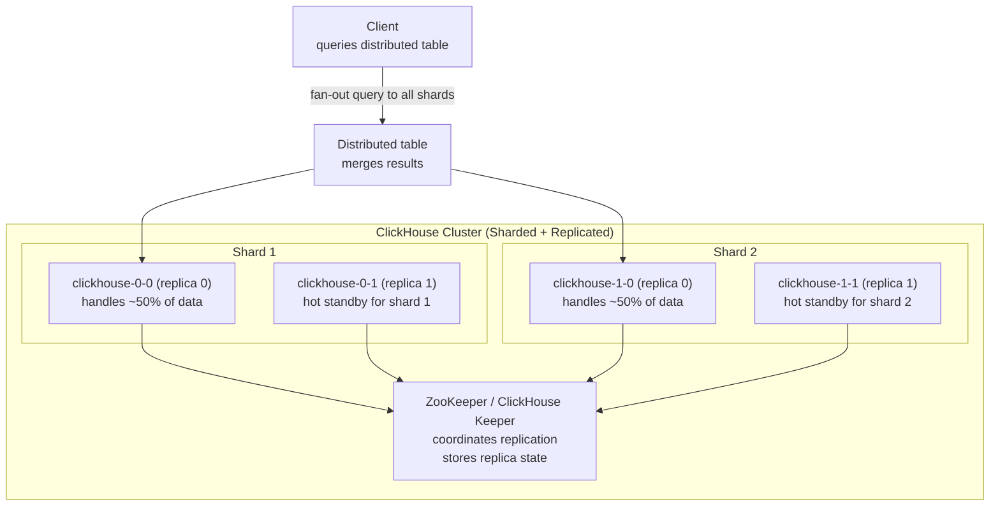
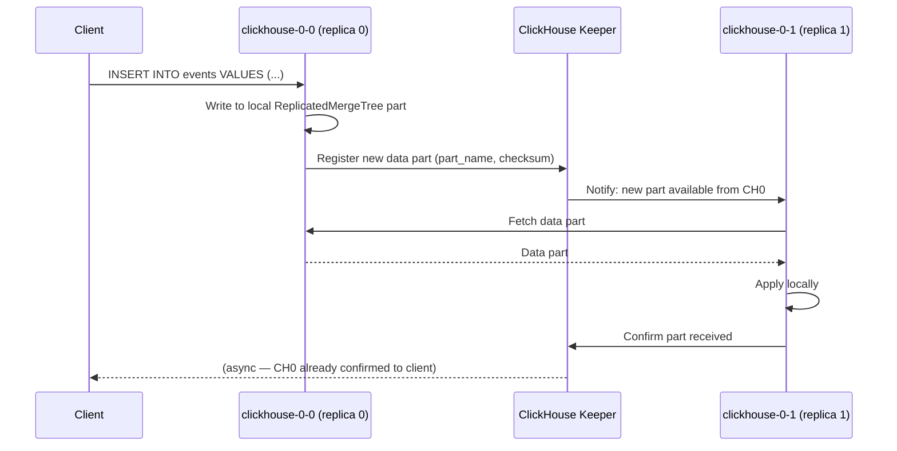
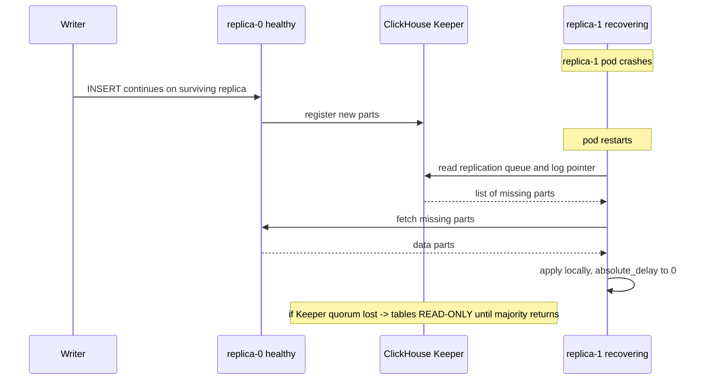

# ClickHouse on Kubernetes

## Architecture



**Distributed table** — a virtual table that fans queries out to all shards and merges results. Actual data lives in `MergeTree` tables on each shard.

---

## Replication with ClickHouse Keeper



**ClickHouse replication is asynchronous by default.** The INSERT returns when the local replica writes it. The keeper coordinates other replicas fetching it. This can lead to stale reads from a replica.

---

## ClickHouse Operator (Altinity)

```yaml
apiVersion: clickhouse.altinity.com/v1
kind: ClickHouseInstallation
metadata:
  name: clickhouse
spec:
  configuration:
    clusters:
    - name: main
      layout:
        shardsCount: 2
        replicasCount: 2
    zookeeper:
      nodes:
      - host: zookeeper-0.zookeeper-headless
      - host: zookeeper-1.zookeeper-headless
      - host: zookeeper-2.zookeeper-headless
    settings:
      max_connections: 200
      max_concurrent_queries: 100

  templates:
    volumeClaimTemplates:
    - name: data
      spec:
        accessModes: ["ReadWriteOnce"]
        storageClassName: premium-rwo
        resources:
          requests:
            storage: 500Gi
```

---

## Failover

**There is no leader promotion.** Unlike Postgres/Patroni (one primary, promote a standby) or Redis Sentinel/Cluster (replica elected to master), ClickHouse replication is **multi-master per shard** via `ReplicatedMergeTree`. Every replica of a shard is equal: all accept writes, all serve reads. Coordination — which parts exist, which replica has what, the per-replica fetch queue — lives in **ClickHouse Keeper** (or ZooKeeper), the Raft-based consensus layer. So "failover" here is not an election; it is replicas independently catching up through Keeper.

**Replica goes down:** the surviving replica(s) of that shard keep serving reads and accepting writes with zero promotion step. Their new parts are registered in Keeper. When the dead replica restarts, it reads its replication queue from Keeper and fetches the parts it missed from a healthy peer until `absolute_delay` returns to 0. No manual action needed for a clean restart.

**Keeper/ZooKeeper quorum lost:** because Keeper stores the replication metadata *and* is the consensus layer, a replica that cannot reach a Keeper quorum cannot safely coordinate writes. Affected `ReplicatedMergeTree` tables flip to **read-only** — `SELECT` still works, `INSERT`/`ALTER`/mutations are rejected. This is by design: accepting writes without consensus would risk divergent, unreconcilable parts. Writes resume automatically once quorum is restored (Keeper majority back online).



**Recovery runbook**

Inspect replica health via `system.replicas` — the key columns:

```sql
SELECT
    database, table,
    is_readonly,          -- 1 = lost Keeper session / no metadata (bad)
    is_session_expired,   -- 1 = Keeper session dropped
    future_parts,         -- parts expected but not yet fetched
    parts_to_check,       -- parts queued for consistency check
    queue_size,           -- pending replication-queue entries (backlog)
    absolute_delay,       -- seconds this replica is behind
    total_replicas, active_replicas
FROM system.replicas
WHERE is_readonly OR is_session_expired OR absolute_delay > 60;

-- Drill into what a stuck queue is doing
SELECT type, num_tries, last_exception, create_time
FROM system.replication_queue
ORDER BY num_tries DESC LIMIT 20;
```

Recovery actions:

```sql
-- Replica stuck / session expired but metadata in Keeper is intact:
-- reconnect to Keeper and replay the queue.
SYSTEM RESTART REPLICA mydb.events;

-- Broad reset of all replica Keeper sessions on this node.
SYSTEM RESTART REPLICAS;

-- Keeper metadata for this replica is LOST (is_readonly stays 1 after restart,
-- or the /replicas path was wiped). Recreate the replica's metadata in Keeper
-- from local data and re-sync. Table must be detached-safe / read-only first.
SYSTEM RESTORE REPLICA mydb.events;   -- run on the affected replica

-- After restore, force it to reconcile parts with peers.
SYSTEM SYNC REPLICA mydb.events;
```

`SYSTEM RESTART REPLICA` re-initializes the in-memory state and Keeper session (fixes a session-expired / transiently read-only replica). `SYSTEM RESTORE REPLICA` rebuilds the *lost* Keeper metadata for a replica from its on-disk parts — use it only when Keeper no longer has the replica's node (e.g. ZooKeeper data loss), otherwise a plain restart is sufficient.

---

## Backups with clickhouse-backup

```bash
# Install clickhouse-backup
# Create full backup to GCS
clickhouse-backup create --tables "mydb.*" full_backup_$(date +%Y%m%d)
clickhouse-backup upload full_backup_$(date +%Y%m%d)

# Incremental backup (since last full)
clickhouse-backup create --diff-from full_backup_20240101 incr_$(date +%Y%m%d)
clickhouse-backup upload incr_$(date +%Y%m%d)

# Restore
clickhouse-backup download full_backup_20240101
clickhouse-backup restore full_backup_20240101

# Run as K8s CronJob
apiVersion: batch/v1
kind: CronJob
spec:
  schedule: "0 2 * * *"
  jobTemplate:
    spec:
      template:
        spec:
          containers:
          - name: backup
            image: altinity/clickhouse-backup:latest
            command: [clickhouse-backup, create-and-upload]
            env:
            - name: GCS_BUCKET
              value: my-clickhouse-backups
```

---

## Monitoring

```promql
# Queries per second
rate(ClickHouseMetrics_Query[5m])

# Memory usage
ClickHouseMetrics_MemoryTracking / ClickHouseAsyncMetrics_MemoryTotal > 0.8

# Replication queue depth (alert if replica falls behind)
# ReplicasMaxQueueSize = max pending entries in any replica's queue (true backlog)
ClickHouseMetrics_ReplicasMaxQueueSize > 100

# Merge queue (writes slow if too high)
ClickHouseMetrics_BackgroundPoolTask > 50
```
