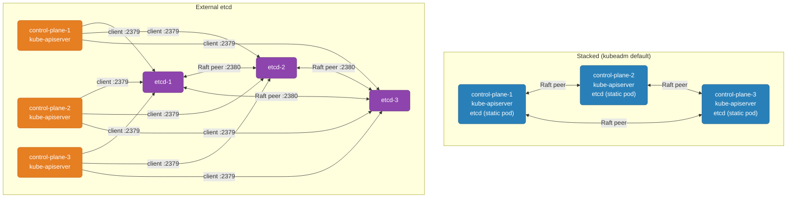

# etcd on Kubernetes

How Kubernetes runs etcd as a static pod, how to back it up and restore from a snapshot to recover a cluster, and the operational patterns for a stacked or external etcd topology.

<div class="quiz-progress" data-quiz-progress>
  <span class="quiz-progress-label">0/0 checks</span>
  <span class="quiz-progress-bar"><span class="quiz-progress-fill"></span></span>
</div>

---

## Stacked vs External Topology



| | Stacked | External |
|---|---|---|
| **Failure domain** | Coupled — node loss = API server + etcd member gone simultaneously | Decoupled — API server crash doesn't touch etcd quorum |
| **Machines needed** | 3 control-plane | 3 control-plane + 3 dedicated etcd nodes |
| **Ops overhead** | Lower | Higher |
| **Best for** | Small/medium clusters, dev/staging | Large or critical production clusters |
| **kubeadm** | Default, no flag needed | `kubeadm init --config` with `etcd.external` block |

**kubeadm external etcd config:**

```yaml
# kubeadm-config.yaml
apiVersion: kubeadm.k8s.io/v1beta3
kind: ClusterConfiguration
etcd:
  external:
    endpoints:
    - https://10.0.0.4:2379
    - https://10.0.0.5:2379
    - https://10.0.0.6:2379
    caFile: /etc/kubernetes/pki/etcd/ca.crt
    certFile: /etc/kubernetes/pki/apiserver-etcd-client.crt
    keyFile: /etc/kubernetes/pki/apiserver-etcd-client.key
```

<div class="quiz-card">
  <p class="quiz-q">A control-plane node crashes in a stacked 3-node HA cluster. How many Kubernetes components did you lose simultaneously?</p>
  <button class="quiz-reveal">Reveal answer</button>
  <div class="quiz-a" hidden>Two: one kube-apiserver instance and one etcd member. In a stacked topology both run on the same node, so a single node failure consumes one unit of fault tolerance from both layers simultaneously. For a 3-node stacked cluster this means you now have 2 of 3 API servers and 2 of 3 etcd members — still above quorum (2 of 3 = majority), but one more node loss in either layer takes the cluster down. This tight coupling is why external etcd is preferred for clusters where independent failure domains matter.</div>
</div>

---

## Accessing etcd in a kubeadm Cluster

The etcd container image already includes `etcdctl` — no separate install needed.

```bash
# Find the etcd pod name (kubeadm names it after the node)
kubectl -n kube-system get pods | grep etcd
# etcd-controlplane-1   1/1   Running   0   2d

# Health check — exec into the pod
kubectl -n kube-system exec -it etcd-controlplane-1 -- \
  etcdctl endpoint health \
  --endpoints=https://127.0.0.1:2379 \
  --cacert=/etc/kubernetes/pki/etcd/ca.crt \
  --cert=/etc/kubernetes/pki/etcd/healthcheck-client.crt \
  --key=/etc/kubernetes/pki/etcd/healthcheck-client.key
# https://127.0.0.1:2379 is healthy: successfully committed proposal: took = 2.3ms

# Status — DB size, leader, revision
kubectl -n kube-system exec -it etcd-controlplane-1 -- \
  etcdctl endpoint status \
  --endpoints=https://127.0.0.1:2379 \
  --cacert=/etc/kubernetes/pki/etcd/ca.crt \
  --cert=/etc/kubernetes/pki/etcd/healthcheck-client.crt \
  --key=/etc/kubernetes/pki/etcd/healthcheck-client.key \
  --write-out=table
# +---------------------------+------------------+--------+--------+-----------+
# |         ENDPOINT          |        ID        | VERSION| DB SIZE|  IS LEADER|
# +---------------------------+------------------+--------+--------+-----------+
# | https://127.0.0.1:2379   | 8e9e05c52164694d | 3.5.9  | 78 MB  |      true |
# +---------------------------+------------------+--------+--------+-----------+

# Interactive session — set env vars to avoid repeating cert flags
kubectl -n kube-system exec -it etcd-controlplane-1 -- sh
# Inside container:
export ETCDCTL_API=3
export ETCDCTL_ENDPOINTS=https://127.0.0.1:2379
export ETCDCTL_CACERT=/etc/kubernetes/pki/etcd/ca.crt
export ETCDCTL_CERT=/etc/kubernetes/pki/etcd/healthcheck-client.crt
export ETCDCTL_KEY=/etc/kubernetes/pki/etcd/healthcheck-client.key
# Now: etcdctl endpoint health  (no flags needed)
```

**Cert paths in a kubeadm cluster:**

| Cert | Path | Used by |
|---|---|---|
| etcd CA | `/etc/kubernetes/pki/etcd/ca.crt` | Validates all etcd certs |
| etcd CA key | `/etc/kubernetes/pki/etcd/ca.key` | Signs new etcd certs |
| Server cert | `/etc/kubernetes/pki/etcd/server.crt` | etcd TLS listener |
| Peer cert | `/etc/kubernetes/pki/etcd/peer.crt` | Raft peer communication |
| Healthcheck client | `/etc/kubernetes/pki/etcd/healthcheck-client.crt` | etcdctl access, liveness probe |
| API server client | `/etc/kubernetes/pki/apiserver-etcd-client.crt` | kube-apiserver → etcd |

<div class="quiz-card">
  <p class="quiz-q">Why use <code>healthcheck-client.crt</code> for etcdctl access rather than the server cert?</p>
  <button class="quiz-reveal">Reveal answer</button>
  <div class="quiz-a" hidden>The server cert is used by the etcd process itself to terminate TLS for incoming connections — it's the certificate that proves "I am the etcd server." A client cert (like healthcheck-client.crt) is used to authenticate a client to the server, which is what etcdctl needs. Using the server cert as a client cert would work technically (mTLS just checks that the cert was signed by the trusted CA), but it's a security violation: the server cert's private key should never leave the etcd process. The healthcheck-client cert is purpose-built for this access pattern and scoped accordingly.</div>
</div>

---

## Snapshot Backup — CronJob

etcd snapshots are point-in-time consistent copies of the entire key-value store. Run them on a schedule; store outside the cluster (S3, GCS, or a separate NFS mount).

```yaml
apiVersion: batch/v1
kind: CronJob
metadata:
  name: etcd-backup
  namespace: kube-system
spec:
  schedule: "0 */6 * * *"           # every 6 hours
  successfulJobsHistoryLimit: 3
  failedJobsHistoryLimit: 3
  jobTemplate:
    spec:
      template:
        spec:
          hostNetwork: true          # etcd binds to 127.0.0.1:2379 — must use host network to reach it
          nodeSelector:
            node-role.kubernetes.io/control-plane: ""   # must run on a control-plane node
          tolerations:
          - key: node-role.kubernetes.io/control-plane
            effect: NoSchedule
          containers:
          - name: etcd-backup
            image: registry.k8s.io/etcd:3.5.9-0        # keep in sync with cluster etcd version
            command:
            - sh
            - -c
            - |
              SNAPSHOT=/backup/etcd-$(date +%F-%H%M).db
              ETCDCTL_API=3 etcdctl snapshot save $SNAPSHOT \
                --endpoints=https://127.0.0.1:2379 \
                --cacert=/etc/kubernetes/pki/etcd/ca.crt \
                --cert=/etc/kubernetes/pki/etcd/healthcheck-client.crt \
                --key=/etc/kubernetes/pki/etcd/healthcheck-client.key
              # Fail the job if the snapshot is corrupt
              etcdctl snapshot status $SNAPSHOT --write-out=table
              echo "Backup complete: $SNAPSHOT"
            volumeMounts:
            - name: etcd-certs
              mountPath: /etc/kubernetes/pki/etcd
              readOnly: true
            - name: backup
              mountPath: /backup
          volumes:
          - name: etcd-certs
            hostPath:
              path: /etc/kubernetes/pki/etcd
              type: Directory
          - name: backup
            hostPath:
              path: /var/etcd-backups    # pre-create this directory on control-plane nodes
              type: DirectoryOrCreate
          restartPolicy: OnFailure
```

**Pruning old backups** — add a second container or a separate CronJob to delete files older than N days:

```bash
find /var/etcd-backups -name "etcd-*.db" -mtime +7 -delete
```

<div class="quiz-card">
  <p class="quiz-q">Why does this CronJob use <code>hostNetwork: true</code>?</p>
  <button class="quiz-reveal">Reveal answer</button>
  <div class="quiz-a" hidden>etcd in a kubeadm cluster listens on 127.0.0.1:2379 (loopback only) for client connections by default — it's not exposed on the node's primary network interface. A pod without hostNetwork gets its own network namespace and cannot reach the host's loopback address. With hostNetwork: true the pod shares the host's network namespace and can reach 127.0.0.1:2379 as if it were running directly on the node. The alternative is to point at the node's primary IP, but that requires --listen-client-urls to be configured to bind there, which kubeadm clusters don't do by default.</div>
</div>

---

## Restore — Recovering a K8s Cluster

Restoring from snapshot replaces all of etcd's state with the snapshot's contents. Every K8s object (pods, deployments, secrets) reverts to the snapshot's point in time — any changes made after the snapshot are lost.

<div class="stepper">
  <div class="stepper-panels">
    <div class="stepper-panel active">
      <strong>1. Stop the API server on all control-plane nodes.</strong> Move the static pod manifest out of kubelet's watched directory — kubelet automatically stops the pod when the manifest disappears.
      <pre><code># On EACH control-plane node
mv /etc/kubernetes/manifests/kube-apiserver.yaml /tmp/
# Wait ~10s for kubelet to stop the pod
# kubectl commands will now hang/fail — expected</code></pre>
    </div>
    <div class="stepper-panel">
      <strong>2. Stop etcd on all control-plane nodes.</strong>
      <pre><code># On EACH control-plane node
mv /etc/kubernetes/manifests/etcd.yaml /tmp/
# Wait for etcd pod to stop: crictl ps | grep etcd (should be empty)</code></pre>
    </div>
    <div class="stepper-panel">
      <strong>3. Restore the snapshot on each control-plane node.</strong> Each node gets a different <code>--name</code> and <code>--initial-advertise-peer-urls</code>.
      <pre><code># On control-plane-1:
ETCDCTL_API=3 etcdctl snapshot restore /tmp/etcd-snapshot.db \
  --name=etcd-controlplane-1 \
  --initial-cluster="etcd-controlplane-1=https://10.0.0.1:2380,\
etcd-controlplane-2=https://10.0.0.2:2380,\
etcd-controlplane-3=https://10.0.0.3:2380" \
  --initial-cluster-token=etcd-cluster-restored \  # new token prevents stale peers rejoining
  --initial-advertise-peer-urls=https://10.0.0.1:2380 \
  --data-dir=/var/lib/etcd-restore

# Repeat on control-plane-2 (--name=etcd-controlplane-2, --initial-advertise-peer-urls=https://10.0.0.2:2380)
# Repeat on control-plane-3</code></pre>
    </div>
    <div class="stepper-panel">
      <strong>4. Update the etcd static pod manifest to use the restored data directory.</strong>
      <pre><code># Edit /tmp/etcd.yaml on each node — two changes:
# 1. --data-dir flag: change /var/lib/etcd → /var/lib/etcd-restore
# 2. volumes.hostPath.path: change /var/lib/etcd → /var/lib/etcd-restore
sed -i 's|/var/lib/etcd|/var/lib/etcd-restore|g' /tmp/etcd.yaml</code></pre>
    </div>
    <div class="stepper-panel">
      <strong>5. Move manifests back — kubelet restarts the pods.</strong>
      <pre><code># On EACH control-plane node:
mv /tmp/etcd.yaml /etc/kubernetes/manifests/
# Wait for etcd to reach Running: watch crictl ps | grep etcd
# Then:
mv /tmp/kube-apiserver.yaml /etc/kubernetes/manifests/</code></pre>
    </div>
    <div class="stepper-panel">
      <strong>6. Verify.</strong>
      <pre><code>kubectl get nodes
kubectl -n kube-system get pods

# Confirm etcd health
kubectl -n kube-system exec etcd-controlplane-1 -- \
  etcdctl endpoint health \
  --endpoints=https://127.0.0.1:2379 \
  --cacert=/etc/kubernetes/pki/etcd/ca.crt \
  --cert=/etc/kubernetes/pki/etcd/healthcheck-client.crt \
  --key=/etc/kubernetes/pki/etcd/healthcheck-client.key</code></pre>
    </div>
  </div>
  <div class="stepper-controls">
    <button class="stepper-prev">← Prev</button>
    <span class="stepper-dots"></span>
    <span class="stepper-label"></span>
    <button class="stepper-next">Next →</button>
  </div>
</div>

<div class="quiz-card">
  <p class="quiz-q">You restore etcd from a snapshot while the kube-apiserver is still running. What goes wrong?</p>
  <button class="quiz-reveal">Reveal answer</button>
  <div class="quiz-a" hidden>The API server was connected to the old etcd cluster and has cached the current state. When etcd is replaced with snapshot data, the API server may: (1) reject writes because resourceVersions in its cache don't match the restored revision, (2) write objects based on its stale in-memory state back into the newly restored etcd, immediately overwriting restored data, or (3) crash due to unexpected etcd revision jumps. The API server must be stopped first so there is no in-flight state that can collide with the restored data. The restore is then a clean handoff: etcd has the snapshot's state, the API server starts fresh and reads from it without any cached conflicts.</div>
</div>

---

## Compaction in a K8s Cluster

kube-apiserver runs its own compaction loop (`--etcd-compaction-interval`, default 5 minutes) — you don't need to configure `--auto-compaction-*` on etcd itself for a kubeadm cluster. However, the API server's compaction may not keep pace on write-heavy clusters (many controllers, frequent CRD updates), and the DB quota alarm can still fire.

```bash
# Check DB size across all etcd members
kubectl -n kube-system exec etcd-controlplane-1 -- \
  etcdctl endpoint status \
  --endpoints=https://127.0.0.1:2379 \
  --cacert=/etc/kubernetes/pki/etcd/ca.crt \
  --cert=/etc/kubernetes/pki/etcd/healthcheck-client.crt \
  --key=/etc/kubernetes/pki/etcd/healthcheck-client.key \
  --write-out=table
# DB SIZE column — alert > 80% of quota (default quota: 2GB)

# Manual compact + defrag when NOSPACE alarm fires
# (kube-apiserver already compacted — just defrag to reclaim disk space)
kubectl -n kube-system exec -it etcd-controlplane-1 -- sh -c '
  export ETCDCTL_API=3 ETCDCTL_ENDPOINTS=https://127.0.0.1:2379
  export ETCDCTL_CACERT=/etc/kubernetes/pki/etcd/ca.crt
  export ETCDCTL_CERT=/etc/kubernetes/pki/etcd/healthcheck-client.crt
  export ETCDCTL_KEY=/etc/kubernetes/pki/etcd/healthcheck-client.key

  REV=$(etcdctl endpoint status --write-out=json | jq ".[0].Status.header.revision")
  etcdctl compact $REV
  etcdctl defrag          # blocks writes on this member for ~1-10s
  etcdctl alarm disarm    # clear NOSPACE alarm so writes resume
'

# Raise quota if cluster legitimately needs more space (add to etcd static pod manifest)
# --quota-backend-bytes=8589934592   # 8GB (hard max)
```

---

## Common Failure Modes

<div class="tab-group">
  <div class="tab-buttons">
    <button data-tab="compact-err" class="active">Compact error</button>
    <button data-tab="nospace">NOSPACE alarm</button>
    <button data-tab="crashloop">etcd crashloop</button>
    <button data-tab="leader">Leader thrashing</button>
  </div>
  <div class="tab-panels">
    <div class="tab-panel active" data-tab-panel="compact-err">
      <strong>Symptom:</strong> API server logs show <code>"etcdserver: mvcc: required revision has been compacted"</code>.<br>
      <strong>Cause:</strong> A controller's informer tried to resume a watch at a revision that's been compacted away — normal informer resync behavior.<br>
      <strong>Effect:</strong> The informer does a full re-list (adds CPU + etcd load) and resumes. Temporary; not an error that requires intervention.<br>
      <strong>If frequent:</strong> Reduce <code>--etcd-compaction-interval</code> on kube-apiserver or increase <code>--auto-compaction-retention</code> on etcd to keep more revision history.
    </div>
    <div class="tab-panel" data-tab-panel="nospace">
      <strong>Symptom:</strong> All K8s writes return 503; <code>kubectl apply</code> hangs; etcd alarm list shows <code>NOSPACE</code>.<br>
      <strong>Fix:</strong> compact → defrag → alarm disarm (see Compaction section above). Run defrag on one member at a time.<br>
      <strong>Prevention:</strong> Alert at 80% DB size. If the cluster legitimately needs more space, raise <code>--quota-backend-bytes</code> in the etcd static pod manifest (max 8GB).
    </div>
    <div class="tab-panel" data-tab-panel="crashloop">
      <strong>Symptom:</strong> etcd pod in CrashLoopBackOff; logs show TLS handshake errors or <code>"open /etc/kubernetes/pki/etcd/server.crt: permission denied"</code>.<br>
      <strong>Check cert expiry:</strong>
      <pre><code>openssl x509 -noout -dates -in /etc/kubernetes/pki/etcd/server.crt</code></pre>
      <strong>Renew if expired:</strong>
      <pre><code>kubeadm certs renew etcd-server
kubeadm certs renew etcd-peer
kubeadm certs renew etcd-healthcheck-client
# Restart static pod by moving manifest out and back</code></pre>
    </div>
    <div class="tab-panel" data-tab-panel="leader">
      <strong>Symptom:</strong> Frequent API server 503s; <code>etcd_server_leader_changes_seen_total</code> rate > 1/hour; WAL fsync p99 > 10ms.<br>
      <strong>Cause:</strong> Disk I/O latency causes WAL fsync delays → heartbeat misses → elections. Common on cloud VMs with shared storage (EBS gp2, standard PD).<br>
      <strong>Fix:</strong>
      <ul>
        <li>Migrate etcd data to local NVMe or provisioned IOPS volume (EBS io2, gp3 with explicit IOPS)</li>
        <li>Isolate etcd from other I/O-heavy workloads on the same node</li>
        <li>Increase <code>--heartbeat-interval</code> if cross-region latency is the issue (set to ≥ 5× RTT between members)</li>
      </ul>
    </div>
  </div>
</div>
