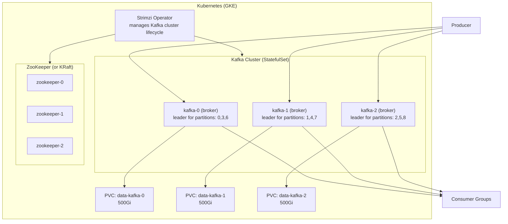
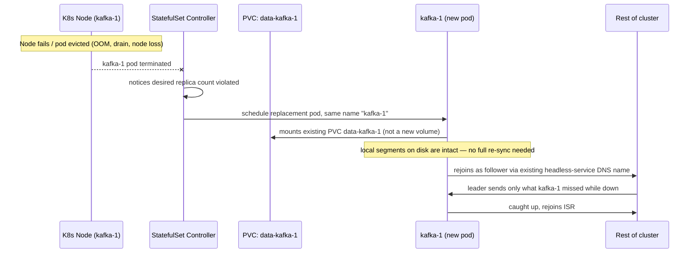
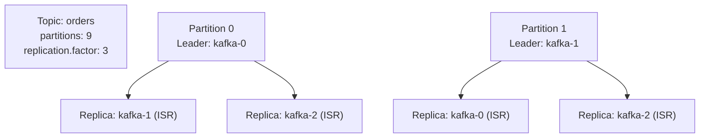
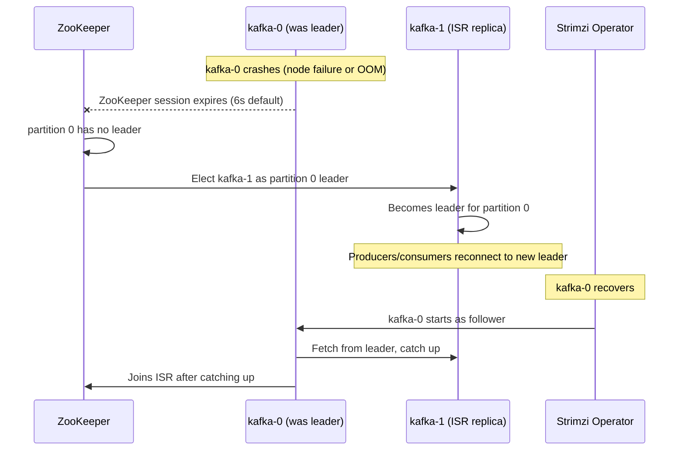
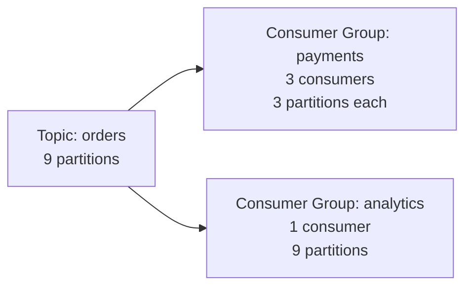

# Apache Kafka on Kubernetes (Strimzi Operator)

Running Kafka as a `StatefulSet` on Kubernetes — broker identity, PVC binding, failover, and the operational sequences (pod rescheduling, rolling restarts, scaling) that a plain stateless Deployment never has to deal with.

<div class="quiz-progress" data-quiz-progress>
  <span class="quiz-progress-label">0/0 checks</span>
  <span class="quiz-progress-bar"><span class="quiz-progress-fill"></span></span>
</div>

---

## Architecture



<div class="quiz-card">
  <p class="quiz-q">kafka-1's pod gets deleted and Kubernetes reschedules it. Does it come back as "kafka-1" attached to PVC data-kafka-1, or as a fresh, differently-named pod with an empty volume?</p>
  <button class="quiz-reveal">Reveal answer</button>
  <div class="quiz-a" hidden>It comes back as kafka-1, attached to the same data-kafka-1 PVC. A StatefulSet (unlike a Deployment) gives each pod a stable, ordinal-indexed name and binds each ordinal's PVC for the life of the StatefulSet, not the life of one pod instance — so the replacement pod reuses the same identity and the same disk.</div>
</div>

---

## Broker Pod Rescheduling & PVC Reattachment

Kafka brokers run as a `StatefulSet`, not a `Deployment` — that distinction is the whole reason Kafka works on Kubernetes at all. A `Deployment`'s pods are interchangeable; a `StatefulSet`'s aren't. Each pod gets a stable, ordinal-indexed name (`kafka-0`, `kafka-1`, `kafka-2`) and a stable network identity via a **headless Service**, and each ordinal owns its own PVC from `volumeClaimTemplates` — `data-kafka-1` belongs to `kafka-1` for the life of the StatefulSet, not the life of any one pod.

That matters because it's what makes a rescheduled broker safe: the replacement pod keeps the same name, the same DNS entry, and reattaches to the *same* PVC — it comes back as the same broker with its own data still on disk, not a fresh empty node that has to be re-added to the cluster from scratch.



Two things have to be true for this to work in practice: the storage class must support the volume reattaching wherever the new pod lands (a `ReadWriteOnce` cloud block volume works; anything tied to one specific node would not survive a node loss), and `terminationGracePeriodSeconds` needs to be generous enough for Kafka to flush and close segments cleanly rather than being SIGKILLed mid-write.

Walk through the sequence step by step:

<div class="stepper">
  <div class="stepper-panels">
    <div class="stepper-panel active">
      <strong>1. Steady state.</strong> kafka-1 is running, mounted to PVC <code>data-kafka-1</code>, reachable at <code>kafka-1.kafka-headless.svc</code> via the headless Service.
    </div>
    <div class="stepper-panel">
      <strong>2. Node failure or eviction.</strong> The underlying node dies, is drained, or the pod is OOM-killed. Kubernetes marks the pod terminated.
    </div>
    <div class="stepper-panel">
      <strong>3. StatefulSet controller reacts.</strong> It notices the observed replica count no longer matches desired, and schedules a replacement pod with the exact same ordinal name: <code>kafka-1</code>.
    </div>
    <div class="stepper-panel">
      <strong>4. Same PVC, same identity.</strong> The new pod claims the existing <code>data-kafka-1</code> PVC — StatefulSets bind PVCs by ordinal, not by pod UID — and gets the same DNS name. To the rest of the cluster, kafka-1 just came back, not a new broker.
    </div>
    <div class="stepper-panel">
      <strong>5. Catch-up, not full resync.</strong> Because the on-disk log segments survived, kafka-1 only fetches what it missed since going down, not the whole partition from scratch. Once caught up, it rejoins the ISR.
    </div>
  </div>
  <div class="stepper-controls">
    <button class="stepper-prev">← Prev</button>
    <span class="stepper-dots"></span>
    <span class="stepper-label"></span>
    <button class="stepper-next">Next →</button>
  </div>
</div>

<div class="quiz-card">
  <p class="quiz-q">Why does a rescheduled Kafka broker pod only need to fetch what it missed, instead of re-replicating its whole partition from scratch?</p>
  <button class="quiz-reveal">Reveal answer</button>
  <div class="quiz-a" hidden>Because it reattaches to the same PVC it had before — the on-disk log segments it already had are still there. It only needs to catch up on records written while it was down, not rebuild the entire replica from zero.</div>
</div>

---

## Topic Replication and ISR



**ISR (In-Sync Replicas):** Replicas that are fully caught up with the leader (within `replica.lag.time.max.ms = 10000ms`). A replica falls out of ISR if it falls behind.

**`min.insync.replicas`:** Minimum ISR count required for a write to succeed. With `replication.factor=3` and `min.insync.replicas=2`: a write succeeds if at least 2 replicas (including leader) acknowledge it. One broker can fail with zero data loss.

```yaml
# Topic config
min.insync.replicas: 2
replication.factor: 3
```

```yaml
# Producer config for guaranteed delivery
acks: all             # wait for all ISR replicas to confirm
retries: 2147483647   # retry indefinitely
enable.idempotence: true  # exactly-once semantics
```

<div class="quiz-card">
  <p class="quiz-q">With replication.factor=3 and min.insync.replicas=2, how many brokers holding a partition's replicas can be down before an acks=all producer starts failing writes to it?</p>
  <button class="quiz-reveal">Reveal answer</button>
  <div class="quiz-a" hidden>One. Losing one broker still leaves 2 replicas in the ISR, satisfying min.insync.replicas=2. Lose a second and ISR drops to 1 — below the threshold — so acks=all writes start failing even though the partition still technically has a leader up.</div>
</div>

---

## Partition Leader Election (Failover)



Step through the same failover as discrete stages:

<div class="stepper">
  <div class="stepper-panels">
    <div class="stepper-panel active">
      <strong>1. Stable.</strong> kafka-0 is leader for partition 0; kafka-1 is an ISR replica, fully caught up.
    </div>
    <div class="stepper-panel">
      <strong>2. kafka-0 crashes.</strong> Node failure or OOM kill. Its ZooKeeper session expires after the default 6s timeout.
    </div>
    <div class="stepper-panel">
      <strong>3. New leader elected.</strong> ZooKeeper sees partition 0 has no leader and elects kafka-1 — the ISR replica — as the new leader. Producers and consumers reconnect to it.
    </div>
    <div class="stepper-panel">
      <strong>4. kafka-0 recovers.</strong> The Strimzi operator brings kafka-0 back up. It rejoins the cluster as a follower, not automatically as leader again.
    </div>
    <div class="stepper-panel">
      <strong>5. Catch-up and rejoin.</strong> kafka-0 fetches from the new leader (kafka-1) until caught up, then rejoins the ISR.
    </div>
  </div>
  <div class="stepper-controls">
    <button class="stepper-prev">← Prev</button>
    <span class="stepper-dots"></span>
    <span class="stepper-label"></span>
    <button class="stepper-next">Next →</button>
  </div>
</div>

**Unclean leader election:** If ALL ISR replicas are down, Kafka can optionally elect an out-of-sync replica (`unclean.leader.election.enable=true`). **Never enable in production** — guarantees data loss.

<div class="quiz-card">
  <p class="quiz-q">Every ISR replica for a partition is down, and unclean.leader.election.enable=true. Kafka elects an out-of-sync replica as the new leader. Is any data lost?</p>
  <button class="quiz-reveal">Reveal answer</button>
  <div class="quiz-a" hidden>Yes. The out-of-sync replica, by definition, doesn't have every record the old leader had — whatever it never received is gone the moment it becomes leader. The partition becomes available again, but at the cost of guaranteed data loss, which is exactly why this setting should never be enabled in production.</div>
</div>

---

## Strimzi Kafka Cluster YAML

```yaml
apiVersion: kafka.strimzi.io/v1beta2
kind: Kafka
metadata:
  name: my-kafka
spec:
  kafka:
    version: 3.6.0
    replicas: 3
    listeners:
      - name: plain
        port: 9092
        type: internal
        tls: false
      - name: tls
        port: 9093
        type: internal
        tls: true
    config:
      offsets.topic.replication.factor: 3
      transaction.state.log.replication.factor: 3
      transaction.state.log.min.isr: 2
      default.replication.factor: 3
      min.insync.replicas: 2
      log.retention.hours: 168       # 7 days retention
      log.segment.bytes: 1073741824  # 1GB segments
    storage:
      type: persistent-claim
      size: 500Gi
      class: premium-rwo             # GKE SSD storage class
    resources:
      requests:
        memory: 8Gi
        cpu: 2
      limits:
        memory: 16Gi
        cpu: 4
    jvmOptions:
      -Xms: 4096m
      -Xmx: 4096m

  zookeeper:
    replicas: 3
    storage:
      type: persistent-claim
      size: 50Gi
      class: premium-rwo
```

---

## Rolling Restarts

Any change to the `Kafka` custom resource that requires a broker restart — a version bump, a JVM option, a value in the `spec.kafka.config` block — triggers a **rolling restart**, not a full-cluster bounce. Strimzi restarts one broker pod at a time, in ordinal order, and waits for that broker to rejoin the ISR for every partition it holds before touching the next one.

That one-at-a-time discipline is what keeps `min.insync.replicas` satisfied throughout the whole operation: with `replication.factor=3` and `min.insync.replicas=2`, taking down one broker at a time still leaves 2 in the ISR for every partition, so `acks=all` producers keep working uninterrupted. Restarting two brokers concurrently could drop a partition's ISR below `min.insync.replicas` and start failing writes mid-rollout — exactly why Strimzi enforces the sequential order instead of restarting pods in parallel.

<div class="stepper">
  <div class="stepper-panels">
    <div class="stepper-panel active">
      <strong>1. Change applied.</strong> A version bump or config change lands on the <code>Kafka</code> resource. The Strimzi operator diffs it against the running cluster and determines a restart is required.
    </div>
    <div class="stepper-panel">
      <strong>2. kafka-0 restarts.</strong> Its pod is terminated and recreated on the new config. While it's down, kafka-1 and kafka-2 keep serving traffic for any partition kafka-0 led.
    </div>
    <div class="stepper-panel">
      <strong>3. Wait for ISR.</strong> The operator waits until kafka-0 has rejoined the ISR for every partition it's a replica of before moving on — it does not restart the next broker on a fixed timer.
    </div>
    <div class="stepper-panel">
      <strong>4. kafka-1, then kafka-2.</strong> The same restart-then-wait-for-ISR sequence repeats for each remaining broker, one at a time, in order.
    </div>
    <div class="stepper-panel">
      <strong>5. Done.</strong> All three brokers are on the new config/version, and at no point did more than one broker's partitions drop out of full ISR at once.
    </div>
  </div>
  <div class="stepper-controls">
    <button class="stepper-prev">← Prev</button>
    <span class="stepper-dots"></span>
    <span class="stepper-label"></span>
    <button class="stepper-next">Next →</button>
  </div>
</div>

<div class="quiz-card">
  <p class="quiz-q">With replication.factor=3 and min.insync.replicas=2, why does Strimzi restart brokers one at a time instead of all at once?</p>
  <button class="quiz-reveal">Reveal answer</button>
  <div class="quiz-a" hidden>Restarting one broker at a time still leaves 2 of 3 replicas in the ISR for every partition, satisfying min.insync.replicas so acks=all writes keep succeeding. Restarting brokers concurrently could drop a partition's ISR below the min.insync.replicas threshold, causing producers to start failing writes mid-rollout.</div>
</div>

---

## Scaling the Broker StatefulSet

Changing `spec.kafka.replicas` scales the StatefulSet, but "add a broker" and "remove a broker" aren't mirror images of each other — one is close to free, the other requires manual data movement first.

<div class="toggle-switch">
  <div class="toggle-buttons">
    <button data-toggle-opt="up" class="active state-ok">Scale up</button>
    <button data-toggle-opt="down" class="state-warn">Scale down</button>
  </div>
  <div class="toggle-panel active" data-toggle-panel="up">
    Bumping <code>replicas</code> higher creates a new ordinal pod (e.g. <code>kafka-3</code>) with a brand-new PVC provisioned automatically from <code>volumeClaimTemplates</code>. The new broker joins the cluster empty. It won't lead or replicate anything until you explicitly reassign some partitions onto it with <code>kafka-reassign-partitions.sh</code> — simply appearing in the cluster doesn't rebalance existing data onto it.
  </div>
  <div class="toggle-panel" data-toggle-panel="down">
    Lowering <code>replicas</code> deletes the highest-ordinal pod <strong>and its PVC</strong> outright. If that broker is still a leader or replica for any partition, deleting it before moving that data off is a straight capacity/durability loss — any partition relying on it drops a replica, and any partition it uniquely led goes into leader election under duress. Always run a partition reassignment moving every replica off the broker being removed <strong>before</strong> lowering <code>replicas</code>, never after.
  </div>
</div>

<div class="quiz-card">
  <p class="quiz-q">You lower spec.kafka.replicas from 4 to 3 without reassigning any partitions off kafka-3 first. What happens to the data kafka-3 was holding?</p>
  <button class="quiz-reveal">Reveal answer</button>
  <div class="quiz-a" hidden>kafka-3's pod and its PVC are deleted along with it. Any partition replica that lived only there is gone; any partition kafka-3 led has to fail over to another replica if one exists and is in-sync, or goes offline if not. Partition reassignment has to happen before scaling down, not after — scaling down does not automatically migrate data first.</div>
</div>

---

## Consumer Groups and Lag



```bash
# Check consumer group lag
kubectl exec -it kafka-0 -- kafka-consumer-groups.sh \
  --bootstrap-server localhost:9092 \
  --describe --group payments

# TOPIC   PARTITION  CURRENT-OFFSET  LOG-END-OFFSET  LAG
# orders  0          1500            1500            0
# orders  1          1480            1520            40   <- lagging!
# orders  2          1600            1600            0

# Alert if lag > threshold
# Prometheus: kafka_consumer_group_lag > 1000
```

<div class="quiz-card">
  <p class="quiz-q">Consumer group "payments" (3 consumers) and consumer group "analytics" (1 consumer) both read the same 9-partition "orders" topic. Are these two groups splitting the topic's data between them, or each getting their own full copy?</p>
  <button class="quiz-reveal">Reveal answer</button>
  <div class="quiz-a" hidden>Each group gets its own independent full copy of every record — that's what makes them separate groups. Splitting only happens *within* a group: payments' 3 consumers divide the 9 partitions 3 each, and analytics' 1 consumer reads all 9 alone, but payments and analytics don't share progress or data with each other at all.</div>
</div>

---

## Backups

Kafka doesn't have a built-in backup mechanism. Options:

1. **MirrorMaker 2** — replicate topics to another cluster (GKE → GCS via Kafka Connect)
2. **Kafka Connect S3 Sink** — stream all messages to GCS/S3
3. **Volume snapshots** — snapshot PVCs (consistent only if broker is stopped first)

<div class="tab-group">
  <div class="tab-buttons">
    <button data-tab="mm2" class="active">MirrorMaker 2</button>
    <button data-tab="s3sink">Connect S3 Sink</button>
    <button data-tab="snap">Volume snapshots</button>
  </div>
  <div class="tab-panels">
    <div class="tab-panel active" data-tab-panel="mm2">
      Replicates whole topics, live, to a second Kafka cluster. Gives you a hot standby cluster you can fail over to, not just a static copy — closest thing to a real DR story here, at the cost of running (and paying for) a second cluster continuously.
    </div>
    <div class="tab-panel" data-tab-panel="s3sink">
      A sink connector streams every message to object storage as it arrives. Cheap, durable, and good for long-term/compliance retention past Kafka's own <code>retention.ms</code> — but restoring from it means replaying flat files back into topics, not just pointing brokers at existing PVCs.
    </div>
    <div class="tab-panel" data-tab-panel="snap">
      Snapshotting the PVCs directly is the fastest to set up, but it's only consistent if the broker is stopped first — snapshotting a live broker's PVC can capture a segment mid-write. Fine for periodic full-cluster disaster recovery; not something to restore a single topic from without care.
    </div>
  </div>
</div>

<div class="quiz-card">
  <p class="quiz-q">Why is a PVC snapshot taken while the broker is still running risky, compared to one taken after the broker is stopped?</p>
  <button class="quiz-reveal">Reveal answer</button>
  <div class="quiz-a" hidden>A running broker can be mid-write to a log segment at the exact moment the snapshot is taken, capturing a partially-written segment. The snapshot is only guaranteed consistent if the broker is stopped first — unlike MirrorMaker 2 or the Connect S3 sink, which stream complete, already-committed records rather than raw disk state.</div>
</div>

```yaml
# Kafka Connect S3 Sink (backup all topics to GCS)
apiVersion: kafka.strimzi.io/v1beta2
kind: KafkaConnector
spec:
  class: io.confluent.connect.s3.S3SinkConnector
  config:
    topics: ".*"
    s3.bucket.name: my-kafka-backup
    s3.region: us-central1
    flush.size: 1000
    rotate.interval.ms: 3600000  # rotate files every hour
```
