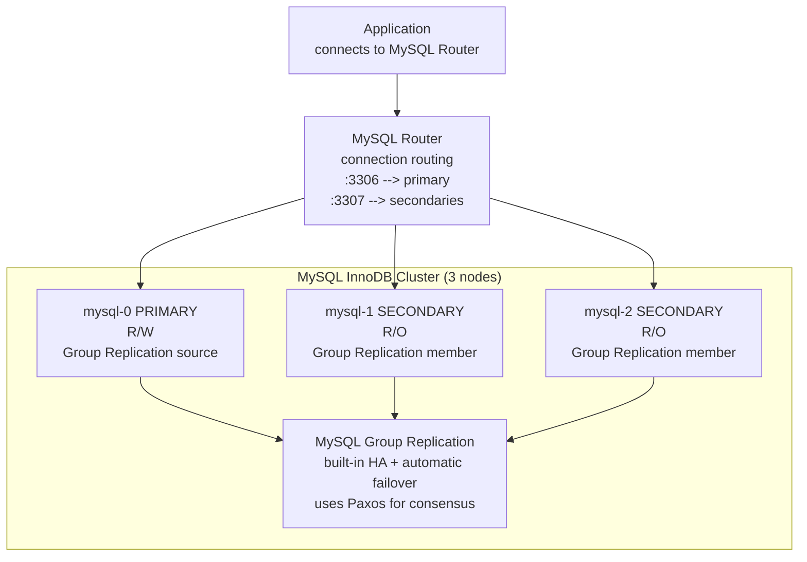
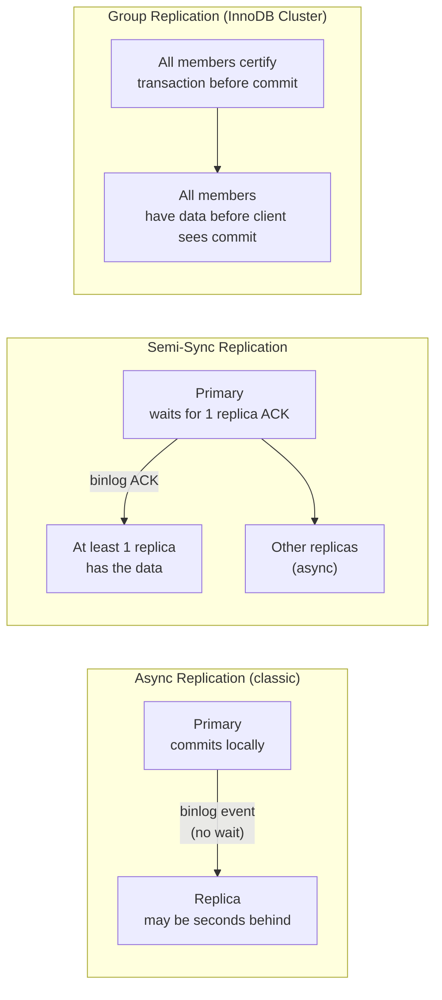
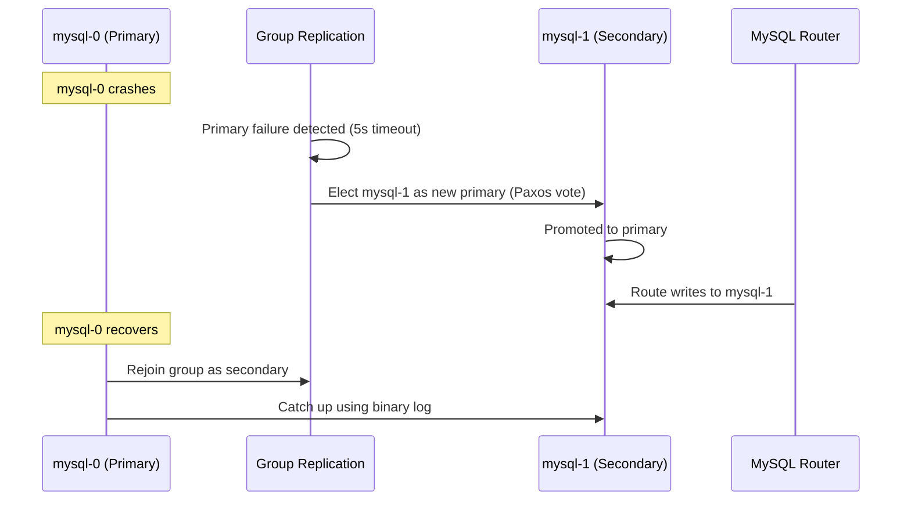

# MySQL on Kubernetes

Running MySQL as an InnoDB Cluster on Kubernetes via the Oracle MySQL Operator — Group Replication's Paxos-based consensus for automatic failover, connection routing through MySQL Router, and the backup/restore workflow with XtraBackup.

<div class="quiz-progress" data-quiz-progress>
  <span class="quiz-progress-label">0/0 checks</span>
  <span class="quiz-progress-bar"><span class="quiz-progress-fill"></span></span>
</div>

---

## Architecture with MySQL Operator (Oracle)



MySQL Group Replication uses a Paxos-based consensus protocol — every transaction is certified by a majority of members before committing. This gives **virtually synchronous replication** — no data loss on failover.

Walk through what happens to a single write:

<div class="stepper">
  <div class="stepper-panels">
    <div class="stepper-panel active">
      <strong>1. Client writes to the Primary.</strong> mysql-0 is the only R/W member — mysql-1 and mysql-2 are R/O Group Replication members and never accept writes directly.
    </div>
    <div class="stepper-panel">
      <strong>2. Transaction broadcast for certification.</strong> Before committing anything locally, the primary broadcasts the transaction to the group via the Paxos-based consensus protocol.
    </div>
    <div class="stepper-panel">
      <strong>3. Majority certifies, not everyone.</strong> The transaction only needs to be certified by a majority of members (2 of 3 in this cluster) — it does not have to wait for every secondary to respond.
    </div>
    <div class="stepper-panel">
      <strong>4. Commit.</strong> Once certified by the majority, the transaction commits. This is what "virtually synchronous" means: by the time the client sees the commit, a majority of the group already has the data, so failing over to any of them loses nothing.
    </div>
  </div>
  <div class="stepper-controls">
    <button class="stepper-prev">← Prev</button>
    <span class="stepper-dots"></span>
    <span class="stepper-label"></span>
    <button class="stepper-next">Next →</button>
  </div>
</div>

<div class="quiz-card">
  <p class="quiz-q">For a write to commit under Group Replication's Paxos-based consensus, does it need to be certified by every member of the cluster, or just a majority?</p>
  <button class="quiz-reveal">Reveal answer</button>
  <div class="quiz-a" hidden>Just a majority. In a 3-node cluster that's 2 members (the primary plus one secondary) — the transaction doesn't have to wait for every secondary to certify it. That majority requirement is exactly what the Paxos consensus protocol provides, and it's why failover loses no data: a majority already has the transaction before the client ever sees the commit.</div>
</div>

---

## Replication Types



| Mode | Data loss on failover | Write latency | Use case |
|------|----------------------|---------------|---------|
| Async | Up to replication lag | Lowest | Read replicas, reporting |
| Semi-sync | Zero (for 1 replica) | +1 RTT to replica | Production HA |
| Group Replication | Zero | +1-2ms (consensus) | Production HA, automatic failover |

<div class="quiz-card">
  <p class="quiz-q">Semi-sync replication is listed as "zero data loss on failover" — but zero data loss for how many replicas, and what does that imply about the rest?</p>
  <button class="quiz-reveal">Reveal answer</button>
  <div class="quiz-a" hidden>Zero data loss only for the one replica the primary waited on for an ACK. Every other replica in a semi-sync setup is still replicating asynchronously and can be behind — unlike Group Replication, where the majority that certified the transaction (not just one member) has it before commit.</div>
</div>

---

## MySQL Operator YAML

```yaml
apiVersion: mysql.oracle.com/v2
kind: InnoDBCluster
metadata:
  name: mysql
spec:
  secretName: mysql-secret   # root password
  tlsUseSelfSigned: true
  instances: 3
  router:
    instances: 2             # MySQL Router pods for HA routing
  datadirVolumeClaimTemplate:
    accessModes: [ReadWriteOnce]
    resources:
      requests:
        storage: 100Gi
    storageClassName: premium-rwo
  mycnf: |
    [mysqld]
    max_connections=500
    innodb_buffer_pool_size=4G
    binlog_expire_logs_seconds=604800  # 7 days binlog retention
    slow_query_log=ON
    long_query_time=1
```

---

## Failover



Step through the same failover as discrete stages:

<div class="stepper">
  <div class="stepper-panels">
    <div class="stepper-panel active">
      <strong>1. Steady state.</strong> mysql-0 is primary, taking all writes. mysql-1 and mysql-2 are secondaries, read-only and caught up.
    </div>
    <div class="stepper-panel">
      <strong>2. mysql-0 crashes.</strong> Group Replication's failure detector notices after the default 5s timeout.
    </div>
    <div class="stepper-panel">
      <strong>3. Paxos vote elects a new primary.</strong> The remaining group members vote and elect mysql-1 as the new primary.
    </div>
    <div class="stepper-panel">
      <strong>4. Router repoints writes.</strong> MySQL Router starts routing writes to mysql-1 instead of the now-dead mysql-0 — the application doesn't need to change its connection target.
    </div>
    <div class="stepper-panel">
      <strong>5. mysql-0 recovers as a secondary.</strong> It rejoins the group, but as a secondary, not automatically back as primary — it catches up using the binary log before serving reads again.
    </div>
  </div>
  <div class="stepper-controls">
    <button class="stepper-prev">← Prev</button>
    <span class="stepper-dots"></span>
    <span class="stepper-label"></span>
    <button class="stepper-next">Next →</button>
  </div>
</div>

<div class="quiz-card">
  <p class="quiz-q">After mysql-0 crashes, fails over to mysql-1, and then recovers, does mysql-0 come back as primary again or as a secondary?</p>
  <button class="quiz-reveal">Reveal answer</button>
  <div class="quiz-a" hidden>As a secondary. It rejoins the group and catches up using the binary log — there's no automatic re-promotion back to primary just because the original primary is healthy again. mysql-1, the node that got elected during the outage, stays primary.</div>
</div>

---

## Backups with XtraBackup

```bash
# Physical hot backup (no locks, consistent)
xtrabackup --backup \
  --user=backup_user \
  --password=$PASS \
  --target-dir=/backup/$(date +%Y%m%d)

# Upload to GCS
gsutil -m rsync -r /backup/$(date +%Y%m%d) gs://my-mysql-backups/$(date +%Y%m%d)/

# Prepare backup for restore
xtrabackup --prepare --target-dir=/backup/20240115

# Restore
xtrabackup --copy-back --target-dir=/backup/20240115
chown -R mysql:mysql /var/lib/mysql
```

Walk through a restore end to end:

<div class="stepper">
  <div class="stepper-panels">
    <div class="stepper-panel active">
      <strong>1. Take the hot backup.</strong> <code>xtrabackup --backup</code> copies InnoDB's data files while MySQL keeps running — no locks, and the result is consistent as of the backup's start.
    </div>
    <div class="stepper-panel">
      <strong>2. Ship it off-box.</strong> <code>gsutil -m rsync</code> uploads the backup directory to GCS so it survives the loss of the node it was taken on.
    </div>
    <div class="stepper-panel">
      <strong>3. Prepare it.</strong> <code>xtrabackup --prepare</code> runs against the backup directory before any restore attempt — a raw backup isn't restorable as-is.
    </div>
    <div class="stepper-panel">
      <strong>4. Copy back.</strong> <code>xtrabackup --copy-back</code> restores the prepared files into <code>/var/lib/mysql</code>.
    </div>
    <div class="stepper-panel">
      <strong>5. Fix ownership.</strong> <code>chown -R mysql:mysql /var/lib/mysql</code> — the restored files are owned by whatever user ran the restore, not <code>mysql</code>, so MySQL won't start until ownership is corrected.
    </div>
  </div>
  <div class="stepper-controls">
    <button class="stepper-prev">← Prev</button>
    <span class="stepper-dots"></span>
    <span class="stepper-label"></span>
    <button class="stepper-next">Next →</button>
  </div>
</div>

<div class="quiz-card">
  <p class="quiz-q">You've just run xtrabackup --backup and copied the resulting directory to a new host. Can you run xtrabackup --copy-back on it directly, or is there a required step first?</p>
  <button class="quiz-reveal">Reveal answer</button>
  <div class="quiz-a" hidden>There's a required step first: xtrabackup --prepare. A freshly taken backup isn't restorable as-is — it has to be prepared before --copy-back will produce a working data directory.</div>
</div>

---

## Monitoring

```promql
# Replication lag in seconds
mysql_slave_status_seconds_behind_master > 30

# Connection usage
mysql_global_status_threads_connected / mysql_global_variables_max_connections > 0.8

# InnoDB buffer pool hit rate (alert < 95%)
mysql_global_status_innodb_buffer_pool_read_requests /
(mysql_global_status_innodb_buffer_pool_read_requests +
 mysql_global_status_innodb_buffer_pool_reads) < 0.95

# Slow queries per second
rate(mysql_global_status_slow_queries[5m]) > 0
```

---

## MySQL on Kubernetes — Oracle MySQL Operator

```bash
# Install MySQL Operator
helm repo add mysql-operator https://mysql.github.io/mysql-operator/
helm install mysql-operator mysql-operator/mysql-operator \
  --namespace mysql-operator --create-namespace
```

```yaml
# Secret
apiVersion: v1
kind: Secret
metadata:
  name: mysql-secret
  namespace: mysql
type: Opaque
stringData:
  rootUser: root
  rootPassword: "changeme"
---
# 3-node InnoDB Cluster (1 primary + 2 secondary, Group Replication)
apiVersion: mysql.oracle.com/v2
kind: InnoDBCluster
metadata:
  name: mysql
  namespace: mysql
spec:
  secretName: mysql-secret
  tlsUseSelfSigned: true
  instances: 3
  router:
    instances: 2        # MySQL Router pods — route :6446 to primary, :6447 to replicas
  mycnf: |
    [mysqld]
    max_connections = 500
    innodb_buffer_pool_size = 4G
    slow_query_log = ON
    long_query_time = 1
  datadirVolumeClaimTemplate:
    accessModes: [ReadWriteOnce]
    storageClassName: gp3
    resources:
      requests:
        storage: 100Gi
  podSpec:
    containers:
    - name: mysql
      resources:
        requests:
          cpu: "2"
          memory: 8Gi
        limits:
          cpu: "4"
          memory: 16Gi
```

```bash
# Check cluster status
kubectl get innodbcluster mysql -n mysql
# NAME    STATUS   ONLINE   INSTANCES   ROUTERS
# mysql   ONLINE   3        3           2

# Connect via Router (auto-routes to primary)
kubectl port-forward svc/mysql-router 6446:6446 -n mysql
mysql -h 127.0.0.1 -P 6446 -u root -p

# Check Group Replication status
kubectl exec -it mysql-0 -n mysql -- \
  mysql -u root -p -e "SELECT * FROM performance_schema.replication_group_members;"
```

```yaml
# Headless service: direct pod DNS (mysql-0.mysql.mysql.svc.cluster.local)
apiVersion: v1
kind: Service
metadata:
  name: mysql
  namespace: mysql
spec:
  clusterIP: None
  selector:
    app: mysql
  ports:
  - port: 3306
```
