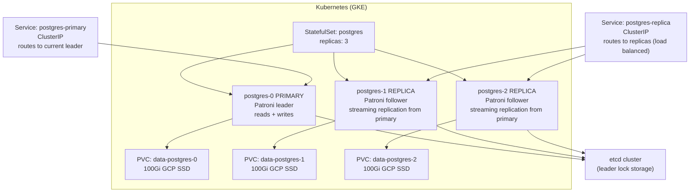
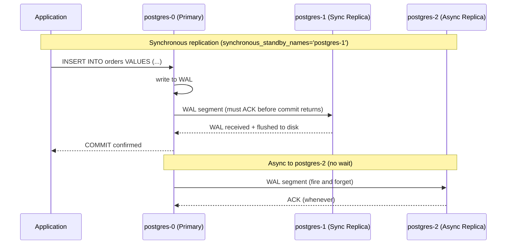
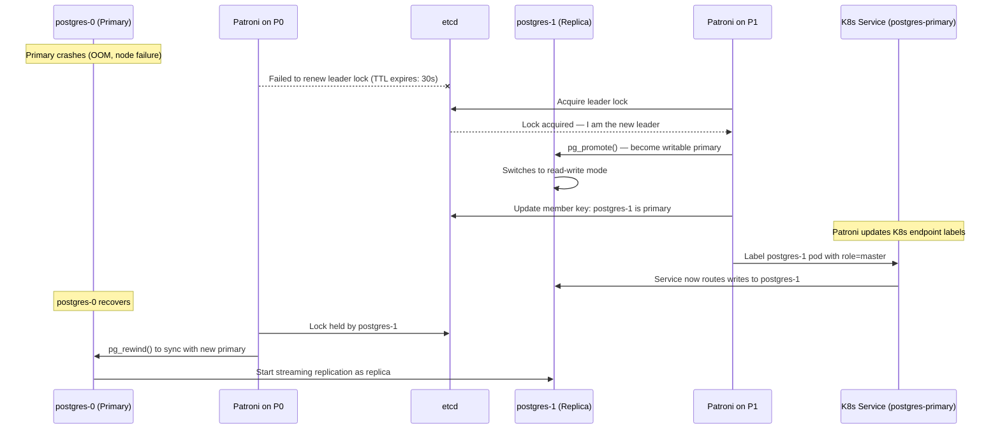
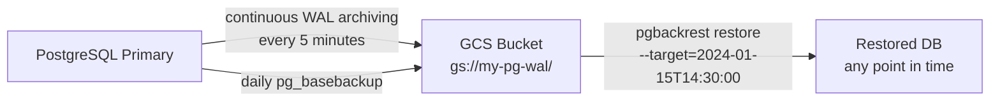
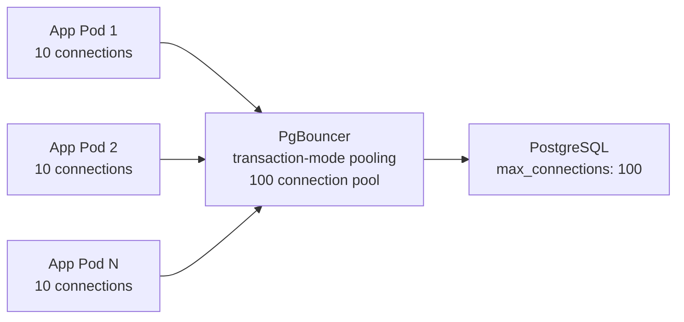

# PostgreSQL on Kubernetes (GKE)

<div class="quiz-progress" data-quiz-progress>
  <span class="quiz-progress-label">0/0 checks</span>
  <span class="quiz-progress-bar"><span class="quiz-progress-fill"></span></span>
</div>

---

## Architecture with Patroni (High Availability)

Patroni is the standard solution for PostgreSQL HA on K8s. It uses etcd/Consul/ZooKeeper as a distributed lock to manage leader election.



Patroni maintains the leader lock in etcd. If the primary fails to renew the lock within `ttl` seconds, a replica acquires the lock and promotes itself.

<div class="quiz-card">
  <p class="quiz-q">Does the postgres-primary Service route to a fixed pod (always postgres-0), or wherever Patroni currently says the leader is?</p>
  <button class="quiz-reveal">Reveal answer</button>
  <div class="quiz-a" hidden>Wherever Patroni says the leader is. The Service selects on a role label that Patroni moves to whichever pod currently holds the etcd leader lock — postgres-0 is just today's leader, not a hardcoded target. After a failover, the same Service definition starts routing writes to whichever pod Patroni relabels as master, with no Service or DNS change required.</div>
</div>

---

## Sync vs Async Replication



```sql
-- PostgreSQL synchronous replication config
-- postgresql.conf
synchronous_standby_names = 'FIRST 1 (postgres-1)'
-- FIRST 1: wait for at least 1 sync replica to confirm
-- This guarantees zero data loss on postgres-1

-- Check replication lag
SELECT
    client_addr,
    state,
    sent_lsn - write_lsn AS write_lag,
    sent_lsn - flush_lsn AS flush_lag,
    sent_lsn - replay_lsn AS replay_lag
FROM pg_stat_replication;
```

<div class="toggle-switch">
  <div class="toggle-buttons">
    <button data-toggle-opt="sync" class="active state-ok">Synchronous</button>
    <button data-toggle-opt="async" class="state-warn">Asynchronous</button>
  </div>
  <div class="toggle-panel active" data-toggle-panel="sync">
    The primary blocks <code>COMMIT</code> until the replica named in <code>synchronous_standby_names</code> confirms the WAL is received <strong>and flushed to disk</strong>. Guarantees zero data loss on that replica, at the cost of one network round trip added to every write's latency.
  </div>
  <div class="toggle-panel" data-toggle-panel="async">
    The primary ships WAL to the replica and returns <code>COMMIT</code> to the app without waiting for any acknowledgment. Fastest option, but if the primary crashes before the replica has applied the WAL already sent to it, whatever wasn't yet replicated is gone.
  </div>
</div>

**Trade-off:** Synchronous replication adds latency equal to the round trip to the replica. If the sync replica is in a different zone (recommended), that's 1-5ms extra per write.

<div class="quiz-card">
  <p class="quiz-q">The primary crashes one second after confirming COMMIT to the app. Is the committed row guaranteed to still exist on postgres-1 (sync replica)? What about postgres-2 (async replica)?</p>
  <button class="quiz-reveal">Reveal answer</button>
  <div class="quiz-a" hidden>Guaranteed on postgres-1 — COMMIT isn't confirmed to the app until that replica has flushed the WAL to its own disk, so it's durable there by definition. Not guaranteed on postgres-2 — replication to it is fire-and-forget, so the primary may not have sent (or postgres-2 may not have applied) that WAL segment yet when the crash happens, and that record can be lost there even though the app was already told it committed.</div>
</div>

---

## Automatic Failover with Patroni



Walk through the same failover as discrete stages:

<div class="stepper">
  <div class="stepper-panels">
    <div class="stepper-panel active">
      <strong>1. Stable.</strong> postgres-0 holds the etcd leader lock and serves reads and writes. postgres-1 streams from it as a replica.
    </div>
    <div class="stepper-panel">
      <strong>2. Primary crashes.</strong> OOM kill or node failure. postgres-0 stops renewing its leader lock in etcd.
    </div>
    <div class="stepper-panel">
      <strong>3. Lock expires, replica promotes.</strong> Once the <code>ttl</code> (default 30s) passes with no renewal, Patroni on postgres-1 acquires the lock and calls <code>pg_promote()</code>, switching postgres-1 to read-write.
    </div>
    <div class="stepper-panel">
      <strong>4. Service relabeled.</strong> Patroni updates postgres-1's pod label to <code>role=master</code>. The <code>postgres-primary</code> Service, which selects on that label, starts routing writes to postgres-1 — no Service or DNS change needed.
    </div>
    <div class="stepper-panel">
      <strong>5. Old primary rejoins as replica.</strong> When postgres-0 comes back, it finds the lock already held by postgres-1, runs <code>pg_rewind</code> to resync its data files against the new timeline, and starts streaming as a replica — it does not resume as primary automatically.
    </div>
  </div>
  <div class="stepper-controls">
    <button class="stepper-prev">← Prev</button>
    <span class="stepper-dots"></span>
    <span class="stepper-label"></span>
    <button class="stepper-next">Next →</button>
  </div>
</div>

**Failover time:** ~30 seconds (default TTL). Tune with `ttl`, `loop_wait`, `retry_timeout` in Patroni config.

<div class="quiz-card">
  <p class="quiz-q">When postgres-0 recovers after a failover, does it resume as primary since it was the original leader, or come back as a replica?</p>
  <button class="quiz-reveal">Reveal answer</button>
  <div class="quiz-a" hidden>As a replica. The etcd leader lock is already held by postgres-1 by the time postgres-0 recovers, so postgres-0 runs pg_rewind to align its data with the new primary's timeline and starts streaming from postgres-1 instead — there's no automatic step where it reclaims leadership just because it was the original primary.</div>
</div>

---

## Patroni Configuration (Helm)

```yaml
# values.yaml for Patroni
patroni:
  postgresql:
    parameters:
      max_connections: 200
      shared_buffers: "4GB"
      effective_cache_size: "12GB"
      wal_level: replica
      max_wal_senders: 10
      hot_standby: "on"
      synchronous_commit: "remote_write"  # sync to WAL on replica, not full flush

  bootstrap:
    dcs:
      ttl: 30               # seconds before leader lock expires
      loop_wait: 10         # check interval
      retry_timeout: 10     # operation timeout
      maximum_lag_on_failover: 1048576  # 1MB max lag — don't promote if replica is too far behind
      postgresql:
        use_pg_rewind: true  # allow old primary to rejoin as replica without full resync
        use_slots: true      # replication slots (prevent WAL deletion before replica catches up)
```

---

## Backups and PITR



```bash
# Install pgBackRest (production WAL backup tool)
# Daily full backup
pgbackrest --stanza=main backup --type=full

# WAL archiving (add to postgresql.conf)
archive_mode = on
archive_command = 'pgbackrest --stanza=main archive-push %p'
archive_timeout = 300   # force WAL switch every 5 min

# PITR restore to specific time
pgbackrest --stanza=main restore \
  --target="2024-01-15 14:30:00" \
  --target-action=promote \
  --recovery-option="recovery_target_timeline=latest"

# GKE VolumeSnapshot (consistent disk snapshot while DB is running)
kubectl apply -f - << 'EOF'
apiVersion: snapshot.storage.k8s.io/v1
kind: VolumeSnapshot
metadata:
  name: postgres-snapshot-$(date +%Y%m%d)
spec:
  source:
    persistentVolumeClaimName: data-postgres-0
  volumeSnapshotClassName: csi-gce-pd-vsc
EOF
```

A PITR restore always starts from a full backup, then replays WAL forward to the target — never WAL alone:

<div class="stepper">
  <div class="stepper-panels">
    <div class="stepper-panel active">
      <strong>1. Continuous baseline.</strong> <code>archive_command</code> ships every completed WAL segment to GCS as it's generated (at most every <code>archive_timeout</code> seconds), and a full <code>pg_basebackup</code> runs once a day.
    </div>
    <div class="stepper-panel">
      <strong>2. Restore is needed.</strong> Someone needs the database recovered to how it looked at a specific timestamp, not just its latest state.
    </div>
    <div class="stepper-panel">
      <strong>3. Restore the base backup.</strong> pgBackRest pulls the most recent full backup taken before the target time as the starting point.
    </div>
    <div class="stepper-panel">
      <strong>4. Replay WAL forward.</strong> pgBackRest applies archived WAL segments on top of that base backup up to (and stopping at) <code>--target="2024-01-15 14:30:00"</code>.
    </div>
    <div class="stepper-panel">
      <strong>5. Promote.</strong> With <code>--target-action=promote</code>, once replay reaches the target time PostgreSQL exits recovery mode and comes up as a normal, writable primary at exactly that point in time.
    </div>
  </div>
  <div class="stepper-controls">
    <button class="stepper-prev">← Prev</button>
    <span class="stepper-dots"></span>
    <span class="stepper-label"></span>
    <button class="stepper-next">Next →</button>
  </div>
</div>

<div class="quiz-card">
  <p class="quiz-q">To restore to an arbitrary point in time, does pgBackRest need only the archived WAL segments, or the WAL plus a base backup?</p>
  <button class="quiz-reveal">Reveal answer</button>
  <div class="quiz-a" hidden>Both. WAL segments alone are just a stream of changes — pgBackRest has to start from a full pg_basebackup taken before the target time and then replay WAL forward from there. There's no restoring purely from WAL with nothing to apply it to.</div>
</div>

---

## Master Promotion — Manual Steps

```bash
# Check current cluster state
patronictl -c /etc/patroni.yml list
# + Cluster: postgres --------+----+-----------+
# | Member     | Host         | Role   | State   |
# | postgres-0 | 10.0.1.5:5432 | Leader | running |
# | postgres-1 | 10.0.1.6:5432 | Replica| running |
# | postgres-2 | 10.0.1.7:5432 | Replica| running |

# Planned switchover (graceful — zero data loss)
patronictl -c /etc/patroni.yml switchover postgres \
  --master postgres-0 \
  --candidate postgres-1 \
  --force

# Emergency failover (if primary is dead)
patronictl -c /etc/patroni.yml failover postgres \
  --master postgres-0 \
  --candidate postgres-1 \
  --force

# After failover: old primary rejoins as replica automatically
# Verify new cluster state
patronictl -c /etc/patroni.yml list
```

<div class="toggle-switch">
  <div class="toggle-buttons">
    <button data-toggle-opt="switchover" class="active state-ok">Planned switchover</button>
    <button data-toggle-opt="failover" class="state-warn">Emergency failover</button>
  </div>
  <div class="toggle-panel active" data-toggle-panel="switchover">
    Requires the current primary to still be up and healthy. Patroni coordinates a clean handoff: it lets the candidate catch up completely, then demotes the old primary and promotes the candidate — zero data loss, because nothing is torn down until the replacement is fully caught up.
  </div>
  <div class="toggle-panel" data-toggle-panel="failover">
    Used when the primary is already dead and can't participate in a clean handoff. Patroni promotes the best available replica immediately instead of waiting for a primary that isn't coming back — any writes that hadn't yet replicated to that candidate are gone.
  </div>
</div>

<div class="quiz-card">
  <p class="quiz-q">You run patronictl switchover, but the primary is actually already down. Will it behave the same way as failover?</p>
  <button class="quiz-reveal">Reveal answer</button>
  <div class="quiz-a" hidden>No — switchover expects to talk to a live primary as part of the handoff, so it can let the candidate catch up and demote the old primary cleanly. It's not built for a primary that's already gone. Use failover instead when the primary is dead: it promotes the best available replica without waiting on the old primary at all.</div>
</div>

---

## Connection Pooling with PgBouncer

Each PostgreSQL connection uses ~10MB RAM. 200 app pods × 10 connections = 2000 connections → 20GB RAM just for connections.



```yaml
# PgBouncer config
[pgbouncer]
pool_mode = transaction    # connection returned to pool after each transaction
max_client_conn = 10000   # clients can connect freely
default_pool_size = 100    # actual PostgreSQL connections
server_idle_timeout = 600  # close idle server connections
```

<div class="quiz-card">
  <p class="quiz-q">With pool_mode = transaction, does one app connection keep the same PostgreSQL server connection for its whole session, or only for the duration of one transaction?</p>
  <button class="quiz-reveal">Reveal answer</button>
  <div class="quiz-a" hidden>Only for one transaction. In transaction-mode pooling, PgBouncer hands the server connection back to the pool as soon as the current transaction ends, and the client's next transaction may get a completely different server connection. That's what lets 100 server connections serve thousands of clients, but it also means session-level state — prepared statements, SET, advisory locks held across transactions — doesn't survive between transactions.</div>
</div>

---

## Monitoring

```promql
# Replication lag (alert if > 10MB)
pg_replication_slots_lag_bytes > 10485760

# Connection usage (alert if > 80%)
pg_stat_activity_count / pg_settings_max_connections > 0.8

# Long-running transactions (alert if > 5 min)
pg_stat_activity_max_tx_duration > 300

# Dead tuples (needs VACUUM)
pg_stat_user_tables_n_dead_tup > 100000
```
