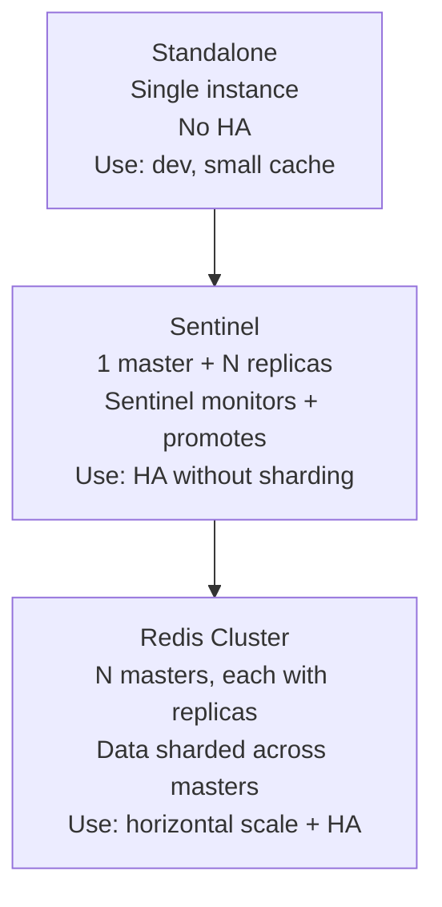
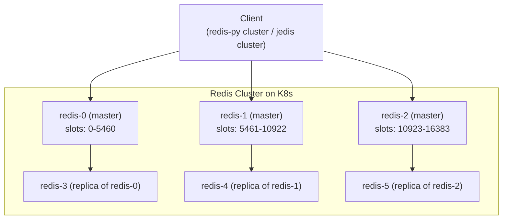
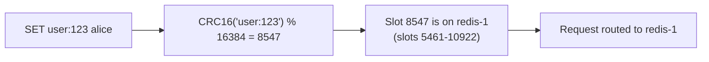
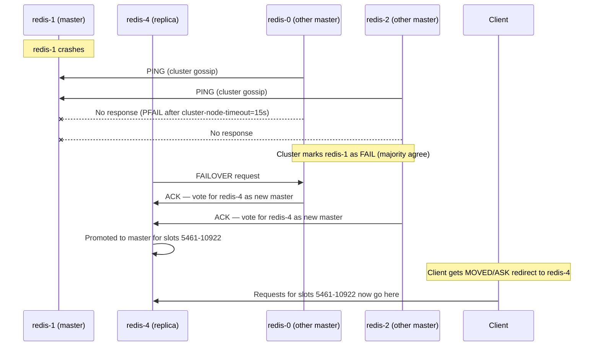
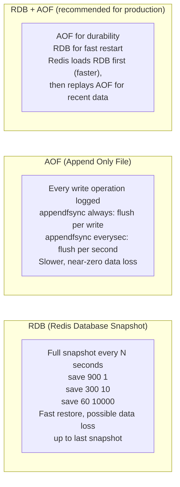

# Redis Cluster on Kubernetes

<div class="quiz-progress" data-quiz-progress>
  <span class="quiz-progress-label">0/0 checks</span>
  <span class="quiz-progress-bar"><span class="quiz-progress-fill"></span></span>
</div>

## Redis Modes



<div class="quiz-card">
  <p class="quiz-q">Sentinel gives you a master, N replicas, and automatic promotion when the master dies. Does adding Sentinel let you shard your dataset across multiple masters the way Redis Cluster does?</p>
  <button class="quiz-reveal">Reveal answer</button>
  <div class="quiz-a" hidden>No. Sentinel only adds high availability on top of a single master + replicas — the whole dataset still lives on one master. Sharding data across multiple masters is what Redis Cluster mode adds. Sentinel solves "HA without sharding"; Cluster solves "horizontal scale + HA" — they're not a smaller/bigger version of the same thing.</div>
</div>

---

## Redis Cluster Architecture (6-node minimum)



**16384 hash slots** are distributed across masters. Every key is hashed (`CRC16(key) % 16384`) to find which slot (and thus which master) owns it.

<div class="quiz-card">
  <p class="quiz-q">Why is a Redis Cluster's minimum size 6 nodes rather than just 3?</p>
  <button class="quiz-reveal">Reveal answer</button>
  <div class="quiz-a" hidden>3 masters is the minimum to own all 16384 hash slots and to have enough voting members for failover decisions, but on their own they have zero redundancy — lose one master and its slot range goes offline until it recovers. Each master needs at least one replica to fail over to, which is where the other 3 nodes come from: 3 masters + 3 replicas = 6. Without the replicas you'd have sharding but no HA.</div>
</div>

---

## Key Distribution (Hash Slots)



**Hash tags** `{tag}key` force keys to the same slot (for multi-key operations):
```
SET {user:123}.name alice   -- slot = CRC16('user:123') % 16384
SET {user:123}.email a@b.c  -- same slot
MGET {user:123}.name {user:123}.email  -- works (same slot)
```

<div class="quiz-card">
  <p class="quiz-q">Without a hash tag, do `{user:123}.name` and `{user:123}.email` hash to the same slot by default?</p>
  <button class="quiz-reveal">Reveal answer</button>
  <div class="quiz-a" hidden>No — without the <code>{}</code> hash tag, CRC16 is computed over the entire key string, so two different full keys land on essentially random, usually different, slots. The <code>{tag}</code> syntax tells Redis Cluster to hash only what's inside the braces, which is what forces both keys onto the same slot so a multi-key command like MGET can run against a single master instead of erroring out across nodes.</div>
</div>

---

## Failover



**Failover time:** `cluster-node-timeout` (default 15s) + election + promotion ≈ 15-30s.

Walk through the gossip-driven failover step by step:

<div class="stepper">
  <div class="stepper-panels">
    <div class="stepper-panel active">
      <strong>1. Stable.</strong> redis-1 is master for slots 5461-10922. redis-0 and redis-2 (the other masters) exchange routine <code>PING</code>/<code>PONG</code> gossip with it, as they do with every node.
    </div>
    <div class="stepper-panel">
      <strong>2. redis-1 crashes.</strong> It stops responding to gossip <code>PING</code>s from redis-0 and redis-2.
    </div>
    <div class="stepper-panel">
      <strong>3. PFAIL.</strong> After <code>cluster-node-timeout</code> (default 15s) with no response, each master that pinged it independently marks redis-1 <code>PFAIL</code> ("possibly failing") — just its own, local, unconfirmed suspicion so far.
    </div>
    <div class="stepper-panel">
      <strong>4. FAIL.</strong> Once a majority of masters agree redis-1 is <code>PFAIL</code>, the cluster promotes that to a cluster-wide <code>FAIL</code> state — now it's a confirmed, agreed-on fact, not one node's suspicion.
    </div>
    <div class="stepper-panel">
      <strong>5. Election.</strong> redis-4 (redis-1's replica) requests votes to become the new master. redis-0 and redis-2 each ACK once, for this epoch.
    </div>
    <div class="stepper-panel">
      <strong>6. Promotion.</strong> redis-4 is promoted to master for slots 5461-10922. Clients that had cached redis-1 as the owner get a <code>MOVED</code>/<code>ASK</code> redirect and start sending those slots' traffic to redis-4.
    </div>
  </div>
  <div class="stepper-controls">
    <button class="stepper-prev">← Prev</button>
    <span class="stepper-dots"></span>
    <span class="stepper-label"></span>
    <button class="stepper-next">Next →</button>
  </div>
</div>

<div class="quiz-card">
  <p class="quiz-q">redis-0 pings redis-1 and gets no response, so redis-0 marks redis-1 PFAIL. Does the cluster fail over to a replica at this point?</p>
  <button class="quiz-reveal">Reveal answer</button>
  <div class="quiz-a" hidden>Not yet. PFAIL is just one master's local, unconfirmed suspicion. Failover only starts once a <em>majority</em> of masters independently agree the node is down, which promotes it from PFAIL to a cluster-wide FAIL — only then does the replica request votes and get promoted. A single master's PFAIL alone is exactly the kind of transient network blip the majority-agreement step is designed to filter out.</div>
</div>

---

## Persistence: RDB vs AOF



<div class="toggle-switch">
  <div class="toggle-buttons">
    <button data-toggle-opt="rdb" class="state-warn">RDB only</button>
    <button data-toggle-opt="aof" class="state-warn">AOF only</button>
    <button data-toggle-opt="both" class="active state-ok">RDB + AOF</button>
  </div>
  <div class="toggle-panel" data-toggle-panel="rdb">
    Point-in-time snapshot on a schedule (<code>save 900 1</code>, <code>save 300 10</code>, <code>save 60 10000</code>). Restores fast — it's one file — but you lose every write since the last snapshot fired.
  </div>
  <div class="toggle-panel" data-toggle-panel="aof">
    Every write operation is logged as it happens. <code>appendfsync always</code> flushes on every write (safest, slowest); <code>appendfsync everysec</code> flushes once a second (the common default — worst case loses ~1s of writes). Slower to restore since the whole log has to be replayed.
  </div>
  <div class="toggle-panel active" data-toggle-panel="both">
    Recommended for production. AOF gives near-zero data loss, RDB gives a fast base to restore from. On restart Redis loads the RDB snapshot first (fast), then replays only the AOF entries written since that snapshot — not the whole AOF from scratch.
  </div>
</div>

<div class="quiz-card">
  <p class="quiz-q">With both RDB and AOF enabled, which one does Redis load first on restart?</p>
  <button class="quiz-reveal">Reveal answer</button>
  <div class="quiz-a" hidden>The RDB snapshot loads first, because loading one full-state file is fast. Redis then replays the AOF — but only the portion written since that snapshot, not the entire append-only log from the beginning — to bring the dataset up to the most recent write. Loading AOF first (or the whole AOF regardless of the snapshot) would make every restart as slow as a full log replay.</div>
</div>

```bash
# redis.conf
save 3600 1        # snapshot if 1 key changed in 1h
save 300 100       # snapshot if 100 keys changed in 5m
save 60 10000      # snapshot if 10000 keys changed in 1m
appendonly yes
appendfsync everysec  # fsync every second (good balance)
no-appendfsync-on-rewrite yes  # don't fsync during compaction
```

---

## Redis Cluster on K8s (StatefulSet)

```yaml
apiVersion: apps/v1
kind: StatefulSet
metadata:
  name: redis
spec:
  replicas: 6   # 3 masters + 3 replicas
  serviceName: redis-headless
  template:
    spec:
      containers:
      - name: redis
        image: redis:7.2-alpine
        command:
        - redis-server
        - /etc/redis/redis.conf
        - --cluster-enabled yes
        - --cluster-config-file /data/nodes.conf
        - --cluster-node-timeout 15000
        - --appendonly yes
        - --save 3600 1
        resources:
          limits:
            memory: 8Gi
          requests:
            memory: 4Gi
        volumeMounts:
        - name: data
          mountPath: /data
  volumeClaimTemplates:
  - metadata:
      name: data
    spec:
      accessModes: ["ReadWriteOnce"]
      storageClassName: premium-rwo
      resources:
        requests:
          storage: 50Gi
```

```bash
# Initialize the cluster (run once after pods start)
redis-cli --cluster create \
  redis-0.redis-headless:6379 \
  redis-1.redis-headless:6379 \
  redis-2.redis-headless:6379 \
  redis-3.redis-headless:6379 \
  redis-4.redis-headless:6379 \
  redis-5.redis-headless:6379 \
  --cluster-replicas 1   # 1 replica per master

# Check cluster state
redis-cli -c cluster info
redis-cli -c cluster nodes
```

---

## Backups

```bash
# Trigger RDB snapshot on primary
redis-cli BGSAVE
# Wait for completion
redis-cli LASTSAVE  # returns UNIX timestamp of last successful save

# Copy RDB to GCS
gsutil cp /data/dump.rdb gs://my-redis-backups/$(date +%Y%m%d)/dump.rdb

# Volume snapshot (quicker, consistent)
kubectl apply -f - << 'EOF'
apiVersion: snapshot.storage.k8s.io/v1
kind: VolumeSnapshot
metadata:
  name: redis-snapshot-$(date +%Y%m%d)
spec:
  source:
    persistentVolumeClaimName: data-redis-0
EOF
```

---

## Monitoring

```promql
# Memory usage (alert > 80% of maxmemory)
redis_memory_used_bytes / redis_memory_max_bytes > 0.8

# Cache hit rate (alert < 90%)
rate(redis_keyspace_hits_total[5m]) /
(rate(redis_keyspace_hits_total[5m]) + rate(redis_keyspace_misses_total[5m])) < 0.9

# Cluster state (1 = ok)
redis_cluster_state != 1

# Replica count (this counts replicas, NOT lag)
redis_connected_slaves < 1  # alert if no replicas
# For true lag use: master_repl_offset − slave's slave_repl_offset (bytes behind)
```
