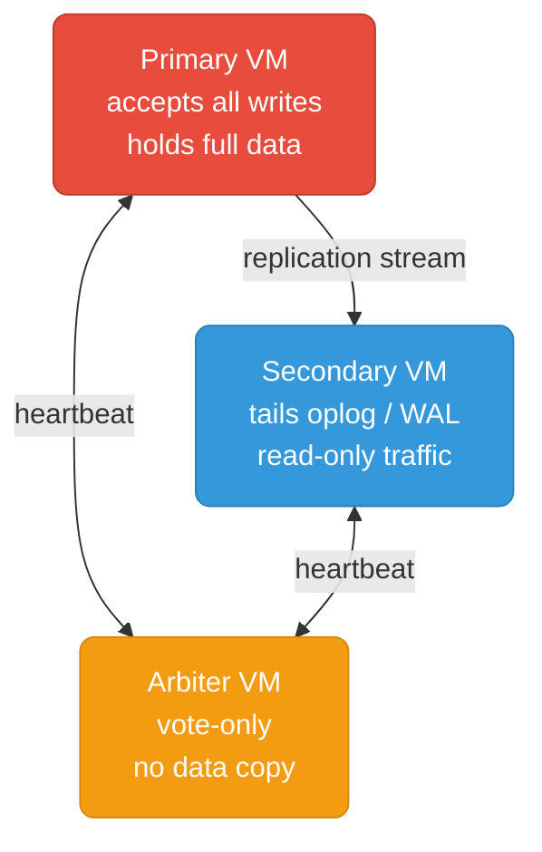

# Databases on VMs (On-Prem)

Running stateful databases on bare VMs — firewall rules, config tuning, replica set bootstrap, user management, and Prometheus monitoring for each database.

  0/0 checks
  

## Why VMs Instead of Kubernetes?

Running databases directly on VMs skips the Kubernetes storage and operator layer — simpler to reason about, easier to tune at the OS level, and often the only option when Kubernetes isn't available or the team doesn't have K8s expertise.

**When VMs make more sense than K8s:**
- On-prem infrastructure without a Kubernetes platform
- Teams that are strong on Linux/systemd but not on K8s storage and operators
- Databases that need direct NUMA/CPU pinning or non-standard kernel tuning
- Compliance environments where workload isolation must be at the hypervisor level

  
Why would a team choose to run databases on bare VMs instead of Kubernetes, even if Kubernetes is available?

  <button class="quiz-reveal">Reveal answer</button>
  
Running databases on VMs avoids the complexity of the Kubernetes storage and operator layer (persistent volumes, StatefulSets, CSI drivers, and database-specific operators). VMs allow direct OS-level tuning — NUMA pinning, huge pages, kernel parameters — that is difficult or impossible to guarantee inside a container. Some compliance requirements mandate hypervisor-level workload isolation that containers cannot provide. Teams with strong Linux/systemd expertise but limited Kubernetes knowledge can manage VMs confidently, whereas running a production database on Kubernetes demands deep knowledge of both K8s storage primitives and the specific database operator.

## Files

| File | Database | Topics |
|------|----------|--------|
| [mongodb.md](./mongodb.md) | MongoDB | Replica set on VMs, firewall rules, mongod.conf, cacheSizeGB, users, write concern, mongodb-exporter |

## Common Patterns

  
In the diagram above, why does the replication stream flow only from Primary → Secondary, while heartbeats are bidirectional between all three nodes?

  <button class="quiz-reveal">Reveal answer</button>
  
Only the <strong>Primary accepts writes</strong>, so the replication stream is one-directional: the Primary writes to its oplog/WAL, and the Secondary tails it to stay in sync. The Secondary never sends data back to the Primary — it only receives it. <strong>Heartbeats</strong> are bidirectional because every node needs to know the health of every other node to participate in leader election. If the Primary disappears, the Secondary and Arbiter must detect the failure and hold a vote — for that vote to work, they must be able to reach each other. The Arbiter carries no data but its vote can break a tie, so it must stay connected to both sides at all times.

**Firewall rules come first.** Every VM-based cluster depends on nodes reaching each other on the database port. Set rules and verify with `nc -zv` before touching any config file — a firewall problem looks identical to a config bug and wastes hours.

  
What is the recurring four-step pattern across every VM-hosted database setup, regardless of which database you are deploying?

  <button class="quiz-reveal">Reveal answer</button>
  
Every VM-hosted database setup follows the same four-step pattern: <strong>1. Firewall isolation</strong> — open only the database port between cluster nodes and trusted application subnets; verify connectivity with <code>nc -zv</code> before touching any config file. <strong>2. Config tuning</strong> — adjust the database config file (mongod.conf, postgresql.conf, etc.) for memory limits, bind addresses, replication settings, and OS-level parameters like huge pages and open-file limits. <strong>3. Replica setup</strong> — bootstrap the replica set or standby so data is durably replicated before taking any production traffic. <strong>4. Monitoring</strong> — wire up a Prometheus exporter (mongodb-exporter, postgres-exporter, etc.) from day one so the cluster is observable before the first outage, not after it.

