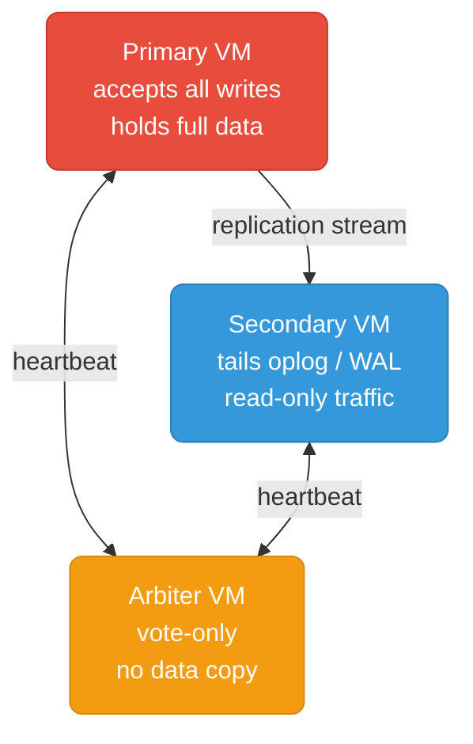

# Databases on VMs (On-Prem)

Running stateful databases on bare VMs — firewall rules, config tuning, replica set bootstrap, user management, and Prometheus monitoring for each database.

  0/0 checks
  

## Why VMs Instead of Kubernetes?

Running databases directly on VMs skips the Kubernetes storage and operator layer — simpler to reason about, easier to tune at the OS level, and often the only option when Kubernetes isn't available or the team doesn't have K8s expertise.

**When VMs make more sense than K8s:**
- On-prem infrastructure without a Kubernetes platform
- Teams that are strong on Linux/systemd but not on K8s storage and operators
- Databases that need direct NUMA/CPU pinning or non-standard kernel tuning
- Compliance environments where workload isolation must be at the hypervisor level

## Files

| File | Database | Topics |
|------|----------|--------|
| [mongodb.md](./mongodb.md) | MongoDB | Replica set on VMs, firewall rules, mongod.conf, cacheSizeGB, users, write concern, mongodb-exporter |

## Common Patterns

**Firewall rules come first.** Every VM-based cluster depends on nodes reaching each other on the database port. Set rules and verify with `nc -zv` before touching any config file — a firewall problem looks identical to a config bug and wastes hours.
