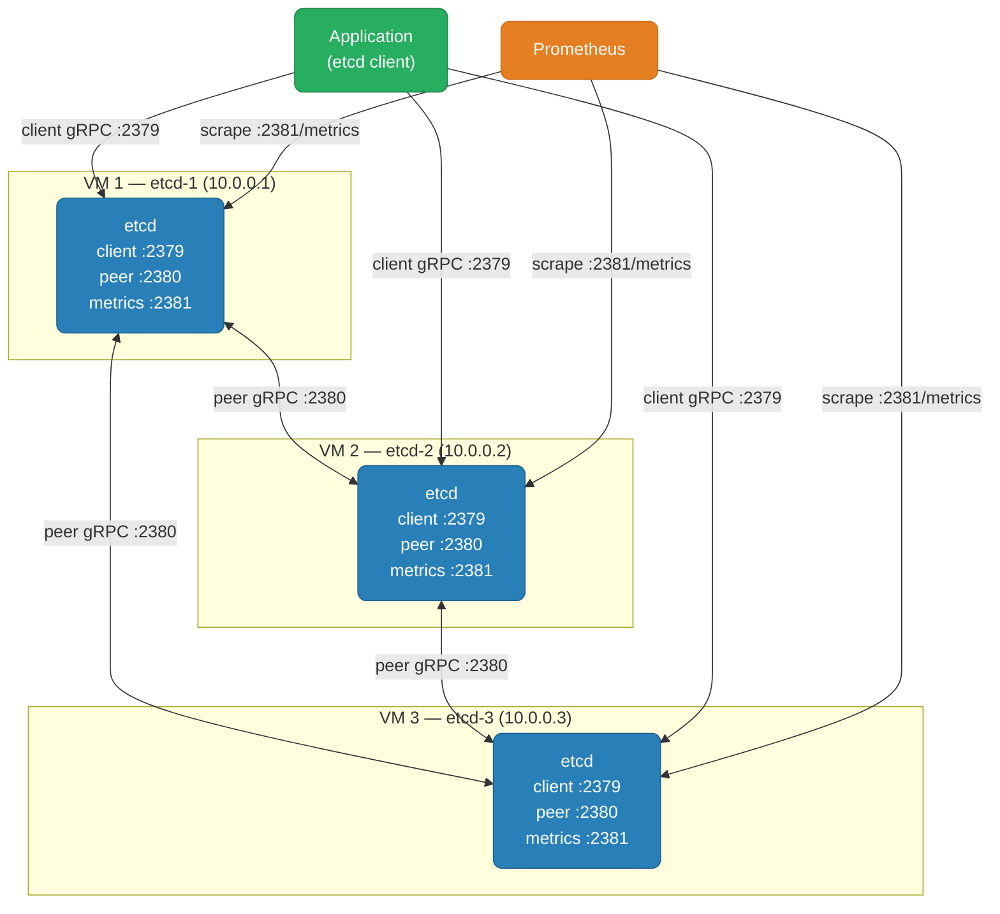

# etcd Cluster — VM Setup

Three VMs: **etcd-1** (10.0.0.1), **etcd-2** (10.0.0.2), **etcd-3** (10.0.0.3). This guide walks every step from bare OS to a production-ready etcd cluster — TLS mutual auth, systemd unit, bootstrap, member management, disaster recovery runbook, and Prometheus monitoring.

<div class="quiz-progress" data-quiz-progress>
  <span class="quiz-progress-label">0/0 checks</span>
  <span class="quiz-progress-bar"><span class="quiz-progress-fill"></span></span>
</div>

<div class="prereq-chips">
  <span class="prereq-label">Prerequisites</span>
  <a href="/topic/databases/etcd" class="prereq-chip">etcd Internals</a>
</div>

---

## Cluster Architecture



The etcd client library handles leader discovery automatically — give it all three endpoints and it finds the leader on its own. Client requests on 2379 are separate from Raft peer replication on 2380, which means you can firewall each independently.

<div class="quiz-card">
  <p class="quiz-q">Why does etcd use two separate ports — 2379 for clients and 2380 for peer communication — instead of multiplexing everything on one port?</p>
  <button class="quiz-reveal">Reveal answer</button>
  <div class="quiz-a" hidden>Separating the ports lets you apply different firewall rules to each: client traffic (2379) is opened to app servers and Prometheus, while peer traffic (2380) is restricted to only the etcd member IPs. If both were on one port you'd either have to expose peer replication to every app server or restrict client access to only etcd IPs — neither is correct. Separate ports also make TLS cert issuance cleaner since peer certs and client certs have different SANs and trust requirements.</div>
</div>

---

## 1. Firewall Rules

Open these ports **before** bootstrapping — a firewall misconfiguration during bootstrap looks identical to a cluster bug and wastes hours.

| Port | Protocol | From | To | Why |
|------|----------|------|----|-----|
| 2379 | TCP | App servers, Prometheus | All etcd nodes | Client API |
| 2380 | TCP | etcd members only | All etcd nodes | Raft peer replication |
| 2381 | TCP | Prometheus | All etcd nodes | Native metrics endpoint |

<div class="tab-group">
  <div class="tab-buttons">
    <button data-tab="firewalld" class="active">firewalld (RHEL/Rocky)</button>
    <button data-tab="ufw">ufw (Ubuntu/Debian)</button>
    <button data-tab="iptables">iptables (raw)</button>
  </div>
  <div class="tab-panels">
    <div class="tab-panel active" data-tab-panel="firewalld">

```bash
# Run on ALL etcd nodes — allow peer traffic between members
firewall-cmd --permanent --add-rich-rule='rule family="ipv4" source address="10.0.0.1" port port="2380" protocol="tcp" accept'
firewall-cmd --permanent --add-rich-rule='rule family="ipv4" source address="10.0.0.2" port port="2380" protocol="tcp" accept'
firewall-cmd --permanent --add-rich-rule='rule family="ipv4" source address="10.0.0.3" port port="2380" protocol="tcp" accept'

# Allow client and metrics from app tier / Prometheus
firewall-cmd --permanent --add-port=2379/tcp
firewall-cmd --permanent --add-port=2381/tcp

firewall-cmd --reload
firewall-cmd --list-all
```

    </div>
    <div class="tab-panel" data-tab-panel="ufw">

```bash
# Run on ALL etcd nodes
# Peer traffic — only from other etcd members
ufw allow from 10.0.0.1 to any port 2380 proto tcp
ufw allow from 10.0.0.2 to any port 2380 proto tcp
ufw allow from 10.0.0.3 to any port 2380 proto tcp

# Client and metrics — from app subnet and Prometheus
ufw allow 2379/tcp
ufw allow 2381/tcp

ufw status numbered
```

    </div>
    <div class="tab-panel" data-tab-panel="iptables">

```bash
# Peer: allow from each etcd member (run on all nodes)
iptables -A INPUT -p tcp -s 10.0.0.1 --dport 2380 -j ACCEPT
iptables -A INPUT -p tcp -s 10.0.0.2 --dport 2380 -j ACCEPT
iptables -A INPUT -p tcp -s 10.0.0.3 --dport 2380 -j ACCEPT

# Client and metrics
iptables -A INPUT -p tcp --dport 2379 -j ACCEPT
iptables -A INPUT -p tcp --dport 2381 -j ACCEPT

# Persist (Debian/Ubuntu)
iptables-save > /etc/iptables/rules.v4
```

    </div>
  </div>
</div>

### Connectivity check — before you continue

```bash
# From etcd-1 — must succeed before any etcd config
nc -zv 10.0.0.2 2380   # Expected: Connection to 10.0.0.2 2380 port [tcp] succeeded!
nc -zv 10.0.0.3 2380
nc -zv 10.0.0.2 2379
nc -zv 10.0.0.3 2379
```

<div class="quiz-card">
  <p class="quiz-q">From etcd-1, `nc -zv 10.0.0.2 2380` hangs indefinitely with no output. A colleague says the firewall rule is in place. What else could cause this?</p>
  <button class="quiz-reveal">Reveal answer</button>
  <div class="quiz-a" hidden>"Connection refused" means the port is reachable but nothing is listening — etcd isn't running, or is bound to the wrong IP. Hanging indefinitely means the TCP SYN packet is being dropped before it reaches the destination — the firewall rule is the most likely cause, but a network-level ACL, security group, or host-based firewall on the destination (that supersedes the rule you added) can also silently drop packets. Check <code>iptables -L -n -v</code> on the destination node for a DROP rule catching traffic before your ACCEPT rule.</div>
</div>

---

## 2. Directory & File Layout

```bash
# Create a system user with no login shell (runs etcd process)
useradd -r -s /sbin/nologin -d /var/lib/etcd etcd

# Data dir — holds the bbolt DB and WAL; must be on fast local storage (NVMe/SSD)
mkdir -p /var/lib/etcd

# Config and TLS dirs
mkdir -p /etc/etcd/tls

# Ownership: etcd process needs read/write on both
chown -R etcd:etcd /var/lib/etcd /etc/etcd

# Strict permissions: no other user should read the data dir
chmod 700 /var/lib/etcd
chmod 700 /etc/etcd/tls
```

**Ulimits** — etcd opens many file descriptors for peer connections and watch streams. Add to `/etc/security/limits.conf`:

```
etcd  soft  nofile  65536
etcd  hard  nofile  65536
```

Or set `LimitNOFILE=65536` in the systemd `[Service]` block (shown in §4).

---

## 3. TLS — CA and Cert Generation

etcd requires mutual TLS on both peer and client channels for a production cluster. Generate all certs on one workstation, distribute to each node. **Never copy the CA private key to the etcd nodes** — only the CA cert is needed there for verification.

```bash
# ─── CA (run once, on your workstation) ──────────────────────────────────────
openssl genrsa -out ca.key 4096
openssl req -new -x509 -days 3650 -key ca.key -out ca.crt \
  -subj "/CN=etcd-ca"
```

**Peer cert — one per member.** Peer certs must include the member's hostname AND IP in the SAN because other members may connect using either. Create `peer-etcd-1.cnf`:

```ini
[req]
req_extensions     = v3_req
distinguished_name = req_distinguished_name
[req_distinguished_name]
[v3_req]
keyUsage         = keyEncipherment,dataEncipherment
extendedKeyUsage = serverAuth,clientAuth
subjectAltName   = @alt_names
[alt_names]
DNS.1 = etcd-1                 # hostname
IP.1  = 10.0.0.1               # IP (must match ETCD_LISTEN_PEER_URLS)
IP.2  = 127.0.0.1              # loopback — used by local health checks
```

```bash
# Generate peer cert for etcd-1 (repeat with etcd-2.cnf / etcd-3.cnf for other members)
openssl genrsa -out peer-etcd-1.key 4096
openssl req -new -key peer-etcd-1.key -out peer-etcd-1.csr \
  -subj "/CN=etcd-1" \
  -config peer-etcd-1.cnf
openssl x509 -req -in peer-etcd-1.csr -CA ca.crt -CAkey ca.key \
  -CAcreateserial -out peer-etcd-1.crt -days 825 \
  -extensions v3_req -extfile peer-etcd-1.cnf
```

**Client cert** — used by etcdctl, Prometheus, and the K8s API server:

```bash
openssl genrsa -out client.key 4096
openssl req -new -key client.key -out client.csr -subj "/CN=etcd-client"
openssl x509 -req -in client.csr -CA ca.crt -CAkey ca.key \
  -CAcreateserial -out client.crt -days 825
```

**Distribute to each node:**

```bash
# Copy to etcd-1 (adapt paths for etcd-2, etcd-3 — use their respective peer certs)
scp ca.crt peer-etcd-1.crt peer-etcd-1.key root@10.0.0.1:/etc/etcd/tls/
scp ca.crt peer-etcd-2.crt peer-etcd-2.key root@10.0.0.2:/etc/etcd/tls/
scp ca.crt peer-etcd-3.crt peer-etcd-3.key root@10.0.0.3:/etc/etcd/tls/

# Fix permissions on each node (private key must not be world-readable)
chmod 400 /etc/etcd/tls/*.key
chown -R etcd:etcd /etc/etcd/tls/
```

**Set env vars so etcdctl uses TLS without repeating flags every command:**

```bash
export ETCDCTL_API=3
export ETCDCTL_CACERT=/etc/etcd/tls/ca.crt
export ETCDCTL_CERT=/etc/etcd/tls/client.crt
export ETCDCTL_KEY=/etc/etcd/tls/client.key
export ETCDCTL_ENDPOINTS=https://10.0.0.1:2379,https://10.0.0.2:2379,https://10.0.0.3:2379
```

Add these to `/etc/profile.d/etcdctl.sh` on all nodes for persistence.

<div class="quiz-card">
  <p class="quiz-q">The peer cert only has the IP address in its SAN, not the hostname. A cluster member tries to connect using the hostname `etcd-2` instead of `10.0.0.2`. What happens?</p>
  <button class="quiz-reveal">Reveal answer</button>
  <div class="quiz-a" hidden>The TLS handshake fails with a "certificate is not valid for any names" error. TLS validation checks whether the hostname or IP used to connect is present in the cert's SAN list. If the peer connects via hostname and the cert only has the IP, the hostname doesn't match — the connection is rejected. The fix is to always include both DNS and IP SANs, which is why the openssl.cnf above has both DNS.1 and IP.1. This also means you must decide the final IPs and hostnames before generating certs — cert rotation later is painful.</div>
</div>

---

## 4. etcd.service — Annotated Config

Use an `EnvironmentFile` for clarity. Repeat steps on each node, changing only the node-specific values.

**/etc/etcd/etcd.env** (etcd-1 example — change `ETCD_NAME` and IP references per node):

```bash
# Node identity — must be unique in the cluster
ETCD_NAME=etcd-1

# Data directory — WAL and bbolt DB land here; must be fast local storage
ETCD_DATA_DIR=/var/lib/etcd

# ── Listening ────────────────────────────────────────────────────────────────
# Peer: only accept peer connections from other etcd members
ETCD_LISTEN_PEER_URLS=https://10.0.0.1:2380

# Client: accept client gRPC from network + local loopback (for etcdctl on this node)
ETCD_LISTEN_CLIENT_URLS=https://10.0.0.1:2379,https://127.0.0.1:2379

# Metrics: separate port, no TLS required (Prometheus scrapes this)
ETCD_LISTEN_METRICS_URLS=http://10.0.0.1:2381

# ── Advertising ──────────────────────────────────────────────────────────────
# What other members announce to clients — must be reachable from app servers
ETCD_ADVERTISE_CLIENT_URLS=https://10.0.0.1:2379

# What this member announces to other members for peer traffic
ETCD_INITIAL_ADVERTISE_PEER_URLS=https://10.0.0.1:2380

# ── Bootstrap (used only on first start of a new cluster) ────────────────────
# All members listed — must match exactly on all three nodes
ETCD_INITIAL_CLUSTER=etcd-1=https://10.0.0.1:2380,etcd-2=https://10.0.0.2:2380,etcd-3=https://10.0.0.3:2380

# Unique per cluster — prevents two separate clusters merging accidentally
ETCD_INITIAL_CLUSTER_TOKEN=etcd-prod-cluster-1

# 'new' for first boot; change to 'existing' when joining a running cluster
ETCD_INITIAL_CLUSTER_STATE=new

# ── TLS — peer (member-to-member) ────────────────────────────────────────────
ETCD_PEER_CERT_FILE=/etc/etcd/tls/peer-etcd-1.crt
ETCD_PEER_KEY_FILE=/etc/etcd/tls/peer-etcd-1.key
ETCD_PEER_TRUSTED_CA_FILE=/etc/etcd/tls/ca.crt
ETCD_PEER_CLIENT_CERT_AUTH=true         # require peers to present a valid client cert

# ── TLS — client (apps to etcd) ──────────────────────────────────────────────
ETCD_CERT_FILE=/etc/etcd/tls/peer-etcd-1.crt   # server cert shown to clients
ETCD_KEY_FILE=/etc/etcd/tls/peer-etcd-1.key
ETCD_TRUSTED_CA_FILE=/etc/etcd/tls/ca.crt
ETCD_CLIENT_CERT_AUTH=true              # require clients to present a valid cert

# ── Compaction ───────────────────────────────────────────────────────────────
ETCD_AUTO_COMPACTION_MODE=periodic      # preferred for K8s; 'revision' also available
ETCD_AUTO_COMPACTION_RETENTION=1h      # keep 1h of revision history; older versions deleted

# ── Storage quota ────────────────────────────────────────────────────────────
ETCD_QUOTA_BACKEND_BYTES=8589934592    # 8 GB hard cap; alert at 80% (~6.4 GB)

# ── Metrics ──────────────────────────────────────────────────────────────────
ETCD_METRICS=extensive                 # expose per-grpc-method + histogram metrics on :2381
```

**/etc/systemd/system/etcd.service:**

```ini
[Unit]
Description=etcd key-value store
Documentation=https://etcd.io/docs/
After=network-online.target
Wants=network-online.target

[Service]
Type=notify
User=etcd
EnvironmentFile=/etc/etcd/etcd.env
ExecStart=/usr/local/bin/etcd
Restart=on-failure
RestartSec=5s

# File descriptor limit — etcd opens many connections for watches and peers
LimitNOFILE=65536

# Prevent OOM kill; etcd must not be killed under memory pressure
OOMScoreAdjust=-999

[Install]
WantedBy=multi-user.target
```

```bash
systemctl daemon-reload
systemctl enable etcd
```

**Bootstrap sequence:**

<div class="stepper">
  <div class="stepper-panels">
    <div class="stepper-panel active">
      <strong>1. Start etcd-1.</strong> It starts listening and tries to find peers. Since <code>ETCD_INITIAL_CLUSTER</code> lists all three members, it waits for a majority before electing a leader. No writes can land yet.
    </div>
    <div class="stepper-panel">
      <strong>2. Start etcd-2.</strong> Two of three members are now reachable — quorum is met. An election fires and one of the two becomes leader. The cluster is now operational (2/3 healthy = majority), but only with two members.
    </div>
    <div class="stepper-panel">
      <strong>3. Start etcd-3.</strong> Joins the running cluster as a follower. All three members are healthy.
    </div>
    <div class="stepper-panel">
      <strong>4. Verify health.</strong> <code>etcdctl endpoint health</code> should show all three as healthy. <code>etcdctl endpoint status --write-out=table</code> shows one leader and two followers, plus current DB size and revision.
    </div>
  </div>
  <div class="stepper-controls">
    <button class="stepper-prev">← Prev</button>
    <span class="stepper-dots"></span>
    <span class="stepper-label"></span>
    <button class="stepper-next">Next →</button>
  </div>
</div>

<div class="quiz-card">
  <p class="quiz-q"><code>ETCD_INITIAL_CLUSTER_STATE=new</code> is left in the EnvironmentFile after the cluster's first boot. Is this a problem on subsequent restarts?</p>
  <button class="quiz-reveal">Reveal answer</button>
  <div class="quiz-a" hidden>No — <code>ETCD_INITIAL_CLUSTER_STATE</code> is only read during the very first start of a fresh data directory. Once the etcd member has initialized its data dir and joined a cluster, that value is written into the data dir itself. On all subsequent restarts, etcd reads its persistent state from disk and ignores <code>ETCD_INITIAL_CLUSTER_STATE</code>. However, leaving it as <code>new</code> is a footgun: if you ever wipe the data dir and restart, etcd will try to bootstrap a new single-member cluster rather than rejoin the existing one. Best practice is to change it to <code>existing</code> immediately after the initial cluster comes up.</div>
</div>

---

## 5. Member Operations

```bash
# ─── Adding a member ─────────────────────────────────────────────────────────

# Step 1: register the new member (as a learner — non-voting, doesn't affect quorum)
etcdctl member add etcd-4 \
  --peer-urls=https://10.0.0.4:2380 \
  --learner
# Output includes the new member's ID — note it

# Step 2: write /etc/etcd/etcd.env on etcd-4 with:
#   ETCD_INITIAL_CLUSTER_STATE=existing   ← not 'new'
#   ETCD_INITIAL_CLUSTER=<all 4 members>
# Then start etcd on etcd-4

# Step 3: check sync progress (raftAppliedIndex should approach leader's)
etcdctl endpoint status --endpoints=https://10.0.0.4:2379 --write-out=table

# Step 4: promote once caught up (learner becomes voting member)
etcdctl member promote <member-id>

# ─── Removing a member ───────────────────────────────────────────────────────

# Remove BEFORE stopping the process — removing a stopped member avoids quorum math issues
etcdctl member remove <member-id>
# Then stop etcd on the departing node
systemctl stop etcd

# Verify cluster is healthy after removal
etcdctl endpoint health
etcdctl member list
```

<div class="quiz-card">
  <p class="quiz-q">You add a 4th member directly as a voting member (no learner flag) to a 3-node cluster. The new member's snapshot download takes 10 minutes. What risk does this introduce vs the learner approach?</p>
  <button class="quiz-reveal">Reveal answer</button>
  <div class="quiz-a" hidden>A voting 4th member changes quorum from 2-of-3 to 3-of-4. During the 10-minute sync the new member is registered but not caught up — it can participate in elections (and vote incorrectly, since it doesn't have the full log) but can't serve data. More critically: if one of the original three nodes fails during this window, only 2 of 4 members are reachable — below quorum — and the cluster halts. With a learner, quorum is still 2-of-3 throughout the sync because learners don't count toward quorum math. Only after promotion (when the sync is complete) does quorum shift to 3-of-4.</div>
</div>

---

## 6. Disaster Recovery Runbook

<div class="tab-group">
  <div class="tab-buttons">
    <button data-tab="intact" class="active">Single node — data intact</button>
    <button data-tab="corrupt">Single node — data lost</button>
    <button data-tab="quorum">Quorum loss</button>
    <button data-tab="restore">Full snapshot restore</button>
  </div>
  <div class="tab-panels">
    <div class="tab-panel active" data-tab-panel="intact">

**Node crashed but data dir is intact.** Just restart — etcd will reload from its persistent state and rejoin the cluster as a follower.

```bash
systemctl restart etcd

# Verify it rejoined and is replicating
etcdctl endpoint health --endpoints=https://10.0.0.X:2379
etcdctl endpoint status --write-out=table   # check raftAppliedIndex is catching up
```

If it fails to rejoin, check `/var/log/messages` or `journalctl -u etcd` for TLS or cluster token mismatches.

    </div>
    <div class="tab-panel" data-tab-panel="corrupt">

**Data dir is corrupted or wiped.** Remove the old member from the cluster, wipe the data dir, re-add as learner.

```bash
# On the surviving cluster (2-node quorum is enough to proceed):
etcdctl member remove <dead-member-id>    # get ID from 'member list'
etcdctl member add etcd-X \
  --peer-urls=https://10.0.0.X:2380 \
  --learner

# On the recovered node:
systemctl stop etcd                       # ensure it's fully stopped
rm -rf /var/lib/etcd/*                    # wipe corrupted data
chown -R etcd:etcd /var/lib/etcd

# Update EnvironmentFile on the recovered node:
# ETCD_INITIAL_CLUSTER_STATE=existing     ← joining an existing cluster
# ETCD_INITIAL_CLUSTER=<all members including this one>

systemctl start etcd

# Wait for sync — watch raftAppliedIndex approach leader
watch -n 2 "etcdctl endpoint status --endpoints=https://10.0.0.X:2379 --write-out=table"

# Promote once fully synced
etcdctl member promote <new-learner-id>
```

    </div>
    <div class="tab-panel" data-tab-panel="quorum">

**Majority of nodes are permanently gone.** Last resort — use `--force-new-cluster` to bootstrap a new single-member cluster from the surviving node's data, then re-add others.

```bash
# Step 1: find the most up-to-date surviving member
etcdctl endpoint status --write-out=table
# Look at "raft applied index" — highest value = most data

# Step 2: on that node, stop etcd and add --force-new-cluster
systemctl stop etcd

# Edit /etc/systemd/system/etcd.service:
# Add to ExecStart: --force-new-cluster
# OR add to EnvironmentFile: ETCD_FORCE_NEW_CLUSTER=true
systemctl daemon-reload
systemctl start etcd

# Step 3: verify single-member cluster is healthy
etcdctl endpoint health --endpoints=https://127.0.0.1:2379

# Step 4: IMMEDIATELY remove --force-new-cluster (leaving it is dangerous)
systemctl stop etcd
# Remove the flag from etcd.service / EnvironmentFile
systemctl daemon-reload
systemctl start etcd

# Step 5: re-add the other members as learners
etcdctl member add etcd-2 --peer-urls=https://10.0.0.2:2380 --learner
# Wipe etcd-2's data dir, set ETCD_INITIAL_CLUSTER_STATE=existing, start etcd-2
# Repeat for etcd-3
# Promote each once synced
```

**Warning:** `--force-new-cluster` truncates the Raft log to the current snapshot. Any writes that committed on the dead majority but haven't been applied to the surviving node are permanently lost. This is the CP tradeoff.

    </div>
    <div class="tab-panel" data-tab-panel="restore">

**All nodes' data is lost — restore from snapshot backup.**

```bash
# Step 1: stop etcd on all members
systemctl stop etcd

# Step 2: restore snapshot to a fresh data dir — run on EACH member
# Each restore command differs only in --name and --initial-advertise-peer-urls

# On etcd-1:
etcdctl snapshot restore /backup/etcd-snapshot.db \
  --name etcd-1 \
  --initial-cluster "etcd-1=https://10.0.0.1:2380,etcd-2=https://10.0.0.2:2380,etcd-3=https://10.0.0.3:2380" \
  --initial-cluster-token etcd-prod-cluster-1 \
  --initial-advertise-peer-urls https://10.0.0.1:2380 \
  --data-dir /var/lib/etcd        # restore writes directly into data dir
chown -R etcd:etcd /var/lib/etcd

# On etcd-2:
etcdctl snapshot restore /backup/etcd-snapshot.db \
  --name etcd-2 \
  --initial-cluster "etcd-1=https://10.0.0.1:2380,etcd-2=https://10.0.0.2:2380,etcd-3=https://10.0.0.3:2380" \
  --initial-cluster-token etcd-prod-cluster-1 \
  --initial-advertise-peer-urls https://10.0.0.2:2380 \
  --data-dir /var/lib/etcd
chown -R etcd:etcd /var/lib/etcd

# On etcd-3 (same pattern)...

# Step 3: set ETCD_INITIAL_CLUSTER_STATE=new in EnvironmentFile on all nodes
# (snapshot restore creates a fresh cluster identity)

# Step 4: start all members — start them close together (within election-timeout)
# Start etcd-1, etcd-2, etcd-3 in quick succession

# Step 5: verify
etcdctl endpoint health
etcdctl endpoint status --write-out=table
```

    </div>
  </div>
</div>

<div class="quiz-card">
  <p class="quiz-q"><code>--force-new-cluster</code> is accidentally left in the systemd unit after the recovery. The cluster is running fine with all three members re-added. On the next routine restart of that node, what happens?</p>
  <button class="quiz-reveal">Reveal answer</button>
  <div class="quiz-a" hidden>The node will attempt to bootstrap itself as a new single-member cluster, ignoring its existing cluster identity and peer list. It will create a new cluster with a different cluster ID — causing a cluster ID mismatch when the other two members try to connect to it. Peer connections will be rejected (etcd refuses connections from a different cluster ID) and the node will be isolated. This is why the very next step after force-new-cluster recovery is to remove the flag before any restart happens. Always verify with <code>grep force-new-cluster /etc/systemd/system/etcd.service</code> after recovery.</div>
</div>

---

## 7. Monitoring

etcd exposes Prometheus metrics natively on port 2381 — no separate exporter process needed.

```yaml
# /etc/prometheus/prometheus.yml — add this scrape job
scrape_configs:
  - job_name: etcd
    scheme: https
    tls_config:
      ca_file:   /etc/prometheus/tls/etcd-ca.crt
      cert_file: /etc/prometheus/tls/etcd-client.crt
      key_file:  /etc/prometheus/tls/etcd-client.key
    static_configs:
      - targets:
          - 10.0.0.1:2381
          - 10.0.0.2:2381
          - 10.0.0.3:2381
```

```yaml
# alerting-rules/etcd.yaml
groups:
  - name: etcd
    rules:
      - alert: EtcdWALFsyncSlow
        expr: histogram_quantile(0.99, rate(etcd_disk_wal_fsync_duration_seconds_bucket[5m])) > 0.01
        for: 5m
        labels: { severity: warning }
        annotations:
          summary: "etcd WAL fsync p99 > 10ms — disk I/O is limiting write throughput"

      - alert: EtcdBackendCommitSlow
        expr: histogram_quantile(0.99, rate(etcd_disk_backend_commit_duration_seconds_bucket[5m])) > 0.25
        for: 5m
        labels: { severity: warning }
        annotations:
          summary: "etcd backend commit p99 > 250ms — consider defrag or faster disk"

      - alert: EtcdDbSizeHigh
        expr: etcd_mvcc_db_total_size_in_bytes / etcd_server_quota_backend_bytes > 0.80
        for: 5m
        labels: { severity: warning }
        annotations:
          summary: "etcd DB size > 80% of quota — compact and defrag before NOSPACE alarm fires"

      - alert: EtcdLeaderChanging
        expr: rate(etcd_server_leader_changes_seen_total[1h]) > 1
        for: 5m
        labels: { severity: critical }
        annotations:
          summary: "etcd leader changing frequently — check disk WAL fsync latency and peer round-trip"

      - alert: EtcdProposalsFailing
        expr: rate(etcd_server_proposals_failed_total[5m]) > 0
        for: 2m
        labels: { severity: critical }
        annotations:
          summary: "etcd proposals failing — check quorum, disk, and network"

      - alert: EtcdPeerRttHigh
        expr: histogram_quantile(0.99, rate(etcd_network_peer_round_trip_time_seconds_bucket[5m])) > 0.05
        for: 5m
        labels: { severity: warning }
        annotations:
          summary: "etcd peer round-trip p99 > 50ms — heartbeat delays may cause re-elections"
```

Grafana dashboard: import **etcd mixin** (ID `3070`) or the official etcd dashboard at `https://github.com/etcd-io/etcd/tree/main/contrib/mixin`.

---

## 8. Operational Runbook

### Health checks at a glance

```bash
# All-member health (TLS flags via env vars set in §3)
etcdctl endpoint health

# Status table: leader, revision, DB size, raftAppliedIndex per member
etcdctl endpoint status --write-out=table

# Alarm check
etcdctl alarm list

# Member list with IDs (need IDs for remove/promote)
etcdctl member list --write-out=table

# DB size vs quota on each member
etcdctl endpoint status --write-out=json \
  | jq '.[] | {endpoint: .Endpoint, dbSize: .Status.dbSize, quota: .Status.dbSizeInUse}'
```

### Common issues and fixes

<div class="tab-group">
  <div class="tab-buttons">
    <button data-tab="nospace" class="active">NOSPACE alarm</button>
    <button data-tab="tls-err">TLS handshake error</button>
    <button data-tab="elections">Frequent re-elections</button>
    <button data-tab="unstarted">Member stuck unstarted</button>
  </div>
  <div class="tab-panels">
    <div class="tab-panel active" data-tab-panel="nospace">

```bash
# Symptom: etcdctl writes return "mvcc: database space exceeded"
# Step 1: compact (frees internal pages, does not shrink file)
REV=$(etcdctl endpoint status --write-out=json | jq '.[0].Status.header.revision')
etcdctl compact $REV

# Step 2: defrag each member one at a time (blocks that member briefly)
etcdctl defrag --endpoints=https://10.0.0.1:2379
etcdctl defrag --endpoints=https://10.0.0.2:2379
etcdctl defrag --endpoints=https://10.0.0.3:2379

# Step 3: disarm alarm
etcdctl alarm disarm

# Step 4: verify
etcdctl alarm list           # should be empty
etcdctl endpoint status --write-out=table  # DB size should be smaller
```

    </div>
    <div class="tab-panel" data-tab-panel="tls-err">

```bash
# Symptom: "certificate signed by unknown authority" or "x509: SAN mismatch"

# Check peer cert SANs on the problematic member
openssl x509 -noout -text -in /etc/etcd/tls/peer-etcd-1.crt | grep -A5 "Subject Alternative"

# Check cert expiry
openssl x509 -noout -dates -in /etc/etcd/tls/peer-etcd-1.crt

# Verify the CA cert is the same on all nodes
openssl x509 -noout -fingerprint -in /etc/etcd/tls/ca.crt
# Run on all three nodes — fingerprint must match

# Test TLS connection manually
openssl s_client -connect 10.0.0.2:2380 \
  -CAfile /etc/etcd/tls/ca.crt \
  -cert /etc/etcd/tls/peer-etcd-1.crt \
  -key /etc/etcd/tls/peer-etcd-1.key
```

    </div>
    <div class="tab-panel" data-tab-panel="elections">

```bash
# Symptom: rate(etcd_server_leader_changes_seen_total[1h]) > 1
# Root cause is almost always slow WAL fsync

# 1. Check WAL fsync latency via metrics endpoint
curl -s http://10.0.0.1:2381/metrics \
  | grep etcd_disk_wal_fsync_duration_seconds_bucket \
  | tail -5

# 2. Check disk throughput
iostat -x 1 5   # look for await > 10ms on the etcd data disk

# 3. Check peer network latency
etcdctl endpoint status --write-out=table  # compare raftAppliedIndex across members

# Fixes:
# - Move etcd data dir to NVMe/SSD
# - Dedicate a separate disk away from OS and container logs
# - Increase heartbeat-interval / election-timeout if cross-region:
#   ETCD_HEARTBEAT_INTERVAL=500     # 500ms for 50ms RTT links
#   ETCD_ELECTION_TIMEOUT=5000      # must be >= 10x heartbeat
```

    </div>
    <div class="tab-panel" data-tab-panel="unstarted">

```bash
# Symptom: etcdctl member list shows a member as "unstarted"
# Most common cause: ETCD_INITIAL_CLUSTER_STATE=new on a member joining an existing cluster

# Fix on the stuck member:
# 1. Stop etcd
systemctl stop etcd

# 2. Change EnvironmentFile
sed -i 's/ETCD_INITIAL_CLUSTER_STATE=new/ETCD_INITIAL_CLUSTER_STATE=existing/' /etc/etcd/etcd.env

# 3. Wipe the data dir (the failed-new-cluster attempt may have left corrupt state)
rm -rf /var/lib/etcd/*
chown -R etcd:etcd /var/lib/etcd

# 4. Remove and re-add the member from the running cluster, then restart
etcdctl member remove <stuck-member-id>
etcdctl member add etcd-X --peer-urls=https://10.0.0.X:2380 --learner
systemctl start etcd
# Promote once synced
```

    </div>
  </div>
</div>

---

## 9. Setup Checklist

<div class="stepper">
  <div class="stepper-panels">
    <div class="stepper-panel active">
      <strong>1. Firewall verified.</strong> <code>nc -zv &lt;peer-ip&gt; 2380</code> succeeds from all three nodes in both directions. <code>nc -zv &lt;peer-ip&gt; 2379</code> succeeds from app servers.
    </div>
    <div class="stepper-panel">
      <strong>2. TLS certs distributed.</strong> <code>ca.crt</code>, per-node peer cert and key on each node. <code>chmod 400</code> on all private keys. CA private key is NOT on any etcd node.
    </div>
    <div class="stepper-panel">
      <strong>3. EnvironmentFile written.</strong> All three nodes have correct <code>/etc/etcd/etcd.env</code> with node-specific name and IPs. <code>ETCD_INITIAL_CLUSTER</code> lists all three members consistently.
    </div>
    <div class="stepper-panel">
      <strong>4. systemd unit written and enabled.</strong> <code>systemctl enable etcd</code> on all nodes. <code>systemctl daemon-reload</code> run after any unit changes.
    </div>
    <div class="stepper-panel">
      <strong>5. Cluster bootstrapped and healthy.</strong> <code>etcdctl endpoint health</code> shows all three members healthy. <code>endpoint status --write-out=table</code> shows one leader, two followers.
    </div>
    <div class="stepper-panel">
      <strong>6. ETCD_INITIAL_CLUSTER_STATE changed to existing.</strong> Updated in EnvironmentFile on all nodes after bootstrap. Prevents accidental new-cluster bootstrap on data-dir wipe.
    </div>
    <div class="stepper-panel">
      <strong>7. Auto-compaction confirmed.</strong> <code>ETCD_AUTO_COMPACTION_MODE=periodic</code> and <code>ETCD_AUTO_COMPACTION_RETENTION=1h</code> in EnvironmentFile. Verify with <code>etcdctl endpoint status</code> — DB size should not grow unbounded.
    </div>
    <div class="stepper-panel">
      <strong>8. Prometheus scraping all three members.</strong> <code>etcd_server_has_leader</code> metric visible in Prometheus for all three targets. Alert rules imported.
    </div>
    <div class="stepper-panel">
      <strong>9. Snapshot backup tested.</strong> Manual <code>etcdctl snapshot save</code> succeeded and <code>snapshot status</code> shows correct hash and revision. Restore procedure tested on a scratch VM.
    </div>
  </div>
  <div class="stepper-controls">
    <button class="stepper-prev">← Prev</button>
    <span class="stepper-dots"></span>
    <span class="stepper-label"></span>
    <button class="stepper-next">Next →</button>
  </div>
</div>
