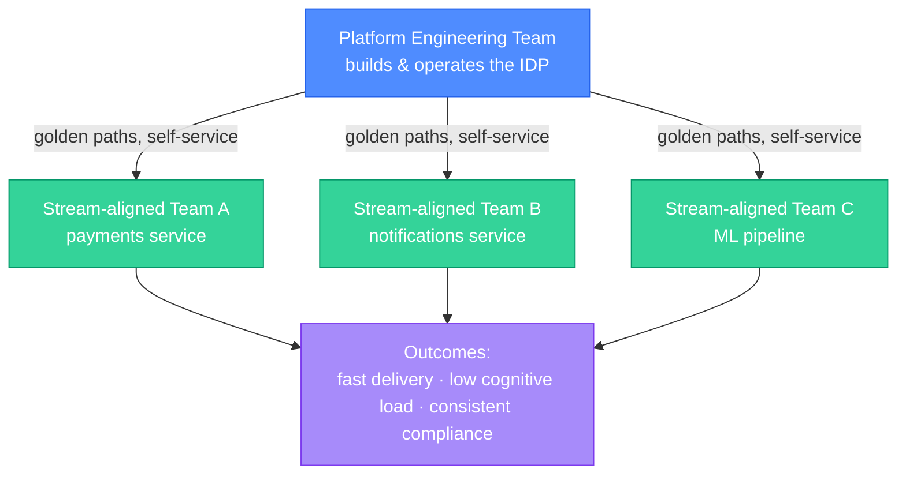
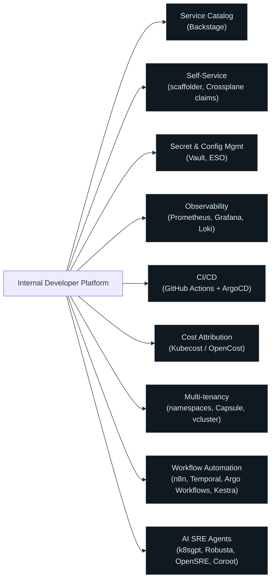

# Platform Engineering

Platform Engineering is the discipline of designing and building internal developer platforms (IDPs) that reduce cognitive load for software teams. Where traditional DevOps focuses on bridging the dev-ops divide through culture and shared tooling, Platform Engineering treats the platform itself as a product — built by a dedicated team, consumed by stream-aligned teams.

  0/0 checks
  

---

## 1. What Is Platform Engineering?

Platform Engineering emerged from the recognition that DevOps, taken to its logical extreme, asks every developer to become an expert in Kubernetes, Terraform, CI/CD, observability, secrets management, and network policy. That is an unreasonable cognitive burden. Platform Engineering solves this by building a **golden path** — a pre-paved, opinionated route from code to production that a developer can follow without needing to understand every component under the hood.

**Platform vs DevOps vs SRE** in one sentence each:
- **DevOps**: culture and practices that remove the wall between development and operations.
- **SRE**: applying software engineering to operations problems — SLOs, error budgets, toil reduction.
- **Platform Engineering**: building an internal product (the IDP) that lets developers self-serve infrastructure without needing operational expertise.

The three are complementary, not competing. SRE teams often *consume* the platform. DevOps culture is what makes platform teams listen to their users.

  
A developer can deploy a new microservice to production in one hour, but first needs to file a Jira ticket for a Kubernetes namespace, another for DNS, and another for TLS certs. Is this DevOps, SRE, or a Platform Engineering problem?

  <button class="quiz-reveal">Reveal answer</button>
  
Platform Engineering. The cultural wall is gone (developers own deployments), and SRE tooling exists. What's missing is a self-service platform that provisions namespace + DNS + TLS in a single workflow. This is exactly the cognitive load Platform Engineering is meant to eliminate.

---

## 2. CNCF Platform Maturity Model

The CNCF defines five levels of platform capability maturity:

| Level | Name | What it means |
|---|---|---|
| 1 | Provisional | Platforms built ad hoc — each team has its own scripts |
| 2 | Operational | Consistent automation exists; manual approvals still gate most changes |
| 3 | Scalable | Self-service workflows; the platform team is no longer in the critical path |
| 4 | Optimizing | The platform is measured with DX and DORA metrics; feedback loops exist |
| 5 | Sustainable | Platform is a product with a roadmap, SLOs, and an internal customer council |

Most organizations that have adopted Kubernetes sit at Level 2–3. Level 4 is where Platform Engineering starts to visibly accelerate engineering velocity.

  
At CNCF Level 3, developers can provision namespaces without filing a ticket. But the platform team still decides which tools developers can use. At which level would you expect to see an *internal customer council* shaping platform priorities?

  <button class="quiz-reveal">Reveal answer</button>
  
Level 5 (Sustainable). At this level the platform is run as a product, with roadmaps shaped by internal customer input — exactly what a customer council provides. Levels 3 and 4 have self-service and measurement, but treating developers as customers with a formal feedback mechanism is a Level 5 characteristic.

---

## 3. Team Topologies

Matthew Skelton and Manuel Pais's **Team Topologies** framework maps neatly onto Platform Engineering. There are four team types:

- **Stream-aligned team**: owns a feature or business domain end to end (the main building block).
- **Platform team**: provides self-service capabilities to stream-aligned teams. Reduces their cognitive load.
- **Enabling team**: short-lived; helps stream-aligned teams acquire new skills (e.g., migrating to a new observability stack).
- **Complicated subsystem team**: owns a component too complex for a stream-aligned team to own (e.g., an ML inference engine).

The **interaction modes** between teams matter as much as team types:
- **X-as-a-service** (low bandwidth): the platform team exposes an API or CLI; stream teams consume it.
- **Collaboration** (high bandwidth): two teams co-design something temporarily, then revert to X-as-a-service.
- **Facilitating** (enabling team mode): an enabling team coaches a stream team, then steps back.

Platform Engineering optimizes for the **X-as-a-service** interaction between the platform team and stream teams — the narrower the required interaction, the more cognitive load has been successfully abstracted.

  
A platform team is spending 40% of its time in ad hoc Slack threads answering questions from developers about how to configure Kubernetes resource limits. According to Team Topologies, which interaction mode is this, and is it desirable for a mature platform team?

  <button class="quiz-reveal">Reveal answer</button>
  
This is *collaboration* mode — high-bandwidth, synchronous. For a mature platform team, it is not desirable at this scale; it means the platform hasn't succeeded in abstracting the complexity. The goal is to move toward *X-as-a-service*: developers get what they need through documentation, self-service tooling, or guardrails — without needing to ask the platform team.

---

## 4. The Internal Developer Platform

An IDP is not a single product — it is the sum of all the capabilities your platform team exposes. Typical capabilities:

Key insight: the IDP is only as good as its **developer experience (DX)**. DX means:
- Time from `git push` to a running production pod, with no manual steps.
- Time to onboard a new developer who has never used your stack.
- Number of Slack messages a developer needs to send to provision an environment.

DX is measured, not assumed. DORA metrics and the SPACE framework (covered in `idp-concepts.md`) give you the instruments.

  
A platform team builds a beautiful self-service portal. Three months later, developers are still opening tickets instead of using it. What is the most likely platform engineering failure here?

  <button class="quiz-reveal">Reveal answer</button>
  
DX failure — the platform wasn't designed *with* developers, or it's slower/more confusing than the ticket workflow it replaced. Platform Engineering treats developers as customers. If the "product" isn't adopted, the team didn't measure DX or act on feedback. CNCF Level 4 requires measuring DX metrics; this team never reached that level.

---

## 5. Read Order

```mermaid
graph LR
    A["README<br/>overview + maturity model"]
    B["idp-concepts<br/>golden paths, DORA, SPACE"]
    C["backstage<br/>service catalog + TechDocs"]
    D["crossplane<br/>K8s-native IaC"]
    E["developer-self-service<br/>ApplicationSets, PR envs"]
    F["multi-tenancy<br/>vcluster, Capsule, HNC"]
    G["platform-observability<br/>DORA metrics pipeline"]
    H["cost-attribution<br/>Kubecost, OpenCost, FinOps"]
    I["workflow-automation<br/>n8n, Temporal"]
    J["ai-sre-agents<br/>k8sgpt, Robusta, OpenSRE"]

    A --> B --> C --> D --> E --> F --> G --> H --> I --> J
```

**Prerequisites**: Kubernetes (workloads, RBAC, networking, custom resources), CI/CD (ArgoCD, GitOps model), IaC (Terraform at minimum).

  
Why is Kubernetes a prerequisite for Platform Engineering rather than a component you learn inside it?

  <button class="quiz-reveal">Reveal answer</button>
  
Because Platform Engineering tools — Crossplane, Capsule, vcluster, ArgoCD ApplicationSets — are Kubernetes-native. They extend the Kubernetes API with custom resources; without knowing what a CRD, controller, RBAC role, and namespace are, you cannot reason about how these tools work. You're not learning Kubernetes here; you're applying it.

