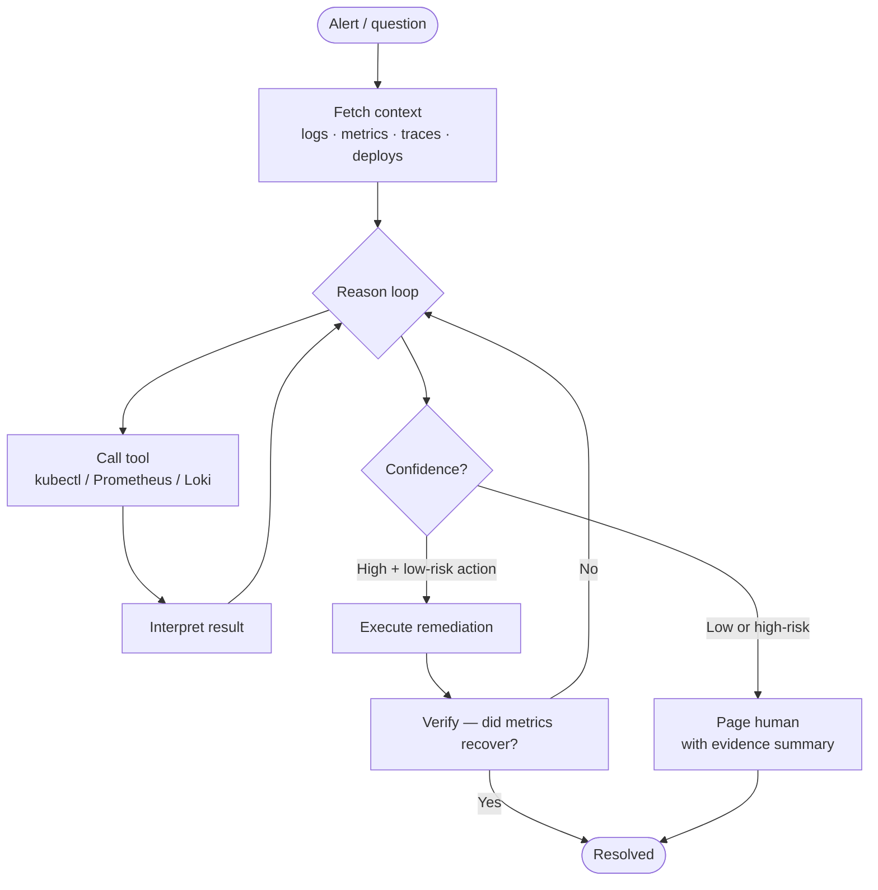
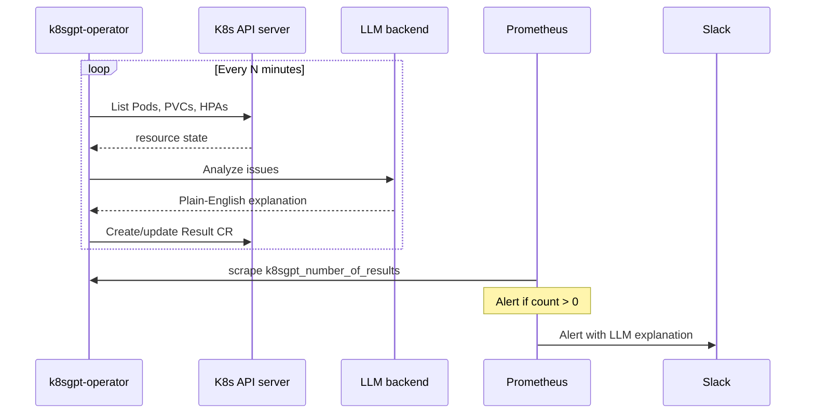
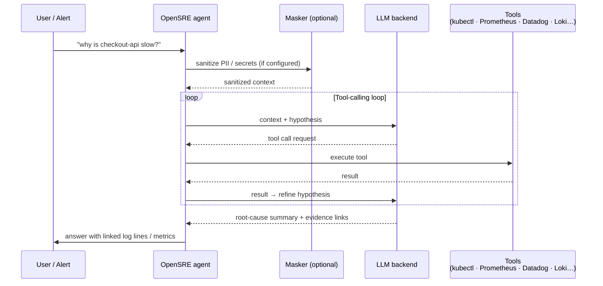
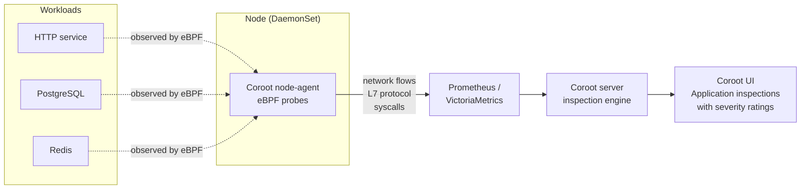
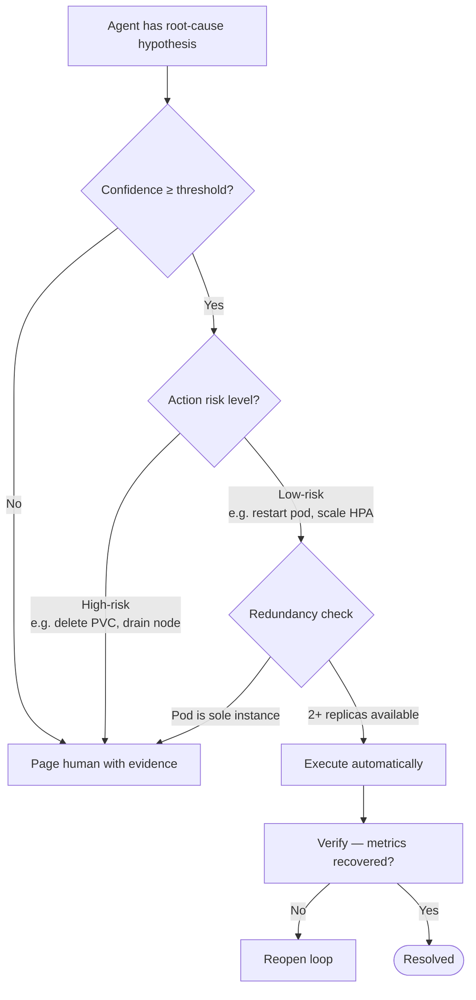

# AI SRE Agents

<div class="prereq-chips">
  <span class="prereq-chip">Platform Engineering</span>
  <span class="prereq-chip">Monitoring</span>
  <span class="prereq-chip">SRE & Debugging</span>
</div>

Traditional automation — Ansible playbooks, shell scripts triggered by alerts — is static: the remediation logic is pre-written and only works for anticipated failures. AI SRE agents are different. They use an LLM reasoning loop to investigate novel failures autonomously, correlate signals across logs, metrics, traces, and recent changes, and either remediate or escalate with evidence.

## What AI SRE Agents Are

Four phases define any agentic SRE loop:

1. **Observe** — pull relevant context: logs, metrics, traces, recent deploys, K8s events
2. **Reason** — form and test hypotheses using tool calls (kubectl, metrics API, log query); interpret results and refine
3. **Act** — execute low-risk remediation automatically, or escalate to a human with an evidence-linked summary
4. **Verify** — confirm the action resolved the issue; reopen the loop if metrics don't recover

The LLM doesn't blindly run a script — it reads actual error state and decides what to do. This lets agents handle failure modes that pre-written runbooks miss entirely.



---

## k8sgpt

k8sgpt scans Kubernetes cluster resources and uses an LLM backend to explain issues in plain English. It is CLI-first, with a Kubernetes operator for continuous automated scanning.

Built-in analyzers cover:

| Analyzer | What it detects |
|----------|----------------|
| `OOMKilled` | Pod killed for exceeding memory limit — explains which container, the limit set, estimated peak |
| `CrashLoopBackOff` | Pulls last exit code + recent log tail; LLM explains root cause |
| `PVCBinding` | Unbound PVCs with reason (no matching StorageClass, no capacity) |
| `ImagePullBackOff` | Registry auth failure vs nonexistent image vs rate limit |
| `NetworkPolicy` | Policies that block expected traffic |
| `HPA` | HPAs with no target metrics or misconfigured thresholds |

### CLI Usage

```bash
# Install (macOS arm64 — swap arch as needed)
curl -L https://github.com/k8sgpt-ai/k8sgpt/releases/download/v0.3.41/k8sgpt_darwin_arm64.tar.gz | tar xz
sudo mv k8sgpt /usr/local/bin/

# Configure backend
k8sgpt auth add --backend openai --model gpt-4o

# Scan
k8sgpt analyze --explain --namespace production
```

Example output:
```
0: Pod production/checkout-api-7f9d8c-x4k2p
   Error: Back-off restarting failed container
   Solution: The container is crashing due to OOMKilled. Container 'api' has a memory
   limit of 256Mi but is consuming ~290Mi under peak load. Increase the memory limit
   to at least 400Mi or investigate the memory leak in the /v1/orders endpoint.
```

### LLM Backend Options

<div class="tab-group">
  <div class="tab-buttons">
    <button data-tab="openai" class="active">OpenAI</button>
    <button data-tab="ollama">Ollama (air-gap)</button>
    <button data-tab="bedrock">AWS Bedrock</button>
    <button data-tab="azure">Azure OpenAI</button>
  </div>
  <div class="tab-panels">
    <div class="tab-panel active" data-tab-panel="openai">

```bash
k8sgpt auth add --backend openai --model gpt-4o
# Requires OPENAI_API_KEY in environment
```

Best analysis quality. Data leaves the cluster.

    </div>
    <div class="tab-panel" data-tab-panel="ollama">

```bash
# Deploy Ollama inside the cluster first, then:
k8sgpt auth add \
  --backend localai \
  --baseurl http://ollama.k8sgpt-operator-system:11434/v1 \
  --model llama3
```

Fully air-gapped — no traffic leaves the cluster. Runs a quantized model on cluster CPU/GPU. Lower analysis quality than GPT-4o; slower inference.

    </div>
    <div class="tab-panel" data-tab-panel="bedrock">

```bash
k8sgpt auth add \
  --backend amazonbedrock \
  --model anthropic.claude-3-5-sonnet-20241022-v2:0 \
  --region us-east-1
# Uses node's IAM instance role — no credentials in config
```

Data stays in AWS. Instance role must have `bedrock:InvokeModel` permission.

    </div>
    <div class="tab-panel" data-tab-panel="azure">

```bash
k8sgpt auth add \
  --backend azureopenai \
  --engine gpt-4o \
  --baseurl https://<your-resource>.openai.azure.com \
  --deployment <deployment-name>
# Requires AZURE_OPENAI_API_KEY
```

Data stays in your Azure tenant.

    </div>
  </div>
</div>

### k8sgpt-operator: Continuous Scanning

The operator installs a `K8sGPT` CRD and runs scans on a schedule, writing results to `Result` custom resources and exposing a Prometheus metric (`k8sgpt_number_of_results`).

```yaml
apiVersion: core.k8sgpt.ai/v1alpha1
kind: K8sGPT
metadata:
  name: k8sgpt-sample
spec:
  ai:
    enabled: true
    model: gpt-4o
    backend: openai
    secret:
      name: k8sgpt-openai-secret
      key: openai-api-key
  noCache: false
  filters:
    - Pod
    - PersistentVolumeClaim
    - HorizontalPodAutoscaler
  sink:
    type: slack
    webhook: https://hooks.slack.com/services/...
```

```bash
# Install operator
helm repo add k8sgpt-operator https://charts.k8sgpt.ai/
helm install k8sgpt-operator k8sgpt-operator/k8sgpt-operator -n k8sgpt-operator-system --create-namespace

# Check results
kubectl get results -n k8sgpt-operator-system
```



<div class="quiz-card">
  <p class="quiz-q">Your team operates in an air-gapped environment with no internet access. You want k8sgpt to continuously analyze pods in production via the operator. What backend do you configure, and what does the full architecture look like?</p>
  <button class="quiz-reveal">Reveal answer</button>
  <div class="quiz-a" hidden>Use LocalAI/Ollama deployed inside the cluster as a separate Deployment. Configuration: <code>k8sgpt auth add --backend localai --baseurl http://ollama.k8sgpt-operator-system:11434/v1 --model llama3</code>. The k8sgpt-operator calls the in-cluster Ollama service via ClusterIP — no traffic leaves. Ollama runs a quantized model (e.g. llama3:8b-q4) on cluster CPU or GPU. The Result CRs and Prometheus metrics flow normally. Tradeoffs: slower inference (~5–30s vs ~1s for GPT-4o), lower analysis quality on subtle issues, requires GPU nodes for acceptable performance at scale.</div>
</div>

---

## OpenSRE

[OpenSRE](https://github.com/tracer-cloud/opensre) is an open-source Python framework for building AI SRE agents. Where k8sgpt is a periodic scanner and Robusta is playbook execution, OpenSRE is an **agentic REPL and framework** — the LLM drives a tool-calling loop to investigate and resolve production incidents, with 60+ pre-built integrations.

> Public Alpha (v0.1) — core workflows are usable; APIs may evolve.

### How It Works



### Installation and Usage

```bash
# Install (macOS / Linux)
curl -fsSL https://install.opensre.com | bash -s -- -gh

# Start interactive REPL
opensre

# Headless — one-shot, useful in CI or scripts
opensre ask "why is checkout-api slow right now?"

# Connect your tools (interactive wizard)
opensre integrations setup
opensre integrations verify   # health-check all connections
```

From Python (embed in your own automation):

```python
from bootstrap.embedded import start_embedded_session

session = start_embedded_session()
result = session.chat("why is checkout-api slow?")
if result.answered:
    print(result.primary_response_text)
```

**REPL slash commands:**

| Command | Purpose |
|---------|---------|
| `/integrations list` | See connected tools |
| `/integrations verify` | Test credentials |
| `/agents` | Fleet monitoring |
| `/sessions` / `/resume` | Persist sessions across shell restarts |
| `/cost` | Track LLM API spend |
| Ctrl+C | Cancel in-flight turn (session state preserved) |

### Integrations

60+ built-in connectors across categories:

| Category | Tools |
|----------|-------|
| Observability | Datadog, Grafana, Prometheus, Loki, Jaeger, OpenTelemetry |
| Cloud logging | AWS CloudWatch, GCP Cloud Logging, Azure Monitor |
| Kubernetes | kubectl (kubeconfig), K8s Events API |
| Alerting / on-call | PagerDuty, Slack, OpsGenie |
| Deployment | GitHub, ArgoCD, Helm |

### Fleet Mode

For teams running multiple OpenSRE instances (one per cluster, one per service):

```bash
opensre fleet scan   # discover and report status of all agents in the fleet
```

Assign agents to scopes (cluster A, service B) and route incidents to the right agent automatically.

<div class="quiz-card">
  <p class="quiz-q">Your OpenSRE agent is connected to Datadog and Slack. A p99 latency alert fires for <code>payment-service</code>. Describe the likely sequence of tool calls the agent makes before answering.</p>
  <button class="quiz-reveal">Reveal answer</button>
  <div class="quiz-a" hidden>1) Query Datadog for the p99 latency metric — break it down by host/container to localize where it's slow. 2) Pull recent traces for slow requests — find which downstream calls are taking the most time. 3) Check deployment history — was there a recent deploy to payment-service or its dependencies? 4) Pull correlated logs for the slow time window — look for errors, timeouts, or slow query warnings. 5) Check infra metrics (CPU/memory/GC) on the affected hosts. 6) Synthesize findings with evidence links — the specific log line, the Datadog metric graph, the deploy SHA. The agent adapts: if step 2 shows the DB is slow, it pivots to DB metrics; if step 3 finds a recent deploy, it diffs the config change.</div>
</div>

---

## Robusta

Robusta is a Kubernetes automation platform — playbook execution triggered by Prometheus alerts and K8s events, enriched with AI analysis.

| Capability | Description |
|-----------|-------------|
| **Playbooks** | YAML-defined responses to alert triggers or K8s events |
| **HolmesGPT** | AI root-cause analysis embedded in the playbook context |
| **Alert enrichment** | Attaches logs, graphs, and resource state to Slack alerts automatically |

### Playbook Example: OOMKilled Self-Healing

```yaml
triggers:
  - on_pod_oom_killed:
      namespace_prefix: "production"

actions:
  - resource_babysitter:
      resource_type: pod
  - alert_on_pod_oom_killed:
      slack_channel: "#sre-alerts"
  - holmes_ai_analysis:
      ask: "Why did this pod get OOMKilled? Should the memory limit be increased?"
  # Uncomment for automated remediation:
  # - increase_memory_limit:
  #     factor: 1.5
```

The resulting Slack alert includes: pod name, namespace, memory limit vs actual peak, last 100 log lines, memory graph from the past hour, and the HolmesGPT root-cause summary — all without clicking through any dashboards.

### K8s Deployment

```bash
helm repo add robusta https://robusta-charts.storage.googleapis.com
helm install robusta robusta/robusta \
  --set clusterName=production \
  --set sinksConfig.slack_sink.slack_channel="#sre-alerts" \
  --set sinksConfig.slack_sink.slack_token="xoxb-..."
```

Robusta runs as a Deployment + DaemonSet, watching Prometheus alerts via a webhook receiver and K8s Events via the API server.

---

## Coroot

[Coroot](https://github.com/coroot/coroot) is an open-source, eBPF-powered observability platform with built-in AI-driven root cause analysis. Where k8sgpt scans K8s resource state and OpenSRE is an interactive agent, Coroot **continuously monitors service health** from eBPF-captured metrics and automatically surfaces root-cause hypotheses — no query language, no manual correlation.

What makes it different:
- **eBPF auto-instrumentation** — node-agent captures all network traffic and system calls without code changes or sidecars; no Jaeger/Zipkin required
- **Automatic service topology** — maps service-to-service dependencies from observed network traffic; no manual graph configuration
- **Built-in inspections** — plain-English findings for CPU throttling, OOMKilled, network latency spikes, slow DB queries (PostgreSQL, MySQL, Redis via wire-protocol parsing), and failed deployments correlated with recent rollouts
- **Root-cause correlation** — when a service degrades, Coroot correlates CPU, memory, network, and deployment signals and surfaces a prioritized list of likely causes

### Architecture



### Installation

```bash
helm repo add coroot https://coroot.github.io/helm-charts

# With an existing Prometheus
helm install coroot coroot/coroot \
  --namespace coroot --create-namespace \
  --set corootCE.bootstrapPrometheusUrl="http://prometheus-operated:9090"

# Built-in storage (no external Prometheus needed)
helm install coroot coroot/coroot-cluster-agent \
  --namespace coroot --create-namespace
```

### What It Surfaces for an Incident

Example: `checkout-api` p99 latency spikes to 2s. Coroot automatically shows:

1. **Application map** — `checkout-api → postgres-primary` latency elevated (350ms avg)
2. **Inspection: Postgres query latency** — identifies slow query pattern via eBPF wire-protocol parsing (`SELECT * FROM orders WHERE user_id = ?` — missing index)
3. **Inspection: CPU throttling** — `checkout-api` pods hitting their CPU limit; CFS throttling adding ~180ms per request
4. **Deployment correlation** — a deploy happened 12 minutes before the spike; links to the specific commit

All findings include confidence ratings. No dashboard-clicking required.

### eBPF vs Sidecar Instrumentation

<div class="tab-group">
  <div class="tab-buttons">
    <button data-tab="ebpf-tab" class="active">eBPF (Coroot)</button>
    <button data-tab="sidecar-tab">Sidecar / SDK (OTel, Jaeger)</button>
  </div>
  <div class="tab-panels">
    <div class="tab-panel active" data-tab-panel="ebpf-tab">

**Zero code changes** — node-level agent captures all traffic including legacy apps you don't own. Covers HTTP, PostgreSQL, MySQL, Redis at the wire protocol level. Slight overhead per syscall hook. Requires kernel ≥ 4.14 with BTF support.

    </div>
    <div class="tab-panel" data-tab-panel="sidecar-tab">

**Richer trace context** — business spans, custom attributes, cross-service trace IDs. Portable across non-K8s. Requires code changes or injection (OpenTelemetry auto-instrumentation reduces this). Does not cover uninstrumented services.

    </div>
  </div>
</div>

<div class="quiz-card">
  <p class="quiz-q">Your team runs a legacy Java monolith on K8s with no distributed tracing. You want to understand which service calls are slow during a latency spike. Can Coroot help, and what does it capture at the eBPF level?</p>
  <button class="quiz-reveal">Reveal answer</button>
  <div class="quiz-a" hidden>Yes. Coroot's eBPF agent captures L7 protocol data: for HTTP it sees request/response status codes and latency; for PostgreSQL and MySQL it parses the wire protocol to see individual query patterns and latency; for Redis it parses RESP. No Java agent or code changes required. The limitation: it sees network-level calls, not intra-process function calls within the JVM. For in-process profiling, pair Coroot with a continuous profiler like Parca or Pyroscope.</div>
</div>

---

## Tool Comparison

<div class="tab-group">
  <div class="tab-buttons">
    <button data-tab="k8sgpt-tab" class="active">k8sgpt</button>
    <button data-tab="opensre-tab">OpenSRE</button>
    <button data-tab="robusta-tab">Robusta</button>
    <button data-tab="coroot-tab">Coroot</button>
  </div>
  <div class="tab-panels">
    <div class="tab-panel active" data-tab-panel="k8sgpt-tab">

**Model**: Periodic scanner (CLI or operator CRD)

**Trigger**: Manual CLI run or scheduled operator scan

**Remediation**: Read-only — analysis and recommendations only, no automated action

**Best for**: Proactive cluster health scanning; surfacing issues before they alert; air-gapped environments (Ollama backend)

**Not for**: Real-time incident response; novel failures requiring multi-signal reasoning

    </div>
    <div class="tab-panel" data-tab-panel="opensre-tab">

**Model**: Interactive agentic REPL + headless CLI + Python SDK

**Trigger**: Human question, `opensre ask` headless command, or embedded in Python automation

**Remediation**: Agent decides — can call any connected tool, execute kubectl, trigger runbooks

**Best for**: Novel/unknown incidents where the failure mode isn't pre-defined; investigations requiring multi-signal correlation across 60+ tools

**Not for**: Fully automated, no-human-in-loop remediation at scale (it's an investigation tool, not a runbook executor)

    </div>
    <div class="tab-panel" data-tab-panel="robusta-tab">

**Model**: Event-driven playbook executor

**Trigger**: Prometheus alertmanager webhook, K8s events

**Remediation**: Automated playbook actions (restart, scale, cordon) + enriched human alerts

**Best for**: Known failure patterns with defined response procedures; teams that want automated triage and enriched Slack alerts without building custom tooling

**Not for**: Novel failures with no pre-defined playbook; multi-cluster fleet investigation

    </div>
    <div class="tab-panel" data-tab-panel="coroot-tab">

**Model**: Continuous eBPF monitoring + automatic inspection engine

**Trigger**: Always-on — no manual trigger needed; inspections run continuously

**Remediation**: Read-only — surfaces root-cause hypotheses and correlated evidence; no automated action

**Best for**: Always-on performance observability; legacy apps with no instrumentation; application-level latency root causes that k8sgpt misses (slow DB queries, CPU throttling, service-to-service latency)

**Not for**: Automated playbook execution; interactive investigation of novel incidents

    </div>
  </div>
</div>

---

## Agentic Patterns for SRE

Framework-agnostic patterns that apply whether you use OpenSRE, LangGraph, or a custom loop.

**Standard tool kit for an SRE agent:**

```python
tools = [
    kubectl_get,          # kubectl get/describe/logs
    prometheus_query,     # /api/v1/query_range
    loki_query,           # /loki/api/v1/query_range
    deployment_history,   # ArgoCD / GitHub deployments API
    runbook_executor,     # pre-defined remediation scripts
]
```

**Human-in-the-loop decision logic:**



**Escalation criteria (concrete rules):**
- StatefulSet pods → always page a human (state at risk)
- Pod restarted in last 30 min → CrashLoop risk, page a human
- Single replica with no PDB → restart causes downtime, page a human
- Confidence below 0.7 (or LLM says "uncertain") → page a human with summary

<div class="quiz-card">
  <p class="quiz-q">Your AI SRE agent diagnoses a DB connection pool exhaustion issue and wants to restart the connection pool manager pod. What criteria determine whether the agent auto-restarts vs pages a human?</p>
  <button class="quiz-reveal">Reveal answer</button>
  <div class="quiz-a" hidden>Check four things in order: 1) <strong>StatefulSet or Deployment?</strong> StatefulSets carry state — always escalate. 2) <strong>Recent restart?</strong> If the pod restarted in the last 30–60 minutes, restarting again risks a CrashLoop — escalate. 3) <strong>Replica count?</strong> If it's the only instance (no redundancy), a restart causes a brief outage — escalate. 4) <strong>Is the action reversible?</strong> A pod restart is reversible; a PVC deletion is not — escalate for irreversible actions. Safe auto-restart policy: Deployment pod, ≥2 replicas available, no restart in the last 30 min, pod is Unhealthy (not just slow), cluster has capacity. All four must hold.</div>
</div>
