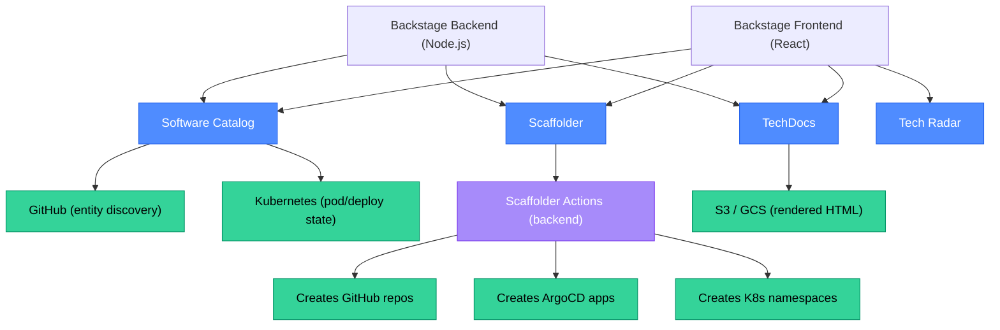
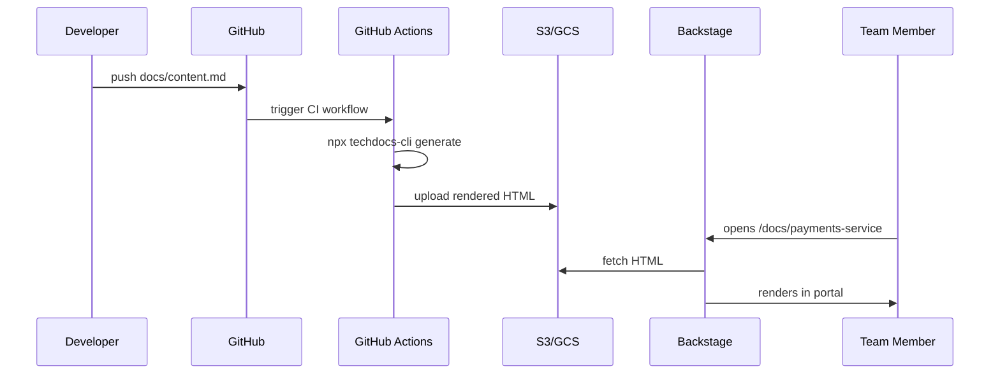

# Backstage: Service Catalog and Developer Portal

Backstage is an open-source developer portal originally built by Spotify and donated to the CNCF. It solves the "where is everything?" problem: a single place to find every service, its ownership, its documentation, its deployment state, and how to create a new one. Without it, developers navigate a tangle of GitHub repos, internal wikis, Confluence pages, and Slack channels to answer basic questions.

<div class="quiz-progress" data-quiz-progress>
  <span class="quiz-progress-label">0/0 checks</span>
  <span class="quiz-progress-bar"><span class="quiz-progress-fill"></span></span>
</div>

---

## 1. Architecture Overview

Backstage has three core subsystems: the **Catalog** (what exists and who owns it), the **Scaffolder** (how to create new things), and **TechDocs** (documentation co-located with code). Plugins extend all three.



The Backstage backend is a Node.js service. In production it runs in Kubernetes, backed by a PostgreSQL database for the catalog. The frontend is a React SPA that talks to the backend API.

<div class="quiz-card">
  <p class="quiz-q">Where does Backstage store the list of services and their owners — in its own database, or does it read from GitHub/Kubernetes in real time?</p>
  <button class="quiz-reveal">Reveal answer</button>
  <div class="quiz-a" hidden>Both — and that's key to understanding Backstage. The Catalog reads entity definitions from GitHub (catalog-info.yaml files), Kubernetes (pod annotations), and other sources, then stores them in a PostgreSQL database for fast querying. Real-time discovery happens via entity providers that poll GitHub/K8s; the DB is a cache that powers the Catalog UI. Querying GitHub directly for every page load would be too slow and would hit rate limits.</div>
</div>

---

## 2. The Software Catalog

The Catalog is Backstage's most fundamental feature. It answers: "What services exist? Who owns them? What APIs do they expose? Are they healthy?"

### Entity kinds

Every entity in the catalog has a `kind`. The most common kinds:

| Kind | What it represents |
|---|---|
| `Component` | A deployable unit: a microservice, a library, a website |
| `API` | An interface: a REST endpoint, a gRPC service, a Kafka topic schema |
| `Resource` | An infrastructure resource: a database, a blob bucket, a CDN |
| `System` | A logical grouping of components that deliver one user-facing capability |
| `Domain` | A business domain that groups related systems |
| `Group` | A team |
| `User` | An individual |

### catalog-info.yaml

Every service registers itself with a `catalog-info.yaml` at the root of its repo:

```yaml
apiVersion: backstage.io/v1alpha1
kind: Component
metadata:
  name: payments-service
  description: Processes payment transactions
  annotations:
    github.com/project-slug: acme/payments-service
    backstage.io/techdocs-ref: dir:.
    argocd/app-name: payments-service-prod
  tags:
    - go
    - payments
    - pci-scope
spec:
  type: service
  lifecycle: production
  owner: group:payments-team
  system: payments-platform
  dependsOn:
    - component:postgres-payments
    - resource:payments-rds
  providesApis:
    - payments-api
```

Backstage discovers this file via a GitHub entity provider configured to scan all repos in the organization. Every push to the default branch triggers a re-scan.

<div class="quiz-card">
  <p class="quiz-q">A new team member looks at the Backstage catalog and sees that the `payments-service` component has `lifecycle: production` but the `catalog-info.yaml` in GitHub still says `lifecycle: experimental`. What's happening?</p>
  <button class="quiz-reveal">Reveal answer</button>
  <div class="quiz-a" hidden>Backstage caches entity definitions in PostgreSQL and polls GitHub on a schedule (typically every few minutes). If the catalog-info.yaml was updated but the entity provider hasn't re-synced yet, the UI shows stale data from the DB. Once the entity provider runs its next scan and detects the change, it updates the DB and the UI reflects it. This is eventually consistent, not real-time.</div>
</div>

---

## 3. TechDocs

TechDocs is Backstage's "docs as code" integration. It renders MkDocs-compatible markdown into HTML and serves it inside the Backstage UI, co-located with the service catalog entry.

### How it works

1. A service adds a `docs/` folder with `mkdocs.yml` and markdown files.
2. `catalog-info.yaml` adds the annotation `backstage.io/techdocs-ref: dir:.`
3. In CI (or on a schedule), `npx @techdocs/cli generate` runs MkDocs and produces HTML.
4. The HTML is uploaded to a blob store (S3 or GCS).
5. Backstage TechDocs plugin serves the HTML from the blob store inside the portal.



The advantage over a standalone wiki: documentation lives in the same repo as the code, is versioned in git, and is reviewed in PRs alongside the code it describes. Documentation that drifts from code is detected by code reviewers, not discovered six months later.

<div class="quiz-card">
  <p class="quiz-q">Why does TechDocs upload pre-rendered HTML to a blob store instead of letting Backstage render markdown on the fly from GitHub?</p>
  <button class="quiz-reveal">Reveal answer</button>
  <div class="quiz-a" hidden>Three reasons: (1) Performance — rendering markdown on every page request is slow; pre-rendering and caching in S3 is fast. (2) GitHub rate limits — fetching raw markdown from GitHub for every user page load would exhaust the API. (3) Consistency — the rendered HTML is pinned to a specific commit; users always see the version that CI validated, not a draft someone is editing.</div>
</div>

---

## 4. Software Templates (Scaffolder)

The Scaffolder is Backstage's golden-path delivery mechanism. A software template is a form that asks developers a few questions, then runs a sequence of backend **actions** to create everything the service needs.

### How a developer uses it

<div class="stepper">
  <div class="stepper-header">
    <button class="stepper-prev" disabled>←</button>
    <span class="stepper-label">Step 1 of 5</span>
    <button class="stepper-next">→</button>
  </div>
  <div class="stepper-dots"></div>
  <div class="stepper-panels">
    <div class="stepper-panel active">

**Step 1 — Open Backstage → Create → Choose template**

The developer sees a list of templates: "Go microservice", "Python FastAPI service", "React frontend", etc. Each template represents an opinionated starting point.

    </div>
    <div class="stepper-panel">

**Step 2 — Fill in the form**

The template presents a form: service name, team owner, GCP project, K8s namespace, database required (yes/no), etc. All fields map to template variables.

    </div>
    <div class="stepper-panel">

**Step 3 — Scaffolder runs actions**

The Scaffolder backend executes a sequence of actions defined in the template's `template.yaml`:
1. `fetch:template` — copy the skeleton directory.
2. `catalog:register` — write `catalog-info.yaml` and register it.
3. `github:repo:create` — create the GitHub repo.
4. `github:repo:push` — push the skeleton.
5. `argocd:app:create` — create an ArgoCD Application pointing at the new repo.
6. `kubernetes:create-namespace` — provision the K8s namespace with RBAC.

    </div>
    <div class="stepper-panel">

**Step 4 — Developer gets links**

The Scaffolder outputs: GitHub repo URL, ArgoCD app URL, Backstage catalog entry URL. The service is registered in the catalog immediately.

    </div>
    <div class="stepper-panel">

**Step 5 — Developer pushes code**

The skeleton repo already has a working CI pipeline. The developer clones, adds their first handler, opens a PR, and CI runs — all without any platform-team involvement.

Total time from "create" to first CI run: under 10 minutes.

    </div>
  </div>
</div>

### Template anatomy

```yaml
apiVersion: scaffolder.backstage.io/v1beta3
kind: Template
metadata:
  name: go-microservice
  title: Go Microservice
  description: Opinionated Go service with CI, ArgoCD, and Backstage registration
  tags: [go, microservice, recommended]
spec:
  owner: group:platform-team
  type: service
  parameters:
    - title: Service Details
      properties:
        serviceName:
          title: Service name
          type: string
          pattern: '^[a-z][a-z0-9-]{2,39}$'
        ownerTeam:
          title: Owning team
          type: string
          ui:field: OwnerPicker
          ui:options: { allowedKinds: [Group] }
  steps:
    - id: fetch-base
      name: Fetch skeleton
      action: fetch:template
      input:
        url: ./skeleton
        values:
          serviceName: ${{ parameters.serviceName }}
          ownerTeam: ${{ parameters.ownerTeam }}
    - id: create-repo
      name: Create GitHub repo
      action: github:repo:create
      input:
        repoUrl: github.com?repo=${{ parameters.serviceName }}&owner=acme
    - id: register
      name: Register in catalog
      action: catalog:register
      input:
        repoContentsUrl: ${{ steps['create-repo'].output.repoContentsUrl }}
        catalogInfoPath: /catalog-info.yaml
```

<div class="quiz-card">
  <p class="quiz-q">A template has 8 steps. Step 5 fails because the ArgoCD API is down. Steps 1–4 have already run (GitHub repo created, catalog entry registered). What is the scaffolder's behavior, and what cleanup does the platform team need to handle?</p>
  <button class="quiz-reveal">Reveal answer</button>
  <div class="quiz-a" hidden>By default, the Backstage Scaffolder does not roll back completed steps on failure — it is not transactional. The task will be marked failed, but the GitHub repo and catalog entry from steps 1–4 remain. The platform team (or developer) must manually delete the orphaned repo and deregister the catalog entry, then re-run the template. This is a known limitation; some teams add a cleanup step at the end that only runs on failure, using `if: ${{ failure() }}` conditions in the template YAML.</div>
</div>

---

## 5. Tech Radar

The Tech Radar visualizes which technologies are adopted, in trial, being assessed, or on hold. It gives every developer a quick answer to "is this the right tool for the job, or did we decide to move away from it?"

Four rings:
- **Adopt**: proven, recommended for production use.
- **Trial**: experimental, acceptable for new projects.
- **Assess**: being evaluated; don't build on it yet.
- **Hold**: actively moving away from this; do not add new usages.

The platform team maintains the radar through a YAML file; Backstage renders it. It is updated quarterly through an architecture decision process.

<div class="quiz-card">
  <p class="quiz-q">A developer wants to use a new logging library that's in the "Assess" ring of the Tech Radar. Should they use it in a new production service?</p>
  <button class="quiz-reveal">Reveal answer</button>
  <div class="quiz-a" hidden>No — "Assess" means it's being evaluated, not ready for production. The appropriate action is to use it in a non-production, non-critical service or in a time-boxed experiment, then contribute findings back to the architecture team to help move it to "Trial" or "Adopt." Using Assess-ring technology in production creates a support gap: if it breaks, neither the platform team nor the broader organization has experience supporting it.</div>
</div>

---

## 6. Integrations

Backstage's catalog becomes more valuable as you add integrations:

| Integration | What it adds to the catalog |
|---|---|
| **Kubernetes** | Pod count, deployment status, recent errors per component |
| **ArgoCD** | Sync status, last deploy time, out-of-sync resources |
| **PagerDuty** | On-call schedule, recent incidents per service |
| **GitHub** | PR count, branch protection status, latest build |
| **SonarQube** | Code quality score, open vulnerabilities |
| **Dependabot** | Dependency vulnerability alerts |
| **Grafana** | Embedded dashboards per service |

Each integration is a Backstage plugin. Plugins expose both frontend UI (cards on the catalog entity page) and backend providers (entities pulled into the catalog).

<div class="quiz-card">
  <p class="quiz-q">A developer opens the Backstage page for `payments-service` and sees the ArgoCD plugin showing the last deploy was 3 days ago, but the Kubernetes plugin shows 2 pods are in `CrashLoopBackOff`. What does this tell you about the current state of the service?</p>
  <button class="quiz-reveal">Reveal answer</button>
  <div class="quiz-a" hidden>The service was last deployed 3 days ago (ArgoCD sync state), and since then something has caused 2 pods to crash repeatedly (Kubernetes state). This suggests a runtime issue — possibly a downstream dependency failure, a misconfigured secret, or an OOM kill — that started after the last deploy. The developer should check the pod logs (via `kubectl logs`) and recent events. The ArgoCD plugin confirming the deploy is 3 days old rules out a bad deploy as the immediate cause — the issue likely appeared later.</div>
</div>

---

## 7. Running Backstage in Production

Key operational considerations:

- **Database**: PostgreSQL is required (SQLite is dev-only). Use a managed instance (Cloud SQL, RDS).
- **Authentication**: Backstage supports GitHub OAuth, Google OAuth, SAML, OIDC. Pick the one your org already uses.
- **Image build**: Backstage provides a `Dockerfile` that bundles frontend and backend. Build it in CI; push to your container registry; deploy via Helm or an ArgoCD Application.
- **Entity providers**: Configure the GitHub entity provider with a GitHub App (not a personal access token) for reliability. Set refresh interval to 5–15 minutes.
- **TechDocs storage**: Use GCS or S3 in production. The `local` storage backend does not work in a multi-replica deployment.
- **Plugins**: Pin plugin versions. Backstage's plugin ecosystem moves fast; a major plugin upgrade can break the build.

<div class="quiz-card">
  <p class="quiz-q">You deploy Backstage with 3 replicas for high availability. Developers report that the catalog sometimes shows outdated entity data when they refresh. What is the most likely cause?</p>
  <button class="quiz-reveal">Reveal answer</button>
  <div class="quiz-a" hidden>Each Backstage replica has its own entity provider process, and if they're not coordinated, one replica may have newer data than others. In a multi-replica setup, Backstage uses the PostgreSQL database as the shared source of truth — entity providers write to it, and all replicas read from it. If "outdated data" appears, the likely cause is that the entity provider refresh interval is long (e.g., 30 minutes), or the GitHub entity provider missed a webhook trigger. The fix is to check entity provider logs, shorten the refresh interval, and ensure all replicas use the shared DB rather than in-memory caches.</div>
</div>
