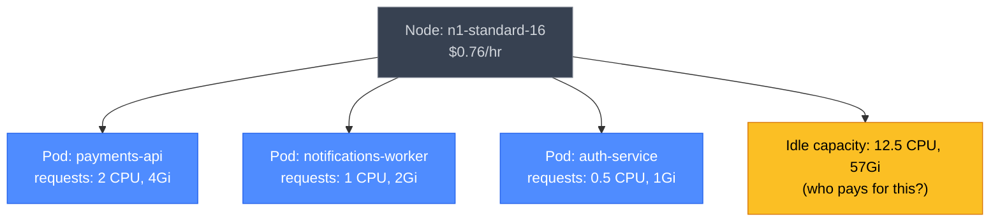
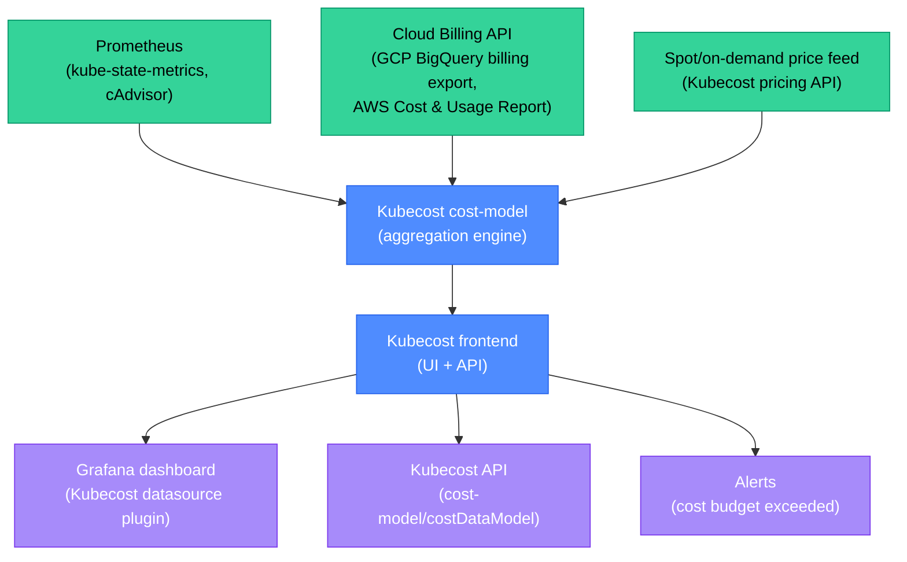

# Cost Attribution: Kubecost, OpenCost, and FinOps in Kubernetes

Cloud costs in Kubernetes clusters are invisible by default. A shared cluster with 20 teams running 500 services appears as a single line item in GCP/AWS billing. FinOps (Financial Operations) closes this gap: cost attribution tools break that single bill into per-team, per-service, per-namespace slices, so engineering managers can see what they're spending and make informed decisions.

<div class="quiz-progress" data-quiz-progress>
  <span class="quiz-progress-label">0/0 checks</span>
  <span class="quiz-progress-bar"><span class="quiz-progress-fill"></span></span>
</div>

---

## 1. Why Kubernetes Cost Attribution Is Hard

In a traditional VM-based deployment, cost is simple: one VM = one team = one cost center. In Kubernetes:
- Multiple pods from multiple teams run on the same node.
- A pod's cost depends on its CPU/memory *requests* (what the scheduler reserved), not its *usage* (what it actually consumed).
- Idle capacity (a node that's 30% utilized) has a cost but no obvious owner.
- Network egress costs aren't directly tied to a pod identity.
- Spot/preemptible instances complicate hourly cost calculations.



Cost attribution tools answer: "Given the node costs, how much of the bill belongs to each pod, namespace, and team?"

<div class="quiz-card">
  <p class="quiz-q">A node costs $0.76/hr and runs three pods: payments-api (2 CPU request), notifications-worker (1 CPU request), and auth-service (0.5 CPU request). The node has 16 CPUs. How much idle CPU cost is there, and which namespace should be charged for it under a "request-based" allocation model?</p>
  <button class="quiz-reveal">Reveal answer</button>
  <div class="quiz-a" hidden>Requested CPUs: 2 + 1 + 0.5 = 3.5 CPUs out of 16. Idle: 12.5 CPUs. Under **request-based allocation**, idle capacity is typically distributed proportionally to the requesting pods — each pod "owns" its requested fraction of the node, and idle is allocated to the same proportions. Alternatively, platforms use a "cluster overhead" cost center for idle that is shared equally across all teams. Neither is perfect; the key is consistency. The model does NOT charge a team for idle caused by another team's under-utilization — that would create perverse incentives to over-request resources to avoid paying for others' idle.</div>
</div>

---

## 2. Kubecost

Kubecost is the most widely adopted Kubernetes cost attribution tool. It runs as a set of pods in the cluster, integrates with cloud billing APIs, and produces per-namespace/per-pod/per-label cost breakdowns.

### Architecture



**What Kubecost tracks:**
- Node cost per hour (on-demand, reserved, spot pricing) sourced from cloud pricing APIs or GCP Billing export.
- Pod cost = node cost × (pod CPU request / node CPU) + node cost × (pod memory request / node memory), split between CPU and RAM costs.
- Network egress cost per pod (requires enabling Kubecost's network cost daemonset).
- LoadBalancer cost per service (from cloud billing).
- PersistentVolume cost per PVC.

**Installing Kubecost with Helm:**

```bash
helm repo add kubecost https://kubecost.github.io/cost-analyzer
helm upgrade --install kubecost kubecost/cost-analyzer \
  --namespace kubecost --create-namespace \
  --set kubecostToken="<license-token>" \
  --set prometheus.enabled=true \
  --set global.gmp.enabled=false  # set true for GKE Managed Prometheus
```

<div class="quiz-card">
  <p class="quiz-q">Kubecost shows the `payments` namespace cost $4,200 last month. The payments team argues that $1,800 of this is idle capacity on a node they share with other teams. Which Kubecost configuration setting controls whether idle cost is attributed to the namespace requesting the resources or shared differently?</p>
  <button class="quiz-reveal">Reveal answer</button>
  <div class="quiz-a" hidden>Kubecost's **idle allocation mode** (configured in `cost-analyzer.kubecostProductConfigs.idleMode`). Options: `share` (distribute idle proportionally to each namespace's requests — the payments team pays for their idle fraction), `hide` (don't show idle in namespace costs — under-reports total), or `separate` (show idle as a separate "Idle" line item not attributed to any namespace). The team's argument makes sense under `share` mode — a separate cluster-overhead idle cost center is more fair when idle is caused by the node's overall under-utilization rather than any one team's behavior.</div>
</div>

---

## 3. OpenCost

OpenCost is the open-source alternative to Kubecost, donated to the CNCF sandbox by Kubecost themselves. It shares the same cost model but removes the enterprise features (savings recommendations, team access controls, cloud cost UI) and keeps just the core attribution engine.

<div class="toggle-switch">
  <div class="toggle-buttons">
    <button class="toggle-btn active" data-toggle-opt="kubecost">Kubecost</button>
    <button class="toggle-btn" data-toggle-opt="opencost">OpenCost</button>
  </div>
  <div class="toggle-panel active" data-toggle-panel="kubecost">

**Kubecost (commercial + free tier):**
- Free tier: single cluster, 15-day history, basic UI.
- Paid: multi-cluster, 90-day+ history, team-based access, savings recommendations, anomaly detection.
- Enterprise: cloud cost integration (AWS/GCP/Azure total bill), rightsizing recommendations with CI/CD integration.
- Best for: teams that want a polished UI and actionable savings insights out of the box.
- Limitation: free tier limited to one cluster; enterprise pricing is per-node.

<div class="state-ok">Kubecost is CNCF certified and widely used in production at scale.</div>

  </div>
  <div class="toggle-panel" data-toggle-panel="opencost">

**OpenCost (CNCF sandbox, Apache 2.0):**
- Completely free, no limits on clusters or history.
- Exposes a standardized HTTP API (the OpenCost Spec) for querying allocation data.
- No built-in UI (use the community Grafana dashboard or build your own).
- Integrates with Prometheus and existing Grafana stacks.
- Best for: teams that want cost data in Grafana without a separate UI, or that need to control their own data (no SaaS dependency).
- Limitation: no savings recommendations, no anomaly detection, no multi-cluster aggregation (needs custom federation).

<div class="state-warn">OpenCost requires more integration work but has no vendor dependency.</div>

  </div>
</div>

### OpenCost API

```bash
# Cost for all namespaces, last 7 days
curl "http://opencost.opencost.svc:9003/allocation/compute?window=7d&aggregate=namespace&step=1d"

# Cost for a specific namespace
curl "http://opencost.opencost.svc:9003/allocation/compute?window=7d&aggregate=namespace&filterNamespaces=payments"
```

Response example:
```json
{
  "data": [{
    "payments": {
      "cpuCost": 120.45,
      "memoryCost": 34.20,
      "networkCost": 8.10,
      "pvCost": 12.00,
      "totalCost": 174.75
    }
  }]
}
```

<div class="quiz-card">
  <p class="quiz-q">Your platform team wants to show per-team cost in Grafana without paying for Kubecost's enterprise tier. What is the minimal stack to achieve this using OpenCost?</p>
  <button class="quiz-reveal">Reveal answer</button>
  <div class="quiz-a" hidden>Three components: (1) **OpenCost** deployed in the cluster (a single deployment + ConfigMap pointing to your Prometheus). (2) **Prometheus** (already present on most clusters) scraping OpenCost's `/metrics` endpoint — this exposes `container_cpu_allocation`, `container_memory_allocation_bytes`, and cost metrics per namespace/pod/label as Prometheus metrics. (3) **Grafana** with the OpenCost community dashboard (JSON dashboard imported from the OpenCost GitHub). No extra SaaS dependency, no cloud billing API integration needed for basic namespace cost (cloud pricing is estimated from the built-in price feed). Total setup: 2–4 hours.</div>
</div>

---

## 4. Cost Allocation Labels Strategy

Cost attribution only works if Kubernetes resources are consistently labeled. Without labels, you can attribute costs to namespaces, but not to teams, products, cost centers, or environments.

### Recommended label taxonomy

```yaml
# Applied to all Kubernetes resources (Pods, PVCs, Services)
labels:
  app.kubernetes.io/name: payments-api
  app.kubernetes.io/instance: payments-api-prod
  app.kubernetes.io/component: backend
  team: payments                  # team owner (for cost attribution)
  env: production                 # environment (prod, staging, dev)
  cost-center: "CC-2045"          # finance cost center code
  product: payments-platform      # product grouping for P&L tracking
```

**Enforcement:**
- Backstage Scaffolder templates include the label set; every generated service has them.
- OPA Gatekeeper or Kyverno policy denies pod creation if `team` and `cost-center` labels are missing.
- Namespace labels are propagated by HNC or Capsule to all child resources.

<div class="quiz-card">
  <p class="quiz-q">A platform team implements a Kyverno policy that denies pod creation without a `team` label. A developer's CI pipeline breaks because a Helm chart it uses creates a pod without the label. Who is responsible for the fix, and what is the right resolution?</p>
  <button class="quiz-reveal">Reveal answer</button>
  <div class="quiz-a" hidden>The responsibility is shared: the platform team's policy is correct (enforcing attribution labels), but the rollout should include a **warn** mode first (Kyverno can audit-log violations without blocking). The right resolution: (1) switch the policy to audit-only for 30 days to discover existing non-compliant workloads, (2) publish a migration guide, (3) the developer's team patches their Helm chart values to add the `team` label, then (4) switch the policy to enforce mode. A hard-enforce rollout that breaks CI without warning is a platform team DX failure — labels should be enforced through templates and defaults, with blocking only as a final backstop.</div>
</div>

---

## 5. Showback vs Chargeback

Two operational models for what to do with cost attribution data:

<div class="toggle-switch">
  <div class="toggle-buttons">
    <button class="toggle-btn active" data-toggle-opt="showback">Showback</button>
    <button class="toggle-btn" data-toggle-opt="chargeback">Chargeback</button>
  </div>
  <div class="toggle-panel active" data-toggle-panel="showback">

**Showback (Recommended starting point):**
- Teams are *shown* their cloud spend but not *billed* for it internally.
- Cost is informational: a weekly email or Grafana dashboard shows "your namespace cost $2,400 last week."
- Teams optimize voluntarily (the data creates social pressure and awareness).
- Platform team shares the bill equally or pro-rata across the org.

**Pros:**
- Zero friction: no internal billing infrastructure needed.
- Builds cost awareness culture before accountability mechanisms.
- Easy to start with (just display the OpenCost/Kubecost data).

**Cons:**
- No financial incentive to optimize (some teams won't act without consequences).
- Engineers might over-provision knowing there's no charge-back.

<div class="state-ok">Start here. Most organizations never need to move beyond showback.</div>

  </div>
  <div class="toggle-panel" data-toggle-panel="chargeback">

**Chargeback:**
- Teams are *billed internally* for their cloud spend (finance processes the internal charge).
- Requires integrating Kubecost/OpenCost data with the finance system (SAP, NetSuite, Workday).
- Teams have a budget; overage requires approval or comes out of their headcount budget.

**Pros:**
- Strong financial incentive to optimize (teams feel the cost directly).
- Enables accurate product P&L — you know what it costs to run the payments platform.
- Encourages right-sizing and spot instance adoption.

**Cons:**
- High administrative overhead (monthly reconciliation, contested charges, shared service allocation).
- Can create perverse incentives: teams under-provision to avoid charges, causing reliability issues.
- Requires accurate attribution (missing labels = missing charge = accounting disputes).
- Kills experimentation — teams avoid new projects to protect their budget.

<div class="state-warn">Only implement chargeback when cost optimization is a strategic priority and attribution labels are 100% consistent.</div>

  </div>
</div>

<div class="quiz-card">
  <p class="quiz-q">An organization introduces chargeback without first implementing consistent cost attribution labels. 30% of pods have no `team` label. What happens to their chargeback model?</p>
  <button class="quiz-reveal">Reveal answer</button>
  <div class="quiz-a" hidden>30% of the cloud spend cannot be attributed to any team and lands in an "unattributed" cost bucket. Options: (1) distribute unattributed costs equally across all teams — unfair, creates disputes. (2) Leave it as overhead — finance gets 70% of the bill attributed, 30% disappears into overhead, undermining the chargeback goal. (3) Manually investigate and assign — expensive and error-prone. The right answer is not to implement chargeback until label coverage is > 95%. Showback first reveals the labeling gap and gives teams time to fix it before chargeback creates financial stakes.</div>
</div>

---

## 6. FinOps Best Practices for Kubernetes

| Practice | Mechanism | Savings potential |
|---|---|---|
| **Right-sizing** | Set CPU/memory requests to p90 of actual usage | 20–40% |
| **Spot/preemptible nodes** | Use spot for stateless batch workloads (ArgoCD workflows, CI runners) | 60–80% vs on-demand |
| **Cluster autoscaler tuning** | Set `scale-down-utilization-threshold` to 0.5; enable bin-packing | 15–30% |
| **Namespace resource quotas** | Prevent runaway deployments from consuming unlimited resources | Risk reduction |
| **Pod disruption budgets** | Allow spot eviction without downtime (spot savings enabled) | Enables spot adoption |
| **VPA (Vertical Pod Autoscaler)** | Auto-adjust requests based on historical usage | 10–20% |
| **KEDA + scale-to-zero** | Scale idle workloads to 0 replicas during off-hours | 40–60% for dev envs |

**Right-sizing workflow with Kubecost:**
1. Kubecost generates a `CostOptimizationReport` per namespace.
2. For each underutilized pod (request >> usage), it suggests a new request value.
3. A GitHub Actions workflow generates a PR to update the Helm values.
4. The PR is reviewed and merged; ArgoCD applies it.
5. Kubecost re-measures after 2 weeks to confirm the saving.

<div class="quiz-card">
  <p class="quiz-q">Kubecost shows that the `ml-training` namespace is spending $8,000/month, 70% of which is on GPU nodes. The ML team only runs training jobs at night. What FinOps pattern gives the highest savings, and what is the Kubernetes mechanism?</p>
  <button class="quiz-reveal">Reveal answer</button>
  <div class="quiz-a" hidden>**Scale-to-zero + spot GPU nodes** gives the highest savings: (1) GPU training jobs run as Kubernetes Jobs (not Deployments), so they naturally terminate when done. (2) The cluster autoscaler removes GPU nodes when no jobs are pending (scale-to-zero for the GPU node pool). (3) Configure the GPU node pool as preemptible/spot — GPU spot instances are 60–80% cheaper than on-demand. Result: GPU nodes only exist during job execution; the rest of the day they're not running. The $8,000/month reduces to ~$1,500 (12 hours/day × spot pricing × 30 days). KEDA can trigger autoscaling based on a job queue depth, ensuring nodes come up just before jobs need them.</div>
</div>

---

## 7. Integration with GCP Billing and AWS Cost Explorer

For multi-cluster or multi-cloud organizations, cluster-level attribution must roll up into the cloud provider's billing.

**GCP**: Enable GCP Billing export to BigQuery. Kubecost's cloud integration reads this export and correlates GKE node costs to individual pods. Labels applied to GCP resources (via Terraform or Crossplane) appear in the BigQuery billing rows.

**AWS**: Enable the Cost and Usage Report (CUR) to S3. Kubecost reads the CUR and correlates EC2 instance costs to EKS pods. AWS Cost Allocation Tags (set in the AWS console or via IaC) flow through to the CUR.

**Key integration point**: the Kubernetes `team` label must match the cloud provider cost allocation tag for costs to roll up correctly. This is why label taxonomy standardization (section 4) is a prerequisite for integrated billing.

<div class="quiz-card">
  <p class="quiz-q">A GCP project has $50,000 in monthly cloud costs: $30,000 from GKE nodes and $20,000 from Cloud SQL, Cloud Storage, and Pub/Sub used by the same teams. Kubecost attributes the GKE portion correctly per namespace. What tool handles the $20,000 non-GKE attribution, and how does it connect to team ownership?</p>
  <button class="quiz-reveal">Reveal answer</button>
  <div class="quiz-a" hidden>The GCP Billing BigQuery export (read by GCP's own billing tools or Looker Studio) handles the non-GKE resources. Correct attribution requires GCP **resource labels** on Cloud SQL instances, Storage buckets, and Pub/Sub topics — set via Terraform resource labels or Crossplane ManagedResource labels. When these labels include `team=payments` and `cost-center=CC-2045`, the BigQuery billing rows carry those labels, and a BigQuery query or Looker dashboard can produce the same per-team breakdown for non-GKE resources. Combining GKE attribution (from Kubecost) with non-GKE attribution (from billing labels) gives a complete picture of each team's total cloud spend.</div>
</div>
