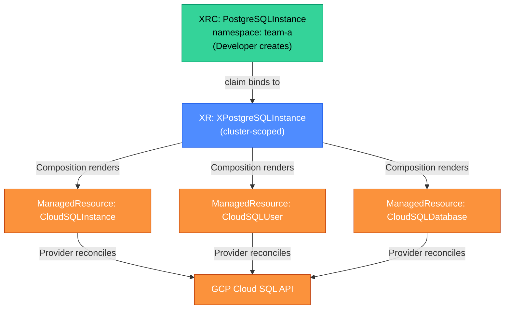

# Crossplane: Kubernetes-Native Infrastructure

Crossplane turns Kubernetes into a universal control plane for infrastructure. Instead of running Terraform pipelines to provision a Cloud SQL instance, a developer creates a Kubernetes custom resource — Crossplane reconciles it against the cloud API, just as the kube-controller-manager reconciles a Deployment against the kubelet. The result is infrastructure that follows Kubernetes semantics: declarative, self-healing, and auditable via `kubectl`.

<div class="quiz-progress" data-quiz-progress>
  <span class="quiz-progress-label">0/0 checks</span>
  <span class="quiz-progress-bar"><span class="quiz-progress-fill"></span></span>
</div>

---

## 1. Core Concepts

Crossplane introduces four resource types on top of standard Kubernetes:

| Resource | Role | Who creates it |
|---|---|---|
| **Provider** | Authenticates with a cloud (AWS, GCP, Azure) and registers CRDs | Platform team |
| **ManagedResource (MR)** | A 1:1 mapping to a cloud resource (e.g., CloudSQL instance, S3 bucket) | Crossplane / Composition |
| **Composite Resource Definition (XRD)** | Defines the schema for a new composite resource kind | Platform team |
| **Composition** | Maps a composite resource to one or more ManagedResources | Platform team |
| **CompositeResource (XR)** | An instance of the type defined by an XRD | Platform team or Composition |
| **CompositeResourceClaim (XRC)** | Namespace-scoped handle for a developer to request a CompositeResource | Developer |

The key split: **platform team defines the API** (XRD + Composition); **developers consume it** (XRC) without knowing anything about the underlying cloud resources.



<div class="quiz-card">
  <p class="quiz-q">A developer runs `kubectl apply -f postgres-claim.yaml` and a Cloud SQL instance appears in GCP 3 minutes later. Name the Crossplane components involved in this flow, in order.</p>
  <button class="quiz-reveal">Reveal answer</button>
  <div class="quiz-a" hidden>1. XRC (CompositeResourceClaim) — the developer's YAML. 2. XR (CompositeResource) — Crossplane creates this cluster-scoped object from the claim. 3. Composition — the platform team's mapping from XR to ManagedResources. 4. ManagedResources (CloudSQLInstance, CloudSQLUser, CloudSQLDatabase) — individual cloud resource representations. 5. GCP Provider — calls the GCP API to create the actual Cloud SQL instance. Each step is a Kubernetes reconcile loop; the 3-minute delay is mostly GCP provisioning time.</div>
</div>

---

## 2. Providers

A Provider is a Kubernetes controller that knows how to talk to one cloud or API. Upbound (the company behind Crossplane) maintains official providers:

- `provider-gcp`: GCP resources (CloudSQL, GCS, GKE, Pub/Sub, BigQuery)
- `provider-aws`: AWS resources (RDS, S3, EKS, SQS, DynamoDB)
- `provider-azure`: Azure resources
- `provider-helm`: Helm releases (yes, you can manage Helm releases as Kubernetes resources)
- `provider-kubernetes`: Kubernetes objects in another cluster

Installing a provider:

```yaml
apiVersion: pkg.crossplane.io/v1
kind: Provider
metadata:
  name: upbound-provider-gcp
spec:
  package: xpkg.upbound.io/upbound/provider-gcp:v0.36.0
  controllerConfigRef:
    name: provider-gcp-config
---
apiVersion: gcp.upbound.io/v1beta1
kind: ProviderConfig
metadata:
  name: default
spec:
  projectID: my-gcp-project
  credentials:
    source: InjectedIdentity  # use GKE Workload Identity
```

When the provider is installed, it registers hundreds of CRDs — one per cloud resource type (CloudSQLInstance, Bucket, Cluster, etc.).

<div class="quiz-card">
  <p class="quiz-q">A platform team installs `provider-gcp`. Immediately after, a developer runs `kubectl get crds | grep gcp.upbound.io` and sees hundreds of CRDs they didn't create. Where did they come from?</p>
  <button class="quiz-reveal">Reveal answer</button>
  <div class="quiz-a" hidden>The Crossplane provider package bundles CRDs for every GCP resource type it supports. Installing the Provider causes Crossplane to unpack the package and apply all bundled CRDs to the cluster. This is intentional: each CRD represents one GCP resource type (CloudSQLInstance, StorageBucket, PubSubTopic, etc.) so that users can create instances of any of them as Kubernetes resources. The CRDs are managed by the provider controller — updating the Provider version upgrades them.</div>
</div>

---

## 3. Composite Resource Definitions (XRDs)

An XRD defines a new API type — the schema that developers use to request infrastructure. It hides cloud-specific fields behind a domain-appropriate interface.

```yaml
apiVersion: apiextensions.crossplane.io/v1
kind: CompositeResourceDefinition
metadata:
  name: xpostgresqlinstances.database.acme.io
spec:
  group: database.acme.io
  names:
    kind: XPostgreSQLInstance
    plural: xpostgresqlinstances
  claimNames:
    kind: PostgreSQLInstance
    plural: postgresqlinstances
  versions:
    - name: v1alpha1
      served: true
      referenceable: true
      schema:
        openAPIV3Schema:
          type: object
          properties:
            spec:
              type: object
              properties:
                parameters:
                  type: object
                  properties:
                    storageGB:
                      type: integer
                      minimum: 10
                      maximum: 10000
                    tier:
                      type: string
                      enum: [small, medium, large]
                    region:
                      type: string
                  required: [storageGB, tier, region]
```

Key fields:
- `claimNames`: defines the namespace-scoped claim kind (`PostgreSQLInstance`). Developers use this.
- `names`: defines the cluster-scoped composite kind (`XPostgreSQLInstance`). Crossplane manages this.
- `schema`: the OpenAPI schema for the `spec.parameters` that developers fill in.

The XRD is the public API contract. Once published, changing its schema requires versioning (v1alpha1 → v1beta1) to avoid breaking existing claims.

<div class="quiz-card">
  <p class="quiz-q">The XRD above exposes `storageGB`, `tier`, and `region` to developers. The underlying GCP CloudSQL instance needs 15 additional configuration fields (backup window, maintenance window, labels, network, etc.). Where do those fields come from?</p>
  <button class="quiz-reveal">Reveal answer</button>
  <div class="quiz-a" hidden>From the Composition. The XRD only exposes the fields developers need. The Composition patches those developer-facing fields onto the ManagedResource, and also sets all the required GCP-specific fields directly (with hardcoded defaults). For example, the backup window might be hardcoded to "02:00" UTC, the maintenance window to a Saturday, and the network to the platform's VPC. Developers don't see or set these — they're the platform team's opinionated defaults, enforced consistently across every database the platform provisions.</div>
</div>

---

## 4. Compositions

A Composition maps a CompositeResource to one or more ManagedResources using patches and transforms.

```yaml
apiVersion: apiextensions.crossplane.io/v1
kind: Composition
metadata:
  name: xpostgresqlinstances.gcp.database.acme.io
  labels:
    provider: gcp
spec:
  compositeTypeRef:
    apiVersion: database.acme.io/v1alpha1
    kind: XPostgreSQLInstance
  resources:
    - name: cloudsql-instance
      base:
        apiVersion: sql.gcp.upbound.io/v1beta1
        kind: DatabaseInstance
        spec:
          forProvider:
            region: us-central1  # default; overridden by patch
            databaseVersion: POSTGRES_15
            settings:
              - tier: db-n1-standard-2  # overridden by patch
                diskSize: 20            # overridden by patch
                backupConfiguration:
                  - enabled: true
                    startTime: "02:00"
      patches:
        - type: FromCompositeFieldPath
          fromFieldPath: spec.parameters.region
          toFieldPath: spec.forProvider.region
        - type: FromCompositeFieldPath
          fromFieldPath: spec.parameters.storageGB
          toFieldPath: spec.forProvider.settings[0].diskSize
        - type: FromCompositeFieldPath
          fromFieldPath: spec.parameters.tier
          toFieldPath: spec.forProvider.settings[0].tier
          transforms:
            - type: map
              map:
                small:  db-n1-standard-1
                medium: db-n1-standard-2
                large:  db-n1-standard-4
```

### Patch types

| Type | Direction | Use case |
|---|---|---|
| `FromCompositeFieldPath` | XR → MR | Copy XR spec field to MR spec field |
| `ToCompositeFieldPath` | MR → XR | Write MR status back to XR status (e.g., connection endpoint) |
| `CombineFromComposite` | XR → MR | Combine multiple XR fields into one MR field |
| `PatchSet` | Reusable | Named set of patches applied to multiple resources |

### Transforms

Applied to a patch value before it reaches the destination:

- `map`: enum translation (small → db-n1-standard-1)
- `convert`: type coercion (string → integer)
- `string`: string formatting (`fmt: "%s-backup"`)
- `math`: arithmetic (multiply, add)

<div class="quiz-card">
  <p class="quiz-q">In the Composition above, the developer specifies `tier: large`. What value ends up in the CloudSQL `settings[0].tier` field, and which Composition feature is responsible for the translation?</p>
  <button class="quiz-reveal">Reveal answer</button>
  <div class="quiz-a" hidden>`db-n1-standard-4` — the `map` transform on the patch converts the human-readable `large` to the GCP-specific machine tier string. Without the transform, Crossplane would write `large` directly, which is not a valid CloudSQL tier value and would cause GCP to reject the resource. Transforms are how the Composition provides an abstraction: the XRD's API uses domain language (`small/medium/large`); the Composition translates to cloud-specific values.</div>
</div>

---

## 5. Crossplane vs Terraform

<div class="tab-group">
  <div class="tab-buttons">
    <button class="tab-btn active" data-tab="crossplane">Crossplane</button>
    <button class="tab-btn" data-tab="terraform">Terraform</button>
  </div>
  <div class="tab-panel active" data-tab-panel="crossplane">

**Crossplane strengths:**
- Lives in Kubernetes — same RBAC, audit log, and GitOps tooling as your apps.
- Continuous reconciliation: if someone manually deletes a CloudSQL instance, Crossplane recreates it within minutes. Terraform only reconciles when you run `apply`.
- Self-service for developers: a claim is a Kubernetes manifest, not a Terraform module invocation requiring pipeline access.
- Composition versioning: change the Composition without touching developer claims.
- Works with ArgoCD natively: `kubectl apply` is all you need.

**Crossplane weaknesses:**
- Steeper learning curve: XRDs, Compositions, Providers, patches — many moving parts.
- Provider coverage: some GCP/AWS resources are not yet covered or are behind `upbound-provider` vs `community-provider` gaps.
- State inspection: `terraform show` gives you a clear state view; Crossplane state is spread across many ManagedResource objects.
- Drift detection granularity: Terraform has mature import; Crossplane `crossplane beta convert` is newer.

  </div>
  <div class="tab-panel" data-tab-panel="terraform">

**Terraform strengths:**
- Mature ecosystem: every major cloud resource has a Terraform provider.
- Familiar to most platform engineers: HCL is widely known.
- `terraform plan` is a predictable diff — easy to review in PRs.
- State file: single file shows the full picture of managed resources.
- `terraform import` for bringing existing resources under management.

**Terraform weaknesses:**
- Not self-healing: if infrastructure drifts from state, `plan` shows it but nothing fixes it automatically.
- Developer self-service is hard: Terraform requires pipeline execution, not a `kubectl apply`.
- No native Kubernetes RBAC integration: credentials management is external.
- State locking: concurrent applies require a DynamoDB or GCS lock table.
- Module versioning: breaking changes in shared modules affect all consumers.

  </div>
</div>

**When to use each:**
- **Crossplane**: when developers need self-service cloud resources, when you want Kubernetes-native reconciliation, when you're building a platform with a developer-facing API.
- **Terraform**: when you have existing Terraform infrastructure and a small platform team, when your cloud resources require features the Crossplane provider doesn't yet support, or when your team has deep Terraform expertise.

Many organizations use both: Terraform for base infrastructure (VPCs, clusters, IAM), Crossplane for developer-facing resources (databases, message queues, object storage).

<div class="quiz-card">
  <p class="quiz-q">An engineer argues that Crossplane is just Terraform running inside Kubernetes. Why is this technically incorrect, and what's the architectural difference that matters most for reliability?</p>
  <button class="quiz-reveal">Reveal answer</button>
  <div class="quiz-a" hidden>Terraform is a state machine that runs to completion when you invoke it. Crossplane is a continuous reconcile loop: the Provider controller watches ManagedResources and continuously reconciles the cloud API to match the desired state. The reliability difference: if a cloud resource is deleted externally (human error, billing issue, cloud incident), Crossplane detects the divergence within its polling interval and recreates the resource automatically — no human intervention. Terraform only detects and fixes drift when someone explicitly runs `apply`. Crossplane's self-healing is a fundamentally different operational model.</div>
</div>

---

## 6. How a Composition Renders a Cloud Resource

<div class="stepper">
  <div class="stepper-header">
    <button class="stepper-prev" disabled>←</button>
    <span class="stepper-label">Step 1 of 5</span>
    <button class="stepper-next">→</button>
  </div>
  <div class="stepper-dots"></div>
  <div class="stepper-panels">
    <div class="stepper-panel active">

**Step 1 — Developer creates a claim**

```yaml
apiVersion: database.acme.io/v1alpha1
kind: PostgreSQLInstance
metadata:
  name: payments-db
  namespace: team-payments
spec:
  parameters:
    storageGB: 100
    tier: medium
    region: us-central1
  writeConnectionSecretToRef:
    name: payments-db-conn
```

`kubectl apply` posts this to the Kubernetes API server.

    </div>
    <div class="stepper-panel">

**Step 2 — Crossplane creates a Composite Resource**

The Crossplane core controller sees the XRC, finds the matching XRD, and creates a cluster-scoped `XPostgreSQLInstance` object. The XRC `status.conditions` shows `Synced: True` once the XR is created.

    </div>
    <div class="stepper-panel">

**Step 3 — Composition controller renders ManagedResources**

The Composition controller sees the XR, evaluates the Composition (applying patches and transforms), and creates the ManagedResources: `DatabaseInstance`, `DatabaseUser`, `Database`.

    </div>
    <div class="stepper-panel">

**Step 4 — Provider reconciles against the cloud API**

The GCP Provider controller watches `DatabaseInstance` ManagedResources. It calls `projects.instances.insert` on the Cloud SQL API. GCP provisions the instance (~2 minutes). The Provider updates `status.atProvider` with the instance's connection IP and other observed state.

    </div>
    <div class="stepper-panel">

**Step 5 — Connection secret written to namespace**

Once the ManagedResources are `Ready`, Crossplane patches the XR status and writes the connection secret (`payments-db-conn`) to the claim's namespace. The developer's pod can mount `payments-db-conn` as a `secretKeyRef`. No platform-team involvement.

    </div>
  </div>
</div>

<div class="quiz-card">
  <p class="quiz-q">A developer's `PostgreSQLInstance` claim is stuck at `Synced: False, Ready: False` for 10 minutes. What are the three most likely causes, in order of probability?</p>
  <button class="quiz-reveal">Reveal answer</button>
  <div class="quiz-a" hidden>1. **Composition missing or mis-labeled**: the Composition that should render this XR may not have the right `compositeTypeRef` or label selector — check `kubectl describe xpostgresqlinstance`. 2. **Provider credentials invalid or insufficient**: the GCP Provider's Workload Identity or service account key may lack `cloudsql.instances.create` IAM permission — check `kubectl describe databaseinstance`. 3. **Cloud quota**: GCP may have rejected the API call due to quota limits (Cloud SQL instance limit per project) — the ManagedResource event log will show the GCP API error message.</div>
</div>

---

## 7. External Secrets Integration

Crossplane and External Secrets Operator (ESO) complement each other:
- **Crossplane** provisions the cloud resource (CloudSQL instance, Redis, S3 bucket).
- **ESO** fetches credentials for that resource from a secrets manager (Vault, GCP Secret Manager) and injects them into Kubernetes Secrets.

The connection secret Crossplane writes (step 5 above) contains raw credentials. For production, it is common to:
1. Have the Composition write connection details to GCP Secret Manager (via a `provider-gcp` ManagedResource).
2. Have an `ExternalSecret` (ESO) sync those credentials into the application namespace.

This gives you: automatic secret rotation (ESO re-syncs on a schedule), centralized audit logging (all secret reads go through Secret Manager), and consistent secrets lifecycle.

<div class="quiz-card">
  <p class="quiz-q">Why would a team use both Crossplane connection secrets AND External Secrets Operator, rather than just using the Crossplane-written secret directly?</p>
  <button class="quiz-reveal">Reveal answer</button>
  <div class="quiz-a" hidden>Two main reasons: (1) **Rotation** — Crossplane writes the initial connection secret once at provisioning time. ESO continuously syncs from Secret Manager on a configurable interval, so if the password is rotated in Secret Manager (e.g., every 30 days), pods automatically get the new credentials without a redeploy. Crossplane's secret is static post-provisioning. (2) **Audit** — Secret Manager provides a full audit log of who read what secret and when. Kubernetes Secrets lack this. In regulated environments (PCI-DSS, SOC 2), this audit trail is required.</div>
</div>
