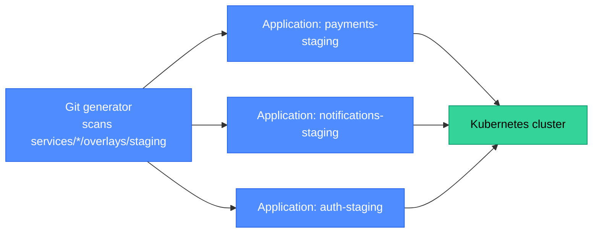
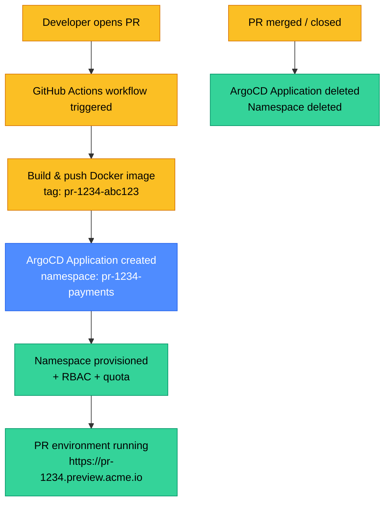
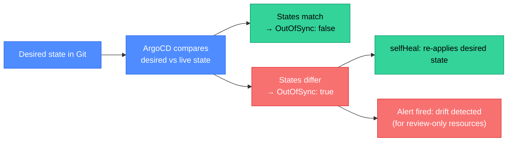

# Developer Self-Service: Namespaces, PR Environments, and GitOps Scaffolding

Self-service is the operational expression of the golden path. A developer should be able to go from "I need a new service" to "I have a working CI pipeline, a Kubernetes namespace, a staging deployment, and a registered Backstage entry" in under 15 minutes — without filing a single ticket. This page covers the concrete patterns that make that possible.

<div class="quiz-progress" data-quiz-progress>
  <span class="quiz-progress-label">0/0 checks</span>
  <span class="quiz-progress-bar"><span class="quiz-progress-fill"></span></span>
</div>

---

## 1. Namespace-Per-Team Provisioning

In a multi-team Kubernetes cluster, namespaces are the primary unit of isolation: RBAC, network policies, resource quotas, and LimitRanges are all namespace-scoped. Provisioning a namespace is not just creating a Kubernetes object — it is creating a full isolation boundary with the right defaults.

What namespace provisioning includes:
- The namespace itself.
- RBAC: `RoleBinding` giving the team's GitHub group `edit` access.
- `LimitRange`: default CPU/memory requests and limits for pods that don't specify them.
- `ResourceQuota`: maximum total CPU, memory, and object counts for the namespace.
- `NetworkPolicy`: default deny-all ingress from other namespaces; allow ingress from the ingress controller.
- `ImagePullSecret` or Workload Identity annotation for the container registry.
- ServiceAccount for CI/CD with `argocd.argoproj.io/managed-by` annotation.

### Namespace provisioning patterns

<div class="tab-group">
  <div class="tab-buttons">
    <button class="tab-btn active" data-tab="crossplane-ns">Crossplane</button>
    <button class="tab-btn" data-tab="backstage-ns">Backstage template</button>
    <button class="tab-btn" data-tab="gitops-ns">GitOps + kustomize</button>
  </div>
  <div class="tab-panel active" data-tab-panel="crossplane-ns">

**Crossplane `provider-kubernetes`**: define a Composition that renders Namespace + RBAC + Quota from a claim. Developer files a claim YAML; Crossplane reconciles everything.

```yaml
apiVersion: platform.acme.io/v1alpha1
kind: TeamNamespace
metadata:
  name: team-payments
  namespace: platform-claims
spec:
  parameters:
    teamName: payments
    githubTeam: acme/payments-team
    cpuQuota: "20"
    memoryQuota: "40Gi"
```

Advantage: continuous reconciliation — if someone deletes the NetworkPolicy, Crossplane restores it.

  </div>
  <div class="tab-panel" data-tab-panel="backstage-ns">

**Backstage Scaffolder template**: a template form that runs a backend action (`kubernetes:create-namespace`) with the right RBAC, quota, and network policy hardcoded in the action.

Advantage: familiar workflow (same UI as creating a new service), no Crossplane CRD maintenance.
Disadvantage: Backstage-created resources are not reconciled after creation — manual deletion is not auto-corrected.

  </div>
  <div class="tab-panel" data-tab-panel="gitops-ns">

**GitOps + kustomize overlay**: a central `namespaces/` directory in a platform GitOps repo. Each team gets a subdirectory:
```
namespaces/
  team-payments/
    namespace.yaml
    rbac.yaml
    quota.yaml
    network-policy.yaml
```
A PR to add a subdirectory is the "ticket" — reviewed and merged by the platform team, then ArgoCD applies it.

Advantage: git history shows every namespace change; easiest to audit.
Disadvantage: still requires a PR review — not fully self-service unless auto-merge is enabled for specific changes.

  </div>
</div>

<div class="quiz-card">
  <p class="quiz-q">A team deletes their `NetworkPolicy` accidentally using `kubectl delete`. Which of the three namespace provisioning patterns above would automatically restore it, and in what timeframe?</p>
  <button class="quiz-reveal">Reveal answer</button>
  <div class="quiz-a" hidden>Crossplane (`provider-kubernetes`) — it continuously reconciles ManagedResources representing the Namespace, RBAC, NetworkPolicy, and Quota against the cluster. After deletion, the Crossplane controller detects the divergence on its next poll (typically 1–5 minutes) and recreates the NetworkPolicy. The Backstage template and GitOps patterns do not reconcile after initial creation — the NetworkPolicy stays deleted until someone manually re-applies it or triggers a re-run.</div>
</div>

---

## 2. ArgoCD ApplicationSets

An ArgoCD `Application` represents one deployment. An `ApplicationSet` is a template that generates multiple Applications from a pattern — the same way a Deployment generates multiple Pods. This is the core mechanism for scaling GitOps across many teams and environments.

### Generators

The ApplicationSet controller uses **generators** to produce the list of Applications:

| Generator | How it works | Use case |
|---|---|---|
| **List** | Hardcoded list of parameters | Simple, fixed set of apps |
| **Cluster** | One app per registered ArgoCD cluster | Deploy to all clusters |
| **Git** | Scan a git directory; one app per subdirectory or file | Monorepo self-service |
| **Matrix** | Cartesian product of two generators | All apps × all environments |
| **Pull Request** | One app per open PR | PR preview environments |
| **SCM Provider** | Scan GitHub/GitLab org for repos | Auto-discover team services |

### Git generator (monorepo pattern)

```yaml
apiVersion: argoproj.io/v1alpha1
kind: ApplicationSet
metadata:
  name: team-services
  namespace: argocd
spec:
  generators:
    - git:
        repoURL: https://github.com/acme/platform-config
        revision: HEAD
        directories:
          - path: services/*/overlays/staging
  template:
    metadata:
      name: '{{path.basenameNormalized}}-staging'
    spec:
      project: team-services
      source:
        repoURL: https://github.com/acme/platform-config
        targetRevision: HEAD
        path: '{{path}}'
      destination:
        server: https://kubernetes.default.svc
        namespace: '{{path[1]}}-staging'
      syncPolicy:
        automated:
          prune: true
          selfHeal: true
```

When a team adds `services/payments/overlays/staging/kustomization.yaml`, the Git generator detects it on the next poll, generates a new Application, and ArgoCD deploys the service. No platform-team involvement.



<div class="quiz-card">
  <p class="quiz-q">The Git generator is configured to scan `services/*/overlays/staging`. A team creates `services/analytics/overlays/staging/kustomization.yaml`. How quickly is the new ArgoCD Application created, and what triggers it?</p>
  <button class="quiz-reveal">Reveal answer</button>
  <div class="quiz-a" hidden>The Git generator polls the repo on a configurable interval (default 3 minutes, configurable down to near-realtime via a webhook). When the push to main is processed — either by the poll cycle or a webhook from GitHub — the ApplicationSet controller detects the new matching path and generates a new `Application` object. ArgoCD then syncs it immediately (if auto-sync is configured). Total time: 3 minutes with polling, under 30 seconds with a GitHub webhook configured for the ArgoCD server.</div>
</div>

---

## 3. PR Preview Environments

A PR preview environment is an ephemeral deployment created automatically when a PR is opened and torn down when it is merged or closed. It lets reviewers test changes without pulling the branch locally.



### PR environment lifecycle

<div class="stepper">
  <div class="stepper-header">
    <button class="stepper-prev" disabled>←</button>
    <span class="stepper-label">Step 1 of 4</span>
    <button class="stepper-next">→</button>
  </div>
  <div class="stepper-dots"></div>
  <div class="stepper-panels">
    <div class="stepper-panel active">

**Step 1 — PR opened, CI builds image**

GitHub Actions detects `pull_request: [opened, synchronize]`. It builds the Docker image and pushes it with the tag `pr-{PR_NUMBER}-{SHA}`. CI posts a "Deploying..." comment on the PR.

    </div>
    <div class="stepper-panel">

**Step 2 — ArgoCD Application created (Pull Request generator)**

The ApplicationSet's Pull Request generator queries GitHub for open PRs. For each PR it finds, it generates an Application:

```yaml
spec:
  generators:
    - pullRequest:
        github:
          owner: acme
          repo: payments-service
          tokenRef:
            secretName: github-token
            key: token
  template:
    metadata:
      name: 'payments-pr-{{number}}'
    spec:
      destination:
        namespace: 'payments-pr-{{number}}'
      source:
        helm:
          values: |
            image.tag: "pr-{{number}}-{{head_sha}}"
```

    </div>
    <div class="stepper-panel">

**Step 3 — Environment is live**

ArgoCD syncs the Application. A namespace is created (either by the Composition triggered by a namespace claim in the Helm values, or by the ApplicationSet template's `CreateNamespace=true` sync option). The pod starts, an Ingress is created with host `pr-1234.preview.acme.io`. CI posts a comment with the preview URL.

    </div>
    <div class="stepper-panel">

**Step 4 — PR closed, environment torn down**

When the PR is merged or closed, the Pull Request generator no longer includes it. The ApplicationSet controller sees the Application should no longer exist and deletes it. ArgoCD pruning deletes the namespace (if `prune: true` and `CreateNamespace` was used). The preview URL returns 404 within seconds.

    </div>
  </div>
</div>

**Cost guardrails**: PR environments can accumulate if PRs are long-lived. Common guardrails:
- Automatic sleep after 4 hours of inactivity (scale replicas to 0; restore on next HTTP request via Argo Rollouts or KEDA).
- Hard TTL: environments older than 7 days are deleted even if the PR is open.
- Resource quotas on the `pr-*` namespaces (smaller than staging quotas).

<div class="quiz-card">
  <p class="quiz-q">A team has 20 open PRs. Their ArgoCD Pull Request generator is configured with `interval: 3m`. How many ArgoCD Applications exist, and what happens if a developer closes 5 PRs simultaneously?</p>
  <button class="quiz-reveal">Reveal answer</button>
  <div class="quiz-a" hidden>20 Applications exist — one per open PR. When 5 PRs are closed, the Pull Request generator's next poll (within 3 minutes) returns only 15 open PRs. The ApplicationSet controller computes the diff: 5 Applications that existed but are no longer in the generator output. With `syncPolicy.preserveResourcesOnDeletion: false`, those 5 Applications are deleted, triggering ArgoCD to prune their Kubernetes resources. The 5 namespaces, pods, and Ingresses are deleted within the next ArgoCD sync cycle.</div>
</div>

---

## 4. Drift Detection

Drift is when the actual state of infrastructure diverges from the declared state. Sources of drift:
- Manual `kubectl edit` or `kubectl patch` in production.
- A cloud console change that bypasses GitOps.
- A cloud provider auto-modifying a resource (e.g., GKE upgrading node pool annotations).

ArgoCD's `selfHeal: true` detects and corrects Kubernetes-level drift automatically. For cloud infrastructure:
- **Crossplane**: continuous reconciliation catches drift in the cloud API within 1–5 minutes.
- **Terraform**: drift is detected on `plan` but not auto-corrected (requires manual `apply` or CI trigger).

### Drift detection pipeline



**When NOT to auto-heal**: some resources (PodDisruptionBudgets, HorizontalPodAutoscalers during a scaling event) can legitimately diverge from git state temporarily. The ArgoCD `ignoreDifferences` configuration allows specifying fields to ignore in drift detection.

<div class="quiz-card">
  <p class="quiz-q">An on-call engineer manually runs `kubectl scale deployment payments-service --replicas=10` during an incident to handle a traffic spike. ArgoCD has `selfHeal: true`. What happens next, and was this the right operational pattern?</p>
  <button class="quiz-reveal">Reveal answer</button>
  <div class="quiz-a" hidden>Within ArgoCD's sync interval (default 3 minutes), it detects the deployment's replica count (10) differs from git (e.g., 3) and resets it back to 3. The manual scale is undone. This is the wrong operational pattern for emergencies — the right approach is either: (a) update the git repo quickly with the higher replica count, or (b) annotate the Application with `argocd.argoproj.io/refresh: hard` to skip auto-sync temporarily. For recurring traffic patterns, HPA should handle scaling automatically, making manual intervention unnecessary.</div>
</div>

---

## 5. Control Plane Patterns: Port, Humanitec, DIY

Two philosophical camps for building the self-service control plane:

<div class="tab-group">
  <div class="tab-buttons">
    <button class="tab-btn active" data-tab="diy">DIY (Backstage + Crossplane)</button>
    <button class="tab-btn" data-tab="saas">SaaS (Port / Humanitec)</button>
  </div>
  <div class="tab-panel active" data-tab-panel="diy">

**DIY with Backstage + Crossplane + ArgoCD:**
- Full control over every component.
- Backstage for the developer portal (catalog, templates, TechDocs).
- Crossplane for infrastructure provisioning.
- ArgoCD for GitOps deployments.
- Cost: ~2 platform engineers full-time to build and maintain.
- Time to first golden path: 2–4 months.
- Best for: orgs with strong Kubernetes expertise, specific compliance requirements, desire to avoid vendor lock-in.

  </div>
  <div class="tab-panel" data-tab-panel="saas">

**SaaS platform (Port / Humanitec / Cortex):**
- Pre-built developer portal with integrations for GitHub, Kubernetes, PagerDuty, etc.
- Platform team configures the tool rather than building from scratch.
- Cost: per-developer SaaS pricing ($15–30/dev/month typical).
- Time to first golden path: 2–4 weeks.
- Best for: smaller platform teams (< 3 engineers), fast time-to-value requirements, orgs that don't need deep customization.
- Trade-off: less control, vendor dependency, integration gaps for unusual toolchains.

  </div>
</div>

<div class="quiz-card">
  <p class="quiz-q">A startup with 50 developers and 1 platform engineer is considering building an IDP with Backstage + Crossplane. What is the strongest argument against this choice?</p>
  <button class="quiz-reveal">Reveal answer</button>
  <div class="quiz-a" hidden>One platform engineer cannot build and maintain Backstage + Crossplane + ArgoCD at acceptable quality while also supporting 50 developers. Backstage alone requires continuous plugin maintenance, upgrades, and customization. Crossplane requires building and testing Compositions for every infrastructure type. The opportunity cost is enormous — that engineer's time is spent on platform plumbing instead of the workflows that accelerate the engineering team. For 50 developers with 1 platform engineer, a SaaS solution (Port, Cortex, or a Backstage-as-a-service like Roadie) delivers value in weeks at a fraction of the engineering cost.</div>
</div>
